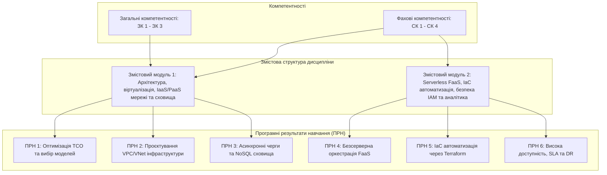

# РОБОЧА ПРОГРАМА ОСВІТНЬОГО КОМПОНЕНТА «Сучасні хмарні технології»

---

### 1. Опис освітнього компонента

Освітній компонент «Сучасні хмарні технології» посідає провідне місце в системі професійної підготовки магістрів за спеціальністю F7 «Комп’ютерна інженерія» (освітньо-професійна програма «Кіберфізичні системи»). Дисципліна спрямована на формування поглиблених теоретичних знань та прикладних інженерних компетентностей щодо архітектурних принципів побудови, конфігурування, автоматизованого розгортання, забезпечення безпеки та підтримки функціонування високонадійних масштабованих хмарних систем та сервісів. 

У контексті проєктування та експлуатації кіберфізичних систем хмарні платформи виступають центральним обчислювальним ядром для збирання, тривалого збереження, асинхронної обробки та інтелектуального аналізу потоків телеметричних даних від розподілених сенсорних мереж, роботизованих комплексів та промислових контролерів. Вивчення компонента базується на комплексному поєднанні вивчення моделей IaaS, PaaS, SaaS, безсерверних архітектур (FaaS/Serverless), парадигми «Інфраструктура як код» (IaC) та засобів забезпечення відмовостійкості й кібербезпеки.

| Найменування показників | Галузь знань, спеціальність, освітній рівень | Характеристика навчальної дисципліни |
| :--- | :--- | :--- |
| **Кількість кредитів ECTS:** 4 **Загальний обсяг годин:** 120 | **Галузь знань:** Інформаційні технології / Електроніка та телекомунікації **Спеціальність:** F7 «Комп’ютерна інженерія» | **Вид дисципліни:** Вибіркова (Цикл професійної підготовки) |
| **Модулів:** 1 **Змістових модулів:** 2 **Індивідуальне завдання:** Розрахунково-графічна робота (РГР) | **Освітня програма:** «Кіберфізичні системи» **Освітній рівень:** Другий (магістерський) рівень вищої освіти | **Рік підготовки:** 1-й **Семестр:** 1-й (осінній) |
| **Тижневих годин:** аудиторних — 2 год.; самостійної роботи — 5,5 год. | **Форма навчання:** Денна | **Лекції:** 14 год. **Практичні:** 0 год. **Лабораторні:** 18 год. **Самостійна робота:** 88 год. **Вид підсумкового контролю:** Диференційований залік |

Співвідношення кількості годин аудиторних занять до самостійної та індивідуальної роботи становить $32 / 88 \approx 1 : 2{,}75$.

---

### 2. Мета та завдання освітнього компонента

**Метою викладання освітнього компонента** є формування у здобувачів вищої освіти комплексу фундаментальних теоретичних знань і стійких практичних умінь щодо проєктування, алгоритмізації, оптимізації та автоматизованого керування хмарною інфраструктурою, використання розподілених сервісів збереження та обробки даних, розробки безсерверних мікросервісів та інтеграції хмарних ресурсів у гетерогенні кіберфізичні середовища.

**Основними завданнями освітнього компонента є:**
* Засвоєння фундаментальних концепцій хмарних обчислень, класифікаційних моделей NIST (IaaS, PaaS, SaaS, FaaS) та моделей розгортання систем (Public, Private, Hybrid, Community, Multi-cloud).
* Опанування математичних, фізичних та архітектурних засад апаратної віртуалізації процесорів x86/x64, функціонування монолітних і мікроядерних гіпервізорів, а також контейнеризації на рівні ядра операційної системи.
* Набуття практичних навичок конфігурування програмно-визначених хмарних мереж, систем адресації, маршрутизації та дворівневої фільтрації мережевого трафіку.
* Вивчення архітектурних моделей блокових, файлових та об'єктних хмарних сховищ, керування життєвим циклом даних і конфігурування механізмів реплікації телеметрії.
* Опанування патернів асинхронного обміну повідомленнями, функціонування брокерів черг, розподіленої публікації-підписки та моделей узгодженості даних BASE і ACID.
* Формування практичних умінь розробки безсерверних подійних мікросервісів та їхньої координації за допомогою спеціалізованих оркестраторів робочих процесів.
* Опанування парадигми «Інфраструктура як код» (IaC) за допомогою декларативних засобів автоматизації розгортання та побудови конвеєрів GitOps CI/CD.
* Засвоєння принципів архітектури нульової довіри (Zero-Trust), керування ідентифікацією та доступом (IAM), побудови комплексних систем спостережуваності та планів аварійного відновлення (Disaster Recovery).

---

### 3. У результаті вивчення освітнього компонента здобувач вищої освіти повинен:

**Знати:**
* Архітектурні принципи, економічні моделі (CapEx проти OpEx, TCO, Pay-as-you-go) та сутнісні характеристики хмарних обчислень відповідно до стандарту NIST SP 800-145.
* Математичні та алгоритмічні моделі апаратної віртуалізації процесорів Intel VT-x та AMD-V, організацію структур VMCS/VMCB, дворівневу трансляцію пам'яті SLAT (EPT/NPT) та буферизацію віртуального вводу/виводу VirtIO.
* Принципи побудови віртуальних приватних хмар (AWS VPC, Azure VNet), механізми трансляції адрес (NAT Gateway, IGW), правила функціонування Stateful Security Groups та Stateless Network ACL.
* Особливості функціонування об'єктних сховищ (AWS S3, Azure Blob), рівні зберігання (Hot, Cool, Archive), механізми забезпечення довговічності даних та політики реплікації (LRS, ZRS, GRS, RA-GRS).
* Теорію масового обслуговування у хмарних чергах повідомлень (AWS SQS, Azure Queue), принципи роботи таймауту видимості (Visibility Timeout), ізоляції збоїв через Dead-Letter Queues (DLQ) та патерни Pub/Sub (AWS SNS, Azure Event Grid).
* Внутрішню організацію безсерверних обчислень (FaaS), природу явища холодного старту (Cold Start), закон Літтла для визначення конкурентності та методики тарифікації за гігабайт-секунди.
* Синтаксис мови HCL інструменту HashiCorp Terraform, принципи керування графом залежностей DAG, призначення файлу стану `terraform.tfstate`, стратегії віддаленого блокування та протокол OpenID Connect (OIDC) у CI/CD.
* Метрики надійності та аварійного відновлення (RTO, RPO, MTBF, MTTR, MTTD), класичні стратегії Disaster Recovery та архітектуру політик безпеки IAM на базі моделей RBAC та ABAC.

**Уміти:**
* Програмно взаємодіяти з хмарними сервісами через інтерфейси командного рядка (CLI) та бібліотеки SDK (Python Boto3, Azure SDK) для автоматизації життєвого циклу інстансів.
* Розраховувати адресний простір, проєктувати та конфігурувати багатошарові ізольовані віртуальні мережі, таблиці маршрутизації та шлюзи доступу.
* Проєктувати схеми нереляційних баз даних NoSQL (DynamoDB, Azure Table Storage) із вибором оптимальних ключів партиціонування (PartitionKey, SortKey) для усунення «гарячих партицій».
* Розробляти та інтегрувати асинхронні брокери повідомлень і черги для буферизації та згладжування піків телеметрії від сенсорних мереж кіберфізичних систем.
* Створювати, тестувати та розгортати безсерверні функції (AWS Lambda, Azure Functions) на мові Python для обробки подій у режимі майже реального часу.
* Описувати та розгортати цілісні конфігурації хмарної інфраструктури за допомогою модульного коду Terraform із використанням віддаленого шифрованого бекенду та блокування.
* Налаштовувати системи наскрізної спостережуваності (AWS CloudWatch, CloudTrail, Azure Monitor), проектувати порогові та статистичні алерти й пов'язувати їх з автоматичними діями відновлення.
* Проєктувати архітектури високої доступності з балансуванням навантаження (ALB), еластичним авто-масштабуванням (Auto Scaling Groups) та планами відновлення після катастроф.

**Формовані компетентності та програмні результати навчання (ПРН):**
* **Загальні компетентності (ЗК):**
  * Здатність до абстрактного мислення, системного аналізу та синтезу при проєктуванні складних комп'ютеризованих комплексів (ЗК 1).
  * Здатність застосовувати фундаментальні та прикладні знання інформаційних технологій на практиці (ЗК 2).
  * Здатність генерувати нові технічні ідеї, приймати обґрунтовані інженерні рішення в умовах невизначеності та неповних даних (ЗК 3).
* **Спеціальні (фахові) компетентності (СК):**
  * Здатність проєктувати, впроваджувати та оптимізувати обчислювальну й мережеву інфраструктуру кіберфізичних систем на базі хмарних платформ (СК 1).
  * Здатність використовувати технології віртуалізації, контейнеризації та безсерверних обчислень для побудови масштабованих сервісів (СК 2).
  * Здатність реалізовувати автоматизоване управління інфраструктурою за парадигмою «Інфраструктура як код» та інтегрувати її в конвеєри CI/CD (СК 3).
  * Здатність проєктувати системи комплексної безпеки, автентифікації, аудиту та безперервності функціонування критичних хмарних сервісів (СК 4).
* **Програмні результати навчання (ПРН):**
  * ПРН 1: Вміти обґрунтовувати вибір моделей хмарного обслуговування та розгортання для оптимізації сукупної вартості володіння (TCO) кіберфізичних систем.
  * ПРН 2: Вміти розгортати ізольовану віртуальну мережеву інфраструктуру з багаторівневим захистом та інтеграцією гібридних каналів передавання даних.
  * ПРН 3: Вміти створювати розподілені конвеєри асинхронної обробки телеметрії з використанням хмарних черг, топіків публікації-підписки та NoSQL сховищ.
  * ПРН 4: Вміти розробляти безсерверні мікросервісні архітектури та оркеструвати складні багатоетапні бізнес-процеси за допомогою кінцевих автоматів і патерну Saga.
  * ПРН 5: Вміти автоматизувати розгортання хмарних ресурсів за допомогою декларативних маніфестів Terraform у конвеєрах GitOps.
  * ПРН 6: Вміти аналізувати показники надійності (RTO, RPO, SLA) та конфігурувати системи моніторингу й автоматичного масштабування для забезпечення відмовостійкості.

*Рисунок 1 — Структурно-логічна схема зв'язку компетентностей, модулів дисципліни та програмних результатів навчання*

---

### 4. Програма навчальної дисципліни

#### Модуль 1. Основи архітектури, проектування та автоматизації хмарних систем

#### Змістовий модуль 1. Архітектура хмарних систем, віртуалізація та базові IaaS/PaaS сервіси

* **Тема 1. Парадигма хмарних обчислень та моделі обслуговування.**
  Еволюційний розвиток розподілених обчислювальних систем: від жорстко централізованих мейнфреймів і систем розподілу часу (time-sharing) крізь еру персональних комп'ютерів, клієнт-серверних дворівневих систем, високопродуктивних кластерів (проєкт Beowulf) та Grid-інфраструктур (Globus Toolkit, віртуальні організації) до сучасної концепції Cloud Computing. Стандартизоване визначення хмарних обчислень за стандартом NIST SP 800-145. Фундаментальні сутнісні характеристики хмари: самообслуговування на вимогу, широкий мережевий доступ, об'єднання ресурсів у пул (мультитенантність), миттєва еластичність та вимірюваність сервісів. Базові сервісні моделі класичної тріади SPI: Інфраструктура як послуга (IaaS), Платформа як послуга (PaaS), Програмне забезпечення як послуга (SaaS). Моделі розгортання: публічні, приватні, гібридні та громадські хмари, концепція Cloudbursting. Економічний базис хмари: комунальні обчислення (Utility Computing), трансформація капітальних витрат (CapEx) в операційні витрати (OpEx), аналітичне моделювання сукупної вартості володіння (TCO), показник енергоефективності дата-центрів PUE. Моделі тарифікації обчислювальних інстансів: On-Demand, Reserved Instances / Savings Plans та Spot Instances.

* **Тема 2. Технології віртуалізації та системні гіпервізори.**
  Теоретичний базис системної віртуалізації: критерії Попека — Голдберга та їхнє порушення в класичній архітектурі процесорів x86 (проблема 17 чутливих непривілейованих інструкцій). Історичні підходи до повної віртуалізації: динамічна двійкова трансляція (Binary Translation). Апаратна віртуалізація (HVM): розширення наборів інструкцій Intel VT-x та AMD-V, двовимірний простір режимів виконання VMX Root та VMX Non-Root, структура керування віртуальною машиною VMCS/VMCB, життєвий цикл переходів VM-Entry та VM-Exit. Дворівнева трансляція сторінок пам'яті SLAT (Intel EPT, AMD NPT) проти тіньових таблиць сторінок. Класифікація гіпервізорів за Робертом Голдбергом: перший тип (Bare-Metal) проти другого типу (Hosted). Архітектурні моделі гіпервізорів першого типу: монолітна архітектура (VMware ESXi), мікроядерна архітектура (Microsoft Hyper-V із шиною VMBus та розділами Parent/Child), модульна архітектура Linux KVM. Концепція паравіртуалізації (Xen, домени Dom0/DomU). Стандарт абстракції віртуального вводу/виводу VirtIO: структура кільцевих буферів Virtqueue (Descriptor Table, Available Ring, Used Ring), драйвери `virtio-net` та `virtio-blk`. Віртуалізація рівня ядра (контейнеризація): простори імен Linux (PID, NET, MNT, IPC, UTS, USER, CGROUP) та контрольні групи (cgroups v1/v2), багатошарові файлові системи OverlayFS з механізмом Copy-on-Write. Мережеві системи зберігання даних (СЗД) у віртуалізації: Fibre Channel SAN (протокол FCP, ідентифікатори WWNN/WWPN, зонування та LUN Masking), протокол iSCSI (IP SAN, адресація IQN, Jumbo Frames), паралельні мережеві файлові системи (NFS v4.1 pNFS), блейд-сервери (правило «1-2-3-4», пасивні об'єднуючі панелі Midplane) та гіперконвергентна інфраструктура (HCI / SDS).

* **Тема 3. Хмарні мережі та системи збереження даних (IaaS Storage & Databases).**
  Програмно-конфігуровані мережі (SDN) як основа хмарної комутації: відокремлення Control Plane від Data Plane, технології накладених оверлейних мереж (VXLAN, Geneve, VNI). Проєктування ізольованих хмарних мереж (AWS VPC, Azure VNet), принципи безкласової адресації CIDR (RFC 1918), топологія публічних та приватних підмереж, резервування системних IP-адрес платформою. Таблиці маршрутизації (Route Tables), правило Longest Prefix Match, Інтернет-шлюзи (IGW) та керовані шлюзи трансляції адрес (NAT Gateway). Дворівнева безпека мережі: групи безпеки (Security Groups, stateful фільтрація, таблиця conntrack) проти мережевих списків контролю доступу (NACL, stateless фільтрація за пріоритетом правил, діапазони ефемерних портів 1024–65535). Організація гібридних з'єднань: Site-to-Site IPsec VPN (IKEv2, AES-GCM) та виділені фізичні канали (AWS Direct Connect, Azure ExpressRoute, 802.1Q VLAN, BGP). Моделі хмарних сховищ: блокові диски (AWS EBS, Azure Managed Disks, класифікація SSD gp3/io2), спільні файлові сховища (AWS EFS, Azure Files) та об'єктні сховища (AWS S3, Azure Blob Storage). Структура об'єкта (Key, Payload, Metadata), протокол взаємодії RESTful HTTP (GET, PUT, DELETE, HEAD), політики життєвого циклу (Lifecycle Rules), рівні зберігання (Hot, Cool, Glacier/Archive). Моделі реплікації та відмовостійкості: LRS, ZRS, GRS, RA-GRS, розрахунок довговічності даних («11 дев'яток»). Хмарні бази даних як керовані сервіси (DBaaS): реляційні СУБД (AWS RDS, Multi-AZ синхронне розгортання, репліки читання, відокремлення сховища в Amazon Aurora) та розподілені NoSQL бази даних (AWS DynamoDB, Azure Cosmos DB / Table Storage), вибір ключів партиціонування (PartitionKey, SortKey) для усунення гарячих партицій, розрахунок одиниць пропускної здатності RCU/WCU, оптимістичне блокування за допомогою ETag.

#### Змістовий модуль 2. Безсерверні обчислення, Інфраструктура як код (IaC), безпека та аналітика

* **Тема 4. Асинхронні комунікації та брокери черг повідомлень.**
  Архітектурні стилі взаємодії компонентів розподілених систем: синхронний підхід (REST, gRPC) та його обмеження (просторова, часова та синхронізаційна зв'язність, небезпека каскадних збоїв, вичерпання пулів з'єднань). Асинхронна парадигма обміну повідомленнями (Message-Oriented Middleware, EDA): просторова та часова декомпозиція, моделі взаємодії «виробник–споживач» (Producer-Consumer) та «публікація–підписка» (Publish-Subscribe). Хмарні черги повідомлень (AWS SQS, Azure Queue Storage): стандартні черги з доставкою «щонайменше один раз» (At-least-once) та вимога ідемпотентності обробки, черги суворого порядку FIFO з гарантією доставки «рівно один раз» (Exactly-once), параметри дедуплікації Message Deduplication ID та групування Message Group ID. Повний життєвий цикл повідомлення в черзі: операції запису (Enqueue), вичитування (Receive), таймаут видимості (Visibility Timeout), видалення за квитанцією ReceiptHandle / PopReceipt, час життя повідомлення MessageTTL. Механізми обробки аномалій: лічильники спроб обробки, ізоляція отруйних повідомлень (Poison Pills) за допомогою черг недоставлених повідомлень (Dead-Letter Queues, DLQ), політики Redrive Policy. Застосування теорії масового обслуговування ($M/M/k$) до розрахунку довжини черг та параметрів видимості. Патерни масового розгалуження (Fan-out) за допомогою сервісів публікації-підписки (AWS SNS, Azure Service Bus Topics, Azure Event Grid), декларативна фільтрація повідомлень за атрибутами JSON на рівні брокера. Буферизація та згладжування піків навантаження (Traffic Spikes / Peak Shaving) у кіберфізичних системах. Моделі узгодженості даних: теорема CAP Еріка Брюера, сувора узгодженість ACID проти моделі доступності в кінцевому підсумку BASE (Basically Available, Soft-state, Eventual consistency).

* **Тема 5. Безсерверна архітектура (Serverless / FaaS) та мікросервіси.**
  Концептуальні засади безсерверних обчислень (Serverless) та моделі «Функція як послуга» (FaaS). Чотири принципи Serverless Manifesto: повна відсутність адміністрування серверів, оплата виключно за час обчислень (Pay-for-Value), автоматичне еластичне масштабування від нуля запитів, вбудована відмовостійкість. Життєвий цикл безсерверної функції: обробка подій (Handler), фази ініціалізації мікроконтейнера. Проблема «холодного старту» (Cold Start): затримки алокації MicroVM, завантаження кодового пакета, старту runtime та виконання глобального коду ініціалізації. Методи мінімізації Cold Start: оптимізація розміру бандлів, вибір середовищ виконання (Go/Rust проти Node.js/Python та JVM), використання постійно прогрітих інстансів (Provisioned Concurrency). Порівняльний аналіз провідних платформ FaaS: AWS Lambda на базі MicroVM Firecracker, Azure Functions (плани Consumption, Premium, Dedicated), Google Cloud Functions v2 на базі Knative та gVisor. Класифікація джерел подій (тригерів): синхронні (API Gateway, ALB), асинхронні (S3/Blob, SNS, EventBridge) та потокові поллери (SQS, DynamoDB Streams, Kafka). Декларативні вхідні та вихідні прив'язки (Input/Output Bindings) у платформі Azure. Моделі масштабування: закон Літтла для розрахунку конкурентності, керування пулами конкурентності (Account Limit, Reserved Concurrency, Unreserved Pool), механізми дроселювання (Throttling, HTTP 429). Математична модель тарифікації FaaS за кількість викликів та гігабайт-секунди із дискретністю в 1 мілісекунду, розрахунок точки беззбитковості (Break-Even Point) між FaaS та IaaS. Оркестрація безсерверних процесів: проблеми управління станом (Statelessness), декларативні кінцеві автомати AWS Step Functions (мова ASL), програмна оркестрація Azure Durable Functions на основі патерну Event Sourcing. Реалізація патернів Saga (компенсуючі транзакції при відмовах пристроїв КФС), Retry з експоненційним відступом та джитером (Exponential Backoff with Full Jitter), Fan-out/Fan-in (Scatter-Gather).

* **Тема 6. Автоматизація інфраструктури: Інфраструктура як код (IaC) та CI/CD.**
  Парадигма «Інфраструктура як код» (Infrastructure as Code, IaC) як основа сучасної хмарної інженерії. Проблеми ручного адміністрування (ClickOps) та розходження конфігурацій (Configuration Drift). Порівняння імперативного (процедурного) та декларативного підходів до виділення ресурсів. Алгебраїчна та системна сутність ідемпотентності маніфестів, оператор узгодження конфігурацій (Reconciliation Operator). Мультихмарний інструмент HashiCorp Terraform: архітектура Terraform Core та взаємодія з плагінами-провайдерами через RPC. Структурні блоки мови HCL (`terraform`, `provider`, `resource`, `data`, `variable`, `output`, `locals`, `module`). Побудова та топологічне сортування спрямованого ациклічного графа залежностей (DAG), розрахунок критичного шляху виконання. Файл стану інфраструктури (`terraform.tfstate`): призначення, загрози витоку секретів, правила безпечного зберігання у віддаленому бекенді (Remote Backend на базі AWS S3 / Azure Blob) із серверним шифруванням, версійністю та механізмами блокування стану (State Locking через AWS DynamoDB або Azure Blob Lease). Нативні інструменти провайдерів: AWS CloudFormation (стеки, StackSets, Change Sets, автоматичний відкат), Azure Resource Manager та мова Bicep (транспіляція в ARM JSON, відсутність потреби у файлі стану), Google Cloud Deployment Manager. Інтеграція IaC у конвеєри безперервної інтеграції та розгортання (CI/CD) за концепцією GitOps на базі GitHub Actions та GitLab CI: етапи синтаксичного контролю (`fmt`, `validate`), лінтування (TFLint), статичного аналізу безпеки SAST (tfsec, Checkov), оцінки вартості змін (Infracost) та інтеграційного тестування (Terratest). Забезпечення безпечної автентифікації раннерів CI/CD за допомогою протоколу OpenID Connect (OIDC) та тимчасових ролей IAM без використання статичних секретів.

* **Тема 7. Безпека (IAM), моніторинг, Disaster Recovery та хмарна аналітика.**
  Модель спільної відповідальності за безпеку (Shared Responsibility Model) та розмежування зон «безпека самої хмари» (провайдер) і «безпека всередині хмари» (споживач) у розрізі моделей IaaS, PaaS, SaaS та Serverless. Архітектура нульової довіри (Zero-Trust) та принцип найменших привілеїв (PoLP) для кіберфізичних комплексів. Служба керування ідентифікацією та доступом (IAM): користувачі, групи, ролі, JSON-структура політик доступу (`Effect`, `Action`, `Resource`, `Condition`). Порівняння моделей рольового доступу (RBAC) та атрибутивного динамічного контролю (ABAC). Делегування прав та генерація короткоживучих токенів через службу безпеки токенів (AWS STS / Azure Managed Identities), булева логіка обробки політик (пріоритет Explicit Deny). Тріада спостережуваності (Observability): числові метрики (CloudWatch Metrics, Azure Monitor), структуровані журнали подій (CloudWatch Logs Insights, Azure Log Analytics KQL), наскрізні розподілені трейси транзакцій (AWS X-Ray, Application Insights, OpenTelemetry). Аудит викликів API та подій безпеки (AWS CloudTrail, Azure Activity Log). Налаштування статичних тригерів тривог (Alarms) та статистичних моделей виявлення аномалій (Z-score), підключення автоматичних дій відновлення (Auto-remediation) та вплив на показники MTBF, MTTD і MTTR. Стратегії безперервності бізнесу та аварійного відновлення (BCDR): цільова точка відновлення (RPO) та цільовий час відновлення (RTO). Чотири класичні стратегії Disaster Recovery: Backup and Restore, Pilot Light, Warm Standby, Multi-Region Active-Active. Сервіс реплікації та оркестрації аварійного перемикання Azure Site Recovery (ASR, сервери Process/Configuration Server, Failover/Failback). Огляд хмарних сервісів аналітики великих даних (Big Data): керовані кластери Apache Spark/Hadoop (AWS EMR), безсерверні інтерактивні SQL-рушії над сховищами даних (AWS Athena з форматом Apache Parquet), хмарні сховища даних (Google BigQuery). Організація повного життєвого циклу машинного навчання (MLOps) на платформах AWS SageMaker та Azure Machine Learning: підготовка ознак (Feature Store), розподілене тренування на GPU-кластерах, хостинг моделей на кінцевих точках інференсу та моніторинг зсуву даних (Data Drift за індексом стабільності популяції PSI).

---

### 5. Структура освітнього компонента

| Назва змістових модулів і тем | Усього годин | Лекції | Практичні | Лабораторні | Самостійна робота |
| :--- | :---: | :---: | :---: | :---: | :---: |
| **Змістовий модуль 1. Архітектура хмарних систем, віртуалізація та базові IaaS/PaaS сервіси** | | | | | |
| Тема 1. Парадигма хмарних обчислень та моделі обслуговування. | 14 | 2 | 0 | 2 | 10 |
| Тема 2. Технології віртуалізації та системні гіпервізори. | 14 | 2 | 0 | 2 | 10 |
| Тема 3. Хмарні мережі та системи збереження даних (IaaS Storage & Databases). | 18 | 2 | 0 | 4 | 12 |
| **Усього за змістовим модулем 1** | **46** | **6** | **0** | **8** | **32** |
| **Змістовий модуль 2. Безсерверні обчислення, Інфраструктура як код (IaC), безпека та аналітика** | | | | | |
| Тема 4. Асинхронні комунікації та брокери черг повідомлень. | 14 | 2 | 0 | 2 | 10 |
| Тема 5. Безсерверна архітектура (Serverless / FaaS) та мікросервіси. | 14 | 2 | 0 | 2 | 10 |
| Тема 6. Автоматизація інфраструктури: Інфраструктура як код (IaC) та CI/CD. | 14 | 2 | 0 | 2 | 10 |
| Тема 7. Безпека (IAM), моніторинг, Disaster Recovery та хмарна аналітика. | 18 | 2 | 0 | 4 | 12 |
| **Усього за змістовим модулем 2** | **60** | **8** | **0** | **10** | **42** |
| **Виконання індивідуального завдання (Розрахунково-графічна робота)** | **14** | **0** | **0** | **0** | **14** |
| **УСЬОГО ГОДИН** | **120** | **14** | **0** | **18** | **88** |

---

### 6. Теми лабораторних робіт

| № з/п | Назва теми лабораторної роботи | Кількість годин |
| :---: | :--- | :---: |
| 1 | **ЛБ № 1.** Програмне керування та автоматизація життєвого циклу інстансів IaaS (AWS EC2 / Azure VM) засобами Cloud CLI та Python SDK. | 2 |
| 2 | **ЛБ № 2.** Проєктування та налаштування ізольованої віртуальної мережевої інфраструктури (VPC / VNet, Subnets, Route Tables, Security Groups). | 2 |
| 3 | **ЛБ № 3.** Реалізація масштабованого об'єктного сховища (AWS S3 / Azure Blob) з політиками доступу, версійністю та шифруванням. | 2 |
| 4 | **ЛБ № 4.** Інтеграція хмарних NoSQL та керованих реляційних баз даних (DynamoDB / Azure Tables / RDS) через Python SDK. | 2 |
| 5 | **ЛБ № 5.** Побудова асинхронної черги обробки подій та повідомлень між вузлами кіберфізичної системи на базі AWS SQS / Azure Service Bus. | 2 |
| 6 | **ЛБ № 6.** Розробка та розгортання безсерверних мікросервісів (AWS Lambda / Azure Functions) на мові Python для обробки даних датчиків. | 2 |
| 7 | **ЛБ № 7.** Автоматизоване розгортання повної інфраструктури хмарного застосунку за допомогою HashiCorp Terraform. | 2 |
| 8 | **ЛБ № 8.** Налаштування безпеки (IAM), ролей доступу та комплексного моніторингу метрик/алертів (CloudWatch / Azure Monitor). | 2 |
| 9 | **ЛБ № 9.** Проєктування відмовостійкої архітектури з балансуванням навантаження (ALB), автоматичним масштабуванням (Auto Scaling) та Disaster Recovery. | 2 |
| | **Усього годин** | **18** |

---

### 7. Теми практичних (семінарських) занять

Навчальним планом підготовки магістрів за спеціальністю F7 «Комп’ютерна інженерія» (ОПП «Кіберфізичні системи») проведення окремих практичних занять **не передбачено** (0 годин). Усі прикладні розрахункові, алгоритмічні та інженерні завдання повністю інтегровані до змісту лабораторних робіт (18 год) та самостійної розрахунково-проєктної діяльності здобувачів у межах виконання розрахунково-графічної роботи (РГР).

---

### 8. Самостійна робота

| № з/п | Назва теми для самостійного опрацювання та короткий зміст робіт | Кількість годин СР |
| :---: | :--- | :---: |
| 1 | **Тема 1. Поглиблений аналіз стандартів NIST SP 800-145 та ISO/IEC 17788.** Опрацювання нормативної бази та таксономії хмарних обчислень. Порівняльний аналіз пропрієтарних платформ (AWS, Azure, GCP) та відкритих рішень для приватних хмар (OpenStack, Apache CloudStack, Proxmox VE). Моделювання зміни сукупної вартості володіння (TCO) кіберфізичних систем при переході від On-Premises до Public Cloud. Підготовка до лабораторної роботи № 1. | 10 |
| 2 | **Тема 2. Дослідження внутрішніх архітектур апаратної віртуалізації.** Вивчення мікрокоманд керування структурами VMCS/VMCB, дослідження механізмів трансляції адрес EPT/NPT та аналіз накладних витрат перемикання контексту гіпервізорів ESXi, Hyper-V та KVM. Дослідження підсистем ядра Linux для контейнеризації: налаштування просторів імен (Namespaces) та лімітів cgroups v2. Підготовка до лабораторної роботи № 2. | 10 |
| 3 | **Тема 3. Проєктування хмарних мереж та сховищ для великих обсягів телеметрії.** Розрахунок параметрів мережевої адресації VLSM/CIDR для багаторівневих віртуальних приватних мереж. Аналіз протоколів гібридного підключення (Direct Connect, ExpressRoute) та порівняння алгоритмів шифрування IPsec. Оптимізація структур зберігання в NoSQL базах даних часових рядів (Time-Series Data). Підготовка до лабораторних робіт № 3 та № 4. | 12 |
| 4 | **Тема 4. Моделювання систем масового обслуговування на базі хмарних черг.** Застосування моделей Кендалла ($M/M/k$) для аналізу пропускної здатності черг SQS/Queue Storage під час пікових сплесків трафіку (Traffic Spikes). Реалізація патернів ідемпотентної обробки повідомлень та налаштування політик Dead-Letter Queue (DLQ). Порівняння протоколів AMQP 1.0 та MQTT. Підготовка до лабораторної роботи № 5. | 10 |
| 5 | **Тема 5. Патерни мікросервісної та безсерверної архітектури.** Дослідження механізмів мінімізації холодного старту (Cold Start) функцій FaaS. Проєктування розподілених транзакцій на базі патерну Saga та кінцевих автоматів AWS Step Functions / Azure Durable Functions. Реалізація алгоритмів повторних спроб із експоненційним відступом та джитером (Full Jitter). Підготовка до лабораторної роботи № 6. | 10 |
| 6 | **Тема 6. Глибоке вивчення синтаксису HashiCorp HCL та автоматизації CI/CD.** Проєктування модульних конфігурацій Terraform. Дослідження механізмів віддаленого зберігання стану (S3 + DynamoDB locking) та безпечної безпарольної автентифікації раннерів через протокол OpenID Connect (OIDC). Інтеграція інструментів статичного аналізу безпеки (Checkov, tfsec) у конвеєри GitHub Actions. Підготовка до лабораторної роботи № 7. | 10 |
| 7 | **Тема 7. Проєктування систем високої доступності, безпеки та хмарної аналітики.** Побудова матриць авторизації IAM (RBAC/ABAC) за принципом найменших привілеїв (PoLP). Розрахунок показників надійності та доступності складних систем (SLA, RTO, RPO, MTBF, MTTR). Порівняльний аналіз безсерверних SQL-рушіїв (AWS Athena, Google BigQuery) при обробці паркет-файлів Data Lake. Підготовка до лабораторних робіт № 8 та № 9. | 12 |
| 8 | **Індивідуальне завдання: Виконання Розрахунково-графічної роботи (РГР).** Системне проєктування, розрахунок топології мережі, вибір сервісів обчислення й збереження даних, програмна реалізація безсерверних мікросервісів обробки телеметрії, написання повного комплекту коду Terraform (IaC), оформлення розрахунково-пояснювальної записки та захист проєкту. | 14 |
| | **Усього годин** | **88** |

---

### 9. Методи навчання

Викладання освітнього компонента базується на гармонійному поєднанні традиційних академічних та інноваційних студентоцентрованих методів навчання:
* **Словесні та наочні методи:** Проблемні лекції з використанням мультимедійних презентацій, структурно-логічних схем, діаграм послідовності Mermaid та демонстрації архітектурних рішень безпосередньо у хмарних консолях керування провідних провайдерів (AWS, Azure, GCP).
* **Практичні та дослідницькі методи:** Лабораторні роботи дослідницького характеру, під час яких кожен здобувач вищої освіти індивідуально налаштовує хмарні ресурси, пише програмний код автоматизації на Python із використанням офіційних SDK та декларативні маніфести Terraform, тестуючи працездатність у реальному хмарному середовищі.
* **Метод проблемного навчання та кейс-метод (Case Study):** Аналіз реальних промислових аварійних ситуацій (Outages), розбір системних інцидентів витоку даних через некоректні IAM-політики та моделювання сценаріїв відновлення після збоїв (Disaster Recovery).
* **Проєктно-орієнтоване навчання (Project-Based Learning):** Наскрізне виконання індивідуальної розрахунково-графічної роботи, де кожен етап теоретичного матеріалу послідовно трансформується в конкретний модуль інженерного проєкту власної кіберфізичної системи.
* **Змішане та дистанційне навчання:** Використання електронних освітніх платформ (Moodle, Google Workspace for Education, GitHub Classroom) для отримання методичних матеріалів, автоматизованої перевірки лабораторних робіт та зворотного зв'язку.

---

### 10. Методи контролю

Система оцінювання результатів навчання здобувачів вищої освіти є накопичувальною, прозорою та охоплює такі форми контролю:

1. **Поточний контроль:**
   * Оцінювання активності та результатів експрес-опитувань під час лекційних занять.
   * Контроль виконання та індивідуальний усний/практичний захист кожної з 9 лабораторних робіт (перевірка працездатності коду, демонстрація результатів у хмарі, відповіді на контрольні запитання).
2. **Модульний (проміжний) контроль:**
   * Проведення двох модульних контрольних робіт (МКР 1 та МКР 2) у формі комплексного комп'ютерного тестування та виконання інженерно-розрахункових завдань наприкінці кожного змістового модуля.
3. **Контроль виконання індивідуального завдання:**
   * Рецензування розрахунково-пояснювальної записки РГР, перевірка інфраструктурного коду в Git-репозиторії та публічний захист проєкту перед комісією/викладачем.
4. **Підсумковий семестровий контроль (Диференційований залік):**
   * Здобувач вищої освіти отримує підсумкову оцінку як суму балів, набраних протягом семестру за всіма видами навчальної діяльності, за умови обов'язкового успішного виконання та захисту всіх лабораторних робіт і розрахунково-графічної роботи. У разі необхідності підвищення рейтингу або за наявності академічної заборгованості залік складається у формі виконання комплексного контрольного завдання.

---

### 11. Розподіл балів, які отримують здобувачі за темами

| Вид занять / Контрольні заходи | Змістовий модуль 1 | | | Змістовий модуль 2 | | | | Підсумковий контроль | Сума балів |
| :--- | :---: | :---: | :---: | :---: | :---: | :---: | :---: | :---: | :---: |
| | **Т1** | **Т2** | **Т3** | **Т4** | **Т5** | **Т6** | **Т7** | | |
| **Активність на лекціях / експрес-контроль** | 2 | 2 | 2 | 2 | 2 | 2 | 2 | — | **14** |
| **Виконання та захист лабораторних робіт** | 4 (ЛБ1) | 4 (ЛБ2) | 8 (ЛБ3,4) | 4 (ЛБ5) | 4 (ЛБ6) | 4 (ЛБ7) | 8 (ЛБ8,9) | — | **36** |
| **Модульний контроль (МКР 1 / МКР 2)** | — | — | 10 | — | — | — | 10 | — | **20** |
| **Індивідуальне завдання (РГР)** | — | — | — | — | — | — | 15 | — | **15** |
| **Підсумковий семестровий контроль (Диф. залік)** | — | — | — | — | — | — | — | 15 | **15** |
| **Усього за змістовими блоками** | **6** | **6** | **20** | **6** | **6** | **6** | **35** | **15** | **100** |

---

### 12. Розподіл балів, які отримують здобувачі за видами занять

| Вид навчальної роботи та контрольного заходу, розрахункова формула | Максимальний бал |
| :--- | :---: |
| **Опрацювання теоретичного матеріалу лекцій та експрес-опитування:** Усього 7 тем лекцій. Оцінювання активності за 1 тему — **2 бали** ($7 \times 2 = 14$). | **14** |
| **Виконання та індивідуальний захист лабораторних робіт:** Усього 9 лабораторних робіт. Оцінювання 1 роботи — **4 бали** ($9 \times 4 = 36$). | **36** |
| **Модульний контроль знань (МКР):** Усього 2 модульні контрольні роботи (після ЗМ1 та ЗМ2). За 1 МКР — **10 балів** ($2 \times 10 = 20$). | **20** |
| **Виконання та публічний захист індивідуального завдання (РГР):** Комплексне оцінювання пояснювальної записки, коду Terraform/Python та доповіді. | **15** |
| **Підсумковий семестровий контроль (Диференційований залік):** Письмово-практична залікова робота (теоретичні питання та практичний кейс). | **15** |
| **УСЬОГО БАЛІВ ЗА ОСВІТНІЙ КОМПОНЕНТ:** | **100** |

---

### 13. Критерії оцінювання

#### 13.1. Критерії оцінювання лабораторних робіт та поточного контролю

* **4 бали (Відмінно):** Лабораторна робота виконана в повному обсязі відповідно до індивідуального варіанта. Програмний код на Python або маніфести Terraform повністю працездатні, структуровані, містять необхідні коментарі та реалізують обробку виключень. Здобувач демонструє глибоке розуміння теоретичного базису, вільно орієнтується в архітектурі використаних хмарних сервісів, грамотно пояснює результати виконання та аргументовано відповідає на всі контрольні запитання викладача.
* **3 бали (Добре):** Робота виконана повністю, ресурси успішно розгорнуті в хмарі, проте в коді чи конфігурації присутні незначні недоліки (наприклад, відсутність оптимізації параметрів, дрібні зауваження до оформлення звіту). Здобувач правильно відповідає на більшість контрольних запитань, але припускається неточностей у поясненні деталей низькорівневих механізмів.
* **2 бали (Задовільно):** Робота виконана частково (не менше ніж на 70% від вимог завдання), основний функціонал реалізовано, але присутні помилки конфігурації або відсутня обробка позаштатних станів. Здобувач відчуває труднощі під час захисту коду, дає неповні або невпевнені відповіді на контрольні запитання.
* **0–1 бал (Незадовільно):** Робота не виконана або виконана менше ніж на 70%, вихідний код непрацездатний, присутні грубі помилки в архітектурі, здобувач не може пояснити логіку роботи створених ресурсів або порушив вимоги академічної доброчесності (плагіат). Робота повертається на доопрацювання.

#### 13.2. Критерії оцінювання розрахунково-графічної роботи (РГР)

Оцінювання індивідуального завдання (РГР, максимально 15 балів) здійснюється комплексно за такими структурними складовими:

| Об'єкт оцінювання РГР | Критерії відповідності | Макс. бали |
| :--- | :--- | :---: |
| **Технічна якість та архітектура проєкту** | Повнота розрахунку мережевого простору (CIDR), коректність вибору сервісів (IaaS/PaaS/FaaS/DBaaS), обґрунтованість рішень щодо відмовостійкості (Multi-AZ, Auto Scaling) та безпеки (IAM, Security Groups). | **5** |
| **Якість програмного та інфраструктурного коду** | Модульність та ідемпотентність HCL-коду Terraform, коректність налаштування віддаленого бекенду та блокування, чистота та працездатність Python-скриптів. | **4** |
| **Оформлення розрахунково-пояснювальної записки** | Відповідність вимогам ДСТУ, наявність вичерпних діаграм архітектури й топології, коректність математичних розрахунків TCO, RTO, RPO та SLA. | **3** |
| **Публічний захист та академічна доброчесність** | Чіткість доповіді, вільне володіння матеріалом проєкту, аргументовані відповіді на запитання, відсутність плагіату. | **3** |
| **Усього за РГР:** | | **15** |

#### 13.3. Критерії оцінювання підсумкового контролю (диференційованого заліку)

Залікове завдання складається з двох теоретичних питань (по 5 балів кожне) та однієї комплексної практично-розрахункової задачі на проєктування або аналіз хмарної архітектури (5 балів):
* **13–15 балів (Відмінно):** Вичерпні, глибокі, системні відповіді на теоретичні питання з демонстрацією розуміння причинно-наслідкових зв'язків; бездоганне розв'язання практичної задачі з точним розрахунком параметрів інфраструктури.
* **10–12 балів (Добре):** Повні та правильні відповіді на питання, правильний хід розв'язання задачі, але присутні незначні неточності в термінології чи другорядних числових розрахунках.
* **6–9 балів (Задовільно):** Фрагментарні відповіді на теоретичні питання, що розкривають лише базову суть без глибокого аналізу; задача розв'язана частково або з помилками в розрахунку пропускної здатності чи виборі сервісів.
* **1–5 балів (Незадовільно):** Грубі помилки в основах теорії хмарних обчислень, повне нерозуміння архітектурних принципів, практична задача не розв'язана.

---

### 14. Шкала оцінювання: національна та ECTS

| Сума балів за всі види навчальної діяльності | Оцінка ECTS | Оцінка за національною шкалою (диференційований залік) |
| :---: | :---: | :--- |
| **90–100** | **A** | **Відмінно** — теоретичний зміст курсу освоєно повністю, необхідні практичні навички роботи з хмарними сервісами сформовані бездоганно, всі завдання виконані на високому інженерному рівні. |
| **82–89** | **B** | **Добре** — зміст курсу освоєно на високому рівні, практичні навички сформовані, більшість завдань виконано без суттєвих зауважень. |
| **75–81** | **C** | **Добре** — здобувач володіє основним матеріалом, виконує завдання із незначними помилками, які здатний самостійно виправити. |
| **64–74** | **D** | **Задовільно** — базовий матеріал засвоєно на мінімально достатньому рівні, практичні завдання виконані за типовими шаблонами із зауваженнями. |
| **60–63** | **E** | **Задовільно** — знання та вміння задовольняють мінімальні критерії програмних результатів навчання, присутні суттєві прогалини в аналітичній частині. |
| **35–59** | **FX** | **Незадовільно з можливістю повторного складання** — не виконано обов'язковий мінімум лабораторних робіт або залікового завдання, необхідне доопрацювання матеріалу та повторне складання. |
| **1–34** | **F** | **Незадовільно з обов'язковим повторним вивченням** — грубе невиконання навчального плану, що вимагає повторного проходження освітнього компонента. |

---

### 15. Рекомендована література та інформаційні ресурси

**Основна література:**
1. Олексюк В. П., Спірін О. М. Основи хмарних технологій : навч. посіб. Київ : ІЦО НАПН України, 2023. 188 с. DOI: https://doi.org/10.33407/lib.NAES.737845.
2. Юрчишин В. Я. Хмарні та Грід-технології. Конспект лекцій : навч. посіб. для студ. спец. 121 «Інженерія програмного забезпечення». Київ : КПІ ім. Ігоря Сікорського, 2022. 245 с.
3. Зінченко О. В., Прокопов С. В., Сєрих С. О., Василенко В. В., Березівський М. Ю. Хмарні технології : навч. посіб. Київ : ФОП Гуляєва В. М., 2020. 74 с.
4. Ількевич Н. С. Хмарні технології в освіті : навч.-метод. посіб. для студентів фіз.-мат. фак. Житомир : Вид-во ЖДУ ім. Івана Франка, 2021. 88 с.
5. Sbarcea B. AWS Certified Solutions Architect Associate All-in-One Guide. Birmingham : Packt Publishing, 2023. 680 p.
6. Brikman Y. Terraform: Up & Running: Writing Infrastructure as Code. 3rd ed. Sebastopol : O'Reilly Media, 2022. 450 p.

**Додаткова література:**
1. Mell P., Grance T. The NIST Definition of Cloud Computing: Recommendations of the National Institute of Standards and Technology. NIST Special Publication 800-145. Gaithersburg : NIST, 2011. 7 p. DOI: https://doi.org/10.6028/NIST.SP.800-145.
2. Спірін О. М., Олексюк В. П., Балик Н. Р., Литвинова С. Г., Сидоренко С. В. Розгортання та адміністрування хмарної платформи Google Workspace for Education у закладі вищої освіти. *Інформаційні технології і засоби навчання*. 2022. Т. 92, № 6. С. 172–197. DOI: https://doi.org/10.33407/itlt.v92i6.5078.
3. Burns B. Designing Distributed Systems: Patterns and Paradigms for Scalable, Reliable Services. Sebastopol : O'Reilly Media, 2018. 166 p.
4. Sbarski E., Kroonenburg S. Serverless Architectures on AWS. 2nd ed. Shelter Island : Manning Publications, 2022. 432 p.

**Інформаційні ресурси в Інтернеті:**
1. Офіційна технічна документація Amazon Web Services (AWS Documentation) — URL: https://docs.aws.amazon.com/
2. Офіційний портал документації Microsoft Azure (Microsoft Learn) — URL: https://learn.microsoft.com/en-us/azure/
3. Документація платформи Google Cloud (GCP Documentation) — URL: https://cloud.google.com/docs
4. Офіційний портал документації HashiCorp Terraform Registry & Docs — URL: https://developer.hashicorp.com/terraform/docs
5. Стандарти та публікації Cloud Native Computing Foundation (CNCF) — URL: https://www.cncf.io/
6. Портал моніторингу та відкритих проєктів OpenStack — URL: https://docs.openstack.org/