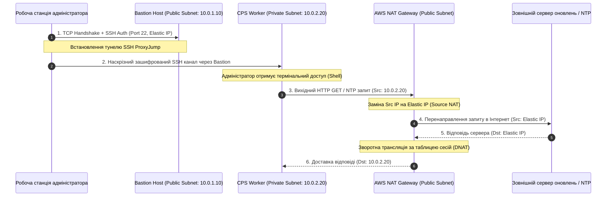

# Лабораторна робота № 2. Проєктування та налаштування ізольованої віртуальної мережевої інфраструктури та захищеного Bastion Host

**Мета:** Дослідження фундаментальних принципів функціонування програмно-конфігурованих мереж (SDN) у хмарних середовищах, здобуття практичних навичок проєктування багаторівневої ізольованої топології Virtual Private Cloud (AWS VPC), конфігурування публічних і приватних підмереж, таблиць маршрутизації, шлюзів доступу (Internet Gateway, NAT Gateway), реалізації багаторівневого захисту за допомогою Security Groups і Network ACL, а також розгортання та тестування захищеного вузла доступу (Bastion Host / Jump Box) для адміністрування приватних обчислювальних ресурсів кіберфізичних систем.

**Стек технологій та інструменти:**
* **Мова програмування та середовище автоматизації:** Python 3.10+ (CPython), віртуальне оточення `venv`.
* **Платформа та бібліотеки:** Хмарна платформа Amazon Web Services (AWS), SDK-бібліотека `boto3` (v1.34+), `botocore` (v1.34+), утиліта форматування таблиць `tabulate` (v0.9+).
* **Інструменти розробки та діагностики:** AWS CLI v2, клієнт OpenSSH (з підтримкою SSH Agent Forwarding та ProxyJump), утиліти мережевого тестування Linux (`traceroute`, `netcat`, `curl`, `iproute2`, `dig`).

---

## 1 Теоретичні відомості

У сучасних хмарних обчислювальних центрах фізична мережева інфраструктура повністю абстрагована за допомогою технологій **програмно-конфігурованих мереж (Software-Defined Networking, SDN)**. Замість статичного комутаційного обладнання та фізичного розведення кабелів віртуальне середовище функціонує на базі накладених мереж (**Overlay Networks**), які використовують протокол інкапсуляції **VXLAN (Virtual Extensible LAN)** або **Geneve**. 

Кадри канального рівня (Layer 2) інкапсулюються у стандартні UDP-пакети базової фізичної мережі дата-центру (**Underlay Network**), що дозволяє створювати мільйони повністю ізольованих віртуальних мереж із довільною адресацією поверх спільної апаратної комутаційної фабрики.

Базовим логічним доменом ізоляції обчислювальних ресурсів у хмарі є **віртуальна приватна хмара (Virtual Private Cloud, AWS VPC)** або **віртуальна мережа (Azure VNet)**. Віртуальна приватна хмара являє собою виділену приватну мережу, прив'язану до певного географічного регіону провайдера. При створенні VPC виділяється первинний блок адрес на основі стандарту безкласової адресації (**CIDR — Classless Inter-Domain Routing**) згідно з міжнародною специфікацією RFC 1918 для приватних мереж (наприклад, `10.0.0.0/16`, що надає $2^{16} = 65536$ адрес).

```mermaid
flowchart TD
    subgraph CloudVPC ["Хмарна віртуальна мережа (VPC: 10.0.0.0/16)"]
        subgraph PublicSubnet ["Публічна підмережа (Public Subnet: 10.0.1.0/24, AZ: eu-central-1a)"]
            Bastion[Bastion Host / Jump Box<br/>Public IP: 3.120.10.5<br/>Private IP: 10.0.1.10]
            NAT_GW[AWS NAT Gateway<br/>Elastic IP: 3.120.10.99<br/>Private IP: 10.0.1.50]
        end

        subgraph PrivateSubnet ["Приватна підмережа (Private Subnet: 10.0.2.0/24, AZ: eu-central-1a)"]
            Worker[CPS Worker Node / Sensor Aggregator<br/>Public IP: Немає<br/>Private IP: 10.0.2.20]
        end

        IGW[Internet Gateway<br/>Двосторонній Static 1:1 NAT]
        
        RT_Pub[Таблиця маршрутизації Public RT<br/>10.0.0.0/16 -> local<br/>0.0.0.0/0 -> igw-id]
        RT_Priv[Таблиця маршрутизації Private RT<br/>10.0.0.0/16 -> local<br/>0.0.0.0/0 -> nat-gw-id]
    end

    Internet((Мережа Інтернет)) <===> IGW
    AdminLaptop[Робоча станція адміністратора] ===>|1. SSH Вхідний трафік (Port 22)| Bastion
    Bastion ===>|2. Внутрішній SSH перехід (ProxyJump)| Worker
    
    IGW <===> PublicSubnet
    PublicSubnet -.-> RT_Pub
    PrivateSubnet -.-> RT_Priv
    
    Worker ===>|3. Вихідна телеметрія / Оновлення| NAT_GW
    NAT_GW ===>|4. Вихідний SNAT через EIP| IGW
```
*Рисунок 1.1 — Топологія дворівневої ізольованої хмарної мережі з публічною та приватною підмережами, шлюзами доступу та сервером-бастіоном*

Внутрішній адресний простір VPC фрагментується на дискретні сегменти — **підмережі (Subnets)**, кожна з яких фізично розміщується у конкретній зоні доступності (**Availability Zone, AZ**). 

У хмарній інженерії підмережі суворо класифікуються на два типи:
* **Публічні підмережі (Public Subnets).** Підмережі, чия асоційована таблиця маршрутизації містить маршрут за замовчуванням (`0.0.0.0/0`), спрямований на **Інтернет-шлюз (Internet Gateway, IGW)**. Вузли у такій підмережі можуть отримувати публічні IP-адреси та безпосередньо взаємодіяти з Інтернетом через двостороннє статичне транслювання адрес (1:1 NAT).
* **Приватні підмережі (Private Subnets).** Підмережі, які не мають прямого маршруту до Internet Gateway. Віртуальні машини в таких підмережах володіють виключно приватними IP-адресами, що робить їх повністю невидимими та недосяжними для несанкціонованого сканування із зовнішніх мереж.

Під час розрахунку адресного простору підмереж діє обов'язкове правило резервування системних адрес. У будь-якій підмережі хмари AWS перші чотири IP-адреси та остання адреса блоку зарезервовані провайдером для службових потреб:
1. Адреса з індексом `.0` — базовий номер мережі (Network Address).
2. Адреса з індексом `.1` — адреса віртуального маршрутизатора VPC (VPC Router).
3. Адреса з індексом `.2` — адреса внутрішнього DNS-сервера (Amazon Provided DNS).
4. Адреса з індексом `.3` — зарезервовано платформою для майбутнього функціоналу.
5. Остання адреса діапазону (наприклад, `.255` для `/24`) — широкомовна адреса (Broadcast Address).

Кількість корисних IP-адрес $N_{\text{usable}}$, доступних для призначення інтерфейсам віртуальних машин у підмережі з довжиною маски $M$ біт, розраховується за формулою:

$$N_{\text{usable}} = 2^{(32 - M)} - 5$$

де $M$ — довжина префікса маски підмережі у форматі CIDR ($16 \le M \le 28$). Наприклад, для підмережі `10.0.1.0/24` ($M = 24$) загальна кількість адрес становить $2^8 = 256$, а число корисних адрес дорівнює $N_{\text{usable}} = 256 - 5 = 251$.

Умова безаварійного розбиття кореневого простору VPC із маскою $M_{\text{VPC}}$ на множину з $k$ підмереж із масками $M_i$ вимагає виконання закону збереження адресного простору без перекриття діапазонів:

$$\sum_{i=1}^{k} 2^{(32 - M_i)} \le 2^{(32 - M_{\text{VPC}})}$$

Керування трафіком забезпечують віртуальні **таблиці маршрутизації (Route Tables)**. Маршрутизатор VPC аналізує IP-пакети відповідно до алгоритму найдовшого префіксного збігу (**Longest Prefix Match**). Локальний маршрут (наприклад, `10.0.0.0/16 -> local`) завжди створюється автоматично та володіє найвищим пріоритетом для обміну трафіком всередині VPC. 

Для надання приватним інстансам можливості ініціювати вихідні підключення до Інтернету (наприклад, для надсилання звітів телеметрії в зовнішні API або завантаження оновлень безпеки) без надання їм публічних адрес, у публічній підмережі розгортається керований **шлюз трансляції мережевих адрес (NAT Gateway)**. Шлюз NAT прив'язується до статичної публічної адреси **Elastic IP (EIP)** та виконує динамічну заміну вихідних адрес клієнтських пакетів (**Source NAT / PAT**).

Безпека мережевої взаємодії реалізується на двох рубежах:
1. **Групи безпеки (Security Groups, SG).** Віртуальний міжмережевий екран рівня мережевого адаптера (vNIC / ENI). Працює за принципом **Stateful** (із фіксацією стану з'єднань): якщо вхідний пакет дозволено правилом Ingress, зворотний трафік відповіді автоматично пропускається через таблицю `conntrack` незалежно від вихідних правил Egress. Містить виключно дозволяючі правила (**Allow-only**).
2. **Мережеві списки контролю доступу (Network ACL, NACL).** Міжмережевий екран периметра підмережі. Працює за принципом **Stateless** (без збереження стану): вхідний та вихідний трафік фільтруються абсолютно незалежно, що вимагає обов'язкового явного відкриття діапазону **ефемерних портів (1024–65535)** для зворотних відповідей. Правила обробляються строго послідовно за номерами від 1 до 32766 до першого збігу та підтримують явні заборони (**Deny**).


*Рисунок 1.2 — Діаграма послідовності встановлення захищеного тунелю SSH ProxyJump та проходження вихідного трафіку через NAT Gateway*

Для безпечного адміністрування ізольованих вузлів приватної підмережі застосовується патерн **Bastion Host (Jump Box)**. Сервер-бастіон розгортається у публічній підмережі з мінімальним набором системних служб та суворо обмеженими правилами Security Group, які дозволяють вхідний доступ виключно за протоколом SSH (порт 22) з довірених IP-адрес адміністратора. 

Приватні вузли налаштовуються так, що їхня група безпеки дозволяє вхідний SSH-трафік **виключно від групи безпеки Bastion Host**. Доступ реалізується за технологією **SSH ProxyJump** (`ssh -J`), за якої автентифікаційні ключі зберігаються лише на локальній машині інженера та не копіюються на проміжний сервер-бастіон.

---

## 2 Підготовка середовища та розгортання проєкту (Крок 0)

Перед початком проектування та програмного розгортання мережевої інфраструктури необхідно підготувати робочу директорію, налаштувати віртуальне середовище мови Python, встановити необхідні бібліотеки та перевірити конфігурацію облікових даних доступу до хмарної платформи.

### 2.1 Перевірка інструментів та створення робочої директорії

Відкрийте емулятор терміналу та перевірте версії встановленого програмного забезпечення:

```bash
python3 --version
aws --version
ssh -V
```

Створіть робочу ієрархію каталогів лабораторної роботи та активуйте ізольоване віртуальне середовище:

```bash
mkdir -p ~/cloud_labs/lab2_vpc_network
cd ~/cloud_labs/lab2_vpc_network
python3 -m venv venv
source venv/bin/activate
```

Сформуйте файлову структуру проєкту відповідно до такої схеми:

```text
lab2_vpc_network/
├── config/
│   └── network_schema.json     # Специфікація параметрів мережі та підмереж
├── scripts/
│   ├── __init__.py
│   ├── vpc_builder.py          # Модуль низькорівневого розгортання VPC/Subnets/Gateways
│   └── network_diagnostics.py  # Модуль верифікації зв'язності та таблиць маршрутизації
├── output/
│   ├── network_state.json      # Згенерований стан ідентифікаторів ресурсів
│   └── routing_report.txt      # Текстовий звіт перевірки маршрутів
├── requirements.txt            # Залежності Python
└── deploy_network.py           # Головний виконуваний скрипт оркестрації
```

Створіть файл `requirements.txt`:

```text
boto3>=1.34.0
botocore>=1.34.0
tabulate>=0.9.0
```

Виконайте інсталяцію бібліотек:

```bash
pip install --upgrade pip
pip install -r requirements.txt
```

### 2.2 Налаштування облікових записів та перевірка прав доступу

Перевірте коректність налаштування активного профілю AWS CLI за допомогою виклику служби STS:

```bash
aws sts get-caller-identity
```

У разі роботи в середовищі AWS Academy або за використання виділеного навчального профілю встановіть цільовий регіон розгортання:

```bash
aws configure set default.region "eu-central-1"
aws configure set default.output_format "json"
```

---

## 3 Порядок виконання роботи

### 3.1 Індивідуальні завдання

Здобувач вищої освіти обирає індивідуальний варіант згідно зі своїм номером у списку академічної групи. Необхідно спроєктувати та програмно розгорнути повну мережеву інфраструктуру VPC відповідно до адресних блоків, зон доступності та параметрів безпеки, наведених у таблиці 3.1.

*Таблиця 3.1 — Специфікація індивідуальних параметрів мережевої інфраструктури*

| Варіант | Адресний простір VPC (CIDR) | Публічна підмережа (CIDR / AZ) | Приватна підмережа (CIDR / AZ) | Цільовий сервіс КФС у приватній зоні | Додатковий порт Ingress у SG Worker |
| :---: | :--- | :--- | :--- | :--- | :---: |
| **1** | `10.10.0.0/16` | `10.10.1.0/24` (eu-central-1a) | `10.10.10.0/24` (eu-central-1a) | SCADA Master Gateway | TCP 502 (Modbus) |
| **2** | `10.20.0.0/16` | `10.20.1.0/24` (eu-central-1b) | `10.20.20.0/24` (eu-central-1b) | MQTT Broker Node | TCP 1883 (MQTT) |
| **3** | `10.30.0.0/16` | `10.30.2.0/24` (eu-central-1a) | `10.30.50.0/24` (eu-central-1a) | OPC UA Industrial Server | TCP 4840 (OPC UA) |
| **4** | `172.16.0.0/16` | `172.16.1.0/24` (eu-central-1b) | `172.16.100.0/24` (eu-central-1b) | CoAP Sensor Concentrator | UDP 5683 (CoAP) |
| **5** | `172.17.0.0/16` | `172.17.10.0/24` (eu-central-1a) | `172.17.20.0/24` (eu-central-1a) | InfluxDB Telemetry Core | TCP 8086 (HTTP API) |
| **6** | `172.18.0.0/16` | `172.18.5.0/24` (eu-central-1c) | `172.18.15.0/24` (eu-central-1c) | RTSP Camera Stream Processor | TCP 554 (RTSP) |
| **7** | `192.168.0.0/16` | `192.168.1.0/24` (eu-central-1a) | `192.168.10.0/24` (eu-central-1a) | Robotic Arm PLC Controller | TCP 2000 (Proprietary) |
| **8** | `10.40.0.0/16` | `10.40.1.0/24` (eu-central-1b) | `10.40.2.0/24` (eu-central-1b) | Redis In-Memory State DB | TCP 6379 (Redis) |
| **9** | `10.50.0.0/16` | `10.50.10.0/24` (eu-central-1a) | `10.50.30.0/24` (eu-central-1a) | BACnet Smart Building Hub | UDP 47808 (BACnet) |
| **10** | `172.19.0.0/16` | `172.19.1.0/24` (eu-central-1b) | `172.19.80.0/24` (eu-central-1b) | Prometheus Node Exporter | TCP 9100 (Metrics) |
| **11** | `192.168.0.0/16` | `192.168.100.0/24` (eu-central-1c) | `192.168.200.0/24` (eu-central-1c) | CAN-over-Ethernet Gateway | UDP 20001 (Raw CAN) |
| **12** | `10.60.0.0/16` | `10.60.1.0/24` (eu-central-1a) | `10.60.40.0/24` (eu-central-1a) | Smart Grid Phasor Unit | TCP 4712 (IEEE C37.118) |
| **13** | `172.20.0.0/16` | `172.20.10.0/24` (eu-central-1b) | `172.20.30.0/24` (eu-central-1b) | DNP3 Utility Substation | TCP 20000 (DNP3) |
| **14** | `10.70.0.0/16` | `10.70.2.0/24` (eu-central-1c) | `10.70.20.0/24` (eu-central-1c) | Digital Twin Simulation Core | TCP 9000 (gRPC) |
| **15** | `172.21.0.0/16` | `172.21.1.0/24` (eu-central-1a) | `172.21.50.0/24` (eu-central-1a) | OTA Firmware Update Server | TCP 8443 (HTTPS) |
| **16** | `192.168.0.0/16` | `192.168.20.0/24` (eu-central-1b) | `192.168.30.0/24` (eu-central-1b) | LoRaWAN Network Server | UDP 1700 (Semtech GW) |
| **17** | `10.80.0.0/16` | `10.80.1.0/24` (eu-central-1a) | `10.80.100.0/24` (eu-central-1a) | Medical Vital Telemetry Hub | TCP 8883 (MQTTS) |
| **18** | `172.22.0.0/16` | `172.22.5.0/24` (eu-central-1c) | `172.22.25.0/24` (eu-central-1c) | Automated Guided Vehicle DB | TCP 27017 (MongoDB) |
| **19** | `10.90.0.0/16` | `10.90.10.0/24` (eu-central-1b) | `10.90.90.0/24` (eu-central-1b) | Real-time Edge ML Node | TCP 8000 (FastAPI) |
| **20** | `172.23.0.0/16` | `172.23.1.0/24` (eu-central-1a) | `172.23.70.0/24` (eu-central-1a) | Environmental Sensor Logger | TCP 3306 (MySQL) |

---

### 3.2 Покроковий алгоритм та розв'язок еталонного прикладу

У цьому підрозділі наведено повний базовий еталонний розв'язок для створення VPC з адресним простором `10.0.0.0/16`, публічною підмережею `10.0.1.0/24`, приватною підмережею `10.0.2.0/24`, повним комплектом шлюзів (IGW, NAT Gateway), таблиць маршрутизації, пар ключів та двох інстансів (Bastion Host і Private Worker).

#### Крок 1. Створення файлу конфігурації мережі `config/network_schema.json`

Створіть файл конфігурації із повним описом мережевих блоків:

```json
{
  "region": "eu-central-1",
  "vpc_cidr": "10.0.0.0/16",
  "vpc_name": "cps-reference-vpc",
  "public_subnet": {
    "cidr": "10.0.1.0/24",
    "az": "eu-central-1a",
    "name": "cps-public-subnet-1a"
  },
  "private_subnet": {
    "cidr": "10.0.2.0/24",
    "az": "eu-central-1a",
    "name": "cps-private-subnet-1a"
  },
  "ami_id": "ami-0faab6bdbac9486fb",
  "instance_type": "t3.micro",
  "key_name": "cps-lab2-key",
  "custom_port": 8080
}
```

#### Крок 2. Реалізація модуля побудови інфраструктури `scripts/vpc_builder.py`

Створіть скрипт автоматизованого розгортання компонентів VPC:

```python
import os
import json
import time
from typing import Dict, Any
import boto3
from botocore.exceptions import ClientError


class VPCNetworkBuilder:
    """Модуль програмного створення повної інфраструктури VPC, шлюзів та підмереж."""

    def __init__(self, config_path: str):
        with open(config_path, "r", encoding="utf-8") as f:
            self.cfg = json.load(f)

        self.region = self.cfg.get("region", "eu-central-1")
        self.ec2_client = boto3.client("ec2", region_name=self.region)
        self.ec2_resource = boto3.resource("ec2", region_name=self.region)
        self.state: Dict[str, Any] = {}

    def create_key_pair(self) -> str:
        """Створення пари SSH ключів та збереження приватного ключа на диск."""
        key_name = self.cfg["key_name"]
        try:
            self.ec2_client.delete_key_pair(KeyName=key_name)
            key_resp = self.ec2_client.create_key_pair(KeyName=key_name)
            key_path = f"{key_name}.pem"
            with open(key_path, "w", encoding="utf-8") as kf:
                kf.write(key_resp["KeyMaterial"])
            os.chmod(key_path, 0o400)
            print(f"[SUCCESS] Згенеровано SSH-ключ: {key_path}")
            self.state["KeyPath"] = os.path.abspath(key_path)
            return key_name
        except ClientError as e:
            print(f"[ERROR] Помилка генерації ключа: {e}")
            raise e

    def build_network_topology(self) -> Dict[str, Any]:
        """Послідовне створення VPC, підмереж, IGW, NAT GW та таблиць маршрутизації."""
        print(f"[INFO] Створення VPC з CIDR {self.cfg['vpc_cidr']}...")
        vpc = self.ec2_resource.create_vpc(CidrBlock=self.cfg["vpc_cidr"])
        vpc.wait_until_available()
        vpc.create_tags(Tags=[{"Key": "Name", "Value": self.cfg["vpc_name"]}])
        
        # Увімкнення підтримки імен DNS
        self.ec2_client.modify_vpc_attribute(VpcId=vpc.id, EnableDnsSupport={"Value": True})
        self.ec2_client.modify_vpc_attribute(VpcId=vpc.id, EnableDnsHostnames={"Value": True})
        self.state["VpcId"] = vpc.id
        print(f"[SUCCESS] VPC створено. ID: {vpc.id}")

        # 1. Створення Internet Gateway
        print("[INFO] Створення та приєднання Internet Gateway...")
        igw = self.ec2_resource.create_internet_gateway()
        igw.attach_to_vpc(VpcId=vpc.id)
        igw.create_tags(Tags=[{"Key": "Name", "Value": f"{self.cfg['vpc_name']}-igw"}])
        self.state["InternetGatewayId"] = igw.id
        print(f"[SUCCESS] IGW створено та приєднано. ID: {igw.id}")

        # 2. Створення підмереж
        pub_cfg = self.cfg["public_subnet"]
        priv_cfg = self.cfg["private_subnet"]

        print(f"[INFO] Створення публічної підмережі {pub_cfg['cidr']} у зоні {pub_cfg['az']}...")
        pub_subnet = self.ec2_resource.create_subnet(
            VpcId=vpc.id, CidrBlock=pub_cfg["cidr"], AvailabilityZone=pub_cfg["az"]
        )
        pub_subnet.create_tags(Tags=[{"Key": "Name", "Value": pub_cfg["name"]}])
        self.ec2_client.modify_subnet_attribute(
            SubnetId=pub_subnet.id, MapPublicIpOnLaunch={"Value": True}
        )
        self.state["PublicSubnetId"] = pub_subnet.id

        print(f"[INFO] Створення приватної підмережі {priv_cfg['cidr']} у зоні {priv_cfg['az']}...")
        priv_subnet = self.ec2_resource.create_subnet(
            VpcId=vpc.id, CidrBlock=priv_cfg["cidr"], AvailabilityZone=priv_cfg["az"]
        )
        priv_subnet.create_tags(Tags=[{"Key": "Name", "Value": priv_cfg["name"]}])
        self.state["PrivateSubnetId"] = priv_subnet.id

        # 3. Виділення Elastic IP та створення NAT Gateway
        print("[INFO] Виділення Elastic IP для NAT Gateway...")
        eip_resp = self.ec2_client.allocate_address(Domain="vpc")
        allocation_id = eip_resp["AllocationId"]
        nat_public_ip = eip_resp["PublicIp"]
        self.state["NatElasticIp"] = nat_public_ip
        self.state["NatAllocationId"] = allocation_id

        print(f"[INFO] Створення NAT Gateway у публічній підмережі {pub_subnet.id}...")
        nat_gw_resp = self.ec2_client.create_nat_gateway(
            SubnetId=pub_subnet.id, AllocationId=allocation_id
        )
        nat_gw_id = nat_gw_resp["NatGateway"]["NatGatewayId"]
        self.state["NatGatewayId"] = nat_gw_id

        print(f"[INFO] Очікування переходу NAT Gateway {nat_gw_id} у стан 'available' (2-3 хв)...")
        nat_waiter = self.ec2_client.get_waiter("nat_gateway_available")
        nat_waiter.wait(NatGatewayIds=[nat_gw_id])
        print(f"[SUCCESS] NAT Gateway готовий до роботи. Public IP: {nat_public_ip}")

        # 4. Створення та конфігурування таблиць маршрутизації
        print("[INFO] Налаштування таблиці маршрутизації для публічної підмережі...")
        pub_rt = vpc.create_route_table()
        pub_rt.create_tags(Tags=[{"Key": "Name", "Value": "cps-public-rt"}])
        pub_rt.create_route(DestinationCidrBlock="0.0.0.0/0", GatewayId=igw.id)
        pub_rt.associate_with_subnet(SubnetId=pub_subnet.id)
        self.state["PublicRouteTableId"] = pub_rt.id

        print("[INFO] Налаштування таблиці маршрутизації для приватної підмережі...")
        priv_rt = vpc.create_route_table()
        priv_rt.create_tags(Tags=[{"Key": "Name", "Value": "cps-private-rt"}])
        priv_rt.create_route(DestinationCidrBlock="0.0.0.0/0", NatGatewayId=nat_gw_id)
        priv_rt.associate_with_subnet(SubnetId=priv_subnet.id)
        self.state["PrivateRouteTableId"] = priv_rt.id

        return self.state

    def setup_security_groups(self) -> Dict[str, str]:
        """Створення груп безпеки для Bastion Host та Private Worker."""
        vpc_id = self.state["VpcId"]

        # SG для Bastion Host
        print("[INFO] Створення Security Group для Bastion Host...")
        bastion_sg = self.ec2_client.create_security_group(
            GroupName="cps-bastion-sg",
            Description="Security Group for Bastion Jump Host",
            VpcId=vpc_id
        )
        bastion_sg_id = bastion_sg["GroupId"]
        self.ec2_client.authorize_security_group_ingress(
            GroupId=bastion_sg_id,
            IpPermissions=[
                {
                    "IpProtocol": "tcp",
                    "FromPort": 22,
                    "ToPort": 22,
                    "IpRanges": [{"CidrIp": "0.0.0.0/0", "Description": "SSH from Internet"}]
                }
            ]
        )
        self.state["BastionSecurityGroupId"] = bastion_sg_id

        # SG для Private Worker
        print("[INFO] Створення Security Group для Private Worker...")
        worker_sg = self.ec2_client.create_security_group(
            GroupName="cps-private-worker-sg",
            Description="Security Group for Private CPS Nodes",
            VpcId=vpc_id
        )
        worker_sg_id = worker_sg["GroupId"]
        
        # Дозвіл SSH виключно від Bastion SG
        self.ec2_client.authorize_security_group_ingress(
            GroupId=worker_sg_id,
            IpPermissions=[
                {
                    "IpProtocol": "tcp",
                    "FromPort": 22,
                    "ToPort": 22,
                    "UserIdGroupPairs": [{"GroupId": bastion_sg_id, "Description": "SSH from Bastion Only"}]
                },
                {
                    "IpProtocol": "tcp",
                    "FromPort": self.cfg["custom_port"],
                    "ToPort": self.cfg["custom_port"],
                    "UserIdGroupPairs": [{"GroupId": bastion_sg_id, "Description": "Telemetry Ingress"}]
                }
            ]
        )
        self.state["WorkerSecurityGroupId"] = worker_sg_id
        print("[SUCCESS] Групи безпеки успішно налаштовані.")
        return {"BastionSG": bastion_sg_id, "WorkerSG": worker_sg_id}

    def launch_instances(self) -> Dict[str, Any]:
        """Розгортання віртуальних машин у відповідних підмережах."""
        key_name = self.create_key_pair()
        self.setup_security_groups()

        # Запуск Bastion Host у публічній підмережі
        print("[INFO] Запуск інстансу Bastion Host у публічній підмережі...")
        bastion_resp = self.ec2_client.run_instances(
            ImageId=self.cfg["ami_id"],
            InstanceType=self.cfg["instance_type"],
            KeyName=key_name,
            MinCount=1,
            MaxCount=1,
            SubnetId=self.state["PublicSubnetId"],
            SecurityGroupIds=[self.state["BastionSecurityGroupId"]],
            TagSpecifications=[{
                "ResourceType": "instance",
                "Tags": [{"Key": "Name", "Value": "cps-bastion-host"}]
            }]
        )
        bastion_id = bastion_resp["Instances"][0]["InstanceId"]
        self.state["BastionInstanceId"] = bastion_id

        # User Data для Private Worker
        worker_user_data = """#!/bin/bash
apt-get update -y
apt-get install -y nginx curl net-tools
systemctl start nginx
systemctl enable nginx
echo '{"status": "CPS_WORKER_ONLINE", "environment": "ISOLATED_PRIVATE_SUBNET"}' > /var/www/html/status.json
"""

        # Запуск Private Worker у приватній підмережі
        print("[INFO] Запуск інстансу Private Worker у приватній підмережі...")
        worker_resp = self.ec2_client.run_instances(
            ImageId=self.cfg["ami_id"],
            InstanceType=self.cfg["instance_type"],
            KeyName=key_name,
            MinCount=1,
            MaxCount=1,
            SubnetId=self.state["PrivateSubnetId"],
            SecurityGroupIds=[self.state["WorkerSecurityGroupId"]],
            UserData=worker_user_data,
            TagSpecifications=[{
                "ResourceType": "instance",
                "Tags": [{"Key": "Name", "Value": "cps-private-worker"}]
            }]
        )
        worker_id = worker_resp["Instances"][0]["InstanceId"]
        self.state["WorkerInstanceId"] = worker_id

        print("[INFO] Очікування переходу обох інстансів у стан 'running'...")
        waiter = self.ec2_client.get_waiter("instance_running")
        waiter.wait(InstanceIds=[bastion_id, worker_id])

        # Отримання актуальних IP-адрес
        b_info = self.ec2_client.describe_instances(InstanceIds=[bastion_id])["Reservations"][0]["Instances"][0]
        w_info = self.ec2_client.describe_instances(InstanceIds=[worker_id])["Reservations"][0]["Instances"][0]

        self.state["BastionPublicIp"] = b_info.get("PublicIpAddress", "N/A")
        self.state["BastionPrivateIp"] = b_info.get("PrivateIpAddress", "N/A")
        self.state["WorkerPrivateIp"] = w_info.get("PrivateIpAddress", "N/A")
        self.state["WorkerPublicIp"] = w_info.get("PublicIpAddress", "None (Secure Isolated)")

        print(f"[SUCCESS] Bastion Host: Public IP = {self.state['BastionPublicIp']}, Private IP = {self.state['BastionPrivateIp']}")
        print(f"[SUCCESS] Private Worker: Private IP = {self.state['WorkerPrivateIp']}, Public IP = {self.state['WorkerPublicIp']}")

        return self.state
```

#### Крок 3. Головна програма розгортання та діагностики `deploy_network.py`

Створіть виконуваний файл верхнього рівня, який виконує розгортання та зберігає параметри інфраструктури:

```python
import os
import json
from tabulate import tabulate
from scripts.vpc_builder import VPCNetworkBuilder


def main():
    print("=================================================================")
    print("  РОЗГОРТАННЯ ІЗОЛЬОВАНОЇ ХМАРНОЇ МЕРЕЖІ VPC ТА BASTION HOST     ")
    print("=================================================================\n")

    config_path = os.path.join("config", "network_schema.json")
    output_dir = "output"
    os.makedirs(output_dir, exist_ok=True)
    state_file = os.path.join(output_dir, "network_state.json")

    builder = VPCNetworkBuilder(config_path=config_path)

    try:
        # 1. Створення топології мережі
        builder.build_network_topology()

        # 2. Розгортання інстансів
        final_state = builder.launch_instances()

        # 3. Збереження стану в JSON
        with open(state_file, "w", encoding="utf-8") as f:
            json.dump(final_state, f, indent=4, ensure_ascii=False)

        print("\n=================================================================")
        print("                  РЕЗУЛЬТАТИ РОЗГОРТАННЯ VPC                    ")
        print("=================================================================")

        table_summary = [
            ["VPC ID", final_state["VpcId"]],
            ["Internet Gateway ID", final_state["InternetGatewayId"]],
            ["Public Subnet (CIDR: 10.0.1.0/24)", final_state["PublicSubnetId"]],
            ["Private Subnet (CIDR: 10.0.2.0/24)", final_state["PrivateSubnetId"]],
            ["NAT Gateway Public Elastic IP", final_state["NatElasticIp"]],
            ["Bastion Host Public IP", final_state["BastionPublicIp"]],
            ["Private Worker Private IP", final_state["WorkerPrivateIp"]],
            ["Private Worker Public IP", final_state["WorkerPublicIp"]]
        ]

        print(tabulate(table_summary, headers=["Компонент інфраструктури", "Ідентифікатор / IP-адреса"], tablefmt="fancy_grid"))

        ssh_key = final_state["KeyPath"]
        bastion_ip = final_state["BastionPublicIp"]
        worker_ip = final_state["WorkerPrivateIp"]

        print("\n[ІНСТРУКЦІЯ ДЛЯ ТЕСТУВАННЯ ПІДКЛЮЧЕННЯ]:")
        print("1. Пряме підключення до Bastion Host:")
        print(f"   ssh -i {ssh_key} ubuntu@{bastion_ip}\n")
        print("2. Наскрізне підключення до Private Worker через Bastion (ProxyJump):")
        print(f"   ssh -i {ssh_key} -J ubuntu@{bastion_ip} ubuntu@{worker_ip}\n")
        print("3. Перевірка виходу Private Worker в Інтернет через NAT Gateway (виконати всередині Worker):")
        print("   curl https://ifconfig.me")
        print(f"   (Повинна повернутися IP-адреса NAT Gateway: {final_state['NatElasticIp']})\n")

    except Exception as ex:
        print(f"\n[FATAL ERROR] Аварійна помилка розгортання: {ex}")


if __name__ == "__main__":
    main()
```

---

### 3.3 Запуск, тестування та перевірка результатів

Виконайте запуск розробленого модуля розгортання у терміналі:

```bash
python3 deploy_network.py
```

Після успішного створення всіх компонентів на екран виводиться консольний протокол та таблиця створених ресурсів:

```text
=================================================================
  РОЗГОРТАННЯ ІЗОЛЬОВАНОЇ ХМАРНОЇ МЕРЕЖІ VPC ТА BASTION HOST     
=================================================================

[INFO] Створення VPC з CIDR 10.0.0.0/16...
[SUCCESS] VPC створено. ID: vpc-07a8c9d1e2f3b4567
[INFO] Створення та приєднання Internet Gateway...
[SUCCESS] IGW створено та приєднано. ID: igw-0123456789abcdef0
[INFO] Створення публічної підмережі 10.0.1.0/24 у зоні eu-central-1a...
[INFO] Створення приватної підмережі 10.0.2.0/24 у зоні eu-central-1a...
[INFO] Виділення Elastic IP для NAT Gateway...
[INFO] Створення NAT Gateway у публічній підмережі subnet-0pub1111111111111...
[INFO] Очікування переходу NAT Gateway nat-01122334455667788 у стан 'available' (2-3 хв)...
[SUCCESS] NAT Gateway готовий до роботи. Public IP: 3.120.10.99
[INFO] Налаштування таблиці маршрутизації для публічної підмережі...
[INFO] Налаштування таблиці маршрутизації для приватної підмережі...
[SUCCESS] Згенеровано SSH-ключ: cps-lab2-key.pem
[INFO] Створення Security Group для Bastion Host...
[INFO] Створення Security Group для Private Worker...
[SUCCESS] Групи безпеки успішно налаштовані.
[INFO] Запуск інстансу Bastion Host у публічній підмережі...
[INFO] Запуск інстансу Private Worker у приватній підмережі...
[INFO] Очікування переходу обох інстансів у стан 'running'...
[SUCCESS] Bastion Host: Public IP = 3.120.10.5, Private IP = 10.0.1.10
[SUCCESS] Private Worker: Private IP = 10.0.2.20, Public IP = None (Secure Isolated)

=================================================================
                  РЕЗУЛЬТАТИ РОЗГОРТАННЯ VPC                    
=================================================================
╒═════════════════════════════════════╤═════════════════════════════╕
│ Компонент інфраструктури            │ Ідентифікатор / IP-адреса   │
╞═════════════════════════════════════╪═════════════════════════════╡
│ VPC ID                              │ vpc-07a8c9d1e2f3b4567       │
│ Internet Gateway ID                 │ igw-0123456789abcdef0       │
│ Public Subnet (CIDR: 10.0.1.0/24)   │ subnet-0pub1111111111111    │
│ Private Subnet (CIDR: 10.0.2.0/24)  │ subnet-0priv222222222222    │
│ NAT Gateway Public Elastic IP       │ 3.120.10.99                 │
│ Bastion Host Public IP              │ 3.120.10.5                  │
│ Private Worker Private IP           │ 10.0.2.20                   │
│ Private Worker Public IP            │ None (Secure Isolated)      │
╘═════════════════════════════════════╧═════════════════════════════╛
```

#### Верифікація безпеки та наскрізного підключення

1. Перевірте неможливість прямого підключення до Private Worker з локальної робочої станції:
   ```bash
   ssh -i cps-lab2-key.pem ubuntu@10.0.2.20 -o ConnectTimeout=5
   ```
   *Очікуваний результат:* Запит завершується помилкою таймауту, оскільки приватна IP-адреса не маршрутизується у відкритому Інтернеті.

2. Виконайте наскрізне підключення через Bastion Host за допомогою команди ProxyJump:
   ```bash
   ssh -i cps-lab2-key.pem -J ubuntu@3.120.10.5 ubuntu@10.0.2.20
   ```
   *Очікуваний результат:* Успішне відкриття сесії терміналу на вузлі `cps-private-worker` (запрошення командного рядка `ubuntu@ip-10-0-2-20:~$`).

3. Перевірте вихід в Інтернет з ізольованого вузла через NAT Gateway:
   ```bash
   ubuntu@ip-10-0-2-20:~$ curl https://ifconfig.me
   3.120.10.99
   ```
   *Очікуваний результат:* Сервіс повертає публічну IP-адресу `3.120.10.99`, яка строго відповідає Elastic IP створеного NAT Gateway.

4. Перевірте маршрут проходження пакетів за допомогою утиліти `traceroute`:
   ```bash
   ubuntu@ip-10-0-2-20:~$ traceroute 8.8.8.8
   traceroute to 8.8.8.8 (8.8.8.8), 30 hops max, 60 byte packets
    1  10.0.2.1 (10.0.2.1)  0.312 ms  0.285 ms  0.270 ms
    2  10.0.1.50 (10.0.1.50)  1.120 ms  1.085 ms  1.050 ms
    3  * * *
   ```
   *Аналіз результату:* Першим хопом є віртуальний маршрутизатор підмережі (`10.0.2.1`), другим — внутрішній мережевий інтерфейс NAT Gateway у публічній підмережі (`10.0.1.50`), після чого пакети транслюються в зовнішню мережу.

---

## 4. Вимоги до змісту звіту

Звіт з лабораторної роботи оформлюється відповідно до стандартів вищої освіти у форматі PDF та повинен містити такі обов'язкові структурні елементи:
1. **Титульна сторінка** із зазначенням реквізитів університету, факультету, кафедри, дисципліни, номера лабораторної роботи, теми, академічної групи, ПІБ здобувача та номера індивідуального варіанта.
2. **Мета роботи та технічне завдання** індивідуального варіанта згідно з таблицею 3.1.
3. **Розрахункова частина:** математичний розрахунок адресного простору (загальна кількість адрес, кількість корисних IP за вирахуванням зарезервованих адрес AWS) для VPC, публічної та приватної підмереж.
4. **Схема мережевої топології**, побудована у нотації архітектурних діаграм AWS із відображенням VPC, зон доступності, підмереж, таблиць маршрутизації, шлюзів (IGW, NAT GW), прив'язок Elastic IP та груп безпеки.
5. **Повний вихідний код** конфігураційних файлів та скриптів розгортання (`network_schema.json`, `vpc_builder.py`, `deploy_network.py`) із детальними авторськими коментарями.
6. **Скріншоти та логи терміналу**, які підтверджують створення інфраструктури, виведення таблиці `network_state.json`, успішне встановлення з'єднання SSH через ProxyJump та збіг вихідної IP-адреси приватного інстансу з адресою NAT Gateway.
7. **Аналітичні висновки**, що містять оцінку переваг використання шлюзів NAT Gateway над прямим призначенням публічних адрес, аналіз затримок передачі пакетів та висновки щодо досягнення мети роботи.

---

## 5. Контрольні запитання для захисту роботи

1. Поясніть концепцію та технічні переваги використання програмно-конфігурованих накладених мереж (SDN / VXLAN) над традиційною технологією віртуальних локальних мереж IEEE 802.1Q (VLAN) у хмарних дата-центрах.
2. Чому хмарна платформа AWS резервує рівно 5 IP-адрес у кожній новоствореній підмережі, яке функціональне призначення має кожна із цих зарезервованих адрес, і як це впливає на вибір маски CIDR?
3. У чому полягає принципова відмінність у механізмах функціонування Internet Gateway (IGW) та NAT Gateway? Чому вузли приватної підмережі не можуть приймати прямі вхідні підключення з Інтернету через NAT Gateway?
4. Розкрийте фундаментальну різницю між групами безпеки (Security Groups) та мережевими списками контролю доступу (Network ACL). Чому для Security Groups не потрібно явно дозволяти вихідний трафік відповідей (Stateful), тоді як для Network ACL це є обов'язковим (Stateless)?
5. Що таке діапазон ефемерних портів (Ephemeral Ports), чому він має значення 1024–65535, і які правила необхідно налаштувати в таблиці Network ACL для коректної доставки відповідей на клієнтські HTTP/HTTPS-запити?
6. Поясніть принцип дії патерну Bastion Host (Jump Box). Чим відрізняється механізм підключення через `SSH ProxyJump` від використання `SSH Agent Forwarding`, і чому категорично заборонено зберігати приватні ключі доступу безпосередньо на сервері-бастіоні?
7. Як алгоритм Longest Prefix Match у таблицях маршрутизації визначає пріоритет пересилання пакетів між правилом локального трафіку `10.0.0.0/16 -> local` та правилом маршруту за замовчуванням `0.0.0.0/0 -> nat-gateway-id`?
