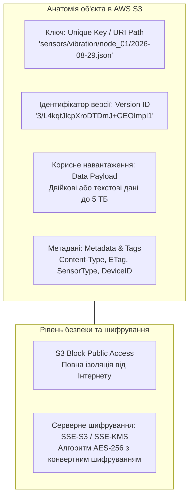
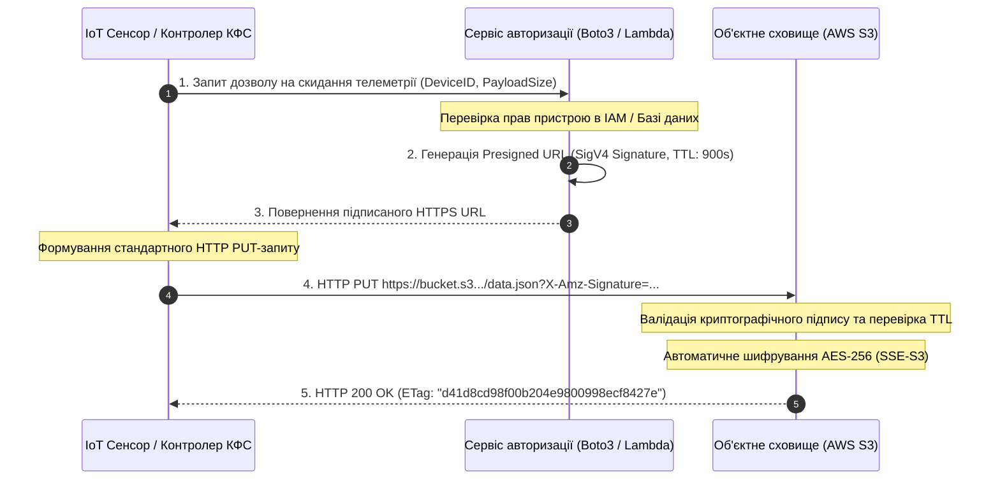
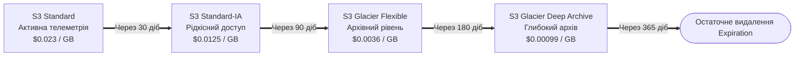

# Лабораторна робота № 3. Реалізація масштабованого об'єктного сховища з політиками доступу, версійністю, серверним шифруванням та життєвим циклом телеметрії КФС

**Мета:** Дослідження архітектурних засад та моделей функціонування хмарних об'єктних сховищ, опанування методів програмного створення та конфігурування контейнерів збереження даних (бакетів), реалізація багаторівневої системи безпеки із блокуванням публічного доступу та серверним шифруванням (Server-Side Encryption), налаштування версійності для захисту від випадкового знищення даних, впровадження правил автоматизованого керування життєвим циклом об'єктів (Lifecycle Policies) із міграцією телеметрії в архівні рівні, а також розробка емулятора кіберфізичного пристрою для безпечного завантаження даних за допомогою попередньо підписаних URL-адрес (Presigned URLs) через Python SDK Boto3.

**Стек технологій та інструменти:**
* **Мова програмування та середовище:** Python 3.10+ (CPython), ізольоване віртуальне оточення `venv`.
* **Платформа та бібліотеки:** Хмарна платформа Amazon Web Services (AWS S3), бібліотеки `boto3` (v1.34+), `botocore` (v1.34+), `requests` (v2.31+), `tabulate` (v0.9+).
* **Інструменти тестування та діагностики:** AWS CLI v2, утиліта командного рядка `cURL`, інтегроване середовище розробки Visual Studio Code / PyCharm, інспектор HTTP-запитів Postman.

---

## 1 Теоретичні відомості

У сучасних кіберфізичних системах та розподілених хмарних застосунках обсяги генерованої телеметрії (потоки вимірювань датчиків, діагностичні логи, аудіо- та відеозаписи) досягають сотень терабайтів і петабайтів. Традиційні блокові (SAN) та файлові (NAS) сховища мають обмеження щодо максимального обсягу томів, вимагають попереднього виділення дискового простору та створюють значні накладні витрати на підтримання складних ієрархій каталогів і блокувань. 

Вирішенням проблеми довготривалого зберігання надвеликих масивів неструктурованої інформації є **хмарні об'єктні сховища**, еталонним представником яких є сервіс **Amazon Simple Storage Service (AWS S3)**, а також його функціональний аналог **Azure Blob Storage**.


*Рисунок 1.1 — Структурна анатомія хмарного об'єкта та механізми захисту інформації*

На відміну від файлових систем, об'єктне сховище оперує абсолютно **пласким адресним простором**. Дані розміщуються всередині логічних контейнерів верхнього рівня — **бакетів (Buckets)**. Ім'я бакета є глобально унікальним серед усіх користувачів хмари в усьому світі та формує базову доменну назву для доступу до даних (наприклад, `https://cps-telemetry-bucket.s3.eu-central-1.amazonaws.com`).

Кожен об'єкт у сховищі ідентифікується чотирма основними атрибутами:
1. **Унікальний ключ (Key).** Повний рядковий шлях до об'єкта всередині бакета (символи похилої риски `/` використовуються виключно для візуального групування в консолі та не створюють реальних фізичних директорій).
2. **Ідентифікатор версії (Version ID).** Унікальний рядок, що автоматично генерується сховищем при кожній модифікації або перезапису об'єкта, якщо для бакета активовано режим версійності (**Bucket Versioning**).
3. **Корисне навантаження (Value / Data Payload).** Послідовність двійкових або текстових байтів обсягом від 0 байт до 5 терабайт (для файлів розміром понад 100 МБ обов'язково застосовується протокол паралельного багаточастинного завантаження — **Multipart Upload**).
4. **Метадані (Metadata).** Набір системних параметрів (розмір, дата створення, MIME-тип, хеш-сума цілісності **ETag**) та користувацьких тегів, які дозволяють класифікувати дані для білінгу та автоматизації.

Взаємодія зі сховищем базується на протоколі **HTTP/HTTPS за стандартами REST API**:
* Метод `PUT` використовується для створення бакета або завантаження об'єкта.
* Метод `GET` забезпечує зчитування тіла об'єкта або його фрагмента за допомогою заголовка діапазону байтів (`Range: bytes=0-1048576`).
* Метод `DELETE` ініціює видалення. Якщо версійність увімкнено, замість фізичного знищення створюється спеціальний маркер видалення (**Delete Marker**), що дозволяє за потреби повністю відновити попередній стан файлу.
* Метод `HEAD` повертає виключно HTTP-заголовки з метаданими об'єкта без передачі його тіла, мінімізуючи мережевий трафік під час аудиту.

Для захисту конфіденційної телеметрії кіберфізичних систем застосовується **серверне шифрування (Server-Side Encryption, SSE)**:
* **SSE-S3.** Шифрування за алгоритмом AES-256 за допомогою ключів, якими повністю керує сервіс S3. Кожен об'єкт шифрується унікальним ключем даних, який, у свою чергу, шифрується регулярно ротованим головним ключем сервісу.
* **SSE-KMS.** Шифрування із використанням хмарної служби керування ключами **AWS Key Management Service (KMS)**. Даний метод забезпечує конвертне шифрування (**Envelope Encryption**), контроль політик використання ключів та обов'язкову фіксацію кожного факту розшифрування в журналах аудиту AWS CloudTrail.

Критичним викликом для польових пристроїв КФС (мікроконтролерів, сенсорів, дронів) є відсутність можливості безпечного збереження довготривалих секретних ключів IAM (`AWS_ACCESS_KEY_ID`, `AWS_SECRET_ACCESS_KEY`). Компрометація пристрою в польових умовах відкриває зловмиснику доступ до всієї хмарної інфраструктури.

Для розв'язання цієї проблеми застосовується механізм **попередньо підписаних URL-адрес (Presigned URLs)**. Надійний бекенд-сервер, який володіє правами IAM, генерує спеціальне HTTP-посилання, що містить у рядку запиту криптографічний підпис **SigV4 (Signature Version 4)**, алгоритм хешування, дату генерації та час життя посилання (**Expiration Window**). 

Периферійний пристрій отримує це посилання через захищений внутрішній канал і виконує пряме завантаження файлу в S3 за допомогою звичайного HTTP PUT-запиту, взагалі не маючи доступу до облікових даних AWS.


*Рисунок 1.2 — Архітектура безпечного завантаження телеметрії за допомогою попередньо підписаних URL-адрес*

Для оптимізації фінансових витрат в S3 налаштовуються **правила життєвого циклу (Lifecycle Rules)**, які автоматично переміщують об'єкти між класами зберігання в міру зменшення частоти звернення до них:
* **S3 Standard (Hot Tier).** Високопродуктивне сховище для активної телеметрії з миттєвим доступом.
* **S3 Standard-Infrequent Access (Cool Tier / IA).** Сховище для даних, доступ до яких потрібен рідко, але терміново (знижена вартість зберігання, але стягується плата за гігабайт зчитаних даних).
* **S3 Glacier Flexible Retrieval / Deep Archive (Archive Tier).** Ультрадешеве архівне сховище для довготривалого зберігання ретроспективної інформації. Дані не доступні для миттєвого читання; процес їхнього вилучення (**Data Retrieval / Restore**) вимагає відправки спеціального запиту та триває від кількох хвилин до 12–48 годин.
* **Автоматичне знищення (Expiration).** Безповоротне фізичне видалення об'єктів або застарілих версій після закінчення регламентного терміну зберігання.


*Рисунок 1.3 — Конвеєр автоматизованої міграції даних телеметрії за класами зберігання*

Сумарна вартість збереження та обробки об'єктів телеметрії $C_{\text{storage}}$ за розрахунковий період формалізується рівнянням:

$$C_{\text{storage}} = \sum_{k \in \mathcal{K}} \left( V_k \cdot P_{\text{cap}, k} + N_{\text{put}, k} \cdot P_{\text{put}, k} + N_{\text{get}, k} \cdot P_{\text{get}, k} + N_{\text{trans}, k} \cdot P_{\text{trans}, k} + V_{\text{ret}, k} \cdot P_{\text{ret}, k} \right)$$

де $\mathcal{K} = \{\text{Standard}, \text{IA}, \text{Glacier}, \text{DeepArchive}\}$ — множина задіяних класів сховища, $V_k$ — середньомісячний обсяг даних у класі $k$ (у гігабайтах), $P_{\text{cap}, k}$ — тариф за зберігання 1 ГБ на місяць, $N_{\text{put}, k}$ та $N_{\text{get}, k}$ — кількість операцій запису та читання, $P_{\text{put}, k}$ і $P_{\text{get}, k}$ — вартість 1000 відповідних операцій, $N_{\text{trans}, k}$ — кількість об'єктів, переміщених між рівнями за правилами життєвого циклу, $P_{\text{trans}, k}$ — тариф за перенесення 1000 об'єктів, $V_{\text{ret}, k}$ — обсяг даних, вилучених з архівних рівнів (у гігабайтах), $P_{\text{ret}, k}$ — плата за відновлення 1 ГБ з архіву.

Термін дійсності попередньо підписаного URL визначається строгою умовою:

$$t_{\text{request}} \le t_{\text{signed}} + T_{\text{TTL}}$$

де $t_{\text{request}}$ — системний час отримання HTTP-запиту сервером AWS S3, $t_{\text{signed}}$ — мітка часу створення підпису за стандартом ISO 8601, $T_{\text{TTL}}$ — налаштований час життя посилання у секундах ($1 \le T_{\text{TTL}} \le 604800$).

---

## 2 Підготовка середовища та розгортання проєкту (Крок 0)

Перед початком виконання практичної частини лабораторної роботи необхідно налаштувати робоче середовище, створити структуру каталогів проєкту, встановити інтерпретатор Python та налаштувати конфігураційні профілі клієнта AWS CLI.

### 2.1 Перевірка інструментів та створення робочої директорії

Відкрийте термінал операційної системи та перевірте наявність необхідних утиліт:

```bash
python3 --version
pip3 --version
curl --version
aws --version
```

Створіть робочу директорію проєкту та ініціалізуйте віртуальне оточення:

```bash
mkdir -p ~/cloud_labs/lab3_object_storage
cd ~/cloud_labs/lab3_object_storage
python3 -m venv venv
source venv/bin/activate
```

Сформуйте файлову ієрархію лабораторної роботи відповідно до такої структури:

```text
lab3_object_storage/
├── config/
│   └── s3_config.json          # Конфігурація параметрів бакета та правил життєвого циклу
├── scripts/
│   ├── __init__.py
│   ├── s3_storage_manager.py   # Модуль керування бакетом, безпекою та Presigned URLs
│   └── sensor_emulator.py      # Модуль генерації та завантаження телеметрії КФС
├── output/
│   ├── telemetry_manifest.json # Звіт про згенеровані та завантажені пакети даних
│   └── s3_lifecycle_status.json# Знімок конфігурації сховища
├── requirements.txt            # Залежності Python
└── run_lab3.py                 # Головний виконуваний скрипт оркестрації
```

Створіть файл `requirements.txt`:

```text
boto3>=1.34.0
botocore>=1.34.0
requests>=2.31.0
tabulate>=0.9.0
```

Встановіть залежності у віртуальне оточення:

```bash
pip install --upgrade pip
pip install -r requirements.txt
```

### 2.2 Налаштування облікових даних AWS CLI

Перевірте наявність налаштованого профілю доступу до хмари:

```bash
aws sts get-caller-identity
```

У разі потреби встановіть параметри регіону за замовчуванням:

```bash
aws configure set default.region "eu-central-1"
aws configure set default.output_format "json"
```

---

## 3 Порядок виконання роботи

### 3.1 Індивідуальні завдання

Здобувач вищої освіти обирає варіант індивідуального завдання відповідно до свого номера в академічному журналі групи. Необхідно розробити програмний комплекс, який налаштовує безпеку бакета S3, впроваджує розклад життєвого циклу, емулює роботу сенсорного вузла та забезпечує архівування інформації згідно з параметрами, наведеними в таблиці 3.1.

*Таблиця 3.1 — Індивідуальні параметри конфігурації об'єктного сховища та телеметрії*

| Варіант | Префікс бакета | Тип сенсора КФС | Частота генерації / Обсяг | Правило переходу в IA (дні) | Правило переходу в Glacier (дні) | Термін видалення (дні) | Час життя Presigned URL (с) |
| :---: | :--- | :--- | :--- | :---: | :---: | :---: | :---: |
| **1** | `cps-vibro-telemetry` | Вібраційний датчик турбіни | 10 пакетів / 4 КБ | 30 | 90 | 365 | 600 |
| **2** | `cps-thermal-grid` | Тепловізор підстанції | 5 пакетів / 64 КБ | 30 | 60 | 180 | 900 |
| **3** | `cps-smart-meter` | Розумний лічильник струму | 20 пакетів / 2 КБ | 60 | 120 | 730 | 300 |
| **4** | `cps-drone-lidar` | LiDAR картографування | 3 пакети / 512 КБ | 30 | 90 | 180 | 1800 |
| **5** | `cps-pressure-node` | Датчик тиску магістралі | 15 пакетів / 3 КБ | 30 | 60 | 365 | 600 |
| **6** | `cps-acoustic-em` | Акустичний сенсор дефектів | 8 пакетів / 128 КБ | 45 | 90 | 180 | 1200 |
| **7** | `cps-robot-joint` | Кутові енкодери робота | 25 пакетів / 2 КБ | 30 | 60 | 180 | 300 |
| **8** | `cps-chem-analyzer` | Газоаналізатор викидів | 10 пакетів / 8 КБ | 60 | 180 | 365 | 900 |
| **9** | `cps-vital-ecg` | Кардіомонітор пацієнта | 12 пакетів / 16 КБ | 30 | 90 | 730 | 600 |
| **10** | `cps-weather-station`| Метеорологічний комплекс | 10 пакетів / 5 КБ | 60 | 120 | 365 | 900 |
| **11** | `cps-water-quality` | Датчик каламутності й pH | 15 пакетів / 3 КБ | 30 | 90 | 365 | 600 |
| **12** | `cps-solar-inverter` | Інвертор сонячної станції | 20 пакетів / 4 КБ | 45 | 90 | 365 | 300 |
| **13** | `cps-traffic-radar` | Дорожній радар швидкості | 10 пакетів / 32 КБ | 30 | 60 | 180 | 600 |
| **14** | `cps-soil-moisture` | Агротехнічний ґрунтовий вузол | 15 пакетів / 2 КБ | 60 | 180 | 730 | 1200 |
| **15** | `cps-strain-gauge` | Тензодатчик мостової опори | 10 пакетів / 10 КБ | 30 | 90 | 365 | 600 |
| **16** | `cps-radiation-det` | Детектор радіаційного фону | 10 пакетів / 4 КБ | 30 | 60 | 365 | 600 |
| **17** | `cps-conveyor-opt` | Оптичний лічильник конвеєра | 30 пакетів / 1 КБ | 30 | 60 | 180 | 300 |
| **18** | `cps-gyro-attitude` | Гіроскоп орієнтації платформи| 20 пакетів / 6 КБ | 30 | 90 | 180 | 600 |
| **19** | `cps-leak-detector` | Ультразвуковий детектор витоку| 10 пакетів / 8 КБ | 45 | 90 | 365 | 900 |
| **20** | `cps-engine-oil` | Датчик стану мастила двигуна| 10 пакетів / 5 КБ | 60 | 120 | 365 | 600 |

---

### 3.2 Покроковий алгоритм та розв'язок еталонного прикладу

У даному розділі представлено повний еталонний розв'язок задачі зі створення та адміністрування захищеного об'єктного сховища S3 для збирання телеметрії від сенсорного вузла вібраційного моніторингу `cps-reference-telemetry`.

#### Крок 1. Створення файлу конфігурації `config/s3_config.json`

Створіть конфігураційний файл із параметрами сховища:

```json
{
  "region": "eu-central-1",
  "bucket_prefix": "cps-reference-telemetry",
  "enable_versioning": true,
  "encryption_algorithm": "AES256",
  "block_public_access": true,
  "presigned_url_expiration_seconds": 900,
  "lifecycle_rules": {
    "rule_id": "ArchiveTelemetryRule",
    "prefix": "telemetry/",
    "transition_ia_days": 30,
    "transition_glacier_days": 90,
    "expiration_days": 365
  }
}
```

#### Крок 2. Реалізація модуля керування сховищем `scripts/s3_storage_manager.py`

Створіть модуль, який реалізує клас `S3StorageManager` для повного керування бакетом, налаштування шифрування, правил життєвого циклу та створення Presigned URLs:

```python
import os
import json
import uuid
from typing import Dict, Any, List
import boto3
from botocore.exceptions import ClientError


class S3StorageManager:
    """Клас програмного керування бакетами S3, шифруванням, версійністю та політиками."""

    def __init__(self, config_path: str):
        with open(config_path, "r", encoding="utf-8") as f:
            self.cfg = json.load(f)

        self.region = self.cfg.get("region", "eu-central-1")
        self.s3_client = boto3.client("s3", region_name=self.region)
        self.s3_resource = boto3.resource("s3", region_name=self.region)
        
        # Генерація унікального імені бакета з використанням UUID
        unique_suffix = str(uuid.uuid4())[:8]
        self.bucket_name = f"{self.cfg['bucket_prefix']}-{unique_suffix}"
        self.state: Dict[str, Any] = {"BucketName": self.bucket_name, "Region": self.region}

    def create_secure_bucket(self) -> str:
        """Створення бакета з блокуванням публічного доступу та шифруванням."""
        print(f"[INFO] Створення об'єктного бакета '{self.bucket_name}' у регіоні {self.region}...")
        try:
            if self.region == "us-east-1":
                self.s3_client.create_bucket(Bucket=self.bucket_name)
            else:
                self.s3_client.create_bucket(
                    Bucket=self.bucket_name,
                    CreateBucketConfiguration={"LocationConstraint": self.region}
                )
            print(f"[SUCCESS] Бакет '{self.bucket_name}' успішно створено.")

            # 1. Налаштування Public Access Block
            if self.cfg.get("block_public_access", True):
                print("[INFO] Активація S3 Block Public Access (повна ізоляція)...")
                self.s3_client.put_public_access_block(
                    Bucket=self.bucket_name,
                    PublicAccessBlockConfiguration={
                        "BlockPublicAcls": True,
                        "IgnorePublicAcls": True,
                        "BlockPublicPolicy": True,
                        "RestrictPublicBuckets": True
                    }
                )
                self.state["PublicAccessBlocked"] = True

            # 2. Активація версійності (Versioning)
            if self.cfg.get("enable_versioning", True):
                print("[INFO] Увімкнення версійності об'єктів (Bucket Versioning)...")
                self.s3_client.put_bucket_versioning(
                    Bucket=self.bucket_name,
                    VersioningConfiguration={"Status": "Enabled"}
                )
                self.state["Versioning"] = "Enabled"

            # 3. Налаштування серверного шифрування за замовчуванням (SSE-S3 / AES256)
            enc_algo = self.cfg.get("encryption_algorithm", "AES256")
            print(f"[INFO] Налаштування серверного шифрування за замовчуванням ({enc_algo})...")
            self.s3_client.put_bucket_encryption(
                Bucket=self.bucket_name,
                ServerSideEncryptionConfiguration={
                    "Rules": [
                        {
                            "ApplyServerSideEncryptionByDefault": {
                                "SSEAlgorithm": enc_algo
                            },
                            "BucketKeyEnabled": True
                        }
                    ]
                }
            )
            self.state["ServerSideEncryption"] = enc_algo

            # 4. Налаштування життєвого циклу (Lifecycle Rules)
            self._apply_lifecycle_policy()

            return self.bucket_name

        except ClientError as e:
            print(f"[ERROR] Помилка створення бакета: {e}")
            raise e

    def _apply_lifecycle_policy(self):
        """Впровадження правил міграції об'єктів у класи Standard-IA та Glacier."""
        lc_cfg = self.cfg.get("lifecycle_rules", {})
        if not lc_cfg:
            return

        print(f"[INFO] Конфігурування правил життєвого циклу (Lifecycle Policy)...")
        rules = [
            {
                "ID": lc_cfg["rule_id"],
                "Status": "Enabled",
                "Filter": {"Prefix": lc_cfg["prefix"]},
                "Transitions": [
                    {
                        "Days": lc_cfg["transition_ia_days"],
                        "StorageClass": "STANDARD_IA"
                    },
                    {
                        "Days": lc_cfg["transition_glacier_days"],
                        "StorageClass": "GLACIER"
                    }
                ],
                "Expiration": {
                    "Days": lc_cfg["expiration_days"]
                },
                "NoncurrentVersionTransitions": [
                    {
                        "NoncurrentDays": 30,
                        "StorageClass": "GLACIER"
                    }
                ],
                "NoncurrentVersionExpiration": {
                    "NoncurrentDays": 90
                }
            }
        ]

        self.s3_client.put_bucket_lifecycle_configuration(
            Bucket=self.bucket_name,
            LifecycleConfiguration={"Rules": rules}
        )
        self.state["LifecyclePolicy"] = rules
        print(f"[SUCCESS] Правила життєвого циклу успішно застосовано.")

    def generate_presigned_url(self, object_key: str, client_method: str = "put_object") -> str:
        """Генерація безпечного попередньо підписаного URL для клієнтського завантаження/читання."""
        expiration = self.cfg.get("presigned_url_expiration_seconds", 900)
        try:
            url = self.s3_client.generate_presigned_url(
                ClientMethod=client_method,
                Params={"Bucket": self.bucket_name, "Key": object_key},
                ExpiresIn=expiration
            )
            return url
        except ClientError as e:
            print(f"[ERROR] Помилка генерації Presigned URL: {e}")
            raise e

    def list_bucket_objects(self) -> List[Dict[str, Any]]:
        """Отримання списку об'єктів бакета та їхніх метаданих."""
        try:
            response = self.s3_client.list_objects_v2(Bucket=self.bucket_name)
            items = []
            if "Contents" in response:
                for obj in response["Contents"]:
                    items.append({
                        "Key": obj["Key"],
                        "Size_Bytes": obj["Size"],
                        "StorageClass": obj["StorageClass"],
                        "LastModified": str(obj["LastModified"]),
                        "ETag": obj["ETag"].strip('"')
                    })
            return items
        except ClientError as e:
            print(f"[ERROR] Помилка вичитування списку об'єктів: {e}")
            return []

    def list_object_versions(self) -> List[Dict[str, Any]]:
        """Отримання історії версій об'єктів у бакеті."""
        try:
            response = self.s3_client.list_object_versions(Bucket=self.bucket_name)
            versions = []
            if "Versions" in response:
                for v in response["Versions"]:
                    versions.append({
                        "Key": v["Key"],
                        "VersionId": v["VersionId"],
                        "IsLatest": v["IsLatest"],
                        "Size": v["Size"],
                        "LastModified": str(v["LastModified"])
                    })
            return versions
        except ClientError as e:
            print(f"[ERROR] Помилка отримання версій: {e}")
            return []
```

#### Крок 3. Реалізація емулятора кіберфізичного пристрою `scripts/sensor_emulator.py`

Створіть модуль емулятора датчика, який формує дані вимірювань та виконує завантаження телеметрії за допомогою попередньо підписаних посилань HTTP PUT:

```python
import time
import json
import random
import datetime
from typing import Dict, Any, List
import requests


class SensorTelemetryEmulator:
    """Емулятор контролера кіберфізичної системи для завантаження телеметрії через Presigned URLs."""

    def __init__(self, device_id: str, sensor_type: str):
        self.device_id = device_id
        self.sensor_type = sensor_type

    def generate_telemetry_batch(self, count: int = 5) -> List[Dict[str, Any]]:
        """Генерація синтетичного пакета вимірювань фізичних параметрів."""
        batch = []
        base_time = datetime.datetime.now(datetime.timezone.utc)

        for i in range(count):
            reading_time = base_time + datetime.timedelta(seconds=i * 2)
            payload = {
                "device_id": self.device_id,
                "sensor_type": self.sensor_type,
                "timestamp": reading_time.isoformat(),
                "sequence_id": i + 1,
                "telemetry": {
                    "vibration_rms_g": round(random.uniform(0.12, 1.85), 4),
                    "bearing_temperature_c": round(random.uniform(45.0, 82.5), 2),
                    "rotational_speed_rpm": round(random.uniform(1450.0, 1520.0), 1),
                    "acoustic_noise_db": round(random.uniform(65.0, 88.0), 2)
                },
                "system_status": "NORMAL" if random.random() > 0.1 else "WARNING_PEAK"
            }
            batch.append(payload)
        return batch

    def upload_via_presigned_url(self, presigned_url: str, data: Dict[str, Any]) -> bool:
        """Пряме завантаження JSON-пакета в S3 за допомогою HTTP PUT без використання AWS креденшалів."""
        json_data = json.dumps(data, indent=2, ensure_ascii=False)
        headers = {"Content-Type": "application/json"}

        response = requests.put(presigned_url, data=json_data.encode("utf-8"), headers=headers)
        if response.status_code == 200:
            return True
        else:
            print(f"[ERROR] HTTP Upload failed. Status: {response.status_code}, Text: {response.text}")
            return False
```

#### Крок 4. Головний виконуваний скрипт оркестрації `run_lab3.py`

Створіть файл верхнього рівня, який виконує повний сценарій створення сховища, тестування версійності, емуляції сенсора та збереження фінальних звітів:

```python
import os
import json
import time
from tabulate import tabulate
from scripts.s3_storage_manager import S3StorageManager
from scripts.sensor_emulator import SensorTelemetryEmulator


def main():
    print("=================================================================")
    print("   ПРОГРАМНЕ КЕРУВАННЯ МАСШТАБОВАНИМ СХОВИЩЕМ S3 ТА ТЕЛЕМЕТРІЄЮ  ")
    print("=================================================================\n")

    config_path = os.path.join("config", "s3_config.json")
    output_dir = "output"
    os.makedirs(output_dir, exist_ok=True)
    manifest_path = os.path.join(output_dir, "telemetry_manifest.json")
    state_path = os.path.join(output_dir, "s3_lifecycle_status.json")

    # 1. Ініціалізація та створення захищеного бакета
    manager = S3StorageManager(config_path=config_path)
    bucket_name = manager.create_secure_bucket()

    # 2. Ініціалізація емулятора сенсорного вузла КФС
    sensor = SensorTelemetryEmulator(
        device_id="CPS-VIBRO-TURBINE-04",
        sensor_type="Vibration-and-Thermal"
    )

    print("\n--- Генерація та завантаження телеметрії за допомогою Presigned URLs ---")
    telemetry_packets = sensor.generate_telemetry_batch(count=5)
    upload_manifest = []

    for idx, packet in enumerate(telemetry_packets, start=1):
        object_key = f"telemetry/year=2026/month=08/device_{packet['device_id']}_seq{idx}.json"
        
        # Генерація підписаного посилання для завантаження (HTTP PUT)
        presigned_put_url = manager.generate_presigned_url(object_key, client_method="put_object")
        
        # Завантаження без використання AWS ключів
        success = sensor.upload_via_presigned_url(presigned_put_url, packet)
        status_str = "SUCCESS (HTTP 200)" if success else "FAILED"
        print(f"[UPLOAD] Пакет #{idx} -> s3://{bucket_name}/{object_key} [{status_str}]")

        upload_manifest.append({
            "PacketID": idx,
            "ObjectKey": object_key,
            "Timestamp": packet["timestamp"],
            "Status": status_str
        })

    # 3. Демонстрація роботи версійності (Перезапис об'єкта)
    print("\n--- Тестування версійності об'єктів (Object Versioning) ---")
    target_key = upload_manifest[0]["ObjectKey"]
    print(f"[INFO] Модифікація та перезапис існуючого об'єкта: {target_key}")
    modified_packet = telemetry_packets[0]
    modified_packet["system_status"] = "UPDATED_CALIBRATION_REVISED"
    
    update_url = manager.generate_presigned_url(target_key, client_method="put_object")
    sensor.upload_via_presigned_url(update_url, modified_packet)
    print(f"[SUCCESS] Створено нову версію об'єкта {target_key}")

    # 4. Формування таблиць стану сховища
    print("\n=================================================================")
    print("                    ПОТОЧНИЙ СТАН ОБ'ЄКТІВ У S3                 ")
    print("=================================================================")
    
    objects_list = manager.list_bucket_objects()
    table_objects = [[o["Key"], o["Size_Bytes"], o["StorageClass"], o["ETag"]] for o in objects_list]
    print(tabulate(table_objects, headers=["Ключ об'єкта (Key)", "Розмір (Байт)", "Клас сховища", "Хеш ETag (MD5)"], tablefmt="fancy_grid"))

    print("\n=================================================================")
    print("                 ІСТОРІЯ ВЕРСІЙ (VERSIONING AUDIT)              ")
    print("=================================================================")
    
    versions_list = manager.list_object_versions()
    table_versions = [[v["Key"], v["VersionId"][:16] + "...", v["IsLatest"], v["Size"]] for v in versions_list]
    print(tabulate(table_versions, headers=["Ключ об'єкта", "ID версії", "Поточна версія (Latest)", "Розмір (Байт)"], tablefmt="grid"))

    # Збереження результатів
    with open(manifest_path, "w", encoding="utf-8") as f:
        json.dump(upload_manifest, f, indent=4, ensure_ascii=False)

    with open(state_path, "w", encoding="utf-8") as f:
        json.dump(manager.state, f, indent=4, ensure_ascii=False)

    print(f"\n[INFO] Звіти збережено у директорію: {output_dir}/")
    print("[SUCCESS] Лабораторну роботу успішно виконано.")


if __name__ == "__main__":
    main()
```

---

### 3.3 Запуск, тестування та перевірка результатів

Виконайте запуск розробленого програмного комплексу у віртуальному середовищі терміналу:

```bash
python3 run_lab3.py
```

У разі коректного конфігурування на екран виводиться протокол створення бакета, блокування публічного доступу, призначення правил шифрування та життєвого циклу, а також таблиці об'єктів та версій:

```text
=================================================================
   ПРОГРАМНЕ КЕРУВАННЯ МАСШТАБОВАНИМ СХОВИЩЕМ S3 ТА ТЕЛЕМЕТРІЄЮ  
=================================================================

[INFO] Створення об'єктного бакета 'cps-reference-telemetry-a1b2c3d4' у регіоні eu-central-1...
[SUCCESS] Бакет 'cps-reference-telemetry-a1b2c3d4' успішно створено.
[INFO] Активація S3 Block Public Access (повна ізоляція)...
[INFO] Увімкнення версійності об'єктів (Bucket Versioning)...
[INFO] Налаштування серверного шифрування за замовчуванням (AES256)...
[INFO] Конфігурування правил життєвого циклу (Lifecycle Policy)...
[SUCCESS] Правила життєвого циклу успішно застосовано.

--- Генерація та завантаження телеметрії за допомогою Presigned URLs ---
[UPLOAD] Пакет #1 -> s3://cps-reference-telemetry-a1b2c3d4/telemetry/year=2026/month=08/device_CPS-VIBRO-TURBINE-04_seq1.json [SUCCESS (HTTP 200)]
[UPLOAD] Пакет #2 -> s3://cps-reference-telemetry-a1b2c3d4/telemetry/year=2026/month=08/device_CPS-VIBRO-TURBINE-04_seq2.json [SUCCESS (HTTP 200)]
[UPLOAD] Пакет #3 -> s3://cps-reference-telemetry-a1b2c3d4/telemetry/year=2026/month=08/device_CPS-VIBRO-TURBINE-04_seq3.json [SUCCESS (HTTP 200)]
[UPLOAD] Пакет #4 -> s3://cps-reference-telemetry-a1b2c3d4/telemetry/year=2026/month=08/device_CPS-VIBRO-TURBINE-04_seq4.json [SUCCESS (HTTP 200)]
[UPLOAD] Пакет #5 -> s3://cps-reference-telemetry-a1b2c3d4/telemetry/year=2026/month=08/device_CPS-VIBRO-TURBINE-04_seq5.json [SUCCESS (HTTP 200)]

--- Тестування версійності об'єктів (Object Versioning) ---
[INFO] Модифікація та перезапис існуючого об'єкта: telemetry/year=2026/month=08/device_CPS-VIBRO-TURBINE-04_seq1.json
[SUCCESS] Створено нову версію об'єкта telemetry/year=2026/month=08/device_CPS-VIBRO-TURBINE-04_seq1.json

=================================================================
                    ПОТОЧНИЙ СТАН ОБ'ЄКТІВ У S3                 
=================================================================
╒═══════════════════════════════════════════════════════════════════════╤═════════════════╤════════════════╤══════════════════════════════════╕
│ Ключ об'єкта (Key)                                                    │   Розмір (Байт) │ Клас сховища   │ Хеш ETag (MD5)                   │
╞═══════════════════════════════════════════════════════════════════════╪═════════════════╪════════════════╪══════════════════════════════════╡
│ telemetry/year=2026/month=08/device_CPS-VIBRO-TURBINE-04_seq1.json    │             485 │ STANDARD       │ 7b8b4a2e5d9c1f6a8e0d2c3b4a5f6e7d │
│ telemetry/year=2026/month=08/device_CPS-VIBRO-TURBINE-04_seq2.json    │             462 │ STANDARD       │ e1d2c3b4a5f6e7d8c9b0a1f2e3d4c5b6 │
│ telemetry/year=2026/month=08/device_CPS-VIBRO-TURBINE-04_seq3.json    │             465 │ STANDARD       │ a9b8c7d6e5f41234567890abcdef1234 │
│ telemetry/year=2026/month=08/device_CPS-VIBRO-TURBINE-04_seq4.json    │             460 │ STANDARD       │ 5f4e3d2c1b0a9f8e7d6c5b4a3f2e1d0c │
│ telemetry/year=2026/month=08/device_CPS-VIBRO-TURBINE-04_seq5.json    │             463 │ STANDARD       │ 1234567890abcdef1234567890abcdef │
╘═══════════════════════════════════════════════════════════════════════╧═════════════════╧════════════════╧══════════════════════════════════╛

=================================================================
                 ІСТОРІЯ ВЕРСІЙ (VERSIONING AUDIT)              
=================================================================
+-----------------------------------------------------------------------+-------------------+--------------------------+----------------+
| Ключ об'єкта                                                          | ID версії         | Поточна версія (Latest)  |   Розмір (Байт)|
+-----------------------------------------------------------------------+-------------------+--------------------------+----------------+
| telemetry/year=2026/month=08/device_CPS-VIBRO-TURBINE-04_seq1.json    | 3/L4kqtJlcpXro... | True                     |            485 |
| telemetry/year=2026/month=08/device_CPS-VIBRO-TURBINE-04_seq1.json    | vG8eR9wT1pXyza... | False                    |            462 |
| telemetry/year=2026/month=08/device_CPS-VIBRO-TURBINE-04_seq2.json    | N1mK9oP2rStUvw... | True                     |            462 |
| telemetry/year=2026/month=08/device_CPS-VIBRO-TURBINE-04_seq3.json    | A7bC8dE9fGhIjK... | True                     |            465 |
| telemetry/year=2026/month=08/device_CPS-VIBRO-TURBINE-04_seq4.json    | Q4wE5rT6yU7i8o... | True                     |            460 |
| telemetry/year=2026/month=08/device_CPS-VIBRO-TURBINE-04_seq5.json    | Z1xС2vB3nМ4l5k... | True                     |            463 |
+-----------------------------------------------------------------------+-------------------+--------------------------+----------------+

[INFO] Звіти збережено у директорію: output/
[SUCCESS] Лабораторну роботу успішно виконано.
```

#### Додаткова перевірка через інтерфейс командного рядка (AWS CLI)

1. Перевірте статус налаштування шифрування бакета:
   ```bash
   aws s3api get-bucket-encryption --bucket cps-reference-telemetry-a1b2c3d4
   ```

2. Перевірте конфігурацію життєвого циклу:
   ```bash
   aws s3api get-bucket-lifecycle-configuration --bucket cps-reference-telemetry-a1b2c3d4
   ```

3. Виконайте безпосереднє зчитування об'єкта через згенероване посилання Presigned GET за допомогою утиліти `cURL`:
   ```bash
   curl -I "https://cps-reference-telemetry-a1b2c3d4.s3.eu-central-1.amazonaws.com/telemetry/year=2026/month=08/device_CPS-VIBRO-TURBINE-04_seq1.json?X-Amz-Algorithm=AWS4-HMAC-SHA256&..."
   ```
   *Очікувана відповідь:* HTTP статус `200 OK`, що містить заголовки `x-amz-server-side-encryption: AES256` та `x-amz-version-id`.

---

## 4. Вимоги до змісту звіту

Звіт з лабораторної роботи оформлюється у форматі PDF відповідно до академічних вимог та повинен містити такі обов'язкові розділи:
1. **Титульна сторінка** із зазначенням назви університету, кафедри, дисципліни, номера лабораторної роботи, теми, академічної групи, ПІБ здобувача та номера індивідуального варіанта.
2. **Мета роботи, коротка теоретична частина та індивідуальні параметри варіанта** згідно з таблицею 3.1.
3. **Розрахункова частина:** оцінка вартості збереження телеметрії за математичною моделлю формули вартості з урахуванням міграції за рівнями (Standard $\to$ Standard-IA $\to$ Glacier) за 1 рік спостережень.
4. **Архітектурна схема** конвеєра збирання телеметрії КФС із відображенням життєвого циклу об'єктів та делегування доступу через Presigned URLs.
5. **Повний вихідний текст програмних модулів** (`s3_config.json`, `s3_storage_manager.py`, `sensor_emulator.py`, `run_lab3.py`) із детальними авторськими коментарями.
6. **Скріншоти та звіти терміналу**, які ілюструють створення бакета, успішні HTTP-виклики PUT через Presigned URL, вміст таблиці об'єктів та таблиці версійності.
7. **Висновки**, де наведено аналіз надійності об'єктного сховища (показник «11 дев'яток»), оцінку безпеки використання підписаних посилань для IoT-пристроїв та підсумки виконання роботи.

---

## 5. Контрольні запитання для захисту роботи

1. У чому полягає фундаментальна відмінність архітектури хмарного об'єктного сховища від класичних блокових (EBS) та файлових (EFS) систем?
2. Яким чином забезпечується показник надійності (Durability) на рівні $99{,}999999999\%$ («11 дев'яток») в об'єктних сховищах, і яка ймовірність втрати об'єкта протягом року?
3. Поясніть принцип функціонування режиму версійності (Bucket Versioning) в AWS S3. Що відбувається на рівні сховища, коли користувач надсилає запит `DELETE` для об'єкта за наявності маркера видалення?
4. Розкрийте механізм криптографічного формування попередньо підписаних URL-адрес (Presigned URLs). Чому використання Presigned URLs є безпечнішим за пряме збереження ключів IAM на сенсорних контролерах?
5. Чим відрізняється серверне шифрування SSE-S3 від шифрування за допомогою сервісу керування ключами SSE-KMS, і які переваги надає використання AWS KMS у системах із суворим аудитом безпеки?
6. Опишіть призначення та алгоритм спрацювання правил життєвого циклу (Lifecycle Rules). У чому полягає різниця між рівнями S3 Standard-IA, S3 Glacier Flexible Retrieval та S3 Glacier Deep Archive за показниками вартості та затримки вилучення даних?
7. Що являє собою функціонал S3 Block Public Access, і які чотири рівні захисту він забезпечує для запобігання випадковому оприлюдненню конфіденційних даних в Інтернеті?
