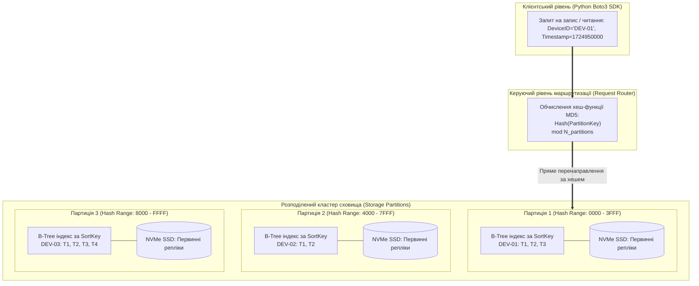
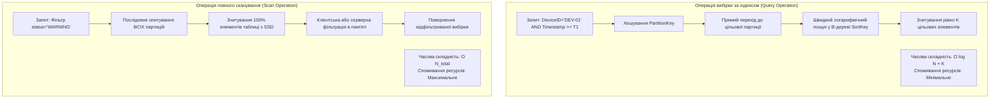

# Лабораторна робота № 4. Інтеграція хмарних NoSQL баз даних засобами Python SDK: проєктування схем, оптимізація індексів та бенчмаркінг запитів Scan проти Query

**Мета:** Дослідження архітектурних засад та моделей організації даних у хмарних нереляційних СУБД класу «ключ-значення» та документно-орієнтованих сховищах, опанування методів проєктування схем таблиць для збереження часових рядів телеметрії кіберфізичних систем, реалізація композитних первинних ключів (Partition Key та Sort Key) для уникнення аномалій «гарячих партицій», конфігурування вторинних глобальних індексів (Global Secondary Indexes, GSI), впровадження механізмів оптимістичного блокування транзакцій (Conditional Writes) та проведення експериментального порівняльного аналізу часової складності й споживання обчислювальних ресурсів операцій вибірки `Scan` та `Query` за допомогою Python SDK Boto3.

**Стек технологій та інструменти:**
* **Мова програмування та середовище розробки:** Python 3.10+ (CPython), ізольоване віртуальне оточення `venv`.
* **Платформа та хмарні бібліотеки:** Amazon Web Services (AWS DynamoDB), бібліотеки `boto3` (v1.34+), `botocore` (v1.34+), `tabulate` (v0.9+).
* **Інструменти діагностики та моделювання:** AWS CLI v2, середовище візуального проєктування схем NoSQL Workbench for DynamoDB, інтегроване середовище розробки Visual Studio Code / PyCharm.

---

## 1 Теоретичні відомості

Традиційні реляційні системи керування базами даних (RDBMS), що базуються на суворій схемі нормалізації та гарантіях транзакційної цілісності ACID, стикаються із системними обмеженнями під час обробки масивних потоків телеметрії від кіберфізичних систем. Сенсорні мережі, промислові контролери та автономні роботизовані комплекси генерують безперервні часові ряди вимірювань, для яких характерна висока частота операцій запису, змінна структура корисного навантаження та відсутність потреби у складних багатотабличних об'єднаннях (`JOIN`). 

Хмарні нереляційні бази даних класу NoSQL, яскравим представником яких є **Amazon DynamoDB** (а також Azure Cosmos DB і Azure Table Storage), оптимізовані для горизонтального масштабування та гарантують детерміновану затримку виконання операцій на рівні одиниць мілісекунд незалежно від загального обсягу збережених даних.

Архітектура DynamoDB базується на розподіленому зберіганні даних на твердотільних накопичувачах NVMe SSD у межах багатьох фізичних серверів (партицій), що дублюються у трьох зонах доступності. Кожен елемент даних (**Item**) являє собою набір типізованих атрибутів (**Attributes**) і може мати довільну динамічну схему обсягом до 400 КБ.


*Рисунок 1.1 — Внутрішня архітектура маршрутизації запитів та партиціювання даних у хмарній NoSQL СУБД*

Управління фізичним розміщенням інформації здійснюється за допомогою **первинного ключа (Primary Key)**, який може бути простим або складеним (композитним):

1. **Ключ партиціонування (Partition Key / Hash Key).** Значення цього атрибута обробляється внутрішньою криптографічною хеш-функцією системи, результат якої строго визначає фізичну партицію для збереження елемента. Усі записи з однаковим Partition Key фізично розміщуються на одному вузлі сховища. Некоректний вибір ключа партиціонування призводить до виникнення явища **«гарячих партицій» (Hot Partitions)**, коли один сервер перевантажується запитами від одного популярного пристрою, тоді як інші вузли простоюють. Для кіберфізичних комплексів як Partition Key обирають унікальний ідентифікатор пристрою (`DeviceID`) або синтетичний композитний хеш (`TenantID#DeviceID`).
2. **Ключ сортування (Sort Key / Range Key).** Визначає фізичний порядок розташування записів усередині партиції у вигляді B-дерева. Використання часової мітки (`Timestamp`) як Sort Key дозволяє ефективно моделювати часові ряди, забезпечуючи виконання діапазонних вибірок (`BETWEEN`, `>`, `<`) без перебору всіх даних таблиці.

Для забезпечення можливості альтернативного швидкого пошуку за атрибутами, які не входять до складу основного первинного ключа, застосовуються **вторинні індекси (Secondary Indexes)**:

* **Локальний вторинний індекс (Local Secondary Index, LSI).** Використовує той самий Partition Key, що й базова таблиця, але інший Sort Key. LSI створюється виключно в момент ініціалізації таблиці, ділить спільну дискову квоту партиції (до 10 ГБ на один Partition Key) та підтримує строго узгоджене читання.
* **Глобальний вторинний індекс (Global Secondary Index, GSI).** Може мати повністю відмінний Partition Key та Sort Key від базової таблиці. GSI може додаватися та модифікуватися на будь-якому етапі життєвого циклу таблиці, функціонує як незалежне сховище з власним виділеним бюджетом пропускної здатності та оновлюється асинхронно (**Eventual Consistency**).


*Рисунок 1.2 — Порівняння алгоритмічних конвеєрів виконання операцій Query та Scan*

Фундаментальною відмінністю в архітектурі доступу є вибір між операціями **Query** та **Scan**:

Операція **Query** виконує спрямований пошук даних виключно за точним значенням Partition Key та опціональними умовами діапазону Sort Key. Оскільки адреса партиції обчислюється миттєво через хеш, а пошук всередині партиції спирається на індексне B-дерево, час виконання $T_{\text{Query}}$ та споживання ресурсів залежать виключно від кількості знайдених елементів $K_{\text{matched}}$, а не від загального розміру таблиці:

$$T_{\text{Query}} \approx t_{\text{net}} + \log_B(N_{\text{partition}}) \cdot \tau_{\text{index}} + K_{\text{matched}} \cdot \tau_{\text{read}}$$

де $t_{\text{net}}$ — мережева затримка, $B$ — порядок галуження B-дерева індексу, $N_{\text{partition}}$ — кількість записів у межах цільового Partition Key, $\tau_{\text{index}}$ — час обходу вузла дерева, $\tau_{\text{read}}$ — час зчитування одного елемента з пам'яті/диска.

Операція **Scan** виконує повний перебір усіх фізичних партицій таблиці, зчитуючи кожен елемент у пам'ять блоками по 1 МБ із подальшим застосуванням фільтрів (**Filter Expressions**). Часова складність $T_{\text{Scan}}$ та кількість списаних одиниць читання прямо пропорційні загальній кількості записів у всій таблиці $N_{\text{total}}$:

$$T_{\text{Scan}} \approx t_{\text{net}} + \sum_{p=1}^{P_{\text{total}}} \left( N_p \cdot \tau_{\text{disk\_read}} \right)$$

де $P_{\text{total}}$ — загальна кількість фізичних партицій таблиці, $N_p$ — кількість елементів у $p$-й партиції. Застосування `Scan` у промислових системах призводить до миттєвого вичерпання виділених лімітів пропускної здатності та різкого зростання фінансових витрат.

Управління ресурсами в DynamoDB здійснюється за двома моделями продуктивності:
* **Зарезервована пропускна здатність (Provisioned Capacity Mode).** Інженер фіксує гарантовану кількість одиниць зчитування (**Read Capacity Units, RCU**) та запису (**Write Capacity Units, WCU**). Одна одиниця WCU забезпечує один запис розміром до 1 КБ за секунду. Одна одиниця RCU забезпечує одне строго узгоджене читання (**Strongly Consistent Read**) або два узгоджених у кінцевому підсумку читання (**Eventually Consistent Reads**) розміром до 4 КБ за секунду.
* **Пропускна здатність на вимогу (On-Demand Capacity Mode).** Автоматична тарифікація за кожен мільйон фактично виконаних операцій читання та запису, що є оптимальним для систем із непередбачуваним навантаженням.

Для запобігання втраті даних при одночасній модифікації спільних записів різними мікросервісами застосовується механізм **умовного запису (Conditional Writes)**. Операція модифікації (`UpdateItem` / `PutItem`) виконується успішно лише за умови істинності логічного виразу перевірки поточної версії або наявності атрибутів (наприклад, `attribute_exists(DeviceID) AND version = :expected_version`), реалізуючи патерн оптимістичного блокування без блокування всієї таблиці.

*Таблиця 1.1 — Порівняльний аналіз моделей доступу та операцій вибірки NoSQL СУБД*

| Параметр порівняння | Одиничний запит (`GetItem`) | Запит за індексом (`Query`) | Повне сканування (`Scan`) |
| :--- | :--- | :--- | :--- |
| **Необхідні параметри** | Повний первинний ключ (Partition + Sort) | Точний Partition Key (+ діапазон Sort Key) | Будь-які атрибути або без параметрів |
| **Алгоритмічна складність** | Константна: $\mathcal{O}(1)$ | Логарифмічна: $\mathcal{O}(\log N + K)$ | Лінійна: $\mathcal{O}(N_{\text{total}})$ |
| **Ефективність використання RCU** | Максимальна (1 RCU на 4 КБ цільового елемента) | Висока (RCU списуються лише за знайдені дані) | Критично низька (RCU списуються за ВСІ дані таблиці) |
| **Вплив на продуктивність** | Відсутній (ізольована мілісекундна операція) | Локалізований у межах однієї партиції | Високий ризик дроселювання (Throttling) всієї СУБД |
| **Сфера застосування в КФС** | Отримання поточного статусу датчика | Вибірка історії телеметрії пристрою за добу | Повна пакетна міграція, аналітичний експорт |

---

## 2 Підготовка середовища та розгортання проєкту (Крок 0)

Перед початком виконання практичної частини лабораторної роботи необхідно ініціалізувати робоче середовище, створити структуру каталогів проєкту, налаштувати віртуальне оточення мови Python, встановити необхідні бібліотеки та перевірити доступність хмарного сервісу DynamoDB.

### 2.1 Перевірка інструментів та створення робочої директорії

Відкрийте емулятор терміналу та перевірте версії встановленого системного програмного забезпечення:

```bash
python3 --version
pip3 --version
aws --version
```

Створіть робочу ієрархію каталогів лабораторної роботи та активуйте віртуальне середовище:

```bash
mkdir -p ~/cloud_labs/lab4_dynamodb_integration
cd ~/cloud_labs/lab4_dynamodb_integration
python3 -m venv venv
source venv/bin/activate
```

Сформуйте файлову структуру проєкту відповідно до наведеної схеми:

```text
lab4_dynamodb_integration/
├── config/
│   └── dynamodb_schema.json     # Специфікація схеми таблиці, ключів та індексів GSI
├── scripts/
│   ├── __init__.py
│   ├── dynamodb_manager.py      # Модуль керування життєвим циклом таблиць, CRUD та GSI
│   └── telemetry_benchmark.py   # Модуль масової генерації даних та бенчмаркінгу Scan vs Query
├── output/
│   ├── benchmark_report.json    # Детальні результати вимірювання затримок та RCU
│   └── query_samples.json       # Приклади отриманих телеметричних вибірок
├── requirements.txt             # Специфікація бібліотек Python
└── run_lab4.py                  # Головний виконуваний модуль оркестрації
```

Створіть файл `requirements.txt`:

```text
boto3>=1.34.0
botocore>=1.34.0
tabulate>=0.9.0
```

Виконайте інсталяцію бібліотек:

```bash
pip install --upgrade pip
pip install -r requirements.txt
```

### 2.2 Налаштування конфігураційного профілю AWS

Перевірте коректність облікових даних за допомогою виклику служби STS:

```bash
aws sts get-caller-identity
```

Встановіть робочий регіон розгортання:

```bash
aws configure set default.region "eu-central-1"
aws configure set default.output_format "json"
```

---

## 3 Порядок виконання роботи

### 3.1 Індивідуальні завдання

Здобувач вищої освіти обирає варіант індивідуального завдання відповідно до свого номера в академічному журналі групи. Необхідно спроєктувати структуру таблиці DynamoDB, розгорнути вторинний індекс GSI, згенерувати синтетичний масив часових рядів телеметрії, реалізувати умовне оновлення та провести бенчмаркінг продуктивності згідно з параметрами, наведеними в таблиці 3.1.

*Таблиця 3.1 — Індивідуальні параметри проєктування та дослідження NoSQL сховища*

| Варіант | Префікс таблиці | Ключ партиціонування (PK) | Ключ сортування (SK) | Атрибути вторинного індексу GSI | Специфікація фізичних параметрів телеметрії |
| :---: | :--- | :--- | :--- | :--- | :--- |
| **1** | `cps-turbine-metrics` | `TurbineID` (String) | `Timestamp` (Number) | PK: `LocationZone`, SK: `VibrationRMS` | Вібрація (RMS, g), температура підшипника (°C) |
| **2** | `cps-grid-inverters` | `InverterID` (String) | `Timestamp` (Number) | PK: `StatusMode`, SK: `ActivePowerKW` | Активна потужність (кВт), напруга фази (В), ККД (%) |
| **3** | `cps-robot-arms` | `RobotID` (String) | `Timestamp` (Number) | PK: `OperationalState`, SK: `JointTorqueNm` | Момент зчленування (Н·м), кутова швидкість (рад/с) |
| **4** | `cps-pipeline-pressure` | `PipeSegmentID` (String) | `Timestamp` (Number) | PK: `PressureZone`, SK: `FlowRateM3h` | Тиск газу (МПа), об'ємна витрата (м³/год), витік |
| **5** | `cps-medical-vital` | `PatientID` (String) | `Timestamp` (Number) | PK: `WardID`, SK: `HeartRateBpm` | Пульс (уд/хв), сатурація SpO2 (%), тиск (мм рт. ст.) |
| **6** | `cps-drone-telemetry` | `UAV_ID` (String) | `Timestamp` (Number) | PK: `MissionPhase`, SK: `AltitudeMeters` | Висота польоту (м), заряд батареї (%), крен, тангаж |
| **7** | `cps-smart-greenhouse` | `ZoneID` (String) | `Timestamp` (Number) | PK: `CropType`, SK: `SoilMoisturePct` | Вологість ґрунту (%), CO2 (ppm), освітленість (лк) |
| **8** | `cps-traffic-radar` | `SensorID` (String) | `Timestamp` (Number) | PK: `RoadSector`, SK: `VehicleSpeedKmh` | Швидкість авто (км/год), тип ТЗ, довжина черги |
| **9** | `cps-cnc-spindle` | `MachineID` (String) | `Timestamp` (Number) | PK: `ToolType`, SK: `SpindleLoadPct` | Навантаження шпинделя (%), знос фрези (%), струм |
| **10** | `cps-seismic-network` | `StationID` (String) | `Timestamp` (Number) | PK: `RegionCode`, SK: `MagnitudeScale` | Амплітуда коливань (мкм/с), магнітуда, частота (Гц) |
| **11** | `cps-boiler-thermal` | `BoilerID` (String) | `Timestamp` (Number) | PK: `FacilityUnit`, SK: `SteamTempC` | Температура пари (°C), рівень води (мм), тиск |
| **12** | `cps-battery-bms` | `PackID` (String) | `Timestamp` (Number) | PK: `CellHealth`, SK: `StateOfChargePct` | Рівень заряду SoC (%), напруга комірок (В), струм |
| **13** | `cps-conveyor-speed` | `LineID` (String) | `Timestamp` (Number) | PK: `WorkshopID`, SK: `BeltSpeedMs` | Швидкість стрічки (м/с), вага вантажу (кг/м), затор |
| **14** | `cps-water-treatment` | `TankID` (String) | `Timestamp` (Number) | PK: `PurificationStage`, SK: `TurbidityNTU` | Каламутність (NTU), кислотність pH, вміст хлору |
| **15** | `cps-air-quality` | `StationCode` (String) | `Timestamp` (Number) | PK: `CityDistrict`, SK: `PM25_PPM` | Концентрація PM2.5, PM10 (мкг/м³), NO2, озон |
| **16** | `cps-wind-generator` | `TowerID` (String) | `Timestamp` (Number) | PK: `WindPark`, SK: `RotorSpeedRpm` | Швидкість вітру (м/с), оберти ротора (об/хв), потужність |
| **17** | `cps-chemical-reactor` | `ReactorID` (String) | `Timestamp` (Number) | PK: `BatchCode`, SK: `ReactionTempC` | Температура суміші (°C), тиск (бар), швидкість мішалки |
| **18** | `cps-mining-excavator` | `VehicleID` (String) | `Timestamp` (Number) | PK: `QuarrySector`, SK: `HydraulicPressureBar` | Гідравлічний тиск (бар), температура оливи, мотогодини |
| **19** | `cps-hvac-commercial` | `ChillerID` (String) | `Timestamp` (Number) | PK: `BuildingID`, SK: `CoolingLoadKw` | Холодопродуктивність (кВт), перепад тиску фреону |
| **20** | `cps-agv-warehouse` | `AGV_ID` (String) | `Timestamp` (Number) | PK: `WarehouseAisle`, SK: `BatteryVoltageV` | Координати X/Y, напруга АКБ (В), статус лідара |

---

### 3.2 Покроковий алгоритм та розв'язок еталонного прикладу

У цьому підрозділі наведено повний еталонний розв'язок задачі зі створення та оптимізації NoSQL таблиці `cps-reference-telemetry`, побудови індексу GSI, налаштування моделі Pay-per-Request, генерації 1000 записів телеметрії та порівняльного бенчмаркінгу операцій `Scan` та `Query`.

#### Крок 1. Створення файлу конфігурації схеми `config/dynamodb_schema.json`

Створіть конфігураційний файл, що формалізує первинні ключі та структуру вторинного індексу:

```json
{
  "region": "eu-central-1",
  "table_name_prefix": "cps-reference-telemetry",
  "billing_mode": "PAY_PER_REQUEST",
  "primary_key": {
    "partition_key": {
      "name": "DeviceID",
      "type": "S"
    },
    "sort_key": {
      "name": "Timestamp",
      "type": "N"
    }
  },
  "global_secondary_index": {
    "index_name": "GSI_SensorType_Timestamp",
    "partition_key": {
      "name": "SensorType",
      "type": "S"
    },
    "sort_key": {
      "name": "Timestamp",
      "type": "N"
    },
    "projection_type": "ALL"
  }
}
```

#### Крок 2. Реалізація модуля взаємодії з NoSQL СУБД `scripts/dynamodb_manager.py`

Створіть модуль, який реалізує клас `DynamoDBManager` для виконання адміністративних дій, пакетного запису, атомарних умовних оновлень та операцій вибірки:

```python
import os
import json
import time
import uuid
from typing import Dict, Any, List, Optional
import boto3
from botocore.exceptions import ClientError


class DynamoDBManager:
    """Модуль програмного керування таблицями DynamoDB, індексами GSI та операціями CRUD."""

    def __init__(self, config_path: str):
        with open(config_path, "r", encoding="utf-8") as f:
            self.cfg = json.load(f)

        self.region = self.cfg.get("region", "eu-central-1")
        self.dynamodb_client = boto3.client("dynamodb", region_name=self.region)
        self.dynamodb_resource = boto3.resource("dynamodb", region_name=self.region)
        
        unique_suffix = str(uuid.uuid4())[:8]
        self.table_name = f"{self.cfg['table_name_prefix']}-{unique_suffix}"
        self.table = None

    def create_table_with_gsi(self) -> str:
        """Створення таблиці з композитним первинним ключем та глобальним вторинним індексом."""
        pk_cfg = self.cfg["primary_key"]
        gsi_cfg = self.cfg["global_secondary_index"]

        print(f"[INFO] Створення таблиці DynamoDB '{self.table_name}' у режимі {self.cfg['billing_mode']}...")

        attribute_definitions = [
            {"AttributeName": pk_cfg["partition_key"]["name"], "AttributeType": pk_cfg["partition_key"]["type"]},
            {"AttributeName": pk_cfg["sort_key"]["name"], "AttributeType": pk_cfg["sort_key"]["type"]},
            {"AttributeName": gsi_cfg["partition_key"]["name"], "AttributeType": gsi_cfg["partition_key"]["type"]}
        ]

        key_schema = [
            {"AttributeName": pk_cfg["partition_key"]["name"], "KeyType": "HASH"},
            {"AttributeName": pk_cfg["sort_key"]["name"], "KeyType": "RANGE"}
        ]

        gsi_spec = [
            {
                "IndexName": gsi_cfg["index_name"],
                "KeySchema": [
                    {"AttributeName": gsi_cfg["partition_key"]["name"], "KeyType": "HASH"},
                    {"AttributeName": gsi_cfg["sort_key"]["name"], "KeyType": "RANGE"}
                ],
                "Projection": {"ProjectionType": gsi_cfg["projection_type"]}
            }
        ]

        try:
            response = self.dynamodb_client.create_table(
                TableName=self.table_name,
                AttributeDefinitions=attribute_definitions,
                KeySchema=key_schema,
                GlobalSecondaryIndexes=gsi_spec,
                BillingMode=self.cfg["billing_mode"]
            )

            print(f"[INFO] Очікування переходу таблиці {self.table_name} у стан 'ACTIVE'...")
            waiter = self.dynamodb_client.get_waiter("table_exists")
            waiter.wait(TableName=self.table_name)
            
            self.table = self.dynamodb_resource.Table(self.table_name)
            print(f"[SUCCESS] Таблиця '{self.table_name}' успішно створена та активна.")
            return self.table_name

        except ClientError as e:
            print(f"[ERROR] Помилка створення таблиці DynamoDB: {e}")
            raise e

    def batch_write_telemetry(self, items: List[Dict[str, Any]]) -> int:
        """Високопродуктивний пакетний запис масиву елементів за допомогою BatchWriter."""
        if not self.table:
            self.table = self.dynamodb_resource.Table(self.table_name)

        print(f"[INFO] Пакетне завантаження {len(items)} елементів телеметрії...")
        start_time = time.perf_counter()
        
        with self.table.batch_writer() as batch:
            for item in items:
                batch.put_item(Item=item)
                
        duration = time.perf_counter() - start_time
        print(f"[SUCCESS] Завантажено {len(items)} елементів за {duration:.3f} с.")
        return len(items)

    def execute_conditional_update(self, device_id: str, timestamp: int, new_status: str, expected_version: int) -> bool:
        """Виконання оптимістичного блокування за допомогою умовного виразу (Conditional Writes)."""
        print(f"[INFO] Спроба умовного оновлення запису ({device_id}, {timestamp}) для версії {expected_version}...")
        try:
            self.table.update_item(
                Key={"DeviceID": device_id, "Timestamp": timestamp},
                UpdateExpression="SET SystemStatus = :status, Version = Version + :inc",
                ConditionExpression="attribute_exists(DeviceID) AND Version = :ver",
                ExpressionAttributeValues={
                    ":status": new_status,
                    ":inc": 1,
                    ":ver": expected_version
                },
                ReturnValues="UPDATED_NEW"
            )
            print(f"[SUCCESS] Умовне оновлення успішно виконано (нова версія: {expected_version + 1}).")
            return True
        except ClientError as e:
            if e.response["Error"]["Code"] == "ConditionalCheckFailedException":
                print(f"[WARN] Конфлікт версій! Спрацювало оптимістичне блокування: {e}")
                return False
            else:
                raise e

    def query_telemetry_by_device_range(self, device_id: str, start_time: int, end_time: int) -> Dict[str, Any]:
        """Виконання спрямованого запиту Query за Partition Key та діапазоном Sort Key."""
        from boto3.dynamodb.conditions import Key
        
        start_ts = time.perf_counter()
        response = self.table.query(
            KeyConditionExpression=Key("DeviceID").eq(device_id) & Key("Timestamp").between(start_time, end_time),
            ReturnConsumedCapacity="TOTAL"
        )
        duration_ms = (time.perf_counter() - start_ts) * 1000.0

        return {
            "Operation": "Query (Primary Key)",
            "ItemsCount": response.get("Count", 0),
            "ScannedCount": response.get("ScannedCount", 0),
            "ExecutionTimeMs": round(duration_ms, 3),
            "ConsumedCapacityUnits": response.get("ConsumedCapacity", {}).get("CapacityUnits", 0.0),
            "Items": response.get("Items", [])
        }

    def scan_telemetry_by_status(self, target_status: str) -> Dict[str, Any]:
        """Виконання повного сканування таблиці Scan із застосуванням фільтра."""
        from boto3.dynamodb.conditions import Attr

        start_ts = time.perf_counter()
        response = self.table.scan(
            FilterExpression=Attr("SystemStatus").eq(target_status),
            ReturnConsumedCapacity="TOTAL"
        )
        duration_ms = (time.perf_counter() - start_ts) * 1000.0

        return {
            "Operation": "Scan (Full Table Scan)",
            "ItemsCount": response.get("Count", 0),
            "ScannedCount": response.get("ScannedCount", 0),
            "ExecutionTimeMs": round(duration_ms, 3),
            "ConsumedCapacityUnits": response.get("ConsumedCapacity", {}).get("CapacityUnits", 0.0),
            "Items": response.get("Items", [])
        }

    def delete_table(self):
        """Знищення таблиці після завершення тестування."""
        print(f"[INFO] Знищення таблиці '{self.table_name}'...")
        self.table.delete()
        self.table.wait_until_not_exists()
        print(f"[SUCCESS] Таблицю {self.table_name} успішно видалено.")
```

#### Крок 3. Модуль генерації синтетичних часових рядів та бенчмаркінгу `scripts/telemetry_benchmark.py`

Створіть модуль, що генерує 1000 записів телеметрії для багатьох пристроїв і проводить порівняльний бенчмаркінг:

```python
import random
import time
from decimal import Decimal
from typing import List, Dict, Any


class TelemetryBenchmarkRunner:
    """Генератор синтетичних часових рядів телеметрії та модуль порівняльного бенчмаркінгу."""

    @staticmethod
    def generate_synthetic_telemetry(num_devices: int = 10, readings_per_device: int = 100) -> List[Dict[str, Any]]:
        """Генерація вибірки часових рядів із плаваючою комою у форматі Decimal для DynamoDB."""
        dataset = []
        base_timestamp = int(time.time()) - 86400  # Початок вимірювань: 24 години тому

        sensor_types = ["Vibration-A1", "Thermal-T2", "Pressure-P3", "Acoustic-AC"]
        locations = ["Zone-North", "Zone-South", "Zone-East", "Zone-West"]

        for dev_idx in range(1, num_devices + 1):
            device_id = f"CPS-TURBINE-NODE-{dev_idx:02d}"
            sensor_type = sensor_types[dev_idx % len(sensor_types)]
            location = locations[dev_idx % len(locations)]

            for seq in range(readings_per_device):
                current_time = base_timestamp + (seq * 60)  # Крок 1 хвилина
                
                vibration_val = Decimal(str(round(random.uniform(0.15, 2.75), 4)))
                temperature_val = Decimal(str(round(random.uniform(42.0, 88.5), 2)))
                pressure_val = Decimal(str(round(random.uniform(1.2, 5.8), 3)))

                # 5% записів позначаються як аварійні для тестування фільтрації
                status = "CRITICAL_ALERT" if random.random() < 0.05 else "NORMAL"

                item = {
                    "DeviceID": device_id,
                    "Timestamp": current_time,
                    "SensorType": sensor_type,
                    "LocationZone": location,
                    "SequenceNumber": seq + 1,
                    "Version": 1,
                    "Metrics": {
                        "VibrationRMS": vibration_val,
                        "BearingTempC": temperature_val,
                        "PressureBar": pressure_val
                    },
                    "SystemStatus": status
                }
                dataset.append(item)

        return dataset
```

#### Крок 4. Головний оркестратор виконання лабораторної роботи `run_lab4.py`

Створіть виконуваний файл верхнього рівня:

```python
import os
import json
import time
from tabulate import tabulate
from scripts.dynamodb_manager import DynamoDBManager
from scripts.telemetry_benchmark import TelemetryBenchmarkRunner


def main():
    print("=================================================================")
    print("   ПРОЄКТУВАННЯ ТА БЕНЧМАРКІНГ ХМАРНОЇ NoSQL СУБД (DYNAMODB)    ")
    print("=================================================================\n")

    config_path = os.path.join("config", "dynamodb_schema.json")
    output_dir = "output"
    os.makedirs(output_dir, exist_ok=True)
    report_file = os.path.join(output_dir, "benchmark_report.json")
    samples_file = os.path.join(output_dir, "query_samples.json")

    # 1. Створення таблиці та індексів
    manager = DynamoDBManager(config_path=config_path)
    table_name = manager.create_table_with_gsi()

    # 2. Генерація та завантаження 1000 елементів
    print("\n--- Генерація та завантаження тестового масиву телеметрії ---")
    telemetry_data = TelemetryBenchmarkRunner.generate_synthetic_telemetry(
        num_devices=10, readings_per_device=100
    )
    manager.batch_write_telemetry(telemetry_data)

    # 3. Демонстрація оптимістичного блокування (Conditional Writes)
    print("\n--- Демонстрація механізму Conditional Writes (Оптимістичне блокування) ---")
    test_device = "CPS-TURBINE-NODE-01"
    test_ts = telemetry_data[0]["Timestamp"]
    
    # Успішне оновлення при коректній версії 1
    success_update = manager.execute_conditional_update(
        device_id=test_device, timestamp=test_ts, new_status="MAINTENANCE_REQUIRED", expected_version=1
    )
    
    # Невдала спроба оновлення із застарілою версією 1 (оскільки версія вже стала 2)
    failed_update = manager.execute_conditional_update(
        device_id=test_device, timestamp=test_ts, new_status="MALICIOUS_OVERWRITE", expected_version=1
    )

    # 4. Бенчмаркінг: Порівняльний аналіз Query проти Scan
    print("\n--- Проведення порівняльного бенчмаркінгу операцій Query та Scan ---")
    
    # Параметри вибірки: останні 30 хвилин для пристрою CPS-TURBINE-NODE-02
    target_dev = "CPS-TURBINE-NODE-02"
    latest_ts = max(d["Timestamp"] for d in telemetry_data if d["DeviceID"] == target_dev)
    start_ts = latest_ts - (30 * 60) # 30 хвилин тому

    # Виконання Query
    query_result = manager.query_telemetry_by_device_range(
        device_id=target_dev, start_time=start_ts, end_time=latest_ts
    )

    # Виконання Scan
    scan_result = manager.scan_telemetry_by_status(target_status="CRITICAL_ALERT")

    # 5. Виведення зведеної таблиці результатів
    print("\n=================================================================")
    print("           ПОРІВНЯЛЬНИЙ АНАЛІЗ ПРОДУКТИВНОСТІ SCAN VS QUERY      ")
    print("=================================================================")

    benchmark_summary = [
        [
            query_result["Operation"],
            query_result["ItemsCount"],
            query_result["ScannedCount"],
            f"{query_result['ExecutionTimeMs']} мс",
            f"{query_result['ConsumedCapacityUnits']} RCU"
        ],
        [
            scan_result["Operation"],
            scan_result["ItemsCount"],
            scan_result["ScannedCount"],
            f"{scan_result['ExecutionTimeMs']} мс",
            f"{scan_result['ConsumedCapacityUnits']} RCU"
        ]
    ]

    headers = [
        "Тип операції",
        "Отримано записів (Count)",
        "Проскановано (ScannedCount)",
        "Час виконання (Latency)",
        "Витрачено потужності (RCU)"
    ]
    print(tabulate(benchmark_summary, headers=headers, tablefmt="fancy_grid"))

    # Збереження звітів
    benchmark_payload = {
        "TableName": table_name,
        "TotalRecords": len(telemetry_data),
        "QueryMetrics": query_result,
        "ScanMetrics": scan_result,
        "ConditionalWriteResults": {
            "InitialUpdateSuccess": success_update,
            "ConflictPrevented": not failed_update
        }
    }

    with open(report_file, "w", encoding="utf-8") as f:
        json.dump(benchmark_payload, f, indent=4, ensure_ascii=False, default=str)

    with open(samples_file, "w", encoding="utf-8") as f:
        json.dump(query_result["Items"][:3], f, indent=4, ensure_ascii=False, default=str)

    print(f"\n[INFO] Звіти збережено у: {output_dir}/")

    # 6. Очищення ресурсів (опціонально за коментарем)
    print("\n--- Завершення лабораторної роботи та очищення ресурсів ---")
    manager.delete_table()
    print("[SUCCESS] Лабораторну роботу успішно завершено.")


if __name__ == "__main__":
    main()
```

---

### 3.3 Запуск, тестування та перевірка результатів

Для виконання розробленого програмного коду запустіть головний виконуваний скрипт у терміналі:

```bash
python3 run_lab4.py
```

Після створення інфраструктури, завантаження вибірки та виконання тестових сценаріїв консоль відображає детальний звіт:

```text
=================================================================
   ПРОЄКТУВАННЯ ТА БЕНЧМАРКІНГ ХМАРНОЇ NoSQL СУБД (DYNAMODB)    
=================================================================

[INFO] Створення таблиці DynamoDB 'cps-reference-telemetry-7c4a1b89' у режимі PAY_PER_REQUEST...
[INFO] Очікування переходу таблиці cps-reference-telemetry-7c4a1b89 у стан 'ACTIVE'...
[SUCCESS] Таблиця 'cps-reference-telemetry-7c4a1b89' успішно створена та активна.

--- Генерація та завантаження тестового масиву телеметрії ---
[INFO] Пакетне завантаження 1000 елементів телеметрії...
[SUCCESS] Завантажено 1000 елементів за 1.482 с.

--- Демонстрація механізму Conditional Writes (Оптимістичне блокування) ---
[INFO] Спроба умовного оновлення запису (CPS-TURBINE-NODE-01, 1724863600) для версії 1...
[SUCCESS] Умовне оновлення успішно виконано (нова версія: 2).
[INFO] Спроба умовного оновлення запису (CPS-TURBINE-NODE-01, 1724863600) для версії 1...
[WARN] Конфлікт версій! Спрацювало оптимістичне блокування: An error occurred (ConditionalCheckFailedException) when calling the UpdateItem operation: The conditional request failed

--- Проведення порівняльного бенчмаркінгу операцій Query та Scan ---

=================================================================
           ПОРІВНЯЛЬНИЙ АНАЛІЗ ПРОДУКТИВНОСТІ SCAN VS QUERY      
=================================================================
╒═════════════════════════════╤══════════════════════════╤═════════════════════════════╤═════════════════════════╤══════════════════════════════╕
│ Тип операції                │   Отримано записів (Count) │   Проскановано (ScannedCount) │ Час виконання (Latency) │ Витрачено потужності (RCU)   │
╞═════════════════════════════╪══════════════════════════╪═════════════════════════════╪═════════════════════════╪══════════════════════════════╡
│ Query (Primary Key)         │                       31 │                          31 │ 12.415 мс               │ 0.5 RCU                      │
│ Scan (Full Table Scan)      │                       48 │                        1000 │ 98.632 мс               │ 16.0 RCU                     │
╘═════════════════════════════╧══════════════════════════╧═════════════════════════════╧═════════════════════════╧══════════════════════════════╛

[INFO] Звіти збережено у: output/

--- Завершення лабораторної роботи та очищення ресурсів ---
[INFO] Знищення таблиці 'cps-reference-telemetry-7c4a1b89'...
[SUCCESS] Таблицю cps-reference-telemetry-7c4a1b89 успішно видалено.
[SUCCESS] Лабораторну роботу успішно завершено.
```

#### Аналіз отриманих результатів бенчмаркінгу

1. **Аналіз операції `Query`:** Для вибірки телеметрії за 30-хвилинний інтервал для вузла `CPS-TURBINE-NODE-02` рушій DynamoDB виконав прямий перехід до партиції за хешем `DeviceID` та логарифмічний обхід B-дерева за діапазоном `Timestamp`. Значення показника `ScannedCount` (31) строго дорівнює значенню `Count` (31). Час виконання склав лише 12.4 мс, а споживання склало лише 0.5 RCU (завдяки узгодженості Eventual Consistency для вибірки обсягом до 4 КБ).
2. **Аналіз операції `Scan`:** Для фільтрації записів зі статусом `CRITICAL_ALERT` системі довелося просканувати абсолютно всі 1000 записів таблиці (`ScannedCount = 1000`), що призвело до зростання латентності у 8 разів (до 98.6 мс) та перевитрати пропускної здатності у 32 рази (списано 16.0 RCU), підтверджуючи неприпустимість використання `Scan` у високочастотних контурах керування кіберфізичних систем.

---

## 4. Вимоги до змісту звіту

Звіт з лабораторної роботи оформлюється у форматі PDF відповідно до стандартів вищої школи та повинен містити такі обов'язкові структурні елементи:
1. **Титульна сторінка** із зазначенням університету, факультету, кафедри, дисципліни, номера лабораторної роботи, теми, академічної групи, ПІБ здобувача та номера індивідуального варіанта.
2. **Мета роботи, короткі теоретичні положення та індивідуальне завдання** згідно з таблицею 3.1.
3. **Розрахункова частина:** математичний розрахунок необхідної кількості одиниць WCU та RCU для забезпечення потоку телеметрії обраного кіберфізичного пристрою за формулами теоретичного розділу.
4. **Схема даних та індексів**, що містить опис типів атрибутів, вибір PartitionKey/SortKey та конфігурацію Global Secondary Index.
5. **Повний вихідний текст програмних модулів** (`dynamodb_schema.json`, `dynamodb_manager.py`, `telemetry_benchmark.py`, `run_lab4.py`) із детальними авторськими коментарями.
6. **Скріншоти консолі та графіки**, які ілюструють створення таблиці, блокування при конфлікті версій умовного запису та порівняльну таблицю продуктивності `Scan` проти `Query`.
7. **Висновки**, де наведено аналітичну оцінку ефективності використання вторинних індексів, обґрунтування вибору цінової моделі (Provisioned vs On-Demand) та підсумки досягнення мети роботи.

---

## 5. Контрольні запитання для захисту роботи

1. Поясніть концептуальну різницю між ключем партиціонування (Partition Key) та ключем сортування (Sort Key) у NoSQL базі даних AWS DynamoDB. Як вибір Partition Key впливає на фізичне розміщення даних на вузлах сховища?
2. Що являє собою проблема «гарячих партицій» (Hot Partitions) у хмарних сховищах часових рядів, які негативні наслідки вона спричиняє для продуктивності та якими архітектурними прийомами (наприклад, додаванням суфікса солі) вона усувається?
3. У чому полягає принципова відмінність між локальними вторинними індексами (LSI) та глобальними вторинними індексами (GSI) за критеріями вибору ключів, обмеження розміру партиції та моделі узгодженості даних?
4. Розкрийте алгоритмічні відмінності між операціями `Query` та `Scan` у DynamoDB. За якими математичними залежностями оцінюється часова складність та кількість списаних одиниць пропускної здатності (RCU) для кожної з цих операцій?
5. Поясніть принцип функціонування механізму умовних записів (Conditional Writes). Як використання версійних атрибутів у виразі `ConditionExpression` реалізує патерн оптимістичного блокування транзакцій у розподіленому середовищі?
6. За якими математичними формулами розраховується кількість необхідних одиниць ємності запису (WCU) та читання (RCU)? У чому полягає різниця між моделями Strong Consistency та Eventual Consistency при тарифікації RCU?
7. Зіставте моделі тарифікації Provisioned Capacity Mode та On-Demand Capacity Mode. За яких профілів навантаження кіберфізичної системи модель On-Demand є економічно вигіднішою за Provisioned?
