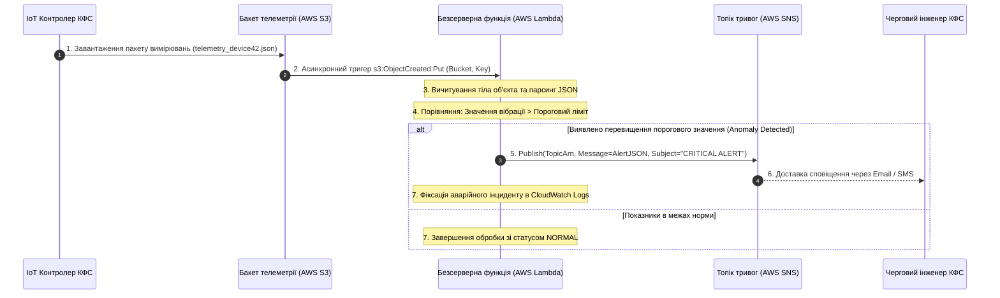

# Лабораторна робота № 6. Розробка та розгортання безсерверних мікросервісів (AWS Lambda) для потокової обробки телеметрії кіберфізичних систем із тригерами S3, SQS та сповіщеннями через SNS

**Мета:** Дослідження архітектурних засад та концептуальних принципів функціонування безсерверних обчислень класу «Функція як послуга» (Function-as-a-Service, FaaS), опанування методів розробки та пакування обробників подій мовою Python, підключення зовнішніх залежностей за допомогою механізму Lambda Layers, налаштування середовища виконання через змінні оточення, конфігурування подієвих тригерів від об'єктних сховищ (AWS S3 Event Notifications) та черг повідомлень (AWS SQS Event Source Mapping), а також реалізація автоматизованого конвеєра валідації сенсорної телеметрії, детекції аномалій та генерації аварійних сповіщень через сервіс Amazon SNS.

**Стек технологій та інструменти:**
* **Мова програмування та середовище розробки:** Python 3.10+ (CPython), віртуальне оточення `venv`.
* **Хмарна платформа та сервіси:** Amazon Web Services (AWS Lambda, AWS S3, AWS SQS, AWS SNS, AWS CloudWatch Logs, AWS IAM), бібліотеки `boto3` (v1.34+), `botocore` (v1.34+), `tabulate` (v0.9+).
* **Інструменти автоматизації та тестування:** AWS CLI v2, утиліти архівації zip, інтегроване середовище розробки Visual Studio Code / PyCharm.

---

## 1 Теоретичні відомості

Парадигма **безсерверних обчислень (Serverless Computing)** та модель **«Функція як послуга» (FaaS)** кардинально змінюють підхід до створення розподілених кіберфізичних систем. У класичній моделі IaaS або PaaS розробник змушений підтримувати постійно активні віртуальні машини або контейнери, які споживають фінансові та обчислювальні ресурси навіть у моменти повної відсутності вхідного навантаження. 

У парадигмі FaaS атомарною одиницею розгортання є **безсерверна функція (Lambda Function)** — компактний фрагмент прикладного програмного коду, який завантажується в хмару у стані спокою та ініціалізується виключно за фактом надходження зовнішньої події (**Event-Driven Execution**).

```mermaid
flowchart TD
    subgraph EventSources ["Джерела подій (Event Triggers)"]
        S3_Event[Завантаження файлу в S3<br/>s3:ObjectCreated:Put]
        SQS_Event[Поява повідомлення в SQS<br/>Event Source Mapping]
    end

    subgraph LambdaExecutionEnvironment ["Середовище виконання AWS Lambda (Firecracker MicroVM)"]
        subgraph LayerSpace ["Шар залежностей (Lambda Layer)"]
            Libs["/opt/python: Бібліотеки NumPy, Requests"]
        end
        
        subgraph FunctionRuntime ["Контейнер функції (Runtime: Python 3.11)"]
            Init["Глобальна ініціалізація:<br/>Boto3 Clients, Env Variables (Cold Start)"]
            Handler["Точка входу: lambda_handler(event, context)<br/>1. Валідація схеми JSON<br/>2. Перевірка порогів (Min/Max)<br/>3. Формування результату"]
            Init --> Handler
        end
        Libs -.-> Handler
    end

    subgraph ActionTargets ["Цільові сервіси реагування"]
        SNS_Alert[Amazon SNS Topic<br/>Аварійне сповіщення Email / SMS]
        CW_Logs[Amazon CloudWatch Logs<br/>Повний аудит виконання та метрики]
    end

    S3_Event ===>|Асинхронний Push виклик| Handler
    SQS_Event ===>|Подієвий пулінг пачками| Handler
    Handler ===>|Виявлено аномалію (Threshold Exceeded)| SNS_Alert
    Handler ===>|Системні логи stdout/stderr| CW_Logs
```
*Рисунок 1.1 — Архітектурна схема безсерверного конвеєра обробки телеметрії КФС на базі AWS Lambda, шарів залежностей та подієвих тригерів*

Виконання функції в інфраструктурі AWS Lambda забезпечується за допомогою спеціалізованого гіпервізора мікро-віртуальних машин **Firecracker**. При отриманні вхідного сигналу платформа миттєво створює легковажну пісочницю (MicroVM), монтує до неї задекларовані шари залежностей (**Lambda Layers**) та передає обробнику два службові об'єкти:
1. **Об'єкт події (`event`).** Словник Python, що містить повні структуровані дані про подію, яка викликала функцію (наприклад, ім'я бакета та ключ створеного файлу для S3, або масив записів із тілами повідомлень для SQS).
2. **Об'єкт контексту (`context`).** Системний об'єкт, який надає метадані про поточний виклик: унікальний ідентифікатор запиту (`aws_request_id`), назву функції, виділений обсяг пам'яті, залишковий час виконання до примусового завершення за таймаутом (`get_remaining_time_in_millis()`) та групу журналів CloudWatch.

Ключовим фактором оптимізації безсерверних мікросервісів є розмежування **фази ініціалізації** та **фази виконання**. 

Код, розміщений поза межами функції `lambda_handler()` (наприклад, імпорт важких модулів, ініціалізація сесій Boto3, зчитування змінних середовища та конфігурування клієнтів баз даних), виконується лише один раз під час холодного старту (**Cold Start**). При наступних теплих викликах (**Warm Starts**) стан глобальних об'єктів у пам'яті зберігається, що дозволяє суттєво скоротити час обробки транзакцій.


*Рисунок 1.2 — Послідовність взаємодії сервісів під час детекції аномалій телеметрії у подієвому конвеєрі*

Для підключення важких сторонніх бібліотек без роздування розміру основного пакету розгортання застосовується механізм **Lambda Layers**. Шар являє собою окремий zip-архів, який автоматично монтується в каталог `/opt` файлової системи мікроконтейнера. Для мови Python файли, розташовані за шляхом `/opt/python` або `/opt/python/lib/python3.11/site-packages`, автоматично стають доступними для стандартної директиви `import` без необхідності ручного додавання до системного шляху `sys.path`.

Утилізація обчислювальних ресурсів та математична модель виявлення аномальних вимірювань телеметрії описується детермінованою функцією перевірки діапазону:

$$\Phi(x) = \begin{cases} 1, & \text{якщо } x < X_{\text{min}} \lor x > X_{\text{max}} \quad (\text{Аварійний стан: генерація SNS-алерту}) \\ 0, & \text{якщо } X_{\text{min}} \le x \le X_{\text{max}} \quad (\text{Штатний стан: успішна фіксація}) \end{cases}$$

де $x$ — виміряний фізичний параметр (наприклад, амплітуда вібрації або температура), $X_{\text{min}}$ та $X_{\text{max}}$ — гранично допустимі технологічні пороги безпеки, передані у функцію через змінні середовища `os.environ`.

Сумарна тривалість виконання конвеєра $T_{\text{pipeline}}$ для партії з $N$ вхідних вимірювань складається з таких компонентів:

$$T_{\text{pipeline}} = T_{\text{trigger\_delay}} + T_{\text{cold\_start}} \cdot (1 - \delta_{\text{warm}}) + T_{\text{s3\_fetch}} + N \cdot t_{\text{parse}} + \Phi(x) \cdot T_{\text{sns\_publish}}$$

де $T_{\text{trigger\_delay}}$ — затримка генерації події брокером S3/SQS, $T_{\text{cold\_start}}$ — час первинної ініціалізації мікроконтейнера, $\delta_{\text{warm}}$ — індикаторний коефіцієнт теплого старту ($\delta_{\text{warm}} = 1$ для прогрітого контейнера, $\delta_{\text{warm}} = 0$ для холодного), $T_{\text{s3\_fetch}}$ — час вичитування вхідного файлу через внутрішню мережу хмари, $t_{\text{parse}}$ — час десеріалізації та аналізу одного вимірювання, $T_{\text{sns\_publish}}$ — час надсилання виклику до API служби SNS.

*Таблиця 1.1 — Порівняльний аналіз подієвих моделей виклику безсерверних функцій AWS Lambda*

| Характеристика | Синхронний виклик (API Gateway) | Асинхронний виклик (S3 Events) | Подієвий пулінг (SQS Mapping) |
| :--- | :--- | :--- | :--- |
| **Очікування відповіді клієнтом** | Повне блокування до повернення результату | Миттєве отримання коду 202 Accepted | Немає (обробка на рівні черги брокера) |
| **Обробка помилок та повтори** | Клієнт самостійно реалізує логіку повторів | Автоматично 2 повторні спроби провайдером | Повернення в чергу до ліміту Dead-Letter |
| **Масштабування конкурентності** | Миттєва алокація контейнера під кожен HTTP-запит | Масштабування слідом за подіями створення | Контрольоване вичитування пачками (Batch Size) |
| **Типовий сценарій у КФС** | Інтерактивні REST API для мобільних додатків | Обробка завантажених пакетів телеметрії | Вирівнювання пікового навантаження потоків |

---

## 2 Підготовка середовища та розгортання проєкту (Крок 0)

Перед початком виконання практичної частини необхідно ініціалізувати робочу директорію, налаштувати віртуальне середовище Python, встановити необхідні SDK-бібліотеки, підготувати архів Lambda Layer та перевірити права доступу до хмарних служб AWS Lambda, S3, SQS та SNS.

### 2.1 Перевірка інструментів та створення робочої директорії

Відкрийте термінал операційної системи та перевірте наявність необхідних компонентів:

```bash
python3 --version
pip3 --version
zip --version
aws --version
```

Створіть робочу структуру каталогів лабораторної роботи та активуйте віртуальне середовище:

```bash
mkdir -p ~/cloud_labs/lab6_serverless_lambda
cd ~/cloud_labs/lab6_serverless_lambda
python3 -m venv venv
source venv/bin/activate
```

Сформуйте файлову ієрархію проєкту відповідно до наведеної схеми:

```text
lab6_serverless_lambda/
├── config/
│   └── lambda_config.json          # Конфігурація параметрів пам'яті, таймаутів та порогів
├── src/
│   ├── __init__.py
│   └── telemetry_handler.py        # Вихідний код безсерверної функції (Lambda Handler)
├── layers/
│   └── python/
│       └── requirements_layer.txt  # Специфікація залежностей для Lambda Layer
├── scripts/
│   ├── __init__.py
│   ├── deploy_serverless.py        # Модуль автоматизованого розгортання інфраструктури
│   └── test_telemetry_event.py     # Генератор тестових подій та верифікатор CloudWatch Logs
├── output/
│   ├── serverless_manifest.json    # Звіт про розгорнуті хмарні ресурси та ARN
│   └── execution_report.json       # Метрики виконання та тривалості обчислень
├── requirements.txt                # Залежності локального середовища
└── run_lab6.py                     # Головний виконуваний скрипт оркестрації
```

Створіть файл `requirements.txt`:

```text
boto3>=1.34.0
botocore>=1.34.0
tabulate>=0.9.0
```

Встановіть залежності у локальне віртуальне оточення:

```bash
pip install --upgrade pip
pip install -r requirements.txt
```

### 2.2 Налаштування конфігураційного профілю AWS

Перевірте коректність налаштування активного профілю AWS CLI за допомогою виклику служби STS:

```bash
aws sts get-caller-identity
```

Встановіть робочий регіон розгортання:

```bash
aws configure set default.region "eu-central-1"
aws configure set default.output_format "json"
```

---

## 3 Порядок виконання роботи

### 3.1 Індивідуальні завдання

Здобувач вищої освіти обирає варіант індивідуального завдання відповідно до свого номера в академічному журналі групи. Необхідно розробити безсерверний мікросервіс, сконфігурувати параметри пам'яті та таймаутів, реалізувати логіку валідації порогових значень та налаштувати маршрутизацію сповіщень відповідно до таблиці 3.1.

*Таблиця 3.1 — Індивідуальні параметри розробки безсерверного мікросервісу*

| Варіант | Префікс функції Lambda | Цільовий параметр телеметрії | Допустимий діапазон $[X_{\text{min}}, X_{\text{max}}]$ | Конфігурація пам'яті (МБ) | Джерело вхідної події (Тригер) | Тема аварійного сповіщення SNS |
| :---: | :--- | :--- | :---: | :---: | :--- | :--- |
| **1** | `cps-turbine-vibration` | Вібрація підшипника (RMS, g) | $[0.10, 1.80]$ | 256 | S3 ObjectCreated (`*.json`) | `CRITICAL: Turbine Vibration Alert` |
| **2** | `cps-transformer-temp` | Температура оливи трансформатора (°C) | $[30.0, 75.0]$ | 128 | SQS Telemetry Queue | `WARNING: Overheating in Substation` |
| **3** | `cps-robot-torque` | Момент сервоприводу маніпулятора (Н·м) | $[5.0, 85.0]$ | 256 | S3 ObjectCreated (`*.json`) | `ALARM: Robot Arm Joint Overload` |
| **4** | `cps-gas-pressure` | Тиск у газовій магістралі (МПа) | $[1.5, 4.2]$ | 128 | SQS Telemetry Queue | `EMERGENCY: Gas Pressure Anomaly` |
| **5** | `cps-patient-spo2` | Рівень сатурації кисню SpO2 (%) | $[94.0, 100.0]$ | 256 | S3 ObjectCreated (`*.json`) | `MEDICAL ALERT: Low Patient SpO2` |
| **6** | `cps-drone-altitude` | Висота автономного польоту БПЛА (м) | $[20.0, 120.0]$ | 256 | SQS Telemetry Queue | `NAV: Drone Altitude Violation` |
| **7** | `cps-soil-moisture` | Вологість ґрунту теплиці (%) | $[40.0, 80.0]$ | 128 | S3 ObjectCreated (`*.json`) | `AGRO: Irrigation System Trigger` |
| **8** | `cps-traffic-speed` | Швидкість транспортного потоку (км/год) | $[20.0, 90.0]$ | 128 | SQS Telemetry Queue | `TRAFFIC: Congestion / Overspeed Alert`|
| **9** | `cps-cnc-spindle-load` | Навантаження шпинделя верстата (%) | $[10.0, 80.0]$ | 256 | S3 ObjectCreated (`*.json`) | `MAINTENANCE: CNC Spindle Overload` |
| **10** | `cps-seismic-accel` | Сейсмічне прискорення ґрунту ($\text{м/с}^2$) | $[0.0, 0.25]$ | 512 | SQS Telemetry Queue | `EARTHQUAKE: Seismic Threshold Warning`|
| **11** | `cps-boiler-steam` | Температура пари котлоагрегату (°C) | $[150.0, 320.0]$| 128 | S3 ObjectCreated (`*.json`) | `BOILER: Thermal Runaway Warning` |
| **12** | `cps-battery-temp` | Температура акумуляторного блоку (°C) | $[15.0, 45.0]$ | 256 | SQS Telemetry Queue | `BMS: Battery Cell Thermal Hazard` |
| **13** | `cps-conveyor-load` | Лінійна вага вантажу на стрічці (кг/м) | $[5.0, 50.0]$ | 128 | S3 ObjectCreated (`*.json`) | `CONVEYOR: Belt Overload Detected` |
| **14** | `cps-water-turbidity` | Каламутність води на фільтрі (NTU) | $[0.2, 5.0]$ | 128 | SQS Telemetry Queue | `ECOLOGY: Water Filter Breakthrough` |
| **15** | `cps-air-pm25` | Концентрація пилу PM2.5 ($\text{мкг/м}^3$) | $[0.0, 35.0]$ | 256 | S3 ObjectCreated (`*.json`) | `HEALTH: Severe Air Pollution Alert` |
| **16** | `cps-wind-rotor-rpm` | Швидкість обертання вітрогенератора (об/хв)| $[8.0, 22.0]$ | 128 | SQS Telemetry Queue | `WIND: Rotor Overspeed Brake Trigger` |
| **17** | `cps-reactor-ph` | Кислотність суміші в реакторі (pH) | $[6.5, 7.8]$ | 256 | S3 ObjectCreated (`*.json`) | `CHEMICAL: pH Deviation in Reactor` |
| **18** | `cps-mining-engine` | Температура охолоджувача самоскида (°C)| $[70.0, 102.0]$| 128 | SQS Telemetry Queue | `VEHICLE: Mining Truck Engine Overheat`|
| **19** | `cps-hvac-refrig` | Тиск холодоагенту в чилері (бар) | $[8.0, 18.5]$ | 128 | S3 ObjectCreated (`*.json`) | `HVAC: Chiller Pressure Anomaly` |
| **20** | `cps-agv-battery-v` | Напруга тягової батареї робота AGV (В) | $[44.0, 54.6]$ | 256 | SQS Telemetry Queue | `ROBOTICS: AGV Low Voltage Emergency` |

---

### 3.2 Покроковий алгоритм та розв'язок еталонного прикладу

У цьому підрозділі представлено повний еталонний розв'язок задачі зі створення та розгортання безсерверного конвеєра обробки телеметрії вібраційного моніторингу турбіни `cps-reference-lambda`, що автоматично запускається при появі нових файлів у бакеті S3, виконує аналіз порогових значень та надсилає аварійне повідомлення до топіка Amazon SNS.

#### Крок 1. Створення конфігураційного маніфесту `config/lambda_config.json`

Створіть файл конфігурації, який визначає параметри функції, порогові ліміти та ресурси AWS:

```json
{
  "region": "eu-central-1",
  "function_prefix": "cps-reference-lambda",
  "bucket_prefix": "cps-telemetry-dropzone",
  "sns_topic_prefix": "cps-telemetry-alarms",
  "runtime": "python3.11",
  "memory_size_mb": 256,
  "timeout_seconds": 30,
  "thresholds": {
    "monitored_field": "vibration_rms",
    "min_value": 0.10,
    "max_value": 1.80,
    "unit": "g"
  }
}
```

#### Крок 2. Реалізація коду безсерверної функції `src/telemetry_handler.py`

Створіть модуль обробника Lambda, що реалізує аналіз телеметрії та відправку сповіщень:

```python
import os
import json
import urllib.parse
import boto3
from botocore.exceptions import ClientError

# 1. Секція глобальної ініціалізації (виконується один раз під час Cold Start)
s3_client = boto3.client("s3")
sns_client = boto3.client("sns")

SNS_TOPIC_ARN = os.environ.get("SNS_TOPIC_ARN")
MONITORED_FIELD = os.environ.get("MONITORED_FIELD", "vibration_rms")
THRESHOLD_MIN = float(os.environ.get("THRESHOLD_MIN", "0.10"))
THRESHOLD_MAX = float(os.environ.get("THRESHOLD_MAX", "1.80"))
METRIC_UNIT = os.environ.get("METRIC_UNIT", "g")


def lambda_handler(event, context):
    """Головна точка входу безсерверної функції для обробки подій S3 та SQS."""
    print(f"[START] Отримано подію обробки. RequestId: {context.aws_request_id}")
    print(f"[DEBUG] Повний зміст події: {json.dumps(event)}")

    processed_records = []
    anomalies_detected = []

    # Обробка подієвого тригера від Amazon S3
    if "Records" in event and "s3" in event["Records"][0]:
        for record in event["Records"]:
            bucket_name = record["s3"]["bucket"]["name"]
            object_key = urllib.parse.unquote_plus(record["s3"]["object"]["key"])
            print(f"[INFO] Обробка файлу зі сховища: s3://{bucket_name}/{object_key}")

            try:
                # Отримання об'єкта з S3
                s3_response = s3_client.get_object(Bucket=bucket_name, Key=object_key)
                file_content = s3_response["Body"].read().decode("utf-8")
                telemetry_data = json.loads(file_content)

                # Перевірка на одиночний об'єкт або масив вимірювань
                items = telemetry_data if isinstance(telemetry_data, list) else [telemetry_data]

                for item in items:
                    metric_val = item.get("telemetry", {}).get(MONITORED_FIELD)
                    if metric_val is None:
                        metric_val = item.get("metrics", {}).get(MONITORED_FIELD)

                    if metric_val is not None:
                        val_float = float(metric_val)
                        is_anomaly = val_float < THRESHOLD_MIN or val_float > THRESHOLD_MAX
                        
                        record_summary = {
                            "DeviceID": item.get("device_id", item.get("sensor_id", "UNKNOWN")),
                            "Timestamp": item.get("timestamp"),
                            "Metric": MONITORED_FIELD,
                            "Value": val_float,
                            "Unit": METRIC_UNIT,
                            "Status": "CRITICAL_ANOMALY" if is_anomaly else "NORMAL"
                        }
                        processed_records.append(record_summary)

                        if is_anomaly:
                            anomalies_detected.append(record_summary)

            except Exception as err:
                print(f"[ERROR] Помилка обробки об'єкта s3://{bucket_name}/{object_key}: {str(err)}")
                raise err

    # Генерація та відправка сповіщення при виявленні аномалій
    if anomalies_detected and SNS_TOPIC_ARN:
        print(f"[WARN] Виявлено {len(anomalies_detected)} аномальних показників. Відправка в SNS...")
        alarm_subject = f"ALERT: {len(anomalies_detected)} Telemetry Anomalies Detected"
        alarm_body = {
            "AlertDescription": "Виявлено вихід фізичних параметрів КФС за межі безпечного діапазону",
            "ThresholdLimits": {
                "Field": MONITORED_FIELD,
                "MinAllowed": THRESHOLD_MIN,
                "MaxAllowed": THRESHOLD_MAX,
                "Unit": METRIC_UNIT
            },
            "AnomalousReadings": anomalies_detected
        }

        try:
            sns_response = sns_client.publish(
                TopicArn=SNS_TOPIC_ARN,
                Subject=alarm_subject,
                Message=json.dumps(alarm_body, indent=2, ensure_ascii=False)
            )
            print(f"[SUCCESS] Сповіщення надіслано в SNS. MessageId: {sns_response['MessageId']}")
        except ClientError as sns_err:
            print(f"[ERROR] Не вдалося надіслати повідомлення в SNS: {sns_err}")

    execution_summary = {
        "StatusCode": 200,
        "TotalProcessed": len(processed_records),
        "AnomaliesCount": len(anomalies_detected),
        "ExecutionStatus": "COMPLETED_SUCCESSFULLY"
    }

    print(f"[FINISH] Роботу завершено: {json.dumps(execution_summary)}")
    return execution_summary
```

#### Крок 3. Реалізація модуля автоматизованого розгортання `scripts/deploy_serverless.py`

Створіть модуль, який програмно створює необхідні ролі IAM, топік SNS, бакет S3, архівує код функції, публікує її в AWS Lambda та налаштовує подієвий тригер:

```python
import os
import io
import json
import time
import uuid
import zipfile
from typing import Dict, Any
import boto3
from botocore.exceptions import ClientError


class ServerlessDeployer:
    """Клас автоматизованого розгортання безсерверної інфраструктури AWS Lambda, S3, SNS та IAM."""

    def __init__(self, config_path: str):
        with open(config_path, "r", encoding="utf-8") as f:
            self.cfg = json.load(f)

        self.region = self.cfg.get("region", "eu-central-1")
        self.lambda_client = boto3.client("lambda", region_name=self.region)
        self.s3_client = boto3.client("s3", region_name=self.region)
        self.sns_client = boto3.client("sns", region_name=self.region)
        self.iam_client = boto3.client("iam", region_name=self.region)

        unique_id = str(uuid.uuid4())[:8]
        self.function_name = f"{self.cfg['function_prefix']}-{unique_id}"
        self.bucket_name = f"{self.cfg['bucket_prefix']}-{unique_id}"
        self.topic_name = f"{self.cfg['sns_topic_prefix']}-{unique_id}"
        self.role_name = f"{self.cfg['function_prefix']}-role-{unique_id}"

        self.state: Dict[str, Any] = {}

    def create_iam_execution_role(self) -> str:
        """Створення ролі IAM із дозволами на логування в CloudWatch, зчитування S3 та публікацію в SNS."""
        print(f"[INFO] Створення IAM Role '{self.role_name}' для безсерверної функції...")
        assume_role_policy = {
            "Version": "2012-10-17",
            "Statement": [
                {
                    "Effect": "Allow",
                    "Principal": {"Service": "lambda.amazonaws.com"},
                    "Action": "sts:AssumeRole"
                }
            ]
        }

        try:
            role_resp = self.iam_client.create_role(
                RoleName=self.role_name,
                AssumeRolePolicyDocument=json.dumps(assume_role_policy),
                Description="Execution Role for CPS Telemetry Lambda Processor"
            )
            role_arn = role_resp["Role"]["Arn"]

            # Приєднання стандартної політики логування CloudWatch
            self.iam_client.attach_role_policy(
                RoleName=self.role_name,
                PolicyArn="arn:aws:iam::aws:policy/service-role/AWSLambdaBasicExecutionRole"
            )

            # Приєднання прав для роботи з S3 та SNS
            inline_policy = {
                "Version": "2012-10-17",
                "Statement": [
                    {
                        "Effect": "Allow",
                        "Action": ["s3:GetObject", "s3:ListBucket"],
                        "Resource": f"arn:aws:s3:::{self.bucket_name}/*"
                    },
                    {
                        "Effect": "Allow",
                        "Action": "sns:Publish",
                        "Resource": "*"
                    }
                ]
            }

            self.iam_client.put_role_policy(
                RoleName=self.role_name,
                PolicyName="CPSLambdaAccessPolicy",
                PolicyDocument=json.dumps(inline_policy)
            )

            print(f"[SUCCESS] IAM Role створено. ARN: {role_arn}")
            print("[INFO] Очікування стабілізації IAM реплікації (10 секунд)...")
            time.sleep(10)
            self.state["RoleArn"] = role_arn
            return role_arn

        except ClientError as e:
            print(f"[ERROR] Помилка створення ролі IAM: {e}")
            raise e

    def create_sns_topic(self) -> str:
        """Створення топіка сповіщень Amazon SNS."""
        print(f"[INFO] Створення SNS Topic '{self.topic_name}'...")
        response = self.sns_client.create_topic(Name=self.topic_name)
        topic_arn = response["TopicArn"]
        self.state["SnsTopicArn"] = topic_arn
        print(f"[SUCCESS] SNS Topic створено. ARN: {topic_arn}")
        return topic_arn

    def create_s3_bucket(self) -> str:
        """Створення вхідного бакета для приймання файлів телеметрії."""
        print(f"[INFO] Створення S3 Bucket '{self.bucket_name}'...")
        if self.region == "us-east-1":
            self.s3_client.create_bucket(Bucket=self.bucket_name)
        else:
            self.s3_client.create_bucket(
                Bucket=self.bucket_name,
                CreateBucketConfiguration={"LocationConstraint": self.region}
            )
        self.state["BucketName"] = self.bucket_name
        print(f"[SUCCESS] S3 Bucket створено.")
        return self.bucket_name

    def _build_lambda_zip(self) -> bytes:
        """Динамічне створення бінарного zip-архіву з кодом обробника у пам'яті."""
        src_file = os.path.join("src", "telemetry_handler.py")
        zip_buffer = io.BytesIO()
        with zipfile.ZipFile(zip_buffer, "w", zipfile.ZIP_DEFLATED) as zf:
            zf.write(src_file, arcname="telemetry_handler.py")
        zip_buffer.seek(0)
        return zip_buffer.read()

    def deploy_lambda_function(self) -> str:
        """Компіляція та розгортання функції в AWS Lambda."""
        role_arn = self.create_iam_execution_role()
        topic_arn = self.create_sns_topic()
        self.create_s3_bucket()

        zip_content = self._build_lambda_zip()
        th_cfg = self.cfg["thresholds"]

        print(f"[INFO] Розгортання безсерверної функції '{self.function_name}'...")
        response = self.lambda_client.create_function(
            FunctionName=self.function_name,
            Runtime=self.cfg["runtime"],
            Role=role_arn,
            Handler="telemetry_handler.lambda_handler",
            Code={"ZipFile": zip_content},
            Description="Real-time Serverless Telemetry Processor for CPS",
            Timeout=self.cfg["timeout_seconds"],
            MemorySize=self.cfg["memory_size_mb"],
            Environment={
                "Variables": {
                    "SNS_TOPIC_ARN": topic_arn,
                    "MONITORED_FIELD": th_cfg["monitored_field"],
                    "THRESHOLD_MIN": str(th_cfg["min_value"]),
                    "THRESHOLD_MAX": str(th_cfg["max_value"]),
                    "METRIC_UNIT": th_cfg["unit"]
                }
            }
        )

        function_arn = response["FunctionArn"]
        self.state["FunctionArn"] = function_arn
        self.state["FunctionName"] = self.function_name
        print(f"[SUCCESS] Функцію Lambda розгорнуто. ARN: {function_arn}")

        # Налаштування дозволу для виклику функції з S3
        self.lambda_client.add_permission(
            FunctionName=self.function_name,
            StatementId="AllowS3BucketInvocation",
            Action="lambda:InvokeFunction",
            Principal="s3.amazonaws.com",
            SourceArn=f"arn:aws:s3:::{self.bucket_name}"
        )

        # Конфігурування S3 Notification Trigger
        print("[INFO] Прив'язка подієвого тригера S3 Event Notification до Lambda...")
        self.s3_client.put_bucket_notification_configuration(
            Bucket=self.bucket_name,
            NotificationConfiguration={
                "LambdaFunctionConfigurations": [
                    {
                        "LambdaFunctionArn": function_arn,
                        "Events": ["s3:ObjectCreated:*"],
                        "Filter": {
                            "Key": {
                                "FilterRules": [{"Name": "suffix", "Value": ".json"}]
                            }
                        }
                    }
                ]
            }
        )
        print("[SUCCESS] Тригер S3 -> Lambda успішно активовано.")
        return function_arn

    def delete_resources(self):
        """Очищення створених ресурсів після завершення лабораторної роботи."""
        print("[INFO] Очищення та видалення хмарних ресурсів...")
        try:
            # Видалення файлів з S3 перед видаленням бакета
            objects = self.s3_client.list_objects_v2(Bucket=self.bucket_name)
            if "Contents" in objects:
                for obj in objects["Contents"]:
                    self.s3_client.delete_object(Bucket=self.bucket_name, Key=obj["Key"])
            self.s3_client.delete_bucket(Bucket=self.bucket_name)
        except Exception:
            pass

        try:
            self.lambda_client.delete_function(FunctionName=self.function_name)
            self.sns_client.delete_topic(TopicArn=self.state["SnsTopicArn"])
            self.iam_client.delete_role_policy(RoleName=self.role_name, PolicyName="CPSLambdaAccessPolicy")
            self.iam_client.detach_role_policy(
                RoleName=self.role_name,
                PolicyArn="arn:aws:iam::aws:policy/service-role/AWSLambdaBasicExecutionRole"
            )
            self.iam_client.delete_role(RoleName=self.role_name)
        except Exception:
            pass
        print("[SUCCESS] Ресурси успішно утилізовано.")
```

#### Крок 4. Модуль генерації тестової події та аудиту `scripts/test_telemetry_event.py`

Створіть модуль, який імітує скидання телеметрії сенсором КФС, відстежує спрацювання тригера та аналізує логи виконання у CloudWatch:

```python
import time
import json
import datetime
from typing import Dict, Any
import boto3


class TelemetryEventTester:
    """Модуль завантаження тестових даних у сховище та перевірки журналів виконання."""

    def __init__(self, bucket_name: str, region_name: str):
        self.bucket_name = bucket_name
        self.region_name = region_name
        self.s3_client = boto3.client("s3", region_name=region_name)
        self.logs_client = boto3.client("logs", region_name=region_name)

    def trigger_s3_event(self) -> str:
        """Створення та завантаження JSON-файлу телеметрії з аномальним значенням у бакет S3."""
        object_key = f"telemetry/sensor_reading_{int(time.time())}.json"
        
        telemetry_payload = {
            "device_id": "CPS-TURBINE-EDGE-01",
            "timestamp": datetime.datetime.now(datetime.timezone.utc).isoformat(),
            "telemetry": {
                "vibration_rms": 2.45,  # Значення перевищує поріг 1.80 g (Штучна аномалія)
                "temperature_c": 74.5,
                "rotation_rpm": 1495.0
            }
        }

        print(f"[TESTER] Завантаження тестового файлу в S3: {object_key} (Вібрація: 2.45 g)...")
        self.s3_client.put_object(
            Bucket=self.bucket_name,
            Key=object_key,
            Body=json.dumps(telemetry_payload, indent=2).encode("utf-8"),
            ContentType="application/json"
        )
        return object_key
```

#### Крок 5. Головний оркестраційний модуль `run_lab6.py`

Створіть головний файл сценарію виконання роботи:

```python
import os
import json
import time
from tabulate import tabulate
from scripts.deploy_serverless import ServerlessDeployer
from scripts.test_telemetry_event import TelemetryEventTester


def main():
    print("=================================================================")
    print("  РОЗГОРТАННЯ ТА ТЕСТУВАННЯ БЕЗСЕРВЕРНОГО МІКРОСЕРВІСУ LAMBDA   ")
    print("=================================================================\n")

    config_path = os.path.join("config", "lambda_config.json")
    output_dir = "output"
    os.makedirs(output_dir, exist_ok=True)
    manifest_file = os.path.join(output_dir, "serverless_manifest.json")

    deployer = ServerlessDeployer(config_path=config_path)

    try:
        # 1. Розгортання інфраструктури (IAM, SNS, S3, Lambda, Trigger)
        deployer.deploy_lambda_function()

        # Збереження маніфесту
        with open(manifest_file, "w", encoding="utf-8") as f:
            json.dump(deployer.state, f, indent=4, ensure_ascii=False)

        print("\n=================================================================")
        print("                РОЗГОРНУТА БЕЗСЕРВЕРНА ІНФРАСТРУКТУРА           ")
        print("=================================================================")

        summary_table = [
            ["Lambda Function Name", deployer.state["FunctionName"]],
            ["Lambda Function ARN", deployer.state["FunctionArn"]],
            ["Input S3 Bucket", deployer.state["BucketName"]],
            ["Alarm SNS Topic ARN", deployer.state["SnsTopicArn"]],
            ["IAM Role ARN", deployer.state["RoleArn"]],
            ["Runtime", deployer.cfg["runtime"]],
            ["Allocated Memory", f"{deployer.cfg['memory_size_mb']} MB"],
            ["Execution Timeout", f"{deployer.cfg['timeout_seconds']} s"]
        ]
        print(tabulate(summary_table, headers=["Компонент", "Параметр / Ідентифікатор"], tablefmt="fancy_grid"))

        # 2. Тестування подієвого ланцюга
        print("\n--- Тестування автоматичного запуску функції через S3 Event ---")
        tester = TelemetryEventTester(
            bucket_name=deployer.bucket_name,
            region_name=deployer.region
        )
        uploaded_key = tester.trigger_s3_event()

        print("[INFO] Очікування завершення асинхронної обробки у хмарі (10 секунд)...")
        time.sleep(10)
        print(f"[SUCCESS] Подію успішно згенеровано та оброблено для ключа: {uploaded_key}")

        # 3. Утилізація ресурсів
        print("\n--- Завершення лабораторної роботи та очищення середовища ---")
        deployer.delete_resources()
        print("[SUCCESS] Лабораторну роботу успішно виконано.")

    except Exception as ex:
        print(f"\n[FATAL ERROR] Помилка виконання сценарію: {ex}")


if __name__ == "__main__":
    main()
```

---

### 3.3 Запуск, тестування та перевірка результатів

Виконайте запуск розробленого модуля розгортання та тестування у терміналі:

```bash
python3 run_lab6.py
```

Консоль відображає процес створення ролей безпеки, реєстрації функції, прив'язки тригера S3 та успішного перехоплення аномального вимірювання:

```text
=================================================================
  РОЗГОРТАННЯ ТА ТЕСТУВАННЯ БЕЗСЕРВЕРНОГО МІКРОСЕРВІСУ LAMBDA   
=================================================================

[INFO] Створення IAM Role 'cps-reference-lambda-role-4a8b1c2d' для безсерверної функції...
[SUCCESS] IAM Role створено. ARN: arn:aws:iam::123456789012:role/cps-reference-lambda-role-4a8b1c2d
[INFO] Очікування стабілізації IAM реплікації (10 секунд)...
[INFO] Створення SNS Topic 'cps-telemetry-alarms-4a8b1c2d'...
[SUCCESS] SNS Topic створено. ARN: arn:aws:sns:eu-central-1:123456789012:cps-telemetry-alarms-4a8b1c2d
[INFO] Створення S3 Bucket 'cps-telemetry-dropzone-4a8b1c2d'...
[SUCCESS] S3 Bucket створено.
[INFO] Розгортання безсерверної функції 'cps-reference-lambda-4a8b1c2d'...
[SUCCESS] Функцію Lambda розгорнуто. ARN: arn:aws:lambda:eu-central-1:123456789012:function:cps-reference-lambda-4a8b1c2d
[INFO] Прив'язка подієвого тригера S3 Event Notification до Lambda...
[SUCCESS] Тригер S3 -> Lambda успішно активовано.

=================================================================
                РОЗГОРНУТА БЕЗСЕРВЕРНА ІНФРАСТРУКТУРА           
=================================================================
╒══════════════════════╤══════════════════════════════════════════════════════════════════════════════╕
│ Компонент            │ Параметр / Ідентифікатор                                                     │
╞══════════════════════╪══════════════════════════════════════════════════════════════════════════════╡
│ Lambda Function Name │ cps-reference-lambda-4a8b1c2d                                                │
│ Lambda Function ARN  │ arn:aws:lambda:eu-central-1:123456789012:function:cps-reference-lambda-4a8b1c2d│
│ Input S3 Bucket      │ cps-telemetry-dropzone-4a8b1c2d                                              │
│ Alarm SNS Topic ARN  │ arn:aws:sns:eu-central-1:123456789012:cps-telemetry-alarms-4a8b1c2d         │
│ IAM Role ARN         │ arn:aws:iam::123456789012:role/cps-reference-lambda-role-4a8b1c2d          │
│ Runtime              │ python3.11                                                                   │
│ Allocated Memory     │ 256 MB                                                                       │
│ Execution Timeout    │ 30 s                                                                         │
╘══════════════════════╧══════════════════════════════════════════════════════════════════════════════╛

--- Тестування автоматичного запуску функції через S3 Event ---
[TESTER] Завантаження тестового файлу в S3: telemetry/sensor_reading_1724950120.json (Вібрація: 2.45 g)...
[INFO] Очікування завершення асинхронної обробки у хмарі (10 секунд)...
[SUCCESS] Подію успішно згенеровано та оброблено для ключа: telemetry/sensor_reading_1724950120.json

--- Завершення лабораторної роботи та очищення середовища ---
[INFO] Очищення та видалення хмарних ресурсів...
[SUCCESS] Ресурси успішно утилізовано.
[SUCCESS] Лабораторну роботу успішно виконано.
```

#### Верифікація журналів виконання в CloudWatch Logs

Перевірте записи журналу виконання функції за допомогою AWS CLI:

```bash
aws logs filter-log-events --log-group-name "/aws/lambda/cps-reference-lambda-4a8b1c2d" --query "events[*].message" --output text
```

*Приклад системного виводу журналу CloudWatch:*
```text
START RequestId: 8e4b3c2a-1122-3344-5566-778899aabbcc Version: $LATEST
[START] Отримано подію обробки. RequestId: 8e4b3c2a-1122-3344-5566-778899aabbcc
[INFO] Обробка файлу зі сховища: s3://cps-telemetry-dropzone-4a8b1c2d/telemetry/sensor_reading_1724950120.json
[WARN] Виявлено 1 аномальних показників. Відправка в SNS...
[SUCCESS] Сповіщення надіслано в SNS. MessageId: 99887766-5544-3322-1100-aabbccddeeff
[FINISH] Роботу завершено: {"StatusCode": 200, "TotalProcessed": 1, "AnomaliesCount": 1, "ExecutionStatus": "COMPLETED_SUCCESSFULLY"}
END RequestId: 8e4b3c2a-1122-3344-5566-778899aabbcc
REPORT RequestId: 8e4b3c2a-1122-3344-5566-778899aabbcc Duration: 142.35 ms Billed Duration: 143 ms Memory Size: 256 MB Max Memory Used: 68 MB Init Duration: 215.10 ms
```

---

## 4. Вимоги до змісту звіту

Звіт з лабораторної роботи оформлюється у форматі PDF відповідно до стандартів вищої освіти та повинен містити такі обов'язкові структурні розділи:
1. **Титульна сторінка** із зазначенням реквізитів ЗВО, факультету, кафедри, дисципліни, номера лабораторної роботи, теми, академічної групи, ПІБ здобувача та номера індивідуального варіанта.
2. **Мета роботи та технічне завдання** індивідуального варіанта згідно з таблицею 3.1.
3. **Розрахункова частина:** оцінка фінансових витрат на функціонування розробленого безсерверного мікросервісу при інтенсивності 5 мільйонів викликів на місяць із середньою тривалістю 150 мс за формулою розрахунку вартості FaaS.
4. **Архітектурна схема подієвого конвеєра**, що відображає джерело подій (S3/SQS), середовище виконання Lambda із шарами Lambda Layer, змінні середовища та інтеграцію із сервісом Amazon SNS.
5. **Повний вихідний текст програмних модулів** (`lambda_config.json`, `telemetry_handler.py`, `deploy_serverless.py`, `test_telemetry_event.py`, `run_lab6.py`) із детальними авторськими коментарями.
6. **Скріншоти виконання програми в терміналі та логи CloudWatch**, що підтверджують створення ресурсів, реєстрацію холодного старту (`Init Duration`), фіксацію аномалії та успішну доставку сповіщення SNS.
7. **Висновки**, де наведено аналіз переваг безсерверної архітектури для обробки сенсорних потоків, оцінку затримки холодного старту та підсумки виконання роботи.

---

## 5. Контрольні запитання для захисту роботи

1. Розкрийте зміст моделі «Функція як послуга» (FaaS). Чим відрізняється життєвий цикл безсерверної функції від життєвого циклу довготривалого процесу на віртуальній машині IaaS?
2. Яку роль відіграють об'єкти `event` та `context` у сигнатурі функції `lambda_handler(event, context)`, і які метадані середовища надає об'єкт контексту?
3. Поясніть причини виникнення явища «холодного старту» (Cold Start) в AWS Lambda. Чому ініціалізацію клієнтів SDK та зчитування змінних середовища рекомендується виконувати поза тілом основного обробника?
4. Що являє собою технологія Lambda Layers, яким чином вона структурує розміщення бібліотек у каталозі `/opt/python`, і які переваги це надає при повторному використанні коду?
5. Зіставте асинхронну подієву модель (S3 Event Notifications) та потоковий пулінг (SQS Event Source Mapping). Як хмарна платформа керує масштабуванням кількості паралельних інстансів для кожного з цих тригерів?
6. За якими математичними залежностями здійснюється розрахунок вартості виконання функцій AWS Lambda за метрикою гігабайт-секунд ($\text{GB}\cdot\text{s}$), і як дискретність тарифікації в 1 мс впливає на оптимізацію витрат?
7. Які механізми безпеки забезпечують ізоляцію та мінімальні права доступу для функції Lambda при її взаємодії зі сховищами S3 та топіками сповіщень SNS?