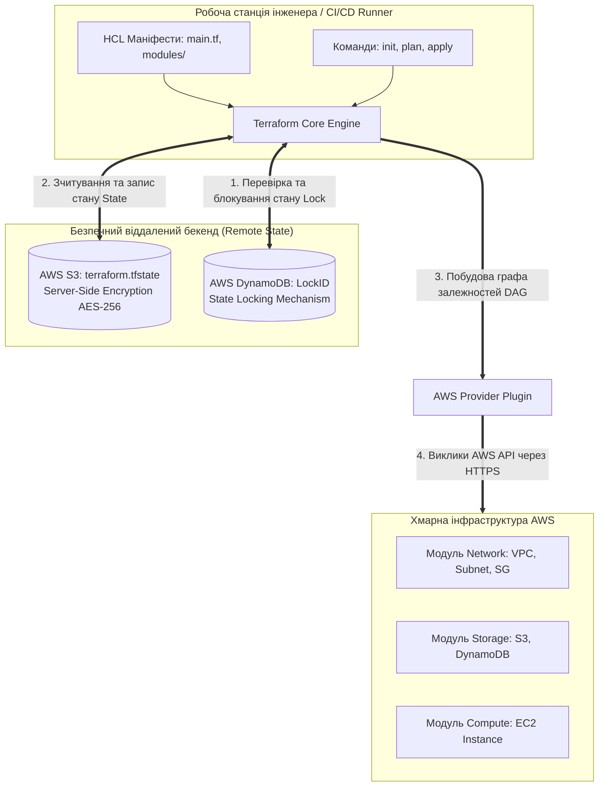
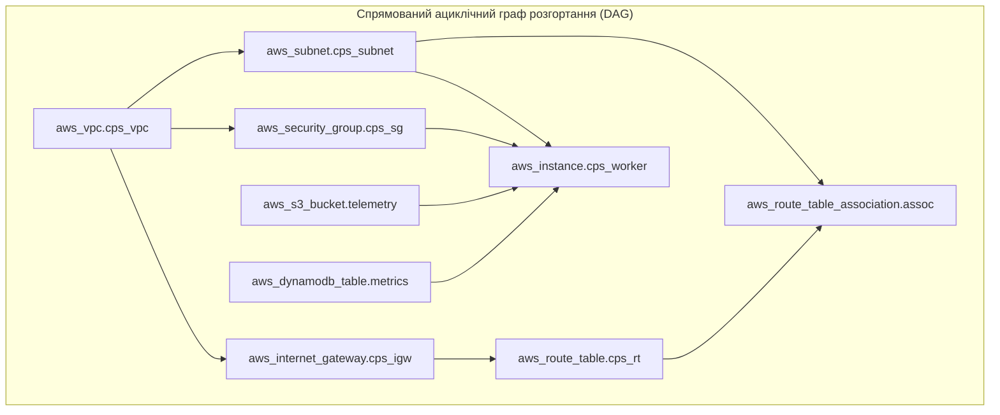

# Лабораторна робота № 7. Автоматизоване розгортання повної модульної інфраструктури хмарного застосунку кіберфізичної системи за допомогою HashiCorp Terraform

**Мета:** Дослідження концептуальних засад та інженерних практик парадигми «Інфраструктура як код» (Infrastructure as Code, IaC), опанування мови декларативного моделювання HashiCorp Configuration Language (HCL), розробка багаторівневої модульної архітектури хмарного застосунку (модулі мережі, сховищ та обчислювальних ресурсів), конфігурування захищеного віддаленого бекенду зберігання стану (Remote Backend на базі AWS S3) з блокуванням паралельних змін через таблицю AWS DynamoDB, а також набуття практичних навичок керування життєвим циклом інфраструктури за допомогою команд `terraform init`, `validate`, `plan`, `apply` та `destroy`.

**Стек технологій та інструменти:**
* **Мова моделювання інфраструктури:** HashiCorp Configuration Language (HCL v2).
* **Інструмент оркестрації:** HashiCorp Terraform CLI (v1.6+).
* **Хмарний провайдер та ресурси:** Amazon Web Services (AWS Provider v5.0+), сервіси AWS VPC, AWS EC2, AWS S3, AWS DynamoDB, AWS IAM.
* **Інструменти автоматизації та діагностики:** AWS CLI v2, клієнт OpenSSH, утиліта командного рядка `cURL`, редактор Visual Studio Code з плагіном HashiCorp Terraform.

---

## 1 Теоретичні відомості

У міру масштабування сучасних кіберфізичних систем ручне керування хмарними ресурсами стає головним джерелом операційних ризиків. Невідповідність між середовищами тестування та промислової експлуатації, відсутність документації на внесені зміни та неможливість швидкого відновлення інфраструктури після збоїв вимагають переходу до парадигми **«Інфраструктура як код» (Infrastructure as Code, IaC)**. 

Фундаментальним інструментом реалізації IaC є **HashiCorp Terraform** — відкрита мультихмарна система декларативного управління ресурсами, яка автоматизує життєвий цикл інфраструктури за допомогою абстрактних маніфестів мовою **HCL (HashiCorp Configuration Language)**.


*Рисунок 1.1 — Архітектурна схема функціонування Terraform Core із віддаленим бекендом S3/DynamoDB та рівнем хмарних провайдерів*

Архітектура Terraform базується на чіткому розділенні ядра (**Terraform Core**) та плагінів взаємодії з платформами (**Providers**). Ядро аналізує конфігураційні файли HCL, будує внутрішню графову модель системи та формує план змін. Провайдер транслює абстрактні декларації ресурсів у специфічні виклики API цільової хмарної платформи (AWS, Azure, Google Cloud, VMware vSphere).

Критично важливим компонентом функціонування Terraform є **файл стану (State File, `terraform.tfstate`)**. Файл стану є структурованим JSON-документом, який містить взаємно однозначне відображення між ресурсами, описаними в HCL-коді, та реальними фізичними об'єктами, створеними у хмарі (з їхніми динамічними ідентифікаторами, атрибутами та метаданими). 

У промислових проєктах зберігання файлу стану на локальному комп'ютері категорично заборонено. Для організації безпечної командної роботи налаштовується **віддалений бекенд (Remote Backend)**, який вирішує дві ключові проблеми:
* **Захист конфіденційних даних.** Файл стану містить конфіденційні атрибути ресурсів у відкритому вигляді (паролі, ключі шифрування, токени). Збереження бекенду в бакеті AWS S3 із примусовим шифруванням **Server-Side Encryption (SSE-S3)** та обмеженням прав доступу на рівні IAM гарантує повну конфіденційність.
* **Блокування стану (State Locking).** Якщо два інженери або паралельні конвеєри CI/CD одночасно виконають команду розгортання, виникне стан перегонів (**Race Condition**), що призведе до пошкодження файлу стану та дублювання ресурсів. Механізм блокування стану використовує таблицю **AWS DynamoDB** із первинним ключем `LockID`. Перед початком планування Terraform створює запис блокування в DynamoDB, а після завершення застосування змін автоматично видаляє його, гарантуючи монопольний доступ до інфраструктури.


*Рисунок 1.2 — Спрямований ациклічний граф залежностей (DAG) між модулями та ресурсами хмарного застосунку*

Планування послідовності створення та модифікації компонентів базується на математичній теорії графів. Terraform транслює всі задекларовані модулі та ресурси у **спрямований ациклічний граф (Directed Acyclic Graph, DAG)** $G = (V, E)$, де $V$ — множина вершин, що представляють ресурси хмари, а $E = \{(u, v)\}$ — множина орієнтованих ребер, які вказують, що ресурс $v$ неявно або явно залежить від ресурсу $u$ (наприклад, віртуальна машина не може бути створена раніше за підмережу, в якій вона розміщується). 

Ядро виконує **топологічне сортування графа**, розбиваючи процес на паралельні потоки для незалежних гілок.

Мінімальний теоретичний час розгортання повної інфраструктури $T_{\text{deploy}}$ за наявності пулу з $p$ паралельних потоків обмежується тривалістю **критичного шляху** у графі залежностей:

$$T_{\text{deploy}} \ge \max_{\pi \in \text{Paths}(G)} \left( \sum_{v \in \pi} \tau_{\text{create}}(v) \right)$$

де $\text{Paths}(G)$ — множина всіх спрямованих шляхів від кореневих вершин до термінальних у графі $G$, $\tau_{\text{create}}(v)$ — час створення $v$-го ресурсу засобами API провайдера (у секундах).

Ймовірність виникнення конфлікту перегонів $P_{\text{collision}}$ при одночасній спробі модифікації інфраструктури $m$ незалежними процесами без активації механізму блокування стану моделюється виразом:

$$P_{\text{collision}} = 1 - e^{-\frac{m(m-1)}{2} \cdot \frac{T_{\text{apply}}}{T_{\text{interval}}}}$$

де $T_{\text{apply}}$ — середня тривалість виконання команди застосування змін `terraform apply` (секунди), $T_{\text{interval}}$ — середній часовий інтервал між ініціалізаціями розгортань різними учасниками команди.

---

## 2 Підготовка середовища та розгортання проєкту (Крок 0)

Перед початком конструювання модульної інфраструктури необхідно перевірити версію утиліти Terraform, налаштувати клієнт AWS CLI, створити первинні хмарні ресурси для збереження файлу стану та ініціалізувати файлову ієрархію модулів.

### 2.1 Встановлення та перевірка утиліти Terraform CLI

Перевірте наявність утиліти Terraform версії 1.5.0 або вище у терміналі операційної системи:

```bash
terraform -version
aws --version
```

У разі відсутності Terraform виконайте його встановлення (для ОС Linux Ubuntu / Debian):

```bash
sudo apt-get update && sudo apt-get install -y gnupg software-properties-common curl
curl -fsSL https://apt.releases.hashicorp.com/gpg | sudo gpg --dearmor -o /usr/share/keyrings/hashicorp-archive-keyring.gpg
echo "deb [signed-by=/usr/share/keyrings/hashicorp-archive-keyring.gpg] https://apt.releases.hashicorp.com $(lsb_release -cs) main" | sudo tee /etc/apt/sources.list.d/hashicorp.list
sudo apt-get update && sudo apt-get install -y terraform
```

### 2.2 Ініціалізація інфраструктури віддаленого бекенду (Bootstrap)

Для безпечного функціонування Remote State необхідно створити початковий бакет S3 та таблицю блокувань DynamoDB за допомогою команд AWS CLI (виконується один раз):

```bash
# Генерація унікального імені бакета
ACCOUNT_ID=$(aws sts get-caller-identity --query "Account" --output text)
BACKEND_BUCKET="cps-terraform-state-${ACCOUNT_ID}"
LOCK_TABLE="terraform-state-locks"
AWS_REGION="eu-central-1"

echo "Створення S3 бакета для State File: ${BACKEND_BUCKET}..."
aws s3api create-bucket --bucket ${BACKEND_BUCKET} --region ${AWS_REGION} --create-bucket-configuration LocationConstraint=${AWS_REGION}

# Увімкнення версійності бакета
aws s3api put-bucket-versioning --bucket ${BACKEND_BUCKET} --versioning-configuration Status=Enabled

# Налаштування шифрування AES256
aws s3api put-bucket-encryption --bucket ${BACKEND_BUCKET} --server-side-encryption-configuration '{"Rules":[{"ApplyServerSideEncryptionByDefault":{"SSEAlgorithm":"AES256"}}]}'

# Створення таблиці блокування стану DynamoDB
echo "Створення DynamoDB таблиці блокування: ${LOCK_TABLE}..."
aws dynamodb create-table \
    --table-name ${LOCK_TABLE} \
    --attribute-definitions AttributeName=LockID,AttributeType=S \
    --key-schema AttributeName=LockID,KeyType=HASH \
    --billing-mode PAY_PER_REQUEST \
    --region ${AWS_REGION}
```

### 2.3 Структура модульного проєкту

Створіть робочу директорію проєкту та сформуйте повну ієрархію кореневого та дочірніх модулів:

```bash
mkdir -p ~/cloud_labs/lab7_terraform_iac
cd ~/cloud_labs/lab7_terraform_iac
mkdir -p modules/network modules/storage modules/compute
```

Структура каталогів розроблюваного комплексу повинна мати такий вигляд:

```text
lab7_terraform_iac/
├── main.tf                      # Кореневий файл оркестрації виклику модулів
├── variables.tf                 # Глобальні змінні проєкту
├── outputs.tf                   # Експортовані параметри розгорнутої інфраструктури
├── terraform.tfvars             # Файл значень змінних для конкретного варіанта
└── modules/
    ├── network/                 # Дочірній модуль віртуальної мережі
    │   ├── main.tf
    │   ├── variables.tf
    │   └── outputs.tf
    ├── storage/                 # Дочірній модуль сховищ (S3 + DynamoDB)
    │   ├── main.tf
    │   ├── variables.tf
    │   └── outputs.tf
    └── compute/                 # Дочірній модуль обчислень (EC2 + User Data)
        ├── main.tf
        ├── variables.tf
        └── outputs.tf
```

---

## 3 Порядок виконання роботи

### 3.1 Індивідуальні завдання

Здобувач вищої освіти обирає індивідуальний варіант згідно зі своїм номером в академічному журналі групи. Необхідно розробити модульний код Terraform, параметризувати його через файл `terraform.tfvars` та виконати розгортання повного інфраструктурного стека відповідно до таблиці 3.1.

*Таблиця 3.1 — Індивідуальні параметри варіантів розгортання хмарної інфраструктури*

| Варіант | Назва кіберфізичного комплексу | Адресний блок VPC | Підмережа Subnet | Тип інстансу EC2 | Префікс S3 бакета | Назва таблиці DynamoDB |
| :---: | :--- | :--- | :--- | :--- | :--- | :--- |
| **1** | `cps-smart-grid-node` | `10.10.0.0/16` | `10.10.1.0/24` | `t3.micro` | `cps-grid-telemetry` | `SmartGridMetrics` |
| **2** | `cps-robot-controller`| `10.20.0.0/16` | `10.20.1.0/24` | `t3.micro` | `cps-robot-logs` | `RobotJointStates` |
| **3** | `cps-pipeline-hub` | `10.30.0.0/16` | `10.30.1.0/24` | `t3.small` | `cps-pipe-telemetry` | `PipelinePressures` |
| **4** | `cps-medical-station` | `172.16.0.0/16` | `172.16.1.0/24` | `t3.micro` | `cps-medical-vital` | `PatientVitalRecords` |
| **5** | `cps-drone-fleet-gw` | `172.17.0.0/16` | `172.17.1.0/24` | `t3.small` | `cps-drone-telemetry` | `FlightNavigationData`|
| **6** | `cps-agri-greenhouse` | `172.18.0.0/16` | `172.18.1.0/24` | `t3.micro` | `cps-greenhouse-env` | `SoilMoistureClimate` |
| **7** | `cps-traffic-radar-hub`| `192.168.0.0/16` | `192.168.1.0/24`| `t3.micro` | `cps-traffic-records` | `TrafficFlowMetrics` |
| **8** | `cps-cnc-monitor-core` | `10.40.0.0/16` | `10.40.1.0/24` | `t3.small` | `cps-cnc-telemetry` | `SpindleVibrationLog` |
| **9** | `cps-seismic-detector` | `10.50.0.0/16` | `10.50.1.0/24` | `t3.micro` | `cps-seismic-stream` | `EarthquakeSensors` |
| **10** | `cps-boiler-scada` | `172.19.0.0/16` | `172.19.1.0/24` | `t3.small` | `cps-boiler-thermal` | `ThermalBoilerStates` |
| **11** | `cps-bms-battery-core` | `192.168.0.0/16` | `192.168.10.0/24`| `t3.micro` | `cps-battery-records` | `BatteryPackHealth` |
| **12** | `cps-conveyor-speed` | `10.60.0.0/16` | `10.60.1.0/24` | `t3.micro` | `cps-conveyor-data` | `LineSpeedTonnage` |
| **13** | `cps-water-filtration` | `172.20.0.0/16` | `172.20.1.0/24` | `t3.small` | `cps-water-quality` | `WaterPurityMetrics` |
| **14** | `cps-air-pollution-hub`| `10.70.0.0/16` | `10.70.1.0/24` | `t3.micro` | `cps-air-pollution` | `AirPollutionPM25` |
| **15** | `cps-wind-turbine-unit`| `172.21.0.0/16` | `172.21.1.0/24` | `t3.small` | `cps-wind-telemetry` | `RotorSpeedPowerKw` |
| **16** | `cps-chemical-reactor` | `192.168.0.0/16` | `192.168.20.0/24`| `t3.micro` | `cps-chem-telemetry` | `ReactorPHTemperature`|
| **17** | `cps-mining-hauler` | `10.80.0.0/16` | `10.80.1.0/24` | `t3.small` | `cps-mining-vehicle` | `HaulerEngineHydraul` |
| **18** | `cps-hvac-commercial` | `172.22.0.0/16` | `172.22.1.0/24` | `t3.micro` | `cps-hvac-telemetry` | `ChillerPressureLoad` |
| **19** | `cps-agv-warehouse` | `10.90.0.0/16` | `10.90.1.0/24` | `t3.small` | `cps-agv-navigation` | `WarehouseAGVState` |
| **20** | `cps-solar-inverter` | `172.23.0.0/16` | `172.23.1.0/24` | `t3.micro` | `cps-solar-telemetry` | `SolarPVPowerArray` |

---

### 3.2 Покроковий алгоритм та розв'язок еталонного прикладу

У цьому підрозділі представлено повний еталонний розв'язок задачі побудови тримодульної архітектури хмарної інфраструктури для системи моніторингу `cps-reference-system`.

#### Крок 1. Розробка модуля віртуальної мережі `modules/network`

Створіть файли специфікації підмереж, таблиць маршрутизації, шлюзів та груп безпеки:

**Файл `modules/network/variables.tf`:**
```hcl
variable "vpc_cidr" {
  type        = string
  description = "Адресний блок CIDR для віртуальної приватної хмари (VPC)"
}

variable "subnet_cidr" {
  type        = string
  description = "Адресний блок CIDR для підмережі інстансів"
}

variable "availability_zone" {
  type        = string
  description = "Цільова зона доступності для розміщення підмережі"
}

variable "project_name" {
  type        = string
  description = "Префікс назви проєкту для тегування ресурсів"
}
```

**Файл `modules/network/main.tf`:**
```hcl
# Створення віртуальної приватної хмари
resource "aws_vpc" "main_vpc" {
  cidr_block           = var.vpc_cidr
  enable_dns_support   = true
  enable_dns_hostnames = true

  tags = {
    Name    = "${var.project_name}-vpc"
    Project = var.project_name
  }
}

# Створення Інтернет-шлюзу
resource "aws_internet_gateway" "main_igw" {
  vpc_id = aws_vpc.main_vpc.id

  tags = {
    Name    = "${var.project_name}-igw"
    Project = var.project_name
  }
}

# Створення публічної підмережі
resource "aws_subnet" "main_subnet" {
  vpc_id                  = aws_vpc.main_vpc.id
  cidr_block              = var.subnet_cidr
  availability_zone       = var.availability_zone
  map_public_ip_on_launch = true

  tags = {
    Name    = "${var.project_name}-subnet"
    Project = var.project_name
  }
}

# Таблиця маршрутизації зі шлюзом за замовчуванням
resource "aws_route_table" "public_rt" {
  vpc_id = aws_vpc.main_vpc.id

  route {
    cidr_block = "0.0.0.0/0"
    gateway_id = aws_internet_gateway.main_igw.id
  }

  tags = {
    Name    = "${var.project_name}-public-rt"
    Project = var.project_name
  }
}

# Асоціація таблиці маршрутизації з підмережею
resource "aws_route_table_association" "public_assoc" {
  subnet_id      = aws_subnet.main_subnet.id
  route_table_id = aws_route_table.public_rt.id
}

# Група безпеки з відкритими портами SSH (22) та Telemetry Web Service (8080)
resource "aws_security_group" "instance_sg" {
  name        = "${var.project_name}-security-group"
  description = "Security group for CPS computing nodes"
  vpc_id      = aws_vpc.main_vpc.id

  ingress {
    description = "SSH administrative access"
    from_port   = 22
    to_port     = 22
    protocol    = "tcp"
    cidr_blocks = ["0.0.0.0/0"]
  }

  ingress {
    description = "CPS Telemetry HTTP Endpoint"
    from_port   = 8080
    to_port     = 8080
    protocol    = "tcp"
    cidr_blocks = ["0.0.0.0/0"]
  }

  egress {
    description = "Allow all outbound traffic"
    from_port   = 0
    to_port     = 0
    protocol    = "-1"
    cidr_blocks = ["0.0.0.0/0"]
  }

  tags = {
    Name    = "${var.project_name}-sg"
    Project = var.project_name
  }
}
```

**Файл `modules/network/outputs.tf`:**
```hcl
output "vpc_id" {
  value       = aws_vpc.main_vpc.id
  description = "Ідентифікатор створеної віртуальної мережі"
}

output "subnet_id" {
  value       = aws_subnet.main_subnet.id
  description = "Ідентифікатор створеної підмережі"
}

output "security_group_id" {
  value       = aws_security_group.instance_sg.id
  description = "Ідентифікатор створеної групи безпеки"
}
```

---

#### Крок 2. Розробка модуля сховищ даних `modules/storage`

Створіть файли опису об'єктного бакета S3 із шифруванням та таблиці DynamoDB:

**Файл `modules/storage/variables.tf`:**
```hcl
variable "bucket_prefix" {
  type        = string
  description = "Префікс назви бакета S3"
}

variable "table_name" {
  type        = string
  description = "Назва таблиці бази даних DynamoDB"
}

variable "project_name" {
  type        = string
  description = "Назва проєкту для тегів"
}
```

**Файл `modules/storage/main.tf`:**
```hcl
# Генерація псевдовипадкового рядка для унікальності бакета
resource "random_string" "bucket_suffix" {
  length  = 8
  special = false
  upper   = false
}

# Об'єктний бакет S3 для зберігання телеметрії
resource "aws_s3_bucket" "telemetry_bucket" {
  bucket        = "${var.bucket_prefix}-${random_string.bucket_suffix.result}"
  force_destroy = true

  tags = {
    Name    = "${var.project_name}-telemetry-bucket"
    Project = var.project_name
  }
}

# Блокування публічного доступу до бакета
resource "aws_s3_bucket_public_access_block" "public_block" {
  bucket = aws_s3_bucket.telemetry_bucket.id

  block_public_acls       = true
  block_public_policy     = true
  ignore_public_acls      = true
  restrict_public_buckets = true
}

# Серверне шифрування за алгоритмом AES256
resource "aws_s3_bucket_server_side_encryption_configuration" "bucket_crypto" {
  bucket = aws_s3_bucket.telemetry_bucket.id

  rule {
    apply_server_side_encryption_by_default {
      sse_algorithm = "AES256"
    }
  }
}

# Таблиця DynamoDB у режимі Pay-per-Request (On-Demand)
resource "aws_dynamodb_table" "metrics_table" {
  name         = var.table_name
  billing_mode = "PAY_PER_REQUEST"
  hash_key     = "DeviceID"
  range_key    = "Timestamp"

  attribute {
    name = "DeviceID"
    type = "S"
  }

  attribute {
    name = "Timestamp"
    type = "N"
  }

  point_in_time_recovery {
    enabled = true
  }

  tags = {
    Name    = var.table_name
    Project = var.project_name
  }
}
```

**Файл `modules/storage/outputs.tf`:**
```hcl
output "bucket_name" {
  value       = aws_s3_bucket.telemetry_bucket.id
  description = "Глобальне ім'я створеного бакета S3"
}

output "dynamodb_table_name" {
  value       = aws_dynamodb_table.metrics_table.name
  description = "Назва створеної таблиці DynamoDB"
}
```

---

#### Крок 3. Розробка обчислювального модуля `modules/compute`

Створіть модуль розгортання віртуальної машини з передачею параметрів через `user_data`:

**Файл `modules/compute/variables.tf`:**
```hcl
variable "instance_type" {
  type        = string
  description = "Тип обчислювального інстансу EC2"
}

variable "subnet_id" {
  type        = string
  description = "Ідентифікатор підмережі для розміщення інстансу"
}

variable "security_group_id" {
  type        = string
  description = "Ідентифікатор призначеної групи безпеки"
}

variable "bucket_name" {
  type        = string
  description = "Назва бакета S3, куди надсилатимуться дані"
}

variable "dynamodb_table_name" {
  type        = string
  description = "Назва таблиці DynamoDB для реєстрації метрик"
}

variable "project_name" {
  type        = string
  description = "Назва проєкту"
}
```

**Файл `modules/compute/main.tf`:**
```hcl
# Динамічний пошук офіційного AMI образу Ubuntu 22.04 LTS
data "aws_ami" "ubuntu_lts" {
  most_recent = true
  owners      = ["099720109477"] # Canonical ID

  filter {
    name   = "name"
    values = ["ubuntu/images/hvm-ssd/ubuntu-jammy-22.04-amd64-server-*"]
  }

  filter {
    name   = "virtualization-type"
    values = ["hvm"]
  }
}

# Обчислювальний інстанс EC2
resource "aws_instance" "cps_node" {
  ami                    = data.aws_ami.ubuntu_lts.id
  instance_type          = var.instance_type
  subnet_id              = var.subnet_id
  vpc_security_group_ids = [var.security_group_id]

  # Передача ініціалізаційного скрипта User Data
  user_data = <<-EOF
              #!/bin/bash
              apt-get update -y
              apt-get install -y python3-pip curl

              # Збереження інформації про зв'язані хмарні ресурси
              mkdir -p /etc/cps
              cat << 'EOC' > /etc/cps/cloud_env.json
              {
                "ProjectName": "${var.project_name}",
                "TargetBucket": "${var.bucket_name}",
                "TargetDynamoTable": "${var.dynamodb_table_name}"
              }
              EOC

              # Створення простого тестового вебсервісу телеметрії на Python
              cat << 'EOP' > /opt/telemetry_service.py
              import http.server
              import socketserver
              import json
              import os

              class TelemetryHandler(http.server.SimpleHTTPRequestHandler):
                  def do_GET(self):
                      self.send_response(200)
                      self.send_header('Content-type', 'application/json')
                      self.end_headers()
                      
                      with open('/etc/cps/cloud_env.json', 'r') as f:
                          env_data = json.load(f)

                      response = {
                          "status": "ONLINE",
                          "service": "CPS Edge Processing Node",
                          "cloud_bindings": env_data
                      }
                      self.wfile.write(json.dumps(response, indent=2).encode('utf-8'))

              with socketserver.TCPServer(("", 8080), TelemetryHandler) as httpd:
                  httpd.serve_forever()
              EOP

              nohup python3 /opt/telemetry_service.py > /var/log/cps_telemetry.log 2>&1 &
              EOF

  tags = {
    Name    = "${var.project_name}-compute-node"
    Project = var.project_name
  }
}
```

**Файл `modules/compute/outputs.tf`:**
```hcl
output "instance_id" {
  value       = aws_instance.cps_node.id
  description = "Ідентифікатор створеного інстансу"
}

output "public_ip" {
  value       = aws_instance.cps_node.public_ip
  description = "Публічна IP-адреса для доступу до сервісу телеметрії"
}
```

---

#### Крок 4. Розробка кореневого модуля оркестрації

Створіть файли кореневого каталогу проєкту, що зв'язують модулі в єдину інфраструктуру:

**Файл `variables.tf`:**
```hcl
variable "aws_region" {
  type        = string
  default     = "eu-central-1"
  description = "Хмарний регіон розгортання"
}

variable "project_name" {
  type        = string
  default     = "cps-reference-system"
  description = "Ім'я проєкту"
}

variable "vpc_cidr" {
  type        = string
  default     = "10.0.0.0/16"
  description = "CIDR блок мережі VPC"
}

variable "subnet_cidr" {
  type        = string
  default     = "10.0.1.0/24"
  description = "CIDR блок підмережі"
}

variable "availability_zone" {
  type        = string
  default     = "eu-central-1a"
  description = "Зона доступності"
}

variable "instance_type" {
  type        = string
  default     = "t3.micro"
  description = "Тип віртуальної машини"
}

variable "bucket_prefix" {
  type        = string
  default     = "cps-ref-telemetry"
  description = "Префікс об'єктного бакета"
}

variable "dynamodb_table_name" {
  type        = string
  default     = "CPSReferenceMetrics"
  description = "Назва таблиці DynamoDB"
}
```

**Файл `main.tf`:**
```hcl
terraform {
  required_version = ">= 1.5.0"

  required_providers {
    aws = {
      source  = "hashicorp/aws"
      version = "~> 5.0"
    }
    random = {
      source  = "hashicorp/random"
      version = "~> 3.5"
    }
  }

  # Налаштування віддаленого бекенду зберігання стану
  # УВАГА: Замініть значення 'bucket' на ім'я вашого бакета, створеного на Кроці 0
  backend "s3" {
    bucket         = "cps-terraform-state-REPLACE_WITH_ACCOUNT_ID"
    key            = "cps-core/terraform.tfstate"
    region         = "eu-central-1"
    dynamodb_table = "terraform-state-locks"
    encrypt        = true
  }
}

provider "aws" {
  region = var.aws_region
}

# 1. Виклик модуля віртуальної мережі
module "network" {
  source            = "./modules/network"
  vpc_cidr          = var.vpc_cidr
  subnet_cidr       = var.subnet_cidr
  availability_zone = var.availability_zone
  project_name      = var.project_name
}

# 2. Виклик модуля сховищ даних
module "storage" {
  source        = "./modules/storage"
  bucket_prefix = var.bucket_prefix
  table_name    = var.dynamodb_table_name
  project_name  = var.project_name
}

# 3. Виклик обчислювального модуля
module "compute" {
  source              = "./modules/compute"
  instance_type       = var.instance_type
  subnet_id           = module.network.subnet_id
  security_group_id   = module.network.security_group_id
  bucket_name         = module.storage.bucket_name
  dynamodb_table_name = module.storage.dynamodb_table_name
  project_name        = var.project_name
}
```

**Файл `outputs.tf`:**
```hcl
output "deployed_vpc_id" {
  value       = module.network.vpc_id
  description = "Ідентифікатор створеної VPC"
}

output "telemetry_bucket_name" {
  value       = module.storage.bucket_name
  description = "Назва створеного S3 бакета"
}

output "dynamodb_table" {
  value       = module.storage.dynamodb_table_name
  description = "Назва створеної таблиці DynamoDB"
}

output "compute_node_public_ip" {
  value       = module.compute.public_ip
  description = "Публічна IP-адреса обчислювального вузла"
}

output "telemetry_endpoint_url" {
  value       = "http://${module.compute.public_ip}:8080"
  description = "Пряме URL-посилання на сервіс телеметрії КФС"
}
```

**Файл `terraform.tfvars`:**
```hcl
aws_region          = "eu-central-1"
project_name        = "cps-reference-system"
vpc_cidr            = "10.0.0.0/16"
subnet_cidr         = "10.0.1.0/24"
availability_zone   = "eu-central-1a"
instance_type       = "t3.micro"
bucket_prefix       = "cps-ref-telemetry"
dynamodb_table_name = "CPSReferenceMetrics"
```

---

### 3.3 Запуск, тестування та перевірка результатів

Перед запуском замініть рядок `bucket = "cps-terraform-state-REPLACE_WITH_ACCOUNT_ID"` у файлі `main.tf` на реальну назву вашого бакета, створеного у підрозділі 2.2.

#### Етап 1. Ініціалізація та валідація коду

Виконайте ініціалізацію робочого середовища Terraform, завантаження провайдерів та підключення віддаленого бекенду:

```bash
terraform init
```

*Очікуване виведення терміналу:*
```text
Initializing the backend...

Successfully configured the backend "s3"! Terraform will automatically
use this backend unless the backend configuration changes.

Initializing provider plugins...
- Finding hashicorp/aws versions matching "~> 5.0"...
- Finding hashicorp/random versions matching "~> 3.5"...
- Installing hashicorp/aws v5.31.0...
- Installing hashicorp/random v3.6.0...

Terraform has been successfully initialized!
```

Виконайте синтаксичну перевірку та автоматичне форматування маніфестів:

```bash
terraform fmt -recursive
terraform validate
```

*Очікуване виведення:*
```text
Success! The configuration is valid.
```

#### Етап 2. Генерація плану виконання (Plan)

Сформуйте та збережіть бінарний файл плану розгортання:

```bash
terraform plan -out=tfplan
```

У терміналі відображається повний перелік ресурсів (10 до додавання: VPC, Subnet, IGW, RouteTable, RouteTableAssoc, SecurityGroup, S3 Bucket, S3 Encryption, S3 PublicBlock, DynamoDB Table, RandomString, EC2 Instance):

```text
Plan: 11 to add, 0 to change, 0 to destroy.

Changes to Outputs:
  + compute_node_public_ip = (known after apply)
  + deployed_vpc_id        = (known after apply)
  + dynamodb_table         = "CPSReferenceMetrics"
  + telemetry_bucket_name  = (known after apply)
  + telemetry_endpoint_url = (known after apply)
```

#### Етап 3. Застосування плану та розгортання інфраструктури (Apply)

Застосуйте згенерований план до хмари:

```bash
terraform apply tfplan
```

*Приклад фінального виведення консолі:*
```text
module.storage.random_string.bucket_suffix: Creating...
module.network.aws_vpc.main_vpc: Creating...
module.storage.aws_dynamodb_table.metrics_table: Creating...
module.storage.random_string.bucket_suffix: Creation complete after 0s [id=a1b2c3d4]
module.storage.aws_s3_bucket.telemetry_bucket: Creating...
module.network.aws_vpc.main_vpc: Still creating... [10s elapsed]
module.network.aws_vpc.main_vpc: Creation complete after 12s [id=vpc-08e1a5f4c39b22a01]
module.network.aws_internet_gateway.main_igw: Creating...
module.network.aws_subnet.main_subnet: Creating...
module.network.aws_security_group.instance_sg: Creating...
module.network.aws_internet_gateway.main_igw: Creation complete after 2s [id=igw-0abc123def4567890]
module.network.aws_route_table.public_rt: Creating...
module.network.aws_subnet.main_subnet: Creation complete after 3s [id=subnet-0123456789abcdef0]
module.network.aws_security_group.instance_sg: Creation complete after 4s [id=sg-0987654321fedcba0]
module.compute.data.aws_ami.ubuntu_lts: Reading...
module.compute.data.aws_ami.ubuntu_lts: Read complete after 1s [id=ami-0faab6bdbac9486fb]
module.compute.aws_instance.cps_node: Creating...
module.storage.aws_s3_bucket.telemetry_bucket: Creation complete after 6s [id=cps-ref-telemetry-a1b2c3d4]
module.storage.aws_s3_bucket_server_side_encryption_configuration.bucket_crypto: Creating...
module.storage.aws_s3_bucket_public_access_block.public_block: Creating...
module.network.aws_route_table.public_rt: Creation complete after 2s [id=rtb-01122334455667788]
module.network.aws_route_table_association.public_assoc: Creating...
module.network.aws_route_table_association.public_assoc: Creation complete after 1s [id=rtbassoc-0aabbccddeeff1122]
module.storage.aws_s3_bucket_public_access_block.public_block: Creation complete after 2s [id=cps-ref-telemetry-a1b2c3d4]
module.storage.aws_s3_bucket_server_side_encryption_configuration.bucket_crypto: Creation complete after 1s [id=cps-ref-telemetry-a1b2c3d4]
module.compute.aws_instance.cps_node: Still creating... [10s elapsed]
module.storage.aws_dynamodb_table.metrics_table: Creation complete after 15s [id=CPSReferenceMetrics]
module.compute.aws_instance.cps_node: Creation complete after 18s [id=i-0a8b9c7d6e5f41234]

Apply complete! Resources: 11 added, 0 changed, 0 destroyed.

Outputs:

compute_node_public_ip = "3.120.45.67"
deployed_vpc_id = "vpc-08e1a5f4c39b22a01"
dynamodb_table = "CPSReferenceMetrics"
telemetry_bucket_name = "cps-ref-telemetry-a1b2c3d4"
telemetry_endpoint_url = "http://3.120.45.67:8080"
```

#### Етап 4. Верифікація роботи розгорнутого сервісу

Зачекайте 30 секунд для завершення виконання скрипта `User Data` на віртуальній машині та надішліть HTTP-запит до сервісу за допомогою утиліти `cURL`:

```bash
curl http://3.120.45.67:8080
```

*Очікувана відповідь від інстансу:*
```json
{
  "status": "ONLINE",
  "service": "CPS Edge Processing Node",
  "cloud_bindings": {
    "ProjectName": "cps-reference-system",
    "TargetBucket": "cps-ref-telemetry-a1b2c3d4",
    "TargetDynamoTable": "CPSReferenceMetrics"
  }
}
```

#### Етап 5. Демонстрація блокування стану (State Locking)

Відкрийте друге вікно терміналу та одночасно запустіть команду `terraform plan` в обох вікнах. У другому терміналі відобразиться повідомлення про блокування:

```text
Error: Error acquiring the state lock

Lock Info:
  ID:        8e4b3c2a-1122-3344-5566-778899aabbcc
  Path:      cps-terraform-state-.../cps-core/terraform.tfstate
  Operation: OperationTypePlan
  Who:       user@workstation
  Created:   2026-08-29 19:40:12 UTC

Terraform acquires a state lock to protect the state from being written
by multiple users at the same time.
```

#### Етап 6. Повне знищення інфраструктури (Destroy)

Після завершення тестування виконайте повне видалення створених компонентів:

```bash
terraform destroy -auto-approve
```

*Очікуване виведення:*
```text
Destroy complete! Resources: 11 destroyed.
```

---

## 4. Вимоги до змісту звіту

Звіт з лабораторної роботи оформлюється у форматі PDF відповідно до вимог вищої школи та повинен містити такі обов'язкові структурні елементи:
1. **Титульна сторінка** із зазначенням реквізитів ЗВО, факультету, кафедри, дисципліни, номера лабораторної роботи, теми, академічної групи, ПІБ здобувача та номера індивідуального варіанта.
2. **Мета роботи та технічне завдання** індивідуального варіанта згідно з таблицею 3.1.
3. **Розрахункова частина:** побудова графа залежностей DAG для створених ресурсів та розрахунок критичного шляху часу розгортання інфраструктури за формулою теоретичного розділу.
4. **Архітектурна схема модульної інфраструктури**, що відображає взаємозв'язки між модулями `network`, `storage`, `compute` та віддаленим бекендом S3/DynamoDB.
5. **Повний вихідний код HCL-маніфестів** усіх розроблених модулів (`main.tf`, `variables.tf`, `outputs.tf`, `terraform.tfvars`) із детальними авторськими коментарями.
6. **Скріншоти та логи терміналу**, які підтверджують успішне виконання команд `terraform init`, `terraform apply`, отримання відповіді від запущеного HTTP-демона та спрацювання механізму State Locking.
7. **Аналітичні висновки**, де наведено оцінку переваг парадигми IaC над ручним налаштуванням, аналіз безпеки Remote State та підсумки досягнення мети роботи.

---

## 5. Контрольні запитання для захисту роботи

1. У чому полягає фундаментальна різниця між імперативним та декларативним підходами до опису інфраструктури? Як властивість ідемпотентності забезпечує надійність розгортання хмарних систем?
2. Яке призначення має файл стану `terraform.tfstate`, які ризики виникають при його збереженні в незахищених локальних директоріях або публічних Git-репозиторіях?
3. Поясніть механізм блокування стану (State Locking). Як взаємодіють сервіси AWS S3 та DynamoDB під час паралельного виконання операцій різними користувачами?
4. Розкрийте принцип побудови спрямованого ациклічного графа (DAG) ядром Terraform Core. Як обчислюється критичний шлях паралельного створення ресурсів?
5. Чим відрізняються вхідні змінні (`variable`), локальні константи (`locals`) та вихідні значення (`output`) у мові HCL?
6. Поясніть принципи організації модульної структури Terraform-проєкту. Як здійснюється передача вихідних значень одного модуля як вхідних параметрів для іншого?
7. Що являє собою операція `terraform destroy`, в якій послідовності вона виконує видалення ресурсів згідно з графом залежностей, і як захистити критичні сховища даних від випадкового знищення (наприклад, за допомогою директиви `prevent_destroy`)?