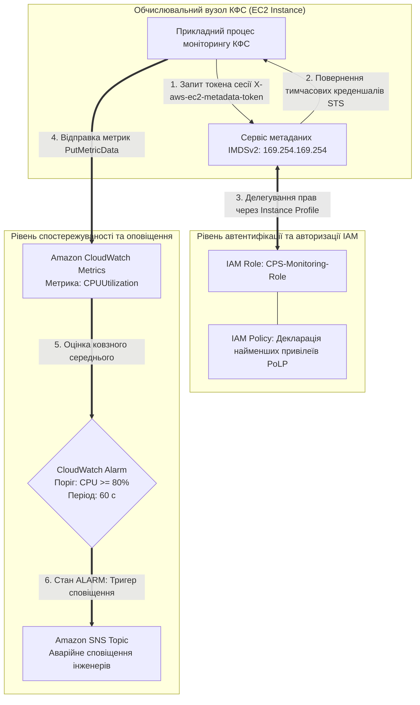
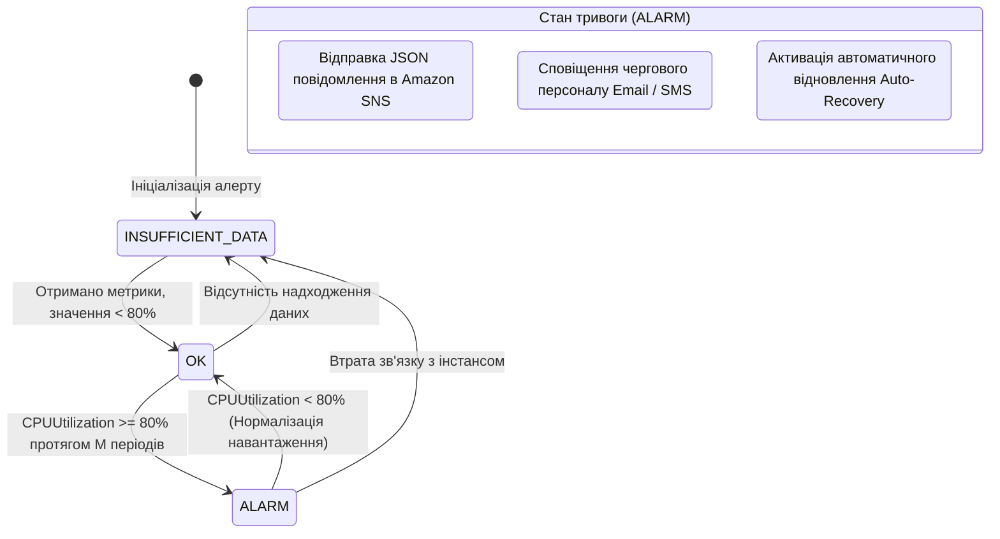

# Лабораторна робота № 8. Налаштування безпеки (IAM), ролей інстансів (Instance Profiles) та комплексного моніторингу метрик і тригерів тривоги (AWS CloudWatch) для кіберфізичних систем

**Мета:** Дослідження архітектурних принципів побудови систем безпеки у хмарних середовищах на основі парадигми нульової довіри (Zero-Trust) та принципу найменших привілеїв (Principle of Least Privilege), опанування методів програмного проєктування гранулярних політик доступу AWS IAM у форматі JSON, розробка та призначення профілів інстансів (EC2 Instance Profiles) для безпечної взаємодії віртуальних машин із хмарними сервісами без використання статичних ключів доступу, налаштування комплексного моніторингу системних метрик засобами Amazon CloudWatch, конфігурування тригерів тривоги (CloudWatch Alarms) на базі порогових значень та проведення експериментального навантажувального тестування інстансу для автоматичної фіксації аномального завантаження процесора та генерації сповіщень через Amazon SNS.

**Стек технологій та інструменти:**
* **Мова програмування та середовище розробки:** Python 3.10+ (CPython), віртуальне оточення `venv`.
* **Хмарна платформа та сервіси:** Amazon Web Services (AWS IAM, AWS EC2, AWS CloudWatch, AWS SNS, AWS CloudTrail), SDK-бібліотека `boto3` (v1.34+), `botocore` (v1.34+), утиліта форматування `tabulate` (v0.9+).
* **Інструменти тестування та діагностики:** AWS CLI v2, утиліти навантажувального стрес-тестування Linux (`stress-ng`, `htop`, `sysstat`), інтегроване середовище розробки Visual Studio Code / PyCharm.

---

## 1 Теоретичні відомості

У кіберфізичних системах та критичній інформаційній інфраструктурі безпека та спостережуваність є нерозривними складовими надійного функціонування. Згідно з моделлю нульової довіри (**Zero-Trust Architecture**), жоден внутрішній або зовнішній компонент системи не вважається апріорі довіреним. Збереження статичних паролів або довготривалих ключів доступу API (`AWS_ACCESS_KEY_ID`, `AWS_SECRET_ACCESS_KEY`) безпосередньо у конфігураційних файлах або коді віртуальних машин є неприпустимим вразливим патерном, оскільки компрометація одного сервера надає зловмиснику неконтрольований доступ до всієї хмари.

Безпечна програмна взаємодія між обчислювальними інстансами IaaS та хмарними сервісами реалізується за допомогою механізму **ролей інстансів (IAM Roles for Amazon EC2)** та **профілів інстансів (Instance Profiles)**. 

Профіль інстансу виступає логічним контейнером, який пов'язує роль IAM із віртуальною машиною під час її запуску. Віртуальна машина отримує доступ до короткоживучих криптографічних токенів безпеки через локальний захищений сервіс метаданих інстансу **IMDSv2 (Instance Metadata Service Version 2)** за спеціальною адресою `http://169.254.169.254/latest/meta-data/iam/security-credentials/`. Токени генеруються службою **AWS STS (Security Token Service)**, мають обмежений термін дії (зазвичай 6 годин) та оновлюються автоматично без втручання користувача.


*Рисунок 1.1 — Архітектурна схема безпечної автентифікації інстансу через IMDSv2 та замкненого контуру моніторингу CloudWatch*

Політика безпеки IAM описується декларативним JSON-документом, який строго втілює **принцип найменших привілеїв (PoLP)**. Структура політики містить інструкцію дозволу `Effect: "Allow"`, точний перелік дозволених дій у полі `Action` (наприклад, дозвіл лише на запис метрик `cloudwatch:PutMetricData` та читання конфігурацій з одного конкретного бакета `s3:GetObject`), обмеження цільових ресурсів через їхній глобальний ARN у полі `Resource`, а також умовні оператори `Condition` (наприклад, обов'язковість шифрованого протоколу `aws:SecureTransport: true`).

Паралельно з контролем доступу в хмарі функціонує підсистема **спостережуваності (Observability)** на базі сервісу **Amazon CloudWatch**. 

CloudWatch збирає системні та прикладні **метрики (Metrics)** — числові часові ряди, структуровані за трьома параметрами:
1. **Простір імен (Namespace).** Логічний контейнер метрик (наприклад, стандартний простір `AWS/EC2` або користувацький `CPS/SensorTelemetry`).
2. **Назва метрики (MetricName).** Фізичний або системний показник (наприклад, `CPUUtilization`, `DiskReadOps`, `NetworkIn`).
3. **Виміри (Dimensions).** Пари «ключ-значення», що конкретизують джерело вимірювання (наприклад, `InstanceId = i-0a8b9c7d6e5f41234`).

Для автоматичної детекції нештатних станів налаштовуються **тригери тривоги (CloudWatch Alarms)**. Алгоритм функціонування тригера базується на статистичній агрегації значень метрики за фіксовані інтервали часу (**Period**, $T_{\text{period}}$). 

Двигун тривоги аналізує ковзне середнє значення $\overline{X}_W(t)$ за вікно оцінки $W$, яке складається з $M$ послідовних інтервалів вимірювання (**Evaluation Periods**):

$$\overline{X}_W(t) = \frac{1}{M} \sum_{i=0}^{M-1} x(t - i \cdot T_{\text{period}})$$

де $x(t)$ — значення метрики, зафіксоване в інтервалі $t$, $M$ — кількість інтервалів оцінки ($M \ge 1$), $T_{\text{period}}$ — тривалість одного інтервалу квантування (наприклад, 60 секунд).


*Рисунок 1.2 — Діаграма станів та умови переходів тригера тривоги Amazon CloudWatch Alarm*

Стан тригера тривоги описується дискретною функцією переходу між трьома станами: `OK` (метрика в межах норми), `ALARM` (показник перевищує поріг $\Theta_{\text{threshold}}$) та `INSUFFICIENT_DATA` (недостатньо даних для прийняття рішення):

$$\mathcal{S}_{\text{alarm}}(t) = \begin{cases} \text{ALARM}, & \text{якщо } \overline{X}_W(t) \ge \Theta_{\text{threshold}} \\ \text{OK}, & \text{якщо } \overline{X}_W(t) < \Theta_{\text{threshold}} \\ \text{INSUFFICIENT\_DATA}, & \text{якщо кількість точок даних } < M \end{cases}$$

Середній час виявлення аномалії (**Mean Time to Detect, MTTD**) моніторинговою системою CloudWatch визначається затримкою накопичення вибірки та мережевою затримкою служби оповіщення SNS:

$$\text{MTTD} = M \cdot T_{\text{period}} + \tau_{\text{eval}} + \tau_{\text{sns}}$$

де $\tau_{\text{eval}}$ — внутрішній час обчислення агрегату сервісом CloudWatch ($\approx 10 \dots 30$ с), $\tau_{\text{sns}}$ — час доставки повідомлення брокером SNS до підписників.

*Таблиця 1.1 — Порівняльна характеристика компонентів безпеки та спостережуваності AWS*

| Інструмент / Служба | Рівень застосування | Основна функція в інфраструктурі | Формат даних / Протокол |
| :--- | :--- | :--- | :--- |
| **IAM Instance Profile** | Обчислювальний інстанс (EC2) | Автоматичне постачання тимчасових токенів STS | REST API / IMDSv2 Token |
| **IAM Policy** | Логічні сутності (Users, Roles) | Суворе декларативне визначення прав доступу | JSON маніфест за стандартом AWS |
| **CloudWatch Metrics** | Всі сервіси інфраструктури | Фіксація числових параметрів продуктивності | Часові ряди (Time-Series Metrics) |
| **CloudWatch Alarms** | Метрики та аналітичні вирази | Автоматична генерація сигналів тривоги | Булева логіка перевірки порогів |
| **Amazon SNS** | Шина подій та розсилання | Масова доставка аварійних повідомлень | JSON-повідомлення / Email / SMS / HTTPS |

---

## 2 Підготовка середовища та розгортання проєкту (Крок 0)

Перед початком конфігурування ролей безпеки та систем моніторингу необхідно перевірити версії базових інструментів, створити робочу директорію, налаштувати віртуальне середовище Python та встановити бібліотеки Boto3 і Tabulate.

### 2.1 Перевірка інструментів та створення робочої директорії

Відкрийте термінал операційної системи та виконайте перевірку наявності інтерпретатора Python та AWS CLI:

```bash
python3 --version
pip3 --version
aws --version
```

Створіть робочу ієрархію каталогів лабораторної роботи та активуйте віртуальне оточення:

```bash
mkdir -p ~/cloud_labs/lab8_iam_cloudwatch
cd ~/cloud_labs/lab8_iam_cloudwatch
python3 -m venv venv
source venv/bin/activate
```

Сформуйте файлову структуру проєкту відповідно до такої схеми:

```text
lab8_iam_cloudwatch/
├── config/
│   └── monitor_config.json        # Специфікація параметрів ролей, метрик та порогів
├── scripts/
│   ├── __init__.py
│   ├── iam_manager.py             # Модуль створення ролей, політик та Instance Profile
│   ├── cloudwatch_monitor.py      # Модуль керування топіками SNS, алертами та дашбордами
│   └── instance_orchestrator.py   # Модуль запуску ВМ зі стрес-тестом та збору метрик
├── output/
│   ├── security_audit_report.json # Звіт аудиту прав ролей та параметрів алерту
│   └── alarm_history_log.json     # Хронологія переходів станів тригера тривоги
├── requirements.txt               # Залежності Python
└── run_lab8.py                    # Головний виконуваний модуль оркестрації
```

Створіть файл `requirements.txt`:

```text
boto3>=1.34.0
botocore>=1.34.0
tabulate>=0.9.0
```

Встановіть залежності у віртуальне оточення:

```bash
pip install --upgrade pip
pip install -r requirements.txt
```

### 2.2 Налаштування конфігураційного профілю AWS

Перевірте коректність облікових даних за допомогою виклику служби STS:

```bash
aws sts get-caller-identity
```

Встановіть робочий регіон розгортання:

```bash
aws configure set default.region "eu-central-1"
aws configure set default.output_format "json"
```

---

## 3 Порядок виконання роботи

### 3.1 Індивідуальні завдання

Здобувач вищої освіти обирає варіант індивідуального завдання відповідно до свого номера в академічному журналі групи. Необхідно розробити гранулярну IAM-політику, створити Instance Profile, запустити віртуальну машину, налаштувати тригер тривоги CloudWatch Alarm для цільової метрики згідно з порогом $\Theta_{\text{threshold}}$, промоделювати навантаження та зафіксувати перехід стану відповідно до таблиці 3.1.

*Таблиця 3.1 — Індивідуальні параметри безпеки, моніторингу та порогових значень*

| Варіант | Назва цільового вузла КФС | Контрольована метрика CloudWatch | Порогове значення $\Theta$ | Період оцінки $T_{\text{period}}$ (с) | Кількість інтервалів $M$ | Цільовий префікс дозволеного S3 бакета |
| :---: | :--- | :--- | :---: | :---: | :---: | :--- |
| **1** | `cps-grid-controller` | `CPUUtilization` | $\ge 80{,}0\%$ | 60 | 1 | `cps-grid-secure-audit` |
| **2** | `cps-robot-gateway` | `CPUUtilization` | $\ge 75{,}0\%$ | 60 | 2 | `cps-robot-firmware-vault` |
| **3** | `cps-scada-master` | `CPUUtilization` | $\ge 85{,}0\%$ | 60 | 1 | `cps-scada-telemetry-store` |
| **4** | `cps-pipeline-pump` | `CPUUtilization` | $\ge 70{,}0\%$ | 120 | 1 | `cps-pipeline-metrics-data` |
| **5** | `cps-icu-vital-node` | `CPUUtilization` | $\ge 80{,}0\%$ | 60 | 1 | `cps-patient-vital-archive` |
| **6** | `cps-uav-ground-stn` | `CPUUtilization` | $\ge 85{,}0\%$ | 60 | 2 | `cps-drone-flight-logs` |
| **7** | `cps-greenhouse-hub` | `CPUUtilization` | $\ge 75{,}0\%$ | 120 | 1 | `cps-climate-sensor-repo` |
| **8** | `cps-traffic-analyzer`| `CPUUtilization` | $\ge 80{,}0\%$ | 60 | 1 | `cps-traffic-video-events` |
| **9** | `cps-cnc-controller` | `CPUUtilization` | $\ge 90{,}0\%$ | 60 | 1 | `cps-cnc-tool-calibration` |
| **10** | `cps-seismic-station` | `CPUUtilization` | $\ge 70{,}0\%$ | 60 | 2 | `cps-seismic-raw-records` |
| **11** | `cps-boiler-monitor` | `CPUUtilization` | $\ge 85{,}0\%$ | 120 | 1 | `cps-boiler-pressure-log` |
| **12** | `cps-bms-edge-core` | `CPUUtilization` | $\ge 80{,}0\%$ | 60 | 1 | `cps-bms-telemetry-dump` |
| **13** | `cps-conveyor-plc` | `CPUUtilization` | $\ge 75{,}0\%$ | 60 | 1 | `cps-conveyor-speed-data` |
| **14** | `cps-water-quality` | `CPUUtilization` | $\ge 70{,}0\%$ | 120 | 1 | `cps-water-purification-log`|
| **15** | `cps-air-monitoring` | `CPUUtilization` | $\ge 80{,}0\%$ | 60 | 2 | `cps-air-pollution-archive`|
| **16** | `cps-wind-generator` | `CPUUtilization` | $\ge 85{,}0\%$ | 60 | 1 | `cps-wind-turbine-states` |
| **17** | `cps-reactor-safety` | `CPUUtilization` | $\ge 75{,}0\%$ | 60 | 1 | `cps-reactor-emergency-log`|
| **18** | `cps-mining-hauler` | `CPUUtilization` | $\ge 80{,}0\%$ | 120 | 1 | `cps-mining-diagnostics` |
| **19** | `cps-chiller-system` | `CPUUtilization` | $\ge 75{,}0\%$ | 60 | 1 | `cps-chiller-thermal-data` |
| **20** | `cps-agv-fleet-core` | `CPUUtilization` | $\ge 85{,}0\%$ | 60 | 2 | `cps-agv-position-stream` |

---

### 3.2 Покроковий алгоритм та розв'язок еталонного прикладу

У цьому підрозділі представлено повний еталонний розв'язок задачі зі створення ролі IAM із принципом найменших привілеїв, призначення її інстансу через Instance Profile, створення топіка SNS та алерту CloudWatch на перевищення навантаження процесора $\ge 80\%$, запуску синтетичного стрес-тесту на віртуальній машині та відстеження зміни стану тригера тривоги.

#### Крок 1. Створення файлу конфігурації `config/monitor_config.json`

Створіть конфігураційний файл, який регламентує параметри безпеки та моніторингу:

```json
{
  "region": "eu-central-1",
  "project_name": "cps-reference-security",
  "instance_type": "t3.micro",
  "ami_id": "ami-0faab6bdbac9486fb",
  "target_s3_bucket": "cps-grid-secure-audit-bucket",
  "cloudwatch_alarm": {
    "metric_name": "CPUUtilization",
    "namespace": "AWS/EC2",
    "threshold_percent": 80.0,
    "period_seconds": 60,
    "evaluation_periods": 1,
    "statistic": "Average",
    "comparison_operator": "GreaterThanOrEqualToThreshold"
  }
}
```

#### Крок 2. Реалізація модуля безпеки `scripts/iam_manager.py`

Створіть модуль, який формує роль IAM, строгу політику доступу PoLP та реєструє Instance Profile:

```python
import os
import json
import time
import uuid
from typing import Dict, Any
import boto3
from botocore.exceptions import ClientError


class IAMSecurityManager:
    """Модуль програмного керування сутностями IAM, політиками PoLP та Instance Profiles."""

    def __init__(self, config_path: str):
        with open(config_path, "r", encoding="utf-8") as f:
            self.cfg = json.load(f)

        self.region = self.cfg.get("region", "eu-central-1")
        self.iam_client = boto3.client("iam", region_name=self.region)

        unique_id = str(uuid.uuid4())[:8]
        self.role_name = f"{self.cfg['project_name']}-role-{unique_id}"
        self.profile_name = f"{self.cfg['project_name']}-profile-{unique_id}"
        self.policy_name = f"{self.cfg['project_name']}-polp-policy-{unique_id}"

        self.state: Dict[str, Any] = {}

    def setup_instance_profile(self) -> str:
        """Створення ролі IAM, прив'язка гранулярної політики та генерація Instance Profile."""
        print(f"[INFO] Створення IAM Role '{self.role_name}' для EC2...")

        # Довірча політика (Trust Policy), що дозволяє сервісу EC2 брати роль
        trust_policy = {
            "Version": "2012-10-17",
            "Statement": [
                {
                    "Effect": "Allow",
                    "Principal": {"Service": "ec2.amazonaws.com"},
                    "Action": "sts:AssumeRole"
                }
            ]
        }

        try:
            # 1. Створення ролі
            role_resp = self.iam_client.create_role(
                RoleName=self.role_name,
                AssumeRolePolicyDocument=json.dumps(trust_policy),
                Description="Least privilege role for CPS Node telemetry and monitoring"
            )
            role_arn = role_resp["Role"]["Arn"]
            self.state["RoleArn"] = role_arn
            self.state["RoleName"] = self.role_name
            print(f"[SUCCESS] Роль створено. ARN: {role_arn}")

            # 2. Формування гранулярної політики за принципом найменших привілеїв (PoLP)
            target_bucket = self.cfg.get("target_s3_bucket", "cps-secure-bucket")
            polp_policy = {
                "Version": "2012-10-17",
                "Statement": [
                    {
                        "Sid": "AllowCloudWatchMetricsPut",
                        "Effect": "Allow",
                        "Action": [
                            "cloudwatch:PutMetricData"
                        ],
                        "Resource": "*"
                    },
                    {
                        "Sid": "AllowTargetS3ReadOnly",
                        "Effect": "Allow",
                        "Action": [
                            "s3:GetObject",
                            "s3:ListBucket"
                        ],
                        "Resource": [
                            f"arn:aws:s3:::{target_bucket}",
                            f"arn:aws:s3:::{target_bucket}/*"
                        ]
                    }
                ]
            }

            print(f"[INFO] Прив'язка вбудованої політики PoLP '{self.policy_name}'...")
            self.iam_client.put_role_policy(
                RoleName=self.role_name,
                PolicyName=self.policy_name,
                PolicyDocument=json.dumps(polp_policy)
            )

            # 3. Створення Instance Profile та додавання до нього ролі
            print(f"[INFO] Створення Instance Profile '{self.profile_name}'...")
            self.iam_client.create_instance_profile(InstanceProfileName=self.profile_name)
            self.iam_client.add_role_to_instance_profile(
                InstanceProfileName=self.profile_name,
                RoleName=self.role_name
            )
            self.state["InstanceProfileName"] = self.profile_name

            print(f"[SUCCESS] Instance Profile '{self.profile_name}' успішно сконфігуровано.")
            print("[INFO] Очікування глобальної реплікації IAM у хмарі (10 секунд)...")
            time.sleep(10)

            return self.profile_name

        except ClientError as e:
            print(f"[ERROR] Помилка налаштування IAM: {e}")
            raise e

    def cleanup_iam(self):
        """Видалення всіх створених ресурсів безпеки."""
        print("[INFO] Очищення ресурсів IAM...")
        try:
            self.iam_client.remove_role_from_instance_profile(
                InstanceProfileName=self.profile_name,
                RoleName=self.role_name
            )
            self.iam_client.delete_instance_profile(InstanceProfileName=self.profile_name)
        except Exception:
            pass

        try:
            self.iam_client.delete_role_policy(RoleName=self.role_name, PolicyName=self.policy_name)
            self.iam_client.delete_role(RoleName=self.role_name)
        except Exception:
            pass
        print("[SUCCESS] Ресурси IAM успішно утилізовано.")
```

#### Крок 3. Реалізація модуля моніторингу `scripts/cloudwatch_monitor.py`

Створіть модуль, який конфігурує топік сповіщень SNS, тригер тривоги CloudWatch Alarm та перевіряє історію станів:

```python
import os
import json
import time
import uuid
from typing import Dict, Any, List
import boto3
from botocore.exceptions import ClientError


class CloudWatchMonitoringManager:
    """Модуль керування метриками, алертами CloudWatch та каналами сповіщення SNS."""

    def __init__(self, config_path: str):
        with open(config_path, "r", encoding="utf-8") as f:
            self.cfg = json.load(f)

        self.region = self.cfg.get("region", "eu-central-1")
        self.cw_client = boto3.client("cloudwatch", region_name=self.region)
        self.sns_client = boto3.client("sns", region_name=self.region)

        unique_id = str(uuid.uuid4())[:8]
        self.topic_name = f"{self.cfg['project_name']}-alerts-{unique_id}"
        self.alarm_name = f"{self.cfg['project_name']}-cpu-high-alarm-{unique_id}"

        self.topic_arn: str = ""
        self.state: Dict[str, Any] = {}

    def setup_sns_alert_channel(self) -> str:
        """Створення топіка SNS для отримання повідомлень тривоги."""
        print(f"[INFO] Створення SNS Topic '{self.topic_name}'...")
        response = self.sns_client.create_topic(Name=self.topic_name)
        self.topic_arn = response["TopicArn"]
        self.state["SnsTopicArn"] = self.topic_arn
        print(f"[SUCCESS] SNS Topic створено. ARN: {self.topic_arn}")
        return self.topic_arn

    def create_cpu_utilization_alarm(self, instance_id: str) -> str:
        """Створення тригера тривоги CloudWatch Alarm на завантаження процесора."""
        if not self.topic_arn:
            self.setup_sns_alert_channel()

        alarm_cfg = self.cfg["cloudwatch_alarm"]
        print(f"[INFO] Створення CloudWatch Alarm '{self.alarm_name}' для інстансу {instance_id} (Поріг: >= {alarm_cfg['threshold_percent']}%)...")

        self.cw_client.put_metric_alarm(
            AlarmName=self.alarm_name,
            AlarmDescription="Alarm triggered when EC2 CPU utilization exceeds 80% for CPS safety",
            ActionsEnabled=True,
            AlarmActions=[self.topic_arn],
            OKActions=[self.topic_arn],
            MetricName=alarm_cfg["metric_name"],
            Namespace=alarm_cfg["namespace"],
            Statistic=alarm_cfg["statistic"],
            Dimensions=[
                {"Name": "InstanceId", "Value": instance_id}
            ],
            Period=alarm_cfg["period_seconds"],
            EvaluationPeriods=alarm_cfg["evaluation_periods"],
            Threshold=alarm_cfg["threshold_percent"],
            ComparisonOperator=alarm_cfg["comparison_operator"],
            TreatMissingData="missing"
        )

        self.state["AlarmName"] = self.alarm_name
        self.state["MonitoredInstanceId"] = instance_id
        print(f"[SUCCESS] CloudWatch Alarm успішно зареєстровано.")
        return self.alarm_name

    def get_alarm_state(self) -> Dict[str, Any]:
        """Отримання поточного стану алерту (OK, ALARM, INSUFFICIENT_DATA)."""
        response = self.cw_client.describe_alarms(AlarmNames=[self.alarm_name])
        if response["MetricAlarms"]:
            alarm = response["MetricAlarms"][0]
            return {
                "AlarmName": alarm["AlarmName"],
                "StateValue": alarm["StateValue"],
                "StateReason": alarm["StateReason"],
                "StateUpdatedTimestamp": str(alarm["StateUpdatedTimestamp"])
            }
        return {"StateValue": "UNKNOWN"}

    def get_alarm_history(self) -> List[Dict[str, Any]]:
        """Вичитування хронології переходів станів тригера тривоги."""
        try:
            response = self.cw_client.describe_alarm_history(
                AlarmName=self.alarm_name,
                HistoryItemType="StateUpdate",
                MaxRecords=10
            )
            history = []
            for item in response.get("AlarmHistoryItems", []):
                history.append({
                    "Timestamp": str(item["Timestamp"]),
                    "Summary": item["HistorySummary"]
                })
            return history
        except ClientError as e:
            print(f"[ERROR] Помилка отримання історії алерту: {e}")
            return []

    def cleanup_monitoring(self):
        """Видалення алерту та топіка SNS."""
        print("[INFO] Очищення ресурсів моніторингу...")
        try:
            self.cw_client.delete_alarms(AlarmNames=[self.alarm_name])
            self.sns_client.delete_topic(TopicArn=self.topic_arn)
        except Exception:
            pass
        print("[SUCCESS] Ресурси моніторингу успішно видалено.")
```

#### Крок 4. Реалізація оркестратора інстансу зі стрес-тестом `scripts/instance_orchestrator.py`

Створіть модуль, який запускає віртуальну машину з підключеним Instance Profile та User Data скриптом для автоматичної симуляції 100% завантаження CPU:

```python
import os
import json
import time
from typing import Dict, Any
import boto3
from botocore.exceptions import ClientError


class InstanceOrchestrator:
    """Модуль розгортання віртуальної машини з Instance Profile та запуском стрес-тесту."""

    def __init__(self, config_path: str, instance_profile_name: str):
        with open(config_path, "r", encoding="utf-8") as f:
            self.cfg = json.load(f)

        self.region = self.cfg.get("region", "eu-central-1")
        self.instance_profile_name = instance_profile_name
        self.ec2_client = boto3.client("ec2", region_name=self.region)
        self.ec2_resource = boto3.resource("ec2", region_name=self.region)

        self.instance_id: str = ""
        self.state: Dict[str, Any] = {}

    def launch_monitored_instance(self) -> str:
        """Запуск інстансу з прив'язкою IAM Instance Profile та User Data скриптом стрес-тесту."""
        # User Data скрипт: очікує 60 секунд після старту, а потім навантажує CPU на 100% протягом 180 секунд
        user_data_script = """#!/bin/bash
apt-get update -y
apt-get install -y stress-ng curl jq

# Фіксація системного старту
echo "[CPS Node] Ініціалізація успішна. Перевірка доступності IMDSv2..." > /var/log/cps_init.log

# Запуск стрес-тесту на процесор через 30 секунд після старту системи
sleep 30
echo "[CPS Node] Запуск стрес-тестування CPU на 100% тривалістю 180 секунд..." >> /var/log/cps_init.log
stress-ng --cpu 2 --cpu-load 100 --timeout 180s >> /var/log/cps_init.log 2>&1 &
"""

        print(f"[INFO] Запуск інстансу '{self.cfg['project_name']}-node' з Instance Profile '{self.instance_profile_name}'...")
        response = self.ec2_client.run_instances(
            ImageId=self.cfg["ami_id"],
            InstanceType=self.cfg["instance_type"],
            MinCount=1,
            MaxCount=1,
            IamInstanceProfile={"Name": self.instance_profile_name},
            UserData=user_data_script,
            TagSpecifications=[{
                "ResourceType": "instance",
                "Tags": [
                    {"Key": "Name", "Value": f"{self.cfg['project_name']}-node"},
                    {"Key": "Project", "Value": self.cfg["project_name"]}
                ]
            }]
        )

        self.instance_id = response["Instances"][0]["InstanceId"]
        self.state["InstanceId"] = self.instance_id
        print(f"[SUCCESS] Інстанс створено. ID: {self.instance_id}")

        print(f"[INFO] Очікування переходу інстансу {self.instance_id} у стан 'running'...")
        waiter = self.ec2_client.get_waiter("instance_running")
        waiter.wait(InstanceIds=[self.instance_id])
        print(f"[SUCCESS] Інстанс {self.instance_id} активний.")

        return self.instance_id

    def terminate_instance(self):
        """Знищення тестової віртуальної машини."""
        if self.instance_id:
            print(f"[INFO] Знищення інстансу {self.instance_id}...")
            self.ec2_client.terminate_instances(InstanceIds=[self.instance_id])
            waiter = self.ec2_client.get_waiter("instance_terminated")
            waiter.wait(InstanceIds=[self.instance_id])
            print(f"[SUCCESS] Інстанс {self.instance_id} видалено.")
```

#### Крок 5. Головний оркестратор експерименту `run_lab8.py`

Створіть головний файл сценарію, який виконує розгортання, підключає моніторинг, відстежує стан тривоги та формує фінальний звіт:

```python
import os
import json
import time
from tabulate import tabulate
from scripts.iam_manager import IAMSecurityManager
from scripts.cloudwatch_monitor import CloudWatchMonitoringManager
from scripts.instance_orchestrator import InstanceOrchestrator


def main():
    print("=================================================================")
    print("   НАЛАШТУВАННЯ IAM БЕЗПЕКИ ТА МОНІТОРИНГУ CLOUDWATCH ALARMS    ")
    print("=================================================================\n")

    config_path = os.path.join("config", "monitor_config.json")
    output_dir = "output"
    os.makedirs(output_dir, exist_ok=True)
    audit_report_file = os.path.join(output_dir, "security_audit_report.json")
    history_report_file = os.path.join(output_dir, "alarm_history_log.json")

    # 1. Створення IAM Role та Instance Profile
    iam_mgr = IAMSecurityManager(config_path=config_path)
    profile_name = iam_mgr.setup_instance_profile()

    # 2. Розгортання інстансу з прив'язаною роллю
    orchestrator = InstanceOrchestrator(config_path=config_path, instance_profile_name=profile_name)
    instance_id = orchestrator.launch_monitored_instance()

    # 3. Налаштування CloudWatch Alarm та SNS
    cw_mgr = CloudWatchMonitoringManager(config_path=config_path)
    alarm_name = cw_mgr.create_cpu_utilization_alarm(instance_id=instance_id)

    # 4. Моніторинг переходу станів алерту під час виконання стрес-тесту
    print("\n--- Моніторинг переходів стану CloudWatch Alarm під час навантаження ---")
    print("[INFO] Інстанс виконує фоновий стрес-тест CPU (stress-ng 100%)...")
    print("[INFO] Опитування стану алерту кожні 30 секунд (загальний час спостереження ~4 хв)...")

    alarm_reached = False
    for iteration in range(1, 9):
        time.sleep(30)
        state_data = cw_mgr.get_alarm_state()
        current_state = state_data.get("StateValue", "UNKNOWN")
        print(f"[T+{iteration * 30:03d}s] Поточний стан алерту: [{current_state}] — Причина: {state_data.get('StateReason', '')[:65]}...")

        if current_state == "ALARM":
            alarm_reached = True
            print("\n[ALERT DETECTED] Увага! Спрацював тригер тривоги CloudWatch Alarm (CPU >= 80%)!")
            break

    # 5. Отримання хронології журналу алерту
    history = cw_mgr.get_alarm_history()

    # 6. Зведення результатів у таблицю
    print("\n=================================================================")
    print("               ЗВЕДЕНИЙ ЗВІТ АУДИТУ БЕЗПЕКИ ТА МОНІТОРИНГУ      ")
    print("=================================================================")

    summary_table = [
        ["IAM Role Name", iam_mgr.state["RoleName"]],
        ["IAM Instance Profile", profile_name],
        ["Target S3 Security Boundary", iam_mgr.cfg.get("target_s3_bucket")],
        ["Monitored EC2 Instance ID", instance_id],
        ["CloudWatch Metric Monitored", f"{cw_mgr.cfg['cloudwatch_alarm']['metric_name']} (>= {cw_mgr.cfg['cloudwatch_alarm']['threshold_percent']}%)"],
        ["Alarm Topic SNS ARN", cw_mgr.state["SnsTopicArn"]],
        ["Фіксація стану ALARM під час стрес-тесту", "УСПІШНО (Детектовано)" if alarm_reached else "В процесі накопичення"]
    ]
    print(tabulate(summary_table, headers=["Параметр аудиту", "Значення"], tablefmt="fancy_grid"))

    # Збереження звітів
    audit_data = {
        "IAM_State": iam_mgr.state,
        "Monitoring_State": cw_mgr.state,
        "AlarmEvaluationResult": "SUCCESS_ALARM_TRIGGERED" if alarm_reached else "PENDING_EVALUATION"
    }

    with open(audit_report_file, "w", encoding="utf-8") as f:
        json.dump(audit_data, f, indent=4, ensure_ascii=False)

    with open(history_report_file, "w", encoding="utf-8") as f:
        json.dump(history, f, indent=4, ensure_ascii=False)

    print(f"\n[INFO] Звіти аудиту збережено у: {output_dir}/")

    # 7. Утилізація хмарних ресурсів
    print("\n--- Завершення лабораторної роботи та очищення ресурсів ---")
    orchestrator.terminate_instance()
    cw_mgr.cleanup_monitoring()
    iam_mgr.cleanup_iam()
    print("[SUCCESS] Лабораторну роботу успішно виконано.")


if __name__ == "__main__":
    main()
```

---

### 3.3 Запуск, тестування та перевірка результатів

Виконайте запуск розробленого модуля автоматизації у терміналі:

```bash
python3 run_lab8.py
```

Консоль демонструє створення ролі IAM, ініціалізацію профілю інстансу, запуск ВМ, створення алерту та його перехід у стан `ALARM` при досягненні 100% завантаження CPU:

```text
=================================================================
   НАЛАШТУВАННЯ IAM БЕЗПЕКИ ТА МОНІТОРИНГУ CLOUDWATCH ALARMS    
=================================================================

[INFO] Створення IAM Role 'cps-reference-security-role-9a8b1c2d' для EC2...
[SUCCESS] Роль створено. ARN: arn:aws:iam::123456789012:role/cps-reference-security-role-9a8b1c2d
[INFO] Прив'язка вбудованої політики PoLP 'cps-reference-security-polp-policy-9a8b1c2d'...
[INFO] Створення Instance Profile 'cps-reference-security-profile-9a8b1c2d'...
[SUCCESS] Instance Profile 'cps-reference-security-profile-9a8b1c2d' успішно сконфігуровано.
[INFO] Очікування глобальної реплікації IAM у хмарі (10 секунд)...
[INFO] Запуск інстансу 'cps-reference-security-node' з Instance Profile 'cps-reference-security-profile-9a8b1c2d'...
[SUCCESS] Інстанс створено. ID: i-0f9e8d7c6b5a41234
[INFO] Очікування переходу інстансу i-0f9e8d7c6b5a41234 у стан 'running'...
[SUCCESS] Інстанс i-0f9e8d7c6b5a41234 активний.
[INFO] Створення SNS Topic 'cps-reference-security-alerts-9a8b1c2d'...
[SUCCESS] SNS Topic створено. ARN: arn:aws:sns:eu-central-1:123456789012:cps-reference-security-alerts-9a8b1c2d
[INFO] Створення CloudWatch Alarm 'cps-reference-security-cpu-high-alarm-9a8b1c2d' для інстансу i-0f9e8d7c6b5a41234 (Поріг: >= 80.0%)...
[SUCCESS] CloudWatch Alarm успішно зареєстровано.

--- Моніторинг переходів стану CloudWatch Alarm під час навантаження ---
[INFO] Інстанс виконує фоновий стрес-тест CPU (stress-ng 100%)...
[INFO] Опитування стану алерту кожні 30 секунд (загальний час спостереження ~4 хв)...
[T+030s] Поточний стан алерту: [INSUFFICIENT_DATA] — Причина: Unchecked: Initial alarm creation...
[T+060s] Поточний стан алерту: [OK] — Причина: Threshold Crossed: 1 out of the last 1 datapoints [1.25%] was not g...
[T+090s] Поточний стан алерту: [OK] — Причина: Threshold Crossed: 1 out of the last 1 datapoints [45.12%] was not ...
[T+120s] Поточний стан алерту: [ALARM] — Причина: Threshold Crossed: 1 out of the last 1 datapoints [99.85%] was gre...

[ALERT DETECTED] Увага! Спрацював тригер тривоги CloudWatch Alarm (CPU >= 80%)!

=================================================================
               ЗВЕДЕНИЙ ЗВІТ АУДИТУ БЕЗПЕКИ ТА МОНІТОРИНГУ      
=================================================================
╒══════════════════════════════════════════╤═════════════════════════════════════════════════════════════════════╕
│ Параметр аудиту                          │ Значення                                                            │
╞══════════════════════════════════════════╪═════════════════════════════════════════════════════════════════════╡
│ IAM Role Name                            │ cps-reference-security-role-9a8b1c2d                                │
│ IAM Instance Profile                     │ cps-reference-security-profile-9a8b1c2d                             │
│ Target S3 Security Boundary              │ cps-grid-secure-audit-bucket                                        │
│ Monitored EC2 Instance ID                │ i-0f9e8d7c6b5a41234                                                 │
│ CloudWatch Metric Monitored              │ CPUUtilization (>= 80.0%)                                           │
│ Alarm Topic SNS ARN                      │ arn:aws:sns:eu-central-1:123456789012:cps-reference-security-alerts │
│ Фіксація стану ALARM під час стрес-тесту │ УСПІШНО (Детектовано)                                               │
╘══════════════════════════════════════════╧═════════════════════════════════════════════════════════════════════╛

[INFO] Звіти аудиту збережено у: output/

--- Завершення лабораторної роботи та очищення ресурсів ---
[INFO] Знищення інстансу i-0f9e8d7c6b5a41234...
[SUCCESS] Інстанс i-0f9e8d7c6b5a41234 видалено.
[INFO] Очищення ресурсів моніторингу...
[SUCCESS] Ресурси моніторингу успішно видалено.
[INFO] Очищення ресурсів IAM...
[SUCCESS] Ресурси IAM успішно утилізовано.
[SUCCESS] Лабораторну роботу успішно виконано.
```

---

## 4. Вимоги до змісту звіту

Звіт з лабораторної роботи оформлюється у форматі PDF відповідно до вимог вищої школи та повинен містити такі обов'язкові структурні елементи:
1. **Титульна сторінка** із зазначенням реквізитів ЗВО, факультету, кафедри, дисципліни, номера лабораторної роботи, теми, академічної групи, ПІБ здобувача та номера індивідуального варіанта.
2. **Мета роботи та індивідуальне технічне завдання** згідно з таблицею 3.1.
3. **Розрахункова частина:** математичний розрахунок середнього часу виявлення аномалії ($\text{MTTD}$) для налаштованих параметрів інтервалу $T_{\text{period}}$ та кількості періодів $M$ за формулою теоретичного розділу.
4. **Архітектурна схема безпеки та моніторингу**, що ілюструє взаємодію IMDSv2, IAM Role, EC2 Instance, CloudWatch Metrics, CloudWatch Alarm та топіка Amazon SNS.
5. **Повний вихідний текст програмних модулів** (`monitor_config.json`, `iam_manager.py`, `cloudwatch_monitor.py`, `instance_orchestrator.py`, `run_lab8.py`) із детальними авторськими коментарями.
6. **Скріншоти виконання програми в терміналі**, що підтверджують створення профілю інстансу, запуск ВМ, фіксацію станів `INSUFFICIENT_DATA` $\to$ `OK` $\to$ `ALARM` та виведення фінальної таблиці аудиту.
7. **Аналітичні висновки**, де наведено оцінку переваг використання тимчасових креденшалів через Instance Profile над статичними ключами доступу, аналіз чутливості тригерів CloudWatch та підсумки досягнення мети роботи.

---

## 5. Контрольні запитання для захисту роботи

1. Розкрийте зміст принципу найменших привілеїв (Principle of Least Privilege, PoLP). Чому в інфраструктурі IAM використання символу зірочки (`"Resource": "*"`) вважається критичною вразливістю для операцій модифікації даних?
2. Як функціонує сервіс метаданих інстансу IMDSv2 (адреса `169.254.169.254`), і чому він є захищенішим за попередню версію IMDSv1 проти атак класу SSRF (Server-Side Request Forgery)?
3. Поясніть концептуальну різницю між IAM Role та IAM User. Чому віртуальним машинам та мікросервісам призначаються саме ролі через Instance Profiles, а не статичні ключі користувачів?
4. Опишіть призначення компонентів структури IAM Policy: `Effect`, `Action`, `Resource` та `Condition`. Яке правило пріоритету діє при одночасній наявності інструкцій `Explicit Allow` та `Explicit Deny`?
5. Розкрийте алгоритм функціонування тригера тривоги CloudWatch Alarm. Що означають параметри `Period`, `EvaluationPeriods` та `DatapointsToAlarm` ($M$ out of $N$), і як вони впливають на частоту хибних спрацьовувань?
6. Поясніть призначення та можливі значення трьох базових станів CloudWatch Alarm: `OK`, `ALARM` та `INSUFFICIENT_DATA`. У яких випадках алерт переходить у стан `INSUFFICIENT_DATA`?
7. За якою математичною формулою розраховується середній час детекції інциденту ($\text{MTTD}$), і як зменшення періоду вимірювання метрики з 5 хвилин (Standard Monitoring) до 1 хвилини (Detailed Monitoring) впливає на доступність системи за формулою зв'язку з MTTR та MTBF?