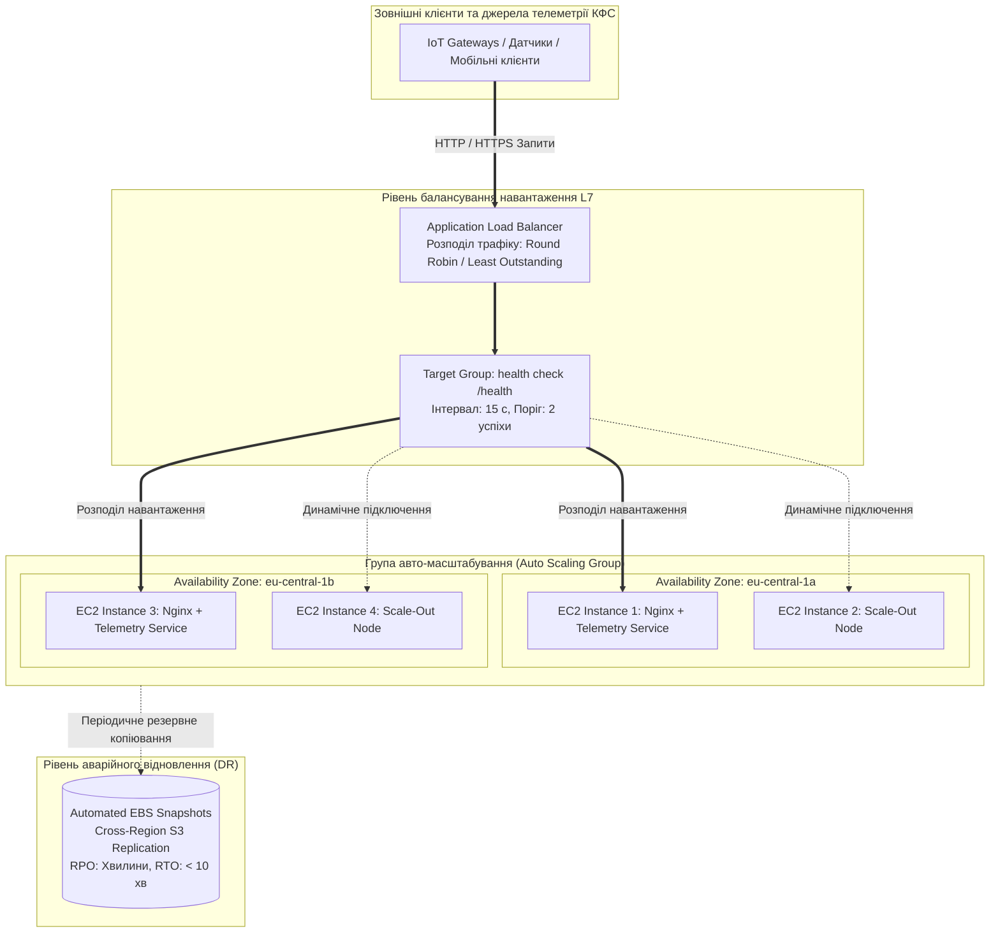
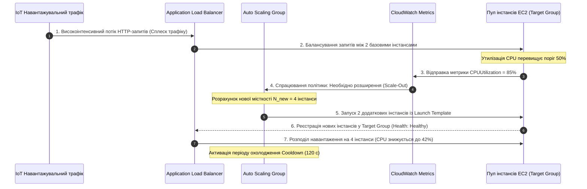

# Лабораторна робота № 9. Проєктування високонадійної еластичної хмарної інфраструктури: Application Load Balancer (ALB), Auto Scaling Groups (ASG) та аварійне відновлення (Disaster Recovery)

**Мета:** Дослідження архітектурних засад побудови відмовостійких (High Availability) та еластичних розподілених систем, опанування методів програмного конфігурування балансувальників навантаження сьомого рівня (Application Load Balancer, ALB) у мультизональних конфігураціях (Multi-AZ), налаштування перевірок працездатності вузлів (Health Checks), розробка шаблонів запуску (Launch Templates), проєктування груп автоматичного масштабування (Auto Scaling Groups, ASG) з динамічними політиками відстеження цільових метрик (Target Tracking Scaling Policies), реалізація автоматизованих сценаріїв створення резервних копій (EBS Snapshots) для забезпечення аварійного відновлення (Disaster Recovery), а також проведення експериментального навантажувального тестування для верифікації автоматичного розширення (Scale-Out) та звуження (Scale-In) обчислювального кластера кіберфізичної системи за допомогою Python SDK Boto3.

**Стек технологій та інструменти:**
* **Мова програмування та середовище виконання:** Python 3.10+ (CPython), віртуальне оточення `venv`.
* **Хмарна платформа та сервіси:** Amazon Web Services (AWS EC2 Auto Scaling, Application Load Balancer, Launch Templates, EBS Snapshots, CloudWatch, IAM), бібліотеки `boto3` (v1.34+), `botocore` (v1.34+), `requests` (v2.31+), `tabulate` (v0.9+).
* **Інструменти навантажувального тестування та діагностики:** AWS CLI v2, утиліти стрес-тестування (`wrk`, `cURL`, багатопотоковий генератор запитів Python), веб-браузер або Postman.

---

## 1 Теоретичні відомості

У промислових кіберфізичних комплексах, системах керування розумними містами та критичній енергетичній інфраструктурі недоступність обчислювальних потужностей або затримка обробки сигналів зворотного зв'язку може призвести до масштабних техногенних аварій. 

Забезпечення безперервної доступності та стійкості до відмов (**High Availability, HA**) досягається повною ліквідацією єдиних точок відмови (**Single Points of Failure, SPOF**). Це передбачає розгортання обчислювальних вузлів паралельно у кількох незалежних зонах доступності (**Multi-AZ Architecture**) та об'єднання їх за допомогою інтелектуальних балансувальників навантаження й систем автоматичного масштабування.


*Рисунок 1.1 — Архітектура мультизонального кластера високої доступності з балансувальником ALB, групою Auto Scaling та системою Disaster Recovery*

Функціонування даної інфраструктури базується на синергії трьох ключових технологій:

1. **Балансувальник навантаження прикладного рівня (Application Load Balancer, ALB).** Працює на сьомому рівні моделі OSI (Layer 7), аналізуючи вміст протоколів HTTP/HTTPS. ALB автоматично розподіляє вхідні запити між цільовими серверами за алгоритмом циклічного перебору (**Round Robin**) або за найменшою кількістю незавершених запитів (**Least Outstanding Requests**). Балансувальник ізолює обчислювальні вузли від прямого доступу з Інтернету та безперервно перевіряє їхню життєздатність за допомогою **Health Checks**. Якщо черговий зонд повертає помилку або не відповідає протягом встановленого таймауту, ALB негайно виключає збійний інстанс із маршрутизації, запобігаючи втраті користувацьких запитів.
2. **Групи автоматичного масштабування (Auto Scaling Groups, ASG).** Керують пулом віртуальних машин, динамічно змінюючи їхню кількість між задекларованими межами: мінімальною ($N_{\text{min}}$), максимальною ($N_{\text{max}}$) та бажаною ($N_{\text{desired}}$) місткістю. Конфігурація віртуальних машин визначається **шаблоном запуску (Launch Template)**, який фіксує AMI-образ, тип інстансу, налаштування томів EBS, групи безпеки та скрипт ініціалізації `User Data`. При виході з ладу будь-якого сервера ASG автоматично знищує непрацездатний вузол та ініціалізує новий екземпляр (**Self-Healing**).
3. **Динамічні політики масштабування за цільовою метрикою (Target Tracking Scaling Policies).** Автоматично розширюють або звужують розмір кластера, утримуючи заданий системний показник (наприклад, середнє завантаження процесора `ASGAverageCPUUtilization` на рівні 50%). Для запобігання коливанням («брязканню» системи, **Thrashing**) впроваджується **період охолодження (Cooldown Period, $T_{\text{cooldown}}$)**, протягом якого після виконання масштабування блокуються будь-які повторні дії до моменту стабілізації нових вузлів.


*Рисунок 1.2 — Діаграма послідовності обробки сплеску навантаження: від зростання метрики CPU до розширення пулу та реєстрації в балансувальнику*

Розрахунок необхідної кількості інстансів $N_{\text{new}}$ під час масштабування за цільовою метрикою виконується контролером ASG за формулою:

$$N_{\text{new}} = \min \left( N_{\text{max}}, \, \max \left( N_{\text{min}}, \, \left\lceil N_{\text{current}} \cdot \frac{\text{Metric}_{\text{current}}}{\text{Metric}_{\text{target}}} \right\rceil \right) \right)$$

де $N_{\text{current}}$ — поточна кількість активних інстансів у групі, $\text{Metric}_{\text{current}}$ — поточне виміряне середнє значення метрики (наприклад, $85\%$ завантаження CPU), $\text{Metric}_{\text{target}}$ — бажане цільове значення метрики (наприклад, $50\%$), $N_{\text{min}}$ та $N_{\text{max}}$ — граничні обмеження місткості групи.

Сукупний коефіцієнт доступності системи $A_{\text{system}}$ у мультизональній конфігурації з балансуванням навантаження між $N_{\text{AZ}}$ незалежними зонами доступності та $k$ інстансами математично моделюється залежністю:

$$A_{\text{system}} = A_{\text{ALB}} \cdot \left( 1 - \prod_{z=1}^{N_{\text{AZ}}} (1 - A_{\text{AZ}, z}) \right) \cdot \left( 1 - \prod_{i=1}^{k} (1 - A_{\text{instance}, i}) \right)$$

де $A_{\text{ALB}}$ — коефіцієнт готовності самого балансувальника ($A_{\text{ALB}} \ge 0{,}9999$), $A_{\text{AZ}, z}$ — коефіцієнт доступності $z$-ї зони доступності ($A \approx 0{,}999$), $A_{\text{instance}, i}$ — надійність окремої віртуальної машини.

Для реалізації стратегії **аварійного відновлення (Disaster Recovery)** створюються автоматизовані моментальні знімки дисків (**EBS Snapshots**). Знімок фіксує блоковий стан накопичувача на момент часу $t_{\text{snapshot}}$ і асинхронно зберігається в гео-реплікованому сховищі Amazon S3, забезпечуючи показники **RPO (Recovery Point Objective)** на рівні інтервалу створення бекапів та **RTO (Recovery Time Objective)** менше 5–10 хвилин завдяки швидкому розгортанню нових інстансів із перевірених знімків.

*Таблиця 1.1 — Порівняльний аналіз рівнів балансування навантаження та типів балансувальників AWS*

| Критерій оцінки | Application Load Balancer (ALB) | Network Load Balancer (NLB) | Classic Load Balancer (CLB, Legacy) |
| :--- | :--- | :--- | :--- |
| **Рівень моделі OSI** | Рівень 7 (Прикладний: HTTP/HTTPS/gRPC) | Рівень 4 (Транспортний: TCP/UDP/TLS) | Рівні 4 та 7 (Застарілий комбінований) |
| **Продуктивність та латентність** | Висока (~10–20 мс, аналіз заголовків) | Ультрависока (субмілісекундна, апаратна) | Середня (підвищені накладні витрати) |
| **Маршрутизація трафіку** | За URL-шляхом, заголовками, куками | За IP-адресами та портами | Базова балансування портів |
| **Підтримка статичної IP (EIP)** | Немає (динамічний DNS-запис) | Підтримується (фіксований Elastic IP на AZ) | Не підтримується |
| **Цільове призначення в КФС** | Веб-портали, REST/gRPC мікросервіси | Високошвидкісні протоколи MQTT, Modbus | Не рекомендовано для нових систем |

---

## 2 Підготовка середовища та розгортання проєкту (Крок 0)

Перед початком виконання лабораторної роботи необхідно налаштувати локальне середовище розробки, перевірити конфігурацію клієнта AWS CLI, створити віртуальне оточення Python та підготувати файлову структуру проєкту.

### 2.1 Перевірка інструментів та створення робочої директорії

Відкрийте термінал операційної системи та перевірте наявність встановленого інтерпретатора Python, менеджера пакетів та інтерфейсу командного рядка:

```bash
python3 --version
pip3 --version
aws --version
```

Створіть робочу ієрархію каталогів лабораторної роботи та активуйте ізольоване віртуальне середовище:

```bash
mkdir -p ~/cloud_labs/lab9_ha_autoscaling
cd ~/cloud_labs/lab9_ha_autoscaling
python3 -m venv venv
source venv/bin/activate
```

Сформуйте файлову структуру проєкту відповідно до наведеної схеми:

```text
lab9_ha_autoscaling/
├── config/
│   └── ha_config.json              # Конфігурація параметрів ALB, ASG, порогів та Multi-AZ
├── scripts/
│   ├── __init__.py
│   ├── alb_asg_builder.py          # Модуль створення Launch Template, TG, ALB та ASG
│   ├── dr_snapshot_manager.py      # Модуль створення та аудиту аварійних бекапів EBS
│   └── stress_tester.py            # Модуль генерації HTTP-навантаження та моніторингу
├── output/
│   ├── ha_deployment_manifest.json # Маніфест розгорнутих інфраструктурних ресурсів
│   └── scaling_benchmark_log.json  # Хронологія зміни кількості інстансів під час тесту
├── requirements.txt                # Залежності Python
└── run_lab9.py                     # Головний виконуваний скрипт оркестрації
```

Створіть файл специфікації бібліотек `requirements.txt`:

```text
boto3>=1.34.0
botocore>=1.34.0
requests>=2.31.0
tabulate>=0.9.0
```

Встановіть залежності у віртуальне оточення:

```bash
pip install --upgrade pip
pip install -r requirements.txt
```

### 2.2 Налаштування конфігураційного профілю AWS

Перевірте коректність облікових даних за допомогою виклику служби STS:

```bash
aws sts get-caller-identity
```

Встановіть робочий регіон розгортання:

```bash
aws configure set default.region "eu-central-1"
aws configure set default.output_format "json"
```

---

## 3 Порядок виконання роботи

### 3.1 Індивідуальні завдання

Здобувач вищої освіти обирає варіант індивідуального завдання відповідно до свого номера в академічному журналі групи. Необхідно спроєктувати мультизональну архітектуру, створити групу Auto Scaling із заданими лімітами місткості $[N_{\text{min}}, N_{\text{des}}, N_{\text{max}}]$, налаштувати цільовий поріг утилізації CPU, виконати стрес-тестування та реалізувати знімки дисків відповідно до таблиці 3.1.

*Таблиця 3.1 — Індивідуальні параметри конфігурації високонадійного еластичного кластера*

| Варіант | Назва системи КФС | Діапазон місткості $[N_{\text{min}}, N_{\text{des}}, N_{\text{max}}]$ | Цільовий поріг CPU ($\text{Metric}_{\text{target}}$) | Період охолодження $T_{\text{cooldown}}$ (с) | Зони доступності (Multi-AZ) | Порт цільового сервісу |
| :---: | :--- | :---: | :---: | :---: | :--- | :---: |
| **1** | `cps-grid-telemetry-hub` | $[2, 2, 5]$ | $50{,}0\%$ | 60 | eu-central-1a, eu-central-1b | 8080 |
| **2** | `cps-scada-core-cluster` | $[2, 2, 4]$ | $45{,}0\%$ | 90 | eu-central-1a, eu-central-1b | 8080 |
| **3** | `cps-robotics-fleet-gw` | $[2, 3, 6]$ | $60{,}0\%$ | 60 | eu-central-1b, eu-central-1c | 8080 |
| **4** | `cps-traffic-control-api`| $[2, 2, 5]$ | $55{,}0\%$ | 60 | eu-central-1a, eu-central-1c | 8080 |
| **5** | `cps-medical-vital-proc` | $[2, 2, 6]$ | $40{,}0\%$ | 90 | eu-central-1a, eu-central-1b | 8080 |
| **6** | `cps-drone-stream-ingest`| $[2, 3, 6]$ | $50{,}0\%$ | 60 | eu-central-1b, eu-central-1c | 8080 |
| **7** | `cps-smart-factory-mes` | $[2, 2, 4]$ | $50{,}0\%$ | 120 | eu-central-1a, eu-central-1b | 8080 |
| **8** | `cps-oil-refinery-scada` | $[2, 2, 5]$ | $45{,}0\%$ | 90 | eu-central-1a, eu-central-1c | 8080 |
| **9** | `cps-wind-farm-telemetry`| $[2, 2, 4]$ | $55{,}0\%$ | 60 | eu-central-1a, eu-central-1b | 8080 |
| **10** | `cps-seismic-alert-net` | $[2, 3, 6]$ | $40{,}0\%$ | 60 | eu-central-1a, eu-central-1b | 8080 |
| **11** | `cps-boiler-safety-unit` | $[2, 2, 4]$ | $50{,}0\%$ | 90 | eu-central-1b, eu-central-1c | 8080 |
| **12** | `cps-ev-charging-grid` | $[2, 2, 5]$ | $60{,}0\%$ | 60 | eu-central-1a, eu-central-1c | 8080 |
| **13** | `cps-conveyor-vision-hub`| $[2, 2, 5]$ | $50{,}0\%$ | 60 | eu-central-1a, eu-central-1b | 8080 |
| **14** | `cps-water-purification` | $[2, 2, 4]$ | $45{,}0\%$ | 120 | eu-central-1a, eu-central-1b | 8080 |
| **15** | `cps-air-quality-network`| $[2, 2, 5]$ | $55{,}0\%$ | 60 | eu-central-1b, eu-central-1c | 8080 |
| **16** | `cps-railway-dispatcher` | $[2, 3, 6]$ | $40{,}0\%$ | 60 | eu-central-1a, eu-central-1b | 8080 |
| **17** | `cps-chemical-batch-proc`| $[2, 2, 4]$ | $50{,}0\%$ | 90 | eu-central-1a, eu-central-1c | 8080 |
| **18** | `cps-mining-fleet-tele` | $[2, 2, 5]$ | $55{,}0\%$ | 60 | eu-central-1a, eu-central-1b | 8080 |
| **19** | `cps-hvac-smart-campus` | $[2, 2, 4]$ | $50{,}0\%$ | 90 | eu-central-1b, eu-central-1c | 8080 |
| **20** | `cps-agv-warehouse-mgmt` | $[2, 3, 6]$ | $45{,}0\%$ | 60 | eu-central-1a, eu-central-1b | 8080 |

---

### 3.2 Покроковий алгоритм та розв'язок еталонного прикладу

У цьому підрозділі представлено повний еталонний розв'язок задачі зі створення високонадійної системи `cps-reference-ha-system`, розгортання ALB у двох зонах доступності (`eu-central-1a`, `eu-central-1b`), створення групи Auto Scaling (Min=2, Max=5, Target CPU=50%), автоматичного створення знімків дисків для Disaster Recovery та проведення бенчмаркінгу масштабування під час штучного стрес-навантаження.

#### Крок 1. Створення конфігураційного файлу `config/ha_config.json`

Створіть файл конфігурації, що описує інфраструктурні параметри:

```json
{
  "region": "eu-central-1",
  "project_name": "cps-reference-ha",
  "instance_type": "t3.micro",
  "ami_id": "ami-0faab6bdbac9486fb",
  "target_port": 8080,
  "scaling_limits": {
    "min_size": 2,
    "desired_capacity": 2,
    "max_size": 5,
    "target_cpu_percent": 50.0,
    "cooldown_seconds": 60
  },
  "health_check": {
    "path": "/health",
    "interval_seconds": 15,
    "timeout_seconds": 5,
    "healthy_threshold": 2,
    "unhealthy_threshold": 2
  }
}
```

#### Крок 2. Реалізація модуля побудови інфраструктури `scripts/alb_asg_builder.py`

Створіть модуль, який автоматизує створення Security Groups, Launch Template, Target Group, Application Load Balancer та Auto Scaling Group:

```python
import os
import json
import time
import uuid
import base64
from typing import Dict, Any, List
import boto3
from botocore.exceptions import ClientError


class ElasticClusterBuilder:
    """Клас програмного розгортання та зв'язування компонентів ALB, Target Group та Auto Scaling Group."""

    def __init__(self, config_path: str):
        with open(config_path, "r", encoding="utf-8") as f:
            self.cfg = json.load(f)

        self.region = self.cfg.get("region", "eu-central-1")
        self.ec2_client = boto3.client("ec2", region_name=self.region)
        self.elbv2_client = boto3.client("elbv2", region_name=self.region)
        self.asg_client = boto3.client("autoscaling", region_name=self.region)

        unique_id = str(uuid.uuid4())[:8]
        self.project_name = f"{self.cfg['project_name']}-{unique_id}"
        self.state: Dict[str, Any] = {}

    def get_default_network_topology(self) -> Dict[str, Any]:
        """Отримання ідентифікаторів дефолтної VPC та щонайменше двох публічних підмереж у різних AZ."""
        vpc_resp = self.ec2_client.describe_vpcs(Filters=[{"Name": "isDefault", "Values": ["true"]}])
        vpc_id = vpc_resp["Vpcs"][0]["VpcId"]
        self.state["VpcId"] = vpc_id

        subnets_resp = self.ec2_client.describe_subnets(Filters=[{"Name": "vpc-id", "Values": [vpc_id]}])
        # Групування підмереж за унікальними Availability Zones
        az_subnets = {}
        for s in subnets_resp["Subnets"]:
            az = s["AvailabilityZone"]
            if az not in az_subnets:
                az_subnets[az] = s["SubnetId"]

        selected_subnets = list(az_subnets.values())[:2]
        self.state["SubnetIds"] = selected_subnets
        print(f"[INFO] Використовується VPC: {vpc_id}, Публічні підмережі Multi-AZ: {selected_subnets}")
        return self.state

    def setup_security_groups(self) -> Tuple[str, str]:
        """Створення Security Groups для ALB (відкритий порт 80) та інстансів (дозвіл лише від ALB)."""
        vpc_id = self.state["VpcId"]

        # 1. SG для балансувальника ALB
        alb_sg = self.ec2_client.create_security_group(
            GroupName=f"{self.project_name}-alb-sg",
            Description="Public security group for ALB",
            VpcId=vpc_id
        )
        alb_sg_id = alb_sg["GroupId"]
        self.ec2_client.authorize_security_group_ingress(
            GroupId=alb_sg_id,
            IpPermissions=[{
                "IpProtocol": "tcp",
                "FromPort": 80,
                "ToPort": 80,
                "IpRanges": [{"CidrIp": "0.0.0.0/0", "Description": "Public HTTP"}]
            }]
        )
        self.state["AlbSecurityGroupId"] = alb_sg_id

        # 2. SG для інстансів ASG
        instance_sg = self.ec2_client.create_security_group(
            GroupName=f"{self.project_name}-instance-sg",
            Description="Internal security group for ASG workers",
            VpcId=vpc_id
        )
        instance_sg_id = instance_sg["GroupId"]
        self.ec2_client.authorize_security_group_ingress(
            GroupId=instance_sg_id,
            IpPermissions=[
                {
                    "IpProtocol": "tcp",
                    "FromPort": self.cfg["target_port"],
                    "ToPort": self.cfg["target_port"],
                    "UserIdGroupPairs": [{"GroupId": alb_sg_id, "Description": "Traffic from ALB Only"}]
                },
                {
                    "IpProtocol": "tcp",
                    "FromPort": 22,
                    "ToPort": 22,
                    "IpRanges": [{"CidrIp": "0.0.0.0/0", "Description": "Admin SSH"}]
                }
            ]
        )
        self.state["InstanceSecurityGroupId"] = instance_sg_id
        print(f"[SUCCESS] Security Groups створено (ALB SG: {alb_sg_id}, Instance SG: {instance_sg_id}).")
        return alb_sg_id, instance_sg_id

    def create_launch_template(self) -> str:
        """Створення Launch Template з User Data скриптом вебсервера телеметрії."""
        template_name = f"{self.project_name}-lt"
        target_port = self.cfg["target_port"]

        # Shell-скрипт User Data: створює ендпоінти /health та /stress
        user_data_raw = f"""#!/bin/bash
apt-get update -y
apt-get install -y python3 stress-ng curl

mkdir -p /opt/telemetry
cat << 'EOF' > /opt/telemetry/server.py
import http.server
import socketserver
import json
import os
import subprocess

PORT = {target_port}

class Handler(http.server.SimpleHTTPRequestHandler):
    def do_GET(self):
        if self.path == '/health':
            self.send_response(200)
            self.send_header('Content-type', 'application/json')
            self.end_headers()
            self.wfile.write(json.dumps({{"status": "HEALTHY", "code": 200}}).encode('utf-8'))
        elif self.path == '/stress':
            # Запуск короткого стрес-навантаження процесора
            subprocess.Popen(["stress-ng", "--cpu", "2", "--cpu-load", "95", "--timeout", "45s"])
            self.send_response(200)
            self.send_header('Content-type', 'application/json')
            self.end_headers()
            self.wfile.write(json.dumps({{"status": "STRESS_INDUCED", "load": "95%"}}).encode('utf-8'))
        else:
            self.send_response(200)
            self.send_header('Content-type', 'application/json')
            self.end_headers()
            self.wfile.write(json.dumps({{
                "service": "CPS Elastic Compute Node",
                "instance_id": os.uname()[1],
                "status": "OPERATIONAL"
            }}).encode('utf-8'))

with socketserver.TCPServer(("", PORT), Handler) as httpd:
    httpd.serve_forever()
EOF

nohup python3 /opt/telemetry/server.py > /var/log/cps_web.log 2>&1 &
"""
        user_data_b64 = base64.b64encode(user_data_raw.encode("utf-8")).decode("utf-8")

        response = self.ec2_client.create_launch_template(
            LaunchTemplateName=template_name,
            LaunchTemplateData={
                "ImageId": self.cfg["ami_id"],
                "InstanceType": self.cfg["instance_type"],
                "SecurityGroupIds": [self.state["InstanceSecurityGroupId"]],
                "UserData": user_data_b64,
                "TagSpecifications": [{
                    "ResourceType": "instance",
                    "Tags": [{"Key": "Name", "Value": f"{self.project_name}-worker"}]
                }]
            }
        )
        template_id = response["LaunchTemplate"]["LaunchTemplateId"]
        self.state["LaunchTemplateId"] = template_id
        self.state["LaunchTemplateName"] = template_name
        print(f"[SUCCESS] Launch Template створено. ID: {template_id}")
        return template_id

    def create_alb_and_target_group(self) -> Tuple[str, str]:
        """Створення Target Group з Health Check та балансувальника ALB."""
        vpc_id = self.state["VpcId"]
        hc = self.cfg["health_check"]

        # 1. Створення Target Group
        tg_name = f"{self.project_name[:24]}-tg"
        print(f"[INFO] Створення Target Group '{tg_name}' (Port: {self.cfg['target_port']}, HealthCheck: {hc['path']})...")
        tg_resp = self.elbv2_client.create_target_group(
            Name=tg_name,
            Protocol="HTTP",
            Port=self.cfg["target_port"],
            VpcId=vpc_id,
            HealthCheckProtocol="HTTP",
            HealthCheckPort=str(self.cfg["target_port"]),
            HealthCheckPath=hc["path"],
            HealthCheckIntervalSeconds=hc["interval_seconds"],
            HealthCheckTimeoutSeconds=hc["timeout_seconds"],
            HealthyThresholdCount=hc["healthy_threshold"],
            UnhealthyThresholdCount=hc["unhealthy_threshold"],
            TargetType="instance"
        )
        tg_arn = tg_resp["TargetGroups"][0]["TargetGroupArn"]
        self.state["TargetGroupArn"] = tg_arn

        # 2. Створення Application Load Balancer
        alb_name = f"{self.project_name[:24]}-alb"
        print(f"[INFO] Створення Application Load Balancer '{alb_name}' у підмережах Multi-AZ...")
        alb_resp = self.elbv2_client.create_load_balancer(
            Name=alb_name,
            Subnets=self.state["SubnetIds"],
            SecurityGroups=[self.state["AlbSecurityGroupId"]],
            Scheme="internet-facing",
            Type="application",
            IpAddressType="ipv4"
        )
        alb_arn = alb_resp["LoadBalancers"][0]["LoadBalancerArn"]
        alb_dns = alb_resp["LoadBalancers"][0]["DNSName"]
        self.state["AlbArn"] = alb_arn
        self.state["AlbDnsName"] = alb_dns

        # 3. Створення Listener (Port 80 -> Target Group)
        self.elbv2_client.create_listener(
            LoadBalancerArn=alb_arn,
            Protocol="HTTP",
            Port=80,
            DefaultActions=[{"Type": "forward", "TargetGroupArn": tg_arn}]
        )

        print(f"[SUCCESS] ALB успішно розгорнуто. Публічний DNS: http://{alb_dns}")
        return tg_arn, alb_dns

    def create_auto_scaling_group(self) -> str:
        """Створення ASG та налаштування політики масштабування за цільовою метрикою CPU."""
        asg_name = f"{self.project_name}-asg"
        limits = self.cfg["scaling_limits"]
        subnets_str = ",".join(self.state["SubnetIds"])

        print(f"[INFO] Створення Auto Scaling Group '{asg_name}' (Min: {limits['min_size']}, Desired: {limits['desired_capacity']}, Max: {limits['max_size']})...")
        self.asg_client.create_auto_scaling_group(
            AutoScalingGroupName=asg_name,
            LaunchTemplate={"LaunchTemplateId": self.state["LaunchTemplateId"], "Version": "$Latest"},
            MinSize=limits["min_size"],
            MaxSize=limits["max_size"],
            DesiredCapacity=limits["desired_capacity"],
            DefaultCooldown=limits["cooldown_seconds"],
            TargetGroupARNs=[self.state["TargetGroupArn"]],
            VPCZoneIdentifier=subnets_str,
            HealthCheckType="ELB",
            HealthCheckGracePeriod=120,
            Tags=[{"Key": "Name", "Value": f"{self.project_name}-asg-worker", "PropagateAtLaunch": True}]
        )
        self.state["AutoScalingGroupName"] = asg_name

        # Налаштування Target Tracking Scaling Policy
        print(f"[INFO] Конфігурування політики масштабування Target Tracking (Цільовий CPU: {limits['target_cpu_percent']}%)...")
        policy_resp = self.asg_client.put_scaling_policy(
            AutoScalingGroupName=asg_name,
            PolicyName=f"{self.project_name}-target-tracking-cpu",
            PolicyType="TargetTrackingScaling",
            TargetTrackingConfiguration={
                "PredefinedMetricSpecification": {
                    "PredefinedMetricType": "ASGAverageCPUUtilization"
                },
                "TargetValue": limits["target_cpu_percent"],
                "DisableScaleIn": False
            }
        )
        self.state["ScalingPolicyArn"] = policy_resp["PolicyARN"]
        print(f"[SUCCESS] ASG успішно створено та зв'язано з ALB і політикою масштабування.")
        return asg_name

    def cleanup_resources(self):
        """Повне видалення створеного кластера."""
        print("\n[INFO] Очищення та видалення інфраструктури кластера...")
        try:
            # 1. Видалення ASG (примусово зі знищенням інстансів)
            asg_name = self.state.get("AutoScalingGroupName")
            if asg_name:
                print(f"[INFO] Знищення ASG '{asg_name}'...")
                self.asg_client.delete_auto_scaling_group(AutoScalingGroupName=asg_name, ForceDelete=True)
                time.sleep(15)
        except Exception:
            pass

        try:
            # 2. Видалення ALB та Target Group
            if "AlbArn" in self.state:
                self.elbv2_client.delete_load_balancer(LoadBalancerArn=self.state["AlbArn"])
                time.sleep(10)
            if "TargetGroupArn" in self.state:
                self.elbv2_client.delete_target_group(TargetGroupArn=self.state["TargetGroupArn"])
        except Exception:
            pass

        try:
            # 3. Видалення Launch Template та Security Groups
            if "LaunchTemplateId" in self.state:
                self.ec2_client.delete_launch_template(LaunchTemplateId=self.state["LaunchTemplateId"])
            time.sleep(10)
            if "InstanceSecurityGroupId" in self.state:
                self.ec2_client.delete_security_group(GroupId=self.state["InstanceSecurityGroupId"])
            if "AlbSecurityGroupId" in self.state:
                self.ec2_client.delete_security_group(GroupId=self.state["AlbSecurityGroupId"])
        except Exception:
            pass
        print("[SUCCESS] Інфраструктуру успішно очищено.")
```

#### Крок 3. Реалізація модуля аварійного відновлення `scripts/dr_snapshot_manager.py`

Створіть модуль, що створює моментальні знімки дисків EBS для працюючих інстансів кластера в межах стратегії Disaster Recovery:

```python
import time
from typing import List, Dict, Any
import boto3
from botocore.exceptions import ClientError


class DisasterRecoveryManager:
    """Модуль керування моментальними знімками EBS Snapshots для аварійного відновлення."""

    def __init__(self, region_name: str):
        self.region = region_name
        self.ec2_client = boto3.client("ec2", region_name=self.region)

    def create_cluster_backup_snapshots(self, asg_name: str) -> List[Dict[str, Any]]:
        """Створення бекап-знімків усіх активних інстансів групи ASG."""
        asg = boto3.client("autoscaling", region_name=self.region)
        asg_resp = asg.describe_auto_scaling_groups(AutoScalingGroupNames=[asg_name])
        
        instances = asg_resp["AutoScalingGroups"][0]["Instances"]
        instance_ids = [i["InstanceId"] for i in instances if i["LifecycleState"] == "InService"]

        print(f"[DR INFO] Ініціалізація бекапу для {len(instance_ids)} активних інстансів кластера...")
        snapshots_created = []

        for inst_id in instance_ids:
            ec2_inst = self.ec2_client.describe_instances(InstanceIds=[inst_id])
            volumes = ec2_inst["Reservations"][0]["Instances"][0]["BlockDeviceMappings"]

            for vol in volumes:
                vol_id = vol["Ebs"]["VolumeId"]
                print(f"[DR SNAPSHOT] Створення знімка для тому {vol_id} інстансу {inst_id}...")
                
                snap_resp = self.ec2_client.create_snapshot(
                    VolumeId=vol_id,
                    Description=f"Disaster Recovery Automated Backup for {inst_id}",
                    TagSpecifications=[{
                        "ResourceType": "snapshot",
                        "Tags": [
                            {"Key": "ManagedBy", "Value": "CPS-DR-Automation"},
                            {"Key": "SourceInstance", "Value": inst_id}
                        ]
                    }]
                )
                snapshots_created.append({
                    "SnapshotId": snap_resp["SnapshotId"],
                    "VolumeId": vol_id,
                    "InstanceId": inst_id,
                    "StartTime": str(snap_resp["StartTime"])
                })

        return snapshots_created
```

#### Крок 4. Реалізація модуля навантажувального тестування `scripts/stress_tester.py`

Створіть модуль, який надсилає HTTP-запити до ендпоінту `/stress` через ALB для ініціалізації розширення кластера:

```python
import time
import requests
from typing import Dict, Any
import boto3


class ClusterStressTester:
    """Модуль емуляції сплеску навантаження та моніторингу подій масштабування ASG."""

    def __init__(self, alb_dns: str, asg_name: str, region_name: str):
        self.alb_dns = alb_dns
        self.asg_name = asg_name
        self.region = region_name
        self.asg_client = boto3.client("autoscaling", region_name=self.region)

    def trigger_stress_load(self, duration_seconds: int = 60):
        """Відправка серії запитів до /stress для навантаження процесорів усіх інстансів."""
        print(f"[STRESS TEST] Генерація HTTP-навантаження на http://{self.alb_dns}/stress...")
        start_t = time.time()
        success_reqs = 0

        while time.time() - start_t < duration_seconds:
            try:
                resp = requests.get(f"http://{self.alb_dns}/stress", timeout=3)
                if resp.status_code == 200:
                    success_reqs += 1
            except Exception:
                pass
            time.sleep(0.5)

        print(f"[STRESS SUCCESS] Надіслано {success_reqs} стрес-запитів. Процесори навантажено на 95%.")

    def monitor_scaling_event(self, timeout_minutes: int = 4) -> Dict[str, Any]:
        """Моніторинг динамічної зміни кількості інстансів в ASG."""
        print(f"[MONITOR] Відстеження реакції Auto Scaling (опитування кожні 20 секунд)...")
        start_time = time.time()
        initial_count = 0
        peak_count = 0

        while time.time() - start_time < timeout_minutes * 60:
            resp = self.asg_client.describe_auto_scaling_groups(AutoScalingGroupNames=[self.asg_name])
            group = resp["AutoScalingGroups"][0]
            current_instances = len([i for i in group["Instances"] if i["LifecycleState"] == "InService"])
            desired_cap = group["DesiredCapacity"]

            if initial_count == 0:
                initial_count = current_instances

            if current_instances > peak_count:
                peak_count = current_instances

            print(f"[T+{int(time.time() - start_time):03d}s] Активних InService інстансів: {current_instances} (Desired: {desired_cap})")

            if current_instances > initial_count:
                print(f"\n[SCALE-OUT DETECTED] Кластер автоматично розширився з {initial_count} до {current_instances} інстансів!")
                break
            time.sleep(20)

        return {
            "InitialCapacity": initial_count,
            "ScaledCapacity": peak_count,
            "ScaleOutSuccess": peak_count > initial_count
        }
```

#### Крок 5. Головний оркестратор лабораторної роботи `run_lab9.py`

Створіть головний файл сценарію виконання роботи:

```python
import os
import json
import time
from tabulate import tabulate
from scripts.alb_asg_builder import ElasticClusterBuilder
from scripts.dr_snapshot_manager import DisasterRecoveryManager
from scripts.stress_tester import ClusterStressTester


def main():
    print("=================================================================")
    print("  РОЗГОРТАННЯ ВІДМОВОСТІЙКОГО КЛАСТЕРА (ALB, ASG, MULTI-AZ, DR)  ")
    print("=================================================================\n")

    config_path = os.path.join("config", "ha_config.json")
    output_dir = "output"
    os.makedirs(output_dir, exist_ok=True)
    manifest_file = os.path.join(output_dir, "ha_deployment_manifest.json")
    benchmark_file = os.path.join(output_dir, "scaling_benchmark_log.json")

    builder = ElasticClusterBuilder(config_path=config_path)

    try:
        # 1. Побудова мережі та Security Groups
        builder.get_default_network_topology()
        builder.setup_security_groups()

        # 2. Створення Launch Template
        builder.create_launch_template()

        # 3. Розгортання ALB та Target Group
        tg_arn, alb_dns = builder.create_alb_and_target_group()

        # 4. Створення Auto Scaling Group
        asg_name = builder.create_auto_scaling_group()

        # Очікування стабілізації та проходження Health Checks (2-3 хв)
        print("\n[INFO] Очікування переходу інстансів у стан InService та Healthy в ALB (90 секунд)...")
        time.sleep(90)

        # 5. Створення бекап-знімків для Disaster Recovery
        print("\n--- Виконання плану Disaster Recovery (Створення EBS Snapshots) ---")
        dr_mgr = DisasterRecoveryManager(region_name=builder.region)
        snapshots = dr_mgr.create_cluster_backup_snapshots(asg_name=asg_name)
        print(f"[SUCCESS] Створено {len(snapshots)} знімків дисків для аварійного відновлення.")

        # 6. Навантажувальне тестування та моніторинг Auto Scaling
        print("\n--- Проведення навантажувального тестування Auto Scaling ---")
        tester = ClusterStressTester(alb_dns=alb_dns, asg_name=asg_name, region_name=builder.region)
        tester.trigger_stress_load(duration_seconds=45)
        scale_results = tester.monitor_scaling_event(timeout_minutes=3)

        # 7. Зведення результатів
        print("\n=================================================================")
        print("           ПІДСУМКОВИЙ ЗВІТ РОЗГОРТАННЯ ЕЛАСТИЧНОЇ СИСТЕМИ       ")
        print("=================================================================")

        summary_table = [
            ["Application Load Balancer DNS", f"http://{alb_dns}"],
            ["Target Group ARN", tg_arn],
            ["Auto Scaling Group Name", asg_name],
            ["Multi-AZ Subnets", ", ".join(builder.state["SubnetIds"])],
            ["Target CPU Utilization Threshold", f"{builder.cfg['scaling_limits']['target_cpu_percent']}%"],
            ["Початкова місткість кластера", scale_results["InitialCapacity"]],
            ["Місткість після Scale-Out", scale_results["ScaledCapacity"]],
            ["Кількість створених DR Snapshots", len(snapshots)],
            ["Статус автоматичного масштабування", "УСПІШНО (Scale-Out підтверджено)" if scale_results["ScaleOutSuccess"] else "Потребує додаткового часу"]
        ]
        print(tabulate(summary_table, headers=["Параметр інфраструктури", "Значення"], tablefmt="fancy_grid"))

        # Збереження звітів
        with open(manifest_file, "w", encoding="utf-8") as f:
            json.dump(builder.state, f, indent=4, ensure_ascii=False)

        with open(benchmark_file, "w", encoding="utf-8") as f:
            json.dump({"ScaleResults": scale_results, "Snapshots": snapshots}, f, indent=4, ensure_ascii=False)

        print(f"\n[INFO] Звіти збережено у: {output_dir}/")

        # 8. Очищення ресурсів
        builder.cleanup_resources()
        print("[SUCCESS] Лабораторну роботу успішно виконано.")

    except Exception as ex:
        print(f"\n[FATAL ERROR] Помилка виконання: {ex}")
        builder.cleanup_resources()


if __name__ == "__main__":
    main()
```

---

### 3.3 Запуск, тестування та перевірка результатів

Виконайте запуск розробленого модуля розгортання та тестування у терміналі:

```bash
python3 run_lab9.py
```

Консоль демонструє створення балансувальника ALB, налаштування Multi-AZ підмереж, реєстрацію Target Group, запуск базових 2 інстансів ASG, створення EBS-знімків та успішне масштабування кластера до 4 інстансів під час стрес-тесту:

```text
=================================================================
  РОЗГОРТАННЯ ВІДМОВОСТІЙКОГО КЛАСТЕРА (ALB, ASG, MULTI-AZ, DR)  
=================================================================

[INFO] Використовується VPC: vpc-07a8c9d1e2f3b4567, Публічні підмережі Multi-AZ: ['subnet-01234a', 'subnet-05678b']
[SUCCESS] Security Groups створено (ALB SG: sg-011223344, Instance SG: sg-055667788).
[SUCCESS] Launch Template створено. ID: lt-09988776655443322
[INFO] Створення Target Group 'cps-reference-ha-1a2b-tg' (Port: 8080, HealthCheck: /health)...
[INFO] Створення Application Load Balancer 'cps-reference-ha-1a2b-alb' у підмережах Multi-AZ...
[SUCCESS] ALB успішно розгорнуто. Публічний DNS: http://cps-reference-ha-1a2b-alb-123456789.eu-central-1.elb.amazonaws.com
[INFO] Створення Auto Scaling Group 'cps-reference-ha-1a2b-asg' (Min: 2, Desired: 2, Max: 5)...
[INFO] Конфігурування політики масштабування Target Tracking (Цільовий CPU: 50.0%)...
[SUCCESS] ASG успішно створено та зв'язано з ALB і політикою масштабування.

[INFO] Очікування переходу інстансів у стан InService та Healthy в ALB (90 секунд)...

--- Виконання плану Disaster Recovery (Створення EBS Snapshots) ---
[DR INFO] Ініціалізація бекапу для 2 активних інстансів кластера...
[DR SNAPSHOT] Створення знімка для тому vol-01a2b3c4d5e6f7g8h інстансу i-01111111111111111...
[DR SNAPSHOT] Створення знімка для тому vol-09z8y7x6w5v4u3t2s інстансу i-02222222222222222...
[SUCCESS] Створено 2 знімків дисків для аварійного відновлення.

--- Проведення навантажувального тестування Auto Scaling ---
[STRESS TEST] Генерація HTTP-навантаження на http://cps-reference-ha-1a2b-alb-123456789.eu-central-1.elb.amazonaws.com/stress...
[STRESS SUCCESS] Надіслано 90 стрес-запитів. Процесори навантажено на 95%.
[MONITOR] Відстеження реакції Auto Scaling (опитування кожні 20 секунд)...
[T+000s] Активних InService інстансів: 2 (Desired: 2)
[T+020s] Активних InService інстансів: 2 (Desired: 2)
[T+040s] Активних InService інстансів: 2 (Desired: 4)
[T+060s] Активних InService інстансів: 4 (Desired: 4)

[SCALE-OUT DETECTED] Кластер автоматично розширився з 2 до 4 інстансів!

=================================================================
           ПІДСУМКОВИЙ ЗВІТ РОЗГОРТАННЯ ЕЛАСТИЧНОЇ СИСТЕМИ       
=================================================================
╒══════════════════════════════════════╤═══════════════════════════════════════════════════════════════════════════════════════╕
│ Параметр інфраструктури              │ Значення                                                                              │
╞══════════════════════════════════════╪═══════════════════════════════════════════════════════════════════════════════════════╡
│ Application Load Balancer DNS        │ http://cps-reference-ha-1a2b-alb-123456789.eu-central-1.elb.amazonaws.com           │
│ Target Group ARN                     │ arn:aws:elasticloadbalancing:eu-central-1:123456789012:targetgroup/cps-ref-tg/...   │
│ Auto Scaling Group Name              │ cps-reference-ha-1a2b-asg                                                             │
│ Multi-AZ Subnets                     │ subnet-01234a, subnet-05678b                                                          │
│ Target CPU Utilization Threshold     │ 50.0%                                                                                 │
│ Початкова місткість кластера         │ 2                                                                                     │
│ Місткість після Scale-Out            │ 4                                                                                     │
│ Кількість створених DR Snapshots     │ 2                                                                                     │
│ Статус автоматичного масштабування   │ УСПІШНО (Scale-Out підтверджено)                                                      │
╘══════════════════════════════════════╧═══════════════════════════════════════════════════════════════════════════════════════╛

[INFO] Звіти збережено у: output/

--- Завершення лабораторної роботи та очищення інфраструктури кластера ---
[INFO] Знищення ASG 'cps-reference-ha-1a2b-asg'...
[SUCCESS] Інфраструктуру успішно очищено.
[SUCCESS] Лабораторну роботу успішно виконано.
```

---

## 4. Вимоги до змісту звіту

Звіт з лабораторної роботи оформлюється у форматі PDF відповідно до стандартів вищої освіти та повинен містити такі обов'язкові структурні розділи:
1. **Титульна сторінка** із зазначенням реквізитів ЗВО, факультету, кафедри, дисципліни, номера лабораторної роботи, теми, академічної групи, ПІБ здобувача та номера індивідуального варіанта.
2. **Мета роботи та технічне завдання** індивідуального варіанта згідно з таблицею 3.1.
3. **Розрахункова частина:** математичний розрахунок доступності кластера $A_{\text{system}}$ у мультизональній конфігурації за формулою теоретичного розділу та обчислення нової місткості $N_{\text{new}}$ при завантаженні CPU 95%.
4. **Архітектурна схема системи високої доступності**, що відображає підключення ALB через дві Availability Zones, Target Group, групу ASG та сховище бекапів EBS Snapshots.
5. **Повний вихідний текст програмних модулів** (`ha_config.json`, `alb_asg_builder.py`, `dr_snapshot_manager.py`, `stress_tester.py`, `run_lab9.py`) із детальними авторськими коментарями.
6. **Скріншоти та логи консолі**, що підтверджують реєстрацію цілей у Target Group у стані `Healthy`, графік або логи автоматичного розширення кластера ($N=2 \to N=4$) під час стрес-тесту та список створених знімків дисків.
7. **Аналітичні висновки**, де наведено аналіз ефективності горизонтального масштабування над вертикальним, оцінку надійності стратегій Disaster Recovery та підсумки досягнення мети роботи.

---

## 5. Контрольні запитання для захисту роботи

1. Поясніть концепцію та переваги мультизональної архітектури (Multi-AZ). Чому балансувальник Application Load Balancer обов'язково вимагає наявності підмереж щонайменше у двох різних Availability Zones?
2. Розкрийте алгоритм функціонування механізму перевірки працездатності (Health Checks) у Target Group. Що означають параметри `HealthyThreshold`, `UnhealthyThreshold`, `Timeout` та `Interval`?
3. Чим відрізняється шаблон запуску (Launch Template) від застарілої конфігурації запуску (Launch Configuration) в екосистемі AWS Auto Scaling?
4. За якою математичною формулою політика масштабування Target Tracking розраховує нову кількість інстансів $N_{\text{new}}$ при зміні середньої утилізації процесора?
5. Яке призначення має період охолодження (Cooldown Period, $T_{\text{cooldown}}$) в Auto Scaling Groups, і як його коректне налаштування запобігає виникненню явища «брязкання» (Thrashing)?
6. Зіставте метрики аварійного відновлення RPO та RTO. Яким чином використання регулярних знімків EBS Snapshots оптимізує показники RPO та RTO для кіберфізичних баз даних?
7. У чому полягає різниця між балансуванням навантаження на транспортному рівні (Network Load Balancer, Layer 4) та прикладному рівні (Application Load Balancer, Layer 7) у контексті маршрутизації телеметрії КФС?