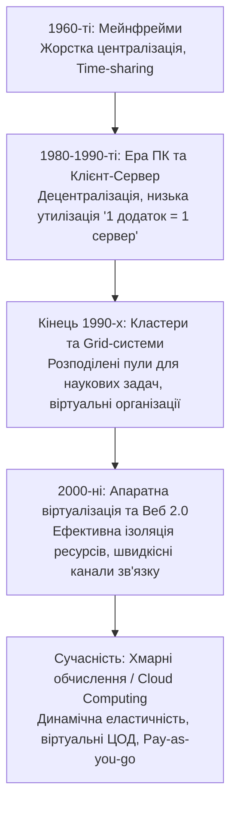
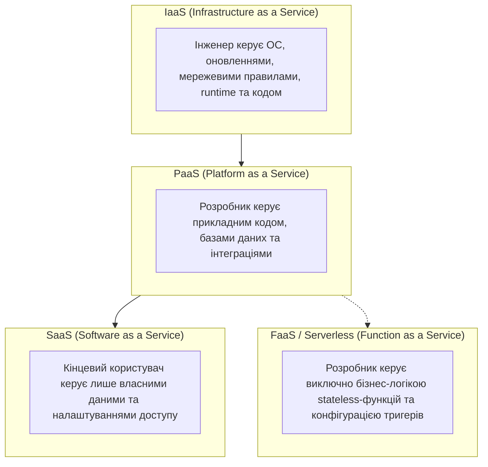
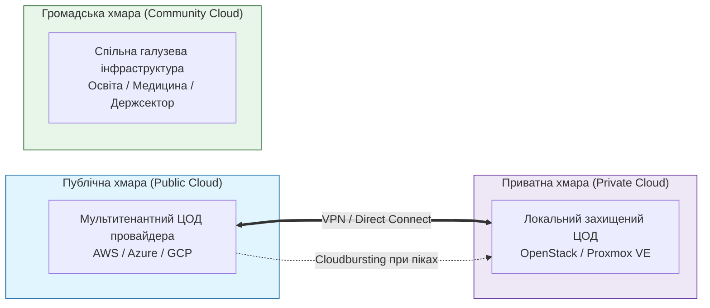

# Змістовий модуль 1. Архітектура хмарних систем, технології віртуалізації та базові сервіси IaaS/PaaS

# Тема 1. Парадигма хмарних обчислень. Моделі обслуговування та розгортання

---

## 1.1. Еволюція розподілених обчислень: від мейнфреймів і Grid-систем до Cloud Computing. Визначення NIST

### Основний зміст та теоретичний базис

Становлення сучасної парадигми хмарних обчислень (**Cloud Computing**) є результатом закономірного діалектичного розвитку архітектури обчислювальних систем упродовж понад шести десятиліть. Історично першим етапом масштабної автоматизації обчислень у 1950–1960-х роках стала епоха великих обчислювальних машин — **мейнфреймів** (зокрема сімейства IBM System/360, а також вітчизняних розробок класу «Дніпро-2» та машин серії ЕС ЕОМ). Архітектура мейнфреймів базувалася на жорсткій централізації апаратних ресурсів: потужний центральний процесорний блок, пам’ять та накопичувачі розміщувалися в єдиному машинному залі, а користувачі взаємодіяли з системою через алфавітно-цифрові термінали («зелені екрани»), позбавлені власної обчислювальної потужності. Саме в цей період професор Массачусетського технологічного інституту Джон Маккарті (John McCarthy) висунув фундаментальну гіпотезу про те, що в майбутньому обчислювальні потужності організовуватимуться та надаватимуться кінцевим споживачам подібно до комунальних послуг (public utility) — води чи електроенергії. У мейнфреймах було вперше програмно реалізовано концепцію квантування часу (**time-sharing**), що забезпечувала паралельну роботу багатьох користувачів на спільному апаратному комплексі.

Подальша мікроелектронна революція 1970–1980-х років, зумовлена винаходом кремнієвих інтегральних мікросхем та перших комерційних мікропроцесорів (зокрема Intel 4004), спричинила різку зміну вектору розвитку комп'ютерної інженерії. Стрімке здешевлення обчислювальної техніки зумовило масову появу персональних комп'ютерів (ПК), що призвело до децентралізації обчислень. У 1990-х роках домінуючою моделлю організації корпоративних систем стала дворівнева клієнт-серверна архітектура, де обробка даних розподілялася між локальними ПК та виділеними серверами баз даних і додатків. У цей період аналітики прогнозували остаточне вимирання централізованих мейнфреймів. Проте екстенсивне нарощування серверного парку за принципом «один додаток — один фізичний сервер» виявило серйозні системні обмеження: низький середній коефіцієнт утилізації процесорних потужностей (у межах 5–15%), високі капітальні витрати на інфраструктуру, проблеми охолодження та надмірне енергоспоживання.

Відповіддю на потребу в концентрації обчислювальних потужностей для вирішення надскладних науково-технічних завдань стала поява кластерних обчислень (**Cluster Computing**, наприклад, проєкт Beowulf, 1994 рік), де серійні вузли поєднувалися локальною високошвидкісною мережею в єдиний обчислювальний ресурс. Логічним розвитком цієї ідеї наприкінці 1990-х років стали **Grid-системи** (фундаторами яких виступили Ян Фостер, Карл Кессельман та Стів Тікі). Концепція Grid передбачала об'єднання територіально розрізнених, гетерогенних обчислювальних ресурсів і сховищ даних, що належали різним адміністративним доменам, у межах динамічних віртуальних організацій (**Virtual Organizations**). 

Незважаючи на потужний математичний апарат та розвинене проміжне програмне забезпечення (middleware: Globus Toolkit, gLite, UNICORE, ARC), Grid-системи орієнтувалися переважно на пакетну обробку специфічних наукових завдань (High-Performance Computing, HPC; High-Throughput Computing, HTC) і виявилися надто складними та негнучкими для комерційного застосування, оскільки не забезпечували швидкої ізоляції середовищ та автоматизованого виділення ресурсів на вимогу в режимі реального часу.

*Рисунок 1.1 — Генезис розподілених обчислювальних систем та перехід до хмарної моделі*

Хмарні обчислення замкнули еволюційну спіраль комп'ютингу, повернувши індустрію до централізації обчислювальних ресурсів, проте вже на якісно новому технологічному фундаменті. Цей стрибок став можливим завдяки зрілості технологій апаратної віртуалізації процесорних архітектур x86/x64, впровадженню концепції програмно-керованих систем та повсюдному поширенню широкосмугового Інтернету.

Згідно з еталонним стандартом Національного інституту стандартів і технологій США (**NIST SP 800-145**), **хмарні обчислення (Cloud Computing)** визначаються як модель забезпечення повсюдного, зручного мережевого доступу на вимогу до спільного пулу конфігурованих обчислювальних ресурсів (наприклад, мереж, серверів, систем зберігання даних, додатків і сервісів), які можуть бути оперативно надані та вивільнені з мінімальними управлінськими зусиллями або взаємодією з постачальником послуг.

Архітектурна сутність моделі NIST базується на п'яти фундаментальних (сутнісних) характеристиках, які відрізняють справжню хмару від звичайного віртуалізованого дата-центру:

1. **Самообслуговування на вимогу (On-demand self-service).** Споживач може в односторонньому порядку в автоматичному режимі резервувати та конфігурувати обчислювальні можливості (серверний час, дисковий простір, пропускну здатність мережі) без необхідності прямої взаємодії з обслуговуючим персоналом провайдера.
2. **Широкий мережевий доступ (Broad network access).** Усі надані ресурси доступні через стандартні канали передачі даних за допомогою загальноприйнятих мережевих протоколів (HTTP/HTTPS, REST, gRPC) з використанням гетерогенних клієнтських платформ (робочі станції, ноутбуки, смартфони, а також вбудовані контролери кіберфізичних систем).
3. **Об'єднання ресурсів у пул (Resource pooling).** Обчислювальні, мережеві та дискові ресурси провайдера об'єднуються в єдиний динамічний пул для обслуговування багатьох клієнтів за багатокористувацькою моделлю (**multi-tenant model**). При цьому фізичні та віртуальні ресурси перерозподіляються динамічно відповідно до коливань споживчого попиту, а клієнт, як правило, не контролює і не має точних знань про точне географічне чи фізичне розташування виділених йому блоків обладнання, оперуючи вищими рівнями абстракції (регіони, зони доступності).
4. **Миттєва еластичність (Rapid elasticity).** Ресурси можуть бути виділені та звільнені швидко, еластично, а в деяких випадках автоматично, для швидкого пропорційного масштабування відповідно до навантаження. Для споживача обчислювальні можливості, доступні для виділення, видаються потенційно необмеженими і можуть бути задіяні в будь-якій кількості та в будь-який момент часу.
5. **Вимірюваність сервісу (Measured service).** Хмарні платформи автоматично контролюють, оптимізують та тарифікують використання ресурсів за допомогою засобів обліку на відповідному рівні абстракції (кількість використаного процесорного часу, обсяг збережених даних, кількість транзакцій, мережевий трафік). Це забезпечує абсолютну прозорість як для постачальника, так і для споживача послуги.

Для глибшого аналізу відмінностей між технологічними укладами порівняємо базові характеристики мейнфреймів, кластерних комплексів, Grid-систем та хмарних платформ у таблиці 1.1.

*Таблиця 1.1 — Порівняльний аналіз парадигм розподілених та високопродуктивних обчислень*

| Критерій порівняння | Мейнфрейми (Mainframe) | Обчислювальні кластери (Cluster) | Grid-системи (Grid Computing) | Хмарні обчислення (Cloud Computing) |
| :--- | :--- | :--- | :--- | :--- |
| **Цільова спрямованість** | Критично важливі транзакційні бізнес-задачі | Наукові паралельні обчислення (HPC, MPI) | Великомасштабні наукові задачі (HTC/HPC) | Перманентне надання масштабованих веб-сервісів, API та застосунків |
| **Архітектура ресурсів** | Централізована, пропрієтарна, сильний зв'язок | Локально зосереджена, гомогенна, виділена мережа | Географічно розподілена, гетерогенна, глобальні канали | Віртуалізовані пули центрів обробки даних (ЦОД), абстраговані від «заліза» |
| **Рівень зв'язності** | Високошвидкісна внутрішня системна шина | Комутатори з низькою латентністю (InfiniBand, Myrinet) | Інтернет або загальнонаукові канали зв'язку (GEANT) | Високошвидкісні SDN-мережі датацентрів та Інтернет |
| **Керування ресурсами** | Вбудована операційна система мейнфрейма | Пакетні планувальники (PBS, SLURM, Torque) | Брокери ресурсів (Resource Broker), метапланувальники | Хмарні оркестратори, гіпервізори, системи авто-масштабування |
| **Модель надання** | Оренда машинного часу (локальний доступ) | Ексклюзивне виділення вузлів під задачу | Колективне використання на основі угод віртуальних організацій | Динамічне самообслуговування за запитом (IaaS, PaaS, SaaS, FaaS) |
| **Економічна модель** | Високі капітальні витрати (CapEx) | Високі капітальні витрати підрозділу (CapEx) | Грантове / державне некомерційне фінансування | Оплата за фактично спожиті ресурси (OpEx, Pay-as-you-go) |

---

## 1.2. Базові сервісні моделі: IaaS, PaaS, SaaS, FaaS/Serverless

### Основний зміст та теоретичний базис

Архітектура хмарних сервісів базується на багатошаровій моделі ієрархічної абстракції ресурсів, відомій як класична тріада **SPI** (**S**aaS, **P**aaS, **I**aaS), яка в ході розвитку сучасного програмного інжинірингу розширилася концепцією безсерверних обчислень (**FaaS / Serverless**). Ключовим принципом функціонування та проєктування систем у цій парадигмі є **Модель спільної відповідальності за безпеку та керування (Shared Responsibility Model)**, яка розмежовує зони відповідальності між постачальником хмарних послуг (Cloud Service Provider, CSP) та споживачем (Customer).

*Рисунок 1.2 — Ієрархія абстракції та зона контролю користувача в моделях хмарних сервісів*

Розглянемо детально фундаментальні особливості кожної сервісної моделі.

#### 1. Інфраструктура як послуга (Infrastructure as a Service, IaaS)
IaaS формує базовий фундамент піраміди хмарних обчислень. За цієї моделі споживачеві надаються чисті комп'ютерні ресурси — віртуальні або виділені сервери (Virtual Machines / Bare-metal instances), сховища даних (блокові диски, об'єктні контейнери) та віртуалізовані мережеві компоненти (маршрутизатори, підмережі, брандмауери). Постачальник бере на себе повне технічне обслуговування фізичного обладнання дата-центрів, електроживлення, охолодження та функціонування гіпервізорів. Споживач отримує адміністративний доступ до операційної системи (рівень root/Administrator) і несе повну відповідальність за вибір, встановлення, оновлення та конфігурування ОС, мережевих служб, середовищ виконання, систем керування базами даних та прикладного програмного забезпечення. 

Типовими представниками моделі IaaS є Amazon Elastic Compute Cloud (AWS EC2), Microsoft Azure Virtual Machines, Google Compute Engine (GCE). IaaS є найбільш гнучкою моделлю, яка дозволяє переносити успадковані корпоративні системи (**lift-and-shift міграція**) без кардинальної зміни їхньої архітектури.

#### 2. Платформа як послуга (Platform as a Service, PaaS)
PaaS надає рівень абстракції, орієнтований на розробників програмного забезпечення. Замість безпосереднього адміністрування віртуальних машин та операційних систем, споживач отримує попередньо сконфігуроване, оптимізоване та кероване середовище виконання (runtime environment), набір компіляторів, інтерпретаторів, сервісів черг, кешування та керованих систем баз даних. Постачальник повністю абстрагує клієнта від питань оновлення ядра ОС, встановлення патчів безпеки, масштабування серверних вузлів та балансування трафіку. Розробник зосереджується виключно на написанні прикладного коду, структуруванні схем баз даних та проєктуванні взаємодій компонентів через API.

До провідних рішень класу PaaS належать Google App Engine, AWS Elastic Beanstalk, Microsoft Azure App Services, Heroku. PaaS суттєво скорочує час виведення продукту на ринок (**Time-to-Market**), проте може створювати ризики технологічної залежності від специфікацій та бібліотек конкретного провайдера (**Vendor Lock-in**).

#### 3. Програмне забезпечення як послуга (Software as a Service, SaaS)
SaaS являє собою найвищий рівень абстракції, де споживачеві надається повністю функціональний, закінчений прикладний програмний продукт, розгорнутий у хмарній інфраструктурі та доступний через веб-інтерфейс, спеціалізовані клієнти або мобільні додатки. Споживач не має доступу до коду, платформи чи інфраструктури, керуючи лише власними даними, правами доступу користувачів та персональними налаштуваннями середовища. Усі завдання з підтримки безперебійної роботи, резервного копіювання, масштабування та оновлення версій бере на себе вендор.

Прикладами сервісів SaaS є Google Workspace, Microsoft Office 365, Salesforce CRM, Dropbox. SaaS забезпечує максимальну економічну ефективність для типових офісних, аналітичних та комунікаційних завдань підприємств та освітніх установ.

#### 4. Функція як послуга та безсерверні обчислення (Function as a Service, FaaS / Serverless)
FaaS є спеціалізованою еволюційною гілкою концепції PaaS, що реалізує подієво-орієнтовану модель виконання коду (**Event-Driven Execution**). У парадигмі Serverless розробник завантажує в хмару ізольовані атомарні функції, які містять виключно цільову бізнес-логіку. Ці функції перебувають у неактивному стані і не споживають обчислювальних ресурсів доти, доки не надійде визначений тригер (HTTP-запит через API Gateway, поява нового повідомлення в черзі, завантаження файлу в сховище або сигнал таймера від системи моніторингу). 

Отримавши тригер, хмарна платформа динамічно ініціалізує мікроконтейнер, виконує функцію та миттєво знищує або консервує екземпляр. За такого підходу повністю відсутнє поняття плати за простій серверів, а тарифікація здійснюється суворо дискретно — за кількість виконаних викликів та тривалість роботи функції в мілісекундах.

Час повної обробки запиту в FaaS-архітектурі $T_{\text{total}}$ математично виражається сумою:

$$T_{\text{total}} = T_{\text{cold}} + T_{\text{exec}} + T_{\text{net}}$$

де $T_{\text{cold}}$ — час так званого «холодного старту» (тривалість алокації ресурсів, завантаження базового образу контейнера та ініціалізації середовища виконання у мілісекундах, причому для теплого контейнера $T_{\text{cold}} \approx 0$), $T_{\text{exec}}$ — безпосередня тривалість виконання бізнес-логіки функції в мілісекундах, $T_{\text{net}}$ — сумарна мережева затримка транспортування запиту та відповіді.

Сумарна вартість використання безсерверної функції $C_{\text{serverless}}$ для масиву з $N_{\text{req}}$ запитів розраховується за аналітичною залежністю:

$$C_{\text{serverless}} = N_{\text{req}} \cdot P_{\text{invoc}} + \sum_{i=1}^{N_{\text{req}}} \left( \left\lceil \frac{M_i}{128} \right\rceil \cdot 128 \cdot 10^{-3} \cdot t_i \cdot P_{\text{GB}\cdot\text{s}} \right)$$

де $N_{\text{req}}$ — загальна кількість викликів функції за розрахунковий період (безрозмірна величина), $P_{\text{invoc}}$ — вартість одиничного виклику функції (у доларах США за виклик), $M_i$ — обсяг виділеної оперативної пам'яті для $i$-го виклику (у мегабайтах, округлений вгору до стандартного кванту, наприклад, 128 МБ), $t_i$ — тривалість виконання $i$-го виклику (у секундах), $P_{\text{GB}\cdot\text{s}}$ — базовий тариф провайдера за використання одного гігабайт-секунди ресурсів пам'яті та процесора.

*Таблиця 1.2 — Порівняльна характеристика базових сервісних моделей хмарних обчислень*

| Параметр моделі | IaaS | PaaS | SaaS | FaaS / Serverless |
| :--- | :--- | :--- | :--- | :--- |
| **Об'єкт розгортання** | Образи дисків, віртуальні машини, віртуальні мережі | Вихідний код додатку, пакети залежностей | Готовий прикладний сервіс (акаунт/підписка) | Атомарний програмний код окремої функції (Handler) |
| **Керування операційною системою** | Повністю здійснюється користувачем (root/admin) | Здійснюється виключно хмарним провайдером | Здійснюється виключно хмарним провайдером | Абстраговано провайдером, контейнер створюється динамічно |
| **Рівень масштабування** | Масштабування на рівні інстансів (хвилини) | Автоматичне масштабування екземплярів застосунку | Автоматичне глобальне масштабування сервісу | Миттєве автомасштабування на кожен виклик (мілісекунди) |
| **Одиниця тарифікації** | Година/хвилина/секунда роботи віртуального сервера | Година роботи інстансу платформи або фіксований план | Щомісячна абонентська плата за ліцензію/користувача | 100 мс або 1 мс виконання функції + кількість викликів |
| **Приклади сервісів** | AWS EC2, Azure VM, Google Compute Engine, OpenStack | AWS Elastic Beanstalk, Azure App Service, Heroku | Google Workspace, Microsoft 365, Salesforce | AWS Lambda, Azure Functions, Google Cloud Functions |

Аналіз даних таблиці 1.2 демонструє зворотну пропорційність між рівнем контролю над апаратними ресурсами та швидкістю розробки прикладного рішення: зниження адміністративного навантаження в моделях PaaS та FaaS дозволяє інженерам сфокусуватися на проєктуванні кіберфізичних систем, делегуючи рутинні завдання забезпечення надійності хмарній платформі.

---

## 1.3. Моделі розгортання: Public, Private, Hybrid, Community Cloud та Multi-cloud стратегії

### Основний зміст та теоретичний базис

Модель розгортання визначає специфіку розміщення обчислювальної інфраструктури, право власності на неї, тип кінцевих споживачів, а також розподіл прав адміністрування та рівень фізичного розмежування ресурсів. Відповідно до стандарту NIST та актуальної інженерної практики виділяють чотири класичні моделі розгортання та сучасну міжхмарну архітектурну стратегію.

*Рисунок 1.3 — Топологічна взаємодія моделей розгортання хмарних інфраструктур*

#### 1. Публічна хмара (Public Cloud)
Публічна хмара являє собою загальнодоступну мультитенантну інфраструктуру, яка повністю належить комерційному постачальнику послуг (Amazon Web Services, Microsoft Azure, Google Cloud Platform), розташовується на території його розподілених дата-центрів і надає послуги необмеженому колу фізичних та юридичних осіб через мережу Інтернет. Основною перевагою публічної хмари є гігантський ефект масштабу (**Economies of Scale**), який дозволяє провайдерам мінімізувати вартість одиниці обчислень, забезпечувати практично безмежну еластичність та підтримувати найсучасніший технологічний стек. 

Водночас основним викликом публічної моделі залишається забезпечення конфіденційності та відповідності регуляторним вимогам (GDPR, HIPAA, стандарти захисту державних таємниць), оскільки дані багатьох клієнтів фізично обробляються на спільному апаратному обладнанні.

#### 2. Приватна хмара (Private Cloud)
Приватна хмара — це інфраструктура, розгорнута та експлуатована виключно в інтересах однієї організації, що містить багато внутрішніх споживачів (підрозділів, філій, дослідницьких груп). Приватна хмара може фізично розташовуватися як на власних локальних потужностях підприємства (**On-Premises Data Center**), так і на виділеному обладнанні у комерційного хостинг-провайдера (**Hosted Private Cloud**). 

Побудова приватної хмари здійснюється за допомогою вільного або пропрієтарного програмного забезпечення оркестрації, такого як OpenStack, Apache CloudStack, Proxmox VE, VMware vSphere. Дана модель забезпечує максимальний рівень безпеки, повний суверенітет над даними та гарантований контроль над затримками передачі даних, проте вимагає від організації значних капітальних інвестицій у власне обладнання та утримання штату висококваліфікованих системних інженерів.

#### 3. Гібридна хмара (Hybrid Cloud)
Гібридна хмара формується шляхом об'єднання двох або більше різних хмарних інфраструктур (приватних, публічних або громадських), які залишаються унікальними сутностями, але пов'язані між собою стандартизованими або пропрієтарними технологіями передачі даних та переносимості додатків. Для зв'язку між компонентами гібридної хмари використовуються захищені канали зв'язку: віртуальні приватні мережі (Site-to-Site IPsec VPN) або виділені прямі волоконно-оптичні канали високої пропускної здатності (AWS Direct Connect, Azure ExpressRoute).

Класичним сценарієм застосування гібридної моделі є архітектура **Cloudbursting** («розрив хмари»). За такої організації базове, стабільне навантаження системи обслуговується внутрішньою приватною хмарою, де зберігаються конфіденційні дані підприємства, а в моменти виникнення критичних пікових навантажень додаткові обчислювальні екземпляри автоматично ініціалізуються в публічній хмарі, забезпечуючи безперебійність сервісу без необхідності закупівлі надлишкового локального обладнання.

#### 4. Громадська хмара (Community Cloud)
Громадська (спільнотна) хмара створюється для ексклюзивного використання конкретною спільнотою споживачів із різних організацій, які мають спільні цілі, місію, нормативні вимоги або безпекові протоколи. Прикладом можуть слугувати спільні академічні хмари університетів (для наукових колаборацій та досліджень), спеціалізовані урядові хмари (Government Cloud) або інтегровані платформи банківських установ. Витрати на розгортання та підтримку громадської хмари розподіляються між усіма учасниками спільноти.

#### 5. Мультихмарна стратегія (Multi-cloud)
Сучасним трендом розвитку корпоративних систем є перехід до мультихмарного підходу, за якого організація використовує сервіси кількох незалежних публічних провайдерів одночасно (наприклад, обчислювальні інстанси в AWS EC2, сервіси машинного навчання в Google Cloud Platform, а корпоративні бази даних — в Microsoft Azure). Мультихмарність спрямована на подолання ризиків моновендорної залежності (**Vendor Lock-in**), мінімізацію географічних затримок шляхом вибору найближчого дата-центру для кожного ринку та досягнення максимальної відмовостійкості.

У контексті надійності кіберфізичних систем результуючий коефіцієнт готовності системи $A_{\text{system}}$ (Availability, що визначає відсоток безперебійної роботи згідно з угодою SLA) при паралельному резервуванні обчислювальних вузлів у $k$ незалежних хмарних провайдерах розраховується як:

$$A_{\text{system}} = 1 - \prod_{j=1}^{k} (1 - A_j)$$

де $A_j$ — коефіцієнт готовності окремої $j$-ї хмарної платформи (виражений у відносних одиницях від 0 до 1, наприклад, $A_j = 0{,}999$ для SLA 99.9%), $k$ — загальна кількість резервованих хмарних провайдерів у мультихмарній архітектурі.

*Таблиця 1.3 — Порівняльний аналіз моделей розгортання хмарної інфраструктури*

| Параметр порівняння | Публічна хмара (Public) | Приватна хмара (Private) | Гібридна хмара (Hybrid) | Громадська хмара (Community) |
| :--- | :--- | :--- | :--- | :--- |
| **Право власності на інфраструктуру** | Належить сторонньому хмарному провайдеру | Належить одній конкретній організації | Розподілене між організацією та провайдером | Спільне володіння організацій-учасниць спільноти |
| **Рівень безпеки та ізоляції** | Логічна ізоляція в мультитенантному середовищі | Повна фізична та логічна ізоляція обладнання | Гнучкий: критичні дані — локально, інші — у хмарі | Високий рівень ізоляції для визначеного пулу організацій |
| **Капітальні витрати на запуск (CapEx)** | Відсутні (нульові початкові інвестиції) | Вкрай високі (закупівля серверів, мереж, СЗД) | Помірні (використання існуючого локального ЦОД) | Розподілені пропорційно між учасниками спільноти |
| **Еластичність та масштабованість** | Практично необмежена, миттєве виділення ресурсів | Обмежена фізичною ємністю наявного обладнання | Висока (динамічне розширення через Cloudbursting) | Середня, обмежена сукупним пулом спільноти |
| **Складність адміністрування** | Мінімальна (інфраструктуру обслуговує провайдер) | Максимальна (повний цикл адміністрування інженерами) | Висока (необхідність підтримки гетерогенних зв'язків) | Середня/Висока (забезпечується спільним оператором) |

---

## 1.4. Економіка хмари: концепція комунальних обчислень (Utility Computing), TCO, перехід від CapEx до OpEx, модель Pay-as-you-go

### Основний зміст та теоретичний базис

Економічний базис хмарних обчислень трансформував усю світову IT-індустрію, перетворивши обчислювальні потужності з капітального активу тривалого користування на динамічну операційну послугу. Фундаментом цієї трансформації є концепція **комунальних обчислень (Utility Computing)**, згідно з якою надання дискового простору, пам'яті та процесорного часу функціонує за тими ж економічними законами, що й централізовані енергетичні чи водопровідні мережі. 

Економічний ефект зумовлений переходом від класичної моделі капітальних витрат (**CapEx — Capital Expenditures**) до моделі операційних витрат (**OpEx — Operational Expenditures**).

*Рисунок 1.4 — Порівняння структурної трансформації витрат: CapEx проти OpEx*

У традиційній IT-інфраструктурі підприємство змушене закладати капітальні інвестиції під потенційне максимальне (пікове) навантаження на кілька років уперед, враховуючи витрати на закупівлю серверних шасі, комутаторів, систем безперебійного живлення, ліцензій на програмне забезпечення та будівництво серверних приміщень. Оскільки реальне середнє навантаження зазвичай становить лише незначну частку від пікового, більшість закупленого обладнання простоює, заморожуючи фінансові активи компанії.

Хмарна парадигма реалізує цінову модель оплати за фактом використання (**Pay-as-you-go**). Завдяки технологіям динамічного масштабування обсяг задіяних віртуальних ресурсів адаптується під криву поточного навантаження в режимі реального часу, мінімізуючи невиправдані фінансові втрати.

Для коректного фінансового зіставлення локальної та хмарної інфраструктур використовують метрику сукупної вартості володіння (**Total Cost of Ownership, TCO**). Сукупна вартість володіння традиційною локальною інфраструктурою $TCO_{\text{on-prem}}$ за життєвий цикл тривалістю $T$ років визначається рівнянням:

$$TCO_{\text{on-prem}} = C_{\text{hw}} + C_{\text{sw}} + C_{\text{facility}} + C_{\text{power}} + C_{\text{admin}} + C_{\text{downtime}}$$

де $C_{\text{hw}}$ — початкові капітальні витрати на закупівлю серверного, мережевого обладнання та систем збереження даних (у доларах США), $C_{\text{sw}}$ — витрати на купівлю ліцензій на операційні системи, СУБД, засоби віртуалізації та їх щорічну підтримку (у доларах США), $C_{\text{facility}}$ — витрати на амортизацію та оренду технологічних приміщень ЦОД, систем безпеки та кондиціювання (у доларах США), $C_{\text{power}}$ — сукупні витрати на електроенергію, необхідну для живлення обчислювальних вузлів та їхнього охолодження, $C_{\text{admin}}$ — фонд оплати праці системних адміністраторів, мережевих інженерів та фахівців з кібербезпеки за період $T$ (у доларах США), $C_{\text{downtime}}$ — прямі та непрямі фінансові збитки бізнесу від планових і позапланових простоїв системи.

Складова витрат на електроживлення $C_{\text{power}}$ розраховується з урахуванням коефіцієнта ефективності використання енергії (**PUE — Power Usage Effectiveness**):

$$C_{\text{power}} = \int_0^T \left( P_{\text{servers}}(t) \cdot PUE \cdot \text{Tariff}_{\text{kWh}}(t) \right) dt$$

де $P_{\text{servers}}(t)$ — середня споживана електрична потужність серверного парку в момент часу $t$ (у кіловатах, кВт), $PUE$ — коефіцієнт енергоефективності ЦОД (відношення загальної енергії дата-центру до енергії, спожитої безпосередньо IT-обладнанням; для локальних серверних $PUE \approx 1{,}8 \dots 2{,}2$, тоді як у сучасних ЦОД провайдерів рівня AWS чи Google $PUE \approx 1{,}1 \dots 1{,}2$), $\text{Tariff}_{\text{kWh}}(t)$ — тариф на електроенергію в момент часу $t$ (у доларах США за кВт·год).

На противагу цьому, сукупна вартість володіння хмарною інфраструктурою $TCO_{\text{cloud}}$ має виключно операційний характер і описується виразом:

$$TCO_{\text{cloud}} = \int_0^T \left( R_{\text{compute}}(t) \cdot P_c + R_{\text{storage}}(t) \cdot P_s + R_{\text{net}}(t) \cdot P_n \right) dt + C_{\text{migr}} + C_{\text{devops}}$$

де $R_{\text{compute}}(t)$, $R_{\text{storage}}(t)$, $R_{\text{net}}(t)$ — миттєві обсяги споживання обчислювальних ресурсів, простору сховищ та вихідного мережевого трафіку відповідно, $P_c, P_s, P_n$ — уніфіковані тарифи хмарного провайдера за одиницю відповідного ресурсу, $C_{\text{migr}}$ — одноразові витрати на міграцію даних та адаптацію архітектури застосунків під хмарне середовище (у доларах США), $C_{\text{devops}}$ — витрати на оплату праці інженерів з хмарної автоматизації (DevOps/Cloud Architects).

У сучасних хмарах споживачам доступні різні цінові моделі придбання обчислювальних інстансів IaaS, що дозволяє проводити тонку фінансову оптимізацію:

* **Інстанси за запитом (On-Demand Instances)** — максимальна гнучкість без довгострокових зобов'язань із фіксованою посекундною оплатою.
* **Зарезервовані інстанси (Reserved Instances / Savings Plans)** — фіксація використання потужностей на термін 1 або 3 роки зі знижкою до 72% у порівнянні з On-Demand, що ідеально підходить для задач із постійним базовим навантаженням.
* **Спотові інстанси (Spot / Preemptible Instances)** — надання невикористаних надлишкових потужностей дата-центрів зі знижкою до 80–90%, але з можливістю примусового відкликання інстансу провайдером із попередженням за 30–120 секунд, що є оптимальним для задач пакетної аналітики, розподіленого рендерингу та некритичних обчислень.

*Таблиця 1.4 — Порівняльна структура формування TCO: On-Premises проти Public Cloud*

| Категорія витрат | Локальний дата-центр (On-Premises) | Публічна хмара (Public Cloud) |
| :--- | :--- | :--- |
| **Апаратне забезпечення** | Капітальні витрати на сервери, СЗД, мережу кожні 3–5 років | Включено в операційний тариф за секунду/годину використання |
| **Приміщення та інфраструктура** | Оренда площ, системи пожежогасіння, охолодження, ДГУ | Відсутні (відповідальність постачальника хмарних послуг) |
| **Електроенергія та охолодження** | Оплата за прямими тарифами з високим коефіцієнтом PUE | Включено у вартість хмарних сервісів із наднизьким PUE |
| **Ліцензування ПЗ** | Купівля ліцензійних пакетів на сокети/ядра (CapEx) | Модель SPLA / Pay-as-you-go або використання Bring Your Own License (BYOL) |
| **Обслуговування та персонал** | Великий штат інженерів чергової зміни та фахівців заліза | Компактна команда DevOps/SRE, сфокусована на автоматизації |
| **Масштабування** | Тривалий цикл закупівлі та монтажу (тижні/місяці) | Миттєве програмне виділення ресурсів через API/консоль |

---

### Питання для самоперевірки та аналітичного осмислення

1. Які ключові фактори зумовили повернення від децентралізованих персональних комп'ютерів до централізованої моделі обчислень у вигляді хмарних дата-центрів, і в чому полягає якісна відмінність хмари від класичного мейнфрейма 1960-х років?
2. Проаналізуйте сутнісні характеристики хмарних обчислень за стандартом NIST SP 800-145. Чому звичайна серверна ферма з розгорнутим гіпервізором VMware ESXi без засобів самообслуговування та API авто-масштабування не може вважатися повноцінною хмарою?
3. Зіставте моделі IaaS, PaaS, SaaS та FaaS з точки зору Моделі спільної відповідальності (Shared Responsibility Model). Як змінюється межа контролю та відповідальності за кібербезпеку при переході від віртуальної машини EC2 до безсерверної функції AWS Lambda?
4. У чому полягає явище «холодного старту» (Cold Start) у безсерверних архітектурах FaaS, від яких факторів залежить величина затримки $T_{\text{cold}}$, та якими архітектурними прийомами інженер може мінімізувати її вплив у чутливих до затримок кіберфізичних системах?
5. Охарактеризуйте концепцію Cloudbursting у гібридних хмарах. Які технічні складнощі виникають при організації синхронізації стану даних між локальною приватною та публічною хмарами під час динамічного скидання навантаження?
6. Виведіть формулу розрахунку сукупної вартості володіння (TCO). За яких умов та профілів навантаження локальна інфраструктура (On-Premises) може виявитися економічно вигіднішою за публічну хмару?
7. Поясніть відмінності між ціновими моделями On-Demand, Reserved та Spot інстансів у публічних хмарах. Яку стратегію розподілу типів інстансів доцільно обрати для побудови високонадійної системи моніторингу інтернету речей (IoT)?