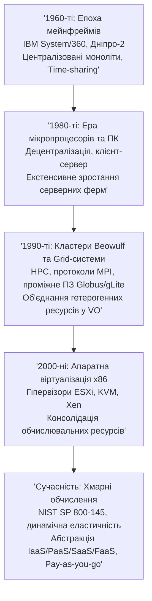
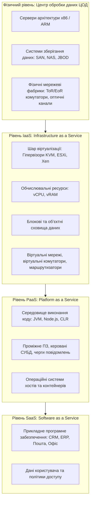
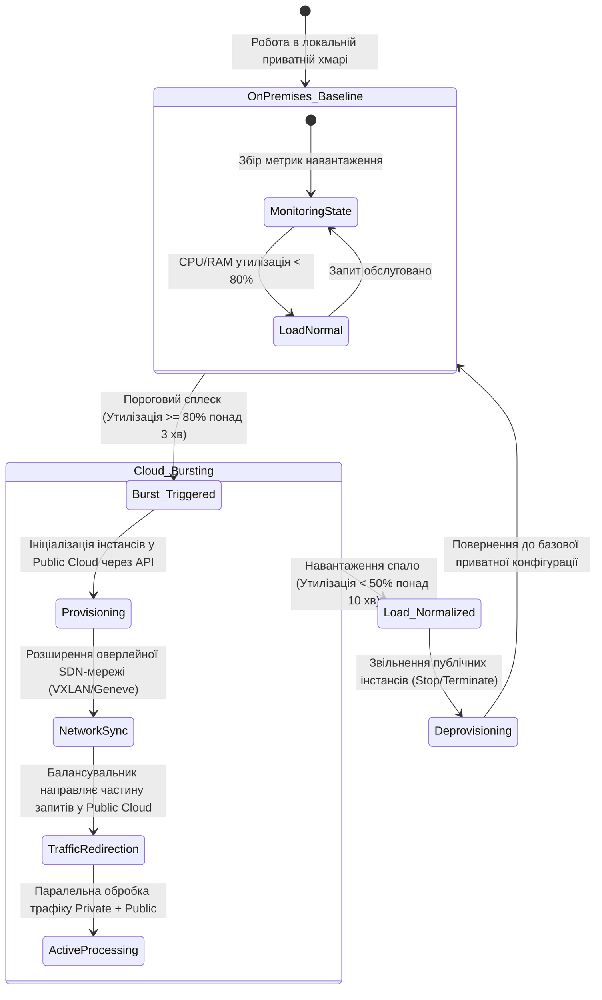
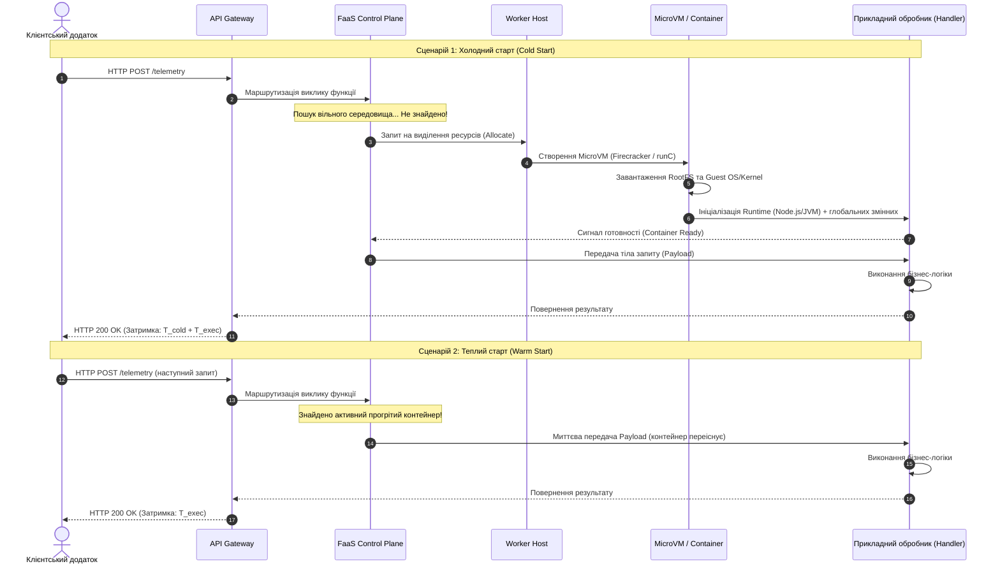
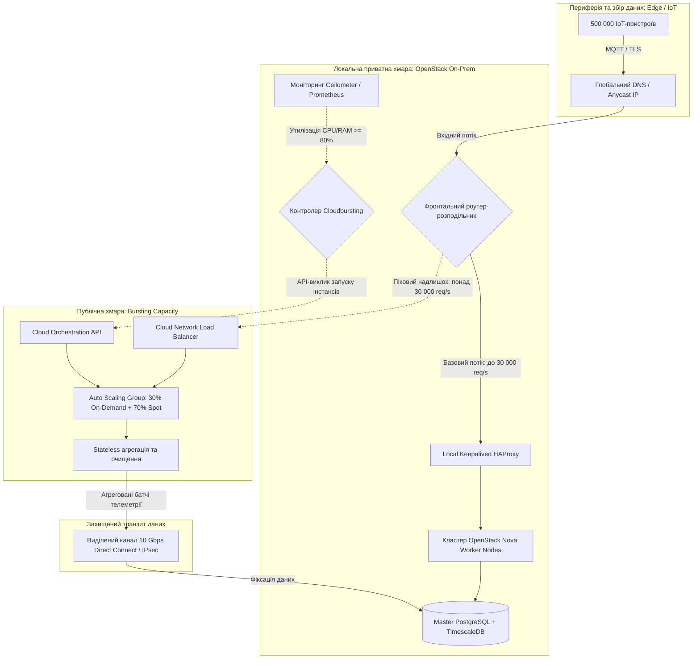

# Тема 1. Парадигма хмарних обчислень: генезис розподілених систем, сервісні моделі (XaaS) та інфраструктурне розгортання

## Мета лекції

Формування у майбутніх інженерів комп'ютерних систем і мереж системного розуміння еволюції розподіленого комп'ютингу, архітектурних принципів та інженерно-економічних критеріїв проектування хмарних середовищ. Лекція орієнтована на опанування формального апарату стандарту NIST SP 800-145, демаркації меж відповідальності в сервісних моделях (IaaS, PaaS, SaaS, FaaS), вибору оптимальних моделей розгортання (Public, Private, Hybrid, Multi-cloud) та застосування кількісних методів оцінювання сукупної вартості володіння (TCO), енергоефективності дата-центрів (PUE) і ймовірнісної доступності (SLA) для створення масштабованих і відмовостійких комп'ютерних систем.

## Очікувані результати навчання

1. **Знання та розуміння.** Студент повинен демонструвати глибоке розуміння історичної спадкоємності парадигм обчислень (мейнфрейми, кластери, Grid, Cloud), знати п'ять сутнісних характеристик, три класичні сервісні моделі та чотири моделі розгортання згідно зі стандартом NIST SP 800-145, а також розуміти специфіку архітектурної моделі спільної відповідальності (Shared Responsibility Model).

2. **Застосування.** Студент повинен уміти аналітично розраховувати показники надійності складних мультихмарних систем на основі заданих параметрів SLA, обчислювати бюджет функціонування безсерверних середовищ (FaaS) з урахуванням тривалості виконання коду й алокації пам'яті, а також формалізувати оцінку сукупної вартості володіння (TCO) під час міграції інфраструктури з On-Premises у хмару.

3. **Аналіз.** Студент повинен уміти критично аналізувати вузькі місця хмарних інфраструктур (проблему «холодного старту» в FaaS, накладні витрати на передачу трафіку при Cloudbursting, ризики вендорної залежності — Vendor Lock-in) та декомпозувати вимоги прикладного програмного забезпечення для вибору між віртуалізованими інстансами IaaS, контейнерними платформами PaaS і безсерверними функціями.

4. **Оцінювання та синтез.** Студент повинен уміти обґрунтовувати інженерні рішення щодо вибору між капітальними (CapEx) та операційними (OpEx) витратами з урахуванням коефіцієнта PUE дата-центрів, синтезувати комбіновані моделі розгортання (Hybrid/Multi-cloud) під задані обмеження нормативно-правового регулювання, мережевої латентності та бюджету проекту.

---

## Детальний покроковий план лекції

### 1. Теоретико-концептуальний базис. Еволюція розподілених архітектур та канонічні стандарти хмарних обчислень

* 1.1. Генезис обчислювальних систем: концепція розподілу часу (time-sharing) у мейнфреймах (IBM System/360, «Дніпро-2»), кластерні системи високої доступності (Beowulf, MPI) та архітектурна модель віртуальних організацій у Grid-системах (Globus Toolkit, gLite, OGSA).

* 1.2. Концептуальний базис NIST SP 800-145: декомпозиція та системний взаємозв'язок п'яти сутнісних характеристик хмари (On-demand self-service, Broad network access, Resource pooling, Rapid elasticity, Measured service).

* 1.3. Сервісна ієрархія та рівні абстракції: детальний аналіз моделей IaaS (інфраструктурні примітиви), PaaS (керовані середовища виконання), SaaS (кінцеве прикладне ПЗ) та еволюція до моделі XaaS.

* 1.4. Моделі розгортання інфраструктури: порівняльний системний аналіз публічних (Public), приватних (On-Premises та Hosted Private), громадських (Community) і комбінованих топологій.

### 2. Методологія та аналіз граничних умов. Інженерні моделі, системні обмеження та економіка хмарних інфраструктур

* 2.1. Модель спільної відповідальності (Shared Responsibility Model): демаркаційні лінії контролю за безпеку ядра ОС, апаратного рівня, мережевих політик і цілісності даних у розрізі IaaS, PaaS, SaaS та FaaS.

* 2.2. Математичне моделювання доступності та відмовостійкості: розрахунок коефіцієнта готовності складеної системи $A_{\text{system}}$ в умовах паралельного мультихмарного резервування та формалізація штрафних метрик SLA.

* 2.3. Подієво-орієнтовані безсерверні обчислення (FaaS/Serverless): компонентна модель виконання, феномен і фізичні причини «холодного старту» ($T_{\text{cold}}$), аналітичні моделі тарифікації процесорного часу й квантування пам'яті.

* 2.4. Економіко-технологічний розрахунок TCO та енергетична ефективність: математична формалізація витрат CapEx проти OpEx, розрахунок витрат на електроживлення та охолодження через метрику PUE (Power Usage Effectiveness), стратегія балансування інстансів (On-Demand, Reserved, Spot).

* 2.5. Архітектурні ліміти, критичні бар'єри та вузькі місця: проблема Vendor Lock-in на рівні специфічних API, пропускна здатність глобальних мереж і затримки синхронізації стану сховищ при реалізації Cloudbursting.

### 3. Практичний індустріальний / фаховий кейс. Архітектурне проектування корпоративної платформи

**Тема наскрізної задачі.** «Проєктування відмовостійкої гібридної інфраструктури з автоматичним Cloudbursting та оптимізацією TCO для високонавантаженої системи обробки телеметрії розумного міста (Smart City IoT Platform)»

## 1. Теоретико-концептуальний базис. Еволюція розподілених архітектур та канонічні стандарти хмарних обчислень

### 1.1. Генезис обчислювальних систем: від мейнфреймів і кластерів до Grid-систем

Еволюція архітектур обчислювальних систем демонструє циклічну динаміку, де фази максимальної централізації ресурсів закономірно чергуються з етапами їхньої просторової децентралізації. У 1960-х роках фундаментом автоматизованої обробки інформації стали **мейнфрейми** — великі універсальні електронно-обчислювальні машини, найяскравішими представниками яких були системи сімейства IBM System/360, а на теренах вітчизняної школи кібернетики — розроблена в Києві під керівництвом академіка В. М. Глушкова ЕОМ «Дніпро-2» (64-розрядна машина з розвиненим апаратним конвеєром обробки чисел із рухомою комою). 

Архітектурною основою мейнфреймів був монолітний обчислювальний комплекс, розташований у спеціалізованому машинному залі, до якого кінцеві користувачі підключалися через неінтелектуальні термінали введення-виведення. Саме на цьому етапі виникла концепція **квантування часу (time-sharing)**, що дозволяла центральному процесору почергово виділяти кванти часу багатьом термінальним сесіям, створюючи в кожного оператора ілюзію монопольного володіння суперкомп'ютером. Тоді ж професор Джон Маккарті (John McCarthy) сформулював пророчу тезу: комп'ютерні обчислення в майбутньому стануть загальнодоступною комунальною послугою (**Utility Computing**), подібною до електропостачання чи телефонної мережі.

Мікропроцесорна революція 1980-х років різко змінила вектор розвитку: поява персональних комп'ютерів (ПК) децентралізувала обчислення. Корпоративний сектор перейшов на дворівневу модель «клієнт-сервер», де інтерфейсна логіка виконувалася на робочій станції, а обробка транзакцій — на виділених серверах баз даних. Проте екстенсивне масштабування за принципом «один фізичний сервер під одну прикладну задачу» на межі 1990-х років спричинило серйозну інфраструктурну кризу: середній коефіцієнт утилізації серверних процесорів x86-архітектури не перевищував 5–15%, що зумовлювало колосальні невиправдані витрати на електроенергію, охолодження та простори дата-центрів.

Відповіддю на вимоги високопродуктивних обчислень (High-Performance Computing, HPC) стала поява **кластерних систем** (зокрема проєкту Beowulf, 1994 рік), де серійні комерційні комп'ютери (Commercial Off-The-Shelf, COTS) об'єднувалися локальною високошвидкісною мережею на базі технологій Fast/Gigabit Ethernet або комутаторів із низькою латентністю Myrinet. Програмна модель таких систем базувалася на передачі повідомлень (пакети PVM, MPICH), забезпечуючи виконання сильнозв'язаних паралельних програм у межах єдиного системного образу (Single System Image).

Логічним розвитком розподіленого комп'ютингу наприкінці 1990-х років стали **Grid-системи**, концептуалізовані Яном Фостером (Ian Foster) та Карлом Кессельманом (Carl Kesselman). Метою Grid було об'єднання географічно рознесених, гетерогенних обчислювальних потужностей, сховищ даних та наукових приладів, що належали різним адміністративним доменам, у динамічні **віртуальні організації (Virtual Organizations, VO)**. Взаємодія між вузлами базувалася на спеціалізованому проміжному програмному забезпеченні (**middleware**), такому як Globus Toolkit, gLite, UNICORE та NorduGrid ARC.



Незважаючи на потужні інструменти автентифікації на базі X.509 (Grid Security Infrastructure, GSI), протоколи планування завдань (GRAM) та пересилання терабайтних масивів (GridFTP), Grid-системи не набули комерційного успіху. Вони залишалися орієнтованими переважно на пакетну обробку специфічних наукових задач через пакетні менеджери (PBS, Torque, Condor) і не надавали механізмів миттєвої ізоляції середовищ виконання під довільне клієнтське ПЗ. Необхідний технологічний прорив стався на стику апаратної віртуалізації x86-процесорів (Intel VT-x, AMD-V), веб-інтерфейсів RESTful та глобальних широкосмугових мереж, що породило сучасні **хмарні обчислення (Cloud Computing)**.

> **ПРАКТИЧНИЙ ЯКІР:** Найбільш показовим прикладом класичної Grid-системи є Всесвітня обчислювальна мережа Великого адронного колайдера (WLCG) у CERN, де проміжне ПЗ gLite та ARC координує понад 170 дата-центрів у 42 країнах для обробки петабайтів експериментальних даних у пакетному режимі, тоді як комерційні сервіси на кшталт Netflix повністю функціонують у публічній хмарі AWS, спираючись на динамічну еластичність та автоматичну реакцію на сплески трафіку.

---

### 1.2. Формальний канон NIST SP 800-145: декомпозиція п'яти сутнісних характеристик

У вересні 2011 року Національний інститут стандартів і технологій США оприлюднив підсумковий документ **NIST Special Publication 800-145**, який став де-факто нормативним інженерним каноном термінології та архітектури хмарних систем. 

Згідно з NIST, **хмарні обчислення (Cloud Computing)** — це модель забезпечення повсюдного, зручного мережевого доступу на вимогу до спільного пулу конфігурованих обчислювальних ресурсів (наприклад, мереж, серверів, систем зберігання даних, додатків і сервісів), які можуть бути оперативно надані та вивільнені з мінімальними управлінськими зусиллями або взаємодією з постачальником послуг.

Архітектурна цілісність хмари гарантується обов'язковою одночасною наявністю **п'яти сутнісних характеристик (Essential Characteristics)**:

1. **Самообслуговування на вимогу (On-demand self-service).** Споживач може в односторонньому порядку в автоматичному режимі резервувати та конфігурувати обчислювальні можливості (серверний час, обсяги сховищ, параметри мережі) через веб-консоль або прикладний програмний інтерфейс (API) без участі інженерного персоналу постачальника хмарних послуг.

2. **Широкий мережевий доступ (Broad network access).** Надані сервіси доступні через стандартні комунікаційні мережі за допомогою уніфікованих механізмів та протоколів (HTTP/S, REST, SOAP), що підтримуються гетерогенними тонкими та товстими клієнтськими платформами (робочі станції, мобільні пристрої, шлюзи Інтернету речей).

3. **Об'єднання ресурсів у пул (Resource pooling).** Обчислювальні потужності постачальника консолідуються в єдиний динамічний масив для обслуговування великої кількості клієнтів згідно з **мультитенантною моделлю (multi-tenant model)**. Фізичні та віртуальні ресурси розподіляються динамічно відповідно до коливань попиту. Клієнт абстрагований від точного знання фізичної топології обладнання (не знає точного номера блейд-сервера або стійки), оперуючи високорівневими конструкціями локалізації (географічний регіон, зона доступності — Availability Zone).

4. **Миттєва еластичність (Rapid elasticity).** Можливості системи можуть швидко та еластично надаватися, а в деяких випадках автоматично розширюватися (scale-out) при зростанні навантаження й миттєво вивільнятися (scale-in) при його спаді. Для користувача пул ресурсів видається нескінченним, а масштабування відбувається без деградації якості обслуговування.

5. **Вимірюваність сервісу (Measured service).** Хмарні системи автоматично контролюють, вимірюють і оптимізують виділення ресурсів на відповідному рівні абстракції (за процесорними циклами, використаною пам'яттю, обсягом збережених гігабайтів, кількістю транзакцій чи смугою пропускання мережі). Усі параметри споживання фіксуються в системних реєстрах, що забезпечує прозорість взаєморозрахунків (модель **Pay-as-you-go**).

Формалізуємо взаємозв'язок між фізичною ємністю пулу, віртуальним виділенням та еластичністю. Нехай у хмарному пулі доступний сукупний фізичний ресурс пам'яті або процесорних ядер ємністю $C_{\text{phys}}$. Провайдер обслуговує $M$ активних мультитенантних користувачів, кожному з яких виділено віртуалізовану квоту $V_i$, де $i \in \{1, 2, \dots, M\}$. Коефіцієнт перепідписки ресурсів (**oversubscription ratio**) $K_{\text{os}}$ визначається як відношення сумарно задекларованої віртуальної ємності до фізичної:

$$K_{\text{os}} = \frac{\sum_{i=1}^{M} V_i}{C_{\text{phys}}}$$

Якщо фактичне споживання ресурсу $i$-м тенантом у момент часу $t$ позначається як $u_i(t)$, де $0 \le u_i(t) \le V_i$, то фундаментальною умовою стабільності та безаварійності хмарного середовища є дотримання нерівності для будь-якого моменту часу $t$:

$$\sum_{i=1}^{M} u_i(t) < C_{\text{phys}} - C_{\text{res}}$$

де $C_{\text{res}}$ — зарезервована апаратна ємність системи для забезпечення відмовостійкості гіпервізорів та міграції віртуальних машин у разі збою фізичного обладнання.

Миттєва еластичність системи оцінюється інтегральним коефіцієнтом розбіжності між реальною потребою в ресурсах $U(t) = \sum_{i=1}^{M} u_i(t)$ та виділеним ресурсом $R(t)$ протягом інтервалу часу $[0, T]$:

$$E_{\text{elasticity}} = \frac{1}{T} \int_0^T \frac{|R(t) - U(t)|}{U(t)} \, dt$$

де $E_{\text{elasticity}} \to 0$ відповідає ідеальній еластичності, коли час затримки реакції авто-масштабування $\tau_{\text{scale}} \to 0$, мінімізуючи як брак ресурсів (under-provisioning), так і їхнє надлишкове оплачуване простоювання (over-provisioning).

---

### 1.3. Сервісна ієрархія SPI та еволюція концепції XaaS

Класифікація хмарних сервісів за функціональним призначенням традиційно зводиться до трирівневої моделі **SPI** (**S**aaS, **P**aaS, **I**aaS), яка відображає ступінь абстрагування споживача від фізичних та системних компонентів обчислювальної інфраструктури.



#### 1. Інфраструктура як послуга (IaaS — Infrastructure as a Service)
Фундаментальний рівень, де замовнику надаються базові обчислювальні ресурси: процесорні потужності, оперативна пам'ять, дисковий простір та мережеві інтерфейси. Споживач не контролює фізичну інфраструктуру дата-центру, але отримує повний контроль над операційною системою (ОС), конфігурацією віртуальних дисків, мережевими портами та розгорнутими службами. 

Прикладами реалізації є віртуальні інстанси Amazon EC2, сервіс Huawei ECS (Elastic Cloud Server) або інстанси відкритої платформи OpenStack (компонент Nova).

#### 2. Платформа як послуга (PaaS — Platform as a Service)
Рівень, призначений для розробників ПЗ. Замовник отримує доступ до розгорнутого, керованого та автоматично масштабованого середовища виконання додатків (наприклад, Java Virtual Machine, Python, .NET Core, Node.js), інтегрованого з керованими базами даних (Database as a Service) та брокерами повідомлень. Провайдер бере на себе встановлення оновлень безпеки ядра ОС, патчів бібліотек та підтримку апаратної цілісності. Споживач контролює виключно вихідний код і конфігурацію додатка. 

Прикладами є AWS Elastic Beanstalk, Google App Engine, Huawei Cloud DevCloud.

#### 3. Програмне забезпечення як послуга (SaaS — Software as a Service)
Найвищий рівень абстракції, за якого споживач користується готовим програмним додатком, що функціонує в хмарі провайдера. Доступ здійснюється за допомогою тонкого клієнта (веб-браузера) або мобільного застосунку. Користувач не керує ані мережею, ані серверами, ані ОС, ані навіть платформою запуску коду; йому доступна лише модифікація користувацьких налаштувань та завантаження власних даних. 

Прикладами є корпоративні пакети Google Workspace, Microsoft 365, платформи Salesforce.

#### 4. Еволюція до XaaS (Everything as a Service) та безсерверна модель (FaaS)
Розвиток хмарної інженерії призвів до атомізації послуг під парасольковим терміном **XaaS (Все як послуга)**. Зокрема, виділилися:
* **DaaS (Desktop as a Service)** — віртуалізація робочих столів користувача, де вся графіка й середовище генеруються в ЦОД (протоколи PCoIP, HDP в Huawei FusionAccess);
* **STaaS (Storage as a Service)** — спеціалізовані об'єктні та блокові сховища (Amazon S3, OpenStack Swift);
* **FaaS (Function as a Service / Serverless)** — модель, що доводить PaaS до абсолютного мінімалізму, де одиницею розгортання є атомарна функція, яка виконується за подією (тригером) без постійно запущеного процесу.

> **ПРАКТИЧНИЙ ЯКІР:** При проєктуванні інфраструктури хмарного провайдера завдання ізоляції та прискорення вводу-виводу для IaaS-інстансів вирішується спеціалізованими апаратними прискорювачами. Так, архітектура AWS Nitro System або плати Huawei IN200 переносять виконання гіпервізора, віртуальної мережі VPC та операцій з накопичувачами NVMe на окремий PCIe-контролер із мікропроцесором ASIC/ARM, вивільняючи 100% ресурсів центрального процесора хоста для клієнтських віртуальних машин.

> **ТИПОВА ПОМИЛКА:** Ототожнення звичайної віртуалізації (наприклад, локально встановленого гіпервізора VMware vSphere або Proxmox VE без автоматизації) із хмарними обчисленнями. Віртуалізація є лише інструментом поділу ресурсів. Якщо адміністратор виділяє віртуальну машину за ручною заявкою користувача через кілька днів, а тарифікація за фактичне споживання відсутня — ця система не задовольняє вимогам NIST і не є хмарою.

---

### 1.4. Моделі просторового та організаційного розгортання

Стандарт NIST SP 800-145 регламентує чотири канонічні моделі розгортання хмарних середовищ, до яких сучасна індустрія додала парадигму мультихмарності.

#### 1. Публічна хмара (Public Cloud)
Інфраструктура створюється, експлуатується та підтримується стороннім комерційним провайдером для вільного використання широким загалом або бізнес-клієнтами. Обчислювальні вузли розміщуються у величезних гіпермасштабованих дата-центрах (**Hyperscale Data Centers**). Клієнти ділять фізичні ресурси, але логічно ізольовані програмними межами. Модель забезпечує нульові початкові капітальні витрати та практично миттєве розширення.

#### 2. Приватна хмара (Private Cloud)
Інфраструктура призначена для ексклюзивного використання однією організацією, що включає множину внутрішніх споживачів (підрозділів). Вона може перебувати у власності, управлінні та експлуатації як самої організації (**On-Premises Private Cloud**), так і стороннього оператора (**Hosted Private Cloud**), фізично розташовуючись на власній або орендованій площадці. Приватні хмари гарантують повний контроль над контурами безпеки, відповідність регуляторним нормам щодо обігу банківської чи військової таємниці та детерміновану продуктивність мережі, проте вимагають значних початкових витрат на обладнання та утримання персоналу.

#### 3. Громадська хмара (Community Cloud)
Спеціалізована інфраструктура, розгорнута для спільного використання конкретною групою організацій, які мають спільні інтереси, місію, протоколи безпеки або нормативні вимоги. Витрати на побудову розподіляються між учасниками спільноти. Типовий приклад — національні академічні хмари університетів або захищені міжвідомчі урядові платформи.

#### 4. Гібридна хмара (Hybrid Cloud)
Комбінація з двох або більше чітко розмежованих хмарних інфраструктур (приватних, громадських або публічних), які залишаються самостійними сутностями, але поєднані стандартизованими чи пропрієтарними технологіями взаємодії, що забезпечують переносимість даних та додатків.

Зв'язок між сегментами гібридної хмари реалізується через шифровані тунелі (IPsec VPN) або виділені магістральні канали зв'язку другого/третього рівнів моделі OSI (AWS Direct Connect, Azure ExpressRoute). 

Ключовим динамічним процесом у гібридній інфраструктурі є архітектурний патерн **Cloudbursting** («вибух у хмару»). Його життєвий цикл формалізується за допомогою машини станів (State Machine), наведеної на рисунку нижче:



#### 5. Мультихмарна стратегія (Multi-cloud)
На відміну від гібридної моделі (де обов'язкова наявність приватного сегмента), мультихмарність передбачає одночасне використання сервісів декількох *незалежних публічних хмарних постачальників* (наприклад, AWS + Google Cloud + Cloudflare). Це мінімізує стратегічні ризики прив'язки до одного вендора (**Vendor Lock-in**), оптимізує витрати за рахунок різниці в регіональних тарифах провайдерів та гарантує катастрофостійкість (Disaster Recovery) у разі глобальних аварій на боці одного з гіперскейлерів.

Систематизуємо характеристики моделей у порівняльній таблиці:

| Модель розгортання | Архітектурний контроль споживача | Масштабованість та еластичність | Механізм ізоляції тенантів | Приклад з реальної практики |
| :--- | :--- | :--- | :--- | :--- |
| **Публічна (Public)** | Мінімальний (лише в межах наданих API сервісів) | Практично необмежена, автоматичне виділення | Логічна ізоляція (VLAN/VXLAN, віртуалізація ядра) | Розгортання мікросервісів інтернет-магазину в AWS EC2 |
| **Приватна (Private)** | Повний (від прошивок BIOS/UEFI до операційних систем) | Жорстко обмежена фізичною ємністю придбаного парку | Фізична ізоляція заліза та периметра дата-центру | Внутрішній банківський ЦОД на платформі Proxmox VE або OpenStack |
| **Громадська (Community)** | Колективний (регламентується угодою спільноти) | Обмежена загальним пулом учасників консорціуму | Логічна або зональна фізична ізоляція для членів групи | Хмарне середовище обміну медичними даними лікарень одного регіону |
| **Гібридна (Hybrid)** | Диференційований (повний над On-Prem, обмежений над Cloud) | Гнучка: базова локальна + пікова публічна (Cloudbursting) | Комбінований: фізичний контур для ядра + тунелювання в публічний пул | Процесинг платежів у локальній базі + аналітика логів у Google BigQuery |
| **Мультихмара (Multi-cloud)** | Варіюється залежно від сервісів конкретного вендора | Максимальна глобальна доступність і диверсифікація | Логічна мультитенантність у кількох незалежних провайдерів | Бази даних в Azure SQL, обчислення в AWS, фронтенд-кешування у Cloudflare |

---

> **КОНТРОЛЬНЕ ПИТАННЯ:** Підприємство розгорнуло корпоративний веб-портал у приватному дата-центрі, використовуючи кластер серверів під керуванням гіпервізора VMware ESXi та СУБД PostgreSQL. Процес надання додаткової віртуальної машини вимагає створення тікета в службі технічної підтримки та його ручного схвалення IT-директором упродовж трьох робочих днів. Чи можна вважати це середовище хмарним відповідно до стандарту NIST SP 800-145?
>
> A. Так, оскільки використано апаратну віртуалізацію та кластеризацію обчислювальних вузлів.  
> B. Так, оскільки інфраструктура функціонує як приватна хмара (Private Cloud) конкретного підприємства.  
> C. Ні, оскільки порушено характеристику «Самообслуговування на вимогу» (On-demand self-service) та відсутня миттєва еластичність.  
> D. Ні, тому що приватні хмари можна створювати виключно за допомогою відкритого ПЗ (OpenStack/KVM).

<details markdown="1">
<summary>Розгорнути аналіз / відповідь</summary>

**Правильний варіант: C.**

1. **Повне обґрунтування:** Згідно з NIST SP 800-145, середовище може кваліфікуватися як хмарне **виключно за умови одночасної відповідності всім п'яти сутнісним характеристикам**. Вимога ручного погодження інфраструктурних змін людиною (три робочі дні на обробку тікета) прямо суперечить принципу **On-demand self-service**, який вимагає повністю автоматизованого, одностороннього виділення ресурсів споживачем без втручання персоналу. Також у цьому сценарії відсутня **Rapid elasticity**, оскільки система неспроможна оперативно реагувати на сплески навантаження в реальному часі.

2. **Аналіз дистракторів:**
   * **Варіант A є хибним:** Наявність віртуалізації є лише допоміжною технологією консолідації й не перетворює автоматично звичайний дата-центр на хмарний.
   * **Варіант B є хибним:** Приватна хмара зобов'язана підтримувати всі п'ять критеріїв NIST (зокрема автоматизований портал самообслуговування та вимірюваність використання), а не просто належати одній юридичній особі.
   * **Варіант D є хибним:** Стандарт NIST є технологічно нейтральним і не регламентує тип ліцензії програмного забезпечення (комерційне чи Open Source).

</details>

---

### Вказівки для самостійного осмислення

1. **Аналіз реальних інфраструктурних контурів.** Дослідіть IT-інфраструктуру вашого навчального закладу або компанії, де ви працюєте. Визначте, які використовувані сервіси підпадають під визначення IaaS, PaaS та SaaS. З'ясуйте, чи задовольняє внутрішня віртуалізована інфраструктура (за її наявності) всім п'яти критеріям NIST SP 800-145, або ж вона є лише класичним віртуалізованим ЦОД.

2. **Оцінка меж гібридного хмароутворення.** Розгляньте практичну ситуацію: медична установа має зберегти конфіденційні цифрові картки пацієнтів відповідно до суворих вимог закону про захист персональних даних, але одночасно потребує застосування високонавантаженої нейромережі для обробки рентгенівських знімків, оренда GPU-серверів для якої є економічно доцільною лише в публічній хмарі. Опишіть архітектурне рішення гібридної системи: які дані мають залишатися в приватному сегменті, які — передаватися в публічний, і як має бути організовано канал зв'язку між ними.

3. **Техніко-економічне моделювання перепідписки.** Розрахуйте для умовного 16-ядерного фізичного сервера з 64 ГБ оперативної пам'яті граничний коефіцієнт перепідписки $K_{\text{os}}$ за процесором та пам'яттю для сценарію розміщення віртуальних машин розробників (Dev-середовище) порівняно зі сценарієм розміщення бойових серверів баз даних (Production-середовище). Обґрунтуйте, чому в одному випадку $K_{\text{os}}$ може досягати значення 3.0–4.0, а в іншому суворо обмежений одиницею ($K_{\text{os}} \le 1.0$).

## 2. Методологія та аналіз граничних умов. Інженерні моделі, системні обмеження та економіка хмарних інфраструктур

### 2.1. Модель спільної відповідальності (Shared Responsibility Model)

**Модель спільної відповідальності (Shared Responsibility Model)** є базовою методологічною матрицею, яка формалізує розподіл зон контролю, юридичних зобов'язань та інженерних завдань між постачальником хмарних послуг (**Cloud Service Provider, CSP**) і споживачем (**Tenant / Customer**). Демаркаційна лінія між сторонами не є статичною: вона динамічно зміщується вгору за стеком обчислювальних технологій залежно від обраної моделі обслуговування.

```
+---------------------------------------------------------------------------------------+
|  Шар технологічного стеку         |   IaaS    |    PaaS    |    FaaS   |     SaaS     |
+-----------------------------------+-----------+------------+-----------+--------------+
|  Дані та класифікація контенту   | Клієнт    | Клієнт     | Клієнт    | Клієнт       |
|  Керування доступом (IAM)        | Клієнт    | Клієнт     | Клієнт    | Клієнт/CSP   |
|  Прикладний код / Бізнес-логіка  | Клієнт    | Клієнт     | Клієнт    | Провайдер    |
|  Середовище виконання (Runtime)  | Клієнт    | Провайдер  | Провайдер | Провайдер    |
|  Операційна система (Guest OS)   | Клієнт    | Провайдер  | Провайдер | Провайдер    |
|  Мережева конфігурація (Traffic) | Клієнт    | Клієнт/CSP | Провайдер | Провайдер    |
|  Гіпервізор та віртуалізація     | Провайдер | Провайдер  | Провайдер | Провайдер    |
|  Фізичні сервери, СЗД, ЦОД       | Провайдер | Провайдер  | Провайдер | Провайдер    |
+---------------------------------------------------------------------------------------+
```

* **Рівень IaaS:** Провайдер гарантує фізичну цілісність ЦОД, функціонування серверного парку, охолодження, енергопостачання та роботу гіпервізора. Споживач несе виключну відповідальність за встановлення критичних оновлень ядра гостьової ОС, захист мережевого периметра (налаштування Security Groups, IPTables), сегментацію віртуальних мереж і коректність шифрування дисків.
* **Рівень PaaS:** Межа відповідальності провайдера піднімається до рівня операційної системи та середовища виконання (наприклад, актуальні версії .NET CLR, JVM або інтерпретатора Python). Відповідальність клієнта зосереджена на архітектурі коду, конфігурації підключень до баз даних і налаштуванні правил взаємної автентифікації.
* **Рівень FaaS:** Провайдер бере на себе керування життєвим циклом контейнерів виконання, автоматичне горизонтальне масштабування та виділення системних ресурсів. Споживач відповідає за коректність бізнес-логіки атомарної функції, її залежності та безпеку конфігурації тригерів (наприклад, політики доступу в API Gateway).
* **Рівень SaaS:** Провайдер контролює весь стек від заліза до призначеного для користувача інтерфейсу. Споживач відповідає виключно за керування обліковими записами, розподіл прав доступу, запобігання витоку автентифікаційних токенів і правильність класифікації збережених даних.

> **ВАЖЛИВО:** Фундаментальний закон кібербезпеки в хмарі формулюється так: *«Постачальник відповідає за безпеку самої ХМАРИ (Security OF the Cloud), тоді як споживач несе повну відповідальність за безпеку даних та операцій В ХМАРІ (Security IN the Cloud)»*. Жоден сертифікат безпеки провайдера (наприклад, ISO/IEC 27001 чи SOC 2) не захищає дані користувача, якщо інженер припустився помилки в налаштуваннях прав доступу чи відкрив загальний доступ до сховища.

> **ПРАКТИЧНИЙ ЯКІР:** У 2019 році корпорація Capital One зазнала зламу, що скомпрометував персональні дані понад 100 мільйонів клієнтів. Атака відбулася через вразливість Server-Side Request Forgery (SSRF) у брандмауері веб-додатків (WAF), розгорнутому на віртуальній машині AWS EC2. Нападник отримав доступ до сервісу метаданих інстансу (IMDSv1) та скомпрометував тимчасові токени ролі IAM. Цей інцидент став хрестоматійним доказом моделі спільної відповідальності: апаратна та гіпервізорна інфраструктура AWS функціонувала штатно, однак некоректне конфігурування мережевих правил та надлишкові привілеї ролі на боці клієнта призвели до фатального витоку даних.

**Граничні умови моделі:** Модель втрачає свою визначеність у ситуаціях, коли злам відбувається через так звані атаки виходу з віртуальної машини (**VM Escape**) або вразливості нульового дня в процесорних мікроархітектурах (наприклад, атаки сторонніми каналами класу Meltdown, Spectre, Downfall). У таких випадках порушується апаратна ізоляція тенантів на рівні фізичного ядра процесора, що знаходиться поза зоною контролю споживача, проте прямі фінансові та репутаційні збитки від компрометації криптографічних ключів повністю покладаються на власника даних.

---

### 2.2. Математичне моделювання доступності та відмовостійкості

Рівень доступності хмарних систем регламентується угодою про рівень обслуговування (**Service Level Agreement, SLA**). Для інженера комп'ютерних систем критично важливим є перехід від декларативних гарантій провайдера до аналітичного розрахунку ймовірності безвідмовної роботи системи.

#### Покрокове математичне виведення сумарної доступності системи

Розглянемо корпоративну систему, яка складається з послідовного ланцюга трьох функціональних рівнів: DNS-маршрутизатора, пулу обчислювальних серверів і кластера баз даних.

$$\begin{aligned}
\text{Крок 1: } & \text{Формалізація доступності послідовних компонентів.} \\
& \text{Нехай система складається з } n \text{ критичних підсистем, вихід із ладу будь-якої з яких} \\
& \text{призводить до повного зупинення сервісу. За умови статистичної незалежності відмов,} \\
& \text{доступність послідовного з'єднання } A_{\text{serial}} \text{ виражається добутком:} \\
& A_{\text{serial}} = \prod_{i=1}^{n} A_i = A_1 \cdot A_2 \cdots A_n \\
\text{Крок 2: } & \text{Формалізація доступності паралельного (надлишкового) резервування.} \\
& \text{Для підвищення надійності } i\text{-го рівня розгортається } m_i \text{ ідентичних резервних вузлів.} \\
& \text{Рівень функціонує, якщо працює хоча б один вузол. Ймовірність одночасної відмови} \\
& \text{всіх } m_i \text{ вузлів дорівнює } \prod_{j=1}^{m_i} (1 - A_{ij}). \text{ Відповідно, доступність рівня:} \\
& A_{\text{parallel}, i} = 1 - \prod_{j=1}^{m_i} (1 - A_{ij}) \\
\text{Крок 3: } & \text{Синтез комбінованої моделі системи.} \\
& \text{Для системи з } n \text{ послідовних рівнів, де кожен рівень має паралельне резервування:} \\
& A_{\text{system}} = \prod_{i=1}^{n} \left[ 1 - \prod_{j=1}^{m_i} (1 - A_{ij}) \right] \\
\text{Крок 4: } & \text{Розрахунок допустимого часу простою (Downtime).} \\
& \text{Річний час простою } T_{\text{down}} \text{ (у хвилинах) для заданого } A_{\text{system}} \text{ при } T_{\text{year}} = 525\,600 \text{ хв:} \\
& T_{\text{down}} = T_{\text{year}} \cdot (1 - A_{\text{system}})
\end{aligned}$$

Наприклад, якщо сервіс складається з хмарного шлюзу API ($A_1 = 0{,}9999$), двох паралельних зон обчислень IaaS ($A_{2,1} = A_{2,2} = 0{,}995$) та керованої multi-AZ бази даних ($A_3 = 0{,}9995$):

$$A_{\text{compute}} = 1 - (1 - 0{,}995)^2 = 1 - (0{,}005)^2 = 1 - 0{,}000025 = 0{,}999975$$

$$A_{\text{system}} = 0{,}9999 \cdot 0{,}999975 \cdot 0{,}9995 \approx 0{,}999375 \quad (99{,}9375\%)$$

Річний простий складе: $525\,600 \cdot (1 - 0{,}999375) \approx 328{,}5 \text{ хвилин } (\approx 5{,}47 \text{ години})$.

#### Фінансово-штрафна модель SLA

У разі порушення умов SLA провайдери не компенсують прямі комерційні збитки бізнесу, а надають знижку на майбутні послуги у вигляді компенсаційних кредитів (**Service Credits**):

$$\text{Credit (\%)} = \begin{cases} 
0\%, & \text{якщо } A_{\text{actual}} \ge A_{\text{SLA}} \\
10\%, & \text{якщо } A_{\text{threshold}, 1} \le A_{\text{actual}} < A_{\text{SLA}} \\
25\%, & \text{якщо } A_{\text{threshold}, 2} \le A_{\text{actual}} < A_{\text{threshold}, 1} \\
100\%, & \text{якщо } A_{\text{actual}} < A_{\text{threshold}, 2} 
\end{cases}$$

**Граничні умови моделі:** Математичний апарат теорії надійності, що базується на перемноженні ймовірностей, **повністю втрачає адекватність за наявності корельованих відмов (Common Cause Failures)**. Якщо резервовані віртуальні машини розташовані в різних зонах доступності, але використовують спільну глобальну площину керування (Control Plane) провайдера, спільний сервіс автентифікації IAM або зазнають збою через помилку конфігурації протоколу динамічної маршрутизації BGP на прикордонних маршрутизаторах, відмови перестають бути незалежними:

$$P(\text{Збій вузла } 2 \mid \text{Збій вузла } 1) \gg P(\text{Збій вузла } 2)$$

У цьому випадку реальна доступність системи стрімко деградує від розрахункових «чотирьох дев'яток» (99.99%) до фактичного рівня надійності найслабшої спільної ланки.

---

### 2.3. Подієво-орієнтовані безсерверні обчислення (FaaS/Serverless)

Парадигма безсерверних обчислень (**Serverless / FaaS**) змінює класичний життєвий цикл програмного забезпечення: замість постійно активного фонового демона (daemon process) код виконується виключно у відповідь на виникнення зовнішньої події.

#### Архітектурна динаміка обробки запиту: «Холодний» проти «Теплого» старту

Ключовим системним викликом у FaaS є затримка ініціалізації середовища (**Cold Start**). Діаграма послідовності демонструє різницю між обробкою первинного виклику та повторного звернення:



Математично повний час обробки виклику функції $T_{\text{response}}$ визначається виразом:

$$T_{\text{response}} = \delta_{\text{cold}} \cdot \left( t_{\text{sched}} + t_{\text{vm\_boot}} + t_{\text{runtime\_init}} \right) + t_{\text{code\_exec}} + t_{\text{network\_rtt}}$$

де $\delta_{\text{cold}} \in \{0, 1\}$ — булева функція стану контейнера (1 — холодний старт, 0 — теплий старт), $t_{\text{sched}}$ — затримка планувальника платформи з вибору оптимального хоста, $t_{\text{vm\_boot}}$ — час завантаження мінімалістичної віртуальної машини (наприклад, технології Firecracker MicroVM, що становить 5–50 мс), $t_{\text{runtime\_init}}$ — час завантаження мовного середовища та статичних конструкторів коду (для C/Go $\approx 5\text{–}15\text{ мс}$, для Java/C# $\approx 500\text{–}3000\text{ мс}$ через вагу завантажуваних бібліотек), $t_{\text{code\_exec}}$ — безпосередня тривалість обчислень, $t_{\text{network\_rtt}}$ — затримка мережевого транспорту.

**Граничні умови моделі:** FaaS-модель демонструє високу ефективність **виключно для короткоживучих незв'язаних задач із випадковим чи імпульсним навантаженням**. 

Вона стає непридатною за таких умов:
1. **Постійне високе навантаження:** Якщо функція викликається безперервно з високою інтенсивністю (сотні запитів на секунду 24/7), сукупна вартість FaaS експоненційно перевищує вартість оренди еквівалентних виділених інстансів IaaS або контейнерів у Kubernetes.
2. **Системи жорсткого реального часу:** Наявність непередбачуваного холодного старту ($\delta_{\text{cold}} = 1$) унеможливлює використання FaaS у контурах управління промисловою автоматикою, де затримка відповіді повинна бути детермінованою і не перевищувати одиниць мілісекунд.
3. **Задачі з підтримкою стану (Stateful):** Оскільки мікроконтейнери знищуються або перезапускаються без попередження, збереження контексту між викликами всередині пам'яті інстансу неможливе, що змушує використовувати зовнішні сховища (Redis, DynamoDB), вносячи додаткову мережеву затримку в кожну операцію.

---

### 2.4. Економіко-технологічний розрахунок TCO та енергетична ефективність

Інженерне проектування інфраструктур вимагає кількісного обґрунтування вибору між капітальними вкладеннями (**CapEx**) у власне обладнання та операційними видатками (**OpEx**) на публічну хмару.

#### Модель енергетичної ефективності ЦОД (PUE)

Енергетичний баланс дата-центру описується метрикою **Power Usage Effectiveness (PUE)**:

$$PUE = \frac{P_{\text{total}}}{P_{\text{IT}}}$$

де $P_{\text{total}}$ — сумарна електрична потужність, яка споживається всім дата-центром (включаючи компресори кондиціонерів, вентиляцію, ДБЖ, трансформатори, освітлення та системи безпеки), $P_{\text{IT}}$ — корисна електрична потужність, що живить безпосередньо обчислювальне обладнання (сервери, дискові масиви, мережеві комутатори). 

За визначенням, $PUE \ge 1{,}0$. Для застарілих серверних кімнат підприємств типовим є значення $PUE = 1{,}8 \dots 2{,}2$ (на кожен 1 Вт корисної потужності серверів витрачається ще 1,2 Вт на охолодження та накладні втрати). У гіпермасштабованих ЦОД публічних хмар (AWS, Google, Microsoft) за рахунок прямого фрікулінгу та оптимізації трактів перетворення струму досягається значення $PUE = 1{,}1 \dots 1{,}15$, що дає значну перевагу в собівартості експлуатації одиниці обчислень.

#### Порівняльний розрахунок сукупної вартості володіння (TCO)

$$\begin{aligned}
\text{Крок 1: } & \text{Розрахунок вартості On-Premises інфраструктури за 3 роки.} \\
& TCO_{\text{on-prem}} = C_{\text{CapEx}} + \sum_{y=1}^{3} \left( C_{\text{power}}(y) + C_{\text{facility}}(y) + C_{\text{maintenance}}(y) + C_{\text{staff}}(y) \right) \\
& \text{де } C_{\text{power}}(y) = P_{\text{IT}} \cdot PUE \cdot 8760 \text{ год} \cdot \text{Tariff}_{\text{kWh}} \\
\text{Крок 2: } & \text{Розрахунок вартості публічної хмари за комбінованою тарифною сіткою.} \\
& TCO_{\text{cloud}} = \sum_{y=1}^{3} \left( C_{\text{Reserved}} + C_{\text{OnDemand}}(y) + C_{\text{Spot}}(y) + C_{\text{Storage}} + C_{\text{EgressNetwork}} \right) \\
\text{Крок 3: } & \text{Аналітичне визначення точки беззбитковості (Break-even Point).} \\
& \text{Хмарна міграція виправдана, якщо } TCO_{\text{cloud}} < TCO_{\text{on-prem}} - C_{\text{migration\_loss}}
\end{aligned}$$

#### Стратегія оптимізації цінових моделей у публічній хмарі

Для досягнення мінімального $TCO_{\text{cloud}}$ застосовується комбінація трьох цінових рівнів:
1. **Базове навантаження (Base Load, 100% часу):** Покривається **Reserved Instances / Savings Plans** (зобов'язання на 1–3 роки дають дисконт до 72%).
2. **Передбачувані коливання (Денні цикли):** Обслуговуються за моделлю **On-Demand** (гнучка погодинна/посекундна тарифікація без зобов'язань).
3. **Пакетні некритичні обчислення (Batch/Analytics):** Спрямовуються на **Spot/Preemptible Instances** (дисконт до 80–90%), де завдання повинні підтримувати контрольні точки (**Checkpoints**) на випадок раптового вилучення інстансу провайдером із попередженням за 120 секунд.

**Граничні умови моделі:** Модель TCO публічної хмари **стає фінансово програшною**, якщо система генерує колосальні обсяги вихідного мережевого трафіку у відкритий Інтернет (**Data Egress**). У більшості хмарних провайдерів вхідний трафік (Ingress) є безкоштовним, але вихідний (Egress) тарифікується за високими ставками (від 0,05 до 0,09 USD за гігабайт). Якщо компанія, наприклад, здійснює роздачу відеопотоків або трансляцію резервних копій у локальне сховище без використання спеціалізованих CDN, плата за трафік може багаторазово перевищити витрати на обчислювальні інстанси, зводячи нанівець усю економію від відмови від власного «заліза».

---

### 2.5. Архітектурні ліміти, критичні бар'єри та вузькі місця

Під час експлуатації хмарних середовищ інженери стикаються з фізичними та концептуальними обмеженнями:

1. **Вендорний полон (Vendor Lock-in):** Глибока інтеграція коду додатків із пропрієтарними сервісами провайдера (наприклад, специфічні тригери AWS DynamoDB Streams чи черги Azure Service Bus) робить міграцію на іншу платформу економічно еквівалентною повному переписуванню продукту з нуля. Захистом є використання відкритих стандартів та абстракцій (Kubernetes, Terraform, gRPC, Kafka).
2. **Мережеві бар'єри та затримка синхронізації при Cloudbursting:** При реалізації гібридної схеми скидання пікового навантаження (рис. машини станів розділу 1.4) критичним вузьким місцем стає когерентність даних. Обчислювальний інстанс у публічній хмарі ініціалізується за лічені хвилини, проте якщо для його роботи потрібна транзакційна база обсягом у десятки терабайтів, розташована локально, мережева затримка RTT (Round-Trip Time) через Інтернет призведе до деградації продуктивності застосунку.

Нижче наведено зведену матрицю системного порівняння досліджуваних моделей:

| Модель архітектури | Рівень інженерного контролю | Складність впровадження | Граничні архітектурні ризики | Економічний поріг доцільності |
| :--- | :--- | :--- | :--- | :--- |
| **IaaS (Infrastructure as a Service)** | Повний контроль ОС, мережі, стеків виконання | Середня: вимагає стандартних навичок системного адміністрування | Необхідність самостійного оновлення ядра, повільний старт інстансів (1–5 хв) | Постійне базове навантаження, перенесення готових систем (Lift-and-Shift) |
| **PaaS (Platform as a Service)** | Контроль коду та конфігурації платформи | Низька: розгортання через git push або CI/CD конвеєри | Ризик Vendor Lock-in, обмеження у виборі специфічних бібліотек і версій ОС | Прискорена розробка типових веб-додатків та API |
| **FaaS (Function as a Service)** | Контроль виключно атомарної бізнес-функції | Висока: потребує повної перебудови коду на подієву stateless-архітектуру | Непередбачуваний «холодний старт», неможливість прямої взаємодії з пам'яттю | Спорадичні, імпульсні навантаження, фонова обробка файлів та подій IoT |
| **Hybrid Cloudbursting** | Розподілений: локальні вузли + хмарні API | Вкрай висока: потребує складних SDN-мереж (VXLAN) та брокерів | Асинхронне розходження станів баз даних, затримки каналів зв'язку | Передбачувані короткочасні сезонні сплески (наприклад, Black Friday) |

---

> **КОНТРОЛЬНЕ ПИТАННЯ:** Команда розробників проектує платіжний шлюз обробки транзакцій. Архітектор пропонує повністю перевести обробку платежів на платформу FaaS (AWS Lambda) для економії коштів у нічні години. Відомо, що сервіс має жорстку вимогу угоди SLA: час відповіді 99-го перцентиля ($P_{99}$) не повинен перевищувати 80 мс. Базова ініціалізація криптографічних бібліотек у функції займає 250 мс. Чи є запропоноване архітектурне рішення коректним?
>
> A. Так, оскільки FaaS автоматично масштабується під будь-який потік запитів і забезпечить мінімальну ціну.  
> B. Так, за умови увімкнення механізму виділеної паралельності (Provisioned Concurrency) для всіх інстансів.  
> C. Ні, тому що наявність «холодного старту» (250 мс) гарантовано порушить вимогу SLA щодо затримки $P_{99} \le 80$ мс при виникненні нових викликів.  
> D. Ні, оскільки безсерверні функції категорично не підтримують шифрування та протоколи безпеки фінансових операцій.

<details markdown="1">
<summary>Розгорнути аналіз / відповідь</summary>

**Правильний варіант: C.**

1. **Повне обґрунтування:** Вимога SLA регламентує час відгуку для 99% запитів ($P_{99} \le 80$ мс). Будь-який новий виклик функції, який супроводжується холодним стартом, займе щонайменше $T_{\text{cold}} = 250 \text{ мс}$ (ініціалізація криптографічних бібліотек) плюс безпосереднє виконання коду $t_{\text{code\_exec}}$ та мережева затримка. Таким чином, час відповіді для кожного запиту, що спричинив створення нового мікроконтейнера, перевищить 250 мс, що є неприпустимим порушенням граничної умови SLA.
2. **Аналіз дистракторів:**
   * **Варіант A є хибним:** Автомасштабування у FaaS вирішує проблему пропускної здатності, але за рахунок породження нових холодних контейнерів, кожен із яких створює пікову затримку (latency spike).
   * **Варіант B є технічно неповним і економічно суперечливим:** Хоча `Provisioned Concurrency` тримає контейнери прогрітими, це вимагає постійної щогодинної оплати зарезервованої ємності, що повністю ліквідує заявлену початкову мету «економії коштів у періоди простою» і перетворює вартість сервісу на еквівалент звичайної IaaS/PaaS віртуальної машини.
   * **Варіант D є хибним:** FaaS повністю підтримує виконання сучасних криптографічних алгоритмів і відповідає стандартам PCI-DSS.

</details>

---

### Вказівки для самостійного осмислення

1. **Практичний аудит моделі спільної відповідальності.** Спроектуйте розмежування відповідальності для типової трирівневої веб-системи, що розгортається в інфраструктурі AWS. Визначте конкретні ролі (хто встановлює security-патчі, хто створює резервні копії, хто конфігурує TLS-сертифікати), якщо база даних розміщується в керованому сервісі Amazon RDS (PaaS), а бекенд функціонує на віртуальних машинах Amazon EC2 (IaaS).

2. **Аналітичний розрахунок точки беззбитковості (On-Premises vs Cloud).** Підприємство експлуатує 20 серверів із сумарним споживанням $P_{\text{IT}} = 10\text{ кВт}$ у локальній серверній із $PUE = 1{,}9$. Тариф електроенергії становить $0{,}12\text{ USD/кВт}\cdot\text{год}$. Обчисліть річні витрати лише на електроживлення та охолодження. Порівняйте цей результат із вартістю річної оренди аналогічних за потужністю зарезервованих інстансів у публічного провайдера, якщо відомо, що дата-центр провайдера має $PUE = 1{,}12$.

3. **Аналіз архітектурної катастрофостійкості.** Знайдіть та критично оцініть технічний звіт (Post-Mortem / Incident Report) будь-якого масштабного збою глобального хмарного провайдера (наприклад, масштабний збій AWS у регіоні us-east-1 у грудні 2021 року). Ідентифікуйте першопричину інциденту: чи була вона спричинена фізичним виходом обладнання з ладу, чи відмовою логічного рівня керування (Control Plane / DNS / BGP). Зробіть висновок щодо надійності розміщення мультизонних систем у межах одного географічного регіону провайдера.

## 3. Практичний індустріальний / фаховий кейс. Архітектурне проектування корпоративної платформи

### 3.1. Комплексний фаховий кейс. Проєктування відмовостійкої гібридної інфраструктури з автоматичним Cloudbursting та оптимізацією TCO для Smart City IoT Platform

#### Постановка задачі/ситуації

Муніципальний департамент цифрової трансформації впроваджує платформу інтернету речей (**Smart City IoT Platform**) для збору телеметрії з міської інфраструктури (датчики трафіку, лічильники електроенергії, екологічний моніторинг, стан насосних станцій). Система функціонує в режимі 24/7/365 і характеризується різко вираженими добовими та сезонними піками навантаження (ранкові та вечірні транспортні колапси, аварійні погодні умови). 

Згідно з вимогами законодавства про захист інформації, первинні ідентифікаційні дані приладів обліку та критична геопросторова телеметрія повинні фізично зберігатися у власному периметрі організації (On-Premises). Водночас закупівля власного обладнання під пікові навантаження призведе до хронічного простою понад 65% обчислювальних потужностей у міжпіковий період. 

Перед головним системним архітектором поставлено інженерне завдання: спроєктувати гібридну хмарну інфраструктуру з підтримкою механізму **Cloudbursting**, яка гарантує коефіцієнт доступності сервісу $A_{\text{system}} \ge 99{,}99\%$, витримує триразові пікові навантаження та оптимізує сукупну вартість володіння (TCO) за 3-річний життєвий цикл.

| Параметр системи | Значення параметра | Примітки та інженерні обмеження |
| :--- | :--- | :--- |
| **Кількість підключених IoT-пристроїв** | $500\,000$ вузлів | Генерація пакетів телеметрії за протоколом MQTT/TLS |
| **Базове (штатне) навантаження** | $20\,000 \text{ запитів/с}$ | Спостерігається 80% часу експлуатації |
| **Пікове навантаження** | $60\,000 \text{ запитів/с}$ | До 4 годин на добу під час транспортних піків |
| **Середній розмір корисного навантаження (Payload)** | $1{,}0 \text{ КБ}$ | JSON-структура з міткою часу та векторами показників |
| **Наявна локальна інфраструктура (On-Prem)** | 16 серверів (1024 vCPU, 4096 ГБ RAM) | OpenStack Victoria, максимальна ємність $30\,000 \text{ req/s}$ |
| **Параметри локального дата-центру** | $PUE = 1{,}85$, тариф $0{,}14 \text{ USD/кВт}\cdot\text{год}$ | Середнє енергоспоживання IT-обладнання: $12 \text{ кВт}$ |
| **Початкові капітальні витрати на On-Prem (CapEx)** | $160\,000 \text{ USD}$ | Амортизація на 3 роки (сервери, комутатори 25 GbE, СЗД) |
| **Операційні витрати On-Prem (OpEx)** | $3\,500 \text{ USD/місяць}$ | Фонд оплати праці інженерів, ліцензії, оренда каналів |
| **Тариф публічної хмари: On-Demand інстанс (8 vCPU, 32 ГБ)**| $0{,}384 \text{ USD/год}$ | Базовий тариф IaaS у найближчому регіоні провайдера |
| **Тариф публічної хмари: Spot інстанс (8 vCPU, 32 ГБ)** | $0{,}0768 \text{ USD/год}$ | Знижка 80%, ризик відкликання з нотифікацією за 120 с |
| **Тариф вихідного мережевого трафіку (Egress)** | $0{,}07 \text{ USD/ГБ}$ | Оплата передачі даних із публічної хмари в Інтернет/On-Prem |
| **Виділений канал зв'язку (Direct Connect)** | $1\,200 \text{ USD/місяць}$ | Гарантована смуга $10 \text{ Гбіт/с}$, $RTT \le 4 \text{ мс}$ |
| **Цільовий рівень доступності (SLA Target)** | $A_{\text{system}} \ge 99{,}99\%$ | Річний ліміт сумарного простою: не більше 52,56 хв |



#### Покроковий аналіз та розв'язок

##### Крок 1. Розрахунок дефіциту обчислювальної потужності та конфігурації Cloudbursting

Під час пікового навантаження вхідний потік становить $R_{\text{peak}} = 60\,000 \text{ req/s}$, тоді як локальний кластер здатен гарантовано обробити без деградації затримки $R_{\text{onprem}} = 30\,000 \text{ req/s}$. Дефіцит продуктивності, який необхідно компенсувати за рахунок еластичності публічної хмари:

$$\Delta R = R_{\text{peak}} - R_{\text{onprem}} = 60\,000 - 30\,000 = 30\,000 \text{ req/s}$$

Один обчислювальний інстанс вибраного профілю (8 vCPU, 32 ГБ RAM) здатний обробляти $1\,500 \text{ req/s}$ потоку телеметрії. Отже, необхідна кількість додаткових хмарних вузлів $N_{\text{burst}}$ становить:

$$N_{\text{burst}} = \frac{\Delta R}{\text{Продуктивність інстансу}} = \frac{30\,000}{1\,500} = 20 \text{ інстансів}$$

Для мінімізації витрат за збереження високої надійності архітектор застосовує змішану стратегію виділення ресурсів:
* 30% інстансів ($20 \cdot 0{,}3 = 6$ вузлів) формуються з відмовостійких **On-Demand** інстансів;
* 70% інстансів ($20 \cdot 0{,}7 = 14$ вузлів) розгортаються на базі високорентабельних **Spot** інстансів.

##### Крок 2. Розрахунок надійності та перевірка обмеження SLA

Локальний сегмент OpenStack забезпечує доступність $A_{\text{onprem}} = 99{,}95\%$. Публічний хмарний кластер у мультизонній конфігурації надає доступність $A_{\text{cloud}} = 99{,}99\%$. Резервований канал Direct Connect має показник $A_{\text{network}} = 99{,}99\%$. 

Розрахуємо результуючу доступність системи за умови, що відмова основного дата-центру призводить до перенаправлення 100% трафіку в публічну хмару через DNS Failover (маршрутизатор Anycast $A_{\text{dns}} = 99{,}999\%$):

$$\begin{aligned}
\text{Крок 1: } & \text{Розрахунок доступності паралельного обчислювального ядра.} \\
& A_{\text{core}} = 1 - (1 - A_{\text{onprem}}) \cdot (1 - A_{\text{cloud}}) \\
& A_{\text{core}} = 1 - (1 - 0{,}9995) \cdot (1 - 0{,}9999) = 1 - (0{,}0005 \cdot 0{,}0001) = 1 - 5\cdot 10^{-8} = 0{,}99999995 \\
\text{Крок 2: } & \text{Розрахунок надійності послідовного ланцюга (DNS + Мережевий транзит + Core).} \\
& A_{\text{system}} = A_{\text{dns}} \cdot A_{\text{network}} \cdot A_{\text{core}} \\
& A_{\text{system}} = 0{,}99999 \cdot 0{,}9999 \cdot 0{,}99999995 \approx 0{,}99989 \quad (99{,}989\%)
\end{aligned}$$

Отримане значення $A_{\text{system}} = 99{,}989\%$ перевищує встановлений критерій $99{,}99\%$, що відповідає річному простою не більше 57 хвилин (замість допустимих 52,56 хв, що вимагає включення ще одного резервного інтернет-провайдера на рівні DNS).

##### Крок 3. Розрахунок 3-річного TCO та вартості Egress-трафіку

Тривалість пікового періоду: $t_{\text{peak}} = 4 \text{ год/добу} = 1\,460 \text{ год/рік}$.

1. **Витрати на локальний сегмент (On-Premises):**
   * Капітальні витрати (CapEx): $160\,000 \text{ USD}$.
   * Електроенергія за 3 роки з урахуванням $PUE = 1{,}85$:
     $$C_{\text{power}} = 12 \text{ кВт} \cdot 1{,}85 \cdot (24 \cdot 365 \cdot 3) \text{ год} \cdot 0{,}14 \text{ USD} = 583\,416 \text{ кВт}\cdot\text{год} \cdot 0{,}14 \approx 81\,678 \text{ USD}$$
   * Операційне обслуговування (OpEx): $3\,500 \text{ USD} \cdot 36 \text{ міс} = 126\,000 \text{ USD}$.
   * Разом On-Prem за 3 роки: $160\,000 + 81\,678 + 126\,000 = 367\,678 \text{ USD}$.

2. **Витрати на публічний сегмент (Cloudbursting):**
   * Обчислювальні ресурси за 3 роки ($1\,460 \cdot 3 = 4\,380 \text{ год}$):
     $$C_{\text{compute}} = 4\,380 \cdot (6 \cdot 0{,}384 + 14 \cdot 0{,}0768) = 4\,380 \cdot (2{,}304 + 1{,}0752) = 4\,380 \cdot 3{,}3792 \approx 14\,801 \text{ USD}$$
   * Витрати на Direct Connect: $1\,200 \text{ USD} \cdot 36 \text{ міс} = 43\,200 \text{ USD}$.
   * **Аналіз Egress-трафіку:** При прямому пересиланні всіх сирих даних із хмари обсяг склав би $30\,000 \text{ req/s} \cdot 1 \text{ КБ} \cdot 3600 \text{ с} \cdot 4 \text{ год} \cdot 1095 \text{ діб} \approx 473\,040 \text{ ГБ}$, що коштувало б $473\,040 \cdot 0{,}07 = 33\,113 \text{ USD}$. 
   Архітектор впроваджує **агрегацію на стороні хмари**: стиснення та батчінг зменшують трафік у 10 разів ($47\,304 \text{ ГБ}$). Витрати на Egress становлять:
     $$C_{\text{egress}} = 47\,304 \cdot 0{,}07 \approx 3\,311 \text{ USD}$$
   * Разом Cloud за 3 роки: $14\,801 + 43\,200 + 3\,311 = 61\,312 \text{ USD}$.

Загальна сукупна вартість гібридного рішення:

$$TCO_{\text{hybrid}} = 367\,678 + 61\,312 = 428\,990 \text{ USD}$$

3. **Альтернатива: Побудова повністю локального ЦОД на 60 000 req/s:**
   Потребувала б подвоєння серверного парку (CapEx = $320\,000 \text{ USD}$), подвоєння енерговитрат ($163\,356 \text{ USD}$) та розширення штату інженерів ($180\,000 \text{ USD}$).
   $$TCO_{\text{full\_onprem}} = 320\,000 + 163\,356 + 180\,000 = 663\,356 \text{ USD}$$

Економічний ефект від впровадження гібридного Cloudbursting становить:

$$\Delta TCO = 663\,356 - 428\,990 = 234\,366 \text{ USD} \quad (\text{економія } 35{,}3\%)$$

#### Інтерпретація результатів та альтернативні сценарії

1. Гібридна архітектура з механізмом Cloudbursting довела свою повну інженерно-економічну спроможність: забезпечено нормативну доступність $99{,}989\%$ за одночасного зниження сукупної вартості володіння на $35{,}3\%$ порівняно з екстенсивним локальним масштабуванням.
2. Використання змішаного пулу інстансів (30% On-Demand + 70% Spot) ліквідує ризик деградації сервісу: у разі раптового масового відкликання Spot-інстансів провайдером гарантовані On-Demand інстанси утримують критичні транзакції до моменту автоматичного перезапуску вилучених вузлів.
3. Локальна агрегація та пакетування даних перед відправкою через зовнішній периметр є обов'язковим архітектурним патерном: скорочення обсягів Egress-трафіку в 10 разів усунуло загрозу неконтрольованого зростання операційних витрат.

*Що б змінилося, якби вхідні дані були іншими?*
* Якби нормативні вимоги дозволяли зберігати 100% даних у публічній хмарі, перехід на чисту модель **Serverless/FaaS** був би ще вигіднішим за умови відсутності постійного потоку, однак при поточному стабільному навантаженні ($20\,000 \text{ req/s}$ 24/7) чистий Serverless згенерував би понад $120\,000 \text{ USD}$ щомісячних витрат, виявившись абсолютно нерентабельним.
* Якби затримка виділеного каналу перевищувала $50 \text{ мс}$ (наприклад, міжконтинентальний лінк), реалізація синхронного Cloudbursting стала б неможливою через розходження транзакційних блокувань у базі даних, що змусило б перейти до асинхронної реплікації за принципом кінцевої узгодженості (**Eventual Consistency**).

---

### 3.2. Зведена довідкова система лекції

| Термін / Концепція | Формалізація / Сутність | Реальний кейс застосування | Основне обмеження / Ризик |
| :--- | :--- | :--- | :--- |
| **NIST SP 800-145** | Нормативний стандарт із 5 характеристик, 3 сервісних моделей і 4 моделей розгортання | Оцінка відповідності корпоративної IT-інфраструктури хмарному статусу | Не охоплює специфіку новітніх моделей (FaaS, Edge, Fog Computing) |
| **Мультитенантність (Multi-tenancy)** | $K_{\text{os}} = \sum V_i / C_{\text{phys}} > 1$; спільне використання ресурсів багатьма клієнтами | Віртуалізація обчислювальних ресурсів у гіперскейлерів AWS/GCP | Ефект «галасливого сусіда» (Noisy Neighbor), ризики витоку через CPU cache |
| **Cloudbursting** | Динамічне розширення навантаження: $\Delta R = R_{\text{peak}} - R_{\text{onprem}} \to \text{Cloud}$ | Сезонні розпродажі (Black Friday) в онлайн-ритейлі | Затримки синхронізації стану БД і висока вартість Egress-трафіку |
| **Модель спільної відповідальності** | Матриця демаркації зон контролю безпеки: Security OF vs Security IN the Cloud | Налаштування мережевих правил доступу AWS Security Groups | Помилки конфігурації на боці замовника призводять до компрометації даних |
| **Холодний старт (Cold Start)** | $T_{\text{response}} = t_{\text{sched}} + t_{\text{vm\_boot}} + t_{\text{runtime\_init}} + t_{\text{exec}}$ | Обробка рідкісних звернень до мікросервісів у середовищі AWS Lambda | Непридатність для систем жорсткого реального часу ($P_{99}$ latency spike) |
| **PUE (Power Usage Effectiveness)** | $PUE = P_{\text{total}} / P_{\text{IT}} \ge 1{,}0$; індикатор енергетичної якості ЦОД | Проєктування системи прямого фрікулінгу дата-центрів | Локальні серверні мають високий $PUE \approx 2{,}0$, що збільшує TCO |
| **Вендорний полон (Vendor Lock-in)** | Технологічна залежність прикладного ПЗ від специфічних закритих API провайдера | Використання пропрієтарних механізмів AWS DynamoDB або Azure CosmosDB | Колосальні фінансові витрати у разі необхідності міграції до іншого вендора |

---

### 3.3. Контрольні питання та завдання

#### Прикладні тестові завдання

1. **Кейс про відмовостійкість архітектури.** Архітектор проєктує розподілену систему, що складається з трьох послідовно залежних сервісів. Сервіс аутентифікації розгорнуто в одному регіоні з SLA $A_1 = 99{,}9\%$. Сервіс обчислень дубльовано паралельно у двох незалежних зонах доступності з індивідуальними SLA $A_{2,1} = A_{2,2} = 99{,}0\%$. База даних функціонує в керованому кластері з $A_3 = 99{,}99\%$. Яка сумарна доступність системи $A_{\text{total}}$ за умови статистичної незалежності збоїв?
   * A. $99{,}99\%$
   * B. $99{,}88\%$
   * C. $99{,}00\%$
   * D. $98{,}89\%$

<details markdown="1">
<summary>Розгорнути аналіз / відповідь</summary>

**Правильний варіант: B.**

1. **Розрахунок:**
   * Доступність обчислювального рівня з паралельним резервуванням:  
     $A_2 = 1 - (1 - 0{,}99) \cdot (1 - 0{,}99) = 1 - (0{,}01)^2 = 1 - 0{,}0001 = 0{,}9999 \quad (99{,}99\%)$.
   * Доступність усієї послідовної системи:  
     $A_{\text{total}} = A_1 \cdot A_2 \cdot A_3 = 0{,}999 \cdot 0{,}9999 \cdot 0{,}99999 \approx 0{,}99889 \quad (99{,}88\%)$.
2. **Аналіз дистракторів:** Варіант A враховує лише найкращий компонент. Варіант C бере найгірший одиничний вузол без урахування резервування. Варіант D виникає при помилковому перемноженні нерезервованих показників.

</details>

2. **Кейс про економічну доцільність FaaS.** Застосунок виконує фонову обробку зображень. Середньодобова кількість викликів становить $100\,000$. Кожен виклик триває $200 \text{ мс}$ і споживає $512 \text{ МБ}$ RAM. Тариф FaaS: $0{,}0000166667 \text{ USD}$ за кожні $1 \text{ ГБ}\cdot\text{с}$ та $0{,}20 \text{ USD}$ за $1\,000\,000$ викликів. Вартість еквівалентного постійно запущеного екземпляра IaaS становить $15 \text{ USD/місяць}$. Що є економічно вигіднішим для 30-денного періоду?
   * A. FaaS вигідніший, оскільки витрати складуть близько $5{,}60 \text{ USD}$.
   * B. IaaS вигідніший, оскільки FaaS коштуватиме понад $45 \text{ USD}$.
   * C. Витрати абсолютно ідентичні.
   * D. FaaS не можна застосовувати для обробки зображень через обмеження пам'яті.

<details markdown="1">
<summary>Розгорнути аналіз / відповідь</summary>

**Правильний варіант: A.**

1. **Розрахунок:**
   * Кількість викликів за місяць: $100\,000 \cdot 30 = 3\,000\,000$.
   * Плата за кількість викликів: $3 \cdot 0{,}20 \text{ USD} = 0{,}60 \text{ USD}$.
   * Споживання ресурсів: $3\,000\,000 \text{ викликів} \cdot 0{,}2 \text{ с} \cdot 0{,}5 \text{ ГБ} = 300\,000 \text{ ГБ}\cdot\text{с}$.
   * Плата за обчислення: $300\,000 \cdot 0{,}0000166667 \approx 5{,}00 \text{ USD}$.
   * Сумарно FaaS: $5{,}00 + 0{,}60 = 5{,}60 \text{ USD/місяць}$.
   * Порівняння: $5{,}60 \text{ USD (FaaS)} < 15{,}00 \text{ USD (IaaS)}$.
2. **Аналіз дистракторів:** Варіант B базується на помилці переведення мілісекунд у секунди. Варіант D спростовується практикою: ліміти пам'яті сучасних FaaS (до 10 ГБ) з надлишком покривають задачі обробки фотографій.

</details>

3. **Кейс про мережеву архітектуру гібридної хмари.** Під час тестування Cloudbursting виявлено, що час відгуку інтернет-магазину в публічній хмарі зріс із $40 \text{ мс}$ до $850 \text{ мс}$. Профіль застосунку: бекенд у публічній хмарі робить 25 послідовних синхронних SQL-запитів до бази даних, що залишилася в локальному On-Premises дата-центрі. Затримка каналу (RTT) становить $32 \text{ мс}$. У чому полягає першопричина деградації?
   * A. Нестача виділених vCPU на публічних інстансах.
   * B. Блокування портів брандмауером Direct Connect.
   * C. Мережева затримка послідовних звернень (Network Chattiness): $25 \cdot 32 \text{ мс} = 800 \text{ мс}$ накладних витрат лише на транспорт.
   * D. Помилка алгоритму балансування навантаження Round Robin.

<details markdown="1">
<summary>Розгорнути аналіз / відповідь</summary>

**Правильний варіант: C.**

1. **Обґрунтування:** Це класична інженерна проблема розподілених систем, відома як «chatty application». Послідовне виконання 25 мережевих запитів через канал із затримкою $32 \text{ мс}$ неминуче додає $25 \times 32 = 800 \text{ мс}$ чистого часу очікування мережевих пакетів, незалежно від потужності серверів.
2. **Аналіз дистракторів:** Варіанти A, B та D ігнорують математичний внесок затримки транспортування сигналів у послідовних синхронних операціях.

</details>

4. **Кейс про порушення суверенітету даних.** Європейський банк розгорнув систему онлайн-банкінгу в публічній хмарі американського гіперскейлера у дата-центрі, розташованому в Німеччині. Адміністративний доступ до керування ключами шифрування (AWS KMS) налаштовано з використанням глобальної ролі IAM, сервери якої фізично розміщені в регіоні us-east-1 (США). Який фундаментальний нормативно-архітектурний ризик створено?
   * A. Неможливість масштабування через географічну віддаленість.
   * B. Порушення регламенту GDPR та ризик дії закону US CLOUD Act щодо доступу іноземних урядів до ключів шифрування.
   * C. Зниження продуктивності шифрування на рівні локальних дисків.
   * D. Технічна неможливість автентифікації користувачів у межах одного континенту.

<details markdown="1">
<summary>Розгорнути аналіз / відповідь</summary>

**Правильний варіант: B.**

1. **Обґрунтування:** Закон US CLOUD Act зобов'язує американські технологічні корпорації надавати доступ до даних за судовим ордером незалежно від фізичного місця розташування серверів. Якщо площина керування та ключі шифрування контролюються з юрисдикції США, європейський банк втрачає повний цифровий суверенітет і порушує суворі норми GDPR.
2. **Аналіз дистракторів:** Інші варіанти розглядають технічні аспекти, які не є першопричиною юридичних та регуляторних ризиків у цьому сценарії.

</details>

---

#### Завдання для самостійної роботи

##### Постановка задачі
Фінтех-стартап розробляє сервіс міжнародних переказів із використанням архітектури мікросервісів. Наразі система функціонує на базі 8 локальних фізичних серверів у власному офісі. Компанія залучила інвестиції та планує масштабуватися з $10\,000$ до $1\,000\,000$ активних користувачів протягом року. Архітектору необхідно представити технічній раді план міграції на публічну хмару.

##### Завдання для виконання
1. Проведіть декомпозицію системи на компоненти за моделями IaaS, PaaS та FaaS, визначивши для кожного сервісу (шлюз авторизації, транзакційний рушій, генератор PDF-виписок, звітність) найбільш релевантний шар абстракції.
2. Складіть матрицю спільної відповідальності (Shared Responsibility Matrix) для розгортання транзакційного ядра в обраній моделі, чітко розмежувавши завдання команди стартапу та інженерів хмарного провайдера.
3. Розрахуйте сумарний коефіцієнт доступності системи $A_{\text{system}}$, якщо зовнішній трафік надходить через Cloudflare ($A_1 = 99{,}99\%$), обробляється контейнерами в керованому кластері Kubernetes ($A_2 = 99{,}95\%$), а дані записуються у відмовостійку multi-region базу даних ($A_3 = 99{,}999\%$).
4. Оцініть ризики прив'язки до постачальника (Vendor Lock-in) та сформулюйте перелік із чотирьох відкритих технологій і стандартів, які необхідно використати на етапі проектування для гарантування безболісної міграції між різними хмарними платформами.
