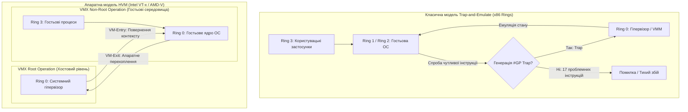
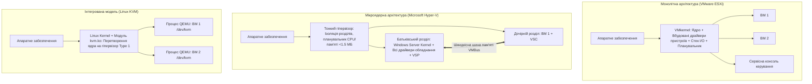
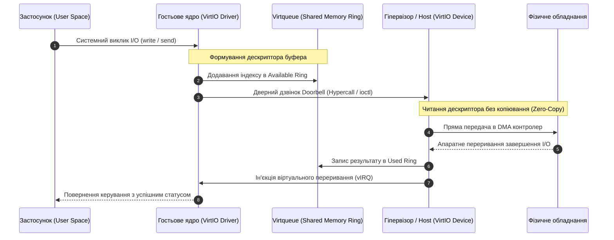
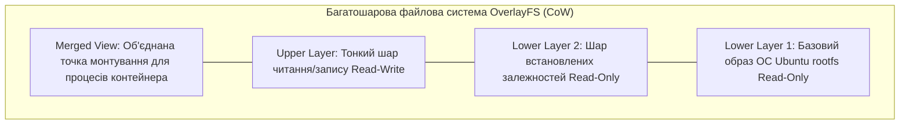
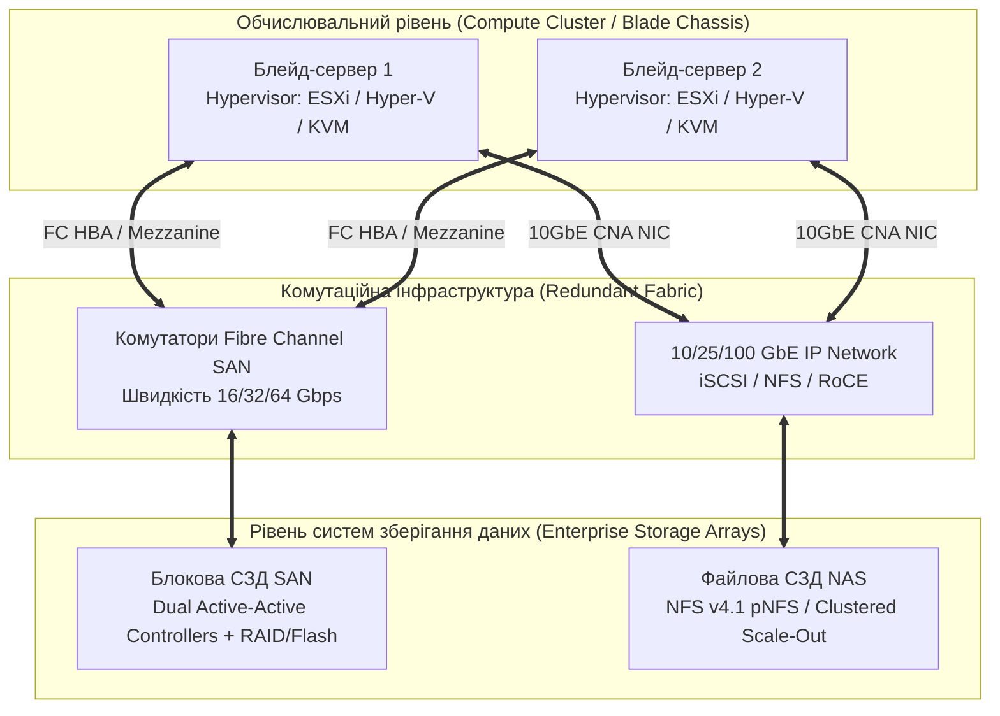

# Змістовий модуль 1. Архітектура хмарних систем, технології віртуалізації та базові сервіси IaaS/PaaS

# Тема 2. Технології віртуалізації: апаратна, паравіртуалізація та контейнеризація

---

## 2.1. Концепція віртуалізації: апаратна віртуалізація (HVM, Intel VT-x, AMD-V) та емуляція інструкцій x86/x64

### Основний зміст та теоретичний базис

Фундаментом сучасних хмарних обчислень та системної інженерії центрів обробки даних є **віртуалізація** — технологія логічного абстрагування обчислювальних, дискових та мережевих ресурсів від їхньої фізичної апаратної реалізації. У широкому системному розумінні віртуалізація забезпечує створення ізольованого програмного середовища, яке функціонує подібно до автономного фізичного комп'ютера та повністю відтворює або адаптує інтерфейси взаємодії між операційною системою і апаратним забезпеченням (**Hardware-Software Interface**). Головною метою віртуалізації є подолання обмежень статичної прив'язки програмного стека до конкретного фізичного сервера, підвищення коефіцієнта утилізації обладнання, забезпечення динамічного перерозподілу навантаження та гарантування суворої просторової й часової ізоляції паралельно виконуваних задач.

Теоретичні засади класичної віртуалізації сформульовані Джеральдом Попеком та Робертом Голдбергом у 1974 році у вигляді фундаментальної теореми віртуалізовності комп'ютерних архітектур. Відповідно до **критеріїв Попека — Голдберга**, довільна апаратна архітектура вважається повноцінно віртуалізовною тоді й лише тоді, коли множина всіх її **чутливих інструкцій (sensitive instructions)** є строгою підмножиною **привілейованих інструкцій (privileged instructions)**:

$$I_{\text{sensitive}} \subseteq I_{\text{privileged}}$$

Чутливими вважаються інструкції, які змінюють конфігурацію апаратних ресурсів (наприклад, перемикання таблиць сторінок пам'яті, зміна регістрів керування процесором, обробка переривань), а також інструкції, результат виконання яких безпосередньо залежить від рівня привілеїв процесора. Привілейованими є інструкції, виконання яких у непривілейованому режимі автоматично викликає апаратне виключення захисту (**trap / General Protection Fault `#GP`**) та передає керування обробнику операційної системи або монітора віртуальних машин (**Virtual Machine Monitor, VMM / гіпервізора**). Якщо зазначена умова виконується, гіпервізор реалізує класичну модель **«перехоплення та емуляції» (Trap-and-Emulate)**: гостьова операційна система виконується в непривілейованому режимі, а будь-яка спроба виконати критичну дію перехоплюється гіпервізором і безпечно емулюється у віртуальному контексті без порушення стабільності хостової системи.

*Рисунок 2.1 — Порівняння архітектури кілець захисту x86 та двовимірного простору привілеїв VMX у HVM*

Архітектура процесорів сімейства x86 (IA-32) від моменту свого створення не задовольняла теорему Попека — Голдберга. В архітектурі x86 визначено чотири ієрархічні кільця захисту: від Ring 0 (найвищий рівень привілеїв, рівень ядра ОС) до Ring 3 (найнижчий рівень, простір користувацьких програм). Проблема полягала в наявності **17 критичних інструкцій**, які були чутливими, але непривілейованими. До цієї групи належали інструкції маніпуляції з прапорцями стану та переривань (наприклад, `POPF`, `PUSHF`), зчитування та запису критичних регістрів керування дескрипторними таблицями (`SGDT`, `SIDT`, `SLDT`, `SMSW`), перевірки прав доступу до сегментів (`LAR`, `LSL`, `VERR`, `VERW`), а також низка інструкцій непрямого переходу та керування пам'яттю.

Головна небезпека цих інструкцій полягала в тому, що при виконанні в непривілейованому кільці (наприклад, Ring 1, куди VMM поміщав гостьове ядро) вони не генерували апаратного переривання `#GP`. Зокрема, інструкція `POPF` при спробі змінити біт дозволу переривань `IF` у кільці Ring 1 просто ігнорувала модифікацію цього біта без виклику виключення, що призводило до розсинхронізації стану віртуального процесора і тихого збою логіки операційної системи. Інструкції типу `SGDT` повертали реальну адресу базової таблиці дескрипторів фізичного процесора замість віртуалізованої, порушуючи принцип ізоляції.

Для подолання цієї фундаментальної проблеми наприкінці 1990-х років компанією VMware було розроблено технологію **динамічної двійкової трансляції (Binary Translation, BT)**. Сутність цього методу полягала в тому, що гіпервізор перехоплював двійковий потік інструкцій гостьової ОС безпосередньо перед його виконанням, аналізував базові блоки коду на наявність проблемних інструкцій і динамічно замінював їх безпечними послідовностями викликів власного коду емуляції (**VMM callbacks**), зберігаючи перетворені блоки у спеціальному кеші трансляцій (**Trace Cache**). Нечутливі інструкції виконувалися безпосередньо на фізичному процесорі з нативною швидкістю.

Радикальним розв'язанням проблеми стало впровадження технологій **повної апаратної віртуалізації (Hardware-Assisted Virtualization / HVM)** — технологій **Intel VT-x** (2005 рік) та **AMD-V** (2006 рік). Провідні виробники процесорів розширили систему команд архітектур x86 та x86-64 новим апаратним виміром режимів функціонування. Простір виконання процесора було розділено на два паралельні режими:

1. **Режим VMX Root Operation.** У цьому режимі функціонує сам гіпервізор, маючи повний безконтрольний доступ до фізичних ресурсів комп'ютера та зберігаючи класичну систему кілець захисту Ring 0–3.
2. **Режим VMX Non-Root Operation.** У цьому режимі виконується гостьова операційна система та її прикладні процеси. При цьому гостьове ядро виконується на нативному рівні Ring 0 (Non-Root), а користувацькі програми — в Ring 3 (Non-Root).

Взаємодія між режимами суворо контролюється процесором за допомогою спеціалізованої структури даних — **Керуючої структури віртуальної машини (Virtual Machine Control Structure, VMCS)** в архітектурі Intel VT-x або **Керуючого блоку віртуальної машини (Virtual Machine Control Block, VMCB)** в архітектурі AMD-V. Структура VMCS розміщується у фізичній пам'яті (обсягом 4 КБ на кожен логічний процесор) і структурно містить шість функціональних логічних зон:

* **Область стану гостя (Guest-State Area).** Зберігає повний стан регістрів процесора гостьової системи (регістри загального призначення, сегментні регістри, регістри керування `CR0`, `CR3`, `CR4`, покажчик інструкцій `RIP`, регістр прапорців `RFLAGS`), який завантажується під час передачі керування у віртуальну машину.
* **Область стану хоста (Host-State Area).** Фіксує апаратний контекст гіпервізора, необхідний для миттєвого відновлення його роботи після завершення гостьового сеансу.
* **Поля керування виконанням віртуального процесора (VM-Execution Control Fields).** Визначають бітові маски та умови, за яких певні операції, звернення до портів вводу/виводу, читання/запис системних регістрів або виникнення переривань повинні примусово зупиняти роботу гостьової ОС.
* **Поля керування переходами (VM-Exit & VM-Entry Controls).** Регламентують поведінку процесора під час переходів між контекстами (перемикання розрядності процесора 32/64 біти, збереження специфічних MSR-регістрів).
* **Область інформації про причину виходу (VM-Exit Information Fields).** Забезпечує детальну діагностику події, що спричинила перехоплення (код інструкції, зміщення пам'яті, тип переривання).

Перехід від гіпервізора до виконання коду гостьової системи ініціюється інструкцією `VMLAUNCH` (первинний старт) або `VMRESUME` (продовження роботи) і називається операцією **VM-Entry**. Коли гостьова ОС намагається виконати критичну дію, заборонену бітовими масками VMCS, процесор апаратно зупиняє виконання коду, зберігає стан віртуального процесора в Guest-State Area, завантажує стан гіпервізора з Host-State Area і передає керування в точку входу VMM. Цей зворотний перехід називається подією **VM-Exit**.

Поряд із процесорною віртуалізацією критичним фактором продуктивності є двовимірна трансляція адрес віртуальної пам'яті. У перших версіях HVM використовувалася програмна концепція тіньових таблиць сторінок (**Shadow Page Tables, SPT**), за якої гіпервізор вручну синхронізував таблиці трансляції віртуальних адрес гостьової ОС (Guest Virtual Address, GVA) у фізичні адреси хоста (Host Physical Address, HPA), що генерувало колосальну кількість важких переходів VM-Exit на кожну модифікацію сторінок пам'яті. 

Проблему усунуло створення технології апаратної трансляції сторінок другого рівня (**Second Level Address Translation, SLAT**), відомої як **Extended Page Tables (EPT)** у процесорах Intel та **Nested Page Tables (NPT / RVI)** у процесорах AMD. Блок керування пам'яттю процесора (MMU) отримав здатність апаратно виконувати двокрокове перетворення за єдиний прохід: 

$$\text{GVA} \xrightarrow{\text{CR3 гостя}} \text{GPA} \xrightarrow{\text{EPT Pointer (EPTP)}} \text{HPA}$$

де $\text{GVA}$ — гостьова віртуальна адреса, $\text{GPA}$ — гостьова фізична адреса (проміжний абстрактний рівень пам'яті), $\text{HPA}$ — реальна фізична адреса комірки пам'яті в модулях ОЗП хостового сервера.

Сумарний час виконання операцій у системі з апаратною віртуалізацією $T_{\text{exec}}$ математично моделюється залежністю:

$$T_{\text{exec}} = T_{\text{native}} + \sum_{k=1}^{N_{\text{exit}}} \left( t_{\text{save}} + t_{\text{vmm\_handle}}(k) + t_{\text{restore}} \right) + N_{\text{access}} \cdot (L_{\text{slat}} - L_{\text{native}})$$

де $T_{\text{native}}$ — номінальний час виконання коду процесором без перехоплень, $N_{\text{exit}}$ — сумарна кількість апаратних переходів VM-Exit за період розрахунку, $t_{\text{save}}$ та $t_{\text{restore}}$ — апаратні затримки збереження та відновлення контекстів VMCS у тактах процесора, $t_{\text{vmm\_handle}}(k)$ — час обробки $k$-ї причини виходу програмним кодом гіпервізора, $N_{\text{access}}$ — кількість трансляцій адрес пам'яті, $L_{\text{slat}}$ та $L_{\text{native}}$ — латентність доступу до пам'яті при двокроковому обході EPT та класичному однорівневому обході MMU відповідно.

*Таблиця 2.1 — Систематизація методів реалізації процесорної віртуалізації архітектури x86/x64*

| Критерій порівняння | Двійкова трансляція (Binary Translation) | Паравіртуалізація (Paravirtualization) | Апаратна віртуалізація (HVM / Intel VT-x) |
| :--- | :--- | :--- | :--- |
| **Модифікація гостьового ядра** | Не потрібна (запуск немодифікованих ОС) | Обов'язкова (заміна інструкцій гіпервикликами) | Не потрібна (повна підтримка стандартних ОС) |
| **Механізм ізоляції привілеїв** | Ring 0 — VMM, Ring 1 — Гостьова ОС, Ring 3 — Застосунки | Ring 0 — Гіпервізор, Ring 1 — Гостьова ОС | VMX Root / Non-Root простір, нативні кільця 0–3 |
| **Трансляція чутливих команд** | Динамічний аналіз та ін'єкція VMM callbacks | Прямі виклики Hypercalls через програмні API | Апаратне генерування події VM-Exit за VMCS |
| **Продуктивність обчислень ЦП** | Середня (високі накладні витрати на емуляцію) | Дуже висока (наближена до нативної) | Висока (з накладними витратами на цикли VM-Exit) |
| **Складність архітектури VMM** | Надзвичайно висока (декодер двійкового коду) | Середня (VMM є відносно компактним) | Спирається на мікрокод апаратного забезпечення |

Дані таблиці 2.1 демонструють еволюційний перехід від складних програмних трансляторів до високоефективної апаратної підтримки, яка стала стандартом де-факто для хмарних інфраструктур підприємств та академічних дата-центрів.

---

## 2.2. Класифікація гіпервізорів (Type 1 Bare-Metal vs Type 2 Hosted). Монолітна архітектура (VMware ESXi, KVM) проти мікроядерної (Microsoft Hyper-V)

### Основний зміст та теоретичний базис

Центральним компонентом будь-якої віртуалізованої комп'ютерної системи є **гіпервізор** (монітор віртуальних машин). У комп'ютерній інженерії загальноприйнятою є класифікація гіпервізорів за рівнем їхнього розміщення у системному стеку, запропонована Робертом Голдбергом, яка поділяє всі рішення на два базові класи:

1. **Гіпервізори типу 1 (Type 1, Bare-Metal / автономні).** Такі гіпервізори встановлюються та виконуються безпосередньо на голому апаратному забезпеченні (**bare metal**) фізичного сервера. Вони мають прямий монопольний доступ до процесорів, пам'яті та пристроїв вводу/виводу, виступаючи одночасно спеціалізованою операційною системою низького рівня. Гіпервізори типу 1 забезпечують найвищий рівень продуктивності, мінімальні накладні витрати, максимальну безпеку та використовуються у високопродуктивних обчисленнях і комерційних хмарних ЦОД (VMware ESXi, Microsoft Hyper-V Server, KVM, Xen).
2. **Гіпервізори типу 2 (Type 2, Hosted / хостові).** Такі гіпервізори функціонують як прикладні процеси поверх стандартної хостової операційної системи загального призначення (Windows, Linux, macOS). Доступ до фізичного обладнання здійснюється опосередковано через системні виклики та стек драйверів хостової ОС. Хоча така модель є зручною для розробки, налагодження програмного забезпечення та тестування на робочих станціях користувачів (VMware Workstation, Oracle VirtualBox, Parallels Desktop), подвійна диспетчеризація ресурсів і залежність від стабільності хостової ОС роблять її непридатною для масштабних хмарних інфраструктур.

*Рисунок 2.2 — Порівняльний аналіз внутрішньої архітектури сучасних гіпервізорів першого типу*

Серед промислових гіпервізорів типу 1 ключова архітектурна відмінність полягає в принципах розміщення коду драйверів периферійних пристроїв та механізмах обробки операцій вводу/виводу. За цим критерієм виділяють дві фундаментальні архітектурні моделі: **монолітну** та **мікроядерну**.

**Монолітна архітектура (на прикладі VMware ESXi).**
У монолітній моделі всі основні компоненти — ядро гіпервізора (**VMkernel**), планувальники процесорного часу та пам'яті, мережевий стек, стек дискового вводу/виводу, а також драйвери всього фізичного обладнання — функціонують в єдиному адресному просторі привілейованого рівня. Гостьові операційні системи працюють у віртуальних машинах поверх VMkernel. 

Перевагою монолітного підходу є виняткова швидкодія операцій вводу/виводу завдяки відсутності додаткових міжконтекстних перемикань при зверненні до драйверів. 

Водночас монолітна архітектура має вагомі системні недоліки:
* Збільшений розмір довіреної бази обчислень (**Trusted Computing Base, TCB**), оскільки будь-яка критична помилка в коді стороннього драйвера мережевої плати або RAID-контролера може скомпрометувати безпеку та призвести до аварійної зупинки всього гіпервізора.
* Жорсткі вимоги до сумісності апаратного забезпечення (**Hardware Compatibility List, HCL**), що унеможливлює використання обладнання, для якого виробник не надав спеціалізованого сертифікованого драйвера під дане ядро гіпервізора.

**Мікроядерна архітектура (на прикладі Microsoft Hyper-V).**
Мікроядерний підхід базується на граничній мінімізації коду, що виконується на рівні ядра гіпервізора. Гіпервізор Hyper-V являє собою надзвичайно тонкий програмний прошарок (розміром менше ніж 1,5 МБ, який здатний розміститися на стандартному гнучкому диску), який відповідає виключно за базові завдання: просторову ізоляцію розділів (**Partitions**), розподіл процесорного часу та керування пам'яттю за допомогою блоку MMU. Гіпервізор Hyper-V взагалі не містить у своєму складі драйверів пристроїв вводу/виводу.

При старті системи гіпервізор ініціалізує та запускає перший, так званий **батьківський розділ (Parent Partition)**, під керуванням 64-розрядної операційної системи Windows Server. Саме батьківський розділ володіє всіма апаратними ресурсами, керує живленням, завантаженням гіпервізора, виявленням пристроїв за стандартом Plug-and-Play та містить повний стек рідних виробничих драйверів обладнання. Усі інші віртуальні машини функціонують у **дочірніх розділах (Child Partitions)**. 

Взаємодія між розділами реалізується за допомогою високошвидкісної віртуальної шини зв'язку **VMBus**, розміщеної у спільній оперативній пам'яті. У батьківському розділі розгортаються провайдери віртуальних служб (**Virtual Service Providers, VSP**), які транслюють запити до реальних драйверів обладнання, а в дочірніх розділах гостьових ОС функціонують клієнти віртуальних служб (**Virtual Service Clients, VSC**). 

Мікроядерний підхід забезпечує колосальну стабільність і безпеку: збій або аварійне завершення роботи драйвера пристрою не порушує цілісності гіпервізора, а драйверна база охоплює абсолютно все обладнання, сумісне з ОС Windows Server. Незначним компромісом є вищі накладні витрати на взаємодію між розділами через VMBus у порівнянні з монолітним кодом.

**Архітектура KVM (Kernel-based Virtual Machine).**
Окреме місце в класифікації посідає технологія KVM, інтегрована в основну гілку ядра Linux починаючи з версії 2.6.20. Завдяки завантаженню модуля ядра `kvm.ko` (та апаратних модулів `kvm-intel.ko` чи `kvm-amd.ko`), стандартне ядро Linux отримує функціонал повноцінного гіпервізора типу 1. Кожна віртуальна машина в KVM є звичайним системним процесом операційної системи Linux, який керується стандартним планувальником задач ядра (**Completely Fair Scheduler, CFS**) та виділяє пам'ять через штатну підсистему пам'яті. 

Емуляція непривілейованих пристроїв введення/виведення, керування конфігурацією та взаємодія з користувачем забезпечуються у просторі користувача процесом **QEMU**, який відкриває та взаємодіє з символьним пристроєм `/dev/kvm` через системний виклик `ioctl()`.

Латентність перемикання контексту віртуального процесора $L_{\text{switch}}$ при обробці переривання гіпервізором розраховується за формулою:

$$L_{\text{switch}} = \tau_{\text{save\_regs}} + \tau_{\text{TLB\_inv}} + \tau_{\text{SLAT\_walk}} + \tau_{\text{VCPU\_sched}} + \tau_{\text{driver\_pipe}}$$

де $\tau_{\text{save\_regs}}$ — час збереження стану регістрів процесора (у наносекундах), $\tau_{\text{TLB\_inv}}$ — затримка інвалідації або перемикання тегів буфера асоціативної трансляції (TLB / PCID), $\tau_{\text{SLAT\_walk}}$ — затримка перерахунку таблиць сторінок другого рівня, $\tau_{\text{VCPU\_sched}}$ — тривалість прийняття рішення планувальником гіпервізора про переключення кванту часу віртуального процесора, $\tau_{\text{driver\_pipe}}$ — затримка проходження запиту крізь конвеєр драйвера (у монолітній моделі $\tau_{\text{driver\_pipe}} \to 0$, у мікроядерній моделі $\tau_{\text{driver\_pipe}}$ дорівнює затримці черги VMBus).

*Таблиця 2.2 — Порівняльно-технічна характеристика провідних серверних платформ віртуалізації*

| Технічна характеристика | VMware ESXi | Microsoft Hyper-V | Linux KVM | Oracle VirtualBox |
| :--- | :--- | :--- | :--- | :--- |
| **Тип гіпервізора за Голдбергом** | Тип 1 (Bare-Metal) | Тип 1 (Bare-Metal) | Тип 1 (Kernel-Integrated) | Тип 2 (Hosted) |
| **Архітектурна модель** | Монолітна (VMkernel) | Мікроядерна (VMBus) | Модульна (Ядро Linux + QEMU) | Хостова (Hosted VMM) |
| **Розмір кодової бази ядра** | ~150–200 МБ | < 1,5 МБ (ядро гіпервізора) | ~30–50 МБ (базове ядро) | Залежить від хостової ОС |
| **Керування пам'яттю** | Memory Ballooning, Transparent Page Sharing (TPS) | Dynamic Memory, Memory Ballooning | KSM (Kernel Samepage Merging), Ballooning | Базовий розподіл пам'яті хостової ОС |
| **Драйверна сумісність** | Суворо обмежена (спеціальні VIB-пакети) | Широка (будь-які драйвери Windows Server) | Необмежена (вся відкрита база ядра Linux) | Усі драйвери, підтримувані хостовою ОС |
| **Цільове призначення** | Великі корпоративні ЦОД, хмари vSphere | Корпоративні інфраструктури Windows, Azure | Публічні хмари (AWS, GCP, OpenStack), HPC | Розробка, тестування на робочих станціях |

Аналізуючи дані таблиці 2.2, можна зробити висновок, що вибір архітектури гіпервізора визначається балансом між вимогами до апаратної гнучкості, мінімізації поверхні кібератак (TCB) та наявної екосистеми управління в інфраструктурі підприємства.

---

## 2.3. Паравіртуалізація (Xen, VirtIO) та віртуалізація рівня ядра (LXC, cgroups, namespaces, Docker-контейнери)

### Основний зміст та теоретичний базис

Альтернативним підходом до подолання архітектурних обмежень x86 без використання двійкової трансляції стала **паравіртуалізація (Paravirtualization, PV)**, запропонована на початку 2000-х років дослідниками Кембриджського університету в проєкті **Xen** (під керівництвом Іана Пратта). Концепція паравіртуалізації передбачає свідому модифікацію вихідного коду ядра гостьової операційної системи. 

Усі критичні інструкції, які вимагають взаємодії з апаратурою або привілейованих прав, замінюються спеціалізованими програмними системними викликами до гіпервізора — **гіпервикликами (Hypercalls)**, аналогічно до того, як користувацькі процеси звертаються до ядра ОС за допомогою системних викликів `syscall`. Гостьова операційна система «усвідомлює», що функціонує у віртуалізованому середовищі, і співпрацює з гіпервізором.

*Рисунок 2.3 — Діаграма послідовності асинхронного обміну даними через кільцеві буфери Virtqueue стандарту VirtIO*

Архітектура гіпервізора Xen формується трьома основними структурними рівнями: власне мікроядерним гіпервізором **Xen Core**, головним привілейованим доменом **Domain 0 (Dom0)** та непривілейованими гостьовими доменами **Domain U (DomU)**. Гіпервізор Xen ініціалізується першим і повністю бере на себе низькорівневе керування процесорами та розподілом сторінок оперативної пам'яті. Домен Dom0 є модифікованим середовищем Linux, володіє винятковими правами доступу до апаратних пристроїв, містить реальні драйвери фізичного обладнання та реалізує інтерфейси керування інфраструктурою. Домени DomU не мають прямого доступу до фізичних шин серверу; для виконання операцій вводу/виводу вони взаємодіють з бекенд-драйверами Dom0 за допомогою механізму розподіленої пам'яті (**Grant Tables**) та механізму передачі асинхронних подій (**Event Channels**), що замінюють класичні апаратні переривання.

Надзвичайно важливим етапом уніфікації та оптимізації операцій вводу/виводу для віртуалізованих систем стала розробка відкритого стандарту **VirtIO (Virtual I/O)**, створеного Расті Расселом. До появи VirtIO кожен гіпервізор емулював застарілі та надзвичайно повільні моделі реальних контролерів (наприклад, мережеву карту Realtek RTL8139 або IDE-контролер Intel PIIX4), що спричиняло колосальні накладні витрати на емуляцію кожного циклу шини PCI та побайтову обробку регістрів. Стандарт VirtIO запропонував абстрактну шину віртуальних пристроїв та уніфікований набір паравіртуалізованих драйверів для гостьових ОС (драйвери `virtio-net` для мережі, `virtio-blk` та `virtio-scsi` для блокових дисків, `virtio-balloon` для динамічного повернення невикористаної пам'яті, `virtio-serial`).

В основі високої продуктивності VirtIO лежить структура даних **Virtqueue** — спеціалізована черга на базі кільцевих буферів (**vring**), розміщена у спільній оперативній пам'яті, доступній одночасно як гостьовому драйверу, так і гіпервізору. Структура Virtqueue складається з трьох ключових елементів:
* **Таблиця дескрипторів (Descriptor Table).** Масив структур, що містять гостьові фізичні адреси (GPA), довжину буферів даних та бітові прапорці (напрямок передачі, наявність зв'язаних дескрипторів).
* **Кільце доступних буферів (Available Ring).** Кільцевий масив індексів дескрипторів, які гостьовий драйвер заповнив даними та підготував для обробки стороною хоста.
* **Кільце використаних буферів (Used Ring).** Кільцевий масив, куди гіпервізор повертає оброблені дескриптори, сигналізуючи про завершення передачі чи читання інформації.

Для повідомлення хоста про появу нових даних гостьовий драйвер використовує механізм сигналізації «дверного дзвінка» (**doorbell**, реалізований як запис у виділений регістр або гіпервиклик), а гіпервізор сповіщає гостя про завершення за допомогою ін'єкції віртуального переривання (vIRQ). Завдяки технології нульового копіювання (**Zero-Copy**) та пакетній обробці буферів, VirtIO забезпечує пропускну здатність мережевих інтерфейсів понад 40–100 Гбіт/с із мінімальним навантаженням на центральний процесор.

Якісно іншою парадигмою абстрагування є **віртуалізація рівня операційної системи (контейнеризація)**. На відміну від апаратної віртуалізації та паравіртуалізації, де для кожної віртуальної машини запускається окремий повний екземпляр ядра гостьової операційної системи, контейнеризація базується на спільному використанні єдиного ядра хостової ОС усіма ізольованими сутностями — **контейнерами**. 

Контейнеризація в операційних системах сімейства Linux реалізується завдяки синергії двох фундаментальних механізмів ядра:

**1. Простори імен (Namespaces).** 
Механізм просторів імен забезпечує логічну ізоляцію системних ресурсів, створюючи для процесів усередині контейнера ілюзію володіння персональною, незалежною операційною системою. 

Ядро Linux підтримує вісім фундаментальних типів просторів імен:
* `PID Namespace` (ізоляція простору ідентифікаторів процесів, процес у контейнері отримує PID 1, будучи кореневим ініціалізатором, тоді як на хості він має звичайний глобальний PID).
* `NET Namespace` (ізоляція мережевого стека, включно з персональними таблицями маршрутизації, правилами iptables/nftables, сокетами та віртуальними мережевими інтерфейсами `veth`).
* `MNT Namespace` (ізоляція точок монтування файлових систем, що дозволяє контейнеру мати персональну кореневу файлову систему `rootfs` без доступу до дисків хоста).
* `IPC Namespace` (ізоляція засобів міжпроцесорної взаємодії, черг повідомлень POSIX/SysV та сегментів спільної пам'яті).
* `UTS Namespace` (ізоляція системних імен хоста `hostname` та доменних імен `NIS domain name`).
* `USER Namespace` (ізоляція ідентифікаторів користувачів і груп, що дозволяє процесу мати права `root` (UID 0) всередині контейнера, залишаючись непривілейованим користувачем (наприклад, UID 10001) на рівні хостової системи).
* `CGROUP Namespace` (ізоляція відображення кореневої структури контрольних груп).
* `Time Namespace` (ізоляція системних монотонних та завантажувальних таймерів).

**2. Контрольні групи (Control Groups, cgroups v1 / cgroups v2).** 
Якщо простори імен ізолюють те, що процес може *бачити*, то контрольні групи жорстко обмежують та вимірюють те, які обсяги ресурсів процес може *споживати*. Механізм cgroups організує процеси в ієрархічні структури та за допомогою підсистем-контролерів забезпечує:
* Керування процесорними ресурсами через параметри `cpu.cfs_quota_us` (квота часу виконання за період) та `cpu.cfs_period_us` (базовий період квантування) у планувальнику CFS, або через вагові частки `cpu.shares`.
* Обмеження оперативної пам'яті (`memory.max`, `memory.high`), запобігаючи вичерпанню пам'яті сервера через запуск механізму OOM-Killer (**Out-Of-Memory Killer**) виключно для контейнера-порушника.
* Регулювання операцій дискового вводу/виводу (`io.weight`, `io.max`) для обмеження максимального числа IOPS або байтів за секунду.
* Обмеження максимальної кількості одночасно створених процесів (`pids.max`), що захищає хост від атак типу «fork-bomb».

Файлова система контейнерів базується на технології багатошарових уніфікованих файлових систем (**Union File Systems**, сучасний стандарт — **OverlayFS**). Образ контейнера складається з набору незмінних шарів, доступних лише для читання (**Read-Only Lower Layers**). При запуску контейнера поверх цих шарів монтується тонкий робочий шар запису (**Read-Write Upper Layer**). 

Модифікація будь-якого файлу реалізується за алгоритмом **копіювання при записі (Copy-on-Write, CoW)**: вихідний файл зчитується з нижнього шару, копіюється у верхній шар запису і модифікується там, залишаючи базовий шар незмінним, що дозволяє тисячам контейнерів спільно використовувати спільний базовий образ без додаткових витрат дискового простору.

*Рисунок 2.4 — Структура багатошарової файлової системи OverlayFS з механізмом Copy-on-Write*

Максимальна щільність розміщення віртуальних машин $\rho_{\text{VM}}$ та контейнерів $\rho_{\text{container}}$ на одному фізичному сервері математично оцінюється співвідношеннями:

$$\rho_{\text{VM}} = \min \left( \left\lfloor \frac{C_{\text{host}} \cdot \kappa_c}{c_{\text{VM}}} \right\rfloor, \left\lfloor \frac{M_{\text{host}} - M_{\text{hyp}}}{M_{\text{G-OS}} + M_{\text{app}}} \right\rfloor \right)$$

$$\rho_{\text{container}} = \min \left( \left\lfloor \frac{C_{\text{host}} \cdot \kappa_c}{c_{\text{cont}}} \right\rfloor, \left\lfloor \frac{M_{\text{host}} - M_{\text{host-OS}}}{M_{\text{runtime}} + M_{\text{app}}} \right\rfloor \right)$$

де $C_{\text{host}}$ — загальна кількість фізичних ядер процесора хоста, $\kappa_c$ — допустимий коефіцієнт перепідписки процесорів (vCPU overcommit ratio, зазвичай $\kappa_c \approx 2 \dots 4$ для VM та $\kappa_c \approx 5 \dots 10$ для контейнерів), $c_{\text{VM}}$ та $c_{\text{cont}}$ — номінальні вимоги до ядер окремої сутності, $M_{\text{host}}$ — загальний обсяг фізичної пам'яті хоста (в гігабайтах), $M_{\text{hyp}}$ та $M_{\text{host-OS}}$ — пам'ять, зарезервована для гіпервізора та хостової ОС, $M_{\text{G-OS}}$ — постійні накладні витрати оперативної пам'яті на завантаження ядра гостьової ОС (512–2048 МБ на кожну ВМ), $M_{\text{runtime}}$ — мінімальний оверхед середовища виконання контейнера (20–50 МБ), $M_{\text{app}}$ — пам'ять, необхідна безпосередньо для функціонування коду прикладного застосунку.

*Таблиця 2.3 — Комплексний порівняльний аналіз технологій системної віртуалізації та контейнеризації*

| Параметр порівняння | Повна апаратна віртуалізація (HVM) | Паравіртуалізація (Xen PV) | Контейнеризація (LXC / Docker) |
| :--- | :--- | :--- | :--- |
| **Рівень ізоляції** | Апаратний (VMCS/VMCB, окремий vCPU/MMU) | Програмно-апаратний (Hypercalls) | Логічний рівень ядра ОС (Namespaces, cgroups) |
| **Ядро операційної системи** | Повністю незалежне власне гостьове ядро | Модифіковане під гіпервізор гостьове ядро | Спільне ядро хостової операційної системи |
| **Час завантаження інстансу** | Десятки секунд — хвилини (холодний бут) | 10–30 секунд | Мілісекунди — одиниці секунд (старт процесу) |
| **Накладні витрати пам'яті** | Високі (дублювання ядер ОС у кожній ВМ) | Помірні | Мінімальні (виключно пам'ять процесу та CoW) |
| **Гетерогенність систем** | Запуск довільних ОС (Windows на Linux-хості) | Лише ОС, адаптовані до архітектури | Тільки дистрибутиви, сумісні з ядром хоста |
| **Продуктивність I/O** | 85–95% від нативної (залежить від VirtIO) | 90–98% від нативної | 99–100% (пряме виконання в ядрі хоста) |

---

## 2.4. Мережеві системи зберігання даних (СЗД) у віртуалізації: Fibre Channel SAN, iSCSI, NFS, блейд-системи та конвергентна інфраструктура

### Основний зміст та теоретичний базис

Експлуатація високопродуктивних кластерів віртуалізації та надання сервісів у хмарних середовищах неможливі без використання централізованих **систем зберігання даних (СЗД)**. У традиційній схемі із локальними дисками всередині кожного сервера поломка фізичного вузла призводить до недоступності всіх розгорнутих на ньому віртуальних машин, а динамічне переміщення обчислювальних задач вимагає тривалого копіювання повних образів дисків по локальній мережі. 

Відокремлення обчислювальних вузлів (Compute Nodes) від дискових ресурсів і перехід до зовнішніх СЗД забезпечує реалізацію критично важливих функцій хмари:
* **Миттєва міграція віртуальних машин у гарячому режимі (Live Migration / VMware vMotion).** Процес перенесення активного стану пам'яті та регістрів процесора ВМ з одного фізичного хоста на інший без переривання обслуговування користувачів, оскільки образ диска залишається нерухомим на спільній СЗД.
* **Автоматичне відновлення після збоїв (High Availability, HA).** У разі раптової фізичної відмови сервера інші вузли кластера негайно монтують диски віртуальних машин зі спільного сховища та перезапускають їх за лічені секунди.
* **Динамічне балансування навантаження (Distributed Resource Scheduler, DRS).** Автоматичний перерозподіл віртуальних машин між вузлами кластера відповідно до поточної утилізації CPU та RAM.

За принципом організації доступу до інформації всі мережеві сховища поділяються на дві фундаментальні категорії: мережі зберігання даних блокового рівня (**Storage Area Network, SAN**) та мережеві сховища файлового рівня (**Network Attached Storage, NAS**).

*Рисунок 2.5 — Архітектура підключення обчислювального кластера до блокових (SAN) та файлових (NAS) СЗД*

**1. Мережі зберігання даних на основі Fibre Channel (FC SAN).**
Fibre Channel — це спеціалізована високошвидкісна архітектура побудови мереж передачі даних на блоковому рівні, яка використовує виділені волоконно-оптичні або коаксіальні канали зв'язку. Протокол FC стандартизований комітетом ANSI T11 і функціонує на швидкостях 8, 16, 32, 64 та 128 Гбіт/с. Fibre Channel транспортує команди SCSI (**SCSI Command Descriptor Blocks, CDB**) безпосередньо поверх власного багаторівневого протокольного стека (рівні FC-0 — FC-4), що забезпечує апаратну доставку кадрів без втрат (**lossless transport**) завдяки вбудованому механізму буферного кредитування (**Buffer-to-Buffer Credits, BB_Credit**).

Кожен пристрій у мережі FC ідентифікується глобально унікальним 64-бітним ідентифікатором — **World Wide Name (WWN)**, який поділяється на ім'я вузла (**World Wide Node Name, WWNN**) та ім'я конкретного оптичного порту адаптера (**World Wide Port Name, WWPN**). Підключення серверів до комутаторів FC здійснюється за допомогою спеціалізованих плат розширення — хост-адаптерів шини (**Host Bus Adapter, HBA**). 

Управління доступом у FC SAN базується на двох принципах:
* **Зонування (Zoning).** Логічна конфігурація на рівні комутаторів (Fabric Switches), яка ізолює порти HBA серверів та порти контролерів СЗД, забороняючи неавторизований обмін даними.
* **Маскування LUN (LUN Masking).** Налаштування на рівні контролера СЗД, яке дозволяє монтувати конкретні логічні дискові томи (**Logical Unit Numbers, LUN**) виключно визначеним WWPN-адресам серверів.

**2. Мережі зберігання даних за протоколом iSCSI (IP SAN).**
Протокол iSCSI (Internet Small Computer System Interface, RFC 3720) забезпечує передачу блокових команд SCSI шляхом їх інкапсуляції у стандартні пакети TCP/IP через звичайну мережу Ethernet (порти 3260). Це дозволяє суттєво знизити капітальні витрати, використовуючи стандартні мережеві комутатори замість дорогого обладнання Fibre Channel.

У термінології iSCSI сервер, що ініціює запит на читання чи запис, називається **ініціатором (iSCSI Initiator)**, а масив зберігання — **цільовим вузлом (iSCSI Target)**. Ідентифікація пристроїв здійснюється за допомогою унікальних рядкових імен **IQN (iSCSI Qualified Name)**, наприклад, `iqn.2026-08.ua.edu.tnpu:storage.target01`. Ініціатор може бути реалізований як програмно (драйвером операційної системи або гіпервізора, що навантажує центральний процесор), так і апаратно за допомогою мережевих плат із підтримкою апаратного розвантаження протоколу TCP/IP (**TCP Offload Engine, TOE**) чи спеціалізованих iSCSI HBA. Для мінімізації затримок та накладних витрат у мережах iSCSI обов'язковим є використання збільшених кадрів Ethernet — **Jumbo Frames** (розмір MTU збільшується з 1500 до 9000 байт).

**3. Мережеві файлові системи (NFS у віртуалізації).**
NFS (Network File System) забезпечує доступ до даних на рівні файлової ієрархії через протокол RPC поверх TCP/IP. У сучасних хмарних інфраструктурах широко застосовується стандарт **NFS v4.1**, який підтримує паралельну файлову підсистему **pNFS (Parallel NFS)**. Завдяки pNFS клієнт відокремлює запити на отримання метаданих (які надсилаються на сервер метаданих MDS) від прямого паралельного обміну блоками файлів безпосередньо з багатьма вузлами зберігання даних (Data Servers), що усуває вузькі місця традиційних NAS-архітектур.

**4. Блейд-системи та модульна конвергентна архітектура.**
Збільшення щільності розміщення обчислювальних модулів у центрах обробки даних зумовило перехід від традиційних стійкових серверів форм-фактору 1U/2U до модульних **блейд-систем (Blade Servers / сервери-леза)**. Блейд-система являє собою компактне модульне шасі (висотою 3U, 6U або 10U), яке встановлюється в 19-дюймову стійку та містить набір ультратонких одноплатних комп'ютерів (лез), позбавлених індивідуальних блоків живлення, важких систем охолодження та зовнішніх кабелів комутації.

Виробники формулюють ключову перевагу блейд-систем правилом **«1-2-3-4»**: у порівнянні з класичними серверами при однаковій продуктивності блейд-системи займають у **2** рази менше місця, споживають у **3** рази менше електроенергії та знижують сукупну вартість інфраструктури в **4** рази.

Основою шасі є пасивна об'єднуюча панель (**Backplane / Midplane**), крізь яку кожне лезо підключається до загальних дубльованих модулів живлення (із резервуванням за схемою $N+N$ або $N+1$), потужних вентиляторних блоків, інтелектуальних модулів централізованого управління (iLO, iDRAC, Cisco UCS Manager), а також інтегрованих комутаторів Ethernet та Fibre Channel. На самих лезах встановлюються мезонінні плати (**Mezzanine Cards**), що забезпечують пряме підключення до внутрішніх комутаційних фабрик шасі без жодного зовнішнього кабелю.

**5. Гіперконвергентна інфраструктура (Hyperconverged Infrastructure, HCI).**
Сучасним трендом еволюції центрів обробки даних є перехід від трирівневої класичної моделі (Compute + SAN Network + External SAN Array) до **гіперконвергентної інфраструктури (HCI)**. У парадигмі HCI обчислювальні потужності та системи збереження даних об'єднуються на базі стандартних серійних серверів архітектури x86 (**Commodity Hardware**). 

Локальні високошвидкісні твердотільні накопичувачі (NVMe / SSD), встановлені в кожному сервері кластера, програмно об'єднуються розподіленою файловою системою або програмно-визначеним сховищем (**Software-Defined Storage, SDS**, наприклад, VMware vSAN, Ceph, Microsoft Storage Spaces Direct) у єдиний віртуальний розподілений пул зберігання. Відмовостійкість забезпечується синхронним тиражуванням копій блоків даних по мережі між різними фізичними вузлами кластера.

Сумарна пропускна здатність сховища даних $BW_{\text{storage}}$ та продуктивність за кількістю операцій вводу/виводу за секунду ($\text{IOPS}$) пов'язані співвідношенням:

$$BW_{\text{storage}} = \text{IOPS} \cdot \text{BlockSize}$$

де $BW_{\text{storage}}$ — сумарна швидкість передачі даних (у мегабайтах за секунду, МБ/с), $\text{IOPS}$ — кількість завершених операцій читання/запису за одну секунду, $\text{BlockSize}$ — розмір базового блоку операції вводу/виводу (у кілобайтах, наприклад, 4 КБ для баз даних або 64–256 КБ для потокового мультимедіа).

Повний час відгуку операції вводу/виводу $T_{\text{IO\_response}}$ для віртуальної машини при роботі через зовнішню мережу зберігання даних становить:

$$T_{\text{IO\_response}} = t_{\text{guest\_driver}} + t_{\text{hyp\_virtio}} + t_{\text{hba\_queue}} + t_{\text{fabric\_latency}} + t_{\text{controller\_cache}} + t_{\text{media\_access}}$$

де $t_{\text{guest\_driver}}$ — час обробки I/O запиту ядром гостьової ОС, $t_{\text{hyp\_virtio}}$ — час обробки в паравіртуалізованому кільці VirtIO/VMBus, $t_{\text{hba\_queue}}$ — час очікування в черзі апаратного адаптера хоста, $t_{\text{fabric\_latency}}$ — час транспортування пакетів крізь комутаційну фабрику (для FC $t_{\text{fabric}} \approx 0{,}01 \dots 0{,}05$ мс, для 10GbE iSCSI $t_{\text{fabric}} \approx 0{,}1 \dots 0{,}3$ мс), $t_{\text{controller\_cache}}$ — час обробки контролером СЗД та запису в дзеркальований кеш, $t_{\text{media\_access}}$ — час безпосереднього позиціонування та запису на фізичний носій (для HDD $t_{\text{media}} \approx 3 \dots 10$ мс, для enterprise NVMe SSD $t_{\text{media}} \approx 0{,}02 \dots 0{,}1$ мс).

*Таблиця 2.4 — Порівняльний аналіз протоколів та технологій підключення систем зберігання даних*

| Параметр порівняння | Fibre Channel (FC SAN) | iSCSI (IP SAN) | Network File System (NFS v4.1) | NVMe over Fabrics (NVMe-oF / RDMA) |
| :--- | :--- | :--- | :--- | :--- |
| **Рівень абстракції** | Блоковий доступ (SCSI CDBs) | Блоковий доступ (SCSI over TCP) | Файловий доступ (POSIX file operations) | Блоковий доступ (NVMe commands) |
| **Транспортне середовище** | Виділена оптика Fibre Channel | Стандартна мережа Ethernet (TCP/IP) | Стандартна мережа Ethernet (TCP/IP) | Ethernet (RoCE v2) / InfiniBand / FC |
| **Апаратне забезпечення** | Спеціалізовані FC HBA, FC-комутатори | Звичайні NIC (або TOE/iSCSI HBA) | Стандартні мережеві карти Ethernet | Мережеві карти з підтримкою RDMA (RNIC) |
| **Латентність передачі** | Вкрай низька (~10–30 мкс) | Середня (~100–300 мкс) | Середня (~150–400 мкс) | Ультранизька (~2–10 мкс) |
| **Капітальні витрати** | Високі (дороге оптичне обладнання) | Низькі (використання існуючої мережі) | Низькі (стандартна IP-інфраструктура) | Високі / Середні (вимоги до комутаторів RoCE) |
| **Складність конфігурації** | Вимагає навичок FC Zoning та LUN Masking | Проста (налаштування IP, IQN, Target) | Мінімальна (експорт каталогів `/etc/exports`) | Висока (налаштування PFC, ECN, RDMA) |

Аналіз даних таблиці 2.4 підтверджує, що в сучасних кіберфізичних та хмарних інфраструктурах спостерігається конвергенція: для класичних задач enterprise-рівня продовжує домінувати FC SAN та iSCSI, тоді як для високопродуктивних аналітичних систем та баз даних реального часу стандартом стають протоколи NVMe-oF та гіперконвергентні архітектури.

---

### Питання для самоперевірки та аналітичного осмислення

1. У чому полягає сутність теореми Попека — Голдберга щодо віртуалізовності комп'ютерних архітектур, і які саме 17 інструкцій процесора IA-32 порушували класичні критерії віртуалізації?
2. Опишіть детально механізм функціонування апаратної віртуалізації Intel VT-x. Які ролі відіграють режими VMX Root та VMX Non-Root, і які базові секції формують структуру Virtual Machine Control Structure (VMCS)?
3. Проаналізуйте принципові відмінності між монолітною архітектурою гіпервізора (VMware ESXi) та мікроядерною архітектурою (Microsoft Hyper-V). Яким чином шина VMBus забезпечує безпеку та взаємодію між розділами у Hyper-V?
4. Розкрийте внутрішню структуру черги Virtqueue стандарту VirtIO. Як організація дескрипторних таблиць та кілець Available/Used Rings дозволяє реалізувати асинхронний безапаратний ввід/вивід за технологією Zero-Copy?
5. Які фундаментальні механізми ядра Linux забезпечують ізоляцію та обмеження ресурсів у контейнерах, і чим принципово відрізняється функціонал просторів імен (Namespaces) від контрольних груп (Control Groups, cgroups v2)?
6. Поясніть алгоритм функціонування багатошарової файлової системи OverlayFS. Що відбувається на рівні дискових шарів під час модифікації існуючого конфігураційного файлу всередині працюючого контейнера за принципом Copy-on-Write?
7. Зіставте мережі зберігання даних Fibre Channel SAN та iSCSI. Які фактори спричиняють вищу затримку обробки I/O операцій у програмному iSCSI у порівнянні з апаратним Fibre Channel, і як налаштування Jumbo Frames впливає на продуктивність IP SAN?