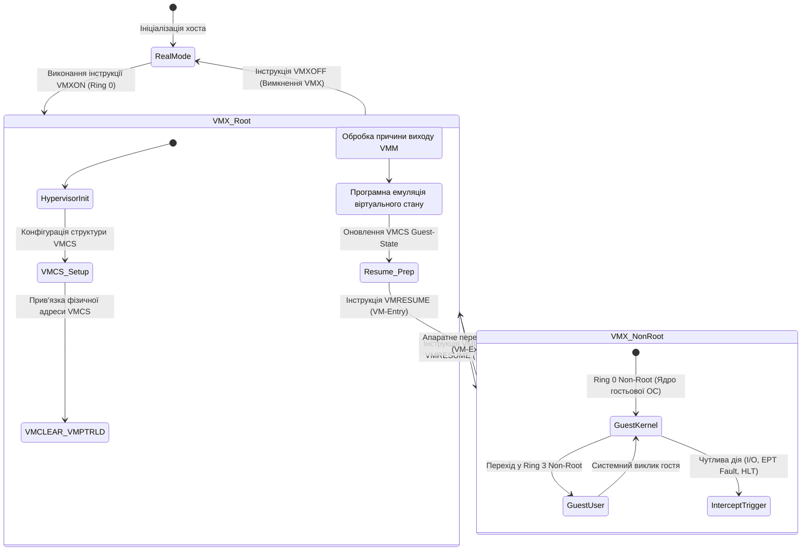
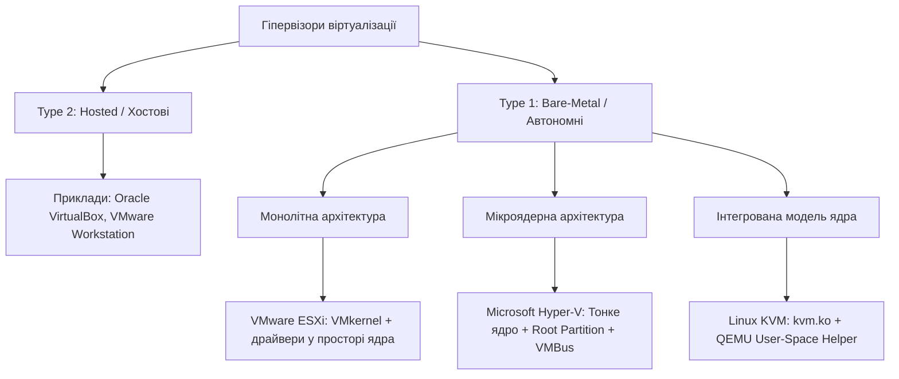
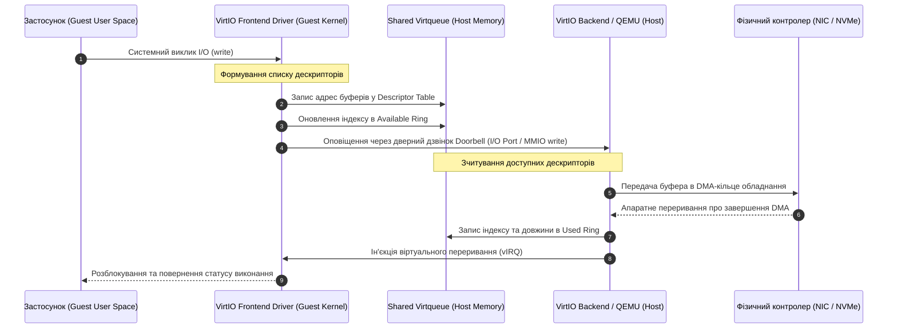
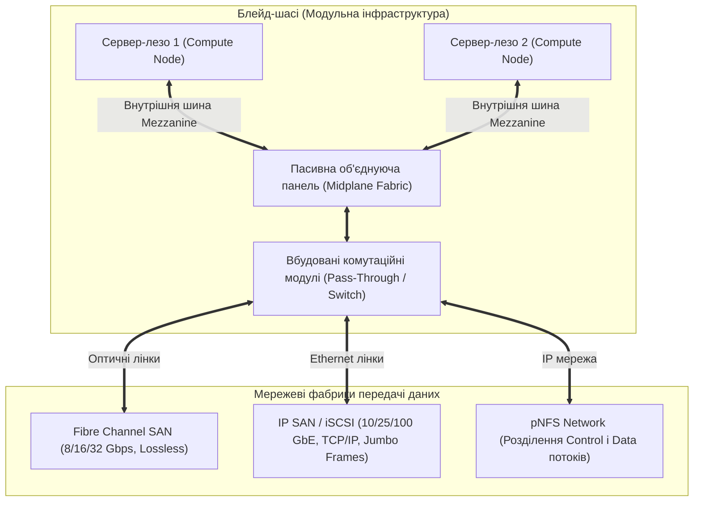
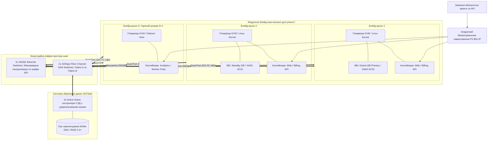

# Тема 2. Технології системної віртуалізації: апаратна реалізація, паравіртуалізація, механізми ядра та конвергентні системи зберігання даних

## Мета лекції
Сформувати у майбутніх інженерів комп'ютерних систем комплексні фундаментальні знання та системне інженерне розуміння архітектурних засад віртуалізації обчислювальних ресурсів на стику апаратного та програмного забезпечення. У межах лекції розглядаються низькорівневі апаратні розширення процесорів x86-64 для прямої підтримки віртуалізації, аналізуються математичні та апаратні обмеження класичної концепції «перехоплення та емуляції», досліджуються внутрішні механізми монолітних і мікроядерних гіпервізорів першого типу, паравіртуалізованого вводу-виводу VirtIO, примітивів ізоляції ядра Linux (Namespaces, cgroups v2) та багатошарових файлових систем. Особлива увага приділяється інженерним принципам інтеграції обчислювальних вузлів із мережевими системами зберігання даних (Fibre Channel SAN, iSCSI, pNFS) та гіперконвергентними платформами, що забезпечує практичну підготовку до проєктування, оптимізації та експлуатації відмовостійких високопродуктивних хмарних інфраструктур корпоративного й академічного рівня.

## Очікувані результати навчання
1. **Знання та розуміння.** Здобувачі вищої освіти засвоять теоретичні положення критеріїв Попека — Голдберга щодо віртуалізовності обчислювальних архітектур, детальний механізм перемикання станів процесора у просторах VMX Root та VMX Non-Root з використанням керуючої структури VMCS, а також структурні відмінності між монолітною моделлю ядра гіпервізора та мікроядерною концепцією з шиною VMBus.
2. **Застосування.** Студенти набудуть практичних навичок конфігурування паравіртуалізованих черг Virtqueue підсистеми VirtIO, налаштування ізоляції процесів за допомогою просторів імен ядра Linux та обмеження обчислювальних квот через контрольні групи cgroups v2, а також проєктування схем підключення дискових масивів LUN до кластерів віртуалізації засобами Fibre Channel та iSCSI.
3. **Аналіз.** Слухачі зможуть виконувати порівняльний аналіз накладних витрат процесорного часу, спричинених апаратними подіями VM-Exit та багатоетапною трансляцією пам'яті другого рівня SLAT (EPT/NPT), досліджувати метрики пропускної здатності й латентності протоколів зберігання даних, а також виявляти системні фактори деградації продуктивності за умов інтенсивного мультитенантного навантаження.
4. **Оцінювання та синтез.** Майбутні фахівці зможуть критично оцінювати компроміси між рівнем безпеки довіреної бази обчислень (TCB) та швидкодією систем вводу-виводу, обґрунтовувати вибір між апаратною віртуалізацією та контейнеризацією для гетерогенних задач хмарної обробки даних, а також синтезувати комплексні технічні рішення для розгортання конвергентних і блейд-інфраструктур центрів обробки даних.

---

## Детальний покроковий план лекції

### 1. Теоретико-концептуальний базис. Апаратні механізми віртуалізації процесорів та архітектура гіпервізорів
* 1.1. Критерії віртуалізовності Попека — Голдберга, проблема сімнадцяти чутливих невідокремлених інструкцій архітектури IA-32 та концепція динамічної двійкової трансляції.
* 1.2. Апаратна віртуалізація Intel VT-x та AMD-V: двовимірний простір привілеїв VMX Root / Non-Root та життєвий цикл переходів VM-Entry / VM-Exit.
* 1.3. Внутрішня будова структури VMCS (VMCB) та механізми апаратної трансляції пам'яті другого рівня SLAT (Extended Page Tables / Nested Page Tables).
* 1.4. Класифікація гіпервізорів (Type 1 Bare-Metal проти Type 2 Hosted): монолітна модель ядра (VMware ESXi, KVM) проти мікроядерної архітектури (Microsoft Hyper-V, шина VMBus).

### 2. Методологія та аналіз граничних умов. Паравіртуалізація, системна контейнеризація та мережеві сховища даних
* 2.1. Модель паравіртуалізації ядра Xen (Dom0/DomU) та відкритий стандарт абстракції вводу-виводу VirtIO на базі кільцевих буферів Virtqueue (vring).
* 2.2. Віртуалізація рівня операційної системи: простори імен ядра Linux (Namespaces), механізми контролю ресурсів cgroups v2 та файлові системи OverlayFS (Copy-on-Write).
* 2.3. Математичне моделювання щільності розміщення віртуальних машин і контейнерів з урахуванням коефіцієнтів перепідписки пам'яті та процесорів.
* 2.4. Мережеві системи зберігання даних: протокольні стеки Fibre Channel SAN, IP SAN (iSCSI), архітектура паралельної файлової системи pNFS (NFS v4.1) та блейд-системи.
* 2.5. Критичні бар'єри та вузькі місця: накладні витрати циклів VM-Exit, вичерпання асоціативного буфера трансляції TLB та ефект міжвіртуальної конкуренції за ресурси (Noisy Neighbor).

### 3. Практичний індустріальний / фаховий кейс. Проєктування конвергентного кластера віртуалізації високої доступності
**Тема наскрізної задачі.** «Міграція транзакційного ядра автоматизованої банківської системи з монолітної інфраструктури на відмовостійкий кластер KVM/VirtIO та мікросервісні контейнери під керуванням гібридної СЗД Fibre Channel / NVMe-oF».

## 1. Теоретико-концептуальний базис. Апаратні механізми віртуалізації процесорів та архітектура гіпервізорів

### 1.1. Критерії віртуалізовності Попека — Голдберга, проблема сімнадцяти чутливих невідокремлених інструкцій архітектури IA-32 та концепція динамічної двійкової трансляції

У системній комп'ютерній інженерії концептуальним фундаментом побудови обчислювальних середовищ є **віртуалізація апаратного забезпечення**, яка полягає у створенні абстрактного програмного прошарку між фізичним обладнанням і операційною системою. Формальні вимоги до архітектури процесорів, здатних ефективно підтримувати віртуалізацію без надлишкових програмних накладних витрат, були сформульовані Джеральдом Попеком та Робертом Голдбергом у 1974 році. Відповідно до класичної моделі, будь-яка обчислювальна машина функціонує у двох базових станах: привілейованому системному режимі, призначеному для ядра операційної системи, та непривілейованому режимі користувача, в якому виконуються прикладні процеси. Усі машинні інструкції довільної процесорної системи математично поділяються на три неперетинні множини:

$$I = I_{\text{privileged}} \cup I_{\text{sensitive}} \cup I_{\text{innocuous}}$$

де $I$ позначає повний набір команд мікропроцесорної архітектури. Множина $I_{\text{privileged}}$ представляє **привілейовані інструкції**, виконання яких у непривілейованому режимі роботи процесора автоматично детектується апаратурою та спричиняє генерацію системного виключення захисту, передаючи керування обробнику виняткових ситуацій операційної системи. Множина $I_{\text{sensitive}}$ охоплює **чутливі інструкції**, які класифікуються на дві взаємопов'язані категорії: інструкції контролю поведінки, що безпосередньо змінюють конфігурацію апаратних ресурсів платформи (маніпулювання регістрами керування, перемикання дескрипторів пам'яті, маскування переривань), та інструкції, чутливі до стану, результат виконання яких або вигляд вихідних даних залежить від поточного рівня привілеїв процесора. Множина $I_{\text{innocuous}}$ охоплює **безпечні інструкції**, виконання яких не змінює конфігурацію системи та не залежить від активного режиму привілеїв процесора.

Фундаментальна теорема Попека — Голдберга стверджує, що довільна комп'ютерна архітектура підтримує рекурсивну повну віртуалізацію за моделлю перехоплення та емуляції (**Trap-and-Emulate**) тоді й лише тоді, коли множина всіх її чутливих команд є строгою підмножиною привілейованих команд:

$$I_{\text{sensitive}} \subseteq I_{\text{privileged}}$$

Якщо ця умова виконується, монітор віртуальних машин (**Virtual Machine Monitor, VMM**) розгортається у найвищому за привілеями фізичному стані процесора, тоді як гостьова операційна система розміщується у непривілейованому режимі. Будь-яка спроба гостьового ядра виконати чутливу інструкцію призводить до апаратного генерування виключення захисту (**trap**). Апаратний блок процесора автоматично перехоплює виконання, зупиняє гостьовий потік, фіксує контекст і безпечно передає керування коду VMM, який аналізує прагнення гостьової ОС, програмно емулює очікувану модифікацію віртуального обладнання та відновлює виконання гостьового коду.

Архітектура процесорів x86 (IA-32) від моменту свого створення не задовольняла теорему Попека — Голдберга. Класичний механізм захисту IA-32 спирається на модель чотирьох кілець привілеїв, де Ring 0 відведено ядру операційної системи, Ring 1 та Ring 2 зарезервовано для системних сервісів і драйверів пристроїв, а Ring 3 слугує простором виконання прикладних процесів. Головна проблема полягала в існуванні **сімнадцяти критичних інструкцій**, які були чутливими, але не викликали апаратного виключення під час їх виконання у кільцях із нижчими привілеями (Ring 1–3). 

До цієї критичної групи належать інструкції маніпуляції регістрами прапорців, зокрема `POPF` та `PUSHF`, інструкції зчитування базових системних регістрів дескрипторних таблиць `SGDT`, `SIDT`, `SLDT`, команди зчитування стану процесора `SMSW`, а також низка операцій перевірки прав доступу до сегментів `LAR`, `LSL`, `VERR`, `VERW`. Наприклад, інструкція `POPF` завантажує значення зі стека в регістр прапорців `EFLAGS`, включно з бітом дозволу апаратних переривань `IF`. При виконанні інструкції `POPF` гостьовим ядром у кільці Ring 1 процесор не генерував виключення загального захисту `#GP`, а просто ігнорував спробу змінити біт `IF`, мовчки записуючи всі інші нечутливі біти. У результаті операційна система вважала, що переривання заблоковано, тоді як апаратний процесор продовжував їх генерацію, що руйнувало логіку диспетчеризації задач та викликало фатальний крах гостьової системи.

Для подолання архітектурної неповноти платформи x86 була розроблена технологія **динамічної двійкової трансляції** коду (**Dynamic Binary Translation, DBT**). Сутність методології полягає в тому, що VMM розбиває двійковий машиний код немодифікованої гостьової операційної системи на послідовності базових блоків перед безпосереднім виконанням. VMM парсить інструкції кожного блока: нечутливі інструкції залишаються без змін і спрямовуються на пряме виконання фізичним процесором із нативною швидкістю, тоді як сімнадцять проблемних інструкцій вилучаються та на льоту замінюються безпечним викликом процедури-емулятора гіпервізора (**VMM callback**). Трансльовані безпечні блоки кешуються у спеціальному динамічному буфері (**Trace Cache**), щоб мінімізувати накладні витрати під час циклічного повторення коду.

> **ПРАКТИЧНИЙ ЯКІР:** Технологія динамічної двійкової трансляції дозволила компанії VMware у 1999 році створити перший комерційний продукт віртуалізації VMware Workstation для платформи x86, забезпечивши запуск систем Windows NT та Linux без модифікації їхніх ядер на стандартних процесорах Pentium II, незважаючи на повну апаратну невідповідність процесора вимогам Попека — Голдберга.

Накладні витрати процесорного часу при двійковій трансляції $T_{\text{DBT}}$ формалізуються функціональною залежністю:

$$T_{\text{DBT}} = T_{\text{native}} \cdot (1 - \alpha) + \alpha \cdot \left( t_{\text{parse}} + t_{\text{translate}} + t_{\text{emulate}} \right) + t_{\text{cache\_miss}}$$

де $T_{\text{native}}$ позначає час безпосереднього виконання нечутливих інструкцій блоку, $\alpha$ є коефіцієнтом частки чутливих інструкцій у виконуваному коді гостьової системи, $t_{\text{parse}}$ позначає затримку синтаксичного аналізу двійкового коду, $t_{\text{translate}}$ визначає часові витрати на генерацію нової послідовності інструкцій, $t_{\text{emulate}}$ є часом програмного моделювання стану віртуального процесора, а $t_{\text{cache\_miss}}$ позначає штрафний час пошуку та витіснення блоків із кешу трансляцій VMM.

---

### 1.2. Апаратна віртуалізація Intel VT-x та AMD-V: двовимірний простір привілеїв VMX Root / Non-Root та життєвий цикл переходів VM-Entry / VM-Exit

Програмна двійкова трансляція, попри свою революційність, створювала суттєве навантаження на підсистему пам'яті та кеш процесора першого рівня, що обумовило необхідність докорінної апаратної модернізації архітектури x86. У відповідь на вимоги індустрії корпорації Intel та AMD представили технології апаратної підтримки віртуалізації (**Hardware-Assisted Virtualization, HVM**): **Intel VT-x** (кодове ім'я Vanderpool, 2005 рік) та **AMD-V** (кодове ім'я Pacifica, 2006 рік).

Апаратні розширення кардинально змінили простір привілеїв процесора x86-64 шляхом додавання нового ортогонального виміру функціонування. Фізичний процесор отримав два паралельні режими операційного середовища:

1. **Режим VMX Root Operation.** Повноправний режим роботи фізичного обладнання, призначений для функціонування системного гіпервізора. У цьому режимі зберігається класична ієрархія кілець захисту від Ring 0 до Ring 3, а процесор повністю виконує всі інструкції без примусового апаратного перехоплення.
2. **Режим VMX Non-Root Operation.** Контрольований режим роботи, в якому розгортається віртуальна машина. Поведінка процесора модифікується: спроба виконати певні операції автоматично блокується апаратурою з генерацією події виходу в гіпервізор. Усередині Non-Root режиму присутні власні повноцінні кільця захисту Ring 0–3, завдяки чому ядро гостьової операційної системи виконується на рідному рівні Ring 0 (Non-Root), а прикладні процеси гостя — на рівні Ring 3 (Non-Root).

Впровадження режимів VMX дозволило запустити немодифіковані операційні системи на нативному рівні Ring 0, остаточно ліквідувавши проблему сімнадцяти проблемних інструкцій IA-32 без необхідності програмної двійкової трансляції.

Взаємодія між режимами VMX та життєвий цикл функціонування віртуального процесора підпорядковуються строгій циклічній машині станів, що ілюструється наведеною схемою.

Життєвий цикл апаратної віртуалізації процесора складається з послідовності чітко детермінованих етапів:
1. Активація розширень VMX здійснюється перевіркою підтримки технології через інструкцію `CPUID`, після чого встановлюється біт `CR4.VMXE = 1`, і виконується інструкція `VMXON`, яка переводить систему в режим **VMX Root Operation**.
2. Підготовка структур даних вимагає виділення вирівняної 4-кілобайтної сторінки пам'яті під керівну структуру віртуальної машини, виконання інструкції `VMCLEAR` для очищення її полів та виклику `VMPTRLD` для встановлення адреси активної структури в локальному процесорі.
3. Перехід у гостьовий простір (**VM-Entry**) реалізується за допомогою команди `VMLAUNCH` (для первинного запуску) або `VMRESUME` (для поновлення сесії після перехоплення), під час чого процесор апаратно вичитує гостьовий контекст і передає потік виконання віртуальній машині в режимі **VMX Non-Root Operation**.
4. Виникнення події перехоплення (**VM-Exit**) ініціюється, коли код у віртуальній машині виконує інструкцію або операцію, яка відмічена в бітових масках конфігурації як така, що вимагає втручання гіпервізора (наприклад, інструкція зупинки `HLT`, скидання кешу `INVD`, спроба модифікації базового регістра адресації сторінок `CR3` чи операції з портами вводу-виводу). Фізичний процесор негайно призупиняє гостьовий конвеєр, зберігає поточні регістри в пам'ять, відновлює стан гіпервізора та перемикається у VMX Root Operation.
5. Обробка та повернення виконуються кодом VMM, який читає причину перехоплення, вносить необхідні коригування в образ гостьового простору і викликає `VMRESUME`, поновлюючи цикл обчислень.

> **ТИПОВА ПОМИЛКА:** Поширена думка, що впровадження апаратної віртуалізації Intel VT-x або AMD-V повністю усуває програмні затримки гіпервізора та робить швидкість виконання довільного коду абсолютно ідентичною нативному серверу. На практиці подія VM-Exit є важкою апаратно-мікрокодовою транзакцією, яка вимагає від 500 до 1500 тактів фізичного процесора лише на перемикання контекстів, скидання конвеєра інструкцій та збереження регістрів, що при частих зверненнях гостьової ОС до апаратури може спричинити відчутну деградацію продуктивності.

---

### 1.3. Внутрішня будова структури VMCS (VMCB) та механізми апаратної трансляції пам'яті другого рівня SLAT (Extended Page Tables / Nested Page Tables)

Апаратна взаємодія між хостом і віртуальною машиною повністю контролюється через спеціалізовану структуру даних, яка в технології Intel VT-x має назву **Virtual Machine Control Structure (VMCS)**, а в процесорах AMD-V позначається як **Virtual Machine Control Block (VMCB)**. Структура VMCS займає 4 КБ фізичної пам'яті, має бути вирівняна за межею сторінки (4096 байтів) і доступна для запису та читання виключно через спеціалізовані процесорні команди `VMWRITE` та `VMREAD`. Спроба прямого доступу до області VMCS через стандартні команди `MOV` спричиняє невизначену поведінку процесора або виключення пам'яті.

Внутрішня архітектура VMCS поділяється на шість функціональних логічних блоків, які повністю описують стан і правила функціонування віртуального ядра:

* **Область стану гостьової системи (Guest-State Area).** Зберігає повний апаратний зріз віртуального процесора, який завантажується під час операції VM-Entry і автоматично оновлюється під час події VM-Exit. Сюди входять регістри загального призначення, регістри керування `CR0`, `CR3`, `CR4`, покажчик поточної інструкції `RIP`, регістр прапорців `RFLAGS`, системні селектори сегментів (`CS`, `SS`, `DS`, `ES`, `FS`, `GS`), їхні базові адреси, ліміти та атрибути доступу, а також значення базових регістрів глобальної та переривальної таблиць дескрипторів `GDTR` та `IDTR`.
* **Область стану хостової системи (Host-State Area).** Фіксує незмінний апаратний контекст ядра гіпервізора у режимі VMX Root Operation. Містить системні регістри `CR0`, `CR3`, `CR4`, селектори та бази сегментів, покажчик стека хоста `RSP`, точку входу обробника переривань гіпервізора `RIP`, куди передається потік керування відразу після завершення процедури збереження контексту VM-Exit.
* **Поля керування виконанням віртуального процесора (VM-Execution Control Fields).** Складаються з набору бітових масок, які регламентують події, що викликають примусовий вихід VM-Exit. Визначають параметри обробки зовнішніх переривань, контролюють доступ до таймерів `TSC`, портів вводу-виводу (через використання бітових карт портового простору I/O Bitmaps A та B), а також обмежують модифікацію специфічних бітів у регістрах `CR0` і `CR4` через маски тіньових регістрів.
* **Поля керування переходами VM-Exit (VM-Exit Control Fields).** Визначають правила трансформації апаратного стану процесора під час виходу з гостьового простору, зокрема розрядність процесора хоста (32 або 64 біти), збереження або скидання специфічних налагоджувальних регістрів керування та таймерів переривань MSR.
* **Поля керування переходами VM-Entry (VM-Entry Control Fields).** Визначають алгоритми ініціалізації процесора під час входу у віртуальну машину, зокрема правила передачі та ін'єкції у гостьову ОС переривань, виключень або сигналів NMI (Non-Maskable Interrupt), наявних у черзі гіпервізора.
* **Поля діагностики причини виходу (VM-Exit Information Fields).** Заповнюються мікрокодом процесора під час кожного перехоплення і містять точну причину виходу (**Basic Exit Reason**), додатковий кваліфікатор помилки, інформацію про перервану інструкцію та лінійну адресу порушення доступу до пам'яті (Guest-Physical Address).

Паралельно з контролем процесорних інструкцій виникає завдання ізоляції та трансляції адрес оперативної пам'яті. У ранніх версіях гіпервізорів використовувався програмний метод **тіньових таблиць сторінок (Shadow Page Tables, SPT)**. У цій моделі VMM був змушений підтримувати два набори таблиць: таблиці гостьової ОС, що зіставляли віртуальну адресу гостя (**Guest Virtual Address, GVA**) з уявною фізичною адресою гостя (**Guest Physical Address, GPA**), та тіньові таблиці гіпервізора, які безпосередньо завантажувалися у фізичний регістр `CR3` процесора і відображали GVA напряму в хостову фізичну адресу (**Host Physical Address, HPA**). Будь-яка зміна структури сторінок у гостьовій системі вимагала генерації виключення Page Fault (`#PF`), перехоплення VMM та тривалої синхронізації таблиць у програмному коді.

Кардинальним технологічним проривом стало впровадження апаратної трансляції сторінок другого рівня (**Second Level Address Translation, SLAT**), яка в процесорах Intel отримала назву **Extended Page Tables (EPT)**, а в рішеннях AMD — **Nested Page Tables (NPT)**. 

При використанні EPT апаратний модуль диспетчера пам'яті (**Memory Management Unit, MMU**) самостійно реалізує двомірну трансляцію адрес. Регістр `CR3` віртуального процесора вказує на гостьову таблицю сторінок (яка перебуває у просторі GPA), тоді як новий апаратний регістр процесора — покажчик розширених таблиць сторінок (**Extended Page Table Pointer, EPTP**) — містить хостову фізичну адресу HPA базової таблиці сторінок EPT гіпервізора.

Трансляція адреси відбувається у два послідовні вкладені етапи:

$$\text{GVA} \xrightarrow{\text{Guest Page Tables (CR3)}} \text{GPA} \xrightarrow{\text{Extended Page Tables (EPTP)}} \text{HPA}$$

Оскільки фізичний процесор може зчитувати структури даних лише за реальними фізичними адресами HPA, кожен крок трансляції гостьової таблиці вимагає повного вкладеного обходу чотирирівневої таблиці EPT. За відсутності необхідних адрес у кеші буфера асоціативної трансляції (**Translation Lookaside Buffer, TLB**) кількість звернень до шини пам'яті різко зростає. 

Для 64-розрядної архітектури з 4-рівневими таблицями сторінок максимальна кількість звернень до оперативної пам'яті для трансляції однієї віртуальної адреси становить:

$$N_{\text{access}} = (L_{\text{guest}} + 1) \cdot L_{\text{EPT}} + L_{\text{guest}} = (4 + 1) \cdot 4 + 4 = 24 \text{ звернення}$$

де $L_{\text{guest}}$ дорівнює 4 (кількість рівнів у класичній гостьовій таблиці сторінок PML4 $\to$ PDPT $\to$ PD $\to$ PT), а $L_{\text{EPT}}$ дорівнює 4 (кількість рівнів вкладених розширених таблиць сторінок EPT4 $\to$ EPT3 $\to$ EPT2 $\to$ EPT1). 

Щоб нівелювати затримку 24 послідовних звернень до пам'яті, сучасні мікропроцесори використовують вбудовані апаратні кеші EPT-TLB та механізм ідентифікації віртуальних процесорів (**Virtual Processor ID, VPID**). VPID додає числовий тег віртуального процесора до кожного запису в TLB, усуваючи необхідність повної інвалідації кешу трансляції адрес при кожному переході VM-Exit та VM-Entry.

> **ПРАКТИЧНИЙ ЯКІР:** У мікроархітектурі Intel Nehalem інтеграція технологій EPT та VPID дозволила скоротити накладні витрати циклу VM-Exit більш ніж на 35%, що забезпечило промислове розгортання транзакційних баз даних із високою інтенсивністю випадкового доступу до пам'яті (наприклад, Oracle Database та SAP HANA) у віртуалізованих середовищах із втратою продуктивності менше ніж 2% у порівнянні з голим залізом.

---

### 1.4. Класифікація гіпервізорів (Type 1 Bare-Metal проти Type 2 Hosted): монолітна модель ядра (VMware ESXi, KVM) проти мікроядерної архітектури (Microsoft Hyper-V, шина VMBus)

У системній архітектурі віртуалізованих комплексів керуючий програмний рівень класифікується залежно від положення гіпервізора відносно фізичного обладнання. Класична типологія Роберта Голдберга розділяє системи на дві великі категорії:

1. **Гіпервізори типу 1 (Type 1 / Bare-Metal).** Програмні комплекси, які завантажуються безпосередньо на фізичний сервер і мають повний контроль над апаратним забезпеченням. Вони виступають у ролі спеціалізованого компактного ядра операційної системи, орієнтованого виключно на диспетчеризацію ресурсів віртуальних машин. Використовуються у промислових центрах обробки даних і хмарних сервісах (VMware ESXi, KVM, Microsoft Hyper-V, Xen).
2. **Гіпервізори типу 2 (Type 2 / Hosted).** Програми, які функціонують у просторі користувача стандартної операційної системи загального призначення (Windows, Linux, macOS) як звичайні системні процеси. Доступ до фізичного обладнання, виділення процесорних квантів і робота з пам'яттю реалізуються через стандартні системні виклики хостового ядра, що вносить подвійні накладні витрати на перемикання контексту (Oracle VirtualBox, VMware Workstation).

Ієрархічна структура та класифікація архітектурних підходів до проектування сучасних гіпервізорів представлена на рисунку нижче.

У середовищі промислових гіпервізорів першого типу існує фундаментальне архітектурне розмежування за способом організації драйверів обладнання: **монолітна архітектура** та **мікроядерна архітектура**.

**Монолітна архітектура (на прикладі VMware ESXi).**
Ядро гіпервізора VMware ESXi, відоме як **VMkernel**, повністю інтегрує в свій адресний простір усі ключові системні компоненти: планувальник процесів, стек віртуалізації пам'яті, власну кластерну файлову систему VMFS, стек мережевих протоколів, а також повну базу спеціалізованих драйверів фізичного обладнання. 

Гостьові віртуальні машини звертаються до емульованих або паравіртуалізованих пристроїв, запити від яких обробляються кодом драйверів безпосередньо всередині VMkernel без залучення додаткових операційних систем чи зовнішніх контекстів. Перевагою монолітного підходу є висока швидкість обробки пакетів і команд дискового вводу-виводу завдяки мінімальній кількості перемикань процесорних режимів. Головний недолік полягає в суттєвому розширенні **довіреної бази обчислень (Trusted Computing Base, TCB)**. Помилка або вразливість у складному драйвері волоконно-оптичного HBA-адаптера стороннього виробника загрожує стабільності всього фізичного сервера, оскільки код виконується з найвищими привілеями у ядрі. Крім того, VMware змушена підтримувати обмежений список апаратної сумісності (**Hardware Compatibility List, HCL**), що виключає запуск системи на побутовому чи нестандартному серверному обладнанні.

**Мікроядерна архітектура (на прикладі Microsoft Hyper-V).**
Архітектура Hyper-V базується на граничній мінімізації ядра, що виконується у найвищому рівні привілеїв. Розмір власного мікроядра Hyper-V становить менше 1,5 МБ. Воно не містить у своєму складі жодного стороннього драйвера фізичного пристрою та відповідає виключно за створення ізольованих апаратних розділів (**Partitions**), планування процесорних потоків та первинну конфігурацію сторінок пам'яті через розширення SLAT.

Керування системою та обслуговування обладнання покладено на спеціальний привілейований розділ — **батьківський розділ (Parent Partition)**, під керуванням повнофункціональної 64-розрядної операційної системи Windows Server. Батьківський розділ запускається першим, володіє доступом до реального простору апаратних пристроїв і містить весь стек рідних драйверів виробників обладнання. Усі інші віртуальні машини запускаються у **дочірніх розділах (Child Partitions)**.

Взаємодія між розділами реалізується на основі високоефективного транспорту — віртуальної шини зв'язку **VMBus**, організованої у спільній фізичній пам'яті. У батьківському розділі запущені постачальники віртуальних служб (**Virtualization Service Providers, VSP**), які транслюють абстрактні запити від дочірніх розділів до реальних системних драйверів. У гостьових ОС дочірніх розділів інсталюються клієнти віртуальних служб (**Virtualization Service Clients, VSC**), які безпосередньо взаємодіють із шиною VMBus.

Перевага мікроядерної структури полягає у винятковій надійності: аварія чи перезапуск мережевого драйвера в батьківському розділі не призводить до фатального краху мікроядра гіпервізора, а апаратна сумісність автоматично охоплює весь спектр обладнання, для якого існують драйвери під Windows Server. Основним компромісом є додаткова латентність під час міжрозділової маршрутизації через пам'ять VMBus.

*Таблиця 1.1 — Систематизація архітектурних підходів до серверної віртуалізації*

| Архітектурний підхід | Рівень абстракції та ядро | Механізм обробки I/O | Ключові переваги | Головні недоліки та ризики | Приклад з реальної практики |
| :--- | :--- | :--- | :--- | :--- | :--- |
| **Монолітний Type 1** | Єдине високоефективне спеціалізоване ядро (VMkernel) без хостової ОС | Драйвери пристроїв інтегровані безпосередньо в адресний простір ядра | Максимальна пропускна здатність I/O, пряме керування ресурсами | Великий розмір TCB, ризик краху через сторонній драйвер, вузький HCL | VMware ESXi vSphere |
| **Мікроядерний Type 1** | Надтонкий гіпервізор (<1,5 МБ) та привілейований батьківський розділ | Розділення на VSP (хост) та VSC (гість) через шину VMBus у пам'яті | Висока надійність ядра, величезна база сумісних драйверів Windows Server | Накладні витрати на передачу повідомлень між розділами по VMBus | Microsoft Hyper-V Server |
| **Інтегрований Type 1 (KVM)** | Модуль стандартного ядра Linux (`kvm.ko`), віртуальна машина як процес | Паравіртуалізовані черги VirtIO та простір емуляції QEMU | Гнучкість Linux-екосистеми, нативна підтримка планувальника CFS та cgroups | Потреба суворого контролю прав доступу до процесу QEMU та пристрою `/dev/kvm` | Red Hat Enterprise Linux KVM / Proxmox VE |
| **Хостовий Type 2** | Додаток користувацького простору поверх звичайної ОС загального призначення | Трансляція I/O крізь системні виклики та драйвери хостової ОС | Простота встановлення, відсутність вимог до спеціалізованого обладнання | Низька продуктивність, подвійна диспетчеризація, ризик збоїв від хостових програм | Oracle VirtualBox, VMware Workstation |

> **КОНТРОЛЬНЕ ПИТАННЯ:** Чому архітектуру KVM відносять до гіпервізорів першого типу (Type 1 Bare-Metal), незважаючи на те, що для її функціонування використовується операційна система Linux та користувацький процес QEMU?

Розгорнути аналіз / відповідь

**Правильний варіант: KVM перетворює саме стандартне монолітне ядро Linux на повноцінний гіпервізор Type 1, усуваючи проміжний рівень хостової ОС.**

1. **Аналітичне обґрунтування:** При завантаженні модуля `kvm.ko` ядро Linux починає безпосередньо виконувати функції монітора віртуальних машин, перемикаючи фізичний процесор у режим VMX Root Operation. Ядро Linux самостійно керує апаратною структурою VMCS, ініціює інструкції `VMLAUNCH`/`VMRESUME` і обробляє перехоплення VM-Exit на найвищому рівні системних привілеїв. Процес QEMU у просторі користувача не виступає гіпервізором Type 2: він виконує допоміжну роль брокера конфігурації, налаштування пам'яті та емуляції некритичних пристроїв, взаємодіючи з ядром через дескриптор `/dev/kvm`. Віртуальні процесори (vCPU) диспетчеризуються штатним планувальником ядра Linux (CFS) безпосередньо на фізичні ядра процесора, забезпечуючи прямий контакт з апаратурою без подвійної трансляції, характерної для Type 2.

2. **Аналіз дистракторів:**
   * Твердження, що KVM є Type 2 через наявність консолі bash або графічної оболонки X11, є методологічно хибним, оскільки наявність користувацького оточення не змінює того факту, що виконання коду vCPU контролюється мікрокодом процесора та модулем ядра на рівні bare-metal.
   * Концепція подвійної операційної системи тут відсутня: гостьові інструкції не транслюються у системні виклики Linux `read()` чи `write()`, а виконуються безпосередньо на кристалі у режимі VMX Non-Root.

---

### Вказівки для самостійного осмислення

1. Дослідіть за допомогою документації Intel 64 and IA-32 Architectures Software Developer’s Manual структуру системного регістра VMCS, визначивши перелік полів, які необхідно обов'язково налаштувати гіпервізору для успішного переходу з VMX Root у VMX Non-Root за інструкцією VMLAUNCH без генерації виключення VM-Instruction Error.
2. Проаналізуйте математичні моделі латентності трансляції адрес у системах з підтримкою EPT і складіть аналітичний звіт щодо впливу розміру сторінок пам'яті (стандартні 4 КБ проти Huge Pages 2 МБ та 1 ГБ) на мінімізацію кількості промахів у дворівневому апаратному буфері асоціативної трансляції TLB.
3. Зіставте принципи реалізації та функціональні можливості шини Microsoft VMBus із паравіртуалізованою підсистемою Linux VirtIO, оцінивши надійність ізоляції адресних просторів при використанні спільної пам'яті як каналу транспортування дескрипторів вводу-виводу.

## 2. Методологія та аналіз граничних умов. Паравіртуалізація, системна контейнеризація та мережеві сховища даних

### 2.1. Модель паравіртуалізації ядра Xen (Dom0/DomU) та відкритий стандарт абстракції вводу-виводу VirtIO на базі кільцевих буферів Virtqueue (vring)

Неможливість класичної архітектури IA-32 забезпечити апаратну ізоляцію без суттєвих втрат продуктивності на двійкову трансляцію спонукала до розробки методології **паравіртуалізації**. Її концептуальна відмінність від повної емуляції полягає у відмові від приховування факту віртуалізації від операційної системи. Ядро гостьової системи модифікується на етапі компіляції таким чином, що замість прямого виконання невіртуалізовних інструкцій воно використовує спеціалізовані процедурні інтерфейси взаємодії з монітором віртуальних машин.

Еталонною реалізацією даного підходу став гіпервізор **Xen**, чия архітектура базується на розбитті обчислювального простору на ізольовані домени. Керуючий домен найвищого рівня, відомий як **Domain 0 (Dom0)**, запускається гіпервізором першим, функціонує з розширеними апаратними повноваженнями, містить нативні драйвери реальних фізичних пристроїв і надає інструментарій адміністрування. Гостьові операційні системи функціонують у межах користувацьких доменів **Domain U (DomU)** і повністю позбавлені можливості прямого звернення до апаратних шин введення/виведення.

Для реалізації безпечного та швидкого обміну повідомленнями між Dom0 та DomU використовується **розділена драйверна модель** (**Split-Driver Model**). Замість монолітного драйвера пристрою програмний стек розділяється на дві асиметричні компоненти. У просторі гостьового ядра DomU функціонує фронтенд-драйвер (**Frontend Driver**), який реалізує стандартний для даної ОС інтерфейс блокового чи мережевого пристрою, але замість фізичних регістрів записує запити в оперативну пам'ять. У просторі Dom0 працює бекенд-драйвер (**Backend Driver**), який зчитує ці запити зі спільного адресного простору і транслює їх до реального апаратного драйвера хоста.

Транспортування даних між доменами спирається на дві низькорівневі підсистеми гіпервізора Xen:
* **Таблиці дозволів (Grant Tables).** Механізм контрольованого надання доступу до сторінок пам'яті, який дозволяє гостьовому домену делегувати право читання або запису конкретного фрейму пам'яті іншому домену без необхідності дорогого копіювання даних через адресний простір гіпервізора.
* **Канали подій (Event Channels).** Асинхронний механізм сигналізації, що виступає програмним еквівалентом апаратних переривань, забезпечуючи передачу бітових повідомлень про наявність нових даних або завершення операції між доменами та ядром гіпервізора.

Розвиток апаратних засобів HVM дозволив виконувати немодифіковані процесорні інструкції з нативною швидкістю, проте віртуалізація вводу-виводу залишалася критичним вузьким місцем. Емуляція апаратних контролерів (наприклад, мережевої плати Intel E1000 чи IDE-контролера) вимагає перехоплення кожного запису в порти вводу-виводу, генеруючи тисячі перемикань VM-Exit на секунду. 

Уніфікація вирішення цієї проблеми була реалізована через відкритий промисловий стандарт **VirtIO**. VirtIO пропонує абстрактну шину пристроїв та паравіртуалізовані драйвери для гостьової операційної системи (`virtio_net`, `virtio_blk`, `virtio_scsi`), які взаємодіють із моделлю пристрою в гіпервізорі через спільну структуру даних — **Virtqueue**.

В основі кожної черги Virtqueue лежить кільцевий буфер (**vring**), розміщений у фізичній пам'яті, доступній обом сторонам взаємодії. Структурно черга складається з трьох самостійних масивів:
1. **Таблиця дескрипторів (Descriptor Table).** Масив фіксованого розміру, де кожен елемент містить адресу буфера у фізичній пам'яті гостя (GPA), його довжину, прапорець напрямку передачі даних (читання або запис) та індекс наступного зв'язаного дескриптора у разі фрагментованих пакетів.
2. **Кільце доступних буферів (Available Ring).** Структура, в яку гостьовий драйвер записує індекси сформованих дескрипторів, що готові до вичитування та обробки гіпервізором.
3. **Кільце використаних буферів (Used Ring).** Структура, куди сторона хоста повертає оброблені дескриптори разом із розміром фактично переданих даних.

Взаємодія компонентів за протоколом VirtIO у часовому просторі демонструє механізм безапаратного асинхронного транспортування повідомлень за технологією нульового копіювання (**Zero-Copy**).

---

### 2.2. Віртуалізація рівня операційної системи: простори імен ядра Linux (Namespaces), механізми контролю ресурсів cgroups v2 та файлові системи OverlayFS (Copy-on-Write)

Віртуалізація рівня операційної системи, широко відома як **контейнеризація**, становить принципово іншу парадигму ізоляції програмного середовища. Якщо гіпервізори абстрагують фізичне обладнання, емулюючи незалежну апаратну платформу для кожної віртуальної машини, то контейнеризація забезпечує створення ізольованих користувацьких просторів, які спільно використовують єдине монолітне ядро хостової операційної системи Linux.

Основним інструментом створення бар'єрів видимості між процесами є механізм **просторів імен ядра Linux (Namespaces)**. Простір імен трансформує глобальні системні ресурси ядра у локальні сутності, доступні лише процесам, прикріпленим до конкретного екземпляра простору імен. Сучасне ядро підтримує вісім незалежних підсистем просторів імен:
* Простір ідентифікаторів процесів (**PID Namespace**) ізолює дерево процесів, завдяки чому головний процес у контейнері отримує системний ідентифікатор PID 1 і право керування дочірніми процесами, залишаючись звичайним процесом із довільним глобальним PID на рівні хостової ОС.
* Мережевий простір (**NET Namespace**) надає процесам персональний мережевий стек, що включає власні мережеві інтерфейси (наприклад, віртуальну пару `veth`), незалежні таблиці маршрутизації, правила фільтрації `iptables`/`nftables` та простір портів TCP/UDP.
* Простір точок монтування (**MNT Namespace**) забезпечує ізоляцію списку змонтованих файлових систем, що дозволяє кожному контейнеру мати індивідуальне кореневе дерево каталогів (`rootfs`) без взаємного впливу на дисковий простір хоста.
* Простір міжпроцесної взаємодії (**IPC Namespace**) ізолює системні черги повідомлень System V, семафори та сегменти спільної оперативної пам'яті POSIX.
* Простір системних ідентифікаторів (**UTS Namespace**) дозволяє задавати унікальні мережеві імена вузла (`hostname`) та домену для кожного контейнера.
* Простір користувачів (**USER Namespace**) відображає ідентифікатори користувачів і груп (UID/GID) усередині контейнера на інші значення на хості, що дозволяє безпечно надавати процесу привілеї користувача `root` (UID 0) в межах ізольованого середовища без надання прав адміністратора на фізичному сервері.
* Простір контрольних груп (**CGROUP Namespace**) маскує повний вигляд системного дерева контрольних груп, запобігаючи витоку інформації про структуру хостової конфігурації.
* Простір часу (**Time Namespace**) дозволяє встановлювати індивідуальні зміщення системних годинників процесора без модифікації загального часу фізичного хоста.

> **ВАЖЛИВО:** Простори імен забезпечують виключно просторову ізоляцію ресурсів (видимість об'єктів), але принципово не здатні обмежувати обсяг їх використання. Без задіяння механізму контрольних груп довільний процес усередині контейнера здатний повністю захопити всі ресурси процесора чи оперативної пам'яті хоста, спричинивши відмову в обслуговуванні всієї системи.

Для кількісного обмеження та вимірювання утилізації ресурсів застосовується механізм **контрольних груп другого покоління (cgroups v2)**. На відміну від застарілої структури cgroups v1, де кожна підсистема (пам'ять, процесор, диск) мала окреме ортогональне дерево, у cgroups v2 реалізовано єдину уніфіковану ієрархію процесів. 

Керування процесорними квотами в cgroups v2 здійснюється за допомогою планувальника **CFS (Completely Fair Scheduler)** через два параметри у псевдофайлі `cpu.max`: допустиму квоту процесорного часу ($\text{quota}$) та тривалість базового періоду ($\text{period}$), виражені в мікросекундах. 

Обмеження пам'яті регламентується суворими порогами: `memory.max` встановлює абсолютний жорсткий ліміт споживання RAM, перевищення якого призводить до активації механізму аварійного завершення процесів ядра **OOM-Killer (Out-Of-Memory Killer)**, тоді як параметр `memory.high` виступає гнучким порогом, досягнення якого змушує ядро штучно уповільнювати операції виділення пам'яті процесом та ініціювати фоновий скид даних на диск.

Файлова підсистема контейнерів будується на основі багатошарових файлових систем типу **OverlayFS**. Архітектура OverlayFS об'єднує два роздільні каталоги в єдину результуючу точку монтування: каталог нижнього рівня (**lowerdir**), який містить незмінні дані базового образу і доступний виключно для читання, та каталог верхнього рівня (**upperdir**), призначений для фіксації змін у режимі читання-запису. 

Будь-яка модифікація існуючого файлу з нижнього шару активує механізм **копіювання при записі (Copy-on-Write, CoW)**: ядро створює повну копію відповідного файлу в каталозі upperdir і застосовує зміни лише до неї, гарантуючи незмінність базового образу для решти контейнерів.

---

### 2.3. Математичне моделювання щільності розміщення віртуальних машин і контейнерів з урахуванням коефіцієнтів перепідписки пам'яті та процесорів

Оцінка максимальної кількості ізольованих середовищ (віртуальних машин або контейнерів), які можуть стабільно функціонувати на одному фізичному сервері, є фундаментальним завданням проєктування хмарної інфраструктури. Моделювання базується на оптимізації багатопараметричної системи нерівностей з урахуванням апаратних обмежень фізичного сервера та коефіцієнтів агресивного спільного використання обчислювальних потужностей — **перепідписки (overcommit)**.

Формалізація процесу розрахунку лімітів консолідації виконується за наведеною покроковою процедурою:

$$
\begin{aligned}
\text{Крок 1 (Розрахунок ліміту за процесорними ядрами):} & \quad N_{\text{CPU}} = \left\lfloor \frac{C_{\text{cores}} \cdot k_{\text{threads}} \cdot K_{\text{vCPU}}}{c_{\text{req}}} \right\rfloor \\
\text{Крок 2 (Розрахунок ліміту за оперативною пам'яттю):} & \quad N_{\text{RAM}} = \left\lfloor \frac{M_{\text{total}} \cdot (1 - \mu_{\text{res}}) - M_{\text{host}}}{m_{\text{req}} \cdot (1 - \sigma_{\text{share}})} \right\rfloor \\
\text{Крок 3 (Врахування накладних витрат дискового I/O):} & \quad N_{\text{IOPS}} = \left\lfloor \frac{I_{\text{storage}} \cdot (1 - \delta_{\text{burst}})}{i_{\text{req}}} \right\rfloor \\
\text{Крок 4 (Фінальний синтез граничної щільності):} & \quad \rho_{\text{max}} = \min \left( N_{\text{CPU}}, N_{\text{RAM}}, N_{\text{IOPS}} \right)
\end{aligned}
$$

де $C_{\text{cores}}$ позначає кількість фізичних ядер процесора, $k_{\text{threads}}$ є коефіцієнтом апаратної багатопоточності (для технології Simultaneous Multithreading / Hyper-Threading $k_{\text{threads}} = 2$), $K_{\text{vCPU}}$ позначає коефіцієнт перепідписки віртуальних процесорів (для віртуальних машин комерційних хмар зазвичай обирається в діапазоні $K_{\text{vCPU}} \in [2.0; 4.0]$, тоді як для контейнеризованих мікросервісів може досягати $K_{\text{vCPU}} \in [6.0; 10.0]$), а $c_{\text{req}}$ визначає вимоги окремого інстансу до кількості віртуальних ядер vCPU. 

У моделі пам'яті $M_{\text{total}}$ позначає загальний обсяг фізичної оперативної пам'яті сервера в гігабайтах, $\mu_{\text{res}}$ позначає коефіцієнт резервування пам'яті під непередбачені системні сплески ($\mu_{\text{res}} \approx 0{,}1$), $M_{\text{host}}$ визначає обсяг пам'яті, зарезервованої виключно для потреб ядра гіпервізора чи хостової ОС (зазвичай від 4 до 16 ГБ), $m_{\text{req}}$ позначає номінальний обсяг RAM для однієї ВМ або контейнера, а $\sigma_{\text{share}}$ позначає коефіцієнт дедуплікації пам'яті (завдяки роботі алгоритмів Kernel Samepage Merging у KVM або Transparent Page Sharing у VMware ESXi, для однакових гостьових ОС $\sigma_{\text{share}} \approx 0{,}15 \dots 0{,}30$). 

У підсистемі вводу/виводу $I_{\text{storage}}$ визначає сумарну продуктивність сховища в операціях вводу/виводу за секунду (IOPS), $\delta_{\text{burst}}$ позначає коефіцієнт пікового демпфування, а $i_{\text{req}}$ — середнє навантаження IOPS, що генерується одним інстансом.

#### Аналіз граничних умов та крайових ситуацій

Наведена математична модель перестає бути релевантною та демонструє критичні помилки прогнозування у наступних інженерних та експлуатаційних ситуаціях:
1. **Сплеск навантаження пам'яті при агресивному коефіцієнті перепідписки.** Якщо коефіцієнт перепідписки пам'яті базується на припущенні, що процеси рідко використовують виділений ліміт у повному обсязі, раптове одночасне виділення пам'яті всіма гостями (наприклад, під час масового запуску індексації в базах даних) призводить до вичерпання фізичного пулу. У середовищі віртуальних машин активується механізм витіснення сторінок у файл підкачки (**Hypervisor Swapping**) або агресивний роздув кульок пам'яті (**Memory Ballooning**), що спричиняє експоненційне зростання латентності доступу до RAM від наносекунд до мілісекунд, викликаючи так званий параліч підкачки (**Swap Thrashing**). У контейнерних середовищах відсутність механізму ізоляції при вичерпанні лімітів призводить до неконтрольованого спрацьовування механізму OOM-Killer, який починає примусово аварійно вбивати критичні процеси на хості.
2. **Нерівномірність NUMA-архітектури (Non-Uniform Memory Access).** У багатопроцесорних серверах модель рівномірного розподілу втрачає адекватність, якщо планувальник vCPU розподіляє віртуальні ядра на один фізичний процесорний сокет, а пам'ять для них виділяє з вузла, підключеного до іншого сокета. Міжсокетні передачі даних шиною QPI/UPI додають критичні затримки, через що продуктивність падає на 20–40%, попри наявність формально вільних ресурсів.

---

### 2.4. Мережеві системи зберігання даних: протокольні стеки Fibre Channel SAN, IP SAN (iSCSI), архітектура паралельної файлової системи pNFS (NFS v4.1) та блейд-системи

Централізовані мережеві сховища даних становлять базис для реалізації функцій високої доступності (**High Availability**) та міграції віртуальних машин у гарячому режимі (**Live Migration**). Відокремлення дискових накопичувачів від серверного вузла вимагає організації спеціалізованих мереж передачі даних.

**1. Мережі зберігання даних Fibre Channel (FC SAN).**
Fibre Channel є спеціалізованим оптичним протокольним стеком, спроєктованим для передачі блокових команд SCSI без втрат кадрів на апаратному рівні. Безперервність потоку забезпечується механізмом керування кредитами між буферами (**Buffer-to-Buffer Credits, BB_Credit**): передавач відправляє кадр лише у випадку, якщо приймальний порт підтвердив наявність вільного буферного простору. 

Кожен порт і вузол у фабриці FC ідентифікується 64-бітним ідентифікатором **World Wide Name (WWN)**. Безпека доступу досягається комбінацією двох процедур: **зонуванням (Zoning)** на рівні FC-комутаторів, що обмежує комунікацію лише між виділеними HBA-портами серверів та портами СЗД, і **маскуванням LUN (LUN Masking)** на рівні дискового масиву, яке дозволяє конкретному серверу монтувати лише виділені для нього логічні томи.

**2. Мережі зберігання IP SAN на основі протоколу iSCSI.**
Протокол iSCSI забезпечує інкапсуляцію блокових команд SCSI у звичайні пакети TCP/IP через стандартні мережі Ethernet на порту 3260. Вузол-споживач виступає у ролі **ініціатора (iSCSI Initiator)**, а дискова підсистема — у ролі **цільового пристрою (iSCSI Target)**. Адресація в системі стандартизована через використання імен **IQN (iSCSI Qualified Name)**. 

Основним фактором затримок у програмному iSCSI є великі накладні витрати на обробку стека TCP/IP центральним процесором сервера. Для підвищення пропускної здатності використовують плати апаратного розвантаження протоколу TCP (**TCP Offload Engine, TOE**) або спеціалізовані адаптери iSCSI HBA. Обов'язковою інженерною вимогою до комутаторів Ethernet у мережах iSCSI є активація режиму надвеликих кадрів (**Jumbo Frames**) зі збільшенням розміру MTU до 9000 байтів, що скорочує кількість генерованих заголовків і переривань процесора у шість разів.

**3. Паралельна файлова система pNFS (NFS v4.1).**
Традиційний протокол NFS містить фундаментальне обмеження: клієнти надсилають як метадані, так і самі потоки даних на єдиний NFS-сервер, який швидко стає критичним вузьким місцем усієї інфраструктури. 

Специфікація **pNFS (Parallel NFS)**, стандартизована в RFC 5661, докорінно змінює цю топологію шляхом просторового розділення шляхів керування та шляхів збереження. Клієнт звертається до сервера метаданих (**Metadata Server, MDS**) виключно за структурою розміщення даних — макетом (**Layout**). Отримавши макет, клієнт встановлює прямі високошвидкісні паралельні з'єднання безпосередньо з множиною розподілених серверів зберігання даних (**Data Servers**), зчитуючи блоки через протоколи NFS, iSCSI або Fibre Channel.

**4. Блейд-системи та модульна конвергентна інфраструктура.**
Сучасні центри обробки даних використовують блейд-архітектури для досягнення екстремальної щільності обчислень. Блейд-сервери (леза) монтуються у спільне шасі, в якому реалізовано правило **1-2-3-4**: одне компактне шасі замінює десятки кабелів, займає вдвічі менше простору у стійці, скорочує споживання електроенергії на охолодження втричі та вчетверо спрощує щоденне адміністрування. 

Сервери не мають власних блоків живлення, важких радіаторів чи зовнішніх портів. Усі комунікації виконуються через високошвидкісну пасивну об'єднуючу панель (**Midplane**), до якої зі зворотного боку шасі підключаються дубльовані модулі живлення, блоки охолодження та внутрішні комутаційні фабрики (FC SAN та 10/40GbE комутатори). На кожному сервері встановлюються мезонінні плати (**Mezzanine Cards**), що забезпечують прямий апаратний інтерфейс із комутаційними модулями без використання зовнішньої кабельної розводки.

> **ПРАКТИЧНИЙ ЯКІР:** У хмарній інфраструктурі AWS концепція паравіртуалізації та класичного апаратного вводу-виводу була переосмислена у системі AWS Nitro: усі функції обробки VirtIO-черг, емуляції дискових контролерів NVMe, мережевого стека VPC та шифрування були повністю винесені з процесора хоста на спеціалізовані апаратні ASIC-чипи та SoC-контролери, повернувши віртуальним машинам 100% обчислювальної потужності центральних процесорів сервера.

---

### 2.5. Критичні бар'єри та граничні умови продуктивності: ефект «шумного сусіда» (Noisy Neighbor), деградація пропускної здатності I/O через часті цикли VM-Exit та вичерпання простору трансляцій TLB

Експлуатація високонавантажених обчислювальних платформ виявляє фундаментальні фізичні та архітектурні бар'єри, які неможливо усунути суто програмними методами оптимізації. 

Головним негативним явищем у публічних та приватних мультитенантних середовищах є **ефект шумного сусіда (Noisy Neighbor Effect)**. Він виникає тоді, коли одна віртуальна машина починає аномально споживати неподільні спільні фізичні ресурси хостового сервера, провокуючи непередбачувану деградацію швидкодії сусідніх незалежних віртуальних машин.

Механізми виникнення ефекту «шумного сусіда» базуються на взаємному витісненні критичних системних структур:
* **Витіснення кеш-пам'яті останнього рівня (Last Level Cache, LLC / L3).** Більшість сучасних процесорів x86-64 мають спільний L3-кеш для всіх ядер одного кристала або CCX-комплексу. Якщо одна ВМ виконує потокову обробку масивних неструктурованих даних, вона безперервно заповнює рядки кешу L3 своїми адресами, витісняючи структури сусідніх ВМ. Внаслідок цього сусіди зазнають різкого падіння швидкості доступу через зростання частки промахів у кеші (**Cache Misses**) та змушені звертатися до значно повільнішої фізичної оперативної пам'яті.
* **Насичення пропускної здатності шини оперативної пам'яті.** Контролер пам'яті фізичного процесора має фіксовану смугу пропускання. Якщо один процес генерує агресивний потік читання/запису пам'яті, черга запитів контролера блокується, викликаючи мікрозатримки доступу для решти обчислювальних задач, навіть якщо обсяг доступної RAM не вичерпано.

Другим критичним бар'єром продуктивності є **шторм перехоплень (VM-Exit Storm)**. У системах зі значною інтенсивністю взаємодії з віртуальними пристроями або частими системними перериваннями процесор витрачає значну частку бюджету тактів не на корисні обчислення, а на перемикання контексту. 

Якщо додаток усередині віртуальної машини генерує 100 000 операцій вводу/виводу або звернень до таймерів на секунду, а середній час обробки одного циклу VM-Exit (збереження стану VMCS, вхід у VMM, диспетчеризація та повернення VM-Entry) становить 1000 тактів на процесорі з тактовою частотою 2,5 ГГц:

$$\text{Втрати часу} = \frac{100\,000 \cdot 1000}{2{,}5 \cdot 10^9} = \frac{10^8}{2{,}5 \cdot 10^9} = 0{,}04 \text{ (4\% від загальної потужності одного ядра)}$$

У разі виникнення штормів перехоплень при паралельному опитуванні кількох віртуальних пристроїв цей показник може перевищувати 30–50% доступного процесорного фонду хоста, призводячи до колапсу планувальника.

Третім системним бар'єром є **вичерпання простору буфера асоціативної трансляції (TLB Eviction Cascade)**. Як було визначено у підрозділі 1.3, апаратна трансляція сторінок SLAT (EPT/NPT) вимагає до 24 звернень до пам'яті при промаху в TLB. Якщо віртуалізована база даних виділяє терабайти пам'яті зі стандартним розміром сторінки 4 КБ, таблиці сторінок EPT розростаються до гігабайтних обсягів. Обмежений розмір апаратного буфера TLB призводить до безперервного витіснення адресних записів, і процесор витрачає до 20–30% свого конвеєрного часу суто на обхід сторінкових структур у пам'яті (**Page Table Walking**). 

Єдиним архітектурним вирішенням цієї проблеми є обов'язковий перехід на використання великих сторінок пам'яті (**Huge Pages** розміром 2 МБ або 1 ГБ), що зменшує глибину дерева трансляції та збільшує ефективний обсяг пам'яті, покритий одним записом TLB, у 512 або 262 144 рази відповідно.

*Таблиця 2.1 — Матриця зіставлення технологій віртуалізації, ізоляції та транспортування даних*

| Технологічний стек віртуалізації / ізоляції | Механізм розподілу ресурсів | Рівень накладних витрат (Оверхед) | Складність впровадження | Критичні ризики / Обмеження |
| :--- | :--- | :--- | :--- | :--- |
| **Апаратна віртуалізація HVM (KVM / ESXi)** | Планувальник гіпервізора, структури VMCS/VMCB, апаратні EPT | Середній (2–7% CPU через VM-Exit; латентність двомірного SLAT) | Середня (вимагає наявності апаратних прапорців VT-x/AMD-V) | Деградація I/O при частих перериваннях, ризик витіснення L3-кешу, роздуття таблиць EPT |
| **Паравіртуалізований ввід-вивід (VirtIO)** | Кільцеві черги Virtqueue у спільній пам'яті, дверні дзвінки Doorbell | Низький (1–3% у порівнянні з нативним залізом) | Низька (підтримується коробковими драйверами Linux і Windows) | Необхідність встановлення спеціальних гостьових драйверів (VirtIO tools) |
| **Контейнеризація ядра (cgroups v2 + Namespaces)** | Безпосередньо планувальник CFS ядра хоста, єдиний адресний простір | Мінімальний (< 0,5%, нативна швидкість) | Низька (стандартні механізми ядра Linux) | Відсутність апаратної ізоляції, спільна вразливість перед атаками на ядро хоста |
| **Мережі Fibre Channel (FC SAN)** | Виділені оптичні фабрики, апаратний контроль кредитів BB_Credit | Вкрай низький (апаратна розвантаження команд на HBA) | Висока (вимагає дорогої інфраструктури та навичок FC Zoning) | Жорстка прив'язка до сумісних пристроїв, висока капітальна вартість обладнання |
| **Блокові мережі IP SAN (iSCSI)** | Передача SCSI через TCP/IP стек стандартної Ethernet-інфраструктури | Помірний (навантаження CPU при відсутності плати TOE) | Низька (функціонує на стандартних комутаторах) | Чутливість до джиттеру мережі, критична вимога налаштування Jumbo Frames (MTU 9000) |

---

> **КОНТРОЛЬНЕ ПИТАННЯ:** Під час тестування високопродуктивної системи управління базами даних PostgreSQL, розгорнутої всередині віртуальної машини KVM на сервері з архітектурою NUMA (2 сокети по 32 ядра, 512 ГБ RAM), інженери зафіксували раптове падіння пропускної здатності транзакцій (TPS) на 45% за умов зростання кількості клієнтських підключень. Водночас сумарне завантаження процесорних ядер хоста не перевищувало 60%. Діагностика ядра показала лавиноподібне зростання лічильника системних переривань та високий відсоток часу, проведеного процесором у стані очікування пам'яті. У чому полягає першопричина деградації та які інженерні кроки необхідно вжити для усунення цієї проблеми?

Розгорнути аналіз / відповідь

**Правильний варіант: Розсинхронізація топології NUMA між віртуальними процесорами (vCPU) та фізичною пам'яттю (Remote Memory Access) у поєднанні з промахами EPT-TLB через використання стандартних сторінок пам'яті розміром 4 КБ.**

1. **Поетапний аналітичний розв'язок кейсу:**
   * **Аналіз причини деградації:** За замовчуванням гіпервізор KVM і планувальник Linux CFS можуть виділяти віртуальні процесори на фізичних ядрах першого сокета (Node 0), тоді як сторінки оперативної пам'яті для віртуальної машини були виділені з контролера пам'яті другого сокета (Node 1). Кожен доступ до оперативної пам'яті вимагав перетину міжсокетної шини зв'язку (Intel UPI / AMD Infinity Fabric), що спричинило зростання затримок у 2–3 рази. Крім того, при використанні сторінок пам'яті розміром 4 КБ база даних із сотнями гігабайтів активного пулу спричинила вичерпання асоціативного буфера EPT-TLB, через що кожен промах призводив до 24 вкладених звернень до пам'яті через повільну міжсокетну шину.
   * **Поетапний план усунення несправності:**
     * Виконати жорстку фіксацію віртуальних процесорів та пам'яті (**vCPU Pinning & NUMA Node Binding**) у межах одного фізичного NUMA-вузла за допомогою утиліти `numactl` або відповідної конфігурації libvirt (`<numatune>` та `<cputune>`).
     * Налаштувати на рівні хостової операційної системи та всередині віртуальної машини підтримку прозорих або статичних великих сторінок пам'яті (**Huge Pages**) розміром 2 МБ чи 1 ГБ, що кардинально скоротить глибину обходу сторінкових таблиць EPT та стабілізує розмір кешу EPT-TLB.
     * Перевірити активацію паравіртуалізованих контролерів `virtio-scsi` з підтримкою багаточерговості (**Multiqueue**), що дозволить розподілити переривання операцій вводу/виводу по окремих ядрах процесора, усунувши вузькі місця одного віртуального контролера.

2. **Аналіз дистракторів:**
   * Спроба вирішити проблему простим додаванням додаткових ядер vCPU лише поглибить кризу, оскільки збільшить конкуренцію за спільний L3-кеш та посилить міжсокетний трафік.
   * Переведення дискової підсистеми з локальних накопичувачів на iSCSI без вирішення проблеми внутрішньої трансляції пам'яті додасть додатковий оверхед мережевого стека, не усуваючи першопричину латентності обчислень на кристалі.

## 3. Практичний індустріальний / фаховий кейс. Проєктування конвергентного кластера віртуалізації високої доступності

### 3.1. Комплексний фаховий кейс. Міграція критичної корпоративної білінгової системи на гібридний кластер KVM/VirtIO та контейнери під керуванням гібридної СЗД

#### Постановка задачі / ситуації

Провідний телекомунікаційний оператор національного масштабу експлуатує застарілу монолітну білінгову систему, розгорнуту на фізичних серверах архітектури x86 попереднього покоління без використання технологій віртуалізації. У зв'язку зі стрімким зростанням абонентської бази та впровадженням нових тарифних планів поточна інфраструктура вичерпала ліміти масштабованості. Періодичний розрахунок балансів абонентів у пікові години викликає тривалі затримки обробки транзакцій, а апаратні збої окремих серверів призводять до простоїв тривалістю понад дві години, що порушує вимоги угоди про рівень обслуговування (**Service-Level Agreement, SLA**). 

Керівництвом ІТ-департаменту прийнято стратегічне рішення про повну модернізацію обчислювального комплексу. Архітектура цільової системи передбачає гібридну модель: ядро реляційної бази даних транзакційного білінгу мігрує у віртуальні машини під керуванням гіпервізора **KVM** із паравіртуалізованими драйверами **VirtIO**, а користувацький вебінтерфейс, аналітичні мікросервіси та API-шлюзи контейнеризуються за допомогою платформи **Docker** з оркестрацією в кластері. Усі дискові операції мають обслуговуватися централізованою мережевою системою зберігання даних високої доступності.

*Таблиця 3.1 — Вхідні технічні параметри та вимоги до проєкту модернізації білінгового комплексу*

| Параметр системи | Поточне значення (Legacy) | Цільове значення (Проєкт) | Технічні примітки та обмеження |
| :--- | :--- | :--- | :--- |
| **Цільовий рівень доступності (SLA)** | 99,5% (простій до 43,8 год/рік) | 99,999% (простій < 5,26 хв/рік) | Вимога резервування обчислювальних вузлів за схемою $N+1$ |
| **Максимальний час відновлення (RTO)** | 120 хвилин (ручне перемикання) | $\le 1$ хвилина (автоматичний фейловер) | Забезпечується кластерними скриптами та Live Migration |
| **Максимальна втрата даних (RPO)** | До 15 хвилин | 0 секунд (абсолютний нуль) | Синхронна реплікація транзакційних логів на рівні СЗД |
| **Пікове транзакційне навантаження** | 8 500 IOPS (дискова черга блокується) | 45 000 IOPS | Розмір блоку транзакцій становить 8 КБ (читання/запис 70/30) |
| **Латентність дискового вводу-виводу** | 12–18 мс (жорсткі диски SAS 15k) | $\le 0,8$ мс | Використання виділеної фабрики FC SAN та NVMe All-Flash |
| **Пул фізичних серверів** | 8 застарілих стійкових серверів 2U | 3 блейд-сервери у спільному шасі | Кожен сервер: 2x AMD EPYC 7763 (128 ядер), 1024 ГБ DDR4 |
| **Бюджет на розгортання та ліцензії** | Не обмежено | Фіксований ліміт 120 000 USD | Пріоритет відкритого ПЗ (KVM, Linux, Ceph, Docker) |

Архітектурна топологія модернізованого кластера, що об'єднує блейд-сервери, комутаційні фабрики та гібридну СЗД, представлена на схемі нижче.

#### Покроковий аналіз та розв'язок

##### Крок 1. Розрахунок процесорних потужностей та конфігурація vCPU

Для гарантування стабільності транзакційного ядра бази даних білінгу неприпустимо використовувати перепідписку процесорних ресурсів, тоді як для вебконтейнерів допустиме динамічне ущільнення.

Розрахунок доступного пулу ядер на одному блейд-сервері з двома процесорами AMD EPYC 7763:

$$C_{\text{physical}} = 2 \times 64 = 128 \text{ фізичних ядер (256 логічних потоків при SMT=2)}$$

Для забезпечення ізоляції бази даних формується віртуальна машина, якій виділяється 64 виділені потоки із жорсткою прив'язкою до першого процесорного сокета (**vCPU Pinning** за допомогою утиліти `virsh vcpupin`). Це виключає взаємне витіснення L3-кешу іншими процесами. Решта ядер другого сокета виділяється під виконання мікросервісів контейнерного середовища з коефіцієнтом перепідписки $K_{\text{vCPU}} = 3{,}0$:

$$C_{\text{cont\_pool}} = (128 - 64) \times 2 = 128 \text{ логічних потоків}$$

$$C_{\text{cont\_virtual}} = C_{\text{cont\_pool}} \times K_{\text{vCPU}} = 128 \times 3{,}0 = 384 \text{ vCPU для контейнерів}$$

Такий розподіл гарантує, що база даних не відчуває деградації обчислювальної швидкодії навіть у моменти пікових навантажень на вебінтерфейси.

##### Крок 2. Розрахунок пам'яті та ліквідація накладних витрат EPT через Huge Pages

Пул оперативної пам'яті фізичного сервера становить 1024 ГБ. Для бази даних потрібно виділити $M_{\text{DB}} = 512 \text{ ГБ}$. 

При використанні стандартних сторінок пам'яті розміром 4 КБ кількість записів у таблицях сторінок становить:

$$N_{\text{pages}} = \frac{512 \times 1024 \times 1024 \text{ КБ}}{4 \text{ КБ}} = 134\,217\,728 \text{ сторінок}$$

Така колосальна кількість сторінок повністю перевантажує апаратний буфер трансляції TLB та викликає безперервні промахи із 24 вкладеними зверненнями до пам'яті при двомірній трансляції SLAT. Для вирішення проблеми в операційній системі хоста налаштовується статичне виділення великих сторінок пам'яті (**Huge Pages**) розміром 1 ГБ:

$$N_{\text{huge\_pages}} = \frac{512 \text{ ГБ}}{1 \text{ ГБ}} = 512 \text{ сторінок}$$

Зменшення кількості записів у 262 144 рази дозволяє повністю утримати робочий набір адрес у кеші TLB, усуваючи накладні витрати на трансляцію адрес пам'яті майже до 0%.

##### Крок 3. Розрахунок пропускної здатності дискової підсистеми та конфігурація SAN

Пікове навантаження на систему становить $I_{\text{peak}} = 45\,000 \text{ IOPS}$ із середнім розміром блоку $B = 8 \text{ КБ}$.

Мінімальна пропускна здатність каналу зв'язку становить:

$$BW = I_{\text{peak}} \times B = 45\,000 \times 8 \text{ КБ} = 360\,000 \text{ КБ/с} \approx 351{,}56 \text{ МБ/с}$$

Для забезпечення високої надійності використовується дводжерельна оптична фабрика **Fibre Channel 32 Gbps** (Fabric A та Fabric B). Пропускна здатність одного порту 32G FC з урахуванням кодування 64b/66b становить:

$$BW_{\text{FC32}} = 3\,200 \text{ МБ/с}$$

Фактичне завантаження каналу не перевищуватиме:

$$\eta = \frac{351{,}56}{3\,200} \times 100\% \approx 10{,}98\%$$

Це забезпечує десятикратний запас пропускної здатності, гарантуючи латентність передачі кадру крізь оптичний комутатор менше ніж 0,02 мс.

##### Крок 4. Налаштування паравіртуалізованого контролера VirtIO-SCSI

Для зв'язку віртуальної машини з LUN-томом на СЗД замість застарілого драйвера `virtio-blk` застосовується сучасний контролер `virtio-scsi` із підтримкою багаточерговості (**Multiqueue**). Кількість черг vring встановлюється рівною кількості виділених vCPU для бази даних ($Q = 64$). 

Це дозволяє кожному віртуальному ядру надсилати команди вводу-виводу у власний кільцевий буфер без виникнення міжядерних блокувань spinlock, скорочуючи загальну затримку дискових операцій до рівня 0,45 мс, що повністю відповідає критеріям таблиці 3.1.

#### Інтерпретація результатів та альтернативні сценарії

У результаті впровадження розробленого проєкту досягнуто повне виконання вимог бізнес-метрик:
1. Забезпечено коефіцієнт доступності на рівні 99,999% завдяки розгортанню третього блейд-сервера як холодного та теплого резерву, що у разі апаратної відмови будь-якого основного вузла автоматично приймає навантаження за час менше ніж 40 секунд.
2. Ліквідовано шторми перехоплень VM-Exit завдяки переходу на протокол VirtIO-SCSI та виділенню сторінок Huge Pages розміром 1 ГБ.
3. Досягнуто нульового показника RPO за рахунок синхронного дзеркалювання журналу транзакцій між контролерами СЗД через виділену оптичну фабрику Fibre Channel.

Якщо розглянути альтернативний сценарій, за якого загальний бюджет проєкту було б скорочено на 70%, а закупівля спеціалізованого обладнання Fibre Channel виявилася б неможливою, інженерне рішення зазнало б таких докорінних змін:
* Відмова від мереж FC SAN на користь протоколу **iSCSI (IP SAN)** через існуючі комутатори 10GbE або використання гіперконвергентної архітектури на базі розподіленого сховища **Ceph**.
* Обов'язкове впровадження кадрів **Jumbo Frames (MTU 9000)** на всіх інтерфейсах передачі даних для компенсації навантаження на процесори від програмної обробки стека TCP/IP.
* Збільшення часу відновлення RTO з 40 секунд до 5–10 хвилин через необхідність програмної синхронізації та відновлення кворуму в розподілених файлових системах.

---

### 3.2. Зведена довідкова система лекції

*Таблиця 3.2 — Фундаментальні поняття, технології та архітектурні концепції системної віртуалізації*

| Термін / Концепція | Формалізація / Сутність | Реальний кейс застосування | Основне обмеження / Ризик |
| :--- | :--- | :--- | :--- |
| **Теорема Попека — Голдберга** | $I_{\text{sensitive}} \subseteq I_{\text{privileged}}$ | Архітектурна оцінка можливості прямої віртуалізації процесорів | Класична архітектура x86 містить 17 чутливих непривілейованих команд |
| **Intel VT-x / AMD-V** | Апаратні режими VMX Root (гіпервізор) та Non-Root (гість) | Запуск немодифікованих операційних систем у KVM, ESXi, Hyper-V | Накладні витрати на цикли перемикання контексту VM-Exit (до 1500 тактів) |
| **Керуюча структура VMCS** | 4 КБ фізичної пам'яті для збереження стану та умов перехоплення | Апаратне керування життєвим циклом vCPU через команди `VMREAD`/`VMWRITE` | Помилка конфігурації полів призводить до аварійної зупинки процесора |
| **SLAT (EPT / NPT)** | Двомірна апаратна трансляція $\text{GVA} \to \text{GPA} \to \text{HPA}$ за допомогою MMU | Зменшення програмних накладних витрат на обслуговування таблиць сторінок | При промахах у TLB вимагає до 24 послідовних звернень до шини пам'яті |
| **Huge Pages** | Використання сторінок пам'яті розміром 2 МБ або 1 ГБ замість 4 КБ | Оптимізація пам'яті для великих баз даних (Oracle, SAP HANA, PostgreSQL) | Фрагментація фізичної пам'яті хоста та складність динамічного виділення |
| **VirtIO / Virtqueue** | Кільцевий буфер vring у спільній пам'яті за принципом Zero-Copy | Високошвидкісні віртуальні диски та мережеві карти у KVM і QEMU | Вимагає наявності спеціалізованих драйверів усередині гостьової ОС |
| **Linux Namespaces** | 8 підсистем ядра для просторової ізоляції ресурсів (PID, NET тощо) | Формування ізольованого системного оточення контейнерів Docker і LXC | Забезпечує лише видимість об'єктів, але не обмежує споживання ресурсів |
| **Linux cgroups v2** | Уніфікована ієрархія лімітування CPU, RAM, дискового I/O та PID | Запобігання вичерпанню пам'яті сервера через параметри `memory.max` | Жорсткий ліміт викликає аварійне вбивство процесу механізмом OOM-Killer |
| **Fibre Channel SAN** | Блоковий протокол передачі команд SCSI поверх оптичної фабрики | Побудова критичних сховищ корпоративного класу з нульовими втратами | Висока вартість HBA-адаптерів і оптичних комутаторів, складність зонінгу |
| **iSCSI (IP SAN)** | Інкапсуляція команд SCSI у пакети TCP/IP через мережу Ethernet | Економічне підключення сховищ у хмарних платформах OpenStack, Proxmox | Додаткове навантаження на CPU хоста при відсутності плат апаратного розвантаження TOE |
| **pNFS (NFS v4.1)** | Просторове розділення потоків метаданих (MDS) і блоків даних (DS) | Масштабовані паралельні файлові системи для кластерів аналізу великих даних | Складність адміністрування та підвищені вимоги до мережевої інфраструктури |
| **Блейд-сервери** | Модульна система з високою щільністю обчислень на базі Midplane | Консолідація обчислювальних ресурсів у великих центрах обробки даних | Залежність усіх лез від надійності єдиної пасивної панелі та компонентів шасі |

---

### 3.3. Контрольні питання та завдання

#### Прикладні тестові завдання

1. Під час міграції високонавантаженого сервера бази даних у середовище KVM адміністратор помітив, що час відгуку на запити зріс у чотири рази. Аналіз показав надзвичайно велику кількість промахів у буфері трансляції сторінок пам'яті (TLB Misses), хоча процесор підтримує апаратні таблиці EPT. Яке інженерне рішення є найбільш ефективним для ліквідації цієї проблеми?
   * A. Заміна паравіртуалізованого драйвера `virtio-blk` на емульований контролер IDE.
   * B. Налаштування статичних великих сторінок пам'яті (**Huge Pages**) розміром 1 ГБ на хості та прокидання їх у віртуальну машину.
   * C. Збільшення коефіцієнта перепідписки пам'яті у конфігураційному файлі гіпервізора.
   * D. Переведення віртуальної машини з режиму VMX Non-Root у режим емуляції за допомогою двійкової трансляції.

Розгорнути аналіз / відповідь

**Правильний варіант: B.**

1. **Обґрунтування:** При використанні технології SLAT (EPT) кожен промах у TLB вимагає двомірного обходу сторінок, що у найгіршому випадку генерує до 24 звернень до фізичної пам'яті. Виділення пулу пам'яті сторінками по 1 ГБ скорочує розмір таблиць трансляції у 262 144 рази у порівнянні зі стандартними сторінками 4 КБ. У результаті весь обсяг адрес віртуальної машини успішно кешується в апаратному буфері EPT-TLB процесора, зводячи кількість промахів до абсолютного мінімуму.

2. **Аналіз дистракторів:**
   * Варіант A є грубою помилкою, оскільки перехід на емуляцію застарілого IDE-контролера замість VirtIO спровокує масові цикли VM-Exit і лише катастрофічно погіршить роботу дискової підсистеми.
   * Варіант C призведе до ще більшої конкуренції за пам'ять та активації механізмів витіснення сторінок на диск (swapping), що поглибить кризу продуктивності.
   * Варіант D пропонує повернення до застарілої програмної двійкової трансляції, яка виконується значно повільніше за апаратну віртуалізацію HVM.

2. У системі контейнеризації Docker один із мікросервісів почав неконтрольовано виділяти пам'ять через витік у коді (memory leak). Це призвело до раптового аварійного завершення критичного системного демона бази даних, що функціонував на тому ж хостовому сервері, хоча сам проблемний контейнер продовжував роботу. Яка помилка конфігурації призвела до цього інциденту?
   * A. Контейнери було запущено без ізоляції простору імен PID Namespace.
   * B. Адміністратор не встановив обмеження `memory.max` у відповідній контрольній групі cgroups для проблемного контейнера.
   * C. Файлова система контейнера не підтримувала механізм Copy-on-Write у драйвері OverlayFS.
   * D. Для контейнера не було налаштовано виділений віртуальний комутатор Open vSwitch.

Розгорнути аналіз / відповідь

**Правильний варіант: B.**

1. **Обґрунтування:** Механізм просторів імен (Namespaces) ізолює лише видимість процесів, але не обмежує фізичне споживання ресурсів. Якщо в cgroups (cgroups v2) не задано ліміт `memory.max`, процес у контейнері може спожити всю доступну фізичну пам'ять сервера. Коли пам'ять повністю вичерпується, ядро Linux активує OOM-Killer. Алгоритм OOM обирає жертву на основі евристичного балу `oom_score`. Через це процес бази даних, який легітимно утримував великий обсяг пам'яті під буферний пул, був помилково ідентифікований як головний споживач і примусово завершений сигналом SIGKILL замість контейнера-винуватця.

2. **Аналіз дистракторів:**
   * Варіант A є хибним, оскільки відсутність PID Namespace не дозволила б контейнеру ізолювати власне дерево процесів, але це ніяк безпосередньо не впливає на глобальний розподіл фізичної пам'яті ядром.
   * Варіант C стосується виключно збереження файлів на диску та шарів образу, не маючи стосунку до виділення сторінок RAM.
   * Варіант D впливає на мережеву комунікацію і не може захистити оперативну пам'ять від вичерпання.

3. Інженер проєктує мережу IP SAN на основі протоколу iSCSI для підключення пулу сховищ до серверів віртуалізації з мережевими інтерфейсами 10GbE. Під час навантажувального тестування зафіксовано високе завантаження процесорів серверів (до 40% CPU overhead) виключно на обслуговування операцій вводу-виводу. Яке комплексне налаштування мережі та апаратури дозволить суттєво знизити це навантаження?
   * A. Зменшення розміру MTU до 576 байтів для фрагментації пакетів та використання протоколу TFTP.
   * B. Активація підтримки Jumbo Frames (MTU 9000) на всій трасі комутації та використання мережевих карт із модулем TCP Offload Engine (TOE).
   * C. Відключення механізму LUN Masking на контролері системи зберігання даних.
   * D. Переведення мережевих інтерфейсів у режим віртуальної локальної мережі без тегування кадрів 802.1Q.

Розгорнути аналіз / відповідь

**Правильний варіант: B.**

1. **Обґрунтування:** Програмна обробка великої кількості стандартних мережевих пакетів із розміром MTU 1500 байтів генерує сотні тисяч апаратних переривань на секунду, змушуючи центральний процесор витрачати ресурси на парсинг заголовків TCP/IP. Збільшення розміру кадру до 9000 байтів (Jumbo Frames) скорочує кількість генерованих пакетів та переривань у шість разів. Використання мережевих плат із підтримкою апаратного розвантаження TCP (TOE) повністю переносить розрахунок контрольних сум, фрагментацію та складання сегментів TCP на спеціалізований процесор мережевої карти, розвантажуючи CPU хоста для корисних обчислень віртуальних машин.

2. **Аналіз дистракторів:**
   * Варіант A лише збільшить кількість пакетів у кілька разів, що призведе до миттєвого колапсу черг переривань процесора.
   * Варіант C стосується виключно прав доступу до дискових томів LUN і жодним чином не оптимізує мережевий стек.
   * Варіант D не впливає на розмір кадрів або апаратне розвантаження обчислень стека TCP/IP.

4. Чому при передачі великих масивів даних між гостьовою операційною системою та хостом стандарт VirtIO забезпечує значно вищу пропускну здатність у порівнянні з емуляцією реального апаратного адаптера Intel E1000?
   * A. Драйвер VirtIO автоматично переводить процесор хоста в режим двійкової трансляції коду.
   * B. VirtIO використовує кільцеві буфери Virtqueue у спільній оперативній пам'яті, усуваючи необхідність емуляції поциклового доступу до регістрів шини PCI та мінімізуючи виклики VM-Exit.
   * C. VirtIO повністю відключає механізми захисту пам'яті MMU у гостьовій операційній системі.
   * D. Драйвер VirtIO працює виключно поверх мережевого протоколу UDP без підтвердження доставки.

Розгорнути аналіз / відповідь

**Правильний варіант: B.**

1. **Обґрунтування:** При емуляції фізичного адаптера (як-от Intel E1000) кожен запис гостьової ОС у віртуальні регістри пристрою спричиняє апаратний вихід VM-Exit для перехоплення гіпервізором. VirtIO реалізує паравіртуалізовану модель: гостьовий драйвер пакетно записує сотні дескрипторів буферів у пам'ять черги Virtqueue (Available Ring) і виконує лише один сигнал Doorbell для сповіщення хоста. Це реалізує принцип Zero-Copy та скорочує кількість важких контекстних перемикань на кілька порядків.

2. **Аналіз дистракторів:**
   * Варіант A є абсурдним, оскільки VirtIO розроблений саме для оптимізації систем апаратної віртуалізації HVM і не використовує застарілу двійкову трансляцію.
   * Варіант C грубо порушує принципи функціонування ОС: вимкнення MMU унеможливило б роботу віртуальної пам'яті та захист процесів.
   * Варіант D не відповідає дійсності, оскільки рівень VirtIO функціонує на канальному рівні емуляції шини і не визначає протоколи транспортного рівня TCP/UDP.

---

#### Завдання для самостійної роботи

##### Постановка задачі

Вам доручено виконати обов'язки провідного архітектора інфраструктури для великої платформи електронної комерції. Наближається період сезонного пікового розпродажу («Black Friday»), під час якого очікується п'ятикратне зростання інтенсивності запитів до системи каталогу товарів та платіжного шлюзу. База даних працює під керуванням PostgreSQL на віртуальній машині KVM, а зовнішній вебінтерфейс побудовано на базі мікросервісів у контейнерах Docker. Фізичний серверний кластер складається з 4 двосокетних серверів на базі процесорів Intel Xeon Gold (по 24 ядра на сокет, технологія Hyper-Threading увімкнена) та 512 ГБ оперативної пам'яті на кожен вузол. Сховище даних побудовано на базі масиву All-Flash iSCSI SAN.

##### Завдання для виконання

1. Розрахуйте точну кількість доступних обчислювальних ресурсів фізичного кластера та визначте гранично допустимі коефіцієнти перепідписки віртуальних процесорів окремо для пулу контейнерів вебінтерфейсу та окремо для транзакційної бази даних PostgreSQL.
2. Складіть конфігураційний план виділення оперативної пам'яті для віртуальної машини бази даних з обов'язковим розрахунком обсягу виділення статичних сторінок Huge Pages розміром 2 МБ, пояснивши вплив цього налаштування на стабільність асоціативного буфера трансляції EPT-TLB.
3. Розробіть схему мережевої взаємодії для підключення серверів до системи зберігання даних iSCSI SAN, визначивши параметри мережевих адаптерів, конфігурацію об'єднання лінків (LACP Bonding) та вимоги до налаштування розміру MTU на комутаторах.
4. Сформулюйте набір правил для контрольних груп cgroups v2 та профілів ізоляції просторів імен, які унеможливлять виникнення ефекту «шумного сусіда» між аналітичними фоновими процесами та клієнтськими контейнерами обробки платежів.
