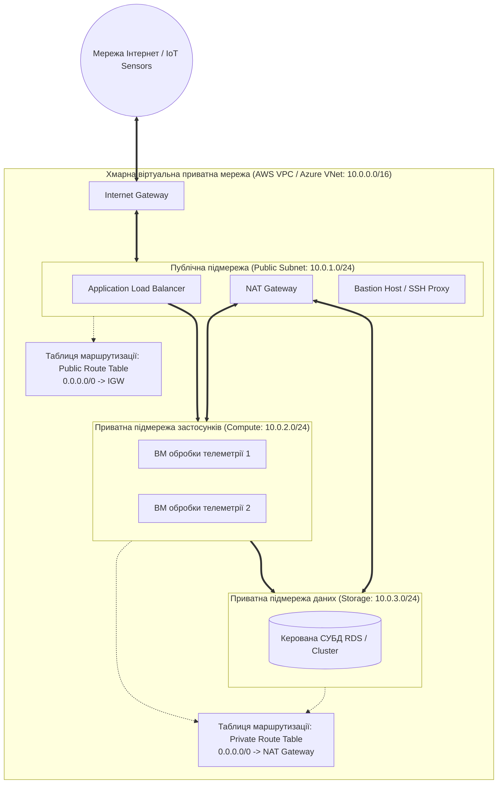
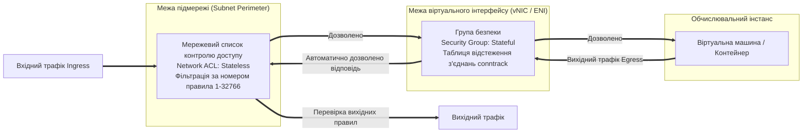
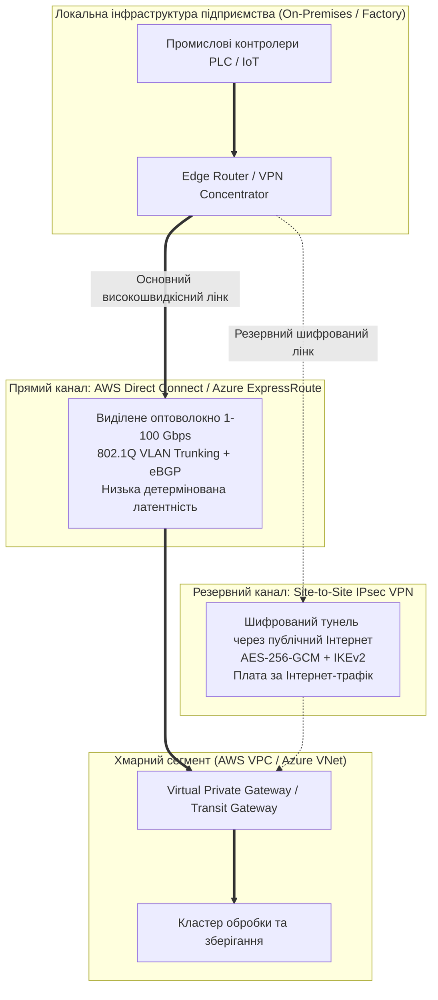
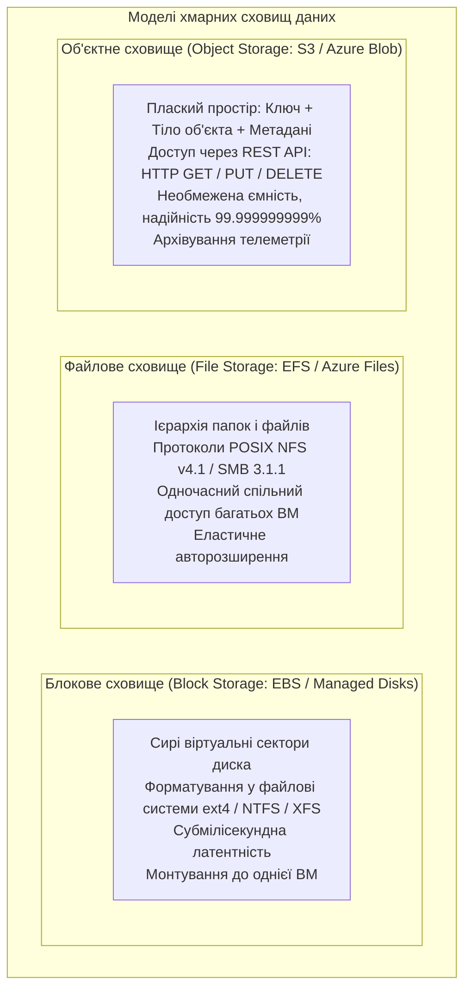
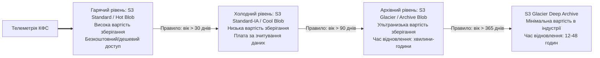
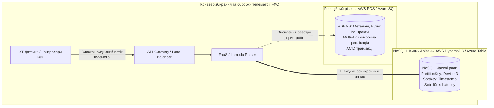
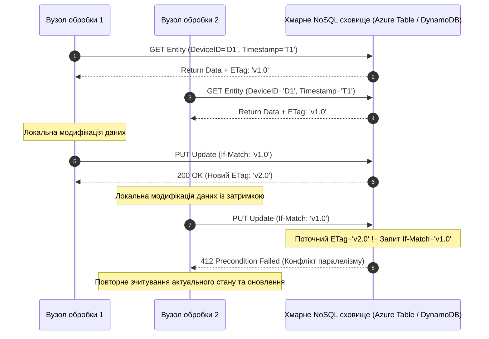

# Змістовий модуль 1. Архітектура хмарних систем, технології віртуалізації та базові сервіси IaaS/PaaS

# Тема 3. Хмарні мережі (VPC/VNet) та системи збереження даних (Storage & Databases)

---

## 3.1. Віртуальні хмарні мережі: програмно-конфігуровані мережі (SDN), Virtual Private Cloud (AWS VPC) та Virtual Network (Azure VNet), підмережі (Subnets), шлюзи (IGW, NAT Gateway), Route Tables

### Основний зміст та теоретичний базис

Мережева інфраструктура сучасних хмарних платформ є фундаментом для функціонування розподілених обчислювальних середовищ, що об'єднують віртуальні машини, контейнери, бази даних та периферійні пристрої кіберфізичних систем. Традиційні апаратні мережі передачі даних, побудовані на базі фізичних комутаторів і маршрутизаторів із фіксованою конфігурацією портів, неспроможні забезпечити динамічну еластичність, притаманну хмарній моделі, коли за лічені секунди створюються й знищуються тисячі віртуальних інтерфейсів. 

Технологічною основою подолання цих обмежень стали **програмно-конфігуровані мережі (Software-Defined Networking, SDN)**, які відокремлюють площину прийняття рішень щодо маршрутизації та комутації (**Control Plane**) від площини безпосередньої комутації та пересилання пакетів даних (**Data Plane / Forwarding Plane**).

*Рисунок 3.1 — Архітектура трирівневої ізольованої хмарної мережі для збирання та обробки телеметрії кіберфізичних систем*

У віртуалізованих дата-центрах SDN реалізується за допомогою технологій накладених мереж (**Overlay Networks**), які використовують протоколи інкапсуляції, такі як **VXLAN (Virtual Extensible LAN)**, **NVGRE** та **Geneve**. Ці протоколи інкапсулюють кадри канального рівня (Layer 2) у стандартні UDP-пакети базової фізичної мережі дата-центру (**Underlay Network**). Завдяки 24-бітному ідентифікатору віртуальної мережі (VNI у протоколі VXLAN) хмарний провайдер отримує можливість створювати до $2^{24} \approx 16{,}7$ мільйонів повністю ізольованих віртуальних мереж поверх спільного фізичного комутаційного обладнання. Це усуває фундаментальне обмеження класичних віртуальних локальних мереж IEEE 802.1Q (VLAN), ємність яких обмежена 4094 сегментами.

Концептуальним втіленням програмно-конфігурованої мережі в інфраструктурі постачальників послуг IaaS є **віртуальна приватна хмара** (**Virtual Private Cloud, AWS VPC**) або **віртуальна мережа** (**Virtual Network, Azure VNet**). Дана сутність є ізольованим сегментом публічної хмари, що функціонує як віртуальний аналог корпоративного дата-центру. При створенні VPC або VNet системний архітектор виділяє для неї безперервний блок приватних IP-адрес на основі стандарту безкласової адресації (**CIDR — Classless Inter-Domain Routing**) згідно зі специфікацією RFC 1918 (наприклад, діапазони `10.0.0.0/16`, `172.16.0.0/16` або `192.168.0.0/16`).

Внутрішній простір віртуальної приватної мережі структурується за допомогою **підмереж (Subnets)**, які поділяють загальний адресний простір на менші ізольовані домени. Кожна підмережа асоціюється з конкретною зоною доступності (**Availability Zone, AZ**) в межах обраного географічного регіону дата-центрів. За характером взаємодії із зовнішнім світом підмережі суворо поділяються на публічні та приватні:

1. **Публічні підмережі (Public Subnets).** Трафік із цих підмереж має прямий маршрут до мережі Інтернет. У публічних підмережах розміщуються пристрої, які повинні приймати вхідні з'єднання ззовні: балансувальники навантаження (Application Load Balancers), шлюзи API та сервери-бастіони (Bastion Hosts / Jump Boxes).
2. **Приватні підмережі (Private Subnets).** Не мають прямого вхідного доступу з Інтернету. У них розгортаються критичні компоненти системи: обчислювальні вузли бізнес-логіки, сервери обробки потоків даних сенсорів, бази даних та внутрішні сховища.

Під час розрахунку адресного простору підмереж необхідно враховувати, що хмарні провайдери резервують службові IP-адреси в кожному блоці CIDR. Зокрема, у платформі AWS у кожній підмережі резервується 5 адрес: адреса мережі (Network Address), адреса віртуального маршрутизатора VPC, адреса сервера DNS, адреса для майбутнього розширення та широкомовна адреса (Broadcast Address).

Кількість корисних адрес $N_{\text{usable}}$, доступних для розміщення віртуальних інтерфейсів у підмережі з маскою довжиною $M$ біт, математично виражається формулою:

$$N_{\text{usable}} = 2^{(32 - M)} - N_{\text{reserved}}$$

де $M$ — довжина маски підмережі у форматі префікса CIDR ($16 \le M \le 28$), $N_{\text{reserved}}$ — кількість адрес, зарезервованих платформою за замовчуванням (для AWS $N_{\text{reserved}} = 5$, для Azure $N_{\text{reserved}} = 5$, для приватних інфраструктур CloudStack/Proxmox $N_{\text{reserved}} = 2$ чи $3$).

Маршрутизація пакетів всередині хмарної мережі контролюється віртуальними **таблицями маршрутизації (Route Tables)**, які асоціюються з однією або кількома підмережами. Маршрутизатор аналізує адресу призначення IP-пакета за правилом найдовшого префіксного збігу (**Longest Prefix Match**). Кожна таблиця обов'язково містить локальний маршрут (Local Route, наприклад, `10.0.0.0/16 -> local`), що забезпечує вільний обмін трафіком між усіма вузлами VPC незалежно від зон доступності.

Для забезпечення зовнішньої зв'язності застосовуються спеціалізовані хмарні шлюзи:

* **Інтернет-шлюз (Internet Gateway, IGW).** Високодоступний, горизонтально масштабований програмний компонент VPC, який забезпечує двостороннє перетворення адрес (**1:1 Static NAT**) між публічними IP-адресами інстансів та їхніми приватними адресами, спрямовуючи трафік за маршрутом `0.0.0.0/0 -> igw-id`.
* **Шлюз трансляції мережевих адрес (NAT Gateway).** Керований сервіс провайдера, що розміщується в публічній підмережі та забезпечує односторонню трансляцію (**Source NAT / Port Address Translation, PAT**) для віртуальних машин із приватних підмереж. Це дозволяє прихованим вузлам безпечно завантажувати оновлення та надсилати телеметрію в зовнішні системи без можливості ініціалізації прямих вхідних підключень з боку зловмисників.

У кіберфізичних системах критичним параметром є сумарна мережева затримка доставки пакетів телеметрії $T_{\text{net}}$, яка моделюється формулою:

$$T_{\text{net}} = \frac{S_{\text{payload}}}{BW_{\text{link}}} + 2 \cdot D_{\text{prop}} + T_{\text{sdn\_encap}} + T_{\text{nat\_proc}}$$

де $S_{\text{payload}}$ — розмір пакета телеметрії (у байтах), $BW_{\text{link}}$ — смуга пропускання каналу передачі (у бітах за секунду), $D_{\text{prop}}$ — фізична затримка поширення електромагнітного сигналу в оптоволокні до дата-центру (у секундах), $T_{\text{sdn\_encap}}$ — затримка інкапсуляції та декапсуляції заголовків VXLAN/Geneve у віртуальному комутаторі хоста (у мікросекундах), $T_{\text{nat\_proc}}$ — час обробки пакета в таблиці трансляції NAT Gateway.

*Таблиця 3.1 — Зіставлення мережевих примітивів платформ AWS та Microsoft Azure*

| Архітектурний компонент | Amazon Web Services (AWS VPC) | Microsoft Azure (Azure VNet) |
| :--- | :--- | :--- |
| **Базова ізольована мережа** | Virtual Private Cloud (VPC), прив'язана до Регіону | Virtual Network (VNet), прив'язана до Регіону |
| **Область охоплення підмережі** | Суворо прив'язана до однієї конкретної Availability Zone | Охоплює весь Регіон та всі Availability Zones |
| **Вихідний Інтернет для приватних вузлів** | Керований AWS NAT Gateway або NAT Instance | Azure NAT Gateway або системний Virtual Network NAT |
| **Зв'язування мереж між собою** | VPC Peering, AWS Transit Gateway | VNet Peering, Azure Virtual WAN |
| **Пряме приватне підключення до PaaS** | VPC Endpoints (Gateway / Interface через PrivateLink) | Azure Private Endpoints / Service Endpoints |

Аналіз даних таблиці 3.1 свідчить про високу концептуальну подібність рішень, однак виявляє відмінність у просторовій прив'язці підмереж, що вимагає врахування топології зон доступності при проєктуванні відмовостійких систем.

---

## 3.2. Безпека мережевого рівня: Security Groups (stateful) та Network Access Control Lists (NACL, stateless), організація гібридних з'єднань (Site-to-Site VPN, ExpressRoute/Direct Connect)

### Основний зміст та теоретичний базис

Забезпечення надійного захисту кіберфізичних систем та хмарних корпоративних сховищ вимагає побудови багатоешелонованої оборони (**Defense-in-Depth**). На мережевому рівні хмарних середовищ ізоляція та фільтрація трафіку здійснюються двома комплементарними бар'єрами безпеки: групами безпеки (**Security Groups, SG**) та мережевими списками контролю доступу (**Network Access Control Lists, NACL**).

*Рисунок 3.2 — Дворівневий механізм фільтрації трафіку в хмарній інфраструктурі*

**Групи безпеки (Security Groups)** діють як віртуальний міжмережевий екран безпосередньо на рівні віртуального мережевого адаптера інстансу (**Elastic Network Interface, ENI**). Головною архітектурною властивістю груп безпеки є їхня робота з фіксацією стану (**Stateful filtering**). 

Коли через групу безпеки дозволяється вхідне підключення (Ingress), хмарний гіпервізор автоматично вносить запис про це з'єднання до внутрішньої таблиці відстеження станів (**Connection Tracking Table / conntrack**). Як наслідок, зворотний трафік відповіді (Egress) пропускається автоматично та безперешкодно, незалежно від того, які правила вихідного трафіку налаштовані в конфігурації. 

Правила в Security Groups є виключно дозвільними (**Allow rules only**); явне створення заборонних правил (Deny) не підтримується — весь трафік, який прямо не відповідає жодному з правил дозволу, неявно відхиляється за замовчуванням. Крім того, у групах безпеки як джерело трафіку можна вказувати ідентифікатори інших груп безпеки (SG ID), що дозволяє легко формувати логічні правила міжрівневої взаємодії (наприклад, дозволити порт MySQL 3306 тільки для інстансів, яким призначено групу безпеки `sg-backend-apps`).

**Мережеві списки контролю доступу (Network ACL)** функціонують на зовнішньому периметрі підмережі, контролюючи весь трафік, що перетинає її межі. На відміну від груп безпеки, NACL є системою фільтрації без збереження стану (**Stateless filtering**). Це означає, що кожне вхідне та вихідне повідомлення аналізується абсолютно незалежно. 

Якщо для вхідного трафіку відкрито порт HTTPS (443), відповідь сервера не зможе вийти з підмережі, доки у вихідних правилах NACL не буде явно дозволено діапазон **ефемерних портів (Ephemeral Ports: 1024–65535)**, які операційні системи використовують для встановлення клієнтських сесій. Правила в NACL впорядковуються за числовими номерами (від 1 до 32766) і обробляються послідовно від найменшого номера до першого збігу, причому підтримуються як дозвільні (Allow), так і явні заборонні (Deny) інструкції.

*Таблиця 3.2 — Порівняльний аналіз механізмів фільтрації Security Groups та Network ACL*

| Технічний критерій | Групи безпеки (Security Groups) | Мережеві ACL (Network ACL) |
| :--- | :--- | :--- |
| **Рівень застосування** | Віртуальний мережевий адаптер (vNIC / Instance) | Периметр підмережі (Subnet boundary) |
| **Тип відстеження** | З фіксацією стану (**Stateful**) | Без збереження стану (**Stateless**) |
| **Типи правил** | Тільки дозволи (**Allow rules only**) | Дозволи та явні заборони (**Allow and Deny**) |
| **Обробка правил** | Оцінюються всі правила одночасно | Суворо за порядком номерів (від 1 до 32766) |
| **Ефемерні порти** | Не потребують явного відкриття для відповідей | Вимагають явного відкриття діапазону 1024–65535 |
| **Вплив на інстанси** | Застосовується тільки до призначених інтерфейсів | Автоматично фільтрує всі ресурси підмережі |

Для інтеграції локальних заводських кіберфізичних комплексів із хмарними обчислювальними потужностями застосовують два базові типи **гібридних з'єднань**:

*Рисунок 3.3 — Гібридна топологія об'єднання локальної кіберфізичної системи з хмарою через виділений канал та резервний VPN-тунель*

1. **Віртуальна приватна мережа (Site-to-Site IPsec VPN).** З'єднання встановлюється поверх публічної мережі Інтернет із використанням криптографічних протоколів **IPsec (Internet Protocol Security)** та протоколу обміну ключами **IKEv2 (Internet Key Exchange)**. Шифрування здійснюється за алгоритмом AES-256-GCM, а цілісність підтверджується хешами SHA-256/384. Такий підхід має низьку вартість і швидкий час розгортання, проте характеризується нестабільною латентністю та залежністю від завантаженості публічних каналів провайдерів.
2. **Виділені виділені фізичні канали (AWS Direct Connect / Microsoft Azure ExpressRoute).** Організація фізичного оптоволоконного з'єднання між маршрутизатором підприємства та портом хмарного провайдера на нейтральному майданчику обміну трафіком (Colocation Facility / IXP). Підключення використовує транкінг віртуальних локальних мереж за стандартом **IEEE 802.1Q (VLAN)** та протокол динамічної маршрутизації **eBGP (Border Gateway Protocol)**. Швидкість передачі становить від 1 до 100 Гбіт/с без проходження крізь публічний Інтернет, гарантуючи детерміновану латентність менше 2–5 мілісекунд, що є критичною вимогою для систем керування робототехнічними комплексами в реальному часі.

Результуючий коефіцієнт доступності гібридного з'єднання $A_{\text{hybrid}}$ при дублюванні прямого оптичного каналу резервним тунелем IPsec VPN описується формулою:

$$A_{\text{hybrid}} = 1 - (1 - A_{\text{DirectConnect}}) \cdot (1 - A_{\text{VPN}})$$

де $A_{\text{DirectConnect}}$ — коефіцієнт готовності виділеного каналу ($A \approx 0{,}999$), $A_{\text{VPN}}$ — коефіцієнт готовності резервного VPN-підключення ($A \approx 0{,}99$). За такої топології сукупна доступність зв'язку перевищує $99{,}999\%$.

---

## 3.3. Моделі хмарних сховищ: блокові (AWS EBS, Azure Managed Disks), файлові (EFS, Azure Files) та об'єктні сховища (AWS S3, Azure Blob). Рівні зберігання (Hot, Cool, Archive), механізми реплікації (LRS, ZRS, GRS, RA-GRS)

### Основний зміст та теоретичний базис

Ефективна організація збереження даних у хмарі базується на використанні трьох фундаментальних моделей абстракції: **блокових**, **файлових** та **об'єктних** сховищ. Кожна з цих моделей оптимізована під відповідний патерн доступу, рівень латентності та тип оброблюваної інформації.

*Рисунок 3.4 — Класифікація та функціональні характеристики моделей хмарних сховищ*

#### 1. Блокові сховища (AWS Elastic Block Store — EBS, Azure Managed Disks)
Блокове сховище надає віртуалізований блоковий пристрій (аналог фізичного жорсткого або твердотільного диска), який монтується до однієї віртуальної машини через високошвидкісну віртуальну шину. На цьому рівні дані розглядаються як послідовність неструктурованих блоків фіксованого розміру (наприклад, по 4 чи 8 КБ). Операційна система інстансу самостійно створює на ньому дискові розділи та форматує їх у цільову файлову систему (ext4, XFS, NTFS). 

Хмарні блокові диски підтримують різні типи носіїв: твердотільні накопичувачі загального призначення (General Purpose SSD, наприклад, `gp3`), високопродуктивні SSD з гарантованою кількістю операцій вводу/виводу (**Provisioned IOPS SSD**, `io2 Block Express`) та надшвидкісні диски прямого підключення з ультранизькою затримкою (Azure Ultra Disks). 

Для дисків класу `gp3` реалізовано незалежне масштабування показників: базовий дисковий простір можна збільшувати без зміни виділеної швидкості, а значення IOPS та пропускну здатність (Throughput, МБ/с) конфігурувати програмно за запитом.

#### 2. Файлові сховища (AWS Elastic File System — EFS, Azure Files)
Файлові сховища реалізують абстракцію ієрархічної файлової системи (дерево каталогів і файлів) із підтримкою стандартних мережевих протоколів **NFS (Network File System v4.0/v4.1)** та **SMB (Server Message Block v3.0/v3.1.1)**. Головною перевагою файлових сховищ є можливість паралельного спільного підключення (**Concurrent Multi-Attach**) тисяч віртуальних машин або контейнерів до єдиного дискового ресурсу з підтримкою блокування файлів за стандартом POSIX. Ємність сховища автоматично зростає та зменшується в міру додавання або видалення файлів, позбавляючи потреби попереднього резервування простору.

#### 3. Об'єктні сховища (Amazon Simple Storage Service — S3, Azure Blob Storage)
Об'єктні сховища докорінно відрізняються від блокових та файлових систем відсутністю ієрархічної структури папок. Дані зберігаються у пласкому адресному просторі у вигляді незалежних **об'єктів (Objects / Blobs)** всередині логічних контейнерів (**Buckets** в AWS або **Containers** в Azure). Кожен об'єкт складається з трьох обов'язкових компонентів:
* **Унікальний ключ (Key / Object ID).** Рядковий ідентифікатор об'єкта, який формує його глобальну URL-адресу, наприклад: `https://telemetry-bucket.s3.eu-central-1.amazonaws.com/sensors/device_42/2026-08-29.json`.
* **Корисне навантаження (Payload / Data Stream).** Безпосередній масив двійкових даних обсягом від 0 байт до 5 терабайт.
* **Метадані (Metadata).** Набір пар «ключ-значення», що містять системні атрибути (розмір, Content-Type, дата модифікації, MD5-хеш для контролю цілісності `ETag`) та користувацькі кастомні теги (наприклад, `SensorType=Vibration`, `DeviceID=42`).

Взаємодія з об'єктним сховищем здійснюється виключно через мережевий протокол **HTTP/HTTPS за архітектурним стилем REST**:
* `PUT` — завантаження нового об'єкта або оновлення існуючого.
* `GET` — зчитування тіла об'єкта або визначеного байтового діапазону (**Byte-Range Request**).
* `DELETE` — видалення об'єкта зі сховища.
* `HEAD` — зчитування виключно метаданих об'єкта без завантаження його тіла.

Для оптимізації фінансових витрат в об'єктних сховищах впроваджено **рівні зберігання (Storage Tiers)** та політики автоматизованого керування життєвим циклом (**Lifecycle Management Rules**):

*Рисунок 3.5 — Схема автоматичного переходу об'єктів між рівнями зберігання за життєвим циклом*

Для забезпечення високої надійності провайдери використовують різні **стратегії реплікації даних**:

* **Локально-надлишкове сховище (Locally Redundant Storage, LRS).** Синхронно створює 3 копії даних у межах одного фізичного центру обробки даних, захищаючи від поломок окремих дисків чи стійок, але не від масштабної аварії всього дата-центру.
* **Зонально-надлишкове сховище (Zone-Redundant Storage, ZRS).** Синхронно дублює дані між трьома незалежними зонами доступності (AZ) в межах одного регіону, гарантуючи стійкість до повного знищення одного з дата-центрів.
* **Гео-надлишкове сховище (Geo-Redundant Storage, GRS).** Створює 3 копії в основному регіоні (за схемою LRS) і асинхронно передає дані до вторинного географічного регіону, розташованого на відстані понад 300–500 км, де створюються ще 3 копії (сумарно 6 копій даних).
* **Гео-надлишкове сховище з доступом на читання (Read-Access Geo-Redundant Storage, RA-GRS).** Зберігає переваги GRS, але надає активну кінцеву точку для читання реплікованих даних у вторинному регіоні, що дозволяє застосункам продовжувати роботу при повній аварії основного регіону.

Показник надійності (довговічності) хмарного сховища $D_{\text{storage}}$ (Durability, виражений імовірністю збереження об'єкта без втрати за рік) для систем класу S3 Standard становить $99{,}999999999\%$ (так звані «11 дев'яток»), що відповідає річній імовірності втрати даних:

$$P_{\text{loss}} = 1 - D_{\text{storage}} = 1 - (1 - 10^{-11}) = 10^{-11}$$

Загальна місячна вартість зберігання та обробки телеметрії $C_{\text{storage\_total}}$ розраховується як сума витрат за обсяг, операції та вибірку:

$$C_{\text{storage\_total}} = \sum_{k \in \text{Tiers}} \left( V_k \cdot P_{\text{cap}, k} + N_{\text{write}, k} \cdot P_{\text{put}, k} + N_{\text{read}, k} \cdot P_{\text{get}, k} + V_{\text{retrieved}, k} \cdot P_{\text{ret}, k} \right)$$

де $V_k$ — середньомісячний обсяг даних у рівні $k$ (у гігабайтах), $P_{\text{cap}, k}$ — тариф за зберігання 1 ГБ на місяць у рівні $k$, $N_{\text{write}, k}$ та $N_{\text{read}, k}$ — кількість операцій запису (PUT/POST) та зчитування (GET), $P_{\text{put}, k}$ і $P_{\text{get}, k}$ — вартість 1000 відповідних операцій, $V_{\text{retrieved}, k}$ — обсяг даних, вивантажених із холодних/архівних рівнів (у гігабайтах), $P_{\text{ret}, k}$ — тариф за відновлення 1 ГБ даних із холодного сховища.

*Таблиця 3.3 — Порівняльна матриця хмарних технологій збереження даних*

| Характеристика | Блокове (AWS EBS / Azure Disks) | Файлове (AWS EFS / Azure Files) | Об'єктне (AWS S3 / Azure Blob) |
| :--- | :--- | :--- | :--- |
| **Одиниця збереження** | Фіксовані дискові блоки (4–8 КБ) | Файли у структурі каталогів | Неструктуровані об'єкти з метаданими |
| **Протокол доступу** | Шина NVMe / SCSI поверх SDN | POSIX NFS v4.1 / SMB 3.1.1 | RESTful HTTP/HTTPS (GET, PUT, DELETE) |
| **Мережева затримка** | Субмілісекундна (~0.5–2 мс) | Низька/середня (~3–10 мс) | Помірна (~20–100 мс) |
| **Одночасні клієнти** | Зазвичай 1 інстанс (або Multi-Attach до 16) | До десятків тисяч інстансів | Необмежена кількість HTTP-клієнтів |
| **Сфера застосування в КФС** | Системні диски ОС, активні СУБД | Спільні конфігурації, файли моделей ШІ | Архіви телеметрії, медіа, Data Lake |

---

## 3.4. Хмарні бази даних: керовані реляційні СУБД (AWS RDS, Azure SQL Database) та документно-орієнтовані/ключ-значення NoSQL (AWS DynamoDB, Azure Cosmos DB / Table Storage)

### Основний зміст та теоретичний базис

Обробка потоків інформації, що надходять від датчиків і контролерів кіберфізичних систем, вимагає спеціалізованих моделей організації баз даних. Хмарні платформи надають бази даних як повністю керовані сервіси (**Fully Managed Database Services / DBaaS**), де провайдер автоматизує процеси встановлення оновлень, створення резервних копій, масштабування сховища та підтримки високої доступності.

*Рисунок 3.6 — Гібридна архітектура збереження даних КФС із розподілом потоків між NoSQL та реляційними СУБД*

#### 1. Керовані реляційні бази даних (AWS Relational Database Service — RDS, Azure SQL Database)
Модель реляційних СУБД у хмарі базується на класичній реляційній алгебрі та гарантіях транзакційної цілісності **ACID** (**A**tomicity, **C**onsistency, **I**solation, **D**urability). Хмарні провайдери пропонують як адаптації популярних рушіїв із відкритим кодом (PostgreSQL, MySQL, MariaDB), так і комерційні enterprise-системи (Oracle, Microsoft SQL Server).

Особливе місце посідають хмарно-нативні реляційні архітектури, такі як **Amazon Aurora** та **Azure SQL Hyperscale**, у яких обчислювальний рівень СУБД (SQL Query Engine) відокремлено від розподіленого дискового сховища. Сховище Aurora автоматично дублює кожну сторінку пам'яті в 6 копіях у 3 зонах доступності, забезпечуючи швидкість запису в 3–5 разів вищу за стандартний MySQL/PostgreSQL за рахунок передачі виключно логів повтору (**Redo Logs**) без необхідності скидання повних сторінок пам'яті на диск.

Для забезпечення безперервності бізнес-процесів у реляційних DBaaS використовується конфігурація **Multi-AZ Deployment**:
* Сервер баз даних функціонує в режимі Primary (Active) у першій зоні доступності.
* У другій зоні доступності розгортається резервний екземпляр Standby (Passive), на який здійснюється синхронна реплікація на рівні сховища.
* У разі апаратної відмови Primary-сервера хмарний сервіс автоматично перемикає канонічний DNS-запис бази даних (**CNAME failover**) на вузол Standby протягом 60–120 секунд без втрати зафіксованих транзакцій.
* Для масштабування операцій читання створюються асинхронні репліки (**Read Replicas**), які розвантажують основний сервер від важких аналітичних запитів.

#### 2. Хмарні NoSQL бази даних (AWS DynamoDB, Azure Cosmos DB, Azure Table Storage)
Традиційні реляційні бази даних погано підходять для запису масивних потоків телеметрії кіберфізичних систем через високі накладні витрати на підтримання зовнішніх ключів, блокування таблиць та необхідність нормалізації даних. Для сценаріїв із високою частотою транзакцій застосовуються NoSQL бази даних типу «ключ-значення» та документо-орієнтовані сховища, які функціонують за моделлю **BASE** (**B**asically **A**vailable, **S**oft-state, **E**ventual consistency) відповідно до **теореми CAP** Еріка Брюера.

Яскравим представником таких систем є **Amazon DynamoDB** — розподілена нереляційна база даних, що гарантує стабільну швидкість відгуку менше 10 мілісекунд при довільному масштабі навантаження. 

Основою ефективного проєктування схем у DynamoDB та Azure Table Storage є вибір первинного ключа (**Primary Key**), який складається з двох частин:
* **Ключ партиціонування (Partition Key / Hash Key).** Значення цього ключа пропускається крізь внутрішню хеш-функцію, результат якої визначає конкретний фізичний вузол/партицію для збереження запису. У кіберфізичних системах як Partition Key обирають унікальний ідентифікатор сенсора або пристрою (`DeviceID`), що забезпечує рівномірний розподіл навантаження та унеможливлює утворення «гарячих партицій» (**Hot Partitions**).
* **Ключ сортування (Sort Key / Range Key / RowKey).** Визначає фізичний порядок розташування записів у межах однієї партиції. Зазвичай як Sort Key використовується часова мітка ISO 8601 або числовий Unix Timestamp (`Timestamp`). Це дозволяє за один швидкий дисковий запит вибирати часові інтервали телеметрії для конкретного датчика за допомогою умов діапазону (`BETWEEN`, `>`, `<`).

Управління ресурсами в DynamoDB здійснюється через одиниці продуктивності:
* **Одиниця ємності запису (Write Capacity Unit, WCU)** — забезпечує один запис розміром до 1 КБ за секунду.
* **Одиниця ємності читання (Read Capacity Unit, RCU)** — забезпечує одне строго узгоджене читання (**Strongly Consistent Read**) або два узгоджених у кінцевому підсумку читання (**Eventually Consistent Reads**) розміром до 4 КБ за секунду.

Кількість необхідних одиниць $WCU_{\text{req}}$ та $RCU_{\text{req}}$ для обробки потоку від $M_{\text{dev}}$ пристроїв КФС розраховується за формулами:

$$WCU_{\text{req}} = \sum_{i=1}^{M_{\text{dev}}} \left( f_i \cdot \left\lceil \frac{S_{\text{payload}, i}}{1 \text{ KB}} \right\rceil \right)$$

$$RCU_{\text{req}} = \sum_{j=1}^{Q_{\text{read}}} \left( q_j \cdot \frac{1}{\chi} \cdot \left\lceil \frac{S_{\text{query}, j}}{4 \text{ KB}} \right\rceil \right)$$

де $f_i$ — частота надсилання повідомлень $i$-м пристроєм за секунду (Гц), $S_{\text{payload}, i}$ — розмір пакета телеметрії (у кілобайтах), $Q_{\text{read}}$ — кількість типів пошукових запитів, $q_j$ — частота виконання $j$-го запиту за секунду, $S_{\text{query}, j}$ — середній розмір результату вибірки (у кілобайтах), $\chi$ — коефіцієнт узгодженості читання ($\chi = 1$ для Strongly Consistent, $\chi = 2$ для Eventually Consistent).

Для запобігання конфліктам при одночасній модифікації спільних записів різними вузлами в хмарних NoSQL сховищах застосовується **оптимістичне блокування (Optimistic Concurrency Control)** за допомогою тегів сутностей **ETag**:

*Рисунок 3.7 — Алгоритм оптимістичного блокування транзакцій за допомогою заголовків ETag*

При зчитуванні сутності клієнт отримує унікальну версію `ETag`. Під час відправки команди оновлення клієнт передає цей ETag у HTTP-заголовку `If-Match`. Якщо інший процес встиг змінити запис раніше, версія сутності на сервері оновлюється, і сервер відхиляє запізнілий запит помилкою **412 Precondition Failed**, змушуючи клієнтський застосунок перечитати актуальний стан даних і уникнути затирання змін.

*Таблиця 3.4 — Порівняльна характеристика хмарних реляційних та NoSQL баз даних*

| Критерій оцінки | Реляційні DBaaS (AWS RDS / Azure SQL) | NoSQL сховища (AWS DynamoDB / Cosmos DB) |
| :--- | :--- | :--- |
| **Модель даних** | Сувора реляційна схема (таблиці, рядки, стовпці) | Гнучка схема (Key-Value, Document JSON) |
| **Транзакційна модель** | Повний захист ACID | Модель BASE (Eventual Consistency / ACID в межах партиції) |
| **Масштабування** | Вертикальне (збільшення CPU/RAM інстансу) | Горизонтальне (автоматичний розподіл партицій) |
| **Складність запитів** | Складні SQL-запити, багатотабличні `JOIN`, агрегації | Прості запити за ключем (`GetItem`), діапазонні вибірки |
| **Пропускна здатність** | Обмежена потужністю одного екземпляра Primary | Практично необмежена (мільйони транзакцій/сек) |

---

### Питання для самоперевірки та аналітичного осмислення

1. Яким чином технологія програмно-конфігурованих мереж (SDN) та протокол VXLAN долають архітектурні обмеження класичних мереж VLAN (IEEE 802.1Q) у масштабних мультиорендних дата-центрах?
2. Поясніть принципову різницю в маршрутизації та конфігурації між публічною та приватною підмережами всередині AWS VPC. Які системні функції виконує Internet Gateway (IGW) у порівнянні з NAT Gateway?
3. Проаналізуйте роботу механізму Connection Tracking у групах безпеки (Security Groups). Чому правила Security Groups називаються «Stateful», а правила Network ACL — «Stateless», і як це впливає на відкриття ефемерних портів?
4. Зіставте прямі оптичні з'єднання (AWS Direct Connect / Azure ExpressRoute) та тунелі Site-to-Site IPsec VPN за критеріями пропускної здатності, латентності, безпеки та детермінованості передачі даних для кіберфізичних систем.
5. Розкрийте внутрішню структуру об'єктного сховища (AWS S3 / Azure Blob). Як побудовано взаємодію клієнта зі сховищем на базі методів HTTP REST API (GET, PUT, DELETE, HEAD), і за якими математичними залежностями розраховується сукупна вартість зберігання даних із урахуванням життєвих циклів (Lifecycle Tiers)?
6. У чому полягає відмінність між моделями реплікації LRS, ZRS, GRS та RA-GRS? Яку модель реплікації необхідно обрати для забезпечення нульового показника втрати даних (RPO=0) та мінімального часу відновлення (RTO) при проектуванні систем керування критичною інфраструктурою?
7. Поясніть принципи проєктування первинних ключів у базах даних NoSQL (на прикладі Partition Key та Sort Key в AWS DynamoDB). Як некоректний вибір Partition Key може призвести до виникнення проблеми «гарячих партицій» (Hot Partitions) під час інтенсивного запису телеметрії від датчиків IoT?