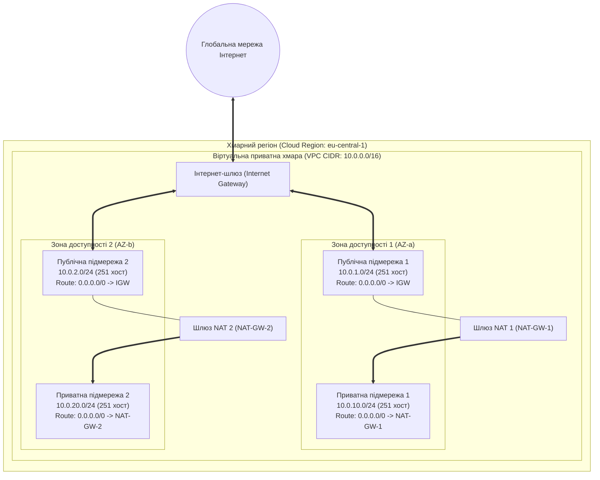
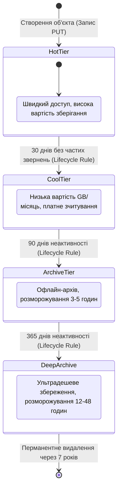
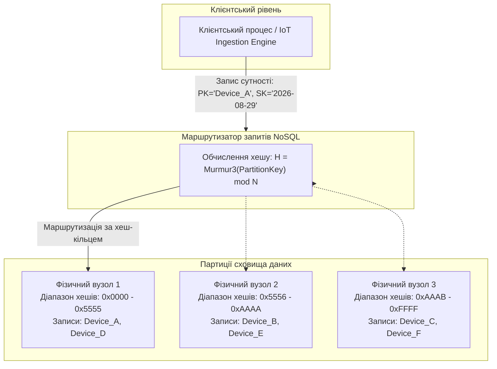
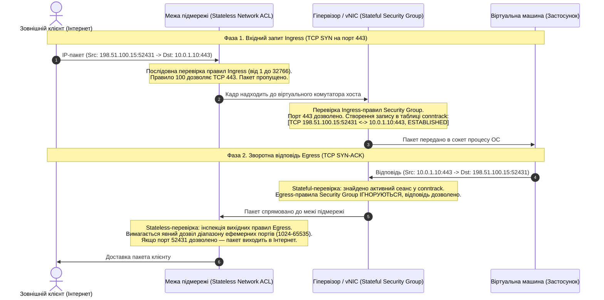
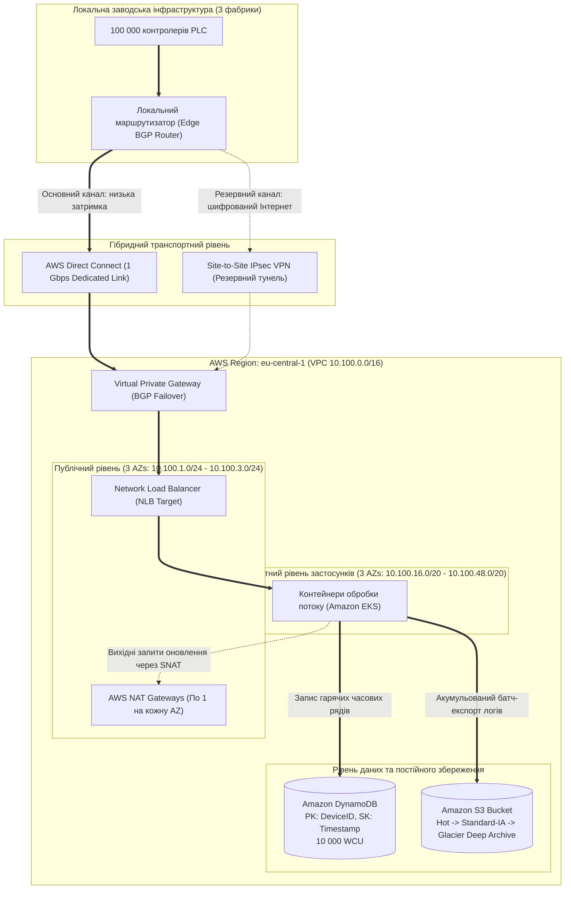

# Тема 3. Програмно-конфігуровані хмарні мережі та розподілені системи збереження даних

## Мета лекції

Формування у майбутніх інженерів комп'ютерних систем поглиблених теоретичних знань і практичних компетентностей щодо проектування, розгортання та оптимізації віртуальних мережевих інфраструктур і гетерогенних сховищ даних у публічних та гібридних хмарних середовищах. Навчальний матеріал фокусується на апаратно-програмній реалізації сучасних концепцій Software-Defined Networking, аналізі механізмів оверлейної інкапсуляції пакетів, детермінованому розрахунку простору IP-адресації та конфігуруванні багаторівневих систем захисту трафіку. Особлива увага приділяється інженерним компромісам між блоковими, файловими й об'єктними моделями зберігання, а також вибору СУБД для високонавантажених розподілених кіберфізичних комплексів з урахуванням апаратних обмежень пропускної здатності, мережевих затримок і вимог теореми CAP.

## Очікувані результати навчання

1. **Знання та розуміння.** Студенти повинні засвоїти базові принципи функціонування програмно-конфігурованих мереж, архітектуру віртуальних приватних хмар (VPC/VNet), математичні засади безкласової адресації CIDR, а також внутрішню організацію блокових, файлових, об'єктних сховищ і систем керування базами даних класів ACID і BASE.
2. **Застосування.** Студенти набудуть навичок практичного проектування топологій публічних і приватних підмереж, розрахунку адресних просторів із врахуванням службового резервування платформ, конфігурування таблиць маршрутизації, налаштування шлюзів IGW і NAT, а також визначення параметрів продуктивності дискових томів і структур партиціонування NoSQL-таблиць.
3. **Аналіз.** Студенти зможуть критично зіставляти функціонування механізмів мережевої фільтрації з фіксацією стану (Security Groups) та без збереження стану (Network ACL), аналізувати детермінованість затримок і пропускну здатність каналів Site-to-Site VPN проти виділених оптичних магістралей Direct Connect / ExpressRoute, а також диференціювати поведінку сховищ під час реплікації даних.
4. **Оцінювання та синтез.** Студенти оволодіють методологією виявлення критичних вузьких місць у віртуальних мережевих трактах, мінімізації ризиків утворення «гарячих партицій» у розподілених сховищах телеметрії та синтезу стійких до відмов георозподілених архітектур зберігання з оптимізацією вартості життєвого циклу інформації.

---

## Детальний покроковий план лекції

### 1. Теоретико-концептуальний базис. Архітектура хмарних мережних абстракцій та моделей даних
* 1.1. Принципи програмно-конфігурованих мереж (SDN), розділення площин Control Plane та Data Plane, механізми оверлейної інкапсуляції кадрів за протоколами VXLAN і Geneve.
* 1.2. Концепція ізольованого хмарного сегмента: архітектура Virtual Private Cloud (AWS VPC) та Virtual Network (Azure VNet), розподіл зон доступності та розрахунок адресних просторів CIDR.
* 1.3. Таксономія та структурні особливості хмарних сховищ: порівняльний аналіз блокових (EBS / Managed Disks), файлових (EFS / Azure Files) та об'єктних (S3 / Blob) моделей.
* 1.4. Парадигми організації хмарних баз даних: реляційні сервіси DBaaS із підтримкою транзакцій ACID проти розподілених NoSQL-сховищ моделі BASE.

### 2. Методологія та аналіз граничних умов. Інженерія безпеки, маршрутизації та продуктивності розподіленого збереження
* 2.1. Багаторівнева фільтрація трафіку: алгоритмічні відмінності між stateful-інспекцією Security Groups на рівні vNIC та stateless-фільтрацією Network ACL на межі підмережі.
* 2.2. Організація зовнішньої та гібридної зв'язності: механізми шлюзів Internet Gateway і NAT Gateway, порівняльний аналіз тунелів IPsec VPN та виділених ліній Direct Connect / ExpressRoute.
* 2.3. Механізми забезпечення довговічності даних: стратегії реплікації LRS, ZRS, GRS та автоматизація керування життєвим циклом об'єктів за температурними класами зберігання.
* 2.4. Методологія оптимізації транзакцій NoSQL: проектування складених первинних ключів (Partition Key, Sort Key) та алгоритми оптимістичного блокування на основі ETag.
* 2.5. Критичні бар'єри та граничні умови: ліміти пропускної здатності віртуальних інтерфейсів, вплив мережевого джитера на чутливі до затримок системи, компроміси теореми CAP та проблема утворення «гарячих партицій» (Hot Partitions).

### 3. Практичний індустріальний / фаховий кейс. Проєктування мережевої та дискової інфраструктури хмарного бекенду
**Тема наскрізної задачі.** «Розгортання захищеної трирівневої інфраструктури AWS VPC із резервованим гібридним каналом Direct Connect, холодним об'єктним сховищем S3 та базою даних DynamoDB для збирання та аналізу потокової телеметрії 100 000 промислових IoT-контролерів».

## 1. Теоретико-концептуальний базис. Архітектура хмарних мережних абстракцій та моделей даних

### 1.1. Принципи програмно-конфігурованих мереж (SDN) та оверлейна інкапсуляція за протоколами VXLAN і Geneve

Фундаментом функціонування сучасних дата-центрів виступає концепція **програмно-конфігурованих мереж (Software-Defined Networking, SDN)**, яка подолала архітектурну скутість традиційного телекомунікаційного обладнання. У класичній мережевій інфраструктурі логіка прийняття рішень щодо маршрутизації та безпосереднє пересилання пакетів апаратно об'єднані всередині одного шасі комутатора чи маршрутизатора. Парадигма SDN здійснює декомпозицію цієї системи, жорстко відокремлюючи **площину керування (Control Plane)** від **площини передавання даних (Data Plane / Forwarding Plane)**. 

Площина передавання реалізується на базі високошвидкісних спеціалізованих інтегральних схем (**Application-Specific Integrated Circuit, ASIC**) або мережевих процесорів (**Network Processor, NP**), чиє завдання полягає виключно в апаратному комутуванні кадрів і пакетів за заздалегідь завантаженими таблицями потоків. Натомість площина керування виноситься на централізований логічний контролер, який формує глобальний топологічний огляд усієї інфраструктури, аналізує завантаженість каналів у реальному часі та транслює правила комутації до апаратних пристроїв через стандартизовані протоколи взаємодії, такі як OpenFlow або сучасніші інтерфейси Open vSwitch Database Management Protocol (OVSDB).

Історично ізоляція обчислювальних середовищ у локальних мережах здійснювалася за допомогою стандарту IEEE 802.1Q (VLAN), проте в контексті великомасштабних мультиорендних хмарних дата-центрів цей підхід продемонстрував нездоланні обмеження. Дванадцятибітне поле ідентифікатора віртуальної мережі (VLAN ID) обмежує кількість ізольованих доменів широкомовлення величиною $2^{12} = 4096$, що є критично малим для провайдерів, які обслуговують сотні тисяч незалежних орендарів. Крім того, протокол зв'язувального дерева (Spanning Tree Protocol, STP), необхідний для запобігання комутаційним петлям у мережах VLAN, штучно блокує резервні фізичні лінії, що унеможливлює повноцінне використання пропускної здатності сучасних фабрик дата-центрів із топологією Leaf-Spine (Clos-мережі).

Вирішенням зазначених проблем стало впровадження **оверлейних мереж (Overlay Networks)**, побудованих поверх фізичної транспортної мережі (**Underlay Network**). Фізичний рівень Underlay функціонує виключно як високонадійна масштабована L3-мережа з маршрутизацією на основі протоколів BGP або OSPF, що підтримує балансування навантаження між усіма лінками за механізмом Equal-Cost Multi-Path (ECMP). Оверлейний рівень інкапсулює вихідний канальний кадр L2 або пакет L3 віртуальної машини в стандартний транспортний UDP-пакет базової мережі, створюючи ілюзію прямого зв'язку на канальному рівні між віддаленими віртуальними вузлами.

Основним стандартом оверлейної віртуалізації є протокол **VXLAN (Virtual Extensible LAN)**, стандартизований RFC 7348. У структурі кадру VXLAN оригінальний Ethernet-кадр віртуальної машини інкапсулюється в зовнішній UDP-пакет із портом призначення за замовчуванням 4789. Заголовок VXLAN містить 24-бітний ідентифікатор віртуальної мережі (**Virtual Network Identifier, VNI**), що дозволяє теоретично масштабувати простір ізольованих сегментів до $2^{24} \approx 16{,}7$ мільйона підмереж. 

Розвиток оверлейних технологій спричинив появу протоколу **Geneve (Generic Network Virtualization Encapsulation)**, стандартизованого RFC 8926. На відміну від статичного заголовка VXLAN, заголовок Geneve використовує порт UDP 6081 та володіє динамічним форматом із підтримкою опцій TLV (Type-Length-Value). Це дозволяє передавати в заголовку довільні службові метадані площини керування, ідентифікатори політик безпеки для систем мікросегментації та діагностичні мітки вбудованої телеметрії (In-band Network Telemetry, INT) безпосередньо в процесі пересилання пакетів через віртуальні комутатори, такі як Open vSwitch (OVS).

Застосування оверлейної інкапсуляції породжує проблему фрагментації пакетів через перевищення максимального розміру корисного навантаження кадру. Математична модель граничного розміру пакета всередині оверлейного тунелю $MTU_{\text{inner}}$ для запобігання фрагментації описується залежністю:

$$MTU_{\text{inner}} = MTU_{\text{underlay}} - (L_{\text{eth\_outer}} + L_{\text{ip\_outer}} + L_{\text{udp}} + L_{\text{encap}})$$

де $MTU_{\text{underlay}}$ позначає максимальний розмір блоку передавання фізичної мережі дата-центру, $L_{\text{eth\_outer}}$ відповідає довжині зовнішнього заголовка Ethernet (14 байтів без урахування тегу 802.1Q), $L_{\text{ip\_outer}}$ дорівнює розміру зовнішнього заголовка IPv4 (20 байтів) або IPv6 (40 байтів), $L_{\text{udp}}$ становить довжину заголовка UDP (8 байтів), а $L_{\text{encap}}$ визначає довжину заголовка інкапсуляції (8 байтів для фіксованого VXLAN або від 8 до 260 байтів для Geneve із TLV-опціями).

При стандартному значенні $MTU_{\text{underlay}} = 1500$ байтів мінімальний накладний оверлейний заголовок розміром 50 байтів обмежує розмір корисного кадру віртуальної машини до 1450 байтів. Якщо гостьова операційна система відправляє стандартний TCP-пакет розміром 1500 байтів, це спричиняє примусову L3-фрагментацію на мережевому адаптері хоста або відкидання пакета з надсиланням повідомлення ICMP «Destination Unreachable, Fragmentation Needed». З цієї причини на рівні фізичної мережі хмарних ЦОД обов'язково налаштовується підтримка надвеликих кадрів (**Jumbo Frames**) із значенням $MTU_{\text{underlay}} \ge 9000$ байтів.

> **ПРАКТИЧНИЙ ЯКІР:** У гіперконвергентних мережах Amazon Web Services апаратна декапсуляція оверлейних протоколів Geneve та VXLAN виконується не центральним процесором сервера, а спеціалізованими PCIe-картками-прискорювачами AWS Nitro Card, що забезпечує затримку пересилання між інстансами на рівні менше ніж 50 мікросекунд без втрати продуктивності процесорних ядер.

---

### 1.2. Концепція ізольованого хмарного сегмента: архітектура Virtual Private Cloud (AWS VPC) та Virtual Network (Azure VNet), розподіл зон доступності та розрахунок адресних просторів CIDR

Реалізація оверлейних мереж дозволяє надавати кожному користувачеві виділений віртуальний простір, ізольований на логічному рівні від інших клієнтів хмари. У термінології постачальників послуг IaaS цей простір позначається як **Virtual Private Cloud (VPC)** у платформі AWS або **Virtual Network (VNet)** у середовищі Microsoft Azure. З погляду системного проектування, VPC є віртуальною проекцією локального дата-центру з власним пулом IP-адрес, шлюзами доступу, таблицями маршрутизації та політиками міжмережевої взаємодії.

Проектування ізольованого хмарного сегмента починається з виділення адресного блоку у форматі **безкласової міждоменної адресації (Classless Inter-Domain Routing, CIDR)** відповідно до RFC 1918. Зазвичай хмарні платформи підтримують довжину маски підмережі від `/16` (що надає 65 536 адрес) до `/28` (що надає 16 адрес). Архітектурно цей масив розбивається на функціональні підмережі, що закріплюються за різними фізичними **зонами доступності (Availability Zones, AZ)** для запобігання відмовам єдиної точки інфраструктури.

Кількість корисних адрес $N_{\text{usable}}$, доступних для призначення віртуальним мережевим інтерфейсам у підмережі з префіксом $M$, визначається математичним виразом:

$$N_{\text{usable}} = 2^{(32 - M)} - N_{\text{reserved}}$$

де показник $M$ позначає кількість фіксованих бітів мережевої маски, а величина $N_{\text{reserved}}$ відображає службове резервування адрес інфраструктурними компонентами конкретної хмарної платформи.

Для інфраструктури AWS VPC величина $N_{\text{reserved}} = 5$. Зокрема, у підмережі `10.0.1.0/24` адреса `10.0.1.0` ідентифікує номер мережі, адреса `10.0.1.1` резервується для віртуального маршрутизатора підмережі (Default Gateway), адреса `10.0.1.2` призначається системному рекурсивному DNS-серверу (Amazon Route 53 Resolver), адреса `10.0.1.3` резервується для майбутнього використання провайдером, а адреса `10.0.1.255` виконує роль широкомовної адреси. Для хмари Azure VNet резервується аналогічна кількість адрес ($N_{\text{reserved}} = 5$), де три адреси закріплені за шлюзами та протокольними трансляторами.

Залежно від шляхів проходження вихідного та вхідного трафіку, підмережі класифікуються на публічні та приватні. **Публічна підмережа (Public Subnet)** асоційована з таблицею маршрутизації, яка має прямий маршрут `0.0.0.0/0` на **інтернет-шлюз (Internet Gateway, IGW)**. Інтернет-шлюз — це повністю керований, горизонтально масштабований програмний компонент, який виконує трансляцію мережевих адрес «один-до-одного» (**1:1 Static NAT**) між внутрішніми приватними IP-адресами інстансів та асоційованими з ними публічними еластичними IP-адресами. 

**Приватна підмережа (Private Subnet)** не має прямого зв'язку з IGW у своїй таблиці маршрутизації. Якщо інстансам у приватній підмережі необхідно вийти в зовнішню мережу (наприклад, для завантаження пакетів оновлення ядра або надсилання телеметрії в зовнішні API), трафік `0.0.0.0/0` перенаправляється на **шлюз трансляції мережевих адрес (NAT Gateway)**, розташований у публічній підмережі. Шлюз NAT діє за принципом Source NAT (SNAT) або трансляції портів (Port Address Translation, PAT), замінюючи внутрішню приватну адресу запиту своєю власною публічною IP-адресою та підтримуючи динамічну таблицю сесій трансляції. При цьому прямий вхідний трафік з Інтернету до інстансів приватної підмережі залишається фізично заблокованим.

> **ТИПОВА ПОМИЛКА:** Призначення віртуальній машині публічної IP-адреси всередині приватної підмережі без зміни таблиці маршрутизації на IGW не відкриває доступ до Інтернету. Інтернет-шлюз опрацьовує трансляцію адрес лише для тих підмереж, таблиця маршрутизації яких явно визначає зв'язку `0.0.0.0/0 -> igw-xxxx`. Без такого запису пакет буде відкинутий маршрутизатором підмережі, попри наявність призначеної публічної IP-адреси.

---

### 1.3. Таксономія та структурні особливості хмарних сховищ: порівняльний аналіз блокових (EBS / Managed Disks), файлових (EFS / Azure Files) та об'єктних (S3 / Blob) моделей

Збереження та обробка даних у хмарних середовищах спираються на три чітко диференційовані моделі зберігання: блокову, файлову та об'єктну. Кожна модель характеризується специфічним способом представлення даних, власними протоколами доступу та показниками латентності.

**Блокове сховище (Block Storage)** надає операційній системі інстансу послідовність «сирих» адресованих блоків фіксованого розміру, зазвичай через віртуальні адаптери NVMe або емульовані шини SCSI/VirtIO. Фізично блоки даних розташовуються на спеціалізованих серверах зберігання або дискових масивах мережі зберігання даних (SAN) і передаються до обчислювального вузла високошвидкісними мережевими протоколами iSCSI або Fibre Channel over Ethernet (FCoE). 

Гостьова операційна система сприймає такий диск як локальний накопичувач, створює таблицю розділів (MBR або GPT) і монтує стандартну файлову систему (наприклад, ext4, XFS у Linux або NTFS у Windows). Блокові сховища (AWS EBS, Azure Managed Disks) забезпечують мінімальну затримку доступу на рівні субмілісекунд і підходять для роботи журналів транзакцій високопродуктивних реляційних баз даних, випадкових операцій вводу-виводу та інсталяції завантажувальних томів операційної системи.

**Файлове сховище (File Storage)** функціонує на вищому рівні абстракції, представляючи дані у вигляді структурованого дерева каталогів і файлів. Взаємодія з файловими системами (AWS EFS, Azure Files) здійснюється через мережеві протоколи прикладного рівня: Network File System (**NFS версій 4.0/4.1**) для Unix-подібних платформ та Server Message Block (**SMB версій 3.0/3.1.1**) для середовищ Windows. 

Головною перевагою файлових сховищ над блоковими є підтримка паралельного спільного доступу (**Concurrent Multi-Attach**): тисячі розподілених обчислювальних інстансів можуть одночасно монтувати спільну файлову систему з дотриманням семантики блокування файлів стандарту POSIX. Проте через необхідність передавання та узгодження метаданих через мережу затримка доступу у файлових сховищах зростає до 3–10 мілісекунд.

**Об'єктне сховище (Object Storage)** повністю відмовляється від концепції ієрархічних файлових шляхів і адресації дискових блоків. Дані організуються у пласкому адресному просторі у формі дискретних двійкових об'єктів, що зберігаються всередині логічних сутностей верхнього рівня — бакетів (**Buckets**) або контейнерів (**Containers**). Кожен об'єкт ідентифікується унікальним рядковим ключем і складається з трьох невіддільних частин: безпосереднього корисного навантаження (двійкового масиву розміром від нуля байтів до кількох терабайтів), незмінного набору системних метаданих (розмір, хеш MD5/SHA256, MIME-тип) та довільних метаданих користувача у форматі «ключ-значення».

Взаємодія з об'єктним сховищем позбавлена операцій часткової модифікації файлу і спирається виключно на семантику протоколу **HTTP/HTTPS відповідно до архітектурного стилю REST**:
* Метод `PUT` виконує атомарний запис повного об'єкта або його фрагмента при багаточастинному завантаженні (Multipart Upload).
* Метод `GET` повертає тіло об'єкта повністю або його окремий зріз за допомогою HTTP-заголовка `Range`.
* Метод `HEAD` повертає виключно метадані об'єкта без вивантаження корисного вмісту через мережу.
* Метод `DELETE` здійснює видалення об'єкта або розміщує маркер видалення (Delete Marker) при увімкненому версіонуванні.

Для забезпечення високої надійності в об'єктних сховищах застосовується не традиційне дискове дзеркалювання RAID, а алгоритми корекції помилок — **надлишкове кодування (Erasure Coding)** на базі кодів Ріда-Соломона $RS(k, m)$. Вихідний двійковий об'єкт фрагментується на $k$ інформаційних блоків, на основі яких формується $m$ блоків парності. Усі $k+m$ фрагментів записуються на різні незалежні сервери та стійки в різних дата-центрах регіону. Об'єкт залишається доступним для повного математичного відновлення за умови збереження будь-яких $k$ фрагментів, дозволяючи системі безперешкодно витримувати одночасну відмову $m$ вузлів зберігання.

Завдяки цьому показнику ймовірність втрати даних (**Durability**) у системах масштабу Amazon S3 досягає $99{,}999999999\%$ («одинадцять дев'яток»). Математично річна ймовірність втрати окремо взятого об'єкта $P_{\text{loss}}$ описується як:

$$P_{\text{loss}} = 1 - 0{,}99999999999 = 10^{-11}$$

Для мінімізації фінансових витрат в об'єктних системах впроваджено класифікацію за **рівнями зберігання (Storage Tiers)**: гарячий рівень (Hot / S3 Standard) для даних з постійним доступом, холодний рівень (Cool / Standard-IA) для рідко запитуваних даних зі штрафом за читання, та архівний рівень (Archive / S3 Glacier / Deep Archive), де носії повністю вимкнені з постійної адресації, а час вилучення даних триває від кількох хвилин до десятків годин.

*Таблиця 1.1 — Порівняльний аналіз архітектурних підходів до організації хмарних сховищ*

| Критерій порівняння | Блокове сховище (EBS, Managed Disks) | Файлове сховище (EFS, Azure Files) | Об'єктне сховище (S3, Azure Blob) | Приклад з реальної практики |
| :--- | :--- | :--- | :--- | :--- |
| **Базова одиниця адресації** | Фіксований сектор / блок диска (4 КБ) | Файл та директорія в дереві POSIX | Неструктурований об'єкт із метаданими | Монтування системного диска `/dev/xvda` для Linux OS |
| **Мережевий протокол** | NVMe-oF, iSCSI, Fibre Channel | NFSv4.1, SMB 3.1.1 | REST HTTP/HTTPS (GET, PUT, DELETE) | Обмін файлами конфігурацій між вузлами в Kubernetes через NFS |
| **Латентність операцій** | Субмілісекундна (менше 1 мс) | Низька / середня (3–10 мс) | Висока (20–100 мс до першого байта) | Запис журналів випереджального запису WAL у PostgreSQL на блоковий том |
| **Масштабованість клієнтів** | Одиночне підключення до однієї ВМ | Одночасне спільне підключення тисяч ВМ | Необмежена кількість паралельних HTTP-клієнтів | Збереження сирих відеозаписів із дорожніх камер спостереження в S3 |
| **Економічна модель** | Оплата за весь зарезервований обсяг | Оплата за фактично зайнятий обсяг | Оплата за фактичний обсяг та кількість запитів | Довгостроковий архів логів аудиту безпеки в Glacier Deep Archive |

---

### 1.4. Парадигми організації хмарних баз даних: реляційні сервіси DBaaS із підтримкою транзакцій ACID проти розподілених NoSQL-сховищ моделі BASE

Управління даними на прикладному рівні хмарної архітектури здійснюється через дві фундаментальні парадигми: реляційні системи керування базами даних, що функціонують за принципом **ACID**, та розподілені NoSQL-сховища, побудовані за моделлю **BASE**.

Хмарні реляційні бази даних надаються у формі керованих сервісів (**Database as a Service, DBaaS**), таких як AWS RDS або Azure SQL Database. Архітектурною основою цих систем залишається реляційна алгебра з суворою фіксованою схемою таблиць і забезпеченням чотирьох постулатів ACID:
* **Атомарність (Atomicity):** Транзакція фіксується в системі або повністю, або відкочується без будь-яких проміжних змін.
* **Узгодженість (Consistency):** Усі інваріанти цілісності (зовнішні ключі, унікальні обмеження) зберігаються після завершення транзакції.
* **Ізольованість (Isolation):** Паралельно виконувані транзакції не повинні читати проміжні стани одна одної згідно з обраним рівнем ізоляції (Read Committed, Repeatable Read, Serializable).
* **Довговічність (Durability):** Після підтвердження транзакції дані гарантовано зберігаються на енергонезалежному сховищі навіть у разі раптового знеструмлення обчислювального сервера.

Традиційні реляційні СУБД масштабуються переважно вертикально (**Scale-Up**) шляхом збільшення кількості процесорних ядер та обсягу оперативної пам'яті фізичного сервера, що створює граничну межу зростання. Хмарно-нативні рушії (наприклад, **Amazon Aurora**) долають ці обмеження завдяки відділенню процесорного ядра СУБД від рівня зберігання: операції запису надсилають через мережу лише записи логів змін (**Redo Logs**) безпосередньо до розподіленого сховища, яке паралельно дублює їх у 6 копіях у трьох зонах доступності.

Проте для масштабних розподілених систем збереження телеметрії з мільйонами подій на секунду модель ACID виявляється надмірно витратною через необхідність синхронних міжвузлових блокувань. У цьому сегменті домінують системи класу **NoSQL (Not Only SQL)**, архітектура яких підпорядкована **теоремі CAP** Еріка Брюера.

Теорема CAP доводить, що розподілена асинхронна система зберігання здатна одночасно гарантувати не більше двох із трьох системних властивостей:
* **Узгодженість (Consistency, C):** Усі вузли кластера повертають однаковий, найсвіжіший стан даних у будь-який момент часу.
* **Доступність (Availability, A):** Кожен безвідмовний вузол завжди відповідає на запит на читання чи запис без помилки, проте без гарантії надання найновіших даних.
* **Стійкість до розбиття (Partition Tolerance, P):** Здатність системи функціонувати за умов втрати зв'язку між довільними сегментами мережі дата-центру.

Оскільки в реальних мережах передавання даних виникнення мережевих затримок і розривів є фізично неминучим (властивість P є безумовною), розподілені NoSQL-бази даних (AWS DynamoDB, Azure Cosmos DB, Apache Cassandra) обирають компроміс AP і спираються на парадигму **BASE**:
* **Базова доступність (Basically Available):** Система гарантує доступність на рівні кластера, допускаючи тимчасову недоступність окремих партицій.
* **Гнучкий стан (Soft-state):** Стан даних у вузлах може змінюватися з часом навіть за відсутності нових операцій запису через поширення реплікації.
* **Узгодженість у кінцевому підсумку (Eventual Consistency):** Усі репліки гарантовано прийдуть до ідентичного стану через певний період часу після завершення потоку записів за відсутності нових модифікацій.

Масштабування NoSQL систем здійснюється горизонтально (**Scale-Out**) за допомогою техніки **узгодженого партиціонування (Sharding)**. Кожен запис структуризується за складеним первинним ключем:

$$PrimaryKey = \{PK, SK\}$$

де $PK$ є **ключем партиціонування (Partition Key / Hash Key)**, а $SK$ позначає **ключ сортування (Sort Key / Range Key)**.

Значення $PK$ обробляється детермінованою криптографічною хеш-функцією $H(PK)$ (наприклад, MD5 або MurmurHash3). Отримане 128-бітне число визначає конкретний фізичний сервер у кластері, на який маршрутизується запис. Ключ $SK$ організовує фізичне впорядкування елементів на диску всередині виділеної партиції за алгоритмом B-дерева або LSM-дерева (Log-Structured Merge-tree), дозволяючи здійснювати швидкі вибірки діапазонів даних за часовими мітками.

Управління багатокористувацькими модифікаціями без встановлення важких блокувань таблиць у сховищах типу AWS DynamoDB та Azure Table реалізується через **оптимістичне блокування (Optimistic Concurrency Control)**. База даних зберігає системну версію запису — тег сутності **ETag** (хеш поточного стану). При читанні клієнт отримує значення `ETag`, а під час виконання операції оновлення передає його в умовному виразі. Якщо інший паралельний потік встиг змінити запис раніше, значення `ETag` на сервері оновлюється, сервер відхиляє запізнілий запит помилкою порушення умов (HTTP 412 Precondition Failed), і клієнтський застосунок змушений повторити зчитування перед новою спробою запису.

> **ПРАКТИЧНИЙ ЯКІР:** У глобальній платіжній системі Stripe критичні дані про баланси користувачів зберігаються в синхронно реплікованому кластері PostgreSQL для забезпечення гарантій ACID, тоді як журнали авторизацій та потоки подій інтенсивного фрод-моніторингу маршрутизуються до розподіленого сховища DynamoDB для досягнення необмеженого горизонтального масштабування.

> **КОНТРОЛЬНЕ ПИТАННЯ:** Чому використання поточного системного часу (Timestamp) як єдиного ключа партиціонування (Partition Key) у базі даних NoSQL є катастрофічною архітектурною помилкою для систем збирання телеметрії високої інтенсивності?

Розгорнути аналіз / відповідь

**Правильний варіант: Це спричиняє утворення «гарячої партиції» (Hot Partition) та блокує паралелізм кластера.**

1. Якщо як Partition Key обрано виключно часову мітку (Timestamp), усі поточні пакети телеметрії від тисяч одночасно працюючих сенсорів генеруватимуть однакове або дуже близьке значення хешу $H(PK)$. Внаслідок цього весь масив вхідних операцій запису в певний квант часу буде скеруватися виключно на один фізичний сервер кластера, що обслуговує цей діапазон хеш-кільця, перевантажуючи його мережевий інтерфейс та ліміти дискового вводу-виводу (WCU). Водночас решта 99% серверів кластера простоюватимуть.

2. Аналіз дистракторів (чому інші міркування є хибними на практиці):
   - Припущення, що база даних автоматично нормалізує ключі для рознесення навантаження, є хибним, оскільки алгоритм розподіленого шардингу суворо підпорядковується математичному значенню хешу від Partition Key і не має права змінювати місце призначення даних.
   - Ідея про те, що монотонне зростання мітки часу спрощує побудову індексів B-дерева, справедлива лише для локальної СУБД на одному диску, проте в розподіленому сховищі вона повністю нівелює переваги горизонтального масштабування.
   - Правильним підходом є використання складеного ключа: ідентифікатор пристрою (`DeviceID`) як Partition Key для рівномірного розсіювання потоків між вузлами через хешування, а часова мітка (`Timestamp`) — як Sort Key для впорядкованого зберігання історії всередині кожної ізольованої партиції.

---

### Вказівки для самостійного осмислення

1. Розрахуйте ефективний розмір блоку передавання даних $MTU_{\text{inner}}$ для віртуальної машини, що взаємодіє через протокол Geneve із трьома опціями TLV сумарним обсягом 32 байти, якщо фізична мережа комутації дата-центру налаштована на стандартне значення MTU 1500 байтів.
2. Складіть схему адресного простору приватного сегмента AWS VPC для розподілу на чотири підмережі (дві публічні підмережі під балансувальники навантаження та дві приватні підмережі під кластер баз даних) у двох зонах доступності, обравши мінімально достатній CIDR-блок, якщо в кожній підмережі одночасно має функціонувати до 50 активних мережевих інтерфейсів.
3. Проаналізуйте наслідки використання моделі консистентності Eventual Consistency для системи керування промисловими роботизованими маніпуляторами в умовах асинхронної реплікації даних між регіонами та визначте межі допустимої затримки синхронізації станів за теоремою CAP.

## 2. Методологія та аналіз граничних умов. Інженерія безпеки, маршрутизації та продуктивності розподіленого збереження

### 2.1. Багаторівнева фільтрація трафіку: алгоритмічні відмінності між stateful-інспекцією Security Groups на рівні vNIC та stateless-фільтрацією Network ACL на межі підмережі

Побудова захищеного середовища у віртуальних приватних хмарах вимагає комплексного поєднання двох незалежних рівнів фільтрації пакетів, які функціонують на базі діаметрально протилежних алгоритмічних принципів. На рівні віртуального мережевого адаптера інстансу (**vNIC / ENI**) безпека реалізується за допомогою груп безпеки (**Security Groups, SG**), тоді як на межі підмережі діють мережеві списки контролю доступу (**Network Access Control Lists, NACL**).

Архітектурна сутність груп безпеки спирається на інспекцію потоків із фіксацією стану (**Stateful filtering**). В основі цієї моделі лежить підсистема відстеження з'єднань (**Connection Tracking, conntrack**), інтегрована безпосередньо у віртуальний комутатор гіпервізора (наприклад, Open vSwitch або платформу AWS Nitro). Коли вхідний пакет відповідає дозволеному правилу Ingress, conntrack ініціалізує у пам'яті кортеж із п'яти параметрів:

$$\mathcal{T}_{\text{conn}} = \langle IP_{\text{src}}, Port_{\text{src}}, IP_{\text{dst}}, Port_{\text{dst}}, \text{Protocol} \rangle$$

де $IP_{\text{src}}$ та $Port_{\text{src}}$ визначають мережеву адресу та порт відправника, $IP_{\text{dst}}$ і $Port_{\text{dst}}$ позначають реквізити вузла призначення, а $\text{Protocol}$ ідентифікує транспортний протокол стека TCP/IP.

Оскільки стан з'єднання зберігається, будь-який зворотний пакет, що належить до цього ж кортежу, верифікується як валідний компонент активної сесії і пропускається гіпервізором на рівні ядра без повторного сканування вихідних фільтрів. Усі правила в Security Groups оцінюються одночасно як єдиний логічний масив дозволів, де за відсутності збігу застосовується безумовне неявне відкидання (Implicit Deny).

На противагу групам безпеки, мережеві списки контролю доступу функціонують без збереження стану (**Stateless filtering**), працюючи на віртуальних маршрутизаторах підмереж через таблиці асоціативної пам'яті з потрійним вибором (**Ternary Content-Addressable Memory, TCAM**). Кожен вхідний чи вихідний пакет аналізується індивідуально за фіксованим списком нумерованих правил у діапазоні від 1 до 32766. Обробка ведеться від найменшого номера правила до першого збігу, після чого виконання списку припиняється.

Головна методологічна проблема взаємодії stateless- та stateful-рівнів полягає в обслуговуванні зворотного трафіку для клієнтських підключень. Під час встановлення з'єднання з клієнтом операційні системи виділяють тимчасові сокети з діапазону **ефемерних портів (Ephemeral Ports)**. Для стека Linux за стандартом IANA цей інтервал становить `32768–60999`, а для систем Microsoft Windows — `49152–65535`. Оскільки Network ACL не зберігає стан первинного вхідного запиту, вихідні правила підмережі (Outbound Rules) зобов'язані містити явну інструкцію дозволу для трафіку на весь діапазон портів `1024–65535`. Відсутність такого правила призводить до повної втрати зв'язку: сервер обробить запит, проте кадр відповіді буде відкинуто на межі підмережі останнім системним правилом `* Deny All`.

> **ВАЖЛИВО:** Правила груп безпеки діють виключно на рівні окремих мережевих інтерфейсів, але не запобігають атакам із підміною IP-адрес чи скануванню простору підмережі сусідніми скомпрометованими віртуальними машинами. Захист від широкомовного флуду, міжпідмережевої передачі заборонених протоколів та блокування цільових діапазонів публічних IP-адрес має обов'язково делегуватися спискам Network ACL за рахунок пріоритетних правил явного заборонення (Deny).

---

### 2.2. Організація зовнішньої та гібридної зв'язності: механізми шлюзів Internet Gateway і NAT Gateway, порівняльний аналіз тунелів IPsec VPN та виділених ліній Direct Connect / ExpressRoute

Забезпечення зовнішніх комунікацій ізольованої віртуальної хмари здійснюється через два базові типи перетворення мережевих адрес. **Інтернет-шлюз (Internet Gateway, IGW)** реалізує розподілену функцію трансляції адрес «один-до-одного» (**1:1 Static NAT**). IGW не створює апаратного звуження трафіку: коли інстансу призначається еластична публічна IP-адреса, площина керування SDN оновлює правила трансляції на фізичному хості, де виконується гіпервізор. Маршрутизація пакета на шлюз `0.0.0.0/0 -> igw-xxxx` сигналізує віртуальному комутатору про необхідність виставити зовнішню публічну адресу в поле джерела перед інкапсуляцією кадру у фізичну фабрику ЦОД.

На противагу IGW, шлюз **NAT Gateway** являє собою високодоступний керований сервіс, який встановлюється виключно в публічній підмережі для обслуговування прихованих ресурсів. Він реалізує механізм динамічного перетворення мережевих адрес і портів (**Source NAT / Port Address Translation, PAT**). 

Кожен вихідний TCP- або UDP-сеанс від тисяч приватних інстансів зіставляється з виділеною статичною публічною IP-адресою шлюзу та унікальним номером порту з діапазону 1024–65535. Пропускна здатність одного екземпляра NAT Gateway автоматично масштабується від базових 5 Гбіт/с до 100 Гбіт/с. Проте критичним архітектурним обмеженням є його зональна ізоляція: NAT Gateway є точкою відмови конкретної зони доступності (AZ). Для збереження відмовостійкості всієї системи топологія вимагає розгортання окремого шлюзу NAT у кожній публічній підмережі відповідної AZ з індивідуальною прив'язкою приватних таблиць маршрутизації.

Інженерія гібридних каналів між корпоративним дата-центром (On-Premises) та хмарним сегментом спирається на вибір між шифрованими тунелями та прямими фізичними підключеннями. Формалізований розрахунок загальної доступності гібридного вузла $A_{\text{hybrid}}$ при дублюванні оптичного підключення резервним тунелем описується теоремою множення ймовірностей для взаємно незалежних систем:

$$A_{\text{hybrid}} = 1 - (1 - A_{\text{dedicated}}) \cdot (1 - A_{\text{vpn}})$$

де $A_{\text{dedicated}}$ становить коефіцієнт експлуатаційної готовності виділеної лінії ($A \approx 0{,}999$, що еквівалентно 8,76 години простою на рік), а $A_{\text{vpn}}$ позначає готовність резервного VPN-з'єднання поверх публічного Інтернету ($A \approx 0{,}99$, що допускає понад 87 годин сукупної недоступності на рік). За умови коректної конфігурації протоколу eBGP сукупна відмовостійкість досягає $A_{\text{hybrid}} \approx 0{,}99999$.

> **ПРАКТИЧНИЙ ЯКІР:** При побудові фінансової біржової інфраструктури розгортання каналу AWS Direct Connect із затримкою до 3 мілісекунд супроводжується налаштуванням BGP-атрибутів `AS-Path Prepending` та `Local Preference`. Це гарантує, що резервний канал IPsec VPN активовується маршрутизаторами лише у разі фізичного обриву оптоволоконного введення, унеможливлюючи асиметричну маршрутизацію пакетів котирувань.

---

### 2.3. Механізми забезпечення довговічності даних: стратегії реплікації LRS, ZRS, GRS та автоматизація керування життєвим циклом об'єктів за температурними класами зберігання

Довговічність (**Durability**) хмарного зберігання характеризує стійкість системи до незворотної втрати інформації внаслідок виходу з ладу апаратних компонентів. На відміну від доступності (**Availability**), яка вимірює частку часу, протягом якого сховище відповідає на запити, довговічність оцінює цілісність бітових масивів на часових інтервалах у роки.

У сучасних хмарних платформах рівень надійності визначається вибором **стратегії надлишкової реплікації**:
* Локально-надлишкове сховище (**Locally Redundant Storage, LRS**) синхронно здійснює трикратний запис даних на незалежні дискові масиви всередині одного дата-центру. LRS нівелює поломки контролерів дисків і блоків живлення серверних стійок, але є вразливим до глобальних аварій об'єкта (пожежа, затоплення, знеструмлення підстанції).
* Зонально-надлишкове сховище (**Zone-Redundant Storage, ZRS**) транслює операцію запису синхронно крізь три географічно відокремлені зони доступності в межах одного регіону, використовуючи алгоритми консенсусу (Raft або Paxos). Підтвердження клієнту повертається лише тоді, коли дані зафіксовані щонайменше у двох AZ.
* Гео-надлишкове сховище (**Geo-Redundant Storage, GRS**) поєднує синхронну трикратну фіксацію LRS в основному регіоні з фоновою асинхронною передачею даних до парного географічного регіону на відстань понад 400 км. Дана модель допускає ненульовий показник втрати даних (**Recovery Point Objective, RPO > 0**) у разі катастрофічного знищення первинного регіону до завершення асинхронної реплікації.
* Гео-надлишкове сховище з прямим зчитуванням (**Read-Access Geo-Redundant Storage, RA-GRS**) дублює інфраструктуру GRS, але надає постійно активну вторинну точку доступу (Secondary Endpoint) для операцій читання, забезпечуючи мінімальний час відновлення сервісу (**Recovery Time Objective, RTO**).

Оптимізація сукупної вартості зберігання масивів телеметрії досягається застосуванням правил життєвого циклу (**Lifecycle Rules**), які автоматично змінюють температурний клас об'єктів у часі. Економічна функція загальних щомісячних витрат на збереження та обробку масиву даних обсягом $V_{\text{total}}$ формулюється у вигляді суми компонент:

$$C_{\text{total}} = \sum_{k \in \mathcal{K}} \left[ V_k \cdot P_{\text{cap}, k} + N_{\text{put}, k} \cdot P_{\text{put}, k} + N_{\text{get}, k} \cdot P_{\text{get}, k} + V_{\text{ret}, k} \cdot P_{\text{ret}, k} + V_{\text{pen}, k} \cdot P_{\text{pen}, k} \right]$$

де $\mathcal{K} = \{\text{Hot}, \text{Cool}, \text{Archive}, \text{DeepArchive}\}$ визначає множину класів сховища, $V_k$ позначає середньомісячний обсяг у терабайтах, $P_{\text{cap}, k}$ відображає базовий тариф за гігабайт на місяць, $N_{\text{put}, k}$ і $N_{\text{get}, k}$ відповідають кількості викликів запису та читання, $V_{\text{ret}, k}$ позначає обсяг відновлених із холодного стану даних, а змінні $V_{\text{pen}, k}$ та $P_{\text{pen}, k}$ розраховують штрафи за передчасне видалення або модифікацію об'єктів до завершення обов'язкового періоду зберігання (наприклад, 30 діб для Cool, 90 діб для Archive та 180 діб для Deep Archive).

---

### 2.4. Методологія оптимізації транзакцій NoSQL: проектування складених первинних ключів (Partition Key, Sort Key) та алгоритми оптимістичного блокування на основі ETag

Організація високонавантажених структур у розподілених сховищах типу «ключ-значення» (AWS DynamoDB, Azure Cosmos DB, Azure Table) вимагає суворого проектування схеми партиціонування для збереження детермінованого часу відгуку в межах кількох мілісекунд. Ключовим елементом моделі виступає складений первинний ключ, де **Partition Key (PK)** керує геометрією шардингу кластера, а **Sort Key (SK)** відповідає за локальну індексацію даних на фізичному вузлі.

Алгоритмічний процес виконання операцій у таких сховищах описується послідовністю дій:

$$
\begin{aligned}
\text{Крок 1 (Хешування адреси):} & \quad h = \text{MurmurHash3}(PK) \pmod{2^{128}} \\
\text{Крок 2 (Локалізація партиції):} & \quad \text{NodeID} = \operatorname{LookupPartitionRing}(h) \\
\text{Крок 3 (Індексний пошук):} & \quad \text{DiskBlock} = \operatorname{BTreeSeek}(SK) \quad \text{всередині вузла NodeID} \\
\text{Крок 4 (Умовний запис OCC):} & \quad \text{WriteIf}(ETag_{\text{current}} == ETag_{\text{request}})
\end{aligned}
$$

Поетапний аналіз наведеної формалізації демонструє, що на першому кроці криптографічно стійкий хеш-алгоритм рівномірно відображає значення ключа партиціонування на адресне кільце розміром $2^{128}$. На другому кроці внутрішній маршрутизатор платформи визначає ідентифікатор фізичного вузла, закріпленого за відповідним діапазоном. На третьому кроці локальне сховище партиції здійснює бінарний пошук у структурі B-дерева або LSM-дерева за ключем сортування для виконання діапазонних вибірок типу `BETWEEN` без сканування всієї таблиці.

На четвертому кроці реалізується протокол **оптимістичного блокування (Optimistic Concurrency Control, OCC)**. Замість блокування всього рядка чи сторінки пам'яті клієнт зчитує сутність разом із системним атрибутом версії — тегом `ETag`. Під час відправлення модифікованих даних операція запису супроводжується умовою валідації. Якщо паралельний клієнт вніс зміни в проміжку між читанням і записом, значення `ETag` на сервері змінюється, викликаючи відхилення операції з кодом стану HTTP 412 (Precondition Failed), що спонукає клієнта перезавантажити актуальний стан без перезапису чужих транзакцій.

---

### 2.5. Критичні бар'єри та граничні умови: ліміти пропускної здатності віртуальних інтерфейсів, вплив мережевого джитера на чутливі до затримок системи, компроміси теореми CAP та проблема утворення «гарячих партицій» (Hot Partitions)

Теоретичні переваги хмарних абстракцій стикаються з фундаментальними апаратно-технічними обмеженнями, які змушують системних інженерів відмовлятися від стандартних рішень у висококритичних сценаріях. 

Першим критичним бар'єром виступають ліміти обробки пакетів на секунду (**Packets Per Second, PPS**) віртуальними мережевими інтерфейсами інстансів. Незалежно від задекларованої пропускної здатності каналу (наприклад, 10 чи 25 Гбіт/с), віртуальний мережевий драйвер обмежується продуктивністю ядра операційної системи хоста щодо обробки черг переривань. 

Якщо потік телеметрії від тисяч сенсорів транслюється короткими TCP-пакетами розміром по 64 байти, віртуальний інтерфейс вичерпає допустимий ліміт переривань (зазвичай 1–1,5 мільйона PPS) ще до того, як смуга пропускання буде утилізована навіть на 10%. Це спричиняє утворення черг буферизації сокетів, лавиноподібне зростання відкидання пакетів (RX Drop) та затримку обробки подій у реальному часі.

Другим критичним бар'єром є явище мережевого тремтіння (**Jitter**) — варіативності часу затримки проходження пакетів через віртуалізовану оверлейну фабрику. Для кіберфізичних систем керування (наприклад, промислових контролерів PLC або автономних транспортних засобів), де період циклу опитування становить менше 1–2 мілісекунд, публічна хмара непридатна як контур керування в реальному часі. 

Фізична затримка передавання світла в оптоволокні становить приблизно 5 мікросекунд на кілометр, що за відстані між промисловим цехом і найближчим хмарним регіоном у 400 км формує базовий показник затримки в обидва кінці:

$$RTT_{\text{prop}} \ge 2 \cdot 400 \cdot 5 \cdot 10^{-6} = 4 \text{ мс}$$

До цього значення додаються непередбачувані затримки планувальника процесорних квантів гіпервізора, черги віртуального комутатора та джитер маршрутизації в публічному Інтернеті, що може розширювати пікову затримку до 50–100 мілісекунд, унеможливлюючи реалізацію твердого реального часу (Hard Real-Time).

Третім бар'єром є архітектурне обмеження горизонтального масштабування NoSQL-таблиць через проблему **«гарячих партицій» (Hot Partitions)**. Кожна фізична партиція у таких системах, як AWS DynamoDB, має жорсткий апаратний ліміт продуктивності, що становить 1000 одиниць запису (WCU) або 3000 одиниць читання (RCU), і не може зберігати понад 10 ГБ даних. 

Якщо додаток некоректно використовує статичний ключ партиціонування (наприклад, фіксовану назву сенсорного хаба `PK = "FactoryHub_1"`), увесь вхідний потік операцій скерується на один вузол кластера. Навіть якщо сумарний ліміт бази даних попередньо замовлено на рівні 100 000 WCU, система блокуватиме запис помилкою `ProvisionedThroughputExceededException`, оскільки окрема фізична партиція вичерпає власні ресурси, поки 99% інфраструктури кластера залишаються ненавантаженими.

*Таблиця 2.1 — Порівняльний аналіз архітектурних технологій мереж та систем зберігання за граничними умовами*

| Архітектурна технологія | Механізм функціонування | Складність впровадження | Критичні ризики / Обмеження | Галузеве застосування |
| :--- | :--- | :--- | :--- | :--- |
| **Оверлейні тунелі VXLAN / Geneve** | L2-over-UDP інкапсуляція з 24-бітним ідентифікатором VNI | Низька (керована інфраструктурою провайдера) | Зменшення корисного MTU на 50–54 байти; ризик фрагментації пакетів без Jumbo Frames | Мультиорендна ізоляція обчислювальних сегментів дата-центру |
| **Site-to-Site IPsec VPN** | Шифроване з'єднання поверх Інтернету за протоколами IKEv2 / ESP | Середня (потребує налаштування криптографічних ключів) | Залежність від публічного Інтернету, недетермінований джитер, ліміт пропускної здатності 1,25 Гбіт/с на тунель | Бюджетні гібридні з'єднання, резервні канали для Direct Connect |
| **AWS Direct Connect / Azure ExpressRoute** | Виділений фізичний L2/L3 крос-коннект через 802.1Q VLAN та BGP | Висока (вимагає угоди з провайдером colocation та тривалого монтажу) | Висока вартість апаратного порту; відсутність шифрування за замовчуванням (потрібен MACsec) | Банківські транзакційні системи, медичні та енергетичні комплекси |
| **Блокові диски Provisioned IOPS (io2)** | Виділений віртуалізований том SAN із гарантованою частотою операцій | Низька (конфігурація через консоль або IaC) | Прив'язка до однієї зони доступності; висока питома вартість гігабайта і кожного IOPS | Системні журнали транзакцій реляційних СУБД (WAL, Redo Log) |
| **Розподілений NoSQL (DynamoDB / Cosmos DB)** | Автоматичне партиціювання даних через узгоджене хешування ключів | Висока (вимагає нестандартного Single-Table дизайну та розрахунку ключів) | Утворення Hot Partitions при некоректному виборі PK; обмеження розміру одного елемента до 400 КБ | Масштабовані потоки телеметрії, аналіз дій користувачів |

> **КОНТРОЛЬНЕ ПИТАННЯ:** Під час пікового навантаження система обробки телеметрії, розгорнута в AWS VPC, втратила можливість записувати дані в приватний кластер PostgreSQL. Адміністратор спробував екстрено вивантажити аварійні дампи пам'яті через сервери-обробники в публічній підмережі, але з'єднання було заблоковане. 
> 
> Параметри інфраструктури: приватна підмережа містить інстанси застосунку, публічна підмережа містить NAT Gateway, таблиця маршрутизації приватної підмережі має запис `0.0.0.0/0 -> nat-xxxx`. Вхідні правила Security Group інстансів дозволяють порт 5432, вихідні правила дозволяють `0.0.0.0/0 ALL`. Правила Network ACL підмережі бази даних мають конфігурацію:
> * Inbound Rule 100: TCP 5432 from 10.0.0.0/16 Allow.
> * Inbound Rule *: All traffic Deny.
> * Outbound Rule 100: TCP 5432 to 10.0.0.0/16 Allow.
> * Outbound Rule *: All traffic Deny.
> 
> У чому полягає системна помилка конфігурації Network ACL, яка заблокувала відповіді бази даних застосункам, і чому Security Group не змогла нівелювати цю проблему?

Розгорнути аналіз / відповідь

**Правильний варіант: Блокування трафіку на рівні Outbound Network ACL через відсутність правила для ефемерних портів.**

1. **Аналітичне обґрунтування.** Застосунки ініціюють вхідне підключення до бази даних із використанням довільного динамічного ефемерного порту клієнтської ОС (наприклад, `TCP 49832`) на стандартний цільовий порт PostgreSQL `TCP 5432`. Пакет успішно проходить Inbound Network ACL за правилом 100, а також дозволяється групою безпеки інстансу. База даних генерує пакет відповіді: джерело `TCP 5432`, призначення `TCP 49832`.
   
   Група безпеки інстансу (Stateful) автоматично пропускає цю відповідь завдяки таблиці conntrack. Проте далі пакет потрапляє на перевірку Outbound Network ACL (Stateless). Правило 100 дозволяє вихідний трафік *лише* у випадку, якщо портом *призначення* є 5432 (що характерно для клієнта, але не для сервера). Оскільки порт призначення пакета відповіді становить 49832 (ефемерний порт), пакет не підпадає під дію правила 100 і негайно відкидається системним термінальним правилом `* Deny All`.

2. **Аналіз хибних дій та виправлення.** 
   - Покладання на механізм Stateful Security Group у цій конфігурації є помилковим, оскільки захисні бар'єри розташовані послідовно: успішне проходження Security Group не скасовує обов'язкової stateless-перевірки фільтрів на рівні межі підмережі (NACL).
   - Для виправлення аварійної ситуації необхідно додати до Outbound Network ACL підмережі бази даних правило `Rule 110: TCP 1024-65535 to 10.0.0.0/16 Allow`, що дозволить відправлення пакетів відповідей на клієнтські ефемерні порти застосунків.

## 3. Практичний індустріальний / фаховий кейс. Проєктування мережевої та дискової інфраструктури хмарного бекенду

### 3.1. Комплексний фаховий кейс. Розгортання відмовостійкої трирівневої інфраструктури AWS VPC із резервованим гібридним каналом Direct Connect, сховищем S3 та базою даних DynamoDB для збирання та аналізу потокової телеметрії 100 000 промислових IoT-контролерів

#### Постановка задачі / ситуації

Міжнародний виробничий холдинг здійснює модернізацію телеметричної платформи для моніторингу роботи 100 000 промислових контролерів (Programmable Logic Controller, PLC), встановлених на виробничих лініях трьох географічно віддалених заводських комплексів. Кожен контролер кожні 10 секунд генерує та надсилає структуроване повідомлення зі станом технологічного процесу, показниками вібрації, температури та енергоспоживання. Загальна система повинна гарантувати безперервне приймання даних, ізоляцію обчислювальних потужностей від публічного Інтернету, надійне збереження історії за 7 років для аудиту та підтримку аналітичних запитів у реальному часі без деградації часу відгуку.

Для забезпечення детермінованої затримки передачі даних між локальними цехами та хмарним бекендом необхідно спроєктувати гібридну мережеву інфраструктуру з автоматичним перемиканням на резервні канали у разі аварії, розрахувати адресний простір, налаштувати політику шардингу бази даних та оптимізувати вартість тривалого зберігання сирої телеметрії.

Параметри та вимоги до проектованої системи систематизовано в таблиці вхідних інженерних обмежень.

*Таблиця 3.1 — Вхідні інженерно-технічні параметри системи збирання телеметрії*

| Параметр системи | Числове значення | Інженерне обґрунтування та обмеження |
| :--- | :--- | :--- |
| **Кількість джерел даних ($N_{\text{dev}}$)** | 100 000 пристроїв | Одночасно активні промислові контролери |
| **Частота надсилання ($f_{\text{send}}$)** | 0,1 Гц (раз на 10 с) | Регламент періодичного опитування сенсорних контурів |
| **Розмір пакета телеметрії ($S_{\text{pack}}$)** | 512 байтів (0,5 КБ) | JSON-серіалізований стан датчиків із цифровим підписом |
| **Сумарний потік подій ($R_{\text{events}}$)** | 10 000 записів/с | Пікове навантаження на систему збирання (Ingestion) |
| **Допустимий мережевий RTT ($T_{\text{max}}$)** | $\le 10$ мс | Ліміт часу доставки даних до хмарного брокера повідомлень |
| **Довговічність зберігання (Durability)** | $\ge 99{,}999999999\%$ | Вимога стандарту збереження критичної індустріальної інформації |
| **Термін зберігання телеметрії** | 7 років (2555 діб) | Регуляторний аудит параметрів надійності обладнання |
| **Цільовий SLA доступності сервісу** | $\ge 99{,}99\%$ | Максимальний сукупний час простою не більше 52 хвилин на рік |

Архітектурне рішення задачі передбачає побудову ізольованої віртуальної приватної хмари з трирівневою топологією, яка охоплює публічні підмережі шлюзів, приватні підмережі мікросервісів та ізольовані підмережі даних у трьох зонах доступності.

#### Покроковий аналіз та розв'язок

##### Крок 1. Розрахунок адресного простору CIDR та конфігурація підмереж

Для забезпечення вимог високої доступності інфраструктура розгортається у трьох зонах доступності (`eu-central-1a`, `eu-central-1b`, `eu-central-1c`). Базовий діапазон VPC обирається як `10.100.0.0/16`, що надає сумарно 65 536 адрес.

Необхідно розрахувати розмір блоків для трьох типів підмереж у кожній AZ:
1. Публічні підмережі під шлюзи NAT та мережеві балансувальники навантаження NLB вимагають невеликої кількості адрес, тому призначається маска `/24` (256 адрес, з яких 251 корисна): `10.100.1.0/24`, `10.100.2.0/24`, `10.100.3.0/24`.
2. Приватні підмережі рівня обчислень для вузлів контейнерного кластера EKS вимагають значного запасу адрес у зв'язку з тим, що кожен контейнерний под отримує індивідуальну IP-адресу з пулу VPC через плагін AWS CNI. Призначається маска `/20` (4096 адрес, 4091 корисна на AZ): `10.100.16.0/20`, `10.100.32.0/20`, `10.100.48.0/20`.
3. Приватні підмережі сховищ та кінцевих точок VPC Endpoints ізолюються в діапазонах з маскою `/24`: `10.100.4.0/24`, `10.100.5.0/24`, `10.100.6.0/24`.

Розрахунок доступного пулу корисних адрес для однієї приватної підмережі обчислень демонструє виконання системних вимог платформи:

$$N_{\text{usable}} = 2^{(32 - 20)} - 5 = 4096 - 5 = 4091 \text{ IP-адрес}$$

##### Крок 2. Розрахунок пропускної здатності каналів та конфігурація гібридного з'єднання

Сумарна пропускна здатність мережевого каналу, необхідна для транспортування телеметрії, розраховується на основі добутку інтенсивності запитів на обсяг одного повідомлення.

Розрахунок здійснюється за залежністю:

$$BW_{\text{payload}} = R_{\text{events}} \cdot S_{\text{pack}} = 10\,000 \text{ с}^{-1} \cdot 512 \text{ байтів} = 5\,120\,000 \text{ байтів/с} \approx 40{,}96 \text{ Мбіт/с}$$

З урахуванням накладних витрат мережевого стека (заголовки Ethernet, IP, TCP, TLS сумарно додають близько 74 байтів на пакет) реальне навантаження на канал становить:

$$BW_{\text{actual}} = 10\,000 \cdot (512 + 74) \cdot 8 = 46{,}88 \text{ Мбіт/с}$$

Виділений канал AWS Direct Connect з базовою пропускною здатністю 1 Гбіт/с задовольняє цю вимогу з більш ніж 20-кратним запасом на пікові викиди трафіку та інші види виробничих комунікацій. Як резервний канал конфігурується тунель Site-to-Site IPsec VPN з двома паралельними тунелями до Virtual Private Gateway (VGW).

Для забезпечення безшовного перемикання на BGP-маршрутизаторі підприємства встановлюються метрики:
* На сесії BGP через Direct Connect оголошується атрибут `Local Preference = 200`.
* На сесії BGP через IPsec VPN оголошується атрибут `Local Preference = 100`, а також застосовується додавання номерів автономних систем (`AS-Path Prepending`) для штучного подовження маршруту в бік Інтернету.

##### Крок 3. Розрахунок продуктивності бази даних NoSQL (WCU/RCU) та схема партиціонування

Оскільки розмір кожного пакета телеметрії становить 512 байтів, він повністю вміщується в один квант одиниці ємності запису (Write Capacity Unit, WCU), який розрахований на елементи розміром до 1 КБ.

Необхідна виділена ємність запису для таблиці DynamoDB обчислюється як:

$$WCU_{\text{req}} = R_{\text{events}} \cdot \left\lceil \frac{S_{\text{pack}}}{1 \text{ КБ}} \right\rceil = 10\,000 \cdot \left\lceil \frac{0{,}5 \text{ КБ}}{1 \text{ КБ}} \right\rceil = 10\,000 \text{ WCU}$$

Схема таблиці формується за принципом усунення «гарячих партицій»:
* **Partition Key (PK):** Строковий ідентифікатор контролера `DeviceID` (наприклад, `PLC_HEX_00A4F`). Це значення рівномірно розподіляє навантаження між сотнями фізичних партицій через внутрішнє хешування.
* **Sort Key (SK):** Числовий Unix Timestamp мілісекундної точності `Timestamp` (наприклад, `1772352000124`).

Граничний бар'єр однієї партиції DynamoDB становить 1000 WCU. Оскільки кожен пристрій генерує лише 0,1 запису за секунду, навантаження на один конкретний Partition Key становить $0{,}1 \text{ WCU} \ll 1000 \text{ WCU}$, що повністю нівелює ризик тротлінгу записів окремих датчиків.

##### Крок 4. Оцінка життєвого циклу та вартості сховища S3

Мікросервіси обробки щохвилини агрегують збережені в базі дані, формують стиснені пакети формату Apache Parquet обсягом 50 МБ і завантажують їх в об'єктне сховище Amazon S3 для тривалого зберігання. 

Добовий обсяг сирої інформації, що надходить до сховища, розраховується за формулою:

$$V_{\text{day}} = BW_{\text{payload}} \cdot 86\,400 \text{ с} = 5{,}12 \text{ МБ/с} \cdot 86\,400 \text{ с} \approx 442\,368 \text{ МБ} \approx 442{,}4 \text{ ГБ/добу}$$

За 30 діб обсяг збережених даних становить $V_{\text{month}} \approx 13{,}27$ ТБ. Правило життєвого циклу S3 Lifecycle Rule конфігурується таким чином:
1. Перші 30 діб дані перебувають у класі **S3 Standard** (тариф $0,023/ГБ).
2. На 31-й день об'єкти автоматично мігрують у **S3 Standard-Infrequent Access** (тариф $0,0125/ГБ).
3. На 90-й день дані архівуються у **S3 Glacier Deep Archive** (тариф $0,00099/ГБ).
4. Після завершення 2555 діб (7 років) дані перманентно видаляються.

Розрахунок щомісячної вартості зберігання масиву одного річного накопичення (близько 160 ТБ) безпосередньо в S3 Standard проти оптимізованої схеми Glacier Deep Archive демонструє колосальну економію:

$$
\begin{aligned}
\text{Вартість у S3 Standard:} & \quad C_{\text{std}} = 160\,000 \text{ ГБ} \cdot 0{,}023 \text{ \$/ГБ} = 3\,680 \text{ \$/місяць} \\
\text{Вартість у Deep Archive:} & \quad C_{\text{deep}} = 160\,000 \text{ ГБ} \cdot 0{,}00099 \text{ \$/ГБ} = 158{,}40 \text{ \$/місяць}
\end{aligned}
$$

Економічний ефект становить зниження витрат на збереження історичних даних на $95{,}7\%$.

#### Інтерпретація результатів та альтернативні сценарії

Розроблена інфраструктура забезпечує масштабоване збирання 10 000 подій на секунду з гарантією ізоляції на мережевому рівні та стійкістю до виходу з ладу будь-якої із зон доступності чи фізичного оптичного кабелю. Використання NoSQL бази даних DynamoDB забезпечує фіксовану затримку читання й запису на рівні 4–7 мс для оперативних диспетчерських панелей, тоді як каскадне архівування в S3 мінімізує вартість збереження петабайтних архівів телеметрії.

У разі зміни вихідних умов архітектурні рішення зазнають таких трансформацій:
1. Якщо частота надсилання телеметрії зросте у 100 разів (до 10 Гц на пристрій для завдань вібромоніторингу турбін у реальному часі), потік подій досягне 1 000 000 записів на секунду, а пропускна здатність перевищить 4 Гбіт/с. У цьому сценарії прямий запис у DynamoDB стане економічно нерентабельним (вимагатиме 1 000 000 WCU). Рішення має бути модифіковане шляхом впровадження буферного шару потокової обробки на базі Apache Kafka (AWS MSK) або AWS Kinesis Data Streams із попередньою агрегацією патернів на рівні заводських Edge-серверів.
2. Якщо виникне вимога щодо реалізації замкненого контуру зворотного зв'язку (Hard Real-Time керування засувками аварійного зупинення з часом відгуку менше ніж 1 мс), хмарна архітектура повністю втратить релевантність через фізичне обмеження швидкості поширення світла в оптоволокні ($RTT \ge 4$ мс). У цьому разі контур керування переноситься локально на програмовані логічні контролери з використанням рішень класу AWS Outposts або автономних Edge-комп'ютерів, а до хмари передаватиметься виключно повільна аналітична інформація.

---

### 3.2. Зведена довідкова система лекції

Нижче наведено структуровану матрицю ключових понять, моделей та технологій, розглянутих у межах теми, яка відображає взаємозв'язок теоретичних положень із практикою проектування хмарних систем.

*Таблиця 3.2 — Зведена довідкова система мережевих та дискових технологій хмари*

| Термін / Концепція | Формалізація / Сутність | Реальний кейс застосування | Основне обмеження / Ризик |
| :--- | :--- | :--- | :--- |
| **Програмно-конфігурована мережа (SDN)** | Архітектурне розділення Control Plane та Data Plane з централізованим керуванням | Віртуалізація фабрики дата-центру на базі Open vSwitch або AWS Nitro | Ризик відмови контролера площини керування, що паралізує оновлення топології |
| **Протокол інкапсуляції VXLAN** | L2-over-UDP інкапсуляція з 24-бітним полем Virtual Network Identifier (VNI) | Створення до 16,7 млн ізольованих віртуальних сегментів поверх спільного L3 Underlay | Додатковий накладний заголовок у 50 байтів, що вимагає впровадження Jumbo Frames |
| **Virtual Private Cloud (VPC)** | Логічно ізольований адресний простір стандарту RFC 1918 всередині публічної хмари | Розгортання багаторівневих захищених середовищ для корпоративних систем | Неможливість зміни або перекриття базового CIDR-блоку після його закріплення за ресурсами |
| **Шлюз NAT Gateway** | Керований сервіс трансляції Source IP/Port (PAT) для інстансів із приватної підмережі | Завантаження оновлень безпеки Linux ОС у прихованих інстансах баз даних | Однозональна прив'язка; відмова зони доступності вимикає зв'язок без резервування |
| **Security Group** | Віртуальний Stateful міжмережевий екран на рівні віртуального адаптера vNIC | Автоматичне пропускання зворотного трафіку веб-сервера без відкриття портів відповідей | Ліміти на кількість правил (зазвичай до 60 правил на одну групу безпеки) |
| **Network ACL** | Мережевий фільтр пакетів Stateless на периметрі підмережі з нумерованими правилами | Блокування діапазонів IP-адрес ботнетів та запобігання міжпідмережевим скануванням | Необхідність відкриття широкого діапазону ефемерних портів (1024–65535) для зворотного трафіку |
| **AWS Direct Connect** | Виділене фізичне оптичне з'єднання на базі 802.1Q VLAN та протоколу eBGP | Прямий доступ банківських транзакційних процесингів до хмарного сховища | Тривалий термін монтажу каналу (тижні/місяці) та відсутність шифрування за замовчуванням |
| **Блокове сховище (EBS)** | Надання тому як неструктурованого набору дискових секторів через віртуальну шину | Розміщення активних баз даних PostgreSQL з гарантованим рівнем Provisioned IOPS | Обмеження монтування до одного обчислювального вузла в межах однієї зони доступності |
| **Об'єктне сховище (S3)** | Плаский простір неструктурованих даних, доступний через REST API (HTTP PUT/GET) | Довгостроковий архів телеметрії з використанням надлишкового кодування Ріда-Соломона | Висока латентність доступу (20–100 мс) та неможливість часткової модифікації файлу |
| **Парадигма BASE (NoSQL)** | Basically Available, Soft-state, Eventual consistency для масштабованого зберігання | Обробка потоків часових рядів IoT за допомогою складених ключів у DynamoDB | Відсутність повноцінних міжтабличних транзакцій та ризик читання застарілих даних |

---

### 3.3. Контрольні питання та завдання

#### Прикладні тестові завдання

1. Архітектор хмарних рішень розгортає систему телеметрії в AWS VPC. Веб-застосунок, розміщений у приватній підмережі (`10.0.10.0/24`), повинен надсилати повідомлення на зовнішній поштовий шлюз в Інтернеті через SMTP (порт 25). Таблиця маршрутизації приватної підмережі спрямовує трафік `0.0.0.0/0` через NAT Gateway, розміщений у публічній підмережі. Мережевий ACL приватної підмережі містить правила:
* Inbound: Rule 100: TCP 1024–65535 from 0.0.0.0/0 Allow; Rule * Deny.
* Outbound: Rule 100: TCP 25 to 0.0.0.0/0 Allow; Rule * Deny.
Однак клієнтський застосунок фіксує помилку вичерпання часу очікування підключення (Connection Timeout). Що є першопричиною цієї проблеми?
A. У групі безпеки інстансу не дозволено вихідний трафік на ефемерні порти.
B. Провайдер AWS блокує вихідний трафік на порт TCP 25 для всіх інстансів за замовчуванням для боротьби зі спамом.
C. Правило Inbound Network ACL не містить дозволу для порту TCP 25.
D. Шлюз NAT Gateway не підтримує маршрутизацію пакетів на порти, відмінні від HTTP/HTTPS.

Розгорнути аналіз / відповідь

**Правильний варіант: B.**

1. **Аналітичне обґрунтування.** Компанія Amazon Web Services (як і більшість провідних публічних хмарних провайдерів) на рівні базової платформи за замовчуванням блокує весь вихідний трафік на порт TCP 25 (SMTP) для всіх віртуальних машин EC2 та шлюзів NAT Gateway з метою протидії спам-розсиланням. Навіть за умови абсолютно коректного налаштування маршрутизації, Security Groups та Network ACL, підключення завершуватиметься за таймаутом безпосередньо на фізичній межі мережі провайдера. Для активації порту 25 системний інженер зобов'язаний подати офіційний запит до технічної підтримки хмари з обґрунтуванням бізнес-необхідності або використовувати захищені порти подання пошти (TCP 587 або 465), або спеціалізований поштовий релей (AWS SES).

2. **Аналіз дистракторів:**
   - Варіант A хибний, оскільки групи безпеки (Security Groups) функціонують у режимі Stateful: відповідь на вихідний запит пропускається автоматично без необхідності конфігурації вхідних чи вихідних правил для ефемерних портів.
   - Варіант C хибний, тому що для клієнтського інстансу порт 25 є цільовим портом відправлення (Outbound), а вхідна відповідь від зовнішнього сервера надходить на ефемерний порт клієнта, який у наведеному правилі Inbound Rule 100 явно дозволений.
   - Варіант D хибний, оскільки сервіс AWS NAT Gateway функціонує на транспортному рівні (L4) і прозоро маршрутизує будь-який коректний трафік протоколів TCP, UDP та ICMP незалежно від номера порту призначення.

2. Промисловий хаб збирає показники з 50 000 датчиків і записує їх у таблицю Amazon DynamoDB. Як Partition Key обрано назву моделі датчика (`ModelID`), а як Sort Key — часову мітку (`Timestamp`). У системі встановлено 30 000 датчиків моделі «Sensor-Type-A» та по 5 000 датчиків чотирьох інших моделей. Під час синхронного зняття показників кожні 15 секунд база даних генерує помилки `ProvisionedThroughputExceededException`, попри те, що загальна замовлена ємність запису таблиці використовується лише на 40%. Який архітектурний захід вирішить проблему найефективніше?
A. Перехід на використання реляційної СУБД Aurora PostgreSQL.
B. Впровадження техніки рандомізованого додавання солі (Write Sharding / Suffix Salting) до ключа партиціонування.
C. Збільшення виділеної ємності читання (RCU) для таблиці втричі.
D. Заміна ключа сортування на випадковий числовий хеш.

Розгорнути аналіз / відповідь

**Правильний варіант: B.**

1. **Аналітичне обґрунтування.** Проблема викликана виникненням «гарячої партиції» (Hot Partition). Модель «Sensor-Type-A» охоплює 60% усіх датчиків. Оскільки як Partition Key обрано назву моделі, всі записи від цих 30 000 сенсорів отримують однаковий хеш і спрямовуються на одну фізичну партицію кластера. Жодна окрема фізична партиція DynamoDB не здатна обробити понад 1000 WCU на секунду. Коли 30 000 датчиків синхронно записують дані, навантаження перевищує фізичний ліміт партиції, викликаючи тротлінг, навіть якщо загальний ліміт таблиці має значний резерв. Розв'язком є додавання випадкового числового суфікса («солі») до Partition Key, наприклад: `PK = ModelID + "_" + random(1, N)`. Це штучно розбиває єдиний масив даних на $N$ незалежних партицій, розподіляючи навантаження паралельно.

2. **Аналіз дистракторів:**
   - Варіант A хибний, оскільки перехід на класичну реляційну СУБД під час високої частоти дрібних записів лише погіршить продуктивність через високу вартість транзакційних блокувань рядків і таблиць.
   - Варіант C хибний, тому що помилка виникає під час операції запису (`ProvisionedThroughputExceededException` за квотою WCU), і регулювання ємності читання (RCU) жодним чином не впливає на процес збереження даних.
   - Варіант D хибний, оскільки ключ сортування (Sort Key) керує порядком розміщення даних *всередині* вже обраної партиції і не впливає на алгоритм маршрутизації між фізичними вузлами кластера.

3. Корпоративна система логування зберігає щодня 2 000 000 JSON-файлів розміром 2 КБ кожен у бакеті Amazon S3 Standard. Для економії коштів інженер налаштував правило життєвого циклу, яке на наступний день після створення переміщує всі об'єкти в рівень S3 Glacier Instant Retrieval. Наприкінці місяця рахунок за хмарне сховище зріс майже втричі замість очікуваного зниження. Який фактор спричинив фінансові перевитрати?
A. Помилка конфігурації шифрування, через яку сервер AWS виконував подвійну оплату операцій TLS.
B. Плата за виклики API переходів (Lifecycle Transition Requests) та мінімальний обліковий розмір об'єкта в рівні Glacier.
C. Додаткова оплата за міжрегіональну реплікацію даних за замовчуванням.
D. Штрафні санкції платформи за перевищення ліміту відкритих бакетів.

Розгорнути аналіз / відповідь

**Правильний варіант: B.**

1. **Аналітичне обґрунтування.** У класах сховищ S3 Glacier (зокрема Instant Retrieval та Flexible) діють два критичні правила тарифікації: по-перше, мінімальний розмір тарифікованого об'єкта становить 128 КБ. Якщо файл має розмір лише 2 КБ, клієнт все одно сплачує вартість зберігання за 128 КБ (переплата у 64 рази). По-друге, операція зміни класу зберігання (Lifecycle Transition Request) оплачується як окремий виклик API (наприклад, $0,03 за 1000 запитів). Для 2 000 000 дрібних файлів щодня (60 млн операцій на місяць) плата лише за сам факт виконання транзиту перевищує сотні доларів, що багаторазово перекриває економію на базовому тарифі гігабайта. Для дрібних файлів перед переміщенням у Glacier обов'язково має виконуватися попередня конкатенація або архівування у великі пакети розміром понад 10–50 МБ.

2. **Аналіз дистракторів:**
   - Варіант A хибний, оскільки стандартне шифрування S3 (SSE-S3) надається провайдером безкоштовно і не тарифікує окремо криптографічні операції.
   - Варіант C хибний, тому що зміна класу зберігання за життєвим циклом відбувається в межах того самого бакета і регіону і не ініціює транскордонну реплікацію.
   - Варіант D хибний, оскільки кількість бакетів у цьому сценарії залишається незмінною, а ліміти на бакети є м'якими квотами облікового запису і не передбачають автоматичних фінансових штрафів.

4. Мережевий інженер налаштував з'єднання між локальним сервером і віртуальною машиною в хмарі через тунель Site-to-Site IPsec VPN. Фізичний мережевий адаптер локального сервера налаштований на роботу зі стандартним $MTU = 1500$ байтів. Сервер успішно пінгує хмарний інстанс через утиліту `ping` (ICMP), проте при спробі вивантажити дамп бази даних через утиліту `scp` або REST API передача даних зависає одразу після фази рукостискання TCP. Що є причиною збою та як його усунути?
A. Несумісність версій протоколу SSH між операційними системами.
B. Відсутність маршруту за замовчуванням у таблиці маршрутизації віртуального комутатора.
C. Перевищення розміру кадру через оверхед заголовків IPsec та блокування повідомлень Path MTU Discovery (PMTUD).
D. Блокування з'єднання списком Network ACL через відсутність дозволу протоколу UDP.

Розгорнути аналіз / відповідь

**Правильний варіант: C.**

1. **Аналітичне обґрунтування.** Протоколи інкапсуляції IPsec (ESP-заголовок, вектор ініціалізації IV, поле аутентифікації ICV та зовнішній IP-заголовок) додають до 50–70 байтів службових даних до кожного пакета. Якщо вихідний кадр має максимальний розмір $MTU = 1500$ байтів, після шифрування його розмір перевищує ліміт фізичного каналу провайдера ($1500 + 60 = 1560$ байтів). Якщо на проміжних маршрутизаторах заборонено надсилання ICMP-повідомлень типу 3 коду 4 («Fragmentation Needed»), механізм Path MTU Discovery (PMTUD) перестає працювати, перетворюючи мережу на «чорну діру MTU» (Black Hole). Дрібні пакети рукостискання TCP SYN проходять успішно, але перший великий пакет даних розміром 1500 байтів безповоротно відкидається. Проблема усувається налаштуванням примусового коригування максимального розміру сегмента на маршрутизаторі: `TCP MSS Clamping` до значення 1360–1400 байтів або зниженням MTU на адаптері до 1420 байтів.

2. **Аналіз дистракторів:**
   - Варіант A хибний, оскільки успішне проходження фази авторизації та TCP-рукостискання доводить повну сумісність прикладного програмного забезпечення на обох кінцях з'єднання.
   - Варіант B хибний, адже утиліта `ping` демонструє наявність робочого маршруту в обидва боки між підмережами.
   - Варіант D хибний, тому що трафік SSH та SCP функціонує суворо поверх протоколу TCP (порт 22), і правила для протоколу UDP не мають відношення до передавання файлів у цій сесії.

---

#### Завдання для самостійної роботи

##### Постановка задачі

Логістичний оператор розгортає систему диспетчеризації для парку з 10 000 автономних складських мобільних роботів (Automated Guided Vehicles, AGV). Роботи підключені через приватну бездротову мережу 5G Standalone до локального шлюзу підприємства, звідки телеметрія передається до регіону AWS. Кожен робот генерує повідомлення розміром 256 байтів з частотою 1 Гц (раз на секунду). 

У періоди пікових навантажень (активне сортування вантажів) системні диспетчери виконують до 200 аналітичних вибірок на секунду для виявлення відхилень маршрутів окремих машин. 

Необхідно спроєктувати мережевий контур підключення, розрахувати пропускну здатність каналів, визначити структуру первинного ключа для таблиці DynamoDB, розрахувати параметри WCU/RCU, оцінити витрати на збереження річного архіву в S3 з використанням батчингу та обґрунтувати конфігурацію правил міжмережевого захисту.

##### Завдання для виконання

1. Скласти формалізований розрахунок адресного простору підмереж VPC для розміщення балансувальників, робочих нод кластера Kubernetes та шлюзів бази даних у двох зонах доступності з урахуванням мінімізації перевитрат адресного простору.
2. Розрахувати необхідну пропускну здатність виділеного каналу передавання даних і параметри виділеної ємності WCU та RCU для бази даних DynamoDB з урахуванням вимог щодо забезпечення сильно узгодженого читання (Strongly Consistent Read).
3. Розробити структуру таблиці DynamoDB із зазначенням схеми формування Partition Key та Sort Key, запропонувавши технічне рішення для усунення ризику утворення гарячих партицій за умови нерівномірного навантаження на окремі групи роботів.
4. Описати покрокову конфігурацію правил фільтрації Ingress та Egress для Security Groups та Network ACL, яка гарантує захист кластера від зовнішнього неавторизованого сканування та забезпечує коректне проходження відповідей на ефемерні порти.
