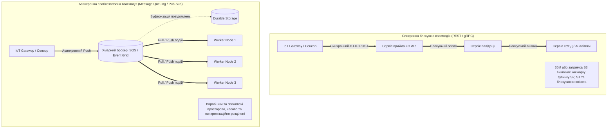
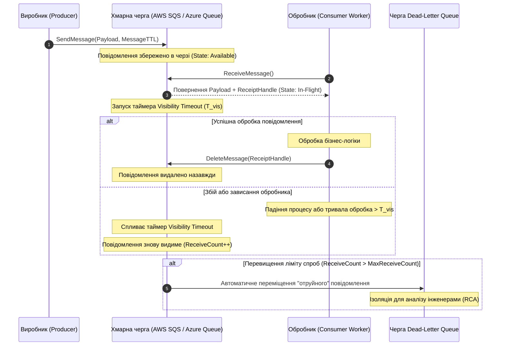
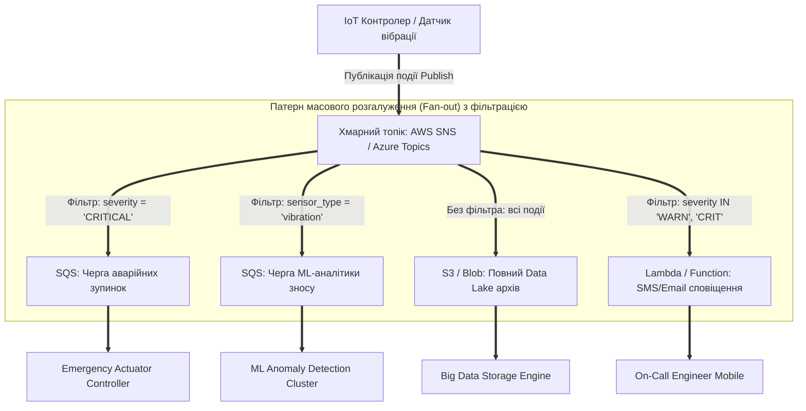
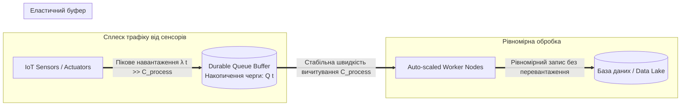

# Змістовий модуль 2. Безсерверні обчислення, Інфраструктура як код (IaC), безпека та аналітика

# Тема 4. Асинхронні комунікації, черги повідомлень та подійні брокери

---

## 4.1. Архітектурні патерни взаємодії в розподілених системах: синхронна (REST/gRPC) проти асинхронної (Message Queuing, Pub/Sub)

### Основний зміст та теоретичний базис

Проєктування сучасних розподілених хмарних систем та кіберфізичних комплексів вимагає вирішення фундаментальної проблеми організації інформаційного обміну між автономними компонентами. У класичній парадигмі програмної інженерії домінують синхронні механізми взаємодії, побудовані за моделлю «запит–відповідь» (**Request-Response**), де клієнтський вузол надсилає повідомлення серверу та блокує власний потік виконання до моменту отримання результату або настання таймауту. 

Типовими представниками синхронного підходу є протоколи **REST (Representational State Transfer)** поверх HTTP/1.1 і HTTP/2, а також високопродуктивний фреймворк **gRPC**, що базується на двійковій серіалізації Protocol Buffers та мультиплексуванні потоків у межах одного TCP-з'єднання. 

Незважаючи на простоту реалізації, детермінованість поведінки та легкість налагодження, синхронна взаємодія створює **жорстку зв'язність (Tight Coupling)** між компонентами системи у трьох вимірах:

1. **Просторова зв'язність (Spatial Coupling)** передбачає, що клієнтський застосунок зобов'язаний точно знати мережеву адресу, порт або дескриптор кінцевої точки (URI/Endpoint) цільового сервера, що вимагає впровадження складних механізмів виявлення сервісів (**Service Discovery**) та балансування навантаження.
2. **Часова зв'язність (Temporal Coupling)** вимагає обов'язкової одночасної доступності та працездатності як відправника, так і отримувача в момент передачі запиту, оскільки тимчасовий збій або перезавантаження сервера призводить до негайної помилки на стороні клієнта.
3. **Синхронізаційна зв'язність (Synchronization Coupling)** зумовлює блокування обчислювальних потоків клієнта, які марнують системні ресурси (пам'ять стеків, дескриптори сокетів) в очікуванні відповіді, знижуючи загальну пропускну здатність вузла.

Головним системним ризиком синхронних архітектур є явище **каскадних збоїв (Cascading Failures)**. Якщо в послідовному ланцюгу мікросервісів один із глибинних компонентів зазнає деградації продуктивності або стає недоступним, затримка обробки починає лавиноподібно поширюватися вгору за стеком викликів, спричиняючи вичерпання пулів з'єднань (**Connection Pool Starvation**) і повний колапс усієї системи.


*Рисунок 4.1 — Топологічне та поведінкове зіставлення синхронної блокуючої та асинхронної брокерної взаємодії*

Альтернативою виступає **асинхронна парадигма взаємодії**, яка реалізується за допомогою проміжного програмного забезпечення обміну повідомленнями (**Message-Oriented Middleware, MOM**) та архітектур, керованих подіями (**Event-Driven Architecture, EDA**). 

В асинхронній моделі компоненти розділяються на **виробників (Producers / Publishers)** та **споживачів (Consumers / Subscribers)**, а зв'язок між ними здійснюється через посередника — **хмарного брокера повідомлень** або **чергу**. Виробник формує повідомлення, відправляє його брокеру, отримує миттєве підтвердження про фіксацію в буфері та продовжує виконання локальних обчислень. Брокер гарантує збереження повідомлення на надійних дискових носіях і доставляє його споживачам у міру їхньої готовності до обробки.

Асинхронний підхід повністю усуває часову, просторову та синхронізаційну зв'язність: компоненти можуть функціонувати з різною швидкістю, масштабуватися незалежно та тимчасово виходити з ладу без втрати даних, оскільки черга виступає надійним еластичним буфером.

Математично надійність функціонування синхронного ланцюга із $n$ залежних сервісів визначається добутком коефіцієнтів доступності кожного вузла:

$$A_{\text{sync\_chain}} = \prod_{i=1}^n A_i$$

де $A_i$ — коефіцієнт готовності $i$-го сервісу (наприклад, при $n = 5$ та $A_i = 0{,}99$ сукупна доступність становить $A_{\text{sync\_chain}} = 0{,}99^5 \approx 0{,}951$, що еквівалентно майже 18 добам простою на рік).

Для асинхронної архітектури з буферизацією в хмарній черзі із власною доступністю $A_{\text{broker}}$ та пулом із $m$ незалежних паралельних обробників доступність системи оцінюється як:

$$A_{\text{async\_system}} = A_{\text{broker}} \cdot \left( 1 - \prod_{j=1}^m (1 - A_{\text{worker}, j}) \right)$$

Оскільки хмарні черги мають вбудовану надлишковість ($A_{\text{broker}} \ge 0{,}9999$), вихід з ладу окремих обробників не зупиняє приймання даних, забезпечуючи високу живучість кіберфізичних комплексів.

*Таблиця 4.1 — Порівняльний аналіз синхронних та асинхронних патернів взаємодії*

| Критерій оцінки | Синхронна модель (REST / gRPC) | Асинхронна модель (Message Queuing / Pub-Sub) |
| :--- | :--- | :--- |
| **Ступінь зв'язності компонентів** | Жорстка просторова, часова та синхронізаційна зв'язність | Повна декомпозиція, слабкий зв'язок (**Loose Coupling**) |
| **Блокування клієнтського потоку** | Повне блокування на час обробки та мережевого транспорту | Відсутнє, миттєве повернення керування після запису в чергу |
| **Стійкість до відмов споживача** | Запит зазнає аварійного збою, вимагає повторів клієнтом | Повідомлення зберігається в черзі до відновлення споживача |
| **Реакція на пікові навантаження** | Вичерпання ресурсів, деградація, скидання з'єднань | Плавне накопичення в буфері без втрати даних (**Smoothing**) |
| **Типові протоколи та технології** | HTTP/1.1, HTTP/2, gRPC, Protobuf, Open-API | AMQP, MQTT, STOMP, AWS SQS/SNS, Azure Service Bus |

---

## 4.2. Хмарні черги повідомлень: AWS SQS, Azure Queue Storage. Семантика доставки (At-least-once, FIFO), механізм Visibility Timeout, Dead-Letter Queues (DLQ)

### Основний зміст та теоретичний базис

**Хмарні черги повідомлень** реалізують патерн зв'язку «точка–точка» (**Point-to-Point**), за якого кожне відправлене повідомлення призначається для обробки рівно одним кінцевим споживачем із пулу доступних обробників. Основними промисловими реалізаціями керованих черг у публічних хмарах є сервіси **Amazon Simple Queue Service (AWS SQS)** та **Azure Queue Storage / Azure Service Bus Queues**.

Архітектура розподіленої черги повідомлень оперує двома основними класами семантики доставки:

1. **Стандартні черги з доставкою «щонайменше один раз» (Standard Queues / At-least-once delivery).** Даний тип черги оптимізовано для досягнення практично необмеженої пропускної здатності (десятки й сотні тисяч транзакцій за секунду) за рахунок горизонтального масштабування та зберігання копій повідомлень на багатьох географічно розподілених серверах брокера. Побічним ефектом розподіленої архітектури є відсутність гарантії суворого хронологічного порядку вичитування повідомлень (**Best-effort ordering**) та ймовірність повторної доставки одного й того ж повідомлення (**Duplicate delivery**). Повторна доставка виникає, якщо підтвердження про видалення повідомлення не встигає синхронізуватися між усіма репліками сховища до завершення таймауту. Відповідно, застосунки, що використовують стандартні черги, зобов'язані реалізовувати властивість **ідемпотентності (Idempotency)** — повторна обробка дубліката не повинна змінювати стан системи чи спотворювати дані.
2. **Черги з суворим порядком FIFO та доставкою «рівно один раз» (FIFO Queues / Exactly-once processing).** Забезпечують суворе збереження послідовності надходження повідомлень («першим прийшов — першим пішов») та унеможливлюють появу дублікатів. Усунення дублікатів реалізується за допомогою унікального ідентифікатора дедуплікації (**Message Deduplication ID**) або автоматичного обчислення хеш-суми SHA-256 від корисного навантаження повідомлення; провайдер зберігає історію ідентифікаторів протягом 5-хвилинного вікна дедуплікації. Для організації паралельної обробки без порушення порядку всередині черги FIFO використовується параметр **Message Group ID**, який розбиває чергу на логічні незалежні підпотоки (наприклад, потік подій окремого датчика `DeviceID`), що обробляються строго послідовно різними потоками споживачів.

Фундаментальним механізмом координації обробки повідомлень у хмарних чергах є **таймаут видимості (Visibility Timeout, $T_{\text{vis}}$)**. На відміну від традиційних брокерів, які видаляють повідомлення одразу після видачі клієнту, хмарна черга реалізує двоетапну модель підтвердження. 


*Рисунок 4.2 — Повний життєвий цикл повідомлення в черзі: обробка, таймаут видимості та маршрутизація до DLQ*

Життєвий цикл повідомлення складається з таких фаз:
* **Запис у чергу (Enqueue):** Виробник викликає API-метод `SendMessage` (AWS SQS) або `PutMessage` (Azure Queue), передаючи корисне навантаження розміром до 64–256 КБ та параметр часу життя **MessageTTL (Time-To-Live)**, який визначає граничний термін зберігання повідомлення в системі (від 1 хвилини до 14 діб).
* **Отримання повідомлення (Receive / Dequeue):** Споживач надсилає запит `ReceiveMessage` або `GetMessages`. Черга повертає тіло повідомлення та генерує динамічний непрозорий ключ операції — **ReceiptHandle** в AWS SQS або **PopReceipt** в Azure Storage.
* **Таймаут видимості (In-Flight State):** Одразу після видачі споживачеві повідомлення не видаляється з черги, а переходить у невидимий стан для інших обробників на час $T_{\text{vis}}$ (за замовчуванням 30 секунд, максимум до 12 годин). Якщо обробнику потрібно більше часу на ресурсомісткі обчислення, він може динамічно продовжувати таймаут за допомогою виклику `ChangeMessageVisibility`.
* **Підтвердження та видалення (Delete / Acknowledge):** У разі успішного завершення обробки споживач надсилає команду `DeleteMessage`, передаючи отриманий раніше `ReceiptHandle` / `PopReceipt`. Сервер перевіряє відповідність ключа і остаточно видаляє повідомлення.
* **Обробка збоїв та повернення в чергу:** Якщо обробник аварійно завершує роботу, зависає або не встигає надіслати підтвердження до моменту вичерпання $T_{\text{vis}}$, повідомлення автоматично стає видимим у черзі знову, і його підхоплює інший доступний вузол.

Для ізоляції аномальних повідомлень, які викликають системні збої коду обробника («отруйні пігулки» — **Poison Pills**), використовується **черга недоставлених повідомлень (Dead-Letter Queue, DLQ)**. Кожного разу, коли повідомлення повторно повертається в чергу після невдалої спроби обробки, системний лічильник `ApproximateReceiveCount` (AWS) або `DequeueCount` (Azure) збільшується на одиницю. Якщо значення лічильника перевищує налаштований поріг максимальної кількості спроб $N_{\text{max\_receive}}$ (**Redrive Policy**), брокер автоматично вилучає повідомлення з основної черги та спрямовує його до DLQ, генеруючи сповіщення для команди DevOps щодо необхідності аудиту та аналізу першопричин збою (**Root Cause Analysis, RCA**).

Відповідно до теорії масового обслуговування (модель Кендалла $M/M/k$), для забезпечення стабільності черги без нескінченного накопичення залишку інтенсивність надходження повідомлень $\lambda$ повинна суворо відповідати умові ергодичності:

$$\rho = \frac{\lambda}{k \cdot \mu} < 1$$

де $\lambda$ — швидкість надходження повідомлень у чергу від пристроїв КФС (повідомлень/с), $k$ — кількість паралельно працюючих інстансів-обробників, $\mu$ — середня продуктивність одного обробника (повідомлень/с), $\rho$ — коефіцієнт завантаження системи масового обслуговування.

Мінімально безпечне значення таймауту видимості $T_{\text{vis\_min}}$ для запобігання передчасній повторній обробці активного завдання розраховується за формулою:

$$T_{\text{vis\_min}} = \overline{t}_{\text{proc}} + 3 \cdot \sigma_{t} + 2 \cdot RTT_{\text{net}}$$

де $\overline{t}_{\text{proc}}$ — математичне сподівання часу обробки одного повідомлення (у секундах), $\sigma_{t}$ — середньоквадратичне відхилення тривалості обробки, $RTT_{\text{net}}$ — кругова затримка мережевого зв'язку (Round-Trip Time) між обробником та API хмарної черги.

*Таблиця 4.2 — Систематизація характеристик сервісів черг AWS та Azure*

| Технічний параметр | AWS SQS Standard | AWS SQS FIFO | Azure Queue Storage | Azure Service Bus Queue |
| :--- | :--- | :--- | :--- | :--- |
| **Гарантія порядку** | Best-effort (без гарантії) | Суворе FIFO (за групами) | Best-effort (без гарантії) | Суворе FIFO (через Sessions) |
| **Пропускна здатність** | Практично необмежена | До 3000 msg/s (з батчингом) | До 20 000 msg/s на чергу | Висока (залежить від Premium tier) |
| **Максимальний розмір** | 256 КБ (до 2 ГБ через S3) | 256 КБ (до 2 ГБ через S3) | 64 КБ (на повідомлення) | 256 КБ (Standard) / 100 МБ (Premium) |
| **Максимальний час життя (TTL)** | 14 діб (за замовчуванням 4 доби) | 14 діб | 7 діб (або нескінченно) | Довільний / Нескінченний |
| **Механізм ізоляції збоїв** | Redrive Policy -> SQS DLQ | Redrive Policy -> SQS FIFO DLQ | Програмне перенесення за DequeueCount | Вбудована системна черга `$DeadLetterQueue` |

---

## 4.3. Патерни публікації-підписки (Pub/Sub): AWS SNS, Azure Service Bus Topics, Event Grid. Фільтрація повідомлень та масове розсилання

### Основний зміст та теоретичний базис

Для побудови широкомасштабних розподілених середовищ, де одна й та сама подія повинна паралельно ініціювати незалежні бізнес-процеси у різних підсистемах, застосовується патерн **«Публікація–Підписка» (Publish-Subscribe / Pub/Sub)** або патерн розгалуження **Fan-out**. На відміну від черги, де повідомлення конкурують за одного обробника, у моделі Pub/Sub брокер тиражує кожне вхідне повідомлення всім зацікавленим отримувачам, реалізуючи зв'язок «один–до–багатьох» (**One-to-Many**).


*Рисунок 4.3 — Реалізація патерну Fan-out із декларативною фільтрацією повідомлень для кіберфізичної системи*

Ключовими сервісами реалізації парадигми Pub/Sub у провідних хмарних платформах є:

1. **Amazon Simple Notification Service (AWS SNS).** Високодоступний веб-сервіс обміну повідомленнями, який забезпечує миттєву доставку подій від видавців до підписників. Як кінцеві точки (підписники) можуть виступати черги AWS SQS, безсерверні функції AWS Lambda, виклики Webhooks (HTTP/HTTPS), адреси електронної пошти, а також сервіси надсилання мобільних push-повідомлень і SMS.
2. **Топіки Azure Service Bus (Azure Service Bus Topics & Subscriptions).** Промисловий брокер повідомлень корпоративного рівня, що підтримує роботу з транзакціями, протокол AMQP 1.0, сесії збереження стану, упорядковану доставку та інтелектуальну маршрутизацію. Кожна підписка на топік діє як віртуальна черга, накопичуючи копії повідомлень, адресованих конкретному підрозділу чи сервісу.
3. **Azure Event Grid.** Реактивний хмарний сервіс маршрутизації подій, оптимізований для побудови реактивних безсерверних архітектур. Event Grid повністю підтримує відкритий стандарт **CNCF CloudEvents**, орієнтований на передачу дискретних сигналів про зміну стану ресурсів (наприклад, створення нового файлу в Blob Storage або спрацювання тригера аварії датчика) з екстремально низькою затримкою та пропускною здатністю до мільйонів подій за секунду.

Критично важливою функцією сучасних систем Pub/Sub є **декларативна фільтрація повідомлень на стороні брокера (Subscription Filter Policies)**. Без фільтрації всі повідомлення топіка надсилалися б усім підписникам, що призводило б до надмірного споживання обчислювальних ресурсів, перевантаження мережі та збільшення вартості за рахунок непотрібних викликів функцій. 

Фільтрація базується на аналізі метаданих (**Message Attributes**) у форматі JSON без необхідності розпакування самого тіла повідомлення:

```json
{
  "sensor_type": ["vibration", "temperature"],
  "severity": ["CRITICAL"],
  "telemetry_metrics": {
    "pressure_kpa": [{ "numeric": [">=", 500] }]
  }
}
```

Якщо атрибути повідомлення відповідають заданому предикату, брокер копіює його у відповідну підписку; в іншому разі повідомлення відкидається для даного підписника без нарахування плати за доставку.

Сумарна смуга вихідного трафіку топіка $BW_{\text{fanout}}$, що транслює події від $M_{\text{topics}}$ джерел до пулу підписників, математично виражається як:

$$BW_{\text{fanout}} = \sum_{j=1}^{M_{\text{topics}}} \left( \lambda_j \cdot S_{\text{msg}, j} \cdot \sum_{i=1}^{K_j} P(\text{match}_{j, i}) \right)$$

де $\lambda_j$ — частота публікації повідомлень у $j$-му топіку (повідомлень/с), $S_{\text{msg}, j}$ — середній розмір повідомлення (у байтах), $K_j$ — загальна кількість підписок, зареєстрованих для $j$-го топіка, $P(\text{match}_{j, i})$ — ймовірність успішного спрацювання предикату фільтрації для $i$-ї підписки ($0 \le P(\text{match}_{j, i}) \le 1$).

*Таблиця 4.3 — Порівняльний аналіз провідних технологій класу Pub/Sub та подійних брокерів*

| Характеристика | AWS SNS | Azure Service Bus Topics | Azure Event Grid | Apache Kafka / AWS MSK |
| :--- | :--- | :--- | :--- | :--- |
| **Архітектурна модель** | Класичний Fan-out Pub/Sub | Enterprise Service Broker | Реактивна маршрутизація подій | Розподілений журнал подій (Event Log) |
| **Модель споживання** | Push (доставка на кінцеву точку) | Push / Pull (через Subscriptions) | Суворий Push на вебхуки / FaaS | Pull (зчитування за курсором Offset) |
| **Збереження історії подій** | Відсутнє (повідомлення не зберігаються) | Тимчасове в межах TTL підписки | Тимчасове (до 24 годин із повторами) | Тривале / Постійне (Retention policy) |
| **Фільтрація подій** | JSON-політики за атрибутами | SQL-подібні фільтри (`SQLFilter`) | Розширена фільтрація за схемою JSON | Обробка клієнтом або Kafka Streams |
| **Основний сценарій застосування** | Масові сповіщення, Fan-out на черги | Складні транзакційні бізнес-потоки | Безсерверна реактивна оркестрація | Обробка масивних потоків Big Data / IoT |

---

## 4.4. Компенсація стрибків навантаження (Traffic Spikes) та буферизація телеметрії кіберфізичних систем. Модель узгодженості даних (BASE проти ACID)

### Основний зміст та теоретичний базис

Специфіка функціонування кіберфізичних систем (розумних енергомереж Smart Grid, автономного транспорту, розподілених промислових комплексів) полягає у вираженій нерівномірності генерації телеметричних даних. За звичайних умов сенсори передають стабільний фоновий потік параметрів. Проте при виникненні нештатних ситуацій, аварій на лініях або одночасній передачі діагностичних звітів тисячами пристроїв виникають екстремальні сплески трафіку (**Traffic Spikes / Message Storms**).

Якщо вхідний потік даних надсилається безпосередньо до аналітичних баз даних або сервісів обробки, виникає загроза перевантаження обчислювальних потужностей. База даних вичерпує ліміти відкритих з'єднань, час відповіді різко зростає, а нові пакети телеметрії починають масово відкидатися, створюючи небезпечні «сліпі зони» в системі оперативного керування.

Для розв'язання цієї проблеми застосовується архітектурний патерн **вирівнювання навантаження на основі черг (Queue-Based Load Leveling)**. Черга повідомлень інтегрується між джерелами телеметрії та сервісами обробки, виконуючи роль демпфера (амортизатора навантаження). 

Виробники записують пакети в чергу з миттєвою швидкістю, що дорівнює інтенсивності вхідного потоку $\lambda(t)$, а група обробників (Workers) вичитує дані з постійною, контрольованою швидкістю $C_{\text{process}}$, оптимізованою під максимальну пропускну здатність сховища даних.


*Рисунок 4.4 — Схема згладжування пікового навантаження (Peak Shaving) за допомогою хмарної черги*

Динаміка накопичення обсягу повідомлень у черзі $Q(t)$ під час сплеску трафіку тривалістю від $t_0$ до $t_1$, коли $\lambda(t) > k \cdot \mu$, математично описується інтегральним виразом:

$$Q(t) = Q(t_0) + \int_{t_0}^t \left( \lambda(\tau) - k \cdot \mu \right) d\tau$$

де $Q(t_0)$ — початковий стан черги на момент початку сплеску (кількість повідомлень), $\lambda(\tau)$ — миттєва функція інтенсивності надходження телеметрії, $k \cdot \mu = C_{\text{process}}$ — сукупна продуктивність обробки всіма активними вузлами.

Максимальна місткість буфера $Q_{\text{max}}$ повинна задовольняти обмеження дискової квоти черги:

$$Q_{\text{max}} = \max_{t \in [t_0, t_1]} Q(t) \le \text{Capacity}_{\text{queue}}$$

Час повного спорожнення черги та повернення системи до штатного стану після закінчення сплеску навантаження в момент $t_1$ розраховується як:

$$T_{\text{drain}} = \frac{Q(t_1)}{k \cdot \mu - \lambda_{\text{normal}}}$$

де $\lambda_{\text{normal}}$ — стала фонова інтенсивність трафіку в штатному режимі ($\lambda_{\text{normal}} < k \cdot \mu$).

Перехід від синхронних транзакцій до асинхронної брокерної архітектури кардинально змінює підходи до забезпечення цілісності інформації, зумовлюючи протистояння двох моделей узгодженості даних: **ACID** та **BASE**.

Класичні реляційні системи вимагають підтримки транзакційних властивостей **ACID** (**A**tomicity, **C**onsistency, **I**solation, **D**urability). Для забезпечення суворої узгодженості в розподіленому середовищі реляційні СУБД використовують протокол двофазної фіксації (**Two-Phase Commit, 2PC**) та розподілені песимістичні блокування. Відповідно до **теореми CAP Еріка Брюера**, у розподіленій системі неможливо одночасно гарантувати всі три властивості: узгодженість даних (**C**onsistency), доступність (**A**vailability) та стійкість до розривів зв'язку (**P**artition tolerance). 

Оскільки в глобальних хмарних середовищах мережеві затримки та розриви зв'язку є неминучими ($P = \text{True}$), жорстка вимога узгодженості ($C$) змушує систему блокувати операції запису, тобто жертвувати доступністю ($A$), що є неприпустимим для безперервних процесів кіберфізичних комплексів.

Хмарні асинхронні архітектури базуються на моделі **BASE**, яка обирає компроміс на користь високої доступності ($AP$-системи):

* **Базова доступність (Basically Available).** Система гарантує доступність для виконання операцій читання та запису навіть у разі відмови частини вузлів або розриву мережевих сегментів; замість повної відмови система може повертати часткові дані або зберігати транзакцію в проміжній черзі.
* **Гнучкий стан (Soft State).** Стан системи може змінюватися з часом навіть за відсутності нових вхідних запитів, оскільки повідомлення перебувають у процесі асинхронної передачі між брокерами та репліками.
* **Узгодженість у кінцевому підсумку (Eventual Consistency).** Система не гарантує негайної синхронної узгодженості на всіх вузлах у момент фіксації операції. Проте гарантується, що за відсутності нових змін усі репліки та пов'язані сховища через певний проміжок часу $\Delta t_{\text{convergence}}$ отримають надіслані повідомлення та перейдуть у повністю ідентичний, узгоджений стан.

*Таблиця 4.4 — Порівняльний аналіз моделей узгодженості даних ACID та BASE у хмарних застосунках*

| Характеристика | Транзакційна модель ACID | Подійна модель BASE |
| :--- | :--- | :--- |
| **Пріоритет за теоремою CAP** | Сувора узгодженість і стійкість ($CP$) | Максимальна доступність і стійкість ($AP$) |
| **Тип узгодженості даних** | Миттєва сильна узгодженість (Strong Consistency) | Узгодженість у кінцевому підсумку (Eventual Consistency) |
| **Механізм ізоляції** | Песимістичні блокування таблиць, рядків, MVCC | Оптимістичне блокування через версії/ETag, черги |
| **Вплив на доступність** | Блокування операцій при збоях мережі | Безперервне приймання запитів у буфер |
| **Масштабованість** | Обмежена (складність координації 2PC) | Практично лінійна горизонтальна масштабованість |
| **Сфера застосування в КФС** | Фінансові транзакції, білінг, юридичний аудит | Збирання телеметрії сенсорів, моніторинг, IoT |

---

### Питання для самоперевірки та аналітичного осмислення

1. Проаналізуйте причини виникнення явища «каскадного збою» в мікросервісних системах із синхронною взаємодією за протоколом REST. Яким чином перехід до асинхронного обміну повідомленнями усуває просторову, часову та синхронізаційну зв'язність компонентів?
2. Порівняйте стандартні черги AWS SQS із чергами класу FIFO. Чому стандартні черги забезпечують вищу пропускну здатність, і за рахунок яких механізмів забезпечується властивість ідемпотентності на стороні обробника повідомлень?
3. Детально опишіть функціонування механізму Visibility Timeout у хмарних чергах повідомлень. Що відбувається з повідомленням, якщо процес-обробник зависає або перевищує виділений ліміт часу виконання, і яку роль у цьому процесі відіграє параметр ReceiptHandle?
4. Розкрийте призначення та алгоритм переміщення повідомлень до черги недоставлених повідомлень (Dead-Letter Queue, DLQ). Які метрики системи моніторингу дозволяють виявити наявність «отруйних пігулок» (Poison Pills) у черзі?
5. Зіставте патерни Point-to-Point та Publish-Subscribe (Fan-out). У яких випадках при обробці телеметрії кіберфізичних систем доцільно використовувати декларативну фільтрацію повідомлень на рівні підписок брокера AWS SNS або Azure Topics?
6. Виведіть інтегральну залежність динаміки накопичення черги $Q(t)$ під час раптового сплеску навантаження. За якими формулами розраховується мінімально необхідна кількість обробників для спорожнення буфера за нормативний час $T_{\text{drain}}$?
7. Поясніть концептуальні відмінності між моделями узгодженості даних ACID та BASE у контексті теореми CAP. Чому для збирання високошвидкісної сенсорної телеметрії промислових інтернет-речей перевага надається моделі Eventual Consistency?