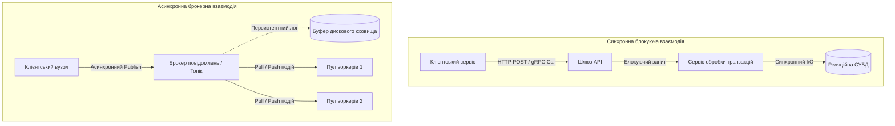
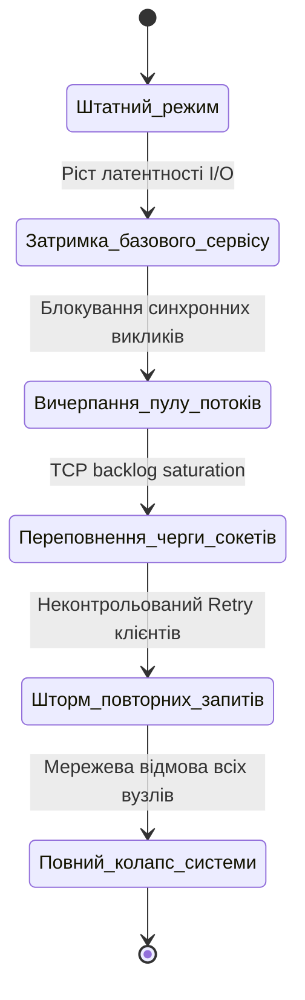
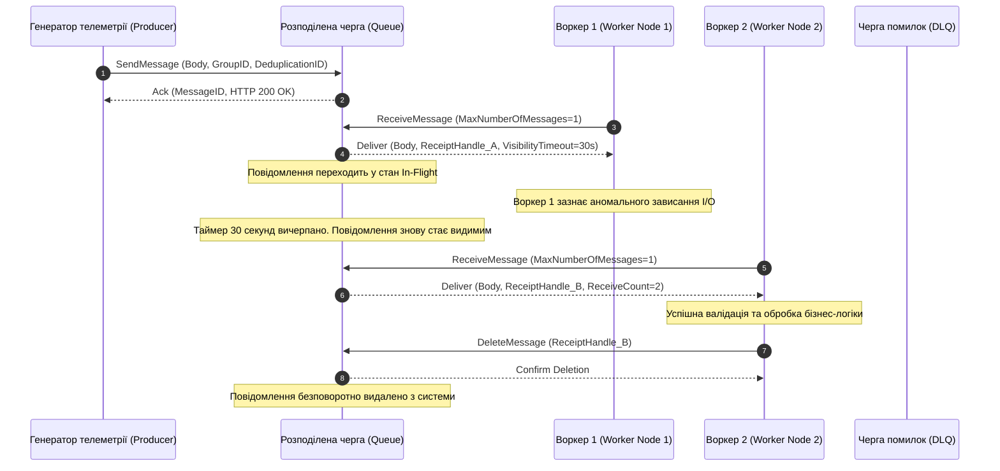
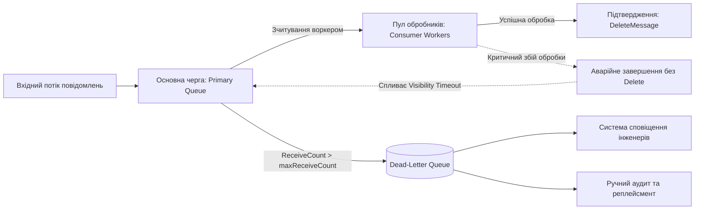
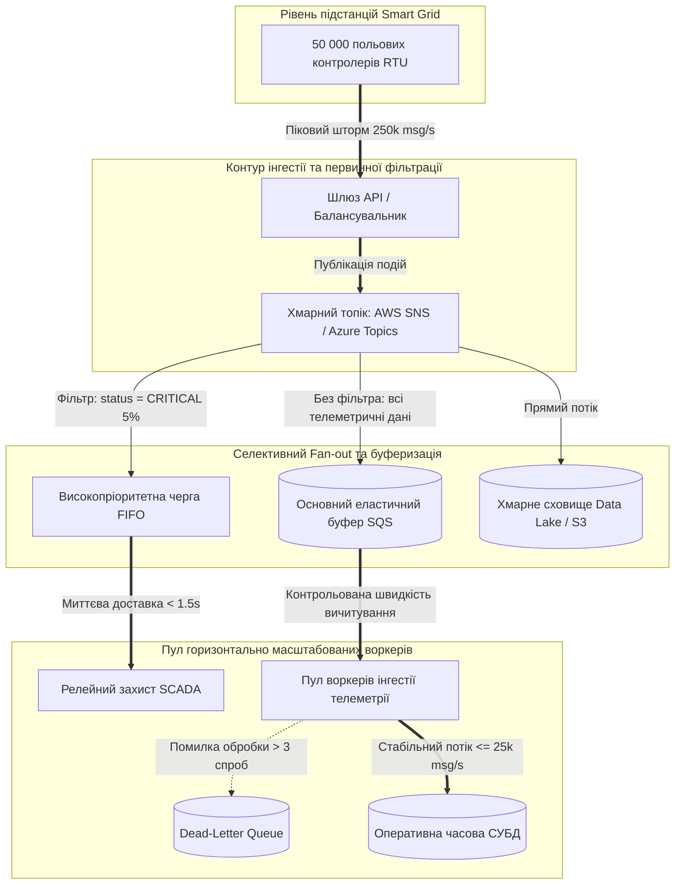

# Тема 4. Асинхронні комунікації, черги повідомлень та подійні брокери

## Мета лекції
Формування у майбутніх інженерів комп'ютерних систем поглиблених теоретичних знань і прикладних інженерних компетентностей щодо проектування, декомпозиції та оптимізації високопродуктивних асинхронних комунікаційних середовищ на базі керованих черг повідомлень і брокерів подій. Навчальний матеріал спрямований на системне опанування методів усунення просторової, часової та синхронізаційної зв'язності мікросервісних компонентів, математичного моделювання процесів згладжування імпульсних сплесків трафіку телеметрії в кіберфізичних комплексах, розрахунку часових параметрів обробки з гарантіями стійкості до відмов, а також практичного переходу від синхронних транзакційних парадигм ACID до моделей узгодженості в кінцевому підсумку BASE у розподілених хмарних інфраструктурах.

## Очікувані результати навчання
1. **Знання та розуміння.** Здобувачі вищої освіти повинні засвоїти фундаментальні концепції організації асинхронного інформаційного обміну, розуміти природу просторової, часової та синхронізаційної декомпозиції компонентів у порівнянні з синхронними протоколами виклику процедур, а також володіти математичним апаратом розрахунку надійності послідовних блокуючих ланцюгів і паралельних буферизованих контурів розподілених систем.
2. **Застосування.** Студенти повинні вміти розраховувати оптимальну тривалість таймауту видимості повідомлень, налаштовувати параметри дедуплікації в чергах FIFO, конфігурувати політики переспрямування до черг недоставлених повідомлень і складати декларативні JSON-фільтри атрибутів для патерну масового розгалуження подій у хмарних платформах AWS та Microsoft Azure.
3. **Аналіз.** Слухачі мають навчитися досліджувати динаміку накопичення черги під час імпульсних навантажень за допомогою інтегральних моделей та апарату теорії масового обслуговування, виявляти критичні умови блокування обробників «отруйними повідомленнями», а також діагностувати ризики каскадних збоїв і вичерпання пулів з'єднань у гетерогенних мережевих топологіях.
4. **Оцінювання та синтез.** Майбутні інженери повинні критично оцінювати межі застосовності моделей узгодженості даних ACID та BASE з огляду на теорему CAP Еріка Брюера, обґрунтовувати вибір між семантиками доставки при проектуванні високонавантажених сервісів, а також синтезувати стійкі до відмов архітектурні рішення для буферизації та первинної агрегації високочастотної телеметрії кіберфізичних систем.

---

## Детальний покроковий план лекції

### 1. Теоретико-концептуальний базис. Архітектурні моделі міжкомпонентної взаємодії та формалізація надійності розподілених систем
* 1.1. Просторова, часова та синхронізаційна зв'язність компонентів у парадигмах синхронної взаємодії (REST поверх HTTP/1.1-2, gRPC на базі Protocol Buffers) та асинхронного обміну повідомленнями.
* 1.2. Механізми виникнення каскадних відмов, лавиноподібного вичерпання пулів з'єднань і деградації пропускної здатності в розподілених сервіс-орієнтованих середовищах.
* 1.3. Математична формалізація доступності послідовного синхронного ланцюга сервісів проти асинхронного контуру з еластичним буфером.
* 1.4. Еволюція механізмів обчислювального зв'язку від низькорівневих сокетів і RPC до брокерів проміжного програмного забезпечення з гарантіями персистентності.

### 2. Методологія та аналіз граничних умов. Проектування черг повідомлень, семантика доставки та амортизація навантаження кіберфізичних систем
* 2.1. Життєвий цикл повідомлення, порівняння семантик At-least-once та FIFO, математичні механізми дедуплікації на основі часових вікон та забезпечення ідемпотентності споживачів.
* 2.2. Формалізація та розрахунок мінімально безпечного таймауту видимості (Visibility Timeout), маркерів доступу та оцінка коефіцієнта завантаження системи за моделлю Кендалла $M/M/k$.
* 2.3. Архітектура ізоляції збійних завдань за допомогою Dead-Letter Queues (DLQ), аналіз причин виникнення «отруйних повідомлень» та метрики моніторингу черг.
* 2.4. Патерн масового розгалуження Fan-out, декларативна фільтрація повідомлень за метаданими в AWS SNS та Azure Service Bus Topics, інтеграція з реактивними шинами стандарту CloudEvents.
* 2.5. Критичні бар'єри та граничні умови теореми CAP: затримки конвергенції розподіленого стану в моделі BASE (Eventual Consistency) як альтернатива блокуючим протоколам двохфазної фіксації транзакцій ACID.

### 3. Практичний індустріальний / фаховий кейс. Проектування асинхронного контуру обробки телеметрії розподіленої енергомережі
**Тема наскрізної задачі.** «Розробка відмовостійкої хмарної шини буферизації та селективної маршрутизації телеметричних потоків 50 000 підстанцій Smart Grid в умовах аварійного шторму повідомлень»

## 1. Теоретико-концептуальний базис. Архітектурні моделі міжкомпонентної взаємодії та формалізація надійності розподілених систем

### 1.1. Просторова, часова та синхронізаційна зв'язність компонентів у парадигмах взаємодії

Проєктування розподілених систем та високонавантажених обчислювальних комплексів базується на вирішенні фундаментальної інженерної задачі: організації інформаційного зв'язку між незалежними функціональними вузлами. У сучасній комп'ютерній інженерії виділяють дві полярні парадигми міжкомпонентного обміну: синхронну, що функціонує за моделлю «запит–відповідь», та асинхронну, побудовану на посередництві черг або подійних шин даних. Оцінка ефективності кожної моделі вимагає декомпозиції зв'язності компонентів на три ортогональні виміри: просторовий, часовий та синхронізаційний.

У межах синхронної парадигми взаємодії програмний клієнт генерує пряме звернення до сервера за протоколами **REST (Representational State Transfer)** поверх HTTP/1.1 або HTTP/2, чи за допомогою бінарного фреймворку **gRPC**, що спирається на серіалізацію Protocol Buffers і мультиплексування потоків у межах однієї TCP-сесії. Така організація накладає жорсткі системні обмеження. **Просторова зв'язність** вимагає від клієнтського вузла точного володіння мережевою топологією: IP-адресою, портом або канонічним DNS-іменем цільового сервісу. Навіть за умови використання динамічних реєстрів і балансувальників навантаження клієнт спрямовує трафік на конкретну віртуальну точку входу. **Часова зв'язність** диктує необхідність одночасного перебування відправника та отримувача в активному працездатному стані, оскільки тимчасовий збій або перезавантаження сервера призводить до аварійного завершення транзакції. **Синхронізаційна зв'язність** призводить до блокування виклику: потік операційної системи або віртуальний потік середовища виконання переходить у режим очікування системного переривання вводу-виводу, утримуючи контекст, дескриптор сокета та виділену оперативну пам'ять стека.

На противагу цьому, асинхронний інформаційний обмін через проміжне програмне забезпечення (**Message-Oriented Middleware**) розриває всі три типи залежностей. **Виробник повідомлення** лише фіксує пакет у локальному або віддаленому буфері брокера, не знаючи про кількість, мережеві координати та поточний стан кінцевих споживачів. Повна просторова ізоляція досягається абстракцією каналу або топіка. Часова ізоляція забезпечує функціонування системи в умовах, коли споживач офлайн: повідомлення зберігається в персистентному сховищі черги до моменту відновлення працездатності обробника. Синхронізаційна автономність гарантує, що клієнтський потік повертається до пулу виконання негайно після отримання мережевого підтвердження про запис пакета в буфер черги, не очікуючи виконання трудомісткої бізнес-логіки.



> **ПРАКТИЧНИЙ ЯКІР:** Архітектурний перехід потокового сервісу Netflix від синхронних каскадних викликів REST до реактивної взаємодії через брокери подій дозволив скоротити споживання пам'яті фронтенд-серверами на сорок відсотків завдяки ліквідації сотень тисяч заблокованих потоків введення-виведення, які раніше простоювали в очікуванні відповідей від глибинних сервісів рекомендацій.

---

### 1.2. Механізми каскадних відмов, лавиноподібного вичерпання пулів з'єднань і деградації систем

Найбільш руйнівним наслідком жорсткої зв'язності в розподілених сервіс-орієнтованих архітектурах є виникнення **каскадних відмов (Cascading Failures)**. Розподілена система, побудована виключно на синхронних викликах, володіє характеристиками послідовного ланцюга: деградація продуктивності або відмова одного глибинного компонента лавиноподібно паралізує всю ієрархію сервісів, що викликають його.

Механіка розвитку системного колапсу розгортається наступним чином. Якщо сервіс нижнього рівня стикається з блокуванням таблиць бази даних або надмірним навантаженням на процесор, час його відповіді зростає від умовних десяти мілісекунд до десятків секунд. Сервіси вищого рівня, звертаючись до нього синхронно, не отримують швидкої відповіді та змушені утримувати відкритими вихідні TCP-з'єднання. Оскільки кількість потоків у пулі обробки веб-сервера обмежена апаратними можливостями системи, настає **вичерпання пулу потоків (Thread Pool Starvation)**. Коли всі потоки блокуються на викликах до завислого сервісу, веб-сервер припиняє обробляти навіть ті запити, які ніяк не пов'язані зі збійним модулем. 

Далі проблема виходить на мережевий рівень. Буфери сокетів операційної системи переповнюються, черга незавершених з'єднань стека TCP (параметр `backlog`) заповнюється повністю, і ядро операційної системи починає скидати вхідні пакети SYN або відповідати пакетами TCP RST. Клієнтські застосунки, отримуючи помилки таймауту, автоматично активують механізми повторних спроб (**Retries**). Без використання експоненційного відступу та випадкової затримки лавина повторних запитів створює так званий шторм запитів (**Retry Storm**), який остаточно добиває напівживий сервіс, не дозволяючи йому відновити нормальне функціонування навіть після зниження фонового навантаження.



> **ТИПОВА ПОМИЛКА:** Поширена інженерна помилка полягає у переконанні, що встановлення агресивних коротких таймаутів на рівні HTTP-клієнта повністю захищає систему від каскадного краху. На практиці, якщо клієнти при виникненні таймауту негайно і синхронно надсилають повторний запит, сумарне навантаження на систему лише подвоюється, перетворюючи локальну затримку на повномасштабну розподілену атаку на власну інфраструктуру.

---

### 1.3. Математична формалізація надійності та доступності систем

Для кількісної оцінки стійкості розподіленої архітектури в комп'ютерній інженерії застосовується теорія надійності та аналіз доступності. Нехай розподілена система складається з $n$ взаємозалежних функціональних сервісів. Доступність окремого $i$-го вузла $A_i$ визначається через середній час безвідмовної роботи (**Mean Time Between Failures, MTBF**) та середній час відновлення (**Mean Time To Repair, MTTR**):

$$A_i = \frac{\text{MTBF}_i}{\text{MTBF}_i + \text{MTTR}_i}$$

У синхронній послідовній архітектурі, де виконання операції вимагає успішної та одночасної відповіді від кожного з $n$ компонентів у ланцюгу, збій хоча б одного вузла призводить до загальної відмови транзакції. Відповідно, результуюча доступність синхронного ланцюга обчислюється як добуток індивідуальних доступностей:

$$A_{\text{sync}} = \prod_{i=1}^{n} A_i$$

Якщо розглянути синхронну систему з п'яти мікросервісів ($n = 5$), кожен з яких має високий показник доступності три дев'ятки ($A_i = 0{,}999$, що допускає близько 8,7 години простою на рік), то підсумкова доступність ланцюга складе:

$$A_{\text{sync}} = 0{,}999^5 \approx 0{,}995$$

Зниження доступності до показника $0{,}995$ еквівалентне збільшенню сукупного часу відмови системи до 43,8 години на рік, що демонструє катастрофічне падіння надійності зі зростанням глибини синхронного виклику.

В асинхронній архітектурі взаємодія розривається за допомогою розподіленої черги або брокера, надійність якого забезпечується надлишковим кластером зі власною доступністю $A_{\text{broker}} \ge 0{,}9999$. Якщо обробку виконує горизонтально масштабований пул із $m$ незалежних воркерів, система залишається працездатною доти, доки функціонує брокер і хоча б один обробник. Доступність асинхронного контуру описується математичною моделлю паралельних систем:

$$A_{\text{async}} = A_{\text{broker}} \cdot \left( 1 - \prod_{j=1}^{m} (1 - A_{\text{worker}, j}) \right)$$

За умови $m = 3$ воркерів з індивідуальною доступністю $A_{\text{worker}} = 0{,}95$ і доступності брокера $A_{\text{broker}} = 0{,}9999$, сукупна доступність обчислювального контуру досягає:

$$A_{\text{async}} = 0{,}9999 \cdot \left( 1 - (1 - 0{,}95)^3 \right) = 0{,}9999 \cdot (1 - 0{,}000125) \approx 0{,}99977$$

Окрім коефіцієнта доступності, критичним фактором синхронних ланцюгів є деградація затримок за квантилями вищих порядків (так звана проблема хвостової латентності — **Tail Latency Amplification**). Якщо час виконання операції окремим сервісом є випадковою величиною, то ймовірність того, що хоча б один із $n$ послідовних сервісів продемонструє затримку рівня дев'яносто дев'ятого перцентиля $p = 0{,}01$, виражається формулою:

$$P(\text{latency} > L_{99}) = 1 - (1 - p)^n$$

При $n = 50$ послідовних або паралельно очікуваних синхронних викликах ймовірність затримки всієї транзакції на рівні найгіршого показника сягає:

$$P(\text{latency} > L_{99}) = 1 - (1 - 0{,}01)^{50} = 1 - 0{,}605 = 0{,}395$$

Таким чином, майже сорок відсотків усіх користувацьких запитів зазнаватимуть максимальних затримок, навіть якщо кожен окремий сервіс у 99% випадків працює ідеально швидко. В асинхронних системах з чергами буферизація повністю нівелює цей ефект для відправника, обмежуючи затримку клієнта виключно часом фіксації повідомлення в брокері.

> **ПРАКТИЧНИЙ ЯКІР:** У розподіленій транзакційній підсистемі Amazon DynamoDB операції реплікації метаданих були переведені з синхронного протоколу двофазної фіксації на асинхронну модель фіксації змін у внутрішньому черговому журналі, що знизило значення дев'яносто дев'ятого перцентиля затримки (p99) з 850 мілісекунд до стабільних 12 мілісекунд у пікові періоди навантаження.

---

### 1.4. Еволюція механізмів зв'язку: від низькорівневих сокетів до персистентних брокерів

Еволюція розподілених комп'ютерних систем відображає постійне зростання рівня абстракції комунікаційного шару та поступове зміщення акценту від передачі сирих байтових потоків до управління станами та подіями. 

Початковий етап розвитку базувався на **сокетах Берклі (BSD Sockets)**, що надавали низькорівневий інтерфейс до транспортних протоколів TCP і UDP. Робота на цьому рівні вимагала від системного інженера ручного управління життєвим циклом дескрипторів, фрагментацією пакетів, перетворенням порядку байтів (мережевий проти хостового), реалізації власних прикладних протоколів та самостійного кодування логіки відновлення розірваних сесій.

Наступним кроком стала концепція **віддаленого виклику процедур (Remote Procedure Call, RPC)**, формалізована Бірреллом і Нельсоном у 1984 році. Метою RPC було створення повної ілюзії локального виклику функції: генерація клієнтських заглушок (**Stubs**) та серверних скелетів (**Skeletons**) дозволила автоматизувати маршалінг і демаршалінг параметрів. Проте RPC-підхід приховував фундаментальну відмінність між локальною пам'яттю та ненадійною мережею, що призводило до помилок у разі втрати пакетів або падіння сервера під час виконання віддаленої операції. 

Розвиток об'єктно-орієнтованого програмування зумовив появу компонентних моделей розподілених об'єктів — **CORBA**, **DCOM** та **Java RMI**. Вони надали можливість передавати за посиланням складні програмні екземпляри, але створили надзвичайно громіздку, платформозалежну інфраструктуру, критично чутливу до версійності та конфігурації мережевих екранів.

На початку 2000-х років відбувся перехід до сервісно-орієнтованої архітектури (**SOA**) та протоколу **SOAP**, що використовував формалізовані описи **WSDL** та розмітку **XML** поверх HTTP. Незважаючи на стандартизацію корпоративних шин даних (**Enterprise Service Bus, ESB**), великі накладні витрати на парсинг XML-повідомлень змусили індустрію мігрувати до архітектурного стилю **REST** на базі нотації **JSON**, а в системах з критичними вимогами до затримок — до бінарного **gRPC**. Проте всі ці технології залишалися заручниками синхронної природи запиту-відповіді.

Сучасний етап еволюції знаменується домінуванням систем обміну повідомленнями з гарантованою персистентністю (**Message-Oriented Middleware** та **Distributed Commit Logs**). Сучасні брокери (RabbitMQ, Apache Kafka, Apache Pulsar, хмарні сервіси AWS SQS, Azure Service Bus) не просто передають дані, а беруть на себе функції довготривалого збереження, гарантії семантики доставки, реплікації інформації між зонами доступності та захисту внутрішніх сервісів від неконтрольованих сплесків вхідного навантаження.

| Парадигма взаємодії | Протокольний базис та серіалізація | Ступінь зв'язності компонентів | Приклад з реальної практики |
| :--- | :--- | :--- | :--- |
| **Мережеві сокети (Raw Sockets)** | Сирі TCP-потоки, дейтаграми UDP, бінарні структури C/C++ | Екстремально висока просторова, часова та структурна | Промислові драйвери польових шин у SCADA-системах реального часу |
| **Класичний RPC (ONC RPC, DCE)** | XDR, бінарне кодування, прив'язка до портів через Portmapper | Висока просторова та часова, блокуючий клієнтський виклик | Мережева файлова система NFSv3 для монтування сховищ у Linux |
| **Розподілені об'єкти (CORBA, RMI)** | IIOP, JRMP, протоколи віддаленого управління життєвим циклом | Критична часова та програмна залежність від середовища | Старі банківські ядра обробки транзакцій початку 2000-х років |
| **Синхронні веб-сервіси (REST, gRPC)** | Текстовий JSON по HTTP/1.1-2, Protocol Buffers по HTTP/2 | Просторова (через DNS), висока часова та синхронізаційна | Внутрішня мікросервісна взаємодія сервісів авторизації та білінгу |
| **Черги повідомлень (Message Queues)** | AMQP 0-9-1/1.0, STOMP, специфічні бінарні та REST API брокерів | Повна відсутність просторової, часової та блокуючої зв'язності | Асинхронне кодування відеоматеріалів на платформі YouTube |
| **Розподілені журнали подій (Event Streaming)** | Спеціалізовані бінарні TCP-протоколи поверх апендного логу | Абсолютна автономність, паралельне вичитування багатьма групами | Обробка клікстріму та моніторинг фінансового фроду в реальному часі |

> **КОНТРОЛЬНЕ ПИТАННЯ:** Чому впровадження пулу паралельних неблокуючих потоків (наприклад, архітектури на базі epoll або фреймворків Netty/Node.js) на клієнтському вузлі вирішує проблему синхронізаційної зв'язності, але виявляється повністю безсилим проти часової та просторової зв'язності при використанні синхронного REST-протоколу?

<details markdown="1">
<summary>Розгорнути аналіз / відповідь</summary>

**Правильний варіант: Неблокуючий ввід-вивід вивільняє системні ресурси клієнта, але не усуває залежність від доступності та локації сервера.**

1. Архітектури на базі реакторів (epoll, kqueue) усувають виключно синхронізаційну зв'язність: клієнтський потік операційної системи не блокується в очікуванні відповіді, а повертається в цикл подій (Event Loop). Проте, якщо цільовий сервер у цей момент недоступний, вимкнений або зазнає перезавантаження, клієнтський виклик негайно завершується помилкою мережевого з'єднання (Connection Refused або Timeout). Це означає збереження абсолютної часової зв'язності: відправник не може успішно виконати дію, якщо одержувач не функціонує в той самий квант часу. Крім того, клієнт все одно зобов'язаний сформувати запит на конкретну мережеву адресу або доменне ім'я, зберігаючи жорстку просторову зв'язність, тоді як асинхронні брокери дозволяють публікувати повідомлення навіть тоді, коли споживач взагалі фізично відсутній у системі.

2. Аналіз дистракторів: гіпотеза про те, що неблокуючий I/O гарантує збереження повідомлень, є хибною, оскільки протоколи HTTP/REST не мають вбудованого механізму персистентної проміжної фіксації на випадок збою мережі. Припущення, що використання пулів потоків усуває просторову прив'язку, також некоректне, оскільки маршрутизація запиту до кінцевої точки здійснюється незалежно від моделі конкурентності всередині клієнтського процесу.

</details>

---

### Вказівки для самостійного осмислення

1. Змоделюйте сценарій, за якого в мікросервісному ланцюгу з чотирьох вузлів третій компонент збільшує затримку обробки з двадцяти мілісекунд до двох секунд, та обчисліть критичний час до повного вичерпання пулу з двохсот з'єднань на першому (вхідному) шлюзі API за умови вхідного навантаження у сто запитів на секунду.
2. Проаналізуйте інженерні компроміси між використанням gRPC з потоковою передачею даних та асинхронної черги повідомлень на базі протоколу AMQP при проєктуванні підсистеми збирання навігаційної телеметрії для безпілотного транспорту.
3. Опишіть алгоритмічні кроки, які необхідно реалізувати на рівні клієнтського застосунку для запобігання виникненню шторму запитів при відновленні працездатності сервера після збою в умовах синхронної комунікації.

## 2. Методологія та аналіз граничних умов. Проектування черг повідомлень, семантика доставки та амортизація навантаження кіберфізичних систем

### 2.1. Життєвий цикл повідомлення, семантики доставки та алгоритми дедуплікації

Проєктування розподілених систем обробки потоків даних вимагає суворої формалізації станів, через які проходить дискретне повідомлення від моменту генерації виробником до його остаточної фіксації у сховищі споживача. Життєвий цикл повідомлення в черзі підпорядковується детермінованому кінцевому автомату, який переводить сутність зі стану очікування у стан блокування обробником, а далі — до безповоротного видалення або перенаправлення в ізолятор помилок.

Ключовим методологічним вибором при конфігуруванні черги є вибір між стандартною моделлю з семантикою доставки **«щонайменше один раз» (At-least-once)** та чергами з суворим збереженням черговості **FIFO (First-In, First-Out)** із гарантією **«рівно один раз» (Exactly-once)** на рівні брокера. 

Стандартні розподілені черги максимізують пропускну здатність шляхом надлишкового тиражування метаданих та тіла повідомлення між незалежними вузлами кластера брокера. Внаслідок несинхронної реплікації видалення повідомлення з одного вузла може не встигнути розповсюдитися до моменту, коли інший вузол кластера повторно віддасть це саме повідомлення іншому обробнику під час паралельного опитування. Таким чином виникає явище дублювання даних.

Черги класу FIFO забезпечують суворий хронологічний порядок обробки за рахунок прив'язки повідомлень до логічних груп за допомогою параметра **Message Group ID**. Усі повідомлення з однаковим ідентифікатором групи обробляються виключно послідовно одним воркером. Для запобігання дублюванню застосовується механізм аналізу унікального маркера **Message Deduplication ID** або розрахунку гешу вмісту за алгоритмом SHA-256. 

Брокер підтримує ковзне часове вікно дедуплікації, типова тривалість якого в хмарних платформах становить триста секунд. Якщо протягом цього інтервалу надходить пакет із раніше зафіксованим ідентифікатором, брокер повертає виробнику успішний статус запису, проте фізично ігнорує дублікат, не додаючи його до черги повторно.

> **ВАЖЛИВО:** У масштабних розподілених кіберфізичних комплексах побудова абсолютної семантики «рівно один раз» (Exactly-once) виключно засобами мережевого брокера є недосяжною внаслідок нерозв'язності проблеми двох генералів в умовах ненадійного фізичного каналу зв'язку. Досягнення надійної обробки вимагає обов'язкової реалізації ідемпотентності на рівні кінцевого споживача, за якої багаторазове застосування операції $f(x)$ еквівалентне її одноразовому виконанню: $f(f(x)) = f(x)$.

Для практичної реалізації ідемпотентності споживачів у програмній інженерії застосовують розподілені сховища ключів зі швидким доступом, де фіксуються унікальні ідентифікатори оброблених транзакцій із визначеним часом життя (TTL), що перевищує максимальний час можливої затримки мережевого ретраю.

---

### 2.2. Математичне моделювання таймауту видимості та оцінка завантаження за моделлю $M/M/k$

Таймаут видимості (**Visibility Timeout**, $T_{\text{vis}}$) є базовим механізмом запобігання конфліктам між паралельними споживачами у черзі. Після видачі повідомлення конкретному воркеру брокер робить його невидимим для решти пулу обробників на фіксований квант часу. 

Якщо $T_{\text{vis}}$ вибрано занадто малим, повідомлення стане видимим для інших воркерів ще до того, як перший завершить операцію, спричиняючи стан гонитви (**Race Condition**) та паралельну обробку одних і тих самих даних. 

Якщо $T_{\text{vis}}$ вибрано надмірно великим, то у випадку аварійного завершення воркера повідомлення залишатиметься заблокованим тривалий час, що призведе до неприпустимої деградації загальної затримки системи.

Формалізація інженерного розрахунку мінімально безпечного таймауту видимості наведена нижче через послідовні кроки аналізу стохастичних параметрів обчислювального процесу:

$$
\begin{aligned}
\text{Крок 1 (Визначення математичного сподівання):} & \quad \overline{t}_{\text{proc}} = \frac{1}{N} \sum_{i=1}^{N} t_{\text{proc}, i} \\
\text{Крок 2 (Оцінка дисперсії та флуктуацій):} & \quad \sigma_t = \sqrt{\frac{1}{N-1} \sum_{i=1}^{N} (t_{\text{proc}, i} - \overline{t}_{\text{proc}})^2} \\
\text{Крок 3 (Врахування мережевих накладних витрат):} & \quad t_{\text{net}} = 2 \cdot RTT_{\text{net}} + t_{\text{ack}} \\
\text{Крок 4 (Фінальний розрахунок таймауту):} & \quad T_{\text{vis\_min}} = \overline{t}_{\text{proc}} + 3\sigma_t + 2 \cdot RTT_{\text{net}} + \delta
\end{aligned}
$$

де $\overline{t}_{\text{proc}}$ позначає середній час виконання бізнес-логіки обробником, $\sigma_t$ — середньоквадратичне відхилення часу обробки, $RTT_{\text{net}}$ — кругова мережева затримка (Round-Trip Time) між воркером та API брокера, $t_{\text{ack}}$ — час формування запиту на підтвердження, а $\delta$ — інженерний запас надійності на випадок збирання сміття середовищем виконання (Garbage Collection Pause).



Для визначення кількості паралельних воркерів $k$, необхідних для стабільного функціонування системи без нескінченного зростання залишку, застосовується аналітичний апарат теорії масового обслуговування у нотації Кендалла $M/M/k$. Якщо вхідний потік повідомлень є пуассонівським з інтенсивністю $\lambda$, а час обслуговування розподілений за експоненційним законом із параметром $\mu$, то стаціонарний стан системи гарантується лише при виконанні умови ергодичності:

$$\rho = \frac{\lambda}{k \cdot \mu} < 1$$

де $\rho$ — коефіцієнт завантаження системи масового обслуговування. За умови $\rho \ge 1$ математичне сподівання довжини черги прямує до нескінченності, спричиняючи вичерпання дискового простору брокера.

Ймовірність простою всіх $k$ обробників $P_0$ обчислюється за формулою Ерланга:

$$P_0 = \left[ \sum_{n=0}^{k-1} \frac{(k\rho)^n}{n!} + \frac{(k\rho)^k}{k!(1-\rho)} \right]^{-1}$$

Середня кількість повідомлень, які очікують у черзі $L_q$, та середній час перебування повідомлення в очікуванні $W_q$ становлять:

$$L_q = \frac{P_0 \cdot (k\rho)^k \cdot \rho}{k! \cdot (1-\rho)^2}, \quad W_q = \frac{L_q}{\lambda}$$

---

### 2.3. Архітектура ізоляції збійних завдань за допомогою Dead-Letter Queues (DLQ)

У гетерогенних розподілених системах існує категорія вхідних даних, яка викликає критичні помилки часу виконання (наприклад, некоректний бінарний формат, відсутність обов'язкових полів або спроба ділення на нуль). Повідомлення такого типу отримали назву **«отруйні пігулки» (Poison Pills)**. Якщо система не має спеціальних механізмів ізоляції, подібне повідомлення зчитується воркером, спричиняє падіння процесу або генерацію необробленого виключення, після чого після завершення таймауту видимості повертається назад у чергу. Цей цикл повторюється нескінченно, блокуючи ресурси обчислювального пулу.

Для усунення цієї вразливості розгортається архітектурний патерн **черги недоставлених повідомлень (Dead-Letter Queue, DLQ)**, керований політикою повторних перенаправлень (**Redrive Policy**). 

Кожне повідомлення містить системний лічильник невдалих спроб доставки `ReceiveCount`. Коли значення цього лічильника перевищує наперед сконфігурований поріг `maxReceiveCount` (зазвичай від трьох до п'яти спроб), брокер в односторонньому порядку вилучає дане повідомлення з основного потоку та переміщує його до вторинної черги DLQ без повторної активації таймауту видимості.



> **ПРАКТИЧНИЙ ЯКІР:** У платіжному шлюзі корпорації Stripe використання політики ізоляції DLQ дозволило запобігти повному колапсу сервісу клірингу під час інциденту з пошкодженням заголовків банківських вебхуків, оскільки шістдесят тисяч некоректних запитів були миттєво відсічені від основного контуру та перенаправлені до карантинного сховища без деградації обробки легітимних платежів.

Моніторинг стану черг вимагає постійного аналізу специфічних системних метрик:
* **Кількість доступних повідомлень (`ApproximateNumberOfMessagesVisible`):** відображає накопичення нерозподіленого навантаження в черзі та слугує тригером для горизонтального автоскейлінгу пулу воркерів.
* **Кількість повідомлень у процесі обробки (`ApproximateNumberOfMessagesNotVisible`):** демонструє миттєвий обсяг завдань, що перебувають у фазі обчислення всередині вікна таймауту видимості.
* **Вік найстарішого повідомлення (`ApproximateAgeOfOldestMessage`):** критична метрика відповідності угоді про рівень обслуговування (SLA), перевищення порогу якої сигналізує про виникнення затору або недостатню продуктивність споживачів.
* **Кількість переміщень у DLQ (`NumberOfMessagesSentToDeadLetterQueue`):** аномальне зростання цієї величини вимагає негайного інженерного втручання для аналізу пошкоджених пакетів даних.

---

### 2.4. Патерн Fan-out, декларативна фільтрація та стандарт CloudEvents

Для реалізації топологій розгалуження «один-до-багатьох» застосовується патерн **Fan-out**, за якого повідомлення публікується в центральний обмінник або топік (**Topic**), а брокер самостійно реплікує його копії у підпорядковані черги незалежних підсистем. 

Проте сліпе клонування всього потоку подій призводить до екстремального перевитрачання пропускної здатності мережі та накопичення непотрібних даних у воркерів. Розв'язанням цієї проблеми є **декларативна фільтрація повідомлень на стороні брокера (Subscription Filter Policies)**.

Фільтрація здійснюється без розпакування корисного навантаження (**Payload**) повідомлення, що критично важливо для збереження високої швидкодії брокера. Оцінка правил виконується виключно над метаданими — блоком користувацьких атрибутів повідомлення (**Message Attributes**). 

Декларативні фільтри в хмарних платформах AWS SNS та Azure Service Bus задаються у форматі JSON і підтримують широкий спектр операторів: точний збіг рядків, входження в множину, числові діапазони та префіксне зіставлення.

```json
{
  "event_type": ["telemetry_reading"],
  "subsystem": ["power_distribution", "substation_control"],
  "metrics": {
    "voltage_kv": [{ "numeric": [">=", 110, "<=", 750] }],
    "status": ["CRITICAL", "ALERT"]
  }
}
```

Виведення математичної залежності сумарної вихідної смуги пропускання брокера при використанні селективної фільтрації для $M$ топіків формалізується наступним алгоритмом:

$$
\begin{aligned}
\text{Крок 1 (Розрахунок чистого вхідного бітрейту):} & \quad \Phi_{\text{in}} = \sum_{j=1}^{M} \lambda_j \cdot S_j \\
\text{Крок 2 (Оцінка селективності підписок):} & \quad \alpha_{j,i} = P(\text{Message}_j \models \text{Filter}_{j,i}) \\
\text{Крок 3 (Формування сукупної смуги Fan-out):} & \quad BW_{\text{fanout}} = \sum_{j=1}^{M} \left( \lambda_j \cdot S_j \cdot \sum_{i=1}^{K_j} \alpha_{j,i} \right)
\end{aligned}
$$

де $\lambda_j$ — частота публікації вхідних подій у $j$-му топіку, $S_j$ — середній розмір повідомлення разом із метаданими, $K_j$ — кількість підписок, асоційованих із топіком, а $\alpha_{j,i}$ — коефіцієнт вибірковості $i$-ї підписки ($0 \le \alpha_{j,i} \le 1$), що відображає ймовірність задоволення вхідного повідомлення заданому логічному предикату фільтрації.

Для уніфікації структури подій у гетерогенних мультихмарних середовищах Консорціумом хмарних обчислень (**CNCF**) розроблено відкритий стандарт **CloudEvents**. Специфікація стандартизує обов'язковий набір контекстних атрибутів (`id`, `source`, `specversion`, `type`), що дозволяє маршрутизаторам на кшталт Azure Event Grid здійснювати уніфіковане декодування, трасування та маршрутизацію повідомлень незалежно від протоколу транспортування (HTTP, AMQP, MQTT).

---

### 2.5. Граничні умови та критичні бар'єри моделі BASE і теореми CAP

Перехід від синхронних транзакцій реляційних баз даних до розподіленого асинхронного обміну повідомленнями кардинально змінює парадигму забезпечення цілісності інформації. Класична модель **ACID (Atomicity, Consistency, Isolation, Durability)** спирається на блокуючі протоколи розподіленої координації, насамперед на **двофазну фіксацію (Two-Phase Commit, 2PC)**. 

Проте, відповідно до фундаментальної **теореми CAP Еріка Брюера**, розподілена система в умовах неминучих мережевих розривів (**Partition Tolerance, $P$**) здатна гарантувати лише один із двох взаємовиключних показників: або абсолютну узгодженість даних (**Consistency, $C$**), або повну доступність системи для операцій читання та запису (**Availability, $A$**).

Застосування моделі ACID у глобально розподілених хмарах вимагає вибору компромісу $CP$, що призводить до блокування операцій запису у разі втрати зв'язку між дата-центрами. Більше того, протокол 2PC має серйозне обмеження: якщо координатор транзакції виходить з ладу після фази підготовки (`Prepare`), усі залучені ресурси залишаються у заблокованому стані, що є неприпустимим для безперервних процесів кіберфізичних систем.

Асинхронні архітектури обирають вектор доступності $AP$ і базуються на філософії **BASE**:
* **Базова доступність (Basically Available):** система завжди повертає відповідь на запит, проте в разі аварії відповідь може містити застарілі дані або сигнал про прийняття завдання в проміжний буфер без миттєвої обробки.
* **Гнучкий стан (Soft State):** стан даних у системі може дрейфувати та змінюватися з плином часу без зовнішніх дій користувача, оскільки повідомлення перебувають у процесі транзитної доставки через черги та репліки.
* **Узгодженість у кінцевому підсумку (Eventual Consistency):** гарантується, що за умови відсутності нових змін стан усіх реплік через деякий інтервал часу збіжиться до абсолютно ідентичного значення.

#### Аналіз граничних умов та бар'єрів теорії на практиці

Модель узгодженості в кінцевому підсумку та аналітичні методи розрахунку черг мають жорсткі граничні умови застосовності, порушення яких призводить до фатальних помилок у промислових системах.

По-перше, припущення моделі $M/M/k$ про пуассонівський характер вхідного потоку повністю руйнується під час масштабних техногенних аварій або збоїв в енергомережах. Замість некорельованих подій виникає скоординований шторм повідомлень, де розподіл часових інтервалів між пакетами описується важкохвостими розподілами Парето (самоподібний трафік). 

У цьому випадку формула коефіцієнта завантаження $\rho = \frac{\lambda}{k\mu}$ втрачає прогностичну здатність, дисперсія черги стає нескінченною, а затримка зростає стрибкоподібно, що призводить до повного переповнення виділеного дискового буфера $Q_{\text{max}} > \text{Capacity}_{\text{queue}}$.

По-друге, граничною умовою моделі BASE є максимальний допустимий інтервал збіжності $\Delta t_{\text{conv}}$. Якщо тривалість мережевої ізоляції перевищує час життя повідомлень у буфері (`MessageTTL`), брокер починає автоматично видаляти невичитані пакети або перекидати їх у DLQ. 

У цей момент система втрачає гарантію збереження цілісності: стан вузлів ніколи не збіжиться до єдиного інваріанта, виникає безповоротний розсинхрон даних, який вимагає ручного втручання адміністраторів або застосування складних компенсаційних транзакцій (патерн **Saga**).

По-третє, у чергах FIFO ковзне вікно дедуплікації має суворе часове обмеження (наприклад, 5 хвилин для AWS SQS). Якщо внаслідок мережевого колапсу пакет-дублікат затримується в проміжних буферах маршрутизаторів на час, більший за тривалість вікна, він потрапляє до черги після очищення кешу хешів і буде прийнятий як унікальний, що призведе до повторного виконання неідемпотентної операції.

| Характеристика / Критерій | Стандартна черга (At-least-once) | Черга FIFO (Exactly-once broker-level) | Топік розгалуження (Pub/Sub Fan-out) | Розподілений лог подій (Event Log) |
| :--- | :--- | :--- | :--- | :--- |
| **Гарантія порядку доставки** | Без гарантії (Best-effort ordering) | Строге дотримання черговості за Message Group ID | Залежить від типу кінцевої підписки | Суворе збереження порядку в межах партиції |
| **Складність впровадження** | Низька (мінімальні вимоги до коду) | Середня (необхідність маркування груп та дедуплікації) | Середня (розробка схем фільтрації метаданих) | Висока (управління офсетами, партиціями, ребалансуванням) |
| **Пропускна здатність** | Практично необмежена (горизонтальне масштабування) | Обмежена (до 300-3000 msg/s на групу з батчингом) | Висока (обмежується смугою вихідних інтерфейсів) | Екстремально висока (мільйони msg/s на брокер) |
| **Критичні ризики / Обмеження** | Поява дублікатів, обов'язкова ідемпотентність | Обмеження вікна дедуплікації, блокування черги при збої одного повідомлення групи | Відсутність довготривалого збереження без додаткових черг | Складність масштабування споживачів понад кількість партицій |

> **КОНТРОЛЬНЕ ПИТАННЯ:** Під час аварійного відключення силового трансформатора високовольтної підстанції 10 000 інтелектуальних лічильників одночасно надіслали телеметричні пакети аварії. Середній час штатної обробки одного повідомлення воркером становить $\overline{t}_{\text{proc}} = 0{,}2$ с, середньоквадратичне відхилення $\sigma_t = 0{,}05$ с, а кругова затримка мережі $RTT_{\text{net}} = 15$ мс. Яким має бути мінімальний безпечний таймаут видимості черги $T_{\text{vis\_min}}$, і скільки паралельних воркерів необхідно розгорнути, щоб спорожнити чергу за час, що не перевищує 20 секунд, якщо додатковий запас часу $\delta$ встановлено на рівні 50 мс?

<details markdown="1">
<summary>Розгорнути аналіз / відповідь</summary>

**Правильний варіант: Мінімальний таймаут видимості становить $0{,}43$ с, мінімально необхідна кількість активних паралельних воркерів дорівнює 100.**

1. Розрахунок мінімально безпечного таймауту видимості ($T_{\text{vis\_min}}$):
   Використовуємо інженерну формулу оцінки таймауту:
   $$T_{\text{vis\_min}} = \overline{t}_{\text{proc}} + 3\sigma_t + 2 \cdot RTT_{\text{net}} + \delta$$
   Підставляємо вихідні дані:
   $$T_{\text{vis\_min}} = 0{,}2 + 3 \cdot 0{,}05 + 2 \cdot 0{,}015 + 0{,}05 = 0{,}2 + 0{,}15 + 0{,}03 + 0{,}05 = 0{,}43 \text{ с}$$
   Отже, встановлення таймауту менше 430 мілісекунд призведе до ризику передчасного дублювання повідомлень пулом обробників.

2. Розрахунок необхідної кількості обробників ($k$):
   Загальна кількість вхідних повідомлень $Q = 10\,000$. Цільовий нормативний час дренажу черги $T_{\text{drain}} = 20$ с.
   Необхідна сукупна продуктивність обробки системи:
   $$C_{\text{process}} = \frac{Q}{T_{\text{drain}}} = \frac{10\,000}{20} = 500 \text{ повідомлень/с}$$
   Продуктивність одного воркера визначається середнім часом виконання завдання:
   $$\mu = \frac{1}{\overline{t}_{\text{proc}}} = \frac{1}{0{,}2} = 5 \text{ повідомлень/с}$$
   Кількість необхідних паралельних воркерів обчислюється як:
   $$k = \frac{C_{\text{process}}}{\mu} = \frac{500}{5} = 100 \text{ воркерів}$$

3. Аналіз граничних умов: якщо фактичний мережевий джиттер зросте і $RTT$ подвоїться або воркери почнуть відчувати блокування вводу-виводу при записі в базу даних (збільшення $\overline{t}_{\text{proc}}$), час дренажу перевищить 20 секунд, що вимагатиме динамічного розширення пулу воркерів через механізми Horizontal Pod Autoscaler (HPA).

</details>

---

### Вказівки для самостійного осмислення

1. Сформулюйте математичні умови, за яких використання черги FIFO з групуванням повідомлень стає неефективним через блокування незалежних транзакцій усередині однієї групи (ефект блокування початку черги — Head-of-Line Blocking).
2. Запропонуйте архітектурну схему та структуру таблиці ідемпотентності на базі Redis або DynamoDB, яка гарантує коректну обробку фінансових транзакцій при використанні стандартної черги AWS SQS з семантикою At-least-once.
3. Проаналізуйте наслідки використання занадто великого значення `maxReceiveCount` (наприклад, понад 50) для відмовостійкості системи та поясніть, чому це може призвести до лавиноподібного збільшення витрат на хмарну інфраструктуру.

## 3. Практичний індустріальний / фаховий кейс. Проектування асинхронної шини інгестії телеметрії для промислової енергомережі Smart Grid

### 3.1. Комплексний фаховий кейс. Розробка відмовостійкої хмарної шини буферизації та селективної маршрутизації телеметричних потоків 50 000 підстанцій Smart Grid в умовах аварійного шторму повідомлень

#### Постановка задачі / ситуації

У межах модернізації регіональної енергетичної системи оператор Smart Grid впроваджує хмарну систему моніторингу та протиаварійного керування. До інфраструктури підключено 50 000 інтелектуальних трансформаторних підстанцій та вузлів розподілу. У штатному режимі функціонування кожен об'єкт генерує один телеметричний пакет кожні 10 секунд (показники напруги, фазового кута, частоти струму, температури трансформаторного масла). Проте під час масштабних атмосферних збурень, грозових фронтів або системних коливань частоти в енергомережі спрацьовує аварійний протокол: усі підстанції одночасно переходять у режим високочастотної фіксації аномалій, надсилаючи по 5 повідомлень за секунду протягом 60 секунд (явище аварійного шторму повідомлень).

Централізована реляційна база даних оперативного диспетчерського керування має жорстке фізичне обмеження швидкості безпечного запису транзакцій: перевищення порогу у 25 000 операцій за секунду призводить до блокування пулу з'єднань, деградації дискової підсистеми I/O та відмови системи. Крім того, оператор має дві групи критичних споживачів даних: автоматичний контур релейного захисту, який повинен отримувати виключно критичні сигнали тривоги (близько 5% від загального потоку) із затримкою не більше 1,5 секунди, та підсистему предиктивної аналітики, яка потребує повного масиву телеметрії для машинного навчання, але допускає затримку обробки до 15 хвилин. Необхідно спроєктувати асинхронну хмарну шину згладжування навантаження та селективної маршрутизації, розрахувати параметри буфера, визначити необхідну кількість воркерів та забезпечити надійність обробки без втрати жодного пакета даних.

| Параметр системи | Символьне позначення | Числове значення | Одиниця вимірювання |
| :--- | :--- | :--- | :--- |
| Кількість контролерів підстанцій | $N_{\text{devices}}$ | 50 000 | вузлів |
| Розмір одного пакета телеметрії | $S_{\text{msg}}$ | 2 | КБ |
| Період опитування в штатному режимі | $T_{\text{norm}}$ | 10 | с |
| Штатна інтенсивність потоку | $\lambda_{\text{norm}}$ | 5 000 | повідомлень/с |
| Частота передачі в аварійному режимі | $f_{\text{spike}}$ | 5 | Гц (повідомлень/с) |
| Пікова інтенсивність шторму | $\lambda_{\text{spike}}$ | 250 000 | повідомлень/с |
| Тривалість аварійного шторму | $T_{\text{spike}}$ | 60 | с |
| Максимальна пропускна здатність СУБД | $C_{\text{db\_max}}$ | 25 000 | операцій/с |
| Середній час обробки пакета воркером | $\overline{t}_{\text{proc}}$ | 10 | мс |
| Середньоквадратичне відхилення обробки | $\sigma_t$ | 2 | мс |
| Мережева кругова затримка | $RTT_{\text{net}}$ | 15 | мс |
| Цільовий час повного дренажу черги | $T_{\text{target\_drain}}$ | 600 | с |



#### Покроковий аналіз та розв'язок

##### Крок 1. Розрахунок динаміки накопичення та максимального обсягу буфера черги

Під час аварійного сплеску інтенсивність генерації трафіку $\lambda_{\text{spike}}$ перевищує граничні можливості приймання бази даних $C_{\text{db\_max}}$. Відповідно, надлишок повідомлень повинен безпечно демпфуватися в персистентному буфері черги. Динаміка зростання черги $Q(t)$ за інтервал дії шторму $t \in [0, T_{\text{spike}}]$ виражається інтегральним рівнянням:

$$
\begin{aligned}
\text{Крок 1.1 (Формулювання балансу):} & \quad Q(T_{\text{spike}}) = \int_{0}^{T_{\text{spike}}} \left( \lambda_{\text{spike}} - C_{\text{db\_max}} \right) dt \\
\text{Крок 1.2 (Підстановка числових значень):} & \quad Q(60) = (250\,000 - 25\,000) \cdot 60 \\
\text{Крок 1.3 (Розрахунок кількості повідомлень):} & \quad Q(60) = 225\,000 \cdot 60 = 13\,500\,000 \text{ повідомлень}
\end{aligned}
$$

Мінімальна місткість сховища хмарної черги в гігабайтах для запобігання втраті даних становить:

$$V_{\text{storage}} = \frac{13\,500\,000 \cdot 2 \text{ КБ}}{1024 \cdot 1024 \text{ КБ/ГБ}} \approx 25{,}75 \text{ ГБ}$$

##### Крок 2. Розрахунок часу повного розвантаження буфера (дренажу)

Після завершення шторму в момент $t = 60$ с інтенсивність вхідного потоку спадає до штатної величини $\lambda_{\text{norm}} = 5\,000$ повідомлень/с. Швидкість вичитування залишку обмежена порогом $C_{\text{db\_max}} = 25\,000$ операцій/с. Розрахуємо реальний час розвантаження $T_{\text{drain}}$ за умови збереження штатного навантаження:

$$
\begin{aligned}
\text{Крок 2.1 (Ефективна швидкість дренажу):} & \quad \Delta C = C_{\text{db\_max}} - \lambda_{\text{norm}} = 25\,000 - 5\,000 = 20\,000 \text{ повідомлень/с} \\
\text{Крок 2.2 (Розрахунок фактичного часу):} & \quad T_{\text{drain}} = \frac{Q(T_{\text{spike}})}{\Delta C} = \frac{13\,500\,000}{20\,000} = 675 \text{ с}
\end{aligned}
$$

Оскільки отриманий час $T_{\text{drain}} = 675$ с перевищує цільовий норматив оператора $T_{\text{target\_drain}} = 600$ с, необхідно збільшити ліміт приймання бази даних під час ліквідації наслідків шторму за рахунок динамічного масштабування СУБД. Розрахуємо необхідну швидкість обробки $C_{\text{req}}$:

$$
\begin{aligned}
\text{Крок 2.3 (Цільова продуктивність):} & \quad C_{\text{req}} = \frac{Q(T_{\text{spike}})}{T_{\text{target\_drain}}} + \lambda_{\text{norm}} = \frac{13\,500\,000}{600} + 5\,000 = 22\,500 + 5\,000 = 27\,500 \text{ msg/s}
\end{aligned}
$$

##### Крок 3. Розрахунок обчислювальної потужності воркерів та параметрів черги

Для досягнення продуктивності $C_{\text{req}} = 27\,500$ повідомлень/с визначимо параметри пулу обробників. Продуктивність одного потоку обробника при $\overline{t}_{\text{proc}} = 10$ мс становить $\mu = \frac{1}{0{,}01} = 100$ повідомлень/с. Відповідно, мінімальна кількість активних паралельних потоків воркерів складає:

$$k = \frac{C_{\text{req}}}{\mu} = \frac{27\,500}{100} = 275 \text{ потоків виконання}$$

Розрахуємо мінімально безпечний таймаут видимості $T_{\text{vis\_min}}$ для захисту від передчасних дублікатів при $\delta = 20$ мс:

$$T_{\text{vis\_min}} = \overline{t}_{\text{proc}} + 3\sigma_t + 2 \cdot RTT_{\text{net}} + \delta = 0{,}010 + 3(0{,}002) + 2(0{,}015) + 0{,}020 = 0{,}066 \text{ с (66 мс)}$$

З урахуванням рекомендацій щодо стабільності систем призначаємо $T_{\text{vis}} = 100$ мс або налаштовуємо воркер на періодичне продовження таймауту.

##### Крок 4. Розрахунок параметрів підсистеми розгалуження Fan-out

Високопріоритетний потік релейного захисту становить $5\%$ від пікового навантаження ($\alpha_{\text{crit}} = 0{,}05$). Пропускна здатність каналу між топіком і високопріоритетною чергою релейного захисту складе:

$$BW_{\text{crit}} = \lambda_{\text{spike}} \cdot \alpha_{\text{crit}} \cdot S_{\text{msg}} = 250\,000 \cdot 0{,}05 \cdot 2 \text{ КБ} = 25\,000 \text{ КБ/с} \approx 24{,}41 \text{ МБ/с}$$

#### Інтерпретація результатів та альтернативні сценарії

Розрахунки доводять, що пряма інтеграція сенсорів із базою даних за класичною синхронною схемою призвела б до десятикратного перевантаження СУБД у перші секунди аварії та гарантованого колапсу моніторингу. Впровадження асинхронного буфера обсягом $25{,}75$ ГБ успішно акумулює піковий удар, трансформуючи імпульс тривалістю 60 секунд у стабільний платоподібний процес обробки тривалістю 10 хвилин силами 275 потоків воркерів.

Якби вхідні параметри задачі змінилися в бік збільшення розміру повідомлення до $S_{\text{msg}} = 500$ КБ (наприклад, у разі передачі повних осцилограм аварійного перехідного процесу), використання стандартних брокерів SQS стало б неможливим через обмеження максимального розміру пакета у 256 КБ. У такій ситуації архітектура потребувала б модифікації за патерном **Claim-Check**: контролер зберігає бінарний масив осцилограми безпосередньо в об'єктне сховище S3, а в чергу відправляє легковантажне повідомлення-покажчик розміром до 1 КБ із метаданими та посиланням на URI об'єкта.

---

### 3.2. Зведена довідкова система лекції

| Термін / Концепція | Формалізація / Сутність | Реальний кейс застосування | Основне обмеження / Ризик |
| :--- | :--- | :--- | :--- |
| **Синхронна взаємодія (REST/gRPC)** | Модель блокуючого виклику за схемою «запит–відповідь» із просторовою та часовою прив'язкою | Внутрішньосервісні запити аутентифікації користувачів у реальному часі | Ризик каскадної деградації всієї системи при відмові одного компонента |
| **Черга повідомлень (Message Queue)** | Асинхронний буфер зв'язку «точка–точка» з одноразовим вичитуванням повідомлення конкурентним воркером | Демпфування замовлень інтернет-магазину в періоди пікових розпродажів | Необхідність обробки дублікатів через семантику At-least-once |
| **Таймаут видимості (Visibility Timeout)** | Часовий інтервал $T_{\text{vis}}$, протягом якого вичитане повідомлення приховане від інших споживачів | Захист від паралельного дублювання обробки банківських транзакцій | Ризик повторної видачі завдання при зависанні воркера понад ліміт часу |
| **Черга помилок (Dead-Letter Queue, DLQ)** | Вторинна ізолююча черга для накопичення повідомлень після перевищення ліміту `maxReceiveCount` | Карантинне збереження некоректно сформованих або пошкоджених JSON-пакетів | Потребує постійного моніторингу та ручного регламенту виправлення даних |
| **Патерн Fan-out (Pub/Sub)** | Тиражування повідомлення з одного топіка до множини підписаних черг за схемою «один-до-багатьох» | Паралельна нотифікація підсистем логістики, складу та білінгу про замовлення | Збільшення сумарної мережевої смуги пропускання кратно кількості підписок |
| **Декларативна фільтрація метаданих** | Селекція подій брокером на основі JSON-предикатів над атрибутами без парсингу тіла | Відсікання аварійних телеметричних сигналів від фонового потоку датчиків | Необхідність строгої дисципліни заповнення користувацьких атрибутів |
| **Модель узгодженості BASE** | Парадигма розподілених систем: Basically Available, Soft state, Eventual consistency | Реплікація даних глобально розподілених інтернет-каталогів (Amazon S3) | Тимчасовий розсинхрон даних між географічно віддаленими регіонами |
| **Ідемпотентність споживача** | Математична властивість операції зберігати результат при повторному виконанні: $f(f(x))=f(x)$ | Обробка повторних вебхуків від платіжних систем Stripe або PayPal | Вимагає ведення розподіленої таблиці дедуплікації в кеші або базі даних |

---

### 3.3. Контрольні питання та завдання

#### Прикладні тестові завдання

1. Під час пікового навантаження час виконання операції в сервісі зріс із 20 мс до 400 мс. Черга AWS SQS має сконфігурований параметр `VisibilityTimeout = 300 мс`. Які безпосередні наслідки для системи матиме така конфігурація?
   - A. Брокер автоматично відхилить усі нові повідомлення з кодом HTTP 429.
   - B. Повідомлення почнуть переміщатися до DLQ одразу після першого зчитування.
   - C. Повідомлення ставатимуть видимими для інших воркерів до завершення обробки, викликаючи дублювання та гонитву процесів.
   - D. Черга заблокує вичитування нових завдань до моменту звільнення першого воркера.

<details markdown="1">
<summary>Розгорнути аналіз / відповідь</summary>

**Правильний варіант: C.**

1. Якщо тривалість виконання бізнес-логіки воркером (400 мс) перевищує встановлений таймаут видимості черги (300 мс), брокер вважає поточний обробник аварійно завершеним. Після закінчення 300 мс повідомлення знову стає доступним у черзі. Інший вільний воркер зчитує його і починає обробку паралельно з першим, який ще не завершив свій цикл і не надіслав запит на видалення. Це класичний стан гонитви, що веде до багаторазового паралельного виконання одного завдання.
2. Аналіз дистракторів:
   - Варіант A хибний, оскільки помилка HTTP 429 генерується у разі перевищення квот API запису, а не через збільшення тривалості виконання у споживачів.
   - Варіант B хибний, тому що переміщення до DLQ відбувається лише після вичерпання ліміту `maxReceiveCount` (зазвичай від 3 до 5 невдалих спроб), а не миттєво.
   - Варіант D хибний, оскільки черги повідомлень оперують незалежними повідомленнями і не блокують паралельне вичитування інших доступних завдань.

</details>

2. Проєктується система обробки телеметрії медичних кардіомоніторів. Вимоги: нульова втрата пакетів, висока швидкість запису, допустимість тимчасової затримки доставки до бази даних до 30 секунд. Яке архітектурне рішення є найбільш коректним?
   - A. Синхронний виклик gRPC між монітором та базою даних із таймаутом у 30 секунд.
   - B. Асинхронний запис у чергу повідомлень із семантикою At-least-once та пулом ідемпотентних воркерів.
   - C. Пряме збереження у реляційну базу даних із протоколом двохфазної фіксації транзакцій.
   - D. Використання черги без дискової персистентності в оперативній пам'яті для мінімізації затримок.

<details markdown="1">
<summary>Розгорнути аналіз / відповідь</summary>

**Правильний варіант: B.**

1. Асинхронна черга повідомлень із персистентним дисковим буфером та семантикою At-least-once гарантує, що жодне повідомлення не буде втрачено в разі мережевих затримок чи збоїв серверів. Допустимість затримки в 30 секунд ідеально відповідає моделі буферизації, а реалізація ідемпотентності на рівні воркерів усуває ризики, пов'язані з можливою появою дублікатів при повторній доставці.
2. Аналіз дистракторів:
   - Варіант A хибний, оскільки тривале блокування синхронного gRPC-з'єднання на 30 секунд швидко вичерпає сокети та оперативну пам'ять монітора під час перевантаження мережі.
   - Варіант C хибний, оскільки розподілені блокуючі транзакції 2PC мають низьку пропускну здатність і критично залежать від одночасної доступності всіх вузлів.
   - Варіант D хибний, оскільки черга без дискової фіксації втратить дані пацієнтів у разі раптового перезавантаження сервера або збою електроживлення.

</details>

3. В системі використовується черга AWS SQS FIFO. Вхідний потік становить 1500 повідомлень/с, проте всі повідомлення маркуються єдиним статичним ідентифікатором `MessageGroupId = "sensor_group_1"`. Що відбудеться з пропускною здатністю системи?
   - A. Пропускна здатність залишиться на рівні 1500 повідомлень/с завдяки внутрішньому шардуванню.
   - B. Повідомлення почнуть відкидатися брокером як дублікати.
   - C. Пропускна здатність деградує до продуктивності одного воркера, оскільки всі повідомлення однієї групи обробляються суворо послідовно.
   - D. Система автоматично конвертує чергу в стандартну чергу з високою пропускною здатністю.

<details markdown="1">
<summary>Розгорнути аналіз / відповідь</summary>

**Правильний варіант: C.**

1. В інженерній моделі черг FIFO параметр `MessageGroupId` визначає межу паралелізму. Брокер гарантує суворе впорядкування в межах однієї групи, тому одночасно повідомлення з однаковим ідентифікатором може зчитувати лише один активний потік споживача. Призначення єдиного ідентифікатора для всього масиву повідомлень зводить нанівець переваги кластера обробників і штучно обмежує продуктивність системи швидкістю роботи одного воркера (Head-of-Line Blocking).
2. Аналіз дистракторів:
   - Варіант A хибний, оскільки шардування черги FIFO відбувається виключно за унікальними значеннями `MessageGroupId`.
   - Варіант B хибний, тому що дедуплікація контролюється параметром `MessageDeduplicationId`, а не ідентифікатором групи.
   - Варіант D хибний, оскільки зміна типу черги в процесі функціонування не підтримується хмарними провайдерами на льоту без перестворення ресурсу.

</details>

4. Воркер отримує з черги повідомлення з дефектною структурою даних, яка викликає системне переривання `NullPointerException`. Які налаштування черги необхідні для того, щоб цей збій не зупинив обробку всієї черги?
   - A. Збільшення значення `VisibilityTimeout` до максимального значення 12 годин.
   - B. Встановлення `maxReceiveCount = 3` у політиці Redrive Policy з підключенням Dead-Letter Queue.
   - C. Вимкнення таймаутів черги та перехід на протокол UDP.
   - D. Збільшення розміру повідомлення у конфігурації брокера.

<details markdown="1">
<summary>Розгорнути аналіз / відповідь</summary>

**Правильний варіант: B.**

1. Некоректне повідомлення, що викликає аварійне завершення коду («отруйна пігулка»), буде повертатися в чергу після кожного збою. Налаштування політики Redrive Policy з порогом `maxReceiveCount = 3` гарантує, що після трьох невдалих спроб повідомлення буде автоматично ізольовано у чергу Dead-Letter Queue (DLQ), розблокувавши подальший конвеєр обробки для коректних завдань.
2. Аналіз дистракторів:
   - Варіант A хибний, оскільки збільшення таймауту лише відтермінує повторну аварію, але не усуне отруйне повідомлення з циклу.
   - Варіант C хибний, тому що брокери черг не функціонують поверх ненадійного протоколу UDP, а відсутність таймаутів взагалі унеможливить повторну доставку.
   - Варіант D хибний, оскільки розмір буфера ніяк не впливає на логічні помилки обробки нульових покажчиків у коді бізнес-логіки.

</details>

---

#### Завдання для самостійної роботи

##### Постановка задачі

Інженерна команда розробляє телеметричну платформу для глобального флоту з 20 000 автономних сільськогосподарських дронів. Кожен безпілотник під час виконання місії надсилає через супутниковий та стільниковий канал навігаційний пакет кожні 2 секунди. Пакет містить координати, рівень заряду акумулятора, статус сенсорів та критичний прапорець виявлення перешкоди. Необхідно спроєктувати асинхронну хмарну підсистему, яка забезпечує миттєву реакцію наземного диспетчера на критичні інциденти (не пізніше 500 мс) та накопичує просторово-часовий масив телеметрії для подальшої оптимізації маршрутів у сховищі Data Lake.

##### Завдання для виконання

1. Складіть розрахунковий баланс вхідного бітрейту від усього флоту дронів у штатному режимі та визначте мінімальну пропускну здатність вхідного мережевого шлюзу у мегабайтах за секунду за умови розміру одного пакета у 1,5 КБ.
2. Опишіть конфігурацію топіка публікації та правила декларативної JSON-фільтрації атрибутів для розділення потоку на контур термінового реагування та контур довготривалої аналітики.
3. Розрахуйте параметри надійності черги обробки навігаційних помилок, включаючи ліміт спроб доставки перед скиданням у карантинну чергу та мінімальний таймаут видимості з урахуванням затримок супутникового каналу зв'язку.
4. Розробіть схему ведення журналу ідемпотентності на стороні сервісу збереження маршрутів, яка запобігає спотворенню просторових треків польотів у разі дублювання пакетів стільниковими вишками.
