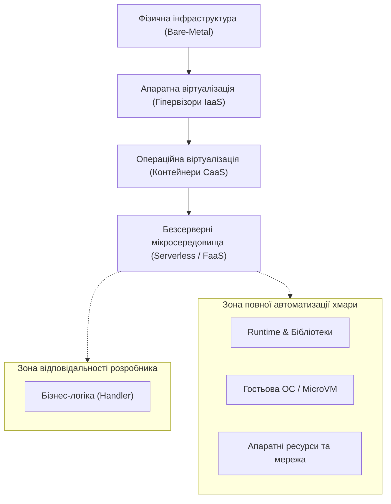
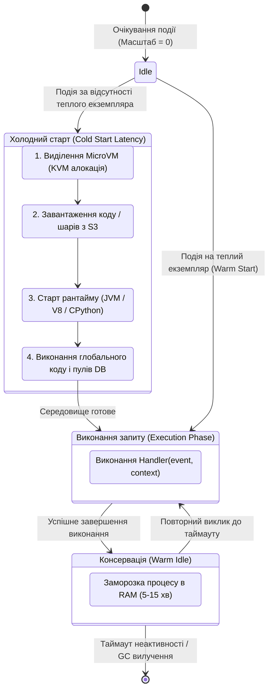
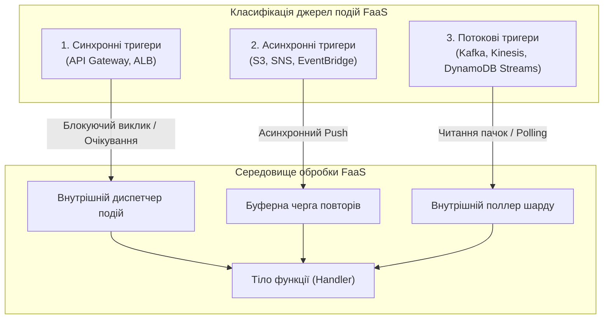
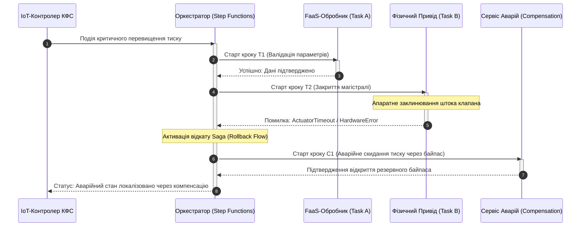
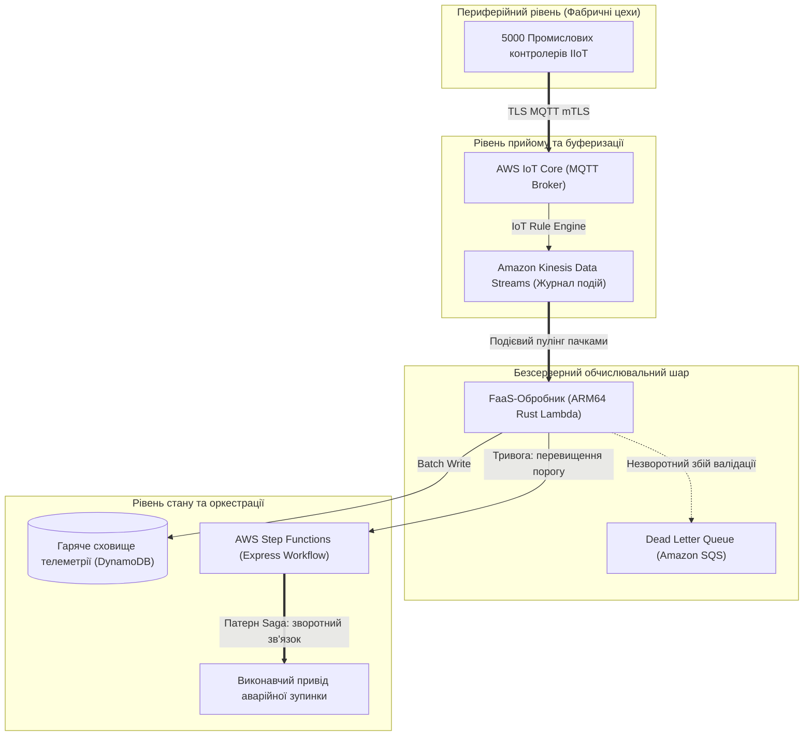

# Тема 5. Безсерверна архітектура та мікросервіси в розподілених комп'ютерних системах

## Мета лекції
Формування у майбутніх інженерів комп'ютерних систем комплексу поглиблених теоретичних знань та прикладних інженерних компетентностей щодо проєктування, системного аналізу, розгортання та оптимізації безсерверних обчислювальних середовищ і сервісно-орієнтованих розподілених систем. Навчальний матеріал фокусується на вивченні низькорівневих аспектів віртуалізації та ізоляції обчислень (технології MicroVM та контейнерних пісочниць), математичному моделюванні динаміки конкурентності за законом Літтла, мінімізації часових затримок холодного старту, оптимізації сукупної вартості володіння хмарною інфраструктурою, а також на впровадженні відмовостійких архітектурних патернів координації мікросервісів у високонавантажених кіберфізичних та індустріальних системах.

## Очікувані результати навчання
1. **Знання та розуміння.** Здобувачі вищої освіти демонструють системні знання архітектурних принципів безсерверних обчислень, розрізняють технологічні механізми ізоляції середовищ виконання на рівні ядра операційної системи та гіпервізорів MicroVM, а також розуміють повний життєвий цикл подієво-керованих функцій і специфіку їх функціонування в мультитенантних дата-центрах.
2. **Застосування.** Студенти вміють розраховувати параметри розподілу пулів конкурентності, розраховувати часові затримки обробки сигналів телеметрії, проєктувати декларативні маніфести взаємодії функцій із тригерами та прив'язками, а також застосовувати аналітичні моделі для визначення точки фінансової беззбитковості між моделями FaaS та IaaS.
3. **Аналіз.** Слухачі здатні здійснювати критичний порівняльний аналіз технічних характеристик провідних хмарних платформ FaaS, досліджувати фактори накладних витрат під час холодного старту різних мовних середовищ виконання, а також діагностувати системні вузькі місця, пов'язані з дроселюванням викликів і блокуванням зовнішніх транзакційних сховищ даних.
4. **Оцінювання та синтез.** Майбутні інженери набувають здатності проєктувати комплексні відмовостійкі архітектури обробки масивів розподілених даних для кіберфізичних систем, синтезувати складні кінцеві автомати керування бізнес-процесами на основі патернів Saga, Retry з джитером та Fan-out/Fan-in, аргументовано обираючи інженерні компроміси між латентністю, масштабованістю, безпекою та вартістю системи.

---

## Детальний покроковий план лекції

### 1. Теоретико-концептуальний базис. Архітектурні засади безсерверних обчислень та системні механізми FaaS
* 1.1. Еволюційний перехід від монолітних архітектур і серверної віртуалізації до мікросервісів, контейнеризації та концепції повної абстракції інфраструктури (Serverless Computing)
* 1.2. Системні механізми реалізації парадигми Function-as-a-Service (FaaS): апаратна та ядрова ізоляція мікросередовищ виконання на базі гіпервізорів MicroVM (AWS Firecracker) і пісочниць безпеки (gVisor)
* 1.3. Подієвий життєвий цикл безсерверної функції (Event-Driven Lifecycle), фази ініціалізації та математична формалізація затримок холодного (Cold Start) і теплого (Warm Start) стартів
* 1.4. Системна класифікація джерел подій (синхронні, асинхронні, потокові пулінгові тригери) та концепція декларативних вхідних і вихідних прив'язок (Input/Output Bindings)

### 2. Методологія та аналіз граничних умов. Масштабування, економічні моделі та оркестрація розподілених робочих процесів
* 2.1. Формалізовані моделі еластичного масштабування: закон Літтла, керування пулами конкурентності (Reserved, Provisioned, Unreserved Concurrency) та системні механізми дроселювання (Throttling)
* 2.2. Математична модель квантування обчислювальних ресурсів у гігабайт-секундах ($\text{GB}\cdot\text{s}$) та критерії визначення точки беззбитковості (Break-Even Point) між FaaS, PaaS і виділеною інфраструктурою IaaS
* 2.3. Патерни та рушії безсерверної оркестрації: розподілені кінцеві автомати (AWS Step Functions, Azure Durable Functions), патерн компенсуючих транзакцій Saga, розгалуження Fan-out/Fan-in та алгоритми повторів із експоненційним відступом і джитером
* 2.4. Системні обмеження, граничні бар'єри та критичні ризики експлуатації FaaS: часові ліміти виконання (Execution Timeouts), вичерпання пулів з'єднань із реляційними СУБД (Connection Starvation), ефект «громового стада» (Thundering Herd) та специфіка налагодження розподіленого стану

### 3. Практичний індустріальний / фаховий кейс. Архітектурне проєктування безсерверної платформи збору телеметрії
**Тема наскрізної задачі.** «Проєктування та розрахунок параметрів відмовостійкого безсерверного конвеєра обробки високоінтенсивної телеметрії промислових контролерів (IIoT) на базі AWS Lambda, Step Functions і NoSQL-сховища з гарантованою мінімізацією Cold Start та ізоляцією транзакційних збоїв»

## 1. Теоретико-концептуальний базис. Архітектурні засади безсерверних обчислень та системні механізми FaaS

### 1.1. Еволюційний перехід від монолітних архітектур і серверної віртуалізації до мікросервісів, контейнеризації та концепції повної абстракції інфраструктури (Serverless Computing)

Еволюція обчислювальних систем у сфері комп'ютерної інженерії відображає невпинний рух від монолітної апаратно-залежної структури до граничних рівнів програмної абстракції. На початкових етапах розвитку корпоративних систем панував підхід розгортання монолітних програмних комплексів безпосередньо на фізичних серверах (**Bare-Metal**). За такої організації операційна система, системні бібліотеки, середовище виконання та монолітний бізнес-код функціонували в межах єдиного адресного простору та були жорстко прив'язані до конкретної апаратної конфігурації. Основними недоліками цієї моделі виступали вкрай низький коефіцієнт утилізації обчислювальних потужностей процесорів (який рідко перевищував десять-п'ятнадцять відсотків), тривалий цикл введення в експлуатацію нового обладнання та взаємне блокування процесів у межах спільного ядра операційної системи.

Поява апаратних розширень віртуалізації (зокрема технологій Intel VT-x та AMD-V) заклала підґрунтя для переходу до парадигми апаратної віртуалізації під керуванням гіпервізорів першого та другого типів. Розгортання віртуальних машин дозволило консолідувати гетерогенні робочі навантаження на єдиному фізичному сервері, гарантуючи ізоляцію пам'яті та ресурсів на рівні гостьових операційних систем. Разом із тим, класична віртуалізація внесла суттєвий оверхед: кожна віртуальна машина потребує виділення гігабайтів оперативної пам'яті для функціонування власного ядра, підтримки віртуалізованих стеків драйверів введення-виведення та емуляції повного набору периферійного обладнання. Час завантаження такої системи вимірювався десятками секунд або хвилинами, що виключало можливість миттєвої реакції на високодинамічні сплески трафіку.

Розвиток механізмів ізоляції в ядрі операційної системи Linux, таких як простори імен (**Linux Namespaces**) та контрольні групи (**Control Groups, cgroups**), уможливив появу операційної віртуалізації, втіленої в контейнерних рушіях. Контейнеризація усунула потребу в запуску окремих гостьових ядер, забезпечивши спільне використання ресурсів хостової операційної системи за збереження ізоляції процесів, мережевих стеків та монтованих файлових систем. Декомпозиція монолітів на мікросервіси, упаковані в контейнери, суттєво спростила горизонтальне масштабування, проте перенесла значний тягар експлуатаційної складності на інженерні команди: адміністрування кластерних оркестраторів, керування виділенням ресурсів вузлів, конфігурування автоскейлерів та безперервне оновлення базових образів ОС вимагали значних ресурсів.

Концепція **безсерверних обчислень (Serverless Computing)** стала логічним завершенням процесу відчуження інженерів-розробників від керування фізичною та віртуальною інфраструктурою. Безсерверна парадигма базується на повній декларативній абстракції серверів, автоматичному масштабуванні від нуля до пікових значень і зміні моделі витрат на оплату виключно за фактично виконані кванти корисних обчислень. Порівняльний аналіз архітектурних характеристик наведених обчислювальних парадигм у контексті системної інженерії наведено у таблиці 1.1.

*Таблиця 1.1 — Порівняльний аналіз обчислювальних парадигм у розподілених системах*

| Архітектурна парадигма | Рівень ізоляції та абстракції | Час ініціалізації середовища | Оверхед за ресурсами (RAM/CPU) | Приклад з реальної практики |
| :--- | :--- | :--- | :--- | :--- |
| **Фізичні сервери (Bare-Metal)** | Апаратний рівень без віртуальних прошарків | Дні або тижні (закупівля, монтаж ОС) | Нульовий оверхед, але утилізація процесора складає лише 5–15% | Локальні високопродуктивні кластери СКБД Oracle чи SAP HANA |
| **Віртуальні машини (IaaS)** | Апаратна ізоляція гіпервізором (VT-x, KVM) | Від десятків секунд до кількох хвилин | Високий (виділення окремого ядра ОС, 1–4 ГБ RAM на систему) | Віртуальні екземпляри AWS EC2, Proxmox VE, VMware vSphere |
| **Керовані контейнери (CaaS)** | Ізоляція на рівні ядра ОС (Namespaces, Cgroups) | Від сотень мілісекунд до кількох секунд | Низький (спільне ядро ОС, накладні витрати контейнерного рушія) | Мікросервісні комплекси під керуванням кластерів Kubernetes |
| **Функція як послуга (FaaS)** | Легковагові пісочниці або MicroVM на рівні процесу | Від одиниць до сотень мілісекунд | Мінімальний (квантування пам'яті від 128 МБ із кроком у 1 МБ) | Подієва обробка в AWS Lambda, Cloudflare Workers, Azure Functions |

---

### 1.2. Системні механізми реалізації парадигми Function-as-a-Service (FaaS): апаратна та ядрова ізоляція мікросередовищ виконання на базі гіпервізорів MicroVM (AWS Firecracker) і пісочниць безпеки (gVisor)

Парадигма **«Функція як послуга» (Function-as-a-Service, FaaS)** висуває надзвичайно жорсткі вимоги до системної ізоляції обчислень. У мультитенантному хмарному середовищі код від тисяч різних користувачів повинен виконуватися на спільних фізичних серверах без загрози витоку даних чи несанкціонованого доступу до ресурсів хоста. Класичні контейнери Linux на базі спільних просторів імен виявляються вразливими до атак типу **Container Escape**, оскільки будь-яка невиправлена вразливість у системних викликах ядра Linux може скомпрометувати весь фізичний вузол. З іншого боку, традиційні гіпервізори на зразок QEMU/KVM містять сотні тисяч рядків коду для емуляції застарілих шин, контролерів переривань і складних пристроїв введення-виведення, що значно розширює потенційну поверхню атаки та спричиняє неприпустимо високі затримки запуску.

Для вирішення цієї інженерної дилеми була розроблена технологія **MicroVM**, найвідомішим представником якої є відкритий гіпервізор **AWS Firecracker**, написаний на мові системного програмування Rust. Firecracker використовує інтерфейс ядра Linux KVM (`/dev/kvm`), проте принципово відмовляється від важкої емуляції QEMU. Гіпервізор реалізує мінімалістичну модель пристроїв, що обмежується виключно базовими інтерфейсами: мережевим адаптером `virtio-net`, блоковим сховищем `virtio-block`, послідовним портом і механізмом міжпроцесної комунікації `virtio-vsock`. Завдяки вилученню графічних адаптерів, складних шин PCI та підтримки ACPI, обсяг пам'яті, необхідний для запуску одного екземпляра Firecracker, становить менше 5 МБ, а час ініціалізації мікро-віртуальної машини скорочено до 5 мілісекунд. Це дозволяє здійснювати щільне розміщення тисяч повністю апаратно ізольованих середовищ FaaS на одному фізичному хості.

Альтернативним підходом до ізоляції є технологія контейнерних пісочниць, реалізована в проєкті **gVisor** від компанії Google, що використовується для забезпечення функціонування Google Cloud Functions. Архітектурно gVisor складається з двох ключових компонентів: ядра користувацького простору **Sentry** та захищеного демона файлової системи **Gofer**. Sentry перехоплює всі системні виклики гостьової програми (через механізми `ptrace` або віртуалізацію KVM) та емулює понад двісті системних викликів Linux всередині власного процесу, написаного на мові Go із вбудованою безпекою пам'яті. Гостьова програма повністю ізольована від безпосереднього доступу до ядра хоста: якщо програма генерує небезпечний виклик, Sentry обробляє його всередині пісочниці, запобігаючи дестабілізації або злому хостової операційної системи.

```mermaid
flowchart TD
    subgraph TraditionalVM ["Традиційна VM (QEMU/KVM)"]
        A1["Гостьовий додаток"] --> B1["Повна гостьова ОС"]
        B1 --> C1["QEMU (Емуляція PCI/IDE/BIOS)"]
        C1 --> D1["Linux KVM Kernel"]
    end

    subgraph MicroVMStructure ["MicroVM (AWS Firecracker)"]
        A2["Функція FaaS (Handler)"] --> B2["Мінімізоване ядро Linux"]
        B2 --> C2["Firecracker (Тільки VirtIO)"]
        C2 --> D2["Linux KVM Kernel"]
    end

    subgraph SandboxStructure ["Контейнерна пісочниця (gVisor)"]
        A3["Функція FaaS (Handler)"] --> B3["Sentry (Емуляція системних викликів)"]
        B3 --> C3["Gofer (Ізольований I/O)"]
        C3 --> D3["Host Linux Kernel"]
    end
```

> **ПРАКТИЧНИЙ ЯКІР:** У 2018 році компанія Amazon повністю перевела сервіси AWS Lambda та AWS Fargate з контейнерів Docker на власні мікро-віртуальні машини Firecracker. Це дозволило одночасно досягти гарантій безпеки банківського рівня (повна апаратна ізоляція адресного простору процесора та таблиць сторінок пам'яті) і скоротити час холодного старту обчислювальних середовищ до субсекундних показників при утилізації тисяч мікроконтейнерів на фізичних серверах AWS.

---

### 1.3. Подієвий життєвий цикл безсерверної функції (Event-Driven Lifecycle), фази ініціалізації та математична формалізація затримок холодного (Cold Start) і теплого (Warm Start) стартів

Життєвий цикл функції у середовищі FaaS підпорядковується суворій подієво-орієнтованій моделі керування (**Event-Driven State Machine**). На відміну від класичних демонів чи веб-серверів, які постійно прослуховують мережевий сокет у фоновому режимі, екземпляр безсерверної функції розгортається реактивно, виключно у відповідь на появу дискретного сигналу від зовнішнього джерела подій. Після завершення обчислювального завдання середовище або консервується для подальшого повторного використання, або повністю знищується платформою з метою вивільнення ресурсів фізичного сервера.

У разі надходження виклику за відсутності готового екземпляра виникає феномен **холодного старту (Cold Start)**. Цей стан передбачає послідовне проходження системою чотирьох обов'язкових етапів: алокації базового ізольованого середовища (MicroVM або простору імен), доставки та монтування кодового артефакту з розподіленого сховища, завантаження середовища виконання мови програмування (інтерпретатора Python, Node.js або віртуальної машини JVM) та виконання статичного глобального коду ініціалізації. Лише після проходження цих фаз управління передається функції-обробнику (**Handler**). Якщо наступний виклик надходить протягом періоду збереження активного стану («теплий стан», **Warm State**, зазвичай 5–15 хвилин), платформа реалізує **теплий старт (Warm Start)**, передаючи подію безпосередньо у вже ініціалізований процес у пам'яті.

З точки зору комп'ютерної інженерії, результуюча затримка відгуку системи $T_{\text{response}}$ описується детермінованою сумою часових інтервалів низькорівневих операцій. Загальне математичне рівняння часу обробки запиту має такий вигляд:

$$T_{\text{response}} = T_{\text{net}} + T_{\text{init}} + T_{\text{exec}}$$

Розкриваючи складову часу ініціалізації $T_{\text{init}}$ через характеристики системних фаз, отримуємо повну модель часових витрат:

$$T_{\text{init}} = \delta \cdot \left( t_{\text{alloc}} + t_{\text{fetch}}(S) + t_{\text{runtime}} + t_{\text{static}} \right)$$

де $\delta \in \{0, 1\}$ — дискретний індикатор стану середовища, який дорівнює одиниці при холодному старті ($\delta = 1$) та нулю при теплому старті ($\delta = 0$), $T_{\text{net}}$ — подвійна кругова мережева затримка транспортування повідомлення, $t_{\text{alloc}}$ — час взаємодії гіпервізора з ядром хоста для конфігурування MicroVM (виділення сторінок пам'яті, налаштування віртуальних CPU), $t_{\text{fetch}}(S)$ — тривалість завантаження кодового архіву розміром $S$ байт із віддаленого об'єктного сховища через внутрішню мережу ЦОД, $t_{\text{runtime}}$ — системний час старту процесу віртуальної машини відповідної мови програмування, $t_{\text{static}}$ — час виконання команд глобальної області видимості (імпорт модулів, встановлення мережевих сокетів, парсинг конфігурацій), а $T_{\text{exec}}$ — безпосередній час роботи алгоритму обробки події всередині функції Handler.

Тривалість завантаження артефакту $t_{\text{fetch}}(S)$ визначається через ємність пакета та пропускну здатність шини:

$$t_{\text{fetch}}(S) = \frac{S}{B_{\text{fabric}}} + \tau_{\text{io}}$$

де $S$ позначає розмір стисненого образу або архіву функції, $B_{\text{fabric}}$ визначає ефективну пропускну здатність внутрішньої мережевої фабрики передачі даних дата-центру, а $\tau_{\text{io}}$ відображає накладні витрати на дискові операції введення-виведення при розпакуванні файлової системи rootfs.

> **ТИПОВА ПОМИЛКА:** Поширена помилка системних архітекторів полягає в розміщенні важких клієнтів з'єднання з базами даних і операцій парсингу статичних конфігурацій всередині функції `Handler`. У безсерверній архітектурі такі ресурсомісткі виклики повинні виноситися в глобальний контекст (**Static Initialization Scope**). Код глобального контексту виконується лише один раз під час холодного старту, що дозволяє усім наступним теплим викликам повторно використовувати встановлені TCP-сокети та закешовані метадані без повторних часових затримок.

> **ПРАКТИЧНИЙ ЯКІР:** У високонавантажених IoT-шлюзах моніторингу залізничного транспорту використання функцій на базі Java Virtual Machine без оптимізації призводило до затримок холодного старту на рівні 2,5–3,2 секунди через тривалу ініціалізацію класів у JVM. Переписування коду функції обробки телеметрії на мову Rust із компіляцією в нативний двійковий файл для середовища AWS Lambda Custom Runtime скоротило час холодного старту до 18 мілісекунд, забезпечивши обробку аварійних повідомлень сенсорів у гарантованих часових межах реального часу.

---

### 1.4. Системна класифікація джерел подій (синхронні, асинхронні, потокові пулінгові тригери) та концепція декларативних вхідних і вихідних прив'язок (Input/Output Bindings)

Екосистема FaaS перетворює обчислювальні процеси на підсистему реактивного реагування на події. **Джерело подій (Event Source / Trigger)** являє собою зовнішню сутність, яка фіксує зміну стану в інформаційному просторі та генерує структурований пакет метаданих (зазвичай у форматі JSON), що передається безсерверній функції як аргумент `event`.

За механізмом передачі даних та моделлю координації розподілених потоків джерела подій класифікуються на три системні категорії:

Синхронні тригери передбачають блокуючу модель **Request-Response**. Клієнтська сторона ініціює виклик (наприклад, надсилаючи HTTP-запит до API Gateway або Application Load Balancer) і утримує відкрите TCP-з'єднання, очікуючи завершення роботи функції та повернення результату з кодом статусу. У разі аварійного збою функції обробка помилки повністю покладається на клієнта.

Асинхронні тригери реалізують модель повної декомпозиції в часі за схемою **Fire-and-Forget**. Джерело події (наприклад, сервіс об'єктного сховища при завантаженні нового файлу чи сервіс черг повідомлень) надсилає подію на платформу FaaS, яка негайно підтверджує отримання кодом `202 Accepted` і поміщає виклик у внутрішню чергу диспетчеризації. Платформа бере на себе відповідальність за гарантовану доставку: у разі збою коду функції виконуються повторні спроби запуску за алгоритмом експоненційного відступу, а при вичерпанні ліміту невдалих спроб повідомлення надсилається до черги недоставлених повідомлень (**Dead Letter Queue, DLQ**).

Потокові тригери на основі опитування (**Stream-based Polling Triggers**) орієнтовані на обробку безперервних потоків телеметрії та розподілених журналів подій (наприклад, Apache Kafka, AWS Kinesis, Azure Event Hubs). У цьому сценарії спеціалізований внутрішній сервіс платформи FaaS — поллер — постійно опитує шарди або розділи журналу, зчитує пачки записів (**Batch Processing**) та передає їх на обробку функції зі збереженням суворої послідовності в межах кожного окремого шарду.

Для мінімізації шаблонного коду (**Boilerplate Code**) та усунення рутинних операцій з інтеграції зовнішніх сервісів у сучасних безсерверних середовищах використовується концепція **декларативних прив'язок (Bindings)**, найбільш повно втілена в архітектурі Azure Functions. Традиційний підхід вимагає від розробника вручну підключати важкі клієнтські бібліотеки SDK, ініціалізувати авторизаційні токени, керувати сокетами та явно викликати методи читання чи запису даних у зовнішні СУБД.

Механізм прив'язок розділяє системну інтеграцію на дві фази:
1. **Вхідні прив'язки (Input Bindings)** дозволяють платформі автоматично, згідно з декларативним маніфестом, витягти дані із зовнішнього джерела (наприклад, зчитати документ з бази даних NoSQL за ідентифікатором, переданим у подію тригера) та подати їх у готовому структурованому вигляді як додатковий аргумент функції Handler до початку її виконання.
2. **Вихідні прив'язки (Output Bindings)** перехоплюють вихідні дані, повернуті функцією після завершення розрахунків, і автоматично транслюють їх у цільовий сервіс (наприклад, зберігають новий запис у базі даних, створюють файл у блоковому сховищі або відправляють повідомлення в брокер черг) без жодного рядка спеціалізованого клієнтського коду всередині самої функції.

> **КОНТРОЛЬНЕ ПИТАННЯ:** Чому в мікросервісних архітектурах прямолінійна побудова ланцюжка послідовних викликів між безсерверними функціями через синхронні HTTP-тригери вважається критичним антипатерном проектування?

Розгорнути аналіз / відповідь

**Правильний варіант: Каскадне блокування ресурсів, мультиплікація затримок холодного старту та подвійна фінансова тарифікація.**

1. **Логічне та інженерне обґрунтування:** Прямий синхронний виклик однієї FaaS-функції з іншої створює стан блокуючого очікування (Idle Waiting). Перша функція продовжує споживати виділені обчислювальні ресурси (оперативну пам'ять та час виконання), повністю простоюючи в очікуванні відповіді від другої функції. Це спричиняє ефект **подвійної тарифікації (Double Billing)**, коли клієнт одночасно оплачує час виконання обох функцій за корисну роботу, яку виконує лише одна з них. Крім того, виникає явище **каскадного холодного старту**: якщо обидві функції стартують із холодного стану, затримки їхньої ініціалізації сумуються, призводячи до перевищення клієнтських таймаутів.

2. **Аналіз дистракторів (чому альтернативні інтерпретації є помилковими):**
   - Твердження про те, що синхронні виклики не підтримуються безсерверними мережами, є хибним: технічно функції можуть здійснювати довільні вихідні мережеві запити через HTTP/HTTPS.
   - Твердження, що такий підхід порушує права доступу IAM, є некоректним, оскільки механізми автентифікації дозволяють підписувати міжсервісні запити за допомогою системних ролей виконання (Execution Roles).
   - Правильним архітектурним рішенням для організації зв'язку між безсерверними компонентами є використання асинхронних черг (SQS/Service Bus), шин подій (EventBridge/Event Grid) або спеціалізованих рушіїв оркестрації кінцевих автоматів (Step Functions).

---

### Вказівки для самостійного осмислення

1. Дослідіть та порівняйте архітектуру компонентів гіпервізора AWS Firecracker та контейнерної пісочниці gVisor, звернувши особливу увагу на різницю між прямим використанням апаратного модуля KVM та перехопленням системних викликів у просторі користувача за допомогою рушія Sentry.
2. Проаналізуйте вихідний код власної навчальної або виробничої функції-обробника та визначте, які операції ініціалізації сторонніх SDK або клієнтів баз даних можуть бути винесені за межі тіла обробника подій у глобальний контекст для радикального скорочення часу повторних викликів.
3. Розрахуйте сумарний час затримки холодного старту для системи збору телеметрії за умови, що розмір кодового архіву становить 85 мегабайтів, швидкість каналу передачі даних всередині ЦОД дорівнює 1 гігабіту на секунду, а середовище виконання базується на платформі Node.js 20 LTS.

## 2. Методологія та аналіз граничних умов. Керування конкурентністю, моделі масштабування та оркестрація розподілених конвеєрів

### 2.1. Математичне моделювання паралелізму за законом Літтла та стратегії диспетчеризації пулу конкурентності (Reserved, Unreserved, Provisioned Concurrency)

Математичний апарат теорії масового обслуговування є фундаментом для інженерного розрахунку обчислювальних ресурсів у безсерверних середовищах. Основним інваріантом, що пов'язує інтенсивність зовнішнього навантаження із системною місткістю платформи, виступає теорема Літтла. У застосуванні до парадигми безсерверних функцій закон стверджує, що середня кількість одночасно активних екземплярів обчислювального середовища прямо пропорційна середній швидкості надходження вхідних подій та середньому часу їх обробки. 

Формалізація динаміки масштабування та виникнення стану насичення системи здійснюється за наступним покроковим алгоритмом:

$$
\begin{aligned}
\text{Крок 1 (Розрахунок базової конкурентності):} & \quad C(t) = \lambda(t) \cdot \overline{T}_{\text{exec}} \\
\text{Крок 2 (Швидкість нарощування попиту):} & \quad \frac{dC}{dt} = \frac{d\lambda(t)}{dt} \cdot \overline{T}_{\text{exec}} + \lambda(t) \cdot \frac{d\overline{T}_{\text{exec}}}{dt} \\
\text{Крок 3 (Модель доступної ємності платформи):} & \quad C_{\text{avail}}(t) = \min \left( C_{\text{burst}} + R_{\text{scale}} \cdot (t - t_0), \; C_{\text{limit}} \right) \\
\text{Крок 4 (Критерій виникнення дроселювання):} & \quad \text{Drop}(t) = \max \left( 0, \; C(t) - C_{\text{avail}}(t) \right) > 0
\end{aligned}
$$

де параметр $C(t)$ позначає необхідну кількість одночасно функціонуючих контейнерів або мікро-віртуальних машин у момент часу $t$, $\lambda(t)$ визначає миттєву інтенсивність вхідного потоку запитів, виражену в кількості подій за секунду, $\overline{T}_{\text{exec}}$ є математичним сподіванням тривалості обробки одного виклику в секундах, $C_{\text{burst}}$ задає апаратний ліміт миттєвого виділення ресурсів, що надається провайдером без затримок, $R_{\text{scale}}$ регламентує максимальну швидкість лінійного масштабування інфраструктури (наприклад, п'ятсот додаткових екземплярів щохвилини), $C_{\text{limit}}$ позначає жорстку стелю конкурентності для облікового запису в межах хмарного регіону, а функція $\text{Drop}(t)$ чисельно визначає обсяг запитів, що зазнають апаратного або програмного скидання в одиницю часу.

Диспетчеризація обчислювальних ресурсів у FaaS спирається на розподіл загального пулу конкурентності облікового запису між трьома базовими стратегіями конфігурування:
1. Зарезервована конкурентність (**Reserved Concurrency**) виділяє строго визначену частину регіонального пулу для конкретної функції, гарантуючи ізоляцію обчислювальних потужностей від сусідніх мікросервісів та одночасно встановлюючи верхній поріг масштабування, що унеможливлює перевантаження підпорядкованих реляційних баз даних.
2. Незбережена або спільна конкурентність (**Unreserved Concurrency**) являє собою нерозподілений залишок загального ліміту облікового запису, за використання якого всі недекларовані функції змагаються за принципом розділення спільного середовища, що несе ризик повної деградації другорядних сервісів при спалаху активності критичної функції.
3. Попередньо виділена конкурентність (**Provisioned Concurrency**) утримує в оперативній пам'яті фізичних вузлів цільову кількість постійно прогрітих мікро-віртуальних машин із завантаженим середовищем виконання мови програмування та ініціалізованим статичним контекстом, зводячи затримку холодного старту до нуля ціною безперервної оплати фонового простою таких екземплярів.

Аналіз граничних умов показує, що модель Літтла втрачає адекватність у реальних системах, якщо математичне сподівання часу виконання стає функцією від поточної конкурентності, тобто $\overline{T}_{\text{exec}} = f(C)$. Подібна ситуація виникає за наявності спільних точок блокування, наприклад, централізованого сховища даних або пулу вихідних з'єднань через NAT-шлюз. Коли вхідний потік $\lambda(t)$ різко зростає, база даних починає зазнавати затримок очікування на блокуваннях рядків, що спричиняє стрибок $\overline{T}_{\text{exec}}$ від ста мілісекунд до кількох секунд. Відповідно до кроку 2 математичної моделі, попит на конкурентність зростає експоненційно, миттєво спустошуючи доступний ліміт $C_{\text{limit}}$. Система потрапляє в режим катастрофічного автоблокування, де всі наступні запити скидаються платформою з помилкою відмови в обслуговуванні, хоча корисна продуктивність обчислювального вузла прямує до нуля.

---

### 2.2. Економічна модель квантування ресурсів, розрахунок точки беззбитковості (Break-Even Point) між FaaS та виділеною інфраструктурою IaaS/PaaS

Економічна доцільність впровадження безсерверної парадигми базується на моделі повної відсутності витрат на апаратний простій у моменти нульової активності системи. На противагу серверам IaaS, які потребують безперервної оплати незалежно від коефіцієнта утилізації їхніх процесорів, тарифікація моделі FaaS є строго дискретною та обчислюється як інтеграл споживання виділеного обсягу оперативної пам'яті за тривалістю виконання кожного виклику.

Для точного інженерного порівняння сукупної вартості володіння інфраструктурою розроблено аналітичний апарат, що дозволяє визначити критичну точку беззбитковості:

$$
\begin{aligned}
\text{Крок 1 (Цільова функція витрат FaaS):} & \quad \Phi_{\text{FaaS}} = N_{\text{invoc}} \cdot P_{\text{invoc}} + P_{\text{GBs}} \cdot \sum_{i=1}^{N_{\text{invoc}}} \left( \left\lceil \frac{M_i}{\Delta M} \right\rceil \Delta M \cdot 10^{-3} \cdot \left\lceil \frac{t_i}{\Delta t} \right\rceil \Delta t \cdot 10^{-3} \right) \\
\text{Крок 2 (Цільова функція витрат IaaS):} & \quad \Phi_{\text{IaaS}} = N_{\text{VM}} \cdot \left( T_{\text{month}} \cdot P_{\text{VM\_hour}} \right) + C_{\text{OS}} + C_{\text{maintenance}} \\
\text{Крок 3 (Рівняння точки беззбитковості):} & \quad \Phi_{\text{FaaS}}(\lambda^*, \overline{t}, M) = \Phi_{\text{IaaS}}(N_{\text{VM}}) \\
\text{Крок 4 (Аналітичний вираз критичної інтенсивності):} & \quad \lambda^* = \frac{N_{\text{VM}} \cdot T_{\text{month}} \cdot P_{\text{VM\_hour}} + C_{\text{OS}} + C_{\text{maintenance}}}{T_{\text{month\_sec}} \cdot \left( P_{\text{invoc}} + P_{\text{GBs}} \cdot \frac{M}{1024} \cdot \overline{t} \right)}
\end{aligned}
$$

де $\Phi_{\text{FaaS}}$ позначає місячну вартість експлуатації функцій, $N_{\text{invoc}}$ задає сумарну кількість викликів за розрахунковий період, $P_{\text{invoc}}$ визначає базовий тариф за один виклик, $P_{\text{GBs}}$ є вартістю споживання одного гігабайт-секунди ресурсів, $M_i$ відповідає обсягу оперативної пам'яті у мегабайтах, $\Delta M$ та $\Delta t$ задають кроки апаратно-програмного квантування ресурсів платформи (для сучасних FaaS-платформ $\Delta M = 1\text{ МБ}$, $\Delta t = 1\text{ мс}$), $t_i$ — тривалість роботи процесу, $\Phi_{\text{IaaS}}$ описує фіксовані місячні витрати на оренду еквівалентного кластера віртуальних машин, $N_{\text{VM}}$ позначає число інстансів, необхідних для покриття навантаження з урахуванням пікового резервування, $T_{\text{month}}$ дорівнює середній кількості годин у місяці (приблизно 730 годин), $P_{\text{VM\_hour}}$ задає щогодинну ціну оренди віртуального сервера, $C_{\text{OS}}$ і $C_{\text{maintenance}}$ відображають ліцензійні відрахування та оплату праці системних інженерів на адміністрування ОС, $\lambda^*$ чисельно фіксує порогову інтенсивність потоку подій, а $T_{\text{month\_sec}}$ дорівнює загальній кількості секунд у місяці ($2{,}592 \cdot 10^6\text{ с}$).

> **ПРАКТИЧНИЙ ЯКІР:** У 2023 році компанія 37signals (розробники Basecamp та Hey) здійснила публічний аудит хмарних витрат і перенесла низку високонавантажених сервісів із керованих хмарних платформ на власні фізичні сервери. Інженерний аналіз засвідчив, що при стабільному цілодобовому навантаженні на рівні десятків тисяч транзакцій за секунду вартість одиниці обчислювальної потужності у FaaS/PaaS перевищувала еквівалентні витрати на володіння власним апаратним обладнанням у 3,8–4,5 раза через закладену провайдерами маржу на динамічне резервування інфраструктури.

Граничні умови економічної моделі чітко розмежовують сфери застосування технологій:
1. Якщо розподілена система характеризується високим коефіцієнтом нерівномірності навантаження (відношення пікового трафіку до середнього перевищує значення 5:1, або присутні тривалі нічні періоди повного простою), значення $\lambda(t)$ протягом тривалого часу перебуває значно нижче критичного порогу $\lambda^*$, що робить FaaS безальтернативно вигіднішим варіантом.
2. Якщо ж система переходить у режим стабільної, монотонної утилізації з постійно високою інтенсивністю викликів (наприклад, цілодобове потокове кодування відеосигналу або пакетна обробка сейсмічних даних), питома ціна гігабайт-секунди у безсерверному середовищі стає критично невигідною, і сумарні витрати $\Phi_{\text{FaaS}}$ починають стрімко зростати, багаторазово перевершуючи фіксовану вартість оренди пулу серверів IaaS.

---

### 2.3. Оркестрація розподілених безсерверних процесів і патерни обробки транзакцій: State Machines (AWS Step Functions), Durable Functions, моделі Saga, Scatter-Gather (Fan-out/Fan-in) та експоненційний відступ із джитером

Ізольовані безсерверні функції за своєю фундаментальною природою позбавлені стану між окремими викликами (**Stateless Execution**). Побудова комплексних багатоетапних конвеєрів для кіберфізичних систем вимагає надійного збереження проміжних результатів обчислень, синхронізації асинхронних гілок та гарантованого виконання розподілених транзакцій. Для вирішення цього протиріччя застосовуються спеціалізовані оркестратори, побудовані на базі концепції кінцевих автоматів (**Deterministic State Machines**).

У середовищі AWS Step Functions життєвий цикл робочого процесу формалізується декларативним JSON-маніфестом на мові Amazon States Language, тоді як у платформі Azure Durable Functions аналогічна координація здійснюється за допомогою імперативного коду із застосуванням механізму фіксації подій (**Event Sourcing**). При виникненні тривалих операцій очікування оркестратор скидає стан потоку в транзакційне сховище та припиняє виконання процесу, усуваючи необхідність оплати за процесорний час простою. Після надходження сигналу завершення зовнішньої операції оркестратор відтворює історію виконання через механізм Replay і повертає потік у активний стан.

У розподілених безсерверних середовищах класичний протокол двофазної фіксації транзакцій (**Two-Phase Commit, 2PC**) є непридатним через блокуючий характер координатора та високу ймовірність збоїв зв'язку між вузлами. Стандартом забезпечення атомарності розподілених операцій виступає патерн **Saga**. Згідно з цією моделлю, глобальна транзакція розділяється на ланцюг локальних дій $T_1, T_2, \dots, T_n$. Для кожного кроку $T_i$, який модифікує стан апаратного чи програмного компонента системи, обов'язково проєктується парна компенсуюча транзакція $C_i$, яка семантично скасовує внесені зміни та повертає підсистему у вихідний стан. 

Якщо під час виконання етапу $T_k$ виникає непоправний збій, оркестратор перериває прямий хід виконання та послідовно запускає ланцюжок компенсацій у зворотному напрямку:

$$\text{Прямий конвеєр:} \quad T_1 \to T_2 \to \dots \to T_{k-1} \to T_k (\text{Fail})$$

$$\text{Конвеєр компенсації:} \quad C_{k-1} \to C_{k-2} \to \dots \to C_1$$

Взаємодія компонентів розподіленої системи під час обробки аварійного сигналу телеметрії з переходом до компенсуючих транзакцій проілюстрована на діаграмі послідовності.

> **ВАЖЛИВО:** Кожна компенсуюча транзакція $C_i$ у патерні Saga зобов'язана мати властивості абсолютної ідемпотентності та комутативності. Оскільки хмарні мережеві канали гарантують лише доставку за принципом «щонайменше один раз» (**At-Least-Once Delivery**), компенсуюча функція може бути викликана оркестратором багаторазово під час виправлення збоїв, і повторне її виконання не повинно змінювати фінальний безпечний стан керованого об'єкта.

Для забезпечення стійкості до транзитних мережевих помилок алгоритм повторів оркестратора повинен реалізовувати стратегію експоненційного відступу з додаванням випадкового шуму (**Exponential Backoff with Full Jitter**). Час затримки перед здійсненням $n$-ї спроби розраховується за формулою:

$$t_{\text{wait}}(n) = \text{random} \left( 0, \; \min \left( T_{\text{max}}, \; T_{\text{base}} \cdot 2^{n-1} \right) \right)$$

де $T_{\text{base}}$ позначає базовий інтервал очікування (наприклад, 1 секунда), $T_{\text{max}}$ встановлює жорстку верхню межу паузи між викликами, $n$ відображає порядковий номер поточної ітерації повтору, а функція $\text{random}(0, X)$ генерує випадкове число з рівномірним розподілом від нуля до $X$, що запобігає одночасній синхронній атаці сотень відновлених функцій на цільовий сервіс.

---

### 2.4. Системні обмеження, критичні бар'єри та вразливості безсерверних архітектур: жорсткі таймаути виконання, обмеження локальних ресурсів, вичерпання пулів з'єднань із СУБД та ефект «громового стада» (Thundering Herd) при відмовах

Попри значні переваги еластичності, безсерверна архітектура накладає низку фундаментальних апаратно-програмних обмежень, нехтування якими в інженерній практиці призводить до повної відмови системи.

Найбільш критичним бар'єром для завдань комп'ютерної інженерії є жорсткий ліміт на тривалість виконання окремої транзакції (**Hard Execution Timeout**). Для більшості публічних хмарних платформ цей показник становить рівно 900 секунд (15 хвилин). Процеси, що вимагають тривалого монолітного рахунку (наприклад, навчання важких моделей штучного інтелекту, безперервне цифрове моделювання фізичних полів або довготривалі сесії взаємодії за бінарними промисловими протоколами), принципово не можуть виконуватися всередині окремої FaaS-функції. Спроба штучного обходу цього обмеження через перезапуск функцій у ланцюжку породжує складні проблеми передачі внутрішнього стану процесора та пам'яті, супроводжуючись накопиченням накладних витрат на ініціалізацію.

Другим системним бар'єром виступає феномен **вичерпання пулу з'єднань (Connection Starvation)** при взаємодії з класичними реляційними базами даних (PostgreSQL, MySQL, Oracle). Традиційні сервери застосунків утримують стабільний пул із кількох десятків постійних TCP-з'єднань, розподіляючи їх між внутрішніми потоками. У парадигмі FaaS кожен обчислювальний мікроконтейнер є повністю ізольованим процесом. При надходженні стрибка навантаження в 3000 запитів за секунду платформа запускає 3000 незалежних екземплярів функції, кожен з яких намагається встановити власне виділене TCP-з'єднання з базою даних. Реляційна СУБД миттєво вичерпує ліміт доступних файлових дескрипторів і пам'яті на обслуговування процесів бекенда, після чого переходить у стан відмови в обслуговуванні для всіх компонентів інфраструктури. Вирішення цієї проблеми вимагає обов'язкового розгортання проміжних безсерверних мультиплексорів з'єднань (таких як AWS RDS Proxy або зовнішні екземпляри PgBouncer).

Третім критичним ризиком є ефект **«громового стада» (Thundering Herd)** у поєднанні зі штормом повторних спроб (**Retry Storm**). Якщо зовнішній сервіс або база даних стає тимчасово недоступною, тисячі паралельно функціонуючих екземплярів безсерверних функцій фіксують помилку та одночасно ініціюють автоматичні повторні виклики. Цей лавиноподібний сумарний потік запитів генерує штучну розподілену атаку на відмову в обслуговуванні (DDoS), остаточно блокуючи спроби цільової підсистеми відновити свою штатну працездатність.

Комплексне зіставлення архітектурних стратегій координації обчислень у безсерверних середовищах із урахуванням їхніх граничних бар'єрів систематизовано в таблиці 2.1.

*Таблиця 2.1 — Порівняльна матриця стратегій координації та масштабування FaaS-систем*

| Модель організації обчислень | Механізм керування станом | Складність впровадження | Критичні ризики / Обмеження | Приклад з реальної практики |
| :--- | :--- | :--- | :--- | :--- |
| **Прямі синхронні HTTP-виклики** | Відсутній (повна втрата контексту між кроками) | Низька (базові клієнтські HTTP-запити) | Каскадні відмови, подвійна тарифікація часу блокування, жорсткий зв'язок компонентів | Прості вебхуки сповіщень у сервісах Slack або GitHub |
| **Асинхронна хореографія через черги** | Розподілений стан у брокерах (SQS, EventBridge) | Середня (потребує налаштування DLQ та ідемпотентності) | Відсутність централізованого аудиту, висока ймовірність неузгодженості даних | Подієва реєстрація транзакцій у платіжних шлюзах Stripe |
| **Централізована оркестрація (Step Functions)** | Декларативні кінцеві автомати (ASL JSON) | Висока (формалізація графів переходів та помилок) | Граничні ліміти на розмір контексту події (до 256 КБ), накладні витрати переходів | Оркестрація ланцюгів контролю якості на заводах Tesla |
| **Durable Functions (Event Sourcing)** | Автоматичне збереження історії та Replay в коді | Дуже висока (вимоги детермінізму до коду оркестратора) | Ризик розбіжностей історії при модифікації коду в процесі виконання | Банківський кліринг транзакцій у фінансових системах |

> **КОНТРОЛЬНЕ ПИТАННЯ:** У системі моніторингу промислового підприємства 10 000 IoT-сенсорів кожні 10 секунд надсилають пакети телеметрії. У випадку аварійної ситуації на виробництві виникає сплеск: усі датчики одночасно переходять на частоту надсилання 10 пакетів за секунду. Обробку виконує безсерверна функція FaaS, час виконання якої в штатному режимі становить 50 мс, а дані зберігаються в реляційній базі даних PostgreSQL, яка здатна підтримувати максимум 200 одночасних підключень. Які граничні бар'єри спрацюють у системі, і як інженерно трансформувати архітектуру для гарантування надійності?

Розгорнути аналіз / відповідь

**Правильний варіант: Виникнення шторму конкурентності (5000 екземплярів), вичерпання пулу з'єднань PostgreSQL та масове дроселювання викликів платформи.**

1. **Поетапний аналітичний розрахунок:**
   - **Штатний режим:** Інтенсивність надходження подій становить $\lambda_1 = \frac{10000}{10} = 1000\text{ req/s}$. Відповідно до закону Літтла, середня конкурентність дорівнює:
     $$C_1 = 1000 \cdot 0{,}05 = 50\text{ активних екземплярів}$$
     Оскільки $50 < 200$, база даних функціонує в межах доступного ліміту підключень.
   - **Аварійний піковий режим:** Інтенсивність стрибкоподібно зростає до $\lambda_2 = 10000 \cdot 10 = 100000\text{ req/s}$. Необхідна конкурентність сягає:
     $$C_2 = 100000 \cdot 0{,}05 = 5000\text{ активних екземплярів}$$
   - **Аналіз відмови:** Значення 5000 екземплярів у 5 разів перевищує стандартний ліміт регіональної конкурентності облікового запису (1000 викликів у AWS Lambda), що призводить до негайного масового дроселювання (HTTP 429). Одночасно 1000 функцій, які зуміли стартувати, ініціюють 1000 паралельних підключень до PostgreSQL, миттєво переповнюючи пул з'єднань СУБД (ліміт 200), що спричиняє крах бази даних.

2. **Інженерна трансформація архітектури:**
   - Встановлення перед FaaS буферизуючого шару розподіленого журналу подій (AWS Kinesis, Kafka або черги SQS FIFO), що повністю знімає ударне навантаження на функцію та переводить обробку в потоковий режим пачками (**Batch Processing**).
   - Впровадження пулера з'єднань або проксі-сервісу (AWS RDS Proxy), що забезпечує мультиплексування тисяч сесій функцій у фіксовані 150 постійних з'єднань із базою даних.
   - Встановлення ліміту Reserved Concurrency для функції на рівні 150 екземплярів, що гарантує захист реляційного сховища навіть за відсутності проксі-сервісу.

---

### Вказівки для самостійного осмислення

1. Складіть математичне рівняння для розрахунку місячних фінансових витрат безсерверного конвеєра збору даних, який обробляє сто мільйонів транзакцій за місяць, за умови використання архітектури ARM Graviton2 з обсягом пам'яті 512 мегабайтів та середньою тривалістю виконання функції 120 мілісекунд.
2. Спроєктуйте алгоритм компенсуючих дій для патерну Saga у сценарії керування автоматизованим промисловим складом, де послідовно виконуються операції резервування товару в базі даних, формування транспортного завдання для робота-маніпулятора та оновлення статусу в ERP-системі.
3. Проаналізуйте наслідки виникнення збою в роботі сервісу автентифікації під час паралельного виконання п'яти тисяч FaaS-функцій і запропонуйте механізм запобігання каскадному шторму повторних запитів за допомогою алгоритму Circuit Breaker.

## 3. Практичний індустріальний / фаховий кейс. Проєктування та розгортання високопродуктивної безсерверної телеметрії для кіберфізичних систем

### 3.1. Комплексний фаховий кейс. Проєктування відмовостійкого безсерверного конвеєра обробки телеметрії промислового Інтернету речей (IIoT)

#### Постановка задачі / ситуації
Сучасне високотехнологічне машинобудівне підприємство здійснює модернізацію системи збору та оперативної аналітики телеметрії від роботизованих виробничих ліній. Комплекс містить велику кількість сенсорів вібрації, температури та тиску, підключених до промислових контролерів. У штатному режимі контролери транслюють телеметричні пакети з помірною дискретністю, проте в разі виявлення локальної виробничої аномалії всі сенсори відповідної технологічної секції миттєво переходять у режим високочастотної фіксації параметрів аварії, формуючи критичний спалах навантаження. 

Інженерна команда повинна спроєктувати хмарний конвеєр обробки даних на платформі AWS, який гарантує дотримання суворих вимог угоди про рівень послуг щодо затримки реакції, виключає втрату даних при пікових сплесках та оптимізує щомісячні експлуатаційні витрати інфраструктури.

*Таблиця 3.1 — Вхідні інженерні параметри та граничні обмеження системи*

| Параметр системи | Символьне позначення | Числове значення | Інженерне обґрунтування / Обмеження |
| :--- | :--- | :--- | :--- |
| Загальна кількість IoT-контролерів | $N_{\text{dev}}$ | $5\,000$ одиниць | Фізичний парк промислових контролерів на заводі |
| Розмір одного телеметричного пакета | $S_{\text{payload}}$ | $2$ КБ ($2048$ байт) | Структурований бінарний пакет показників у форматі JSON |
| Частота надсилання у штатному режимі | $f_{\text{norm}}$ | $0{,}2$ Гц (1 раз на $5$ с) | Плановий моніторинг робочого стану обладнання |
| Частота надсилання в аварійному режимі | $f_{\text{burst}}$ | $10$ Гц ($10$ разів на $1$ с) | Режим високої дискретизації при відхиленні показників |
| Частка сенсорів в аварійному режимі | $\alpha$ | $10\%$ ($500$ вузлів) | Граничний розмір ізольованого виробничого цеху |
| Гранично допустимий час обробки (SLA) | $T_{\text{SLA}}$ | $200$ мс | Критичний час для прийняття рішення про зупинку приводу |
| Регіональний ліміт конкурентності Lambda | $C_{\text{limit}}$ | $1\,000$ інстансів | Базова квота хмарного облікового запису за замовчуванням |
| Тариф за $1\text{ GB}\cdot\text{s}$ (ARM Graviton2) | $P_{\text{GBs}}$ | $\$0{,}0000133334$ | Енергоефективна архітектура AWS Lambda arm64 |
| Тариф за 1 мільйон викликів | $P_{\text{invoc}}$ | $\$0{,}20$ | Вартість транзакцій обробника подій |

Для забезпечення надійної буферизації та запобігання втраті даних під час спалахів трафіку обрано комбіновану архітектуру: брокер промислових повідомлень транслює потік у розподілений журнал подій, звідки обчислювальний шар безсерверних функцій вичитує записи пачками та за потреби ініціює кінцевий автомат аварійної зупинки обладнання.

#### Покроковий аналіз та розв'язок

##### Крок 1. Розрахунок інтенсивності вхідного навантаження
На першому етапі необхідно визначити сумарний вхідний потік запитів за секунду для штатного та пікового аварійного режимів роботи підприємства.

Інтенсивність потоку подій у штатному режимі експлуатації $\lambda_{\text{norm}}$ визначається співвідношенням:

$$\lambda_{\text{norm}} = N_{\text{dev}} \cdot f_{\text{norm}} = 5000 \cdot 0{,}2 = 1000\text{ req/s}$$

У разі виникнення локальної аварії в одному з цехів $10\%$ контролерів починають надсилати дані з піковою частотою $f_{\text{burst}}$, тоді як решта парку функціонує у попередньому режимі. Сумарна пікова інтенсивність $\lambda_{\text{peak}}$ розраховується за формулою:

$$\lambda_{\text{peak}} = \left( N_{\text{dev}} \cdot (1 - \alpha) \cdot f_{\text{norm}} \right) + \left( N_{\text{dev}} \cdot \alpha \cdot f_{\text{burst}} \right)$$

Підставляючи вихідні параметри, отримуємо значення пікового навантаження:

$$\lambda_{\text{peak}} = (5000 \cdot 0{,}9 \cdot 0{,}2) + (5000 \cdot 0{,}1 \cdot 10) = 900 + 5000 = 5900\text{ req/s}$$

Сумарна смуга пропускання мережевого інтерфейсу під час пікового навантаження становить:

$$B_{\text{peak}} = \lambda_{\text{peak}} \cdot S_{\text{payload}} = 5900 \cdot 2\text{ КБ} = 11\,800\text{ КБ/с} \approx 11{,}52\text{ МБ/с}$$

##### Крок 2. Оцінка конкурентності за законом Літтла та аналіз перевантаження
Для визначення необхідного розміру пулу обчислювальних екземплярів функції застосовується закон Літтла за умови прямого виклику функції на кожен окремий телеметричний пакет. Припустимо, що середня тривалість виконання функції обробника, написаного на мові Python, складає $\overline{T}_{\text{exec}} = 80\text{ мс} = 0{,}08\text{ с}$.

Необхідна конкурентність у піковому режимі $C_{\text{peak}}$ дорівнює:

$$C_{\text{peak}} = \lambda_{\text{peak}} \cdot \overline{T}_{\text{exec}} = 5900 \cdot 0{,}08 = 472\text{ активних екземпляри}$$

Хоча значення $472$ формально не перевищує регіональну квоту акаунта $C_{\text{limit}} = 1000$, у разі раптового холодного старту через стрибок навантаження час виконання зростає до $\overline{T}_{\text{cold}} = 250\text{ мс} = 0{,}25\text{ с}$. Розрахунок показує виникнення миттєвого перевантаження:

$$C_{\text{cold\_spike}} = 5900 \cdot 0{,}25 = 1475\text{ екземплярів} > C_{\text{limit}}$$

Значення $1475$ перевищує доступну межу в $1000$ екземплярів, що призведе до негайного відкидання близько $32\%$ пакетів телеметрії з помилкою HTTP 429. Це доводить неприпустимість прямої синхронної обробки високоінтенсивного IoT-трафіку без проміжного буфера.

##### Крок 3. Інженерний розрахунок параметрів буферизації та пакування (Batching)
Для згладжування сплесків та оптимізації конкурентності перед обчислювальним шаром встановлюється розподілений потік Amazon Kinesis Data Streams. Один шард Kinesis гарантує запис до $1\text{ МБ/с}$ або $1000\text{ записів/с}$ і зчитування до $2\text{ МБ/с}$.

Мінімальна кількість шардів $N_{\text{shards}}$, необхідна для гарантованого прийому пікового потоку, розраховується як максимум між обмеженням за смугою пропускання та обмеженням за кількістю повідомлень:

$$N_{\text{shards}} = \left\lceil \max \left( \frac{B_{\text{peak}}}{1\text{ МБ/с}}, \; \frac{\lambda_{\text{peak}}}{1000\text{ req/s}} \right) \right\rceil = \left\lceil \max \left( \frac{11{,}52}{1}, \; \frac{5900}{1000} \right) \right\rceil = \lceil 11{,}52 \rceil = 12\text{ шардів}$$

При використанні Kinesis функція AWS Lambda підключається через механізм Event Source Mapping. Поллер зчитує записи пачками з розміром пачки $B_{\text{size}} = 100$ повідомлень або вікном накопичення $t_{\text{batch}} = 1\text{ с}$. За такої схеми кількість паралельних функцій Lambda жорстко обмежується кількістю активних шардів:

$$C_{\text{kinesis}} = N_{\text{shards}} = 12\text{ одночасних функцій}$$

Використання компільованої мови Rust у середовищі ARM64 дозволяє обробляти пачку зі 100 записів за $\overline{T}_{\text{batch\_exec}} = 15\text{ мс}$. Це гарантує повну утилізацію смуги пропускання без ризику затримки читання шарду (IteratorAge = 0).

##### Крок 4. Розрахунок місячного бюджету безсерверної архітектури
Розрахуємо сукупні місячні витрати розробленого рішення за умови, що піковий режим триває сумарно 10 годин на місяць, а решту часу (720 годин) система працює в штатному режимі. Обсяг пам'яті для функції сконфігуровано на рівні $M = 256\text{ МБ} = 0{,}25\text{ ГБ}$.

Сумарна кількість викликів функції за штатний період $N_{\text{norm}}$ та за період аварійних сплесків $N_{\text{burst}}$ розраховується діленням сумарного потоку повідомлень на розмір пачки $B_{\text{size}} = 100$:

$$N_{\text{norm}} = \frac{1000\text{ req/s} \cdot 720 \cdot 3600\text{ с}}{100} = \frac{2{,}592 \cdot 10^9}{100} = 25\,920\,000\text{ викликів}$$

$$N_{\text{burst}} = \frac{5900\text{ req/s} \cdot 10 \cdot 3600\text{ с}}{100} = \frac{2{,}124 \cdot 10^8}{100} = 2\,124\,000\text{ викликів}$$

Загальна кількість запусків функції становить:

$$N_{\text{total}} = 25\,920\,000 + 2\,124\,000 = 28\,044\,000\text{ викликів}$$

Фінансові витрати на оплату обчислювальних гігабайт-секунд $\Phi_{\text{compute}}$ за тривалості обробки пачки $\overline{T}_{\text{batch\_exec}} = 15\text{ мс} = 0{,}015\text{ с}$ становлять:

$$\Phi_{\text{compute}} = N_{\text{total}} \cdot \left( \frac{256}{1024}\text{ ГБ} \right) \cdot 0{,}015\text{ с} \cdot \$0{,}0000133334 = 28\,044\,000 \cdot 0{,}25 \cdot 0{,}015 \cdot 0{,}0000133334 \approx \$1{,}40$$

Вартість самих запитів $\Phi_{\text{requests}}$ дорівнює:

$$\Phi_{\text{requests}} = \frac{28\,044\,000}{1\,000\,000} \cdot \$0{,}20 = \$5{,}61$$

Сумарні щомісячні витрати на безсерверний обчислювальний шар становлять лише $\$7{,}01$, що демонструє колосальну економічну ефективність архітектури завдяки механізму групування записів у пачки.

#### Інтерпретація результатів та альтернативні сценарії

Отримані результати підтверджують, що правильне поєднання буферизації через Kinesis із безсерверними функціями повністю усуває загрозу вичерпання лімітів конкурентності та зводить ризик холодного старту до нуля для активних шардів. 

У разі зміни вихідних технічних вимог інженерне рішення зазнає таких модифікацій:
1. Якщо допустима затримка обробки буде знижена з 200 мілісекунд до жорстких 5 мілісекунд реального часу, використання публічного хмарного конвеєра FaaS стане неможливим через стохастичні коливання затримок у мережі Інтернет. У такому сценарії первинна фільтрація та керування аварійними клапанами повинні бути перенесені на локальні периферійні контролери (Edge Computing) на базі промислових комп'ютерів із операційною системою реального часу.
2. Якщо характер навантаження зміниться зі спалахоподібного на стабільний цілодобовий потік інтенсивністю 100 000 запитів за секунду, витрати на шарди Kinesis та запити FaaS перевищать вартість підтримки власного виділеного кластера Kubernetes на базі спотових віртуальних машин IaaS, що вимагатиме зворотної міграції на контейнерну інфраструктуру.

---

### 3.2. Зведена довідкова система лекції

Нижче наведено фундаментальну систематизацію концепцій, технологій та інженерних рішень безсерверної архітектури.

*Таблиця 3.2 — Зведена система архітектурних понять, формалізацій та граничних умов*

| Термін / Концепція | Формалізація / Сутність | Реальний кейс застосування | Основне обмеження / Ризик |
| :--- | :--- | :--- | :--- |
| **Безсерверні обчислення (Serverless)** | Повна операційна абстракція заліза, скейлінг до нуля та оплата за корисні кванти часу | Веб-портали реєстрації подій із нульовою нічною активністю | Відсутність прямого доступу до ядра ОС та низькорівневих мережевих сокетів |
| **Функція як послуга (FaaS)** | Атомарна одиниця виконання бізнес-логіки $\text{Handler}(e, c)$ у відповідь на подію | Генерація зменшених копій зображень під час завантаження у хмару | Обмеження на максимальний час роботи (жорсткий таймаут 900 секунд) |
| **Холодний старт (Cold Start)** | Сумарна затримка $T_{\text{cold}} = t_{\text{alloc}} + t_{\text{fetch}} + t_{\text{runtime}} + t_{\text{static}}$ | Перший запуск рідкісної адмін-функції після годин простою | Неприпустимий для систем високої доступності та низьколатентних API |
| **MicroVM (Firecracker)** | Легковаговий KVM-гіпервізор на Rust із мінімалістичною моделлю пристроїв VirtIO | Мультитенантна ізоляція мільйонів користувачів в AWS Lambda | Відсутність підтримки довільних шин PCI, емуляції відео та складного обладнання |
| **Пісочниця gVisor** | Перехоплення та емуляція системних викликів ядром користувацького простору Sentry | Безпечне виконання недовіреного коду в Google Cloud Functions | Зниження швидкодії на системних викликах введення-виведення через подвійне перемикання контексту |
| **Закон Літтла у FaaS** | Формалізація попиту на паралелізм: $C = \lambda \cdot \overline{T}_{\text{exec}}$ | Розрахунок розміру пулу функцій під час рекламних кампаній | Втрачає лінійність при виникненні затримок у підпорядкованих базах даних |
| **Дроселювання (Throttling)** | Примусове скидання запитів платформою при перевищенні квоти конкурентності | Захист бекенд-сервісів від падіння при лавиноподібному напливі клієнтів | Втрата телеметрії або транзакцій у разі відсутності буферних черг |
| **Патерн Saga** | Ланцюг локальних дій $T_i$ із парними компенсуючими кроками $C_i$ | Розподілена фінансова проводка між балансами клієнтів | Необхідність гарантувати строгу ідемпотентність усіх кроків компенсації |
| **Експоненційний відступ із джитером** | Алгоритм пауз: $t = \text{random}(0, \min(T_{\text{max}}, T_{\text{base}} \cdot 2^{n-1}))$ | Запобігання перевантаженню відновленого API під час повторних спроб | Збільшення загальної тривалості транзакції для невдалих операцій |
| **Вичерпання пулу з'єднань** | Лавиноподібне захоплення сокетів СУБД ізольованими інстансами FaaS | Підключення тисячі паралельних Lambda-функцій до одного сервера PostgreSQL | Падіння реляційної СУБД через перевищення ліміту процесів операційної системи |

---

### 3.3. Контрольні питання та завдання

#### Прикладні тестові завдання

##### Завдання 1
Інженерна команда розгорнула сервіс обробки фінансових платежів на базі AWS Lambda та реляційної бази даних PostgreSQL. Під час пікового навантаження інтенсивність транзакцій зросла з $50\text{ req/s}$ до $800\text{ req/s}$. Час виконання одного виклику зріс із $100$ мс до $1200$ мс через блокування рядків у базі даних. Пул дозволених з'єднань СУБД обмежено значенням 200. Який стан зафіксує система моніторингу за умови відсутності налаштованого пулера з'єднань та використання спільних лімітів конкурентності?
* A) Система штатно масштабується до $800$ екземплярів без помилок
* B) База даних переповнить пул з'єднань, а функція перевищить ліміти пам'яті
* C) Виникне колапс підключень до бази даних, функція Lambda вичерпає конкурентність до 960 одиниць, і виклики почнуть дроселюватися
* D) Платформа Lambda автоматично зменшить розмір оперативної пам'яті кожного інстансу для запобігання перевантаженню

Розгорнути аналіз / відповідь

**Правильний варіант: C.**

1. **Логічне та аналітичне обґрунтування:** Згідно із законом Літтла, необхідна конкурентність у момент деградації швидкодії становить $C = \lambda \cdot T_{\text{exec}} = 800\text{ req/s} \cdot 1{,}2\text{ с} = 960$ одночасно активних інстансів. Оскільки кожна функція підключається до бази напряму, 960 екземплярів спробують одночасно відкрити 960 TCP-з'єднань, що майже у 5 разів перевищує граничний ліміт PostgreSQL (200 підключень). База даних відхилить запити, а пул конкурентності акаунта буде майже повністю вичерпано, що спричинить стан дроселювання (HTTP 429) для решти функцій компанії в цьому регіоні.

2. **Аналіз дистракторів:**
   - Варіант A є помилковим, оскільки базу даних буде паралізовано лавиною з'єднань задовго до обслуговування навантаження.
   - Варіант B некоректний, оскільки дефіцит з'єднань викликає помилку мережевого тайм-ауту сокета, а не аварійне вичерпання виділеної оперативної пам'яті інстансу.
   - Варіант D абсурдний, оскільки обсяг пам'яті безсерверної функції є статичним параметром конфігурації і не змінюється платформою під час виконання.

##### Завдання 2
Яка архітектурна зміна дозволить мінімізувати вплив холодного старту на затримку публічного REST API, побудованого на базі AWS Lambda та Java 21, без внесення суттєвих змін до алгоритмічної бізнес-логіки бекенда?
* A) Перенесення коду ініціалізації клієнта бази даних всередину методу handleRequest
* B) Активація режиму Provisioned Concurrency для цільової функції обробника
* C) Збільшення сконфігурованого таймауту функції з 15 секунд до 15 хвилин
* D) Перехід на використання синхронних тригерів через черги Amazon SQS

Розгорнути аналіз / відповідь

**Правильний варіант: B.**

1. **Логічне та аналітичне обґрунтування:** Механізм Provisioned Concurrency повністю усуває фази виділення мікро-віртуальної машини, завантаження пакета коду, старту JVM та виконання статичної ініціалізації під час реальних викликів користувачів, підтримуючи заданий пул інстансів у постійно прогрітому стані. Для важких рантаймів на зразок Java це скорочує час першого відгуку з 1–3 секунд до декількох мілісекунд без потреби переписування архітектури програми.

2. **Аналіз дистракторів:**
   - Варіант A є критичним антипатерном, який навпаки суттєво сповільнить виконання кожного виклику, оскільки підключення до бази створюватиметься заново на кожен запит.
   - Варіант C жодним чином не впливає на час початкової ініціалізації контейнера, а лише регулює максимальний інтервал очікування до примусового завершення процесу.
   - Варіант D є некоректним, оскільки черги SQS за своєю природою реалізують асинхронну модель доставки повідомлень, а не синхронний протокол обслуговування публічних REST API.

##### Завдання 3
Під час проєктування розподіленого процесу управління роботизованим маніпулятором розробники застосували патерн Saga в AWS Step Functions. На кроці активації зварювального апарата стався апаратний збій, через що викликано компенсуючу дію відведення маніпулятора у безпечну зону. Яку ключову системну вимогу повинен задовольняти код функції компенсації з огляду на мережеву специфіку хмарного середовища?
* A) Функція компенсації має виконуватися за строго блокуючим синхронним протоколом 2PC
* B) Функція зобов'язана бути повністю ідемпотентною щодо повторних викликів з однаковим ідентифікатором
* C) Функція повинна завершувати роботу виключно генерацією системного виключення для фіксації в логах
* D) Функція має використовувати виключно постійні IP-адреси для зв'язку з промисловим контролером

Розгорнути аналіз / відповідь

**Правильний варіант: B.**

1. **Логічне та аналітичне обґрунтування:** У розподілених мережах гарантується доставка повідомлень лише за моделлю «щонайменше один раз» (At-Least-Once Delivery). У разі мережевого збою на етапі підтвердження виконання відкату оркестратор Step Functions може повторно ініціювати ту саму компенсуючу дію. Якщо функція не володіє властивістю ідемпотентності, повторна спроба повернення маніпулятора може призвести до некоректного позиціонування приводу або фізичного пошкодження обладнання.

2. **Аналіз дистракторів:**
   - Варіант A хибний, оскільки патерн Saga створювався саме для усунення важкого та блокуючого протоколу 2PC у розподілених системах.
   - Варіант C порушує саму концепцію компенсації: успішне повернення маніпулятора у безпечну зону є коректним виконанням кроку відкату, що не повинно трактуватися як системний крах функції.
   - Варіант D не є обов'язковим, оскільки в хмарних середовищах маршрутизація та ідентифікація промислових шлюзів здійснюються через протоколи TLS-сертифікатів або брокери MQTT, а не фіксовані білі IP-адреси.

##### Завдання 4
Аналітичний відділ підприємства обирає між FaaS (AWS Lambda, 1024 МБ RAM) та виділеним сервером IaaS (t4g.small, вартість $0,0168 за годину) для виконання задачі, яка запускається безперервно з інтенсивністю 50 викликів за секунду із тривалістю обробки 40 мілісекунд. Яка інфраструктурна модель буде економічно доцільнішою за умови розрахунку на стандартний місяць (730 годин)?
* A) Модель FaaS, оскільки плата за простій повністю відсутня
* B) Модель IaaS, оскільки сумарні витрати на FaaS значно перевищать фіксовану вартість інстансу
* C) Витрати обох моделей будуть повністю ідентичними через нульові накладні витрати пам'яті
* D) Модель FaaS буде в 10 разів дешевшою завдяки квантуванню пам'яті

Розгорнути аналіз / відповідь

**Правильний варіант: B.**

1. **Логічне та аналітичне обґрунтування:** 
   - **Вартість IaaS:** Фіксована оренда сервера становить $\Phi_{\text{IaaS}} = 730\text{ год} \cdot \$0{,}0168 = \$12{,}26$ на місяць.
   - **Вартість FaaS:** Кількість викликів за місяць дорівнює $N = 50\text{ req/s} \cdot 730 \cdot 3600\text{ с} = 131\,400\,000$ викликів. Плата за запити: $\frac{131{,}4\text{ млн}}{1\text{ млн}} \cdot \$0{,}20 = \$26{,}28$. Плата за ресурси ($1\text{ ГБ RAM}$, час $0{,}04\text{ с}$, тариф Graviton $\$0{,}0000133334$): $131\,400\,000 \cdot 1 \cdot 0{,}04 \cdot \$0{,}0000133334 \approx \$70{,}08$. Сумарні витрати FaaS: $\$26{,}28 + \$70{,}08 = \$96{,}36$.
   - Витрати на FaaS ($\$96{,}36$) майже у 8 разів перевищують вартість виділеного інстансу IaaS ($\$12{,}26$), що робить оренду віртуальної машини значно вигіднішою для безперервного потоку завдань.

2. **Аналіз дистракторів:**
   - Варіант A хибний, оскільки за безперервного цілодобового навантаження простій у системі відсутній, тому перевага FaaS щодо безкоштовного простою не діє.
   - Варіант C спростовується базовим математичним розрахунком цільових функцій витрат.
   - Варіант D спирається на помилкове твердження, ігноруючи високу питому вартість гігабайт-секунди та велику сумарну плату за самі виклики.

---

#### Завдання для самостійної роботи

##### Постановка задачі
У медичному кардіологічному центрі проєктується система моніторингу пацієнтів у реальному часі. Мережа містить 2000 портативних електрокардіографів, які передають зашифровані дані кардіограми раз на 10 секунд (розмір пакета 4 КБ). При виявленні гострої шлуночкової аритмії сенсор миттєво активує аварійний режим передачі даних із частотою 20 Гц для високоточного цифрового аналізу. Розробникам необхідно створити безсерверний конвеєр збору даних на платформі за вибором (AWS або Azure), що включає буфер потоку, FaaS-обробник та збереження медичної картки пацієнта, гарантуючи захист конфіденційності та доставку сигналу тривоги на пульт чергового лікаря не пізніше ніж за 500 мілісекунд.

##### Завдання для виконання
1. Розрахуйте параметри навантаження на систему у штатному та аварійному режимах, визначивши максимальну інтенсивність потоку подій і пікову пропускну здатність вхідного мережевого каналу хмари.
2. Обґрунтуйте вибір між прямим надсиланням подій через API Gateway та буферизованим прийомом через чергу або розподілений журнал подій з погляду запобігання втраті телеметрії.
3. Побудуйте схему конфігурування пулу конкурентності функції-обробника, визначивши стратегію розподілу ресурсів для гарантування обробки екстрених сигналів навіть у разі деградації супутніх сервісів.
4. Складіть аналітичну оцінку щомісячних фінансових витрат на FaaS-обчислення та порівняйте отриману суму з вартістю оренди еквівалентного кластера віртуальних машин з урахуванням витрат на резервування високої доступності.
