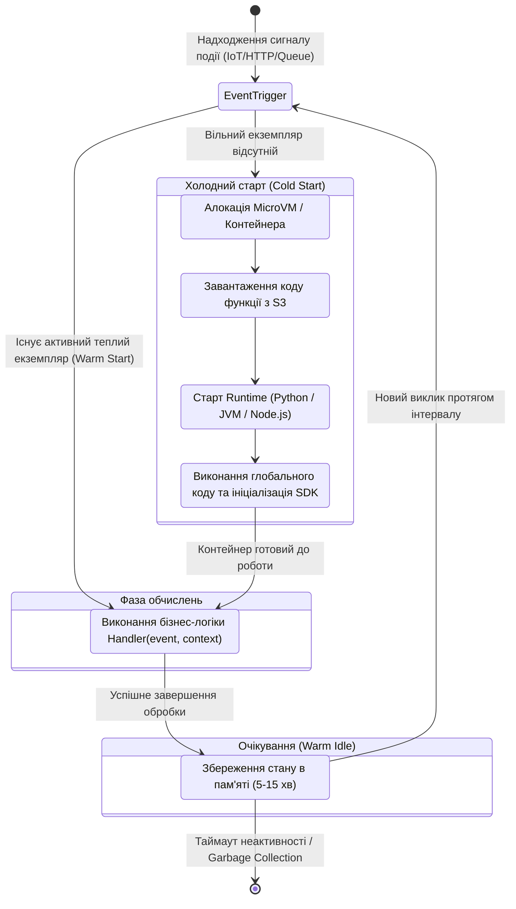
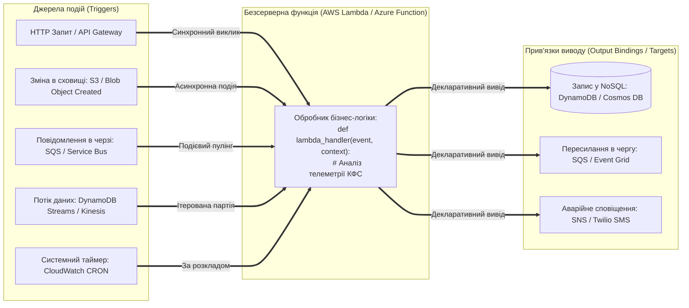
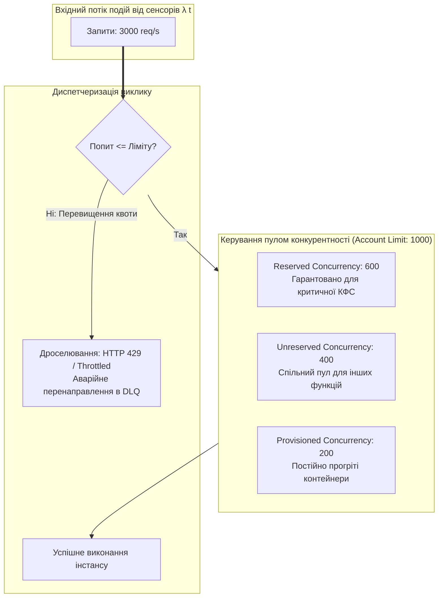
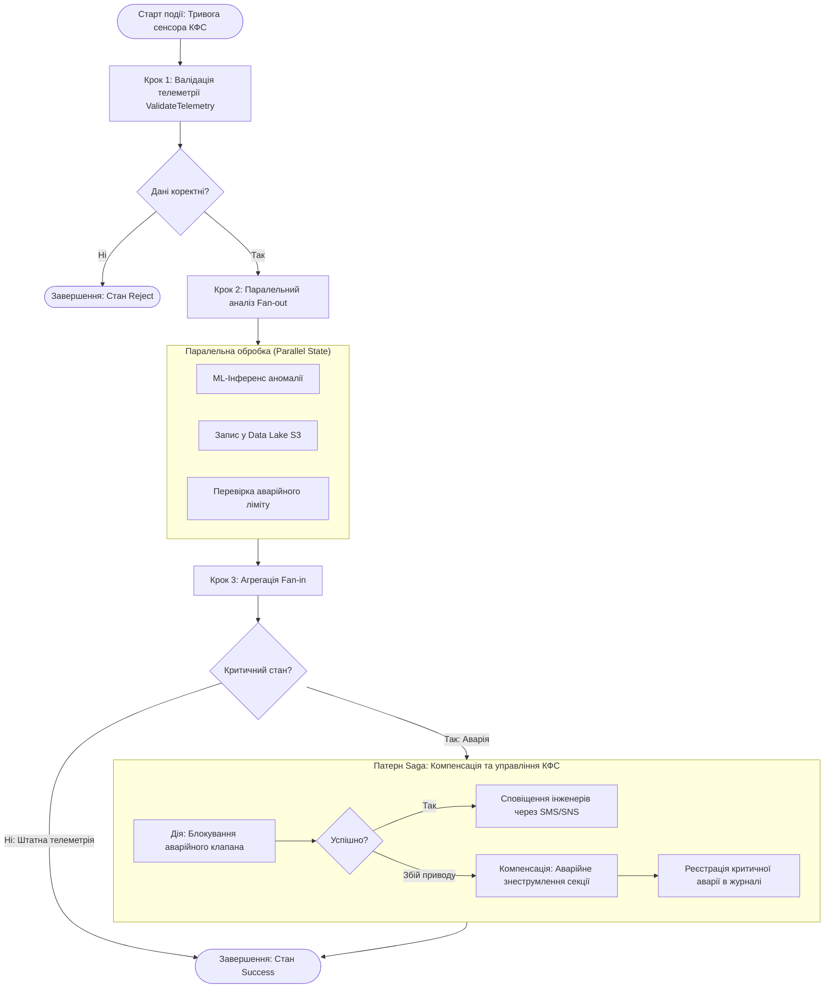

# Змістовий модуль 2. Безсерверні обчислення, Інфраструктура як код (IaC), безпека та аналітика

# Тема 5. Безсерверна архітектура (Serverless / FaaS) та мікросервіси

---

## 5.1. Концепція Serverless та Function-as-a-Service (FaaS): принципи, життєвий цикл безсерверної функції, поняття «Cold Start» та методи його мінімізації

### Основний зміст та теоретичний базис

Еволюція архітектурних стилів розподілених систем пройшла шлях від монолітних додатків, розгорнутих на фізичних серверах, крізь віртуалізовані мікросервісні комплекси до концепції **безсерверних обчислень (Serverless Computing)**. Безсерверна парадигма не означає фізичної відсутності серверного обладнання; вона визначає фундаментальну зміну операційної моделі, за якої розробник повністю звільняється від рутинного адміністрування операційних систем, конфігурування віртуальних машин, керування оновленнями безпеки та ручного налаштування кластерів масштабування.

Ядром безсерверної моделі є концепція **«Функція як послуга» (Function-as-a-Service, FaaS)**. У цій моделі атомарною одиницею розгортання та виконання виступає окрема функція (Handler), яка містить виключно цільову бізнес-логіку обробки події. 

Відповідно до фундаментальних принципів Serverless-архітектури виділяють чотири базові критерії функціонування системи:
* Повна абстракція серверної інфраструктури, що виключає необхідність управління хостовими або віртуалізованими екземплярами.
* Автоматичне еластичне масштабування, яке пропорційно змінює кількість активних середовищ виконання від нуля до десятків тисяч паралельних викликів у відповідь на зміну інтенсивності вхідного потоку подій.
* Модель оплати за фактично використані ресурси (Pay-for-Value), за якої фінансові нарахування відбуваються виключно за час безпосереднього виконання програмного коду, а плата за простій (Idle time) дорівнює нулю.
* Вбудована висока доступність і стійкість до відмов, що забезпечується автоматичним дублюванням середовищ виконання між різними зонами доступності хмарного регіону.

Життєвий цикл безсерверної функції має суворо подієвий характер (**Event-Driven Lifecycle**) і керується внутрішнім оркестратором платформи провайдера. При надходженні сигналу тригера хмарна платформа перевіряє наявність готового до роботи ізольованого контейнера або спеціалізованої мікро-віртуальної машини (**MicroVM**, наприклад, на базі технології AWS Firecracker). 

Якщо вільний екземпляр відсутній, ініціюється фаза **холодного старту (Cold Start)**. Під час цієї фази платформа здійснює виділення апаратних ресурсів, завантажує заархівований образ функції або контейнерний шар із реєстру, ініціалізує середовище виконання (Language Runtime: Python, Node.js, JVM), виконує глобальний код ініціалізації поза тілом основної функції (підключення сторонніх бібліотек, встановлення пулів з'єднань із базами даних, конфігурування клієнтів SDK) і лише після цього передає управління безпосередньому обробнику події (**Handler**). 

Після завершення виконання обчислювальний мікроконтейнер не знищується миттєво, а переводиться у стан очікування («теплий стан», **Warm State**) на певний проміжок часу (зазвичай від 5 до 15 хвилин). Якщо протягом цього інтервалу надходить наступний виклик, він обслуговується миттєво без фази повторної ініціалізації (**Warm Start**). У разі відсутності нових подій платформа виконує процедуру збирання сміття та вивільняє ресурси хоста.

*Рисунок 5.1 — Стан та переходи життєвого циклу безсерверної функції в парадигмі FaaS*

Явище холодного старту є критичним викликом для кіберфізичних систем, які функціонують у режимі майже реального часу та вимагають детермінованих субсекундних затримок. Сумарний час повної обробки запиту $T_{\text{response}}$ математично формалізується виразом:

$$T_{\text{response}} = T_{\text{cold}} + T_{\text{exec}} + T_{\text{net}} = \left( t_{\text{alloc}} + t_{\text{fetch}} + t_{\text{runtime}} + t_{\text{init\_code}} \right) + T_{\text{exec}} + T_{\text{net}}$$

де $t_{\text{alloc}}$ — тривалість виділення віртуалізованого пісочникового оточення (MicroVM/Sandbox) у мілісекундах, $t_{\text{fetch}}$ — час завантаження кодового пакета через внутрішню мережу провайдера, $t_{\text{runtime}}$ — час завантаження віртуальної машини відповідної мови програмування, $t_{\text{init\_code}}$ — затримка виконання коду зовнішньої ініціалізації, $T_{\text{exec}}$ — час виконання обчислювального алгоритму функції, $T_{\text{net}}$ — кругова мережева затримка доставки сигналу.

Для мінімізації затримки холодного старту в інженерній практиці застосовують комплекс технологічних та архітектурних методів:
* Використання компільованих та легковісних середовищ виконання з мінімальним часом ініціалізації (наприклад, Go, Rust або оптимізованих версій Node.js та Python на противагу важким середовищам Java Virtual Machine або .NET CLR).
* Мінімізація розміру файлового пакета розгортання шляхом вилучення надлишкових бібліотек і застосування інструментів бандлінгу (Webpack, esbuild).
* Застосування механізму зарезервованої паралельності (**Provisioned Concurrency** у платформі AWS або **Always Ready Instances** в Azure), який підтримує попередньо ініціалізований пул мікроконтейнерів у постійно теплому стані, гарантуючи виконання за виразом $T_{\text{cold}} = 0$.
* Організація періодичних синтетичних сигналів підігріву (**Warm-Up Pings**) за допомогою системних планувальників (CloudWatch Events / EventBridge), що запобігає вивантаженню середовища з пам'яті через неактивність.

*Таблиця 5.1 — Порівняльний аналіз характеристик популярних середовищ виконання FaaS*

| Середовище виконання (Runtime) | Середній час Cold Start ($T_{\text{cold}}$) | Базове споживання пам'яті | Продуктивність обчислень | Оптимальна сфера використання в КФС |
| :--- | :--- | :--- | :--- | :--- |
| **Python 3.11 / 3.12** | 100–300 мс | 30–50 МБ | Середня / Висока (з C-модулями) | Швидкий парсинг JSON, аналітика, ML-інференс |
| **Node.js 18 / 20 LTS** | 80–200 мс | 35–60 МБ | Висока (подієвий I/O асинхрон) | Високонавантажені API-шлюзи, вебхуки, I/O-задачі |
| **Golang (Custom Runtime)** | 15–50 мс | 10–25 МБ | Дуже висока (нативний машинний код) | Низьколатентна потокова обробка телеметрії |
| **Rust (LLVM Native)** | 10–30 мс | 8–15 МБ | Максимальна (нативний машинний код) | Критичні системи управління реального часу |
| **Java 17 / 21 (JVM)** | 800–3000 мс | 120–250 МБ | Дуже висока (після JIT-прогріву) | Важкі корпоративні інтеграційні транзакції |

Дані таблиці 5.1 демонструють, що для високошвидкісних кіберфізичних систем пріоритетними є нативні середовища або оптимізовані інтерпретатори, що дозволяють мінімізувати накладні витрати на ініціалізацію мікроконтейнерів.

---

## 5.2. Платформи FaaS провідних провайдерів: AWS Lambda, Azure Functions, GCP Cloud Functions. Джерела подій (Event Sources / Triggers) та прив'язки (Bindings)

### Основний зміст та теоретичний базис

Провідні хмарні провайдери пропонують власні екосистеми безсерверних обчислень, кожна з яких має унікальні архітектурні особливості реалізації, інтеграції з хмарними сервісами та керування життєвим циклом компонентів.

**Amazon Web Services (AWS Lambda).**
Історично перша масова FaaS-платформа (представлена у 2014 році), яка базується на використанні відкритого гіпервізора мікро-віртуальних машин **Firecracker**. Firecracker функціонує поверх модуля ядра Linux KVM і забезпечує створення безпечного, ізольованого середовища виконання з мінімальним оверхедом пам'яті (близько 5 МБ на екземпляр) та часом ініціалізації до 5 мілісекунд. 

AWS Lambda підтримує завантаження коду як у вигляді zip-архівів, так і у форматі OCI-сумісних контейнерних образів розміром до 10 ГБ. Інтеграція з іншими службами реалізується через систему зіставлення джерел подій (**Event Source Mapping**) та модель управління правами доступу на основі IAM Execution Roles.

**Microsoft Azure (Azure Functions).**
Платформа побудована на базі відкритого ядра **Azure Functions Host Runtime**, що може виконуватися як у хмарі, так і локально на периферійних пристроях (Edge Devices на базі IoT Edge). Особливістю Azure є групування функцій у логічні сутності — **Function Apps**, які спільно використовують конфігураційні параметри, масштабування та пули з'єднань. 

Azure Functions пропонує три моделі розгортання:
* План споживання (Consumption Plan), що реалізує класичну модель Serverless із динамічним масштабуванням.
* Преміум-план (Premium Plan), який забезпечує постійно прогріті інстанси, інтеграцію з віртуальними мережами VNet та необмежену тривалість виконання.
* Виділений план (Dedicated / App Service Plan), де функції працюють на фіксованих віртуальних машинах за класичною моделлю IaaS.

**Google Cloud Platform (Google Cloud Functions).**
Сучасна генерація платформи (Cloud Functions v2) побудована на базі технологій **Google Cloud Run** та відкритого стандарту **Knative**, що функціонує в середовищі кластерів Kubernetes під управлінням контейнерних пісочниць безпеки **gVisor**. Це забезпечує повну сумісність із контейнерними стандартами OCI, розширену підтримку тривалості сесій до 60 хвилин та можливість обробки кількох паралельних запитів одним екземпляром функції (Concurrency).

*Рисунок 5.2 — Архітектура подієвих тригерів, середовища обробки та декларативних прив'язок FaaS*

Фундаментальною концепцією взаємодії у безсерверних архітектурах є поділ на **тригери (Triggers / Event Sources)** та **прив'язки (Bindings)**.

**Тригер (Trigger)** — це зовнішній механізм або подія, яка ініціює запуск безсерверної функції. Кожна функція обов'язково повинна мати рівно один активний тригер. За типом передачі керування тригери класифікуються на:
* Синхронні тригери (Request-Response): виклики через API Gateway або Application Load Balancer, де клієнт очікує повернення HTTP-відповіді з кодом статусу та корисним навантаженням.
* Асинхронні тригери (Event / Push): виклики від сервісів об'єктних сховищ (S3/Blob), подійних шин (EventBridge, Event Grid) або систем сповіщень (SNS), де платформа повертає клієнту статус `202 Accepted`, а виконання функції відбувається у фоновому режимі з автоматичним механізмом повторних спроб (Retries).
* Потокові тригери на основі опитування (Polling / Stream-based): регулярне вичитування пачок записів із черг (SQS, RabbitMQ) або розподілених журналів подій (DynamoDB Streams, Apache Kafka, Kinesis) внутрішніми поллерами провайдера.

**Прив'язки (Bindings)** — це спеціалізований декларативний механізм (найбільш повно реалізований у платформі Azure Functions за допомогою конфігураційного маніфесту `function.json`), що дозволяє безшовно підключати зовнішні джерела даних до функції без необхідності ручного написання коду ініціалізації клієнтів SDK, автентифікації та керування сокетами. 

Прив'язки поділяються на:
* **Вхідні прив'язки (Input Bindings)** — автоматично завантажують необхідні зовнішні дані (наприклад, документ із бази даних NoSQL або файл конфігурації зі сховища) безпосередньо перед виконанням функції та передають їх як вхідний аргумент обробника.
* **Вихідні прив'язки (Output Bindings)** — перехоплюють значення, повернуте функцією після завершення обчислень, і автоматично зберігають його у визначеному цільовому сервісі (запис у таблицю бази даних, надсилання повідомлення в чергу або виклик стороннього API).

*Таблиця 5.2 — Порівняльна матриця можливостей платформ AWS Lambda, Azure Functions та GCP Cloud Functions*

| Критерій порівняння | AWS Lambda | Azure Functions | Google Cloud Functions (v2) |
| :--- | :--- | :--- | :--- |
| **Базова технологія ізоляції** | MicroVM Firecracker (KVM) | App Service Sandbox / Контейнери | gVisor Sandbox поверх Cloud Run |
| **Максимальний час виконання** | 15 хвилин (900 секунд) | 10 хв (Consumption) / Безліміт (Premium) | 60 хвилин (3600 секунд) |
| **Діапазон виділення пам'яті** | Від 128 МБ до 10 240 МБ (з кроком 1 МБ) | Від 128 МБ до 4096 МБ (на екземпляр) | Від 128 МБ до 32 768 МБ |
| **Декларативні прив'язки** | Відсутні (використання коду AWS SDK) | Розвинені Input/Output Bindings | Відсутні (використання коду Google Cloud SDK) |
| **Модель паралельності екземпляра** | 1 запит = 1 контейнер (Single concurrency) | Мультипотокова обробка екземпляром | До 80 паралельних запитів на екземпляр |

Аналіз даних таблиці 5.2 показує, що для складних мікросервісних систем із розгалуженими джерелами даних Azure Functions надає найвищий рівень декларативної інтеграції, тоді як AWS Lambda забезпечує найбільш ізольовану та передбачувану модель обробки поодиноких подій.

---

## 5.3. Моделі масштабування (Concurrency, Throttling), ліміти виконання функцій та тарифікація за фактичний час обчислення (Execution duration)

### Основний зміст та теоретичний базис

Ключовою перевагою безсерверної парадигми є здатність платформи автоматично адаптувати обчислювальні потужності відповідно до динаміки вхідного потоку подій. Кількість активних середовищ виконання, які функціонують одночасно в певний момент часу, визначається показником **конкурентності (Concurrency / Concurrent Executions)**.

Відповідно до фундаментального закону теорії масового обслуговування — **закону Літтла (Little's Law)** — середня кількість паралельно виконуваних екземплярів функції $C(t)$ у стаціонарному режимі прямо пропорційна інтенсивності вхідного потоку подій $\lambda(t)$ та середньому часу виконання одного виклику $\overline{t}_{\text{exec}}$:

$$C(t) = \lambda(t) \cdot \overline{t}_{\text{exec}}$$

де $\lambda(t)$ — кількість вхідних запитів, що надходять за одну секунду (Requests Per Second, RPS), $\overline{t}_{\text{exec}}$ — середня тривалість виконання функції (у секундах). Наприклад, якщо кіберфізична система генерує $\lambda = 5000\text{ req/s}$, а тривалість обробки одного пакета становить $\overline{t}_{\text{exec}} = 0{,}2\text{ с}$, необхідна конкурентність складає $C = 5000 \cdot 0{,}2 = 1000$ одночасно активних мікроконтейнерів.

*Рисунок 5.3 — Механізм розподілу пулу конкурентності, резервування та дроселювання викликів*

Для запобігання неконтрольованому споживанню ресурсів та захисту бекенд-систем (наприклад, традиційних СУБД) від лавиноподібного навантаження хмарні провайдери впроваджують механізми **квот та дроселювання (Throttling)**:

* **Загальний регіональний ліміт акаунта (Account Concurrency Limit).** Базова квота за замовчуванням (наприклад, 1000 одночасних викликів у AWS Lambda), яка спільно використовується всіма функціями в межах одного регіону.
* **Зарезервована конкурентність (Reserved Concurrency).** Виділення гарантованої фіксованої частки із загального пулу для конкретної критично важливої функції. Це вирішує дві задачі: гарантує, що функція завжди матиме ресурс для масштабування навіть при вичерпанні загального ліміту акаунта іншими сервісами, та одночасно встановлює жорстку верхню межу, захищаючи цільову базу даних від перевантаження.
* **Незбережена конкурентність (Unreserved Concurrency).** Залишкова ємність пулу акаунта, яка динамічно розподіляється між усіма функціями, що не мають явного резервування.

Коли кількість одночасних запитів перевищує доступний ліміт конкурентності, платформа активує механізм дроселювання:
* Для синхронних викликів клієнту негайно повертається помилка з кодом **HTTP 429 Too Many Requests**.
* Для асинхронних викликів платформа автоматично буферизує повідомлення у внутрішній черзі та виконує повторні спроби виклику за алгоритмом експоненційного відступу протягом 6 годин.
* Для потокових тригерів (Kinesis / DynamoDB Streams) обробка шарду призупиняється до моменту звільнення ресурсів, блокуючи просування курсору читання.

Економічна модель тарифікації FaaS базується на квантуванні двох параметрів: сумарної кількості викликів $N_{\text{invoc}}$ та витраченого обчислювального ресурсу, вираженого в гігабайт-секундах ($\text{GB}\cdot\text{s}$). Сучасні платформи виконують посекундне або по-мілісекундне округлення часу виконання із дискретністю в 1 мілісекунду. 

Сукупна вартість використання безсерверної інфраструктури $C_{\text{FaaS\_month}}$ за розрахунковий місяць математично описується рівнянням:

$$C_{\text{FaaS\_month}} = N_{\text{invoc}} \cdot P_{\text{req}} + P_{\text{GB}\cdot\text{s}} \cdot \sum_{i=1}^{N_{\text{invoc}}} \left( \left\lceil \frac{M_i}{\Delta M} \right\rceil \cdot \Delta M \cdot 10^{-3} \cdot \left\lceil \frac{t_i}{\Delta t} \right\rceil \cdot \Delta t \cdot 10^{-3} \right)$$

де $N_{\text{invoc}}$ — загальна кількість виконаних викликів функції за місяць, $P_{\text{req}}$ — вартість одного виклику (наприклад, $\$0{,}20$ за 1 мільйон викликів в AWS), $P_{\text{GB}\cdot\text{s}}$ — базовий тариф за 1 гігабайт-секунду (наприклад, $\$0{,}0000166667$ для архітектури x86 або $\$0{,}0000133334$ для енергоефективної архітектури ARM Graviton2), $M_i$ — обсяг оперативної пам'яті, сконфігурований для $i$-го виклику (у мегабайтах), $\Delta M$ — крок дискретизації пам'яті (1 МБ), $t_i$ — фактична тривалість виконання $i$-го виклику (у мілісекундах), $\Delta t$ — крок тарифікації часу (1 мс).

Точка беззбитковості (**Break-Even Point**) між безсерверною моделлю FaaS та виділеною віртуальною машиною IaaS визначається зіставленням місячних витрат:

$$C_{\text{FaaS\_month}}(\lambda, \overline{t}_{\text{exec}}, M) \ge C_{\text{IaaS\_VM}} = 730 \cdot P_{\text{VM\_hour}}$$

де $P_{\text{VM\_hour}}$ — вартість оренди еквівалентного віртуального сервера за одну годину. 

Для систем із постійним, високоінтенсивним, рівномірним цілодобовим навантаженням (утилізація понад 70–80%) модель IaaS/контейнерів є економічно вигіднішою. Натомість для кіберфізичних систем зі змінним, спалахоподібним або спорадичним навантаженням (нічні простої, реакція на періодичні опитування датчиків) модель FaaS забезпечує зниження витрат на 60–90%.

*Таблиця 5.3 — Фінансово-експлуатаційні пороги вибору обчислювальних технологій*

| Критерій оцінки | Безсерверні функції (FaaS) | Керовані контейнери (AWS Fargate) | Виділені сервери (IaaS EC2) |
| :--- | :--- | :--- | :--- |
| **Характер навантаження** | Спорадичне, подієве, непередбачуване | Змінне або циклічне навантаження | Постійне, високе базове навантаження |
| **Плата за простій (0 RPS)** | Повністю відсутня ($0) | Повністю відсутня (при масштабуванні до 0) | Фіксована щогодинна плата за інстанс |
| **Тривалість обчислень** | Короткоживучі задачі (до 15 хв) | Довготривалі процеси (години/доби) | Необмежена безперервна робота |
| **Накладні витрати інжинірингу** | Мінімальні (лише прикладний код) | Середні (конфігурація контейнера) | Високі (адміністрування ядра ОС, патчі) |

---

## 5.4. Оркестрація безсерверних робочих процесів: AWS Step Functions, Azure Logic Apps / Durable Functions, реалізація патернів Saga, Retry, Fan-out/Fan-in для КФС

### Основний зміст та теоретичний базис

Ізольовані безсерверні функції є **stateless-сутностями** (позбавленими збереження внутрішнього стану між викликами). Спроба побудувати складний багатоетапний бізнес-процес виключно за рахунок прямого ланцюгового виклику однієї функції іншою призводить до виникнення антипатерну «розподіленого спагеті-коду» (**Point-to-Point Spaghetti Architecture**). За такої організації виникає жорстка залежність, подвійна тарифікація за час очікування відповіді, відсутність централізованого моніторингу та колосальні труднощі при відновленні після часткових аварій.

Для координації послідовностей виконання, розгалужень, паралельної обробки та обробки помилок у безсерверних середовищах застосовуються спеціалізовані **інструменти безсерверної оркестрації**:

1. **AWS Step Functions.** Декларативний сервіс оркестрації на основі кінцевих автоматів (**State Machines**), які описуються за допомогою спеціалізованого JSON-синтаксису **Amazon States Language (ASL)**. Сервіс підтримує різні типи станів: задачі (Task), логічні розгалуження (Choice), паралельні гілки (Parallel), динамічні цикли над масивами (Map), очікування таймера (Wait), а також фіксацію успіху чи збою (Succeed/Fail). Оркестратор бере на себе повний контроль за передачею контексту, автоматичними повторами та візуальним аудитом стану.
2. **Azure Durable Functions.** Розширення платформи Azure Functions, що дозволяє реалізовувати оркестрацію за допомогою звичайного коду на мовах C#, Python, JavaScript без використання складних конфігураційних файлів. В основі технології лежить патерн **Event Sourcing**: оркестратор автоматично фіксує історію виконання дій, а при відновленні після тривалих пауз повторно відтворює історію подій (**Replay mechanism**), усуваючи необхідність платити за час очікування зовнішніх подій.
3. **Azure Logic Apps.** Хмарний корпоративний інтеграційний сервіс із візуальним дизайнером низькорівневого програмування (Low-Code/No-Code), який містить сотні готових конекторів до корпоративних систем та сервісів SaaS.

*Рисунок 5.4 — Схема кінцевого автомата оркестрації Step Functions із патернами Fan-out/Fan-in та Saga для кіберфізичної системи*

Під час проєктування безсерверних конвеєрів для кіберфізичних систем критично важливими є такі архітектурні патерни:

#### 1. Патерн Saga (Компенсуючі транзакції)
У розподіленому безсерверному середовищі неможливо використовувати класичні блокуючі двофазні транзакції (2PC). Патерн Saga організує транзакцію як послідовність локальних кроків. Для кожного кроку $T_i$, який змінює стан системи (наприклад, зміна положення виконавчого сервоприводу), обов'язково проєктується відповідна компенсуюча дія $C_i$ (зворотне повернення приводу у вихідний безпечний стан). 

Якщо на кроці $k$ виникає критична помилка, оркестратор припиняє пряме виконання та послідовно в зворотному порядку виконує компенсуючі транзакції $C_{k-1}, C_{k-2}, \dots, C_1$, повертаючи кіберфізичну систему в цілісний і безпечний стан:

$$\text{Forward Flow: } T_1 \to T_2 \to \dots \to T_{k-1} \to T_k (\text{Fail}) \implies \text{Rollback Flow: } C_{k-1} \to C_{k-2} \to \dots \to C_1$$

#### 2. Патерн повторних спроб із експоненційним відступом та джитером (Retry with Exponential Backoff and Full Jitter)
При взаємодії з віддаленими контролерами або зовнішніми API часто виникають короткочасні збої мережі. Прямі повторні спроби призводять до лавиноподібного перевантаження системи («ефект натовпу», **Thundering Herd**). 

Оркестратор розраховує час затримки перед $n$-ю спробою $t_{\text{retry}}(n)$ за формулою експоненційного відступу з випадковим шумом (джитером):

$$t_{\text{retry}}(n) = \text{Uniform} \left( 0, \, \min \left( t_{\text{max}}, \, t_{\text{base}} \cdot 2^{n-1} \right) \right)$$

де $t_{\text{base}}$ — початковий інтервал затримки (наприклад, 1 секунда), $t_{\text{max}}$ — граничний максимальний час очікування (наприклад, 60 секунд), $n$ — порядковий номер поточної спроби повтору ($n \ge 1$), $\text{Uniform}(0, x)$ — функція генерації рівномірно розподіленої випадкової величини в діапазоні від 0 до $x$.

#### 3. Патерн розгалуження та злиття (Fan-out / Fan-in / Scatter-Gather)
Застосовується для масової паралельної обробки даних від сенсорних мереж. Оркестратор розбиває масив вхідних вимірювань на окремі записи, динамічно ініціалізує паралельні виклики обробних функцій (**Fan-out**), а після завершення всіх паралельних потоків збирає проміжні результати в єдиний агрегований звіт (**Fan-in**), передаючи його на рівень збереження.

*Таблиця 5.4 — Порівняльний аналіз систем безсерверної оркестрації*

| Параметр оцінки | AWS Step Functions | Azure Durable Functions | Apache Airflow (Керований) |
| :--- | :--- | :--- | :--- |
| **Парадигма опису робочого процесу** | Декларативний JSON-маніфест (ASL) | Імперативний програмний код (C#, Python) | Код мовою Python (орієнтовані графи DAG) |
| **Моніторинг та візуалізація** | Вбудована графічна консоль у реальному часі | Application Insights / Відкритий вебінтерфейс | Вбудований повнофункціональний вебсервер |
| **Максимальна тривалість процесу** | До 1 року (Standard Workflows) | Необмежена (завдяки Event Sourcing) | Необмежена (для тривалих пакетних задач) |
| **Латентність переходів між станами** | Мілісекунди (Express) / ~100 мс (Standard) | Субмілісекундна (локальний потік) | Секунди (орієнтовано на Batch обробку) |
| **Основне призначення** | Мікросервісна оркестрація, Saga, API | Складні транзакційні бізнес-алгоритми | Важкі ETL конвеєри та пакетна Big Data аналітика |

---

### Питання для самоперевірки та аналітичного осмислення

1. Розкрийте сутність концепції Serverless. Чому парадигма FaaS вважається найбільш економічно вигідною моделлю для кіберфізичних систем зі спорадичним або циклічним навантаженням?
2. Детально опишіть усі фази життєвого циклу безсерверної функції під час холодного старту (Cold Start). Які системні фактори зумовлюють тривалість фази ініціалізації середовища виконання?
3. Порівняйте механізми ізоляції в платформах AWS Lambda (MicroVM Firecracker) та Google Cloud Functions (gVisor). Яким чином досягається мілісекундний час старту без порушення вимог безпеки в мультитенантному середовищі?
4. Поясніть концептуальну різницю між тригерами (Triggers), вхідними прив'язками (Input Bindings) та вихідними прив'язками (Output Bindings) в Azure Functions. Як декларативні прив'язки спрощують код обробника?
5. Виведіть залежність необхідної кількості конкурентних викликів функції $C(t)$ від інтенсивності потоку подій на основі закону Літтла. Що відбувається з викликами при вичерпанні ліміту Reserved Concurrency?
6. За якими математичними формулами розраховується щомісячна вартість використання безсерверних функцій FaaS? Як перехід на архітектуру ARM Graviton2 впливає на сукупну вартість обчислень?
7. Розкрийте призначення та механізм функціонування патерну Saga в безсерверних робочих процесах (AWS Step Functions). Як організується виконання компенсуючих транзакцій у разі аварійної відмови одного з виконавчих пристроїв кіберфізичної системи?