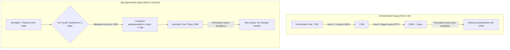
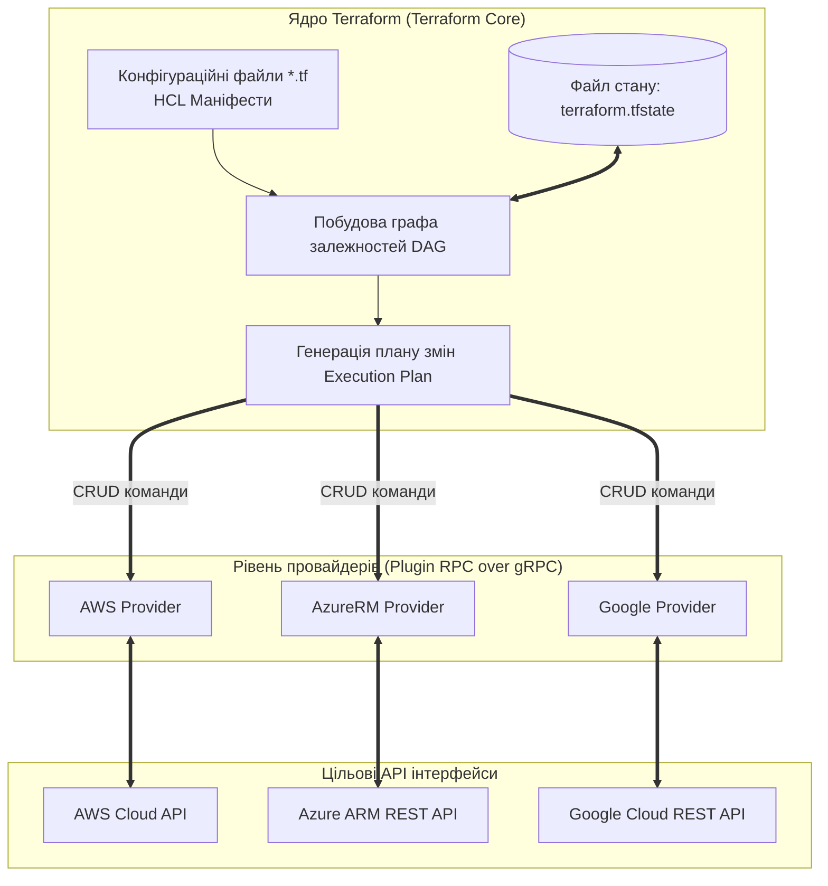
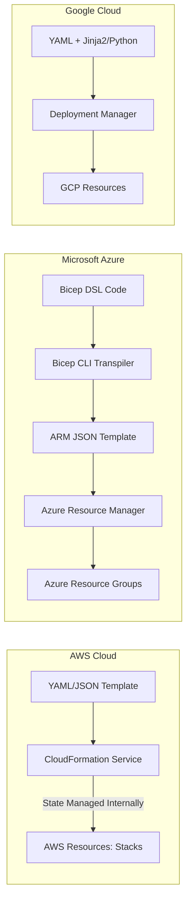
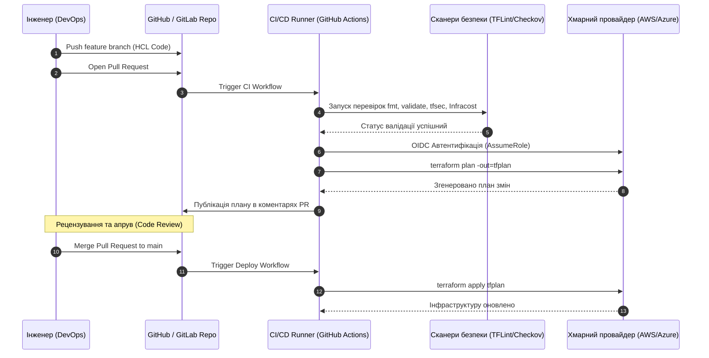
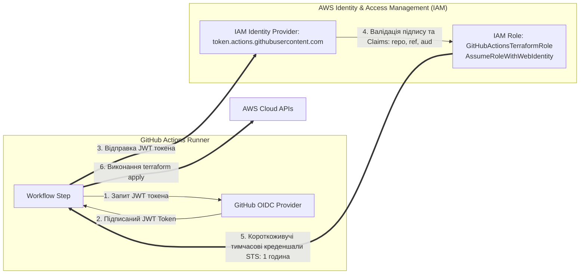

# Змістовий модуль 2. Безсерверні обчислення, Інфраструктура як код (IaC), безпека та аналітика

# Тема 6. Концепція «Інфраструктура як код» (IaC) та автоматизація розгортання

---

## 6.1. Парадигма Infrastructure as Code (IaC): декларативний проти імперативного підходу, ідемпотентність, контроль версій інфраструктури

### Основний зміст та теоретичний базис

Стрімке зростання масштабів сучасних хмарних середовищ та ускладнення топології кіберфізичних систем зумовили кризу традиційних ручних методів адміністрування інфраструктури (**ClickOps**). Ручне конфігурування ресурсів через графічні веб-консолі провайдерів або неструктуровані сценарії командного рядка неминуче призводить до виникнення людських помилок, неможливості точного відтворення середовищ розробки й промислової експлуатації, а також до неконтрольованого розходження конфігурацій — явища **дрейфу інфраструктури (Configuration Drift)**.

Відповіддю інженерії програмного забезпечення на ці виклики стала парадигма **«Інфраструктура як код» (Infrastructure as Code, IaC)**. Сутність концепції IaC полягає в описі, виділенні, конфігуруванні та управлінні обчислювальними мережами, серверами, сховищами даних і сервісами безпеки за допомогою машиночитаних текстових файлів специфікацій, до яких застосовуються ті самі інженерні практики, що й до вихідного коду прикладного програмного забезпечення (контроль версій, автоматизоване тестування, статичний аналіз, рецензування коду та безперервне розгортання).


*Рисунок 6.1 — Порівняння операційної логіки імперативного та декларативного підходів до виділення ресурсів*

У теорії автоматизації виділяють два фундаментальні підходи до опису інфраструктури:

1. **Імперативний (процедурний) підхід.** Розробник описує точну послідовність команд та інструкцій, які система повинна виконати для досягнення бажаного стану (відповідає на питання *«Як зробити?»*). Типовими прикладами імперативних інструментів є класичні оболонкові сценарії Bash, команди AWS CLI чи Azure CLI, а також процедурні секції інструментів конфігураційного управління. Головним недоліком імперативного підходу є відсутність розуміння поточного контексту системи: повторне виконання сценарію створення віртуальної машини призведе або до аварійної зупинки через конфлікт імен, або до помилкового створення дубліката ресурсу.
2. **Декларативний підхід.** Інженер описує виключно цільовий кінцевий стан інфраструктури, склад необхідних ресурсів та їхні взаємозв'язки за допомогою спеціалізованих предметно-орієнтованих мов (**Domain Specific Languages, DSL**, таких як HCL або Bicep) чи уніфікованих форматів розмітки (YAML, JSON), не вказуючи алгоритм його досягнення (відповідає на питання *«Що має існувати?»*). Рушій IaC самостійно аналізує поточний стан хмари, порівнює його з оголошеним маніфестом, виявляє розбіжності та автоматично будує оптимальний орієнтований граф дій, необхідних для переведення системи в цільовий стан.

Наріжним каменем декларативної парадигми є властивість **ідемпотентності (Idempotency)**. В алгебраїчному та системному розумінні операція вважається ідемпотентною, якщо її багаторазове повторне застосування дає той самий результат, що й одноразове виконання, не змінюючи кінцевий стан об'єкта. 

Нехай $S_0$ — початковий стан хмарної інфраструктури, $S_{\text{target}}$ — бажаний стан, задекларований у коді, а оператор $\mathcal{F}_{\text{IaC}}$ — функція розгортання маніфесту. Властивість ідемпотентності формалізується виразом:

$$\mathcal{F}_{\text{IaC}}^k(S_0) = \mathcal{F}_{\text{IaC}}(\dots \mathcal{F}_{\text{IaC}}(\mathcal{F}_{\text{IaC}}(S_0))\dots) = S_{\text{target}}, \quad \forall k \ge 1$$

де $k$ — довільна кількість повторних запусків процедури розгортання маніфесту без внесення змін до самого вихідного коду.

Вектор дрейфу конфігурації $\Delta S(t)$ у довільний момент часу $t$ визначається як симетрична різниця між фактичним станом хмарних ресурсів $S_{\text{actual}}(t)$ та оголошеним у репозиторії станом $S_{\text{declared}}$:

$$\Delta S(t) = \left( S_{\text{actual}}(t) \setminus S_{\text{declared}} \right) \cup \left( S_{\text{declared}} \setminus S_{\text{actual}}(t) \right)$$

Рушій декларативного управління реалізує оператор узгодження (**Reconciliation Operator, $\mathcal{R}$**), який генерує мінімальну множину компенсуючих атомарних дій:

$$\mathcal{R}(\Delta S(t)) \to \Delta_{\text{create}} \cup \Delta_{\text{modify}} \cup \Delta_{\text{destroy}}$$

де $\Delta_{\text{create}}$ — множина ресурсів, описаних у коді, але відсутніх у хмарі, $\Delta_{\text{modify}}$ — множина ресурсів із розбіжностями параметрів (наприклад, зміна типу інстансу або правил Security Group), $\Delta_{\text{destroy}}$ — множина неврахованих ресурсів, створених вручну в обхід системи контролю версій.

*Таблиця 6.1 — Порівняльний аналіз парадигм інфраструктурного моделювання*

| Критерій порівняння | Імперативна парадигма (Scripts / CLI) | Декларативна парадигма (IaC / DSL) |
| :--- | :--- | :--- |
| **Принцип опису** | Послідовність кроків та системних викликів | Кінцевий бажаний стан інфраструктури |
| **Керування станом** | Відсутнє (стан визначається логікою коду) | Явне відстеження через файл стану (**State**) |
| **Ідемпотентність** | Вимагає ручного написання складних перевірок | Забезпечується ядром рушія за замовчуванням |
| **Виявлення дрейфу** | Неможливе без окремого розроблення сканерів | Автоматичне порівняння на етапі планування |
| **Складність підтримки** | Експоненційно зростає зі збільшенням кодової бази | Лінійна та модульна завдяки графовій моделі |

---

## 6.2. Огляд мультихмарного інструменту HashiCorp Terraform: структура HCL, ресурси (resources), провайдери (providers), змінні (variables), стан інфраструктури (State File, State Locking)

### Основний зміст та теоретичний базис

Стандартом де-факто у сфері мультихмарної оркестрації інфраструктури є інструмент **HashiCorp Terraform**. Архітектура Terraform базується на модульному принципі та складається з двох фундаментальних компонентів: ядра (**Terraform Core**) та підключаємих модулів взаємодії з платформами — **провайдерів (Providers)**.


*Рисунок 6.2 — Модульна архітектура взаємодії Terraform Core, провайдерів та хмарних API*

Ядро Terraform Core інтерпретує конфігураційні файли, написані декларативною мовою **HashiCorp Configuration Language (HCL)**, зчитує файл поточного стану системи, будує спрямований ациклічний граф залежностей (**Directed Acyclic Graph, DAG**) і формує диференційний план виконання. Провайдери транслюють абстрактні декларації ресурсів у специфічні низькорівневі HTTP REST-запити до відповідних API кінцевих публічних чи приватних хмар (AWS, Azure, GCP, OpenStack, Proxmox VE).

Мова HCL оперує набором базових структурних блоків:
* Блок `terraform` задає версії рушія та конфігурує параметри віддаленого бекенду зберігання стану.
* Блок `provider` ініціалізує плагін цільової платформи, налаштовує регіон розгортання та облікові дані доступу.
* Блок `resource` визначає конкретний інфраструктурний компонент, який необхідно створити (наприклад, віртуальну мережу, інстанс сервера або таблицю бази даних).
* Блоки `variable` та `output` забезпечують параметризацію коду (вхідні змінні) та експорт отриманих значень (наприклад, згенерованої IP-адреси чи ID створеного ресурсу) відповідно.
* Блок `locals` оголошує проміжні константи та вирази для внутрішнього використання.

Розглянемо приклад закінченого промислового HCL-маніфесту для розгортання віртуальної мережі VPC, підмережі та об'єктного сховища S3 із шифруванням для кіберфізичної системи:

```hcl
terraform {
  required_version = ">= 1.5.0"
  required_providers {
    aws = {
      source  = "hashicorp/aws"
      version = "~> 5.0"
    }
  }
  backend "s3" {
    bucket         = "cps-terraform-state-prod"
    key            = "telemetry-core/terraform.tfstate"
    region         = "eu-central-1"
    dynamodb_table = "terraform-state-locks"
    encrypt        = true
  }
}

provider "aws" {
  region = var.aws_region
  default_tags {
    tags = {
      Environment = "Production"
      Project     = "CyberPhysicalMonitoring"
      ManagedBy   = "Terraform"
    }
  }
}

variable "aws_region" {
  type        = string
  default     = "eu-central-1"
  description = "Цільовий регіон розгортання інфраструктури"
}

variable "vpc_cidr" {
  type        = string
  default     = "10.100.0.0/16"
  description = "Адресний простір віртуальної приватної хмари КФС"
}

resource "aws_vpc" "cps_vpc" {
  cidr_block           = var.vpc_cidr
  enable_dns_hostnames = true
  enable_dns_support   = true

  tags = {
    Name = "cps-main-vpc"
  }
}

resource "aws_subnet" "cps_telemetry_subnet" {
  vpc_id            = aws_vpc.cps_vpc.id
  cidr_block        = "10.100.1.0/24"
  availability_zone = "${var.aws_region}a"

  tags = {
    Name = "cps-telemetry-private-subnet"
  }
}

resource "aws_s3_bucket" "telemetry_storage" {
  bucket        = "cps-telemetry-archive-encrypted"
  force_destroy = false
}

resource "aws_s3_bucket_server_side_encryption_configuration" "s3_encryption" {
  bucket = aws_s3_bucket.telemetry_storage.id

  rule {
    apply_server_side_encryption_by_default {
      sse_algorithm = "AES256"
    }
  }
}

output "vpc_id" {
  value       = aws_vpc.cps_vpc.id
  description = "Ідентифікатор створеної віртуальної мережі"
}
```

Критично важливим елементом архітектури Terraform є **файл стану (State File, `terraform.tfstate`)**. Цей файл у форматі JSON містить взаємно однозначне відображення між ресурсами, задекларованими в HCL-коді, та реальними фізичними об'єктами, створеними у провайдера, фіксуючи їхні динамічні системні ідентифікатори, метадані та залежності.

Зберігання файлу стану на локальному комп'ютері розробника є неприпустимим у командній розробці через ризики втрати даних, витоку конфіденційної інформації та виникнення стану перегонів (**Race Conditions**). 

Для забезпечення безпеки застосовується концепція **віддаленого бекенду (Remote Backend)** із дотриманням трьох обов'язкових правил:
* **Шифрування стану (State Encryption).** Файл стану містить конфіденційні атрибути у відкритому вигляді (паролі до баз даних, приватні ключі, токени). Тому сховище бекенду (AWS S3, Azure Blob) зобов'язане використовувати серверне шифрування за алгоритмом AES-256 або KMS із обмеженням прав доступу на рівні IAM.
* **Блокування стану (State Locking).** Механізм, що унеможливлює паралельне виконання команд модифікації інфраструктури різними інженерами або конвеєрами CI/CD. При ініціалізації команди `apply` створюється запис блокування (наприклад, за допомогою таблиці **AWS DynamoDB** з первинним ключем `LockID` або механізму блокування блобів **Azure Blob Lease**). Інші процеси при спробі модифікації отримують відмову до моменту зняття блокування.
* **Версійність стану (State Versioning).** Активація версійності в об'єктному сховищі бекенду забезпечує захист від пошкодження файлу стану та дозволяє миттєво відновити попередній коректний знімок інфраструктури.

Математично процес планування розгортання моделюється як топологічне сортування спрямованого ациклічного графа $G = (V, E)$, де $V = \{v_1, v_2, \dots, v_n\}$ — множина ресурсів, а $E = \{(v_i, v_j)\}$ — множина ребер залежностей, що означає необхідність створення ресурсу $v_i$ суворо перед ресурсом $v_j$. 

Мінімальний сумарний час виконання паралельного плану розгортання $T_{\text{provision}}$ за наявності $p$ паралельних потоків виконання обмежений тривалістю критичного шляху графа:

$$T_{\text{provision}} \ge \max_{\text{Path} \in \text{Paths}(G)} \left( \sum_{v \in \text{Path}} \tau(v) \right)$$

де $\tau(v)$ — тривалість виклику API та апаратного виділення конкретного ресурсу $v$ у хмарі провайдера.

---

## 6.3. Нативні інструменти провайдерів: AWS CloudFormation, Azure Resource Manager (ARM) / Bicep, Google Cloud Deployment Manager

### Основний зміст та теоретичний базис

Поряд із мультихмарними рішеннями провідні постачальники хмарних послуг надають власні інтегровані (нативні) інструменти класу «Інфраструктура як код». Головною перевагою нативних інструментів є повна підтримка всіх нових сервісів та параметрів провайдера з моменту їхнього офіційного релізу (**Day-0 Support**), відсутність потреби у зовнішньому управлінні файлами стану та повна інтеграція з внутрішніми механізмами авторизації IAM.


*Рисунок 6.3 — Порівняння архітектурних конвеєрів трансляції та виконання нативних інструментів IaC*

**AWS CloudFormation.**
Сервіс декларативного управління інфраструктурою у хмарі Amazon Web Services. Шаблони CloudFormation описуються у форматах JSON або YAML і групують ресурси в логічні одиниці управління — **стеки (Stacks)**. 

До ключових архітектурних концепцій CloudFormation належать:
* **Набори змін (Change Sets).** Попередній перегляд планованих модифікацій інфраструктури перед їхнім безпосереднім застосуванням (аналог `terraform plan`).
* **Стекові множини (StackSets).** Механізм одночасного розгортання та узгодження конфігурації стеків на рівні багатьох акаунтів AWS та в різних географічних регіонах.
* **Автоматичний відкат (Automated Rollback).** У разі виникнення помилки при створенні будь-якого ресурсу зі складу стека сервіс автоматично зупиняє процес і повертає всі попередньо створені компоненти у вихідний робочий стан, запобігаючи накопиченню «завислих» ресурсів.

**Azure Resource Manager (ARM) та Project Bicep.**
У хмарі Microsoft Azure базовим механізмом розгортання є система Azure Resource Manager. Початково шаблони ARM базувалися на складному та багатослівному синтаксисі JSON, що суттєво ускладнювало їхнє читання, структурування та повторне використання. 

Для розв'язання цієї проблеми корпорація Microsoft створила предметно-орієнтовану мову **Bicep**. Bicep є декларативною прозорою абстракцією над ARM JSON. Вихідні файли `.bicep` мають чистий, лаконічний синтаксис, підтримують модульність, автоматичну типізацію параметрів і транспілюються у стандартні шаблони ARM JSON на етапі розгортання. На відміну від Terraform, Bicep не вимагає конфігурування віддаленого бекенду та блокувань, оскільки актуальний стан усіх ресурсів відстежується безпосередньо фабрикою Azure Resource Manager.

**Google Cloud Deployment Manager.**
Декларативний інструмент хмари GCP, що використовує конфігураційні файли YAML у поєднанні з шаблонізаторами **Jinja2** або скриптами **Python**. Це дозволяє впроваджувати динамічну алгоритмічну генерацію інфраструктурних маніфестів (цикли, умовні розгалуження, обчислення параметрів мережі) безпосередньо під час формування шаблону розгортання.

*Таблиця 6.2 — Комплексне зіставлення нативних та мультихмарних інструментів IaC*

| Характеристика | HashiCorp Terraform | AWS CloudFormation | Azure Bicep | Google Deployment Manager |
| :--- | :--- | :--- | :--- | :--- |
| **Цільові платформи** | Мультихмарний (AWS, Azure, GCP, VMware) | Виключно екосистема AWS | Виключно екосистема Azure | Виключно екосистема GCP |
| **Синтаксис опису** | HashiCorp HCL | YAML / JSON | Bicep DSL (Transpiled to JSON) | YAML + Jinja2 / Python |
| **Керування State** | Файл стану (S3, GCS, Azure Blob) | Керовано нативно сервісом | Керовано нативно рівнем ARM | Керовано нативно сервісом |
| **Підтримка Day-0 API** | Залежить від оновлення провайдера | Миттєва нативна підтримка | Миттєва нативна підтримка | Миттєва нативна підтримка |
| **Модульність коду** | Terraform Registry / Git Modules | Вкладені стеки (Nested Stacks) | Bicep Modules / Private Registries | Шаблони Jinja2 / Python |

Дані таблиці 6.2 показують, що при побудові моновендорних систем використання нативних інструментів (таких як Bicep для Azure чи CloudFormation для AWS) мінімізує експлуатаційні накладні витрати на підтримку файлів стану, тоді як для гетерогенних та гібридних середовищ безальтернативним стандартом залишається Terraform.

---

## 6.4. Інтеграція IaC у конвеєри безперервної інтеграції та розгортання (CI/CD Pipelines) з використанням GitHub Actions / GitLab CI для хмарних сервісів

### Основний зміст та теоретичний базис

Кульмінацією впровадження парадигми «Інфраструктура як код» є її безшовна інтеграція в автоматизовані конвеєри безперервної інтеграції та розгортання (**Continuous Integration / Continuous Delivery, CI/CD**), що формує сучасний операційний підхід **GitOps**. За концепцією GitOps репозиторій системи контролю версій Git є єдиним джерелом правди (**Single Source of Truth**) щодо бажаного стану інфраструктури, а будь-які зміни вносяться виключно через процедуру створення запитів на злиття (**Pull Requests / Merge Requests**) та проходження автоматизованих етапів тестування.


*Рисунок 6.4 — Послідовність етапів конвеєра автоматизованого тестування та розгортання IaC у парадигмі GitOps*

Класичний конвеєр розгортання IaC у системах GitHub Actions або GitLab CI містить шість послідовних фаз:

1. **Синтаксичний контроль та форматування (Linting & Formatting).** Виконання команд `terraform fmt -check` та `terraform validate`, а також використання спеціалізованих лінтерів (**TFLint**) для перевірки дотримання стандарту коду та коректності оголошення типів.
2. **Статичний аналіз безпеки (SAST / Security Scanning).** Автоматизоване сканування коду HCL інструментами безпеки (**tfsec, Checkov, Trivy**) на наявність критичних архітектурних вразливостей (наприклад, надмірно відкриті порти `0.0.0.0/0` у Security Groups, відсутність шифрування дисків або бакетів, використання незахищених протоколів HTTP).
3. **Оцінка фінансових витрат (Cost Estimation).** Інтеграція утиліти **Infracost**, яка аналізує різницю коду в Pull Request, розраховує прогнозовану зміну місячного рахунку за хмарні послуги та публікує фінансовий звіт безпосередньо в коментарях до коду.
4. **Генерація плану змін (Dry-Run / Plan).** Формування бінарного файлу плану `terraform plan -out=tfplan` у непривілейованому режимі читання хмари.
5. **Ручний контроль та затвердження (Manual Approval Gate).** Обов'язкове рецензування згенерованого плану провідними архітекторами (Tech Lead / Security Officer) перед його застосуванням.
6. **Застосування змін (Apply).** Виконання команди `terraform apply tfplan` у захищеному середовищі раннера з автоматичним логуванням дій.

Критичним аспектом безпеки CI/CD-конвеєрів є відмова від використання постійних статичних ключів доступу (`AWS_ACCESS_KEY_ID`, `AWS_SECRET_ACCESS_KEY`). Використання статичних секретів створює загрозу їхнього випадкового витоку в публічні журнали виконання конвеєрів. 

Сучасним стандартом безпечної автентифікації є використання протоколу **OpenID Connect (OIDC)** та федеративного доступу:


*Рисунок 6.5 — Процедура безпарольної автентифікації раннера CI/CD за допомогою протоколу OpenID Connect (OIDC)*

Раннер GitHub Actions запитує короткоживучий криптографічно підписаний токен **JSON Web Token (JWT)** у внутрішнього сервісу GitHub OIDC. Потім раннер надсилає цей JWT-токен до сервісу хмарної автентифікації (AWS STS / Azure AD) за допомогою виклику `AssumeRoleWithWebIdentity`. Хмарний провайдер перевіряє цифровий підпис токена та звіряє його атрибути (**Claims**: ім'я репозиторію `repo:org/repo`, назву гілки `ref:refs/heads/main`, аудиторію `aud:sts.amazonaws.com`). У разі успішної перевірки провайдер генерує тимчасові креденшали з обмеженим терміном дії (від 15 до 60 хвилин), повністю усуваючи необхідність збереження постійних паролів у репозиторії.

Нижче наведено приклад повноцінного конфігураційного маніфесту конвеєра **GitHub Actions (`.github/workflows/terraform.yml`)**, що реалізує захищену OIDC-автентифікацію, статичний аналіз коду та розгортання інфраструктури:

```yaml
name: "Terraform Production CI/CD Pipeline"

on:
  push:
    branches: [ "main" ]
  pull_request:
    branches: [ "main" ]

permissions:
  id-token: write # Необхідно для генерації JWT токена OIDC
  contents: read  # Необхідно для клонування репозиторію
  pull-requests: write # Необхідно для публікації коментарів у PR

jobs:
  validate:
    name: "Static Validation & Security Scan"
    runs-on: ubuntu-latest
    steps:
      - name: "Checkout Source Code"
        uses: actions/checkout@v3

      - name: "Setup HashiCorp Terraform"
        uses: hashicorp/setup-terraform@v2
        with:
          terraform_version: "1.6.0"

      - name: "Terraform Format Check"
        run: terraform fmt -check

      - name: "Terraform Init (Local Backend Validation)"
        run: terraform init -backend=false

      - name: "Terraform Validate"
        run: terraform validate

      - name: "Run Security SAST Scanner (Checkov)"
        uses: bridgecrewio/checkov-action@master
        with:
          framework: terraform
          soft_fail: false

  deploy:
    name: "Terraform Plan & Apply"
    needs: validate
    runs-on: ubuntu-latest
    steps:
      - name: "Checkout Source Code"
        uses: actions/checkout@v3

      - name: "Configure AWS Credentials via OIDC"
        uses: aws-actions/configure-aws-credentials@v2
        with:
          role-to-assume: "arn:aws:iam::123456789012:role/GitHubActionsTerraformRole"
          aws-region: "eu-central-1"

      - name: "Setup HashiCorp Terraform"
        uses: hashicorp/setup-terraform@v2
        with:
          terraform_version: "1.6.0"

      - name: "Terraform Init (Remote S3 Backend)"
        run: terraform init

      - name: "Terraform Plan"
        id: plan
        run: terraform plan -no-color -out=tfplan
        continue-on-error: false

      - name: "Terraform Apply (Only on Main Branch Merge)"
        if: github.ref == 'refs/heads/main' && github.event_name == 'push'
        run: terraform apply -auto-approve tfplan
```

*Таблиця 6.3 — Інструментарій забезпечення якості та безпеки в екосистемі IaC CI/CD*

| Інструмент | Цільовий рівень аналізу | Основна функція |
| :--- | :--- | :--- |
| **TFLint** | Синтаксичний та структурний аналіз | Виявлення помилок конфігурації провайдерів та застарілих конструкцій |
| **tfsec / Checkov** | Статичний аналіз безпеки (SAST) | Пошук порушень стандартів безпеки (CIS Benchmarks, відкриті порти, незашифровані диски) |
| **Infracost** | Фінансовий аудит (FinOps) | Розрахунок змін у вартості хмари на основі `terraform plan` |
| **Terratest** | Інтеграційне тестування (Go) | Створення реальних тимчасових ресурсів, перевірка їхньої функціональності та негайне видалення |

---

### Питання для самоперевірки та аналітичного осмислення

1. Розкрийте зміст парадигми «Інфраструктура як код» (IaC). Яким чином властивість ідемпотентності декларативних маніфестів усуває проблему дрейфу конфігурацій (Configuration Drift) у великих розподілених системах?
2. Опишіть призначення та внутрішню структуру файлу стану `terraform.tfstate`. Які критичні загрози безпеці виникають при зберіганні файлу стану у відкритому Git-репозиторії, і за допомогою яких механізмів реалізується безпечний Remote Backend?
3. Поясніть механізм блокування стану (State Locking) в інструменті Terraform. Які аномалії та збої виникають у хмарній інфраструктурі, якщо два інженери або паралельні CI/CD конвеєри одночасно виконають команду `terraform apply` без активованого блокування?
4. Зіставте мультихмарний інструмент HashiCorp Terraform із нативними інструментами провайдерів (AWS CloudFormation та Azure Bicep). У яких випадках використання мови Bicep є архітектурно та операційно виправданішим за використання Terraform?
5. Опишіть призначення спрямованого ациклічного графа залежностей (DAG) у ядрі Terraform Core. Як визначається критичний шлях розгортання ресурсів, і за якою формулою оцінюється мінімальний час паралельного виконання плану?
6. Детально розкрийте алгоритм безпарольної автентифікації раннерів CI/CD (GitHub Actions) у хмарі за допомогою протоколу OpenID Connect (OIDC). Чому використання OIDC та ролей IAM є безпечнішим за збереження статичних ключів `AWS_ACCESS_KEY_ID` у секретах репозиторію?
7. Сформулюйте основні етапи побудови ідеального конвеєра тестування інфраструктурного коду за методологією GitOps (від форматування до інтеграційного тестування інструментом Terratest).