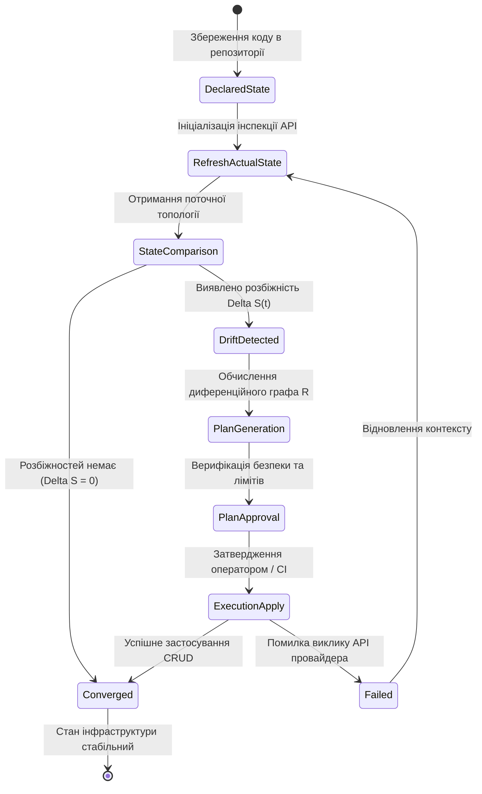
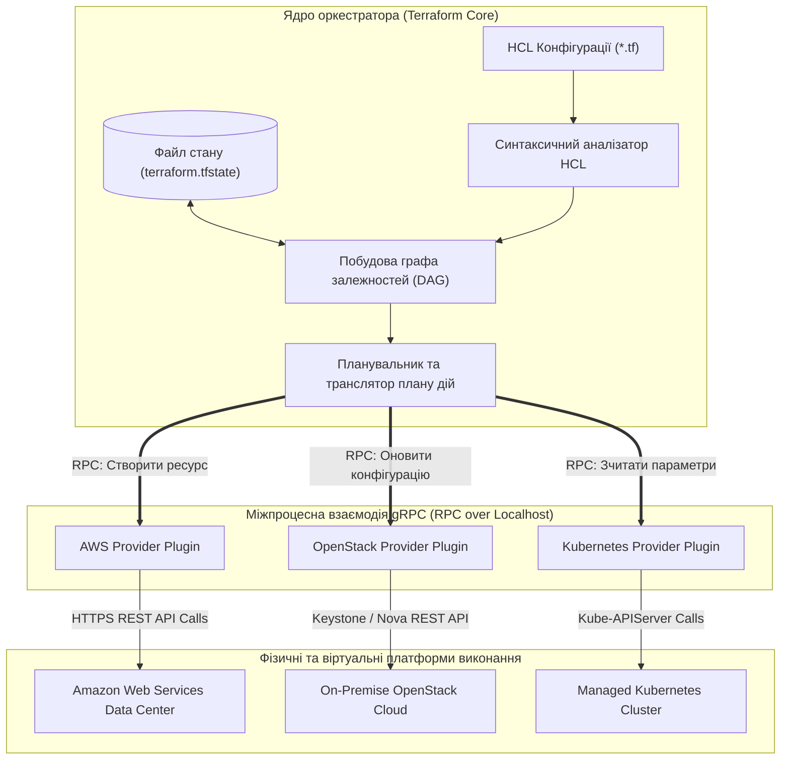
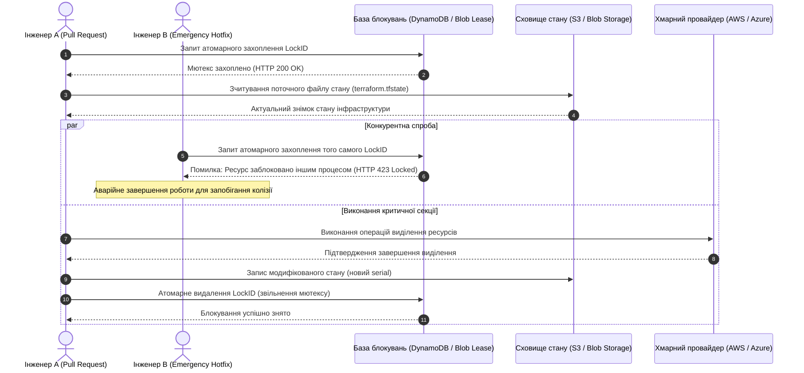
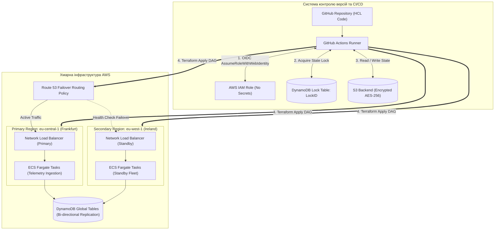

# Тема 6. Концепція «Інфраструктура як код» та автоматизація розгортання

## Мета лекції
Формування у майбутніх інженерів комп'ютерних систем поглиблених теоретичних знань та системних практичних компетентностей щодо проектування, розгортання та супроводу сучасних хмарних інфраструктур за допомогою парадигми «Інфраструктура як код» (Infrastructure as Code, IaC). Лекція спрямована на опанування математичного та логічного апарату декларативного моделювання розподілених обчислювальних ресурсів, вивчення механізмів конвергенції та забезпечення ідемпотентності змін, дослідження внутрішньої компонентної архітектури мультихмарних оркестраторів (на прикладі HashiCorp Terraform) і нативних хмарних рушіїв, а також на набуття інженерних навичок побудови відмовостійких конвеєрів автоматизованого розгортання (GitOps / CI/CD) з безпарольною автентифікацією за протоколом OpenID Connect для забезпечення цілісності та безпеки промислових кіберфізичних і корпоративних платформ.

## Очікувані результати навчання
1. **Знання та розуміння.** Здобувачі засвоять фундаментальні відмінності між імперативною та декларативною моделями конфігурування обчислювальних систем, теоретичні основи функціонування оператора узгодження станів і властивості ідемпотентності, внутрішню архітектуру інструментів IaC, а також принципи організації розподіленого зберігання та блокування файлів стану інфраструктури.
2. **Застосування.** Студенти набудуть практичних умінь самостійно розробляти модульні специфікації інфраструктури предметно-орієнтованими мовами, налаштовувати захищені віддалені сховища стану із взаємним блокуванням паралельних модифікацій, формалізувати конфігурації хмарних ресурсів і впроваджувати автоматизовані процедури безпарольної автентифікації агентів розгортання через протокол OpenID Connect у сучасних платформах безперервної інтеграції.
3. **Аналіз.** Слухачі зможуть виконувати структурну декомпозицію інфраструктурних залежностей, аналізувати спрямовані ациклічні графи взаємозв'язків ресурсів для оптимізації критичного шляху виконання паралельних розгортань, порівнювати архітектурні переваги й обмеження мультихмарних рішень щодо нативних інструментів хмарних провайдерів, а також локалізувати джерела дрейфу конфігурації у критичних системах.
4. **Оцінювання та синтез.** Майбутні фахівці оволодіють методологією аудиту безпеки й фінансової ефективності коду інфраструктури за допомогою інструментів статичного тестування, навчаться оцінювати ризики виникнення колізій і станів перегонів при паралельній командній розробці та синтезувати комплексні, стійкі до відмов конвеєри доставки інфраструктури за принципами GitOps.

---

## Детальний покроковий план лекції

### 1. Теоретико-концептуальний базис. Моделі, парадигми та формальний апарат автоматизації хмарної інфраструктури
* 1.1. Еволюція методів системного адміністрування: криза підходу ClickOps, виникнення проблеми дрейфу конфігурації (Configuration Drift) та концептуальні основи парадигми Infrastructure as Code.
* 1.2. Теоретико-множинне зіставлення імперативної та декларативної моделей опису систем, математична формалізація ідемпотентності та оператора узгодження станів.
* 1.3. Архітектура та компонентна взаємодія оркестратора HashiCorp Terraform: інтерпретація синтаксису HCL, трансляція ресурсів через плагіни провайдерів і топологічне сортування спрямованого ациклічного графа (DAG).
* 1.4. Архітектурні особливості та специфікація нативних декларативних інструментів публічних хмарних платформ: AWS CloudFormation, Azure Bicep / ARM та Google Cloud Deployment Manager.

### 2. Методологія та аналіз граничних умов. Управління станом, безпека конвеєрів розгортання та інженерні обмеження IaC
* 2.1. Життєвий цикл і структура файлу стану інфраструктури (State File), вимоги до віддалених бекендів, політики шифрування та синхронізація метаданих ресурсів.
* 2.2. Механізми запобігання стану перегонів (Race Conditions) при розподіленій модифікації інфраструктури за допомогою протоколів розподіленого блокування (State Locking).
* 2.3. Парадигма GitOps та проектування конвеєрів CI/CD розгортання інфраструктури на базі GitHub Actions і GitLab CI з відмовою від довготривалих статичних секретів.
* 2.4. Архітектура безпарольної федеративної автентифікації раннерів за протоколом OpenID Connect (OIDC) у зв'язці з хмарними сервісами управління ідентифікацією та доступом.
* 2.5. Критичні бар'єри та практичні обмеження парадигми IaC: десинхронізація стану внаслідок позаштатних ручних втручань, проблема первинного бутстрапінгу бекенду («куряче яйце»), тротлінг викликів хмарних API за умов масштабного паралелізму та ризики витоку чутливих даних через відкритий стан.

### 3. Практичний індустріальний / фаховий кейс. Наскрізне проєктування відмовостійкого хмарного середовища
**Тема наскрізної задачі.** «Синтез мультирегіонального відмовостійкого контуру телеметрії кіберфізичної системи засобами Terraform та GitOps-пайплайну GitHub Actions з OIDC-автентифікацією в AWS»

## 1. Теоретико-концептуальний базис. Моделі, парадигми та формальний апарат автоматизації хмарної інфраструктури

### 1.1. Еволюція методів системного адміністрування: криза підходу ClickOps, виникнення проблеми дрейфу конфігурації та концептуальні основи парадигми Infrastructure as Code

Історичний розвиток обчислювальних систем пройшов шлях від монолітних апаратних комплексів із жорстко фіксованою конфігурацією до віртуалізованих та програмно-керованих середовищ гіпермасштабованих центрів обробки даних. На початкових етапах експлуатації хмарних ресурсів домінував інтуїтивний підхід ручного керування через інтерактивні веб-консолі провайдерів або локальні командні утиліти, який у сучасній інженерній практиці отримав назву **ClickOps**. За такого методу інженер виконує дискретні операції виділення обчислювальних вузлів, комутації віртуальних мереж та налаштування правил маршрутизації безпосередньо в графічному інтерфейсі користувача. 

Практика експлуатації довела критичну непридатність підходу ClickOps для систем корпоративного та індустріального масштабу. Основним деструктивним фактором виступає людський фактор, який проявляється у невідтворюваності складних топологій, відсутності версійності та неможливості документування побічних змін. У результаті виникає феномен **серверів-сніжинок (Snowflake Servers)** — унікальних, конфігурованих вручну інстансів, внутрішня структура яких достеменно невідома навіть системним адміністраторам, що унеможливлює їхнє автоматичне відновлення після аварій.

Невідворотним наслідком ручних і неструктурованих маніпуляцій є явище **дрейфу конфігурації (Configuration Drift)**. Дрейф конфігурації є процесом спонтанного накопичення розбіжностей між початково спроєктованим нормативним станом інфраструктури та її фактичним операційним станом, зумовленим несанкціонованими виправленнями, екстреними ручними патчами на рівні операційної системи чи прямими коригуваннями мережевих правил в обхід регламентів. 

> **ПРАКТИЧНИЙ ЯКІР:** У 2012 році інвестиційна компанія Knight Capital Group втратила 440 мільйонів доларів лише за 45 хвилин торгової сесії через те, що інженер вручну розгорнув нову версію торговельного коду лише на семи із восьми серверів кластера, внаслідок чого несинхронізований восьмий сервер з некоректною конфігурацією спричинив лавиноподібну генерацію фіктивних біржових ордерів.

Парадигма **«Інфраструктура як код» (Infrastructure as Code, IaC)** виникла як інженерна відповідь на кризу ручного управління. В її основу покладено фундаментальний принцип: конфігурація обчислювальної інфраструктури (мережі, сервери, сховища, балансувальники навантаження, політики доступу) повинна описуватися у вигляді машиночитаних текстових файлів специфікацій. До цих файлів застосовуються суворі стандарти промислової розробки програмного забезпечення, зокрема контроль версій, статичний аналіз коду, автоматизоване модульне тестування, рецензування змін колегами та автоматизоване безперервне розгортання. Інфраструктура перестає бути статичним середовищем і перетворюється на динамічний програмний артефакт, що піддається строгому аудиту та швидкому тиражуванню.

---

### 1.2. Теоретико-множинне зіставлення імперативної та декларативної моделей опису систем, математична формалізація ідемпотентності та оператора узгодження станів

В інженерії програмно-керованих систем історично склалися дві фундаментальні моделі опису інфраструктурних змін: імперативна та декларативна. 

Імперативна модель базується на процедурному описі послідовності кроків, алгоритмів і конкретних команд, які необхідно виконати виконавчому механізму для модифікації ресурсів. Оператор у цьому разі зосереджений на питанні *«Як виконати зміну?»*. Імперативний підхід реалізується за допомогою традиційних сценаріїв командних оболонок Bash або PowerShell, а також команд інтерфейсів прикладного програмування хмарних провайдерів. Слабким місцем цієї моделі є відсутність розуміння поточного системного контексту: якщо скрипт створення віртуальної машини запускається повторно в середовищі, де ця машина вже функціонує, процедура завершиться або аварійною помилкою дублювання системного імені, або неконтрольованим створенням ще одного платного екземпляра.

Декларативна модель передбачає специфікацію виключно цільового кінцевого стану середовища, абстрагуючись від технологічного алгоритму його досягнення. Інженер формулює відповідь на запитання *«Що повинно існувати?»*. Декларативний рушій бере на себе функцію інтерпретації специфікації, опитує поточний стан хмарного оточення через API, будує математичну модель розбіжностей і самостійно розраховує перелік дій, необхідних для досягнення цільового результату.

Фундаментальною математичною вимогою до декларативних систем є властивість **ідемпотентності (Idempotency)**. Нехай $\mathcal{S}$ позначає простір можливих станів хмарної інфраструктури. Визначимо функцію розгортання декларативного маніфесту як відображення $\mathcal{F}_{\text{IaC}}: \mathcal{S} \to \mathcal{S}$. Оператор $\mathcal{F}_{\text{IaC}}$ називається ідемпотентним, якщо повторне застосування функції до отриманого результату не змінює стан системи, тобто виконується рівність:

$$\mathcal{F}_{\text{IaC}}(\mathcal{F}_{\text{IaC}}(S)) = \mathcal{F}_{\text{IaC}}(S) = S_{\text{target}}, \quad \forall S \in \mathcal{S}$$

де $S_{\text{target}}$ позначає кінцевий бажаний стан інфраструктури, зафіксований у декларативному коді. Це означає, що скільки б разів не виконувалася процедура розгортання без модифікації вихідного маніфесту, стан цільового середовища залишатиметься інваріантним.

Формалізуємо процес дрейфу конфігурації через теоретико-множинний апарат. Нехай у довільний момент часу $t$ актуальний стан інфраструктури репрезентується множиною фізичних та віртуальних ресурсів із відповідними векторами атрибутів $S_{\text{actual}}(t) = \{r_1, r_2, \dots, r_n\}$, а задекларований у системі контролю версій стан описується множиною $S_{\text{declared}} = \{d_1, d_2, \dots, d_m\}$.

Вектор розбіжності конфігурації, або величина дрейфу $\Delta S(t)$, визначається через симетричну різницю зазначених просторів станів:

$$\Delta S(t) = \left( S_{\text{actual}}(t) \setminus S_{\text{declared}} \right) \cup \left( S_{\text{declared}} \setminus S_{\text{actual}}(t) \right) \cup \left\{ r \in S_{\text{actual}}(t) \cap S_{\text{declared}} \mid \text{Attrs}(r) \neq \text{Attrs}(d_r) \right\}$$

де вираз $\text{Attrs}(r) \neq \text{Attrs}(d_r)$ фіксує невідповідність між параметрами існуючого в хмарі ресурсу та його декларативним описом (наприклад, несанкціонована зміна обсягу оперативної пам'яті чи зміна правил фаєрволу).

Для ліквідації виявленого дрейфу декларативний рушій застосовує **оператор узгодження (Reconciliation Operator, $\mathcal{R}$)**, який трансформує розбіжність $\Delta S(t)$ у множину коригувальних дій:

$$\mathcal{R}(\Delta S(t)) \to \Delta_{\text{create}} \cup \Delta_{\text{modify}} \cup \Delta_{\text{destroy}}$$

де $\Delta_{\text{create}}$ позначає ресурси, задекларовані в коді, але відсутні в інфраструктурі; $\Delta_{\text{modify}}$ описує параметричні зміни ресурсів для приведення їх у нормативні рамки; $\Delta_{\text{destroy}}$ охоплює чужорідні елементи, створені вручну поза системою автоматизації, що підлягають депровіженінгу для відновлення чистоти середовища.

Життєвий цикл оператора узгодження станів описується замкненим контуром зворотного зв'язку, який безперервно транзитує систему через верифікаційні фази.

> **ТИПОВА ПОМИЛКА:** Хибним є твердження, що декларативні інструменти не потребують збереження та аналізу поточного стану системи, оскільки вони «завжди знають кінцевий стан». Насправді декларативна парадигма є абсолютно недієздатною без наявності локального або віддаленого шару фіксації поточного стану, оскільки рушій не здатний визначити різницю між необхідністю створити новий ресурс і потребою модифікувати існуючий без прямого зіставлення маніфесту з метаданими раніше виділених об'єктів.

---

### 1.3. Архітектура та компонентна взаємодія оркестратора HashiCorp Terraform: інтерпретація синтаксису HCL, трансляція ресурсів через плагіни провайдерів і топологічне сортування спрямованого ациклічного графа

Мультихмарний інструмент **HashiCorp Terraform** є найяскравішим представником декларативних систем оркестрації. Архітектурно Terraform реалізований за модульним принципом із суворим розмежуванням обов'язків між центральним керуючим рушієм і підключаємими зовнішніми модулями. Ядро системи відокремлене від апаратно-залежних деталей конкретних хмар і взаємодіє з ними за допомогою стандартизованих інтерфейсів.

Компонент **Terraform Core** скомпільований у вигляді статичного бінарного файлу мовою Go. Він містить підсистему синтаксичного аналізу файлів декларативної мови **HashiCorp Configuration Language (HCL)**, підсистему керування файлом стану системи (`terraform.tfstate`) та алгоритмічний модуль побудови графа залежностей ресурсів. 

Рівень провайдерів формують незалежні зовнішні плагіни (**Terraform Providers**), кожен із яких відповідає за зв'язок із конкретним публічним, приватним хмарним API або апаратним сервісом (наприклад, AWS, Azure, Google Cloud, OpenStack, Proxmox VE). Зв'язок між Terraform Core та плагінами провайдерів реалізовано за допомогою міжпроцесної взаємодії через високопродуктивний протокол **gRPC** через UNIX-сокети або локальні мережеві порти, що забезпечує повну ізоляцію пам'яті та стабільність ядра при можливих збоях у коді сторонніх плагінів.

Математичним апаратом побудови плану виконання у Terraform Core є теорія графів. Множина всіх ресурсів інфраструктури формалізується у вигляді **спрямованого ациклічного графа (Directed Acyclic Graph, DAG)** $G = (V, E)$, де множина вершин $V = \{v_1, v_2, \dots, v_n\}$ позначає окремі блоки конфігурації ресурсів, а множина орієнтованих ребер $E = \{(v_i, v_j)\}$ описує структурні залежності. Наявність ребра $(v_i, v_j) \in E$ встановлює суворий порядок: виділення ресурсу $v_i$ мусить бути повністю завершене до моменту ініціалізації виділення ресурсу $v_j$. 

Залежності між вершинами поділяються на дві категорії:
1. **Неявні залежності (Implicit Dependencies)**, які рушій виявляє автоматично шляхом аналізу посилань на атрибути інших об'єктів у маніфесті (наприклад, підстановка вихідного ідентифікатора створеної віртуальної мережі `aws_vpc.main.id` у параметр конфігурації підмережі `aws_subnet.app.vpc_id`).
2. **Явні залежності (Explicit Dependencies)**, які інженер безпосередньо задає за допомогою мета-аргументу `depends_on` у випадках, коли зв'язок між компонентами існує на рівні внутрішньої логіки сервісів, але не виражений через спільні змінні у коді.

Для визначення коректної черговості створення ресурсів ядро здійснює **топологічне сортування** графа $G$. Якщо граф містить хоча б один орієнтований контур (циклічну залежність вигляду $v_1 \to v_2 \to \dots \to v_1$), алгоритм фіксує нерозв'язну помилку циклу і блокує операцію розгортання до ліквідації суперечності.

Вершини, між якими відсутні шляхи залежності у графі $G$, можуть ініціалізуватися паралельно. Якщо систему розгорнуто з використанням $p$ паралельних потоків виконання, мінімально можливий час розгортання всієї системи $T_{\text{provision}}$ обмежений довжиною критичного шляху графа:

$$T_{\text{provision}} \ge \max_{P \in \text{Paths}(G)} \left( \sum_{v \in P} \tau(v) \right)$$

де $\text{Paths}(G)$ є множиною всіх орієнтованих шляхів від кореневих вершин графа до кінцевих стоків, а $\tau(v)$ позначає часову затримку виконання операцій виділення ресурсу $v$ через мережеві виклики до API хмари.

> **ПРАКТИЧНИЙ ЯКІР:** Архітектурна ізоляція провайдерів у вигляді окремих gRPC-процесів дозволила спільноті Terraform масштабувати екосистему до понад 3000 незалежних модулів розширення: наприклад, оновлення версії провайдера для взаємодії з OpenStack не потребує перекомпіляції основного бінарного файлу Terraform чи внесення змін у сусідні модулі для AWS.

> **КОНТРОЛЬНЕ ПИТАННЯ:** Чому наявність циклічної залежності в орієнтованому графі ресурсів унеможливлює виконання фази планування розгортання навіть у тому випадку, коли кожен ресурс окремо описано синтаксично правильно?

Розгорнути аналіз / відповідь

**Правильний варіант: Неможливість топологічного сортування графа.**

1. Математичне обґрунтування: алгоритми побудови черговості виконання операцій виділення ресурсів базуються на топологічному сортуванні вершин орієнтованого графа (наприклад, за алгоритмом Кана або обходом у глибину). Обов'язковою умовою існування хоча б одного топологічного порядку є ациклічність графа ($DAG$). Якщо в графі присутній цикл $v_i \to \dots \to v_k \to v_i$, напівступінь заходу для кожної вершини в межах циклу ніколи не стане нульовим. Це створює ситуацію взаємного блокування (Deadlock), за якої жоден із ресурсів циклу не може бути ініціалізований першим, оскільки вимагає попереднього завершення створення іншого ресурсу з того ж ланцюжка.

2. Аналіз дистракторів: гіпотези про те, що затримка виникає через обмеження пропускної здатності мережі або відсутність відповідних API-ендпоінтів у хмарі, є технічно некоректними, оскільки зупинка відбувається на внутрішньому етапі синтаксичного та графового аналізу Terraform Core ще до ініціалізації викликів до хмарних провайдерів.

---

### 1.4. Архітектурні особливості та специфікація нативних декларативних інструментів публічних хмарних платформ: AWS CloudFormation, Azure Bicep / ARM та Google Cloud Deployment Manager

Поряд із мультихмарними оркестраторами провідні публічні провайдери пропонують власні, глибоко інтегровані інструменти автоматизації інфраструктури. На відміну від сторонніх рішень, нативні засоби мають низку специфічних архітектурних характеристик:
* Підтримка нових функцій і ресурсів постачальника в день їхнього офіційного релізу (**Day-0 Support**) без потреби очікувати на оновлення сторонніх бібліотек чи плагінів.
* Відсутність необхідності самостійного конфігурування та адміністрування зовнішніх серверів або баз даних для збереження файлів стану, оскільки функції управління життєвим циклом вбудовані безпосередньо у внутрішній шар оркестрації платформи.
* Повна синхронізація із внутрішніми підсистемами авторизації, управління політиками та журналювання подій хмари.

Сервіс **AWS CloudFormation** оперує концепцією **стеків (Stacks)** — логічних груп ресурсів, управління якими здійснюється як єдиним атомарним об'єктом. Маніфести CloudFormation описуються у форматах JSON або YAML. Важливою інженерною особливістю сервісу є функціонал **наборів змін (Change Sets)**, який забезпечує транзакційний попередній перегляд модифікацій перед їхнім застосуванням, а також вбудований механізм автоматичного відкату (**Automated Rollback**) системи до попереднього працездатного стану в разі збою виділення будь-якого компонента зі складу стека.

У платформі Microsoft Azure першим поколінням декларативного опису були шаблони **Azure Resource Manager (ARM)** на базі синтаксису JSON. Через надмірну вербозність і високу структурну складність читання багаторівневих JSON-документів корпорація Microsoft розробила мову **Bicep**. Bicep є предметно-орієнтованою мовою (DSL), яка пропонує лаконічний і прозорий синтаксис, автоматичну типізацію параметрів та підтримку модульності. Bicep виступає як прозора абстракція над механізмом ARM: файли `.bicep` транспілюються у стандартні шаблони ARM JSON перед безпосередньою передачею до обчислювального ядра Azure. При цьому інженеру не потрібно керувати блокуваннями чи шифруванням файлу стану, оскільки стан постійно зчитується безпосередньо з шини управління ресурсами Azure.

Інструмент **Google Cloud Deployment Manager** утилізує маніфести у форматі YAML, доповнені можливістю використання шаблонізатора **Jinja2** або повноцінних скриптів мовою **Python**. Це забезпечує унікальну гнучкість, оскільки дозволяє розробникам застосовувати імперативні конструкції (цикли обходу масивів, умовні розгалуження, динамічні математичні обчислення адресних просторів підмереж) безпосередньо на стадії генерації кінцевого декларативного графа розгортання в Google Cloud Platform.

Детальний порівняльний аналіз провідних інструментів автоматизації інфраструктури наведено в таблиці 1.1.

*Таблиця 1.1 — Систематизація та порівняльний аналіз платформ автоматизації інфраструктури*

| Критерій оцінювання | HashiCorp Terraform | AWS CloudFormation | Azure Bicep / ARM | GCP Deployment Manager | Приклад з реальної практики |
| :--- | :--- | :--- | :--- | :--- | :--- |
| **Цільова область застосування** | Мультихмарні та гібридні інфраструктури (AWS, Azure, GCP, VMware, OpenStack) | Виключно екосистема Amazon Web Services | Виключно екосистема Microsoft Azure | Виключно екосистема Google Cloud Platform | Розгортання резервного датацентру одночасно в AWS та приватному кластері Proxmox VE |
| **Синтаксична парадигма** | Декларативна мова HCL або конфігураційний JSON | Структуровані документи JSON або YAML | Спеціалізована мова Bicep DSL (компіляція в ARM JSON) | Розмітка YAML у поєднанні з шаблонами Python / Jinja2 | Опис конфігурації мікросервісного кластера із 50 параметризованими сутностями |
| **Модель відстеження стану** | Явне зовнішнє збереження у файлі `terraform.tfstate` | Неявне внутрішнє керування на рівні сервісу AWS | Неявне керування через контрольну площину Azure Fabric | Неявне збереження стану в базі платформи GCP | Відновлення пошкодженого зв'язку між конфігурацією та хмарним інстансом |
| **Час доступності нових API-функцій** | Залежить від випуску оновлень плагінів провайдера | Миттєва нативна доступність у день релізу (Day-0) | Миттєва нативна доступність у день релізу (Day-0) | Миттєва нативна доступність у день релізу (Day-0) | Термінове впровадження нового типу апаратного шифрування дисків хмари |
| **Можливості алгоритмічної генерації** | Обмежені вбудованими функціями та директивами HCL | Статичний опис із базовими псевдофункціями | Модульна композиція та функції перетворення типів | Повноцінне процедурне програмування на Python | Динамічний розрахунок пулу IP-адрес для 100 ізольованих філій підприємства |

---

### Вказівки для самостійного осмислення

1. Зіставте алгебраїчне визначення ідемпотентності системних перетворень із реальними сценаріями збоїв мережевих викликів хмарного API під час виконання операцій виділення дискових накопичувачів, звернувши увагу на ризики часткового застосування змін.
2. Проаналізуйте топологію власного навчального або виробничого проєкту комп'ютерної мережі та побудуйте орієнтований граф взаємозв'язків компонентів, виокремивши критичний шлях розгортання та потенційні точки паралельної ініціалізації ресурсів.
3. Дослідіть архітектурні наслідки заміни мови розмітки JSON на транскомпільовану мову Bicep у хмарному середовищі Azure з точки зору зменшення синтаксичної ентропії коду та зниження ймовірності виникнення інженерних помилок.

## 2. Методологія та аналіз граничних умов. Управління станом, безпека конвеєрів розгортання та інженерні обмеження IaC

### 2.1. Життєвий цикл і структура файлу стану інфраструктури, вимоги до віддалених бекендів, політики шифрування та синхронізація метаданих ресурсів

Управління життєвим циклом інфраструктури в декларативних системах опирається на спеціалізований артефакт — файл стану, відомий у середовищі HashiCorp Terraform як `terraform.tfstate`. Цей документ у форматі JSON виконує роль моста між абстрактними деклараціями ресурсів у конфігураційних файлах та реальними сутностями, розгорнутими у хмарі. Файл стану фіксує не лише зіставлення імен ресурсів із їхніми хмарними ідентифікаторами, але й зберігає повні знімки атрибутів, службові метадані, версії схем провайдерів та інформацію про явні й неявні залежності.

Внутрішня організація файлу стану містить сувору таксономію полів. Метаатрибут `serial` є монотонно зростаючим цілочисельним лічильником, значення якого інкрементується під час кожної успішної модифікації інфраструктури, що уможливлює контроль хронологічної послідовності версій. Поле `lineage` містить глобально унікальний ідентифікатор екземпляра інфраструктурного проєкту, який генерується під час первинної ініціалізації та запобігає випадковому накладанню або перезапису стану абсолютно іншим проєктом. Масив `resources` структурує інформацію про кожен керований компонент, включаючи тип провайдера, внутрішні унікальні ідентифікатори, режим виділення та повний хеш конфігураційних властивостей.

Збереження файлу стану на локальних робочих станціях інженерів у промислових середовищах є неприпустимим через низку деструктивних факторів. По-перше, виникає неминуча розсинхронізація локальних копій стану між учасниками команди розробки. По-друге, маніфест стану за своєю архітектурною природою містить усі конфіденційні параметри у відкритому нешифрованому вигляді, включаючи первинні паролі до систем управління базами даних, сертифікати TLS, приватні ключі та токени доступу, які повертаються хмарними API під час створення ресурсів.

Для вирішення цих проблем застосовується архітектурний патерн **віддаленого бекенду (Remote Backend)**. Віддалений бекенд делегує функції зберігання стану хмарним сховищам високої доступності, таким як Amazon Simple Storage Service (S3), Google Cloud Storage або Azure Blob Storage. До надійного сховища стану висуваються три критичні інженерні вимоги:
* Обов'язкове шифрування даних у стані спокою (Encryption at Rest) із використанням алгоритму AES-256 або сервісів керування криптографічними ключами (AWS KMS, Azure Key Vault, HashiCorp Vault), що унеможливлює несанкціонований доступ до конфіденційних атрибутів ресурсів у разі фізичного викрадення носія.
* Забезпечення суворої версійності об'єктів (Object Versioning), що дозволяє здійснювати покроковий аудит дій інженерів та виконувати миттєве відновлення попередніх коректних версій стану у разі його пошкодження чи аварійного скидання під час невдалого оновлення.
* Підтримка безпечного транспорту (Encryption in Transit) за протоколом TLS версії не нижче 1.3 для нейтралізації загроз перехоплення трафіку під час передачі диференційних планів між локальним клієнтом або раннером та центральним сховищем.

---

### 2.2. Механізми запобігання стану перегонів при розподіленій модифікації інфраструктури за допомогою протоколів розподіленого блокування

Паралельна робота декількох інженерів або одночасний запуск незалежних конвеєрів автоматизації над спільним інфраструктурним кодом створює ризик виникнення **стану перегонів (Race Condition)**. Якщо два процеси одночасно зчитають ідентичний початковий стан інфраструктури, згенерують незалежні плани змін та почнуть одночасно застосовувати їх до хмарного середовища, файл стану зазнає фатального пошкодження внаслідок взаємного перезапису транзакцій, що призведе до втрати зв'язку між маніфестами та реальними обчислювальними ресурсами.

Для забезпечення принципу взаємного виключення (Mutual Exclusion) під час виконання операцій запису використовується технологія **розподіленого блокування стану (State Locking)**. У хмарній екосистемі блокування реалізується або за допомогою розподілених сховищ пар «ключ-значення» із підтримкою транзакційної узгодженості, таких як Amazon DynamoDB, або через нативні механізми лізингу блобів (Blob Lease), реалізовані в Azure Storage.

Формалізація протоколу розподіленого блокування стану описується такою послідовністю транзакційних кроків:

$$
\begin{aligned}
\text{Крок 1 (Формування дескриптора):} & \quad \mathcal{D}_{\text{lock}} = \langle \text{LockID}, \text{OperationID}, \text{Actor}, \text{Timestamp} \rangle \\
\text{Крок 2 (Атомарна спроба захоплення):} & \quad \text{PutItem}(\mathcal{D}_{\text{lock}}) \quad \text{за умови} \quad \text{attribute\_not\_exists}(\text{LockID}) \\
\text{Крок 3 (Отримання та фіксація мютексу):} & \quad \mathcal{M} = \begin{cases} 1, & \text{якщо запис створено (блокування успішне)} \\ 0, & \text{якщо ключ існує (стан гонитви, аварійна зупинка)} \end{cases} \\
\text{Крок 4 (Критична секція розгортання):} & \quad \text{Виконання CRUD-операцій над хмарним API та оновлення } S_{\text{actual}} \\
\text{Крок 5 (Атомарне вивільнення блокування):} & \quad \text{DeleteItem}(\text{LockID}) \quad \text{за умови} \quad \text{OperationID} = \mathcal{D}_{\text{lock}}.\text{OperationID}
\end{aligned}
$$

де дескриптор $\mathcal{D}_{\text{lock}}$ фіксує ідентифікатор проєкту $\text{LockID}$, унікальний хеш операції $\text{OperationID}$, ідентифікатор сесії ініціатора $\text{Actor}$ та часову мітку $\text{Timestamp}$, а змінна $\mathcal{M}$ позначає бінарний стан блокувального мютексу.

Діаграма послідовності демонструє динаміку конкурентної боротьби двох незалежних процесів за право виконання інфраструктурних змін.

Якщо блокування не може бути зняте автоматично через критичний збій операційного середовища раннера або раптове знеструмлення мережевого обладнання, стан залишається заблокованим на невизначений термін. У таких граничних випадках регламент вимагає примусової деблокації адміністратором шляхом верифікації відсутності активних процесів і виконання команди `force-unlock` із зазначенням конкретного `LockID`.

---

### 2.3. Архітектура конвеєрів тестування й доставки інфраструктури за принципами GitOps із застосуванням федеративної OIDC-автентифікації

Парадигма **GitOps** масштабує принципи безперервної інтеграції та доставки (CI/CD) на сферу управління системною архітектурою. Головний постулат GitOps проголошує: єдиним джерелом правди про цільовий стан інфраструктури є репозиторій версій Git. Усі модифікації здійснюються виключно через механізм запитів на злиття коду, а синхронізація між оголошеним та фактичним станами делегується автоматизованим конвеєрам розгортання без прямого доступу людей до робочого хмарного оточення.

Традиційним вузьким місцем безпеки таких конвеєрів довгий час залишалося використання довгоживучих статичних ключів доступу, таких як пари секретів хмарних провайдерів, збережені у змінних середовища раннерів. Компрометація цих секретів або їхнє випадкове потрапляння у відкриті журнали збірки створює загрозу повної втрати контролю над хмарною інфраструктурою.

> **ВАЖЛИВО:** Використання статичних довготривалих облікових записів у конвеєрах автоматизації заборонено сучасними стандартами кібербезпеки; автентифікація автономних агентів розгортання повинна базуватися виключно на короткоживучих сесійних токенах, отриманих через механізм федеративної довіри.

> **ПРАКТИЧНИЙ ЯКІР:** Згідно зі статистичними звітами фірми GitGuardian, за останні три роки понад сімдесят відсотків інцидентів витоку корпоративних хмарних облікових даних траплялися саме через випадкову фіксацію статичних пар ключів у публічних репозиторіях або у відкритих журналах виконання конвеєрів CI/CD.

Сучасним стандартом безпечного зв'язку між серверами збірки та хмарними платформами є федеративна автентифікація на базі відкритого протоколу **OpenID Connect (OIDC)**. За цієї схеми між сервером конвеєра (наприклад, GitHub Actions або GitLab CI) та службою управління ідентифікацією хмари (AWS IAM, Azure Active Directory) встановлюються постійні довірчі відносини без передачі паролів.

Раннер збірки отримує підписаний криптографічним ключем токен JSON Web Token (JWT), що містить контекстні атрибути виконання — **твердження (Claims)**. Серед цих тверджень обов'язково фіксуються назва репозиторію, ідентифікатор гілки, автор запуску та контрольна сума середовища. Хмарна підсистема перевіряє достовірність цифрового підпису емітента токена, зіставляє твердження із попередньо сконфігурованою політикою довіри та видає раннеру тимчасові креденшали доступу з обмеженим часом дії (зазвичай від 15 до 60 хвилин), які автоматично анулюються після завершення кроку розгортання.

---

### 2.4. Комплексний статичний аналіз безпеки маніфестів, аудит відповідності регуляторним політикам та прогнозування витрат інфраструктури

Інженерна концепція зміщення контролю вліво (**Shift-Left**) вимагає виявлення помилок конфігурації, дефектів безпеки та архітектурних прорахунків на найраніших стадіях життєвого циклу, до моменту безпосереднього виділення ресурсів у хмарі. З цією метою до конвеєрів доставки інфраструктури інтегрується комплекс спеціалізованих статичних аналізаторів.

Підсистема контролю кодової бази охоплює лінтери синтаксису, сканери вразливостей, перевізники політик корпоративної безпеки та аналізатори вартості хмарних послуг. Сканери безпеки, такі як Checkov, tfsec та Trivy, здійснюють парсинг коду маніфестів та аналізують абстрактне синтаксичне дерево на відповідність бенчмаркам Центру інтернет-безпеки (CIS Benchmarks). Вони автоматично блокують спроби створення відкритих портів у Security Groups, виділення нешифрованих дискових масивів або публічно доступних бакетів об'єктного сховища.

Паралельно з аудитом безпеки інструменти класу **Policy as Code** (наприклад, Open Policy Agent з мовою специфікації Rego) дозволяють компаніям алгоритмічно регламентувати корпоративні правила використання хмари. Інструмент перевіряє бінарний план розгортання на відповідність суворим організаційним обмеженням, зокрема дозволеним географічним регіонам розгортання, обов'язковим спискам тегів вартості та лімітам типів процесорних інстансів. 

Утиліти фінансового моделювання (зокрема Infracost) виконують декомпозицію запланованих ресурсів, зіставляють їх із публічними прейскурантами хмарних провайдерів і вираховують різницю щомісячних фінансових витрат безпосередньо в інтерфейсі рецензування коду.

Порівняльний аналіз провідних методологій та інструментів контролю якості інфраструктурного коду зведено в таблиці 2.1.

*Таблиця 2.1 — Порівняльна матриця інструментів валідації та контролю якості інфраструктурного коду*

| Методологія / Інструмент | Рівень перевірки та ціль | Складність впровадження | Критичні ризики / Обмеження | Приклад з реальної практики |
| :--- | :--- | :--- | :--- | :--- |
| **Синтаксичний лінтинг (TFLint)** | Аналіз абстрактного синтаксичного дерева, перевірка відповідності типів і правил іменування провайдерів | Низька (локальний запуск або швидкий крок у CI) | Не здатний виявити логічні та архітектурні дефекти зв'язності компонентів інфраструктури | Виявлення застарілих типів інстансів віртуальних машин до запуску планування |
| **Статичний аналіз безпеки SAST (Checkov / tfsec)** | Перевірка маніфестів на наявність архітектурних вразливостей і порушень стандартів CIS та NIST | Середня (вимагає налаштування винятків і порогів блокування збірок) | Можлива висока частка хибнопозитивних спрацьовувань (False Positives) у складних модульних структурах | Блокування спроби відкриття SSH-порту 22 для глобального Інтернету `0.0.0.0/0` |
| **Політики як код (Open Policy Agent / Rego)** | Семантичний аудит бінарного плану виконання інфраструктури на відповідність регламентам компанії | Висока (потребує написання складних декларативних правил мовою Rego) | Високий поріг входження для інженерів, ризик блокування термінових критичних виправлень | Заборона створення будь-яких обчислювальних потужностей за межами європейських датацентрів |
| **Фінансовий аудит FinOps (Infracost)** | Моделювання та прогнозування динаміки грошових витрат на базі різниці в структурі ресурсів | Низька (підключення через API до прайс-листів хмари) | Не враховує динамічні складові вартості трафіку, плаваючих запитів до баз даних та систем автоскейлінгу | Розрахунок подорожчання інфраструктури при переході з HDD на високопродуктивні NVMe диски |
| **Наскрізне тестування (Terratest / Go)** | Повне фізичне створення тестових ізольованих ресурсів, перевірка їхньої функціональності та негайне видалення | Дуже висока (вимагає знання мови Go та тривалого часу виконання конвеєра) | Висока фінансова вартість виділення реальних ресурсів та значні часові затримки в конвеєрах (до годин) | Перевірка доступності веб-сервісу всередині приватної підмережі через балансувальник навантаження |

---

### 2.5. Критичні бар'єри та практичні обмеження парадигми IaC: десинхронізація стану, проблема первинного бутстрапінгу, тротлінг API та ризики безпеки

Попри революційні переваги автоматизації, парадигма «Інфраструктура як код» має суворі системні та фізичні граничні умови, за яких теоретичні моделі втрачають ефективність або стають джерелом катастрофічних збоїв.

Першим фундаментальним бар'єром є **порушення монополії на управління станом**. Якщо в інфраструктурі поряд із конвеєром автоматизації зберігається можливість ручного втручання через вебінтерфейс або аварійні CLI-скрипти, система потрапляє у стан десинхронізації, аналогічний розщепленню мозку (Split-Brain). У таких умовах рушій узгодження стикається із непередбачуваними наслідками: якщо інженер вручну видалив підмережу в хмарі, подальша спроба коду розгорнути залежну віртуальну машину викличе лавину каскадних помилок хмарного API, паралізуючи весь цикл розгортання.

Другим інженерним бар'єром виступає **проблема первинного бутстрапінгу («курки та яйця»)**. Для того щоб Terraform міг надійно функціонувати у командному режимі, йому необхідний віддалений бекенд зі сховищем стану та базою блокувань. Проте самі ці ресурси (наприклад, бакет AWS S3 та таблиця DynamoDB) також є об'єктами хмарної інфраструктури. Спроба описати ці первинні ресурси тим самим кодом, який буде в них зберігатися, створює замкнену циклічну залежність. Для її подолання інженери змушені застосовувати двоетапний підхід: спершу створювати бекенд через локальний стан, мігрувати його у хмару, і лише потім підключати віддалену оркестрацію для решти систем.

Третьою критичною граничною умовою є **ліміти та тротлінг хмарних інтерфейсів (API Rate Limiting)**. При масштабуванні інфраструктури до тисяч об'єктів фаза оновлення стану надсилає величезну кількість паралельних HTTP-запитів до API хмарного провайдера. Контролери API публічних хмар для захисту від перевантажень активують захисні механізми примусового обмеження швидкості обробки запитів, повертаючи помилки коду HTTP 429 Too Many Requests. За умови недостатнього налаштування алгоритмів експоненційного відступу (Exponential Backoff) це призводить до раптового переривання процесу розгортання та фіксації стану у невизначеному напівзруйнованому вигляді.

Четвертим бар'єром є **проблема управління динамічними секретами всередині файлу стану**. Навіть якщо змінна в маніфесті мови HCL позначена прапорцем `sensitive = true`, що блокує її відображення в терміналі чи журналах збірки, вона однаково записується у файл стану віддаленого бекенду у відкритому текстовому вигляді. Якщо зловмисник отримає доступ до сховища файлів стану через недостатньо сувору політику розмежування доступу на рівні об'єктного сховища, вся інформаційна безпека корпоративної системи буде повністю скомпрометована.

---

> **КОНТРОЛЬНЕ ПИТАННЯ:** Під час виконання етапу розгортання нової підмережі в інфраструктурному проєкті раннер CI/CD аварійно завершив роботу через знеструмлення хоста, не виконавши очищення мютексу блокування. Наступний запуск конвеєра зависає з помилкою отримання блокування стану (HTTP 423 Locked). Якою має бути строга послідовність інженерних дій для безпечного відновлення процесу розгортання без ризику втрати цілісності даних стану?

Розгорнути аналіз / відповідь

**Правильний варіант: Ідентифікація відсутності паралельних процесів, ручне зняття блокування через ідентифікатор LockID та примусова синхронізація стану.**

1. Послідовний інженерний алгоритм вирішення проблеми:
- Крок 1: Проведення аудиту активних процесів. Необхідно достеменно переконатися в журналах CI/CD та на хостах збірки, що аварійний процес розгортання повністю припинив роботу і не продовжує фонове надсилання запитів до API хмарного провайдера.
- Крок 2: Отримання дескриптора мертвого блокування. Із системного журналу помилки Terraform витягується унікальний рядок `LockID` (наприклад, `b41d2f78-654c-4e89-9132-7634bc6719ab`), що однозначно вказує на конкретний сеанс, який залишив запис у базі блокувань.
- Крок 3: Виконання контрольованого деблокування. Адміністратор із відповідними привілеями виконує команду `terraform force-unlock <LockID>`. Це видаляє запис мютексу зі сховища блокувань (DynamoDB або Azure Blob Lease).
- Крок 4: Аудит розбіжностей та синхронізація. Запускається процедура оновлення контексту за допомогою команди `terraform refresh` або генерація плану `terraform plan`. Рушій опитує хмару через API, звіряє її з останнім зафіксованим станом і встановлює, чи не залишилися ресурси у незавершеному або проміжному стані, після чого конвеєр може бути перезапущений у штатному режимі.

2. Аналіз некоректних дій: спроба просто перезапустити команду без зняття блокування призводитиме до нескінченного очікування звільнення мютексу; ручне видалення всього файлу стану або таблиці блокувань спричинить втрату метаданих про всю інфраструктуру, після чого Terraform почне дублювати ресурси та генерувати помилки конфлікту унікальних імен об'єктів.

## 3. Практичний індустріальний / фаховий кейс. Наскрізне проєктування відмовостійкого хмарного середовища

### 3.1. Комплексний фаховий кейс. Синтез мультирегіонального відмовостійкого контуру телеметрії кіберфізичної системи засобами Terraform та GitOps-пайплайну GitHub Actions з OIDC-автентифікацією в AWS

#### Постановка задачі / ситуації
Промислове підприємство розгортає систему моніторингу критичної кіберфізичної інфраструктури (розумної енергомережі класу Smart Grid), яка об'єднує $N = 50\,000$ розподілених інтелектуальних датчиків телеметрії. Датчики здійснюють періодичне надсилання пакетів даних із параметрами напруги, частоти та температури на центральні вузли обробки. Головною інженерною вимогою є забезпечення безперервної доступності сервісу з коефіцієнтом готовності не нижче $99{,}99\%$ (допустимий сумарний час простою не більше 52,6 хвилин на рік) та максимальним часом наскрізної затримки обробки $L \le 50\text{ мс}$. 

Для досягнення поставлених показників архітектура системи має функціонувати в режимі активного резервування (**Active-Passive Hot-Standby**) у двох географічно віддалених регіонах публічної хмари Amazon Web Services: основному `eu-central-1` (Франкфурт) та резервному `eu-west-1` (Дублін). Вся інфраструктура, включаючи мережеві топології VPC, кластери безсерверних контейнерів AWS Fargate, глобально репліковані бази даних Amazon DynamoDB та політики DNS-перемикання Amazon Route 53, повинна розгортатися суто декларативно через Terraform. До конвеєра розгортання висуваються безкомпромісні вимоги безпеки: повна заборона постійних секретів у репозиторії (використання OIDC), автоматичний захист від стану перегонів при паралельних запусках конвеєрів та суворий контроль щомісячного бюджету.

Параметри технічного завдання та граничні обмеження наведено в таблиці 3.1.

*Таблиця 3.1 — Вхідні параметри, технічні та бюджетні обмеження кіберфізичної системи*

| Параметр системи | Числове значення | Одиниці вимірювання | Системні обмеження та коментарі |
| :--- | :--- | :--- | :--- |
| **Кількість сенсорів ($N$)** | $50\,000$ | одиниць | Активні контролери телеметрії Smart Grid |
| **Частота опитування ($f$)** | $0{,}2$ | Гц (1 пакет / 5 с) | Рівномірний розподіл генерації трафіку |
| **Розмір корисного пакета ($S_{\text{packet}}$)** | $512$ | Байт | Бінарний серіалізований формат Protocol Buffers |
| **Цільова доступність ($A_{\text{target}}$)** | $99{,}99$ | $\%$ | Клас надійності High Availability (Four Nines) |
| **Граничний бюджет витрат ($C_{\text{max}}$)** | $4\,500$ | USD / місяць | Сукупна вартість обчислень, мережі та сховищ |
| **Основний регіон розгортання** | `eu-central-1` | назва регіону | Первинний обчислювальний кластер (Frankfurt) |
| **Резервний регіон розгортання** | `eu-west-1` | назва регіону | Резервний контур гарячого відновлення (Ireland) |
| **Гранична затримка передачі ($L_{\text{max}}$)** | $50$ | мілісекунд | Максимально допустимий час доставки телеметрії |

На рисунку 3.1 наведено комплексну топологію взаємодії конвеєра автоматизованого розгортання та мультирегіональної хмарної інфраструктури.

*Рисунок 3.1 — Архітектурна блок-схема автоматизованого розгортання мультирегіонального контуру телеметрії*

---

#### Покроковий аналіз та розв'язок

##### Крок 1. Розрахунок вхідного навантаження та смуги пропускання мережі
Для визначення вимог до мережевого обладнання та вибору типу балансувальника навантаження необхідно розрахувати вхідну смугу пропускання потоку даних $B_{\text{in}}$, яка генерується датчиками кіберфізичної мережі. Смуга пропускання обчислюється як добуток кількості пристроїв, частоти надсилання повідомлень та розміру одного інформаційного пакета за формулою:

$$B_{\text{in}} = N \cdot f \cdot S_{\text{packet}}$$

Підставляючи вихідні інженерні параметри із таблиці 3.1, отримуємо значення пропускної спроможності, необхідної для гарантування стабільного каналу передачі:

$$B_{\text{in}} = 50\,000 \cdot 0{,}2 \text{ с}^{-1} \cdot 512 \text{ Байт} = 5\,120\,000 \text{ Байт/с} = 5{,}12 \text{ МБ/с}$$

Переводячи отриману величину у стандартні мережеві одиниці вимірювання, знаходимо мінімальну пропускну здатність вхідного мережевого інтерфейсу:

$$B_{\text{in (Mbps)}} = \frac{5\,120\,000 \cdot 8}{10^6} = 40{,}96 \text{ Мбіт/с}$$

Сумарна інтенсивність потоку транзакцій становить $\lambda = N \cdot f = 50\,000 \cdot 0{,}2 = 10\,000 \text{ транзакцій/с (RPS)}$. Таке навантаження вимагає використання балансувальника мережевого рівня Network Load Balancer (NLB), що функціонує на рівні L4 моделі OSI та забезпечує обробку мільйонів запитів за секунду з мінімальною додатковою апаратною затримкою менше однієї мілісекунди.

##### Крок 2. Побудова спрямованого ациклічного графа розгортання та розрахунок критичного шляху
Процес створення мультирегіональної системи засобами Terraform формалізується спрямованим ациклічним графом $G = (V, E)$. Для мінімізації часу розгортання інструмент ініціалізує незалежні ресурси паралельно. 

Критичний шлях графа $P_{\text{crit}}$ визначається як ланцюг залежностей із максимальною сумою часу ініціалізації компонентів:

$$T_{\text{provision}} = \sum_{v \in P_{\text{crit}}} \tau(v)$$

де $\tau(v)$ — тривалість апаратного виділення та мережевої реєстрації ресурсу $v$ через API хмарного провайдера. 

Критичний ланцюг розгортання в основному регіоні включає послідовність таких кроків:
1. Створення віртуальної приватної мережі `aws_vpc.primary` із часом виділення $\tau_1 = 15\text{ с}$.
2. Створення ізольованих підмереж `aws_subnet.primary_private` із часом конфігурації $\tau_2 = 10\text{ с}$.
3. Розгортання реплікованої таблиці бази даних `aws_dynamodb_table.telemetry` із реплікою в сусідній регіон із часом $\tau_3 = 120\text{ с}$.
4. Ініціалізація сервісу балансування навантаження `aws_lb.primary_nlb` та реєстрація цільових груп із тривалістю $\tau_4 = 90\text{ с}$.
5. Розгортання контейнерних завдань `aws_ecs_service.telemetry_processor` із часом виділення $\tau_5 = 65\text{ с}$.

Підставляючи значення затримок у формулу критичного шляху, отримуємо теоретичний мінімум тривалості виконання команди `terraform apply`:

$$T_{\text{provision}} = 15\text{ с} + 10\text{ с} + 120\text{ с} + 90\text{ с} + 65\text{ с} = 300\text{ с} = 5{,}0 \text{ хвилин}$$

Завдяки паралельному обходу графа компоненти резервного регіону `eu-west-1` створюються одночасно з первинним, тому загальний час виділення інфраструктури не подвоюється, а лімітується тривалістю розгортання найповільнішого ресурсу — глобальної бази даних DynamoDB.

##### Крок 3. Моделювання надійності та системної доступності
Для перевірки досягнення цільового рівня надійності $A_{\text{target}} \ge 99{,}99\%$ розрахуємо ймовірність безвідмовної роботи системи. За умови незалежності відмов інфраструктури в різних регіонах з індивідуальними коефіцієнтами доступності $A_1 = A_2 = 0{,}999$ та ймовірністю коректного спрацьовування DNS-механізму перемикання трафіку $P_{\text{failover}} = 0{,}9995$, результуюча доступність обчислюється за правилом додавання ймовірностей для паралельних систем:

$$A_{\text{sys}} = 1 - \left( (1 - A_1) \cdot (1 - A_2) \right) - \left( (1 - P_{\text{failover}}) \cdot (1 - A_1) \right)$$

Підставивши значення, отримаємо математичну оцінку доступності:

$$A_{\text{sys}} = 1 - \left( (1 - 0{,}999) \cdot (1 - 0{,}999) \right) - \left( (1 - 0{,}9995) \cdot (1 - 0{,}999) \right) = 1 - 10^{-6} - 5 \cdot 10^{-7} = 0{,}9999985$$

Отримане значення доступності становить $99{,}99985\%$, що повністю перекриває нормативні вимоги бізнесу ($99{,}99\%$) і забезпечує стійкість системи навіть у разі повної катастрофічної деградації датацентрів одного з європейських регіонів.

##### Крок 4. Оцінка фінансових витрат та відповідності бюджетному ліміту
Щомісячні операційні витрати $C_{\text{total}}$ формуються із вартості контейнерних обчислень Fargate ($C_{\text{compute}}$), витрат на мережеві балансувальники NLB ($C_{\text{nlb}}$), витрат на обслуговування таблиць DynamoDB ($C_{\text{db}}$) та вартості передачі міжрегіонального трафіку ($C_{\text{traffic}}$):

$$C_{\text{total}} = C_{\text{compute}} + C_{\text{nlb}} + C_{\text{db}} + C_{\text{traffic}}$$

На основі чинних тарифів хмарного постачальника маємо такі складові щомісячного бюджету:
* $C_{\text{compute}} = 1\,850\text{ USD}$ (основний та мінімальний резервний пули Fargate на базі 16 vCPU та 32 ГБ RAM).
* $C_{\text{nlb}} = 75\text{ USD}$ (два активні мережеві балансувальники в обох регіонах із підтримкою обробки LCU).
* $C_{\text{db}} = 1\,420\text{ USD}$ (режим On-Demand для обробки $10\,000\text{ WCU}$ та крос-регіональної реплікації).
* $C_{\text{traffic}} = 450\text{ USD}$ (вихідний трафік обсягом $13{,}25\text{ ТБ/місяць}$ за тарифом $0{,}034\text{ USD/ГБ}$).

Сумарна місячна вартість експлуатації становить:

$$C_{\text{total}} = 1\,850 + 75 + 1\,420 + 450 = 3\,795\text{ USD / місяць}$$

Отримане значення $3\,795\text{ USD} \le 4\,500\text{ USD}$, що свідчить про повну фінансову валідність спроєктованої архітектури із запасом міцності за бюджетом у $15{,}6\%$.

---

#### Інтерпретація результатів та альтернативні сценарії
Застосування парадигми «Інфраструктура як код» на базі Terraform та безпечного конвеєра з OIDC-автентифікацією дозволило спроєктувати та верифікувати мультирегіональний контур з гарантованою відмовостійкістю $99{,}99985\%$ за повного дотримання вимог кібербезпеки та бюджетних обмежень.

Аналіз альтернативних сценаріїв виявляє такі системні залежності:
1. Якщо кількість сенсорів масштабується на порядок ($N = 500\,000$), потік даних зросте до $409{,}6\text{ Мбіт/с}$, а витрати на режим DynamoDB On-Demand сягнуть понад $14\,000\text{ USD}$, що вимагатиме від архітектора переходу на ресурсно-виділений режим із попередньо зарезервованою ємністю (Provisioned Capacity with Auto-Scaling), а також агрегації телеметрії у часові буфери засобами Amazon Kinesis Data Streams.
2. Якщо нормативні вимоги законодавства (наприклад, суворий регламент GDPR) вимагатимуть збереження даних виключно в межах однієї юрисдикції без права резервного копіювання до Ірландії, рішення з мультирегіональним резервуванням стане юридично недійсним. У такому разі архітектуру необхідно модифікувати до мультивендорної гібридної моделі, де резервний контур розгортається у локальному приватному кластері OpenStack або Proxmox VE всередині країни за допомогою відповідних провайдерів Terraform.

---

### 3.2. Зведена довідкова система лекції

Підсумкова система термінів і концепцій, вивчених у рамках модуля, систематизована в таблиці 3.2.

*Таблиця 3.2 — Зведена довідкова система концепцій та інструментів автоматизації хмари*

| Термін / Концепція | Формалізація / Сутність | Реальний кейс застосування | Основне обмеження / Ризик |
| :--- | :--- | :--- | :--- |
| **Інфраструктура як код (IaC)** | Опис топологій комп'ютерних систем у вигляді текстових декларативних або імперативних маніфестів | Автоматизоване створення 100 ідентичних тестових середовищ для розробників ПЗ | Висока початкова вартість рефакторингу та опису успадкованих систем (Legacy) |
| **Дрейф конфігурації (Drift)** | $\Delta S(t) = S_{\text{actual}}(t) \setminus S_{\text{declared}} \cup S_{\text{declared}} \setminus S_{\text{actual}}(t)$ | Виявлення ручної модифікації правил міжмережевого екрана в консолі веб-доступу | Не виявляється без регулярного активного опитування API хмарного постачальника |
| **Ідемпотентність** | Алгебраїчна інваріантність системного перетворення: $\mathcal{F}(\mathcal{F}(S)) = \mathcal{F}(S) = S_{\text{target}}$ | Багаторазовий перезапуск падіння конвеєра CI без дублювання віртуальних машин | Порушується у разі використання недекларативних скриптових вставок (Local-Exec) |
| **Файл стану (`.tfstate`)** | Мапінг реальних хмарних метаданих та ID на абстрактні декларації ресурсів у форматі JSON | Збереження інформації про згенеровані паролі баз даних та прив'язку дисків до серверів | Ризик витоку конфіденційних даних у відкритому вигляді у разі компрометації сховища |
| **Блокування стану (Locking)** | Розподілений мютекс взаємного виключення на базі записів NoSQL чи орендних блоків сховища | Запобігання колізіям під час одночасного злиття двох Pull Request інженерами команди | Зависання процесів при аварійному падінні раннера (потребує `force-unlock`) |
| **Спрямований ациклічний граф (DAG)** | Топологічна модель зв'язків $G=(V, E)$, що визначає черговість виділення об'єктів | Паралельна ініціалізація 20 незалежних підмереж у різних зонах доступності | Виникнення фатальної помилки розгортання при появі циклічних посилань у коді |
| **GitOps** | Методологія управління інфраструктурою, за якої репозиторій Git є єдиним джерелом правди | Повне відновлення промислового кластера після масштабного збою шляхом повторного запуску CI | Повна залежність процесу розгортання від доступності сервісів хостингу коду (GitHub/GitLab) |
| **Федерація OIDC** | Безпарольна автентифікація раннерів збірки на базі короткоживучих підписаних токенів JWT | Отримання прав доступу до хмари AWS агентом GitHub Actions без статичних ключів | Ризик надмірних привілеїв у разі некоректної фільтрації контекстних Claims |
| **Політики як код (PaC)** | Алгоритмічна перевірка інфраструктурного плану правилами безпеки перед його застосуванням | Заборона створення публічно відкритих бакетів S3 на рівні корпоративного стандарту | Уповільнення швидкості релізів через додатковий етап верифікації у пайплайні |

---

### 3.3. Контрольні питання та завдання

#### Прикладні тестові завдання

1. Під час автоматизованого оновлення конфігурації кластера за допомогою Terraform конвеєр завершився аварійно через тайм-аут мережі. Після усунення мережевого збою повторний запуск процесу негайно завершується помилкою `Error: Error acquiring the state lock: ConditionalCheckFailedException`. Що є технічною першопричиною цієї поведінки?
    * A. Файл стану був остаточно пошкоджений та видалений із хмарного сховища віддаленого бекенду.
    * B. Запис блокування у базі даних DynamoDB залишився активним, оскільки попередній процес перервався до виконання секції звільнення мютексу.
    * C. Хмарний провайдер заблокував IP-адресу раннера через перевищення допустимих лімітів викликів API.
    * D. Провайдер Terraform виявив циклічну залежність між ресурсами у файлі маніфесту HCL.

Розгорнути аналіз / відповідь

**Правильний варіант: B.**

1. Повне аналітичне обґрунтування: протокол розподіленого блокування перед початком модифікації записує спеціальний дескриптор `LockID` у таблицю DynamoDB за допомогою умови атомарності `attribute_not_exists(LockID)`. Якщо процес виконання операції аварійно обривається (наприклад, через знеструмлення або переривання мережевого з'єднання), блок коду, який відповідає за коректне завершення роботи та видалення запису з таблиці, не викликається. Наступний запуск зчитує наявний активний запис блокування, отримує відмову в атомарному створенні власного блокування та перериває роботу, запобігаючи небезпеці одночасного перезапису.

2. Аналіз дистракторів:
    * Варіант A є хибним, оскільки віддалений бекенд підтримує ізоляцію та версійність; незавершений запис не видаляє об'єкт із бакета.
    * Варіант C є хибним, оскільки помилка `ConditionalCheckFailedException` є внутрішньою помилкою логіки умовних операцій DynamoDB, а не помилкою тротлінгу HTTP 429.
    * Варіант D є хибним, оскільки перевірка ациклічності графа здійснюється на етапі синтаксичної валідації до спроби захоплення мютексу віддаленого стану.

2. Інженер налаштовує безпечну взаємодію між конвеєром GitHub Actions та AWS за допомогою OpenID Connect (OIDC). Після запуску конвеєр отримує відмову `AccessDenied: Not authorized to perform sts:AssumeRoleWithWebIdentity`. Журнал показує, що токен JWT був успішно згенерований платформою GitHub. У якому компоненті конфігурації найімовірніше допущено архітектурну помилку?
    * A. У конфігураційному файлі `terraform.tfstate` не встановлено прапорець шифрування AES-256.
    * B. У довірчій політиці (Trust Policy) ролі AWS IAM параметри умовних тверджень (Claims `repo` або `aud`) не збігаються з контекстом запиту раннера.
    * C. На сервері GitHub Actions закінчився термін дії ліцензійного сертифіката провайдера Terraform.
    * D. Балансувальник навантаження NLB відхилив запит автентифікації через перевищення ліміту вхідних пакетів.

Розгорнути аналіз / відповідь

**Правильний варіант: B.**

1. Повне аналітичне обґрунтування: сервіс безпеки AWS Security Token Service (STS) перевіряє твердження (Claims), зашиті всередину підписаного криптографічного токена JWT. Якщо довірча політика ролі IAM містить умову, що запити дозволено приймати лише від репозиторію `repo:org/prod-infra:ref:refs/heads/main`, а конвеєр був запущений із гілки функціоналу `feature/network`, виникає невідповідність тверджень, і STS блокує видачу тимчасових облікових даних із кодом відмови у доступі.

2. Аналіз дистракторів:
    * Варіант A є хибним, тому що помилка виникає на етапі ідентифікації процесу у сервісі AWS STS до початку читання файлу стану.
    * Варіант C є хибним, оскільки Terraform є відкритим програмним забезпеченням і не використовує механізми ліцензійних ключів для плагінів у цій операції.
    * Варіант D є хибним, оскільки балансувальники навантаження не беруть участі у взаємодії між раннером та сервісом автентифікації IAM/STS.

3. У проєкті Terraform виникла потреба створити віртуальну мережу, групу безпеки та інстанс віртуального сервера. Інженер описав ресурси, але під час виконання планування виникла критична помилка графа залежностей `Cycle: aws_security_group.web, aws_instance.server`. Яка помилка в маніфесті спричинила цей стан?
    * A. Сервер посилається на ID групи безпеки, а одне із правил цієї групи безпеки одночасно посилається на публічну IP-адресу цього самого сервера.
    * B. Для віртуального сервера виділено більший обсяг пам'яті, ніж фізично доступно на апаратному хості.
    * C. У маніфесті використано провайдер AWS застарілої версії, що не підтримує протокол IPv6.
    * D. До бази блокувань DynamoDB було надіслано два паралельні запити на читання.

Розгорнути аналіз / відповідь

**Правильний варіант: A.**

1. Повне аналітичне обґрунтування: циклічна залежність у графі виникає тоді, коли неможливо встановити лінійний порядок топологічного сортування. Якщо для створення сервера `aws_instance` потрібен готовий ідентифікатор групи безпеки `aws_security_group`, а правило всередині самої групи безпеки як вхідний аргумент вимагає IP-адресу ще не створеного сервера, утворюється контур $V_{\text{server}} \to V_{\text{sg}} \to V_{\text{server}}$, який ядро Terraform Core відхиляє як математично нерозв'язний.

2. Аналіз дистракторів:
    * Варіант B є хибним, оскільки ресурси валідуються на відповідність типам інстансів хмари на етапі виконання виклику API, а не під час перевірки графа.
    * Варіант C є хибним, оскільки застарілість провайдера призводить до синтаксичних помилок відсутності полів, а не до замкнених циклів залежностей.
    * Варіант D є хибним, оскільки база блокувань не бере участі в аналізі структури зв'язків між ресурсами всередині HCL-файлів.

4. Інфраструктура бази даних розгорнута декларативно через Terraform. Системний адміністратор усунув аварію у вихідний день, увійшов до вебінтерфейсу консолі AWS і вручну змінив тип дискового сховища екземпляра бази даних із `gp2` на високопродуктивний `io2`, подвоївши розмір диска. Що відбудеться під час наступного виконання штатного автоматизованого конвеєра `terraform apply`?
    * A. Конвеєр автоматично оновить вихідний код маніфесту в репозиторії Git, узгодивши його зі змінами в консолі.
    * B. Рушій виявить дрейф конфігурації, розрахує план приведення реального ресурсу до задекларованого в коді стану і спробує повернути тип `gp2`.
    * C. Terraform проігнорує зміну і видалить базу даних із хмари для усунення розбіжності.
    * D. Хмарне сховище S3 заблокує доступ до файлу стану через виявлення невідповідності цифрового підпису.

Розгорнути аналіз / відповідь

**Правильний варіант: B.**

1. Повне аналітичне обґрунтування: декларативний рушій вважає єдиним авторитетним стандартом код, зафіксований у репозиторії. Під час кроку `refresh` Terraform опитує API хмари, зчитує нові параметри (`io2`), порівнює їх із кодом (де залишився `gp2`), фіксує дрейф конфігурації $\Delta S(t)$ і генерує коригувальний план дій, спрямований на повернення ресурсу в попередній стан, описаний кодом.

2. Аналіз дистракторів:
    * Варіант A є хибним, оскільки Terraform ніколи не модифікує вихідні файли коду HCL у репозиторії Git на основі даних із хмари.
    * Варіант C є хибним, оскільки перестворення ресурсу відбувається лише у випадках, коли зміна атрибута вимагає видалення відповідно до обмежень хмарного API (ForceNew), а модифікація типу диска зазвичай є динамічною операцією оновлення на місці.
    * Варіант D є хибним, оскільки файл стану фіксує технічний стан середовища і не виконує функції криптографічного захисту від авторизованих адміністративних операцій.

---

#### Завдання для самостійної роботи

##### Постановка задачі
Уявіть себе провідним інженером комп'ютерних систем у нафтогазовій компанії. Вашій команді доручено перевести критичну систему збору даних із 200 клапанних вузлів магістрального газопроводу з ручного управління (ClickOps) на парадигму «Інфраструктура як код». Наразі всі сервери збору даних розгорнуті вручну в приватному хмарному середовищі під управлінням OpenStack, а база даних конфігурацій знаходиться в Amazon Web Services. Поточний стан не задокументований, у вихідні дні інженери періодично вносять несанкціоновані зміни безпосередньо через SSH-консолі, що періодично спричиняє розсинхронізацію та аварійні зупинки телеметрії.

##### Завдання для виконання
1. Складіть формалізований перелік інфраструктурних компонентів системи та сформуйте початковий план імпорту наявних фізичних і віртуальних ресурсів у стан Terraform без зупинки поточного технологічного процесу збору телеметрії.
2. Спроєктуйте архітектуру безпечного віддаленого бекенду для збереження файлу стану, реалізувавши захист від витоку чутливих конфігураційних параметрів та налаштувавши механізм взаємного блокування змін.
3. Розробіть маніфест автоматизованого конвеєра збірки на базі GitHub Actions або GitLab CI, у якому передбачено багатоетапну статичну валідацію коду, аудит безпеки за стандартами CIS та безпарольну автентифікацію за протоколом OpenID Connect.
4. Проведіть аналіз граничних умов спроєктованої системи та опишіть регламент дій чергового інженера на випадок одночасного зависання розподіленого блокування та виявлення критичного дрейфу конфігурації під час аварії на газопроводі.
