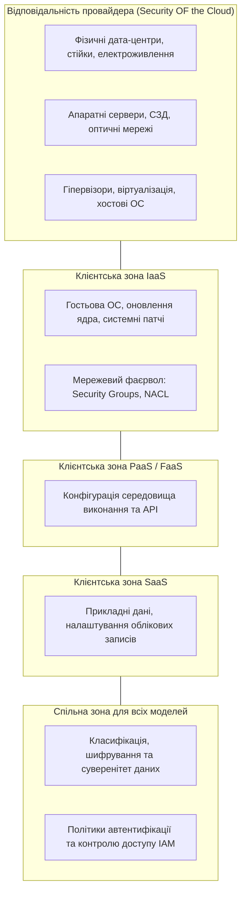
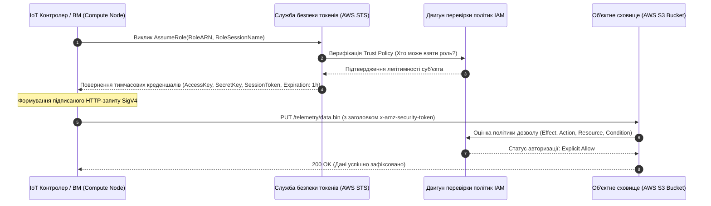
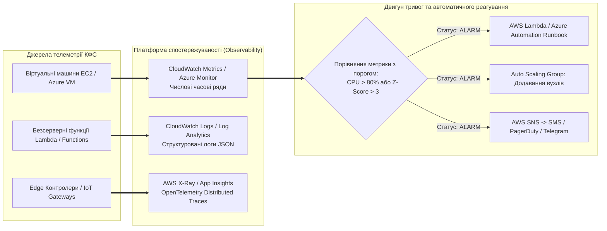
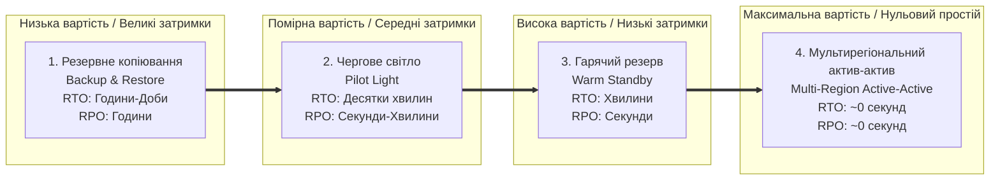
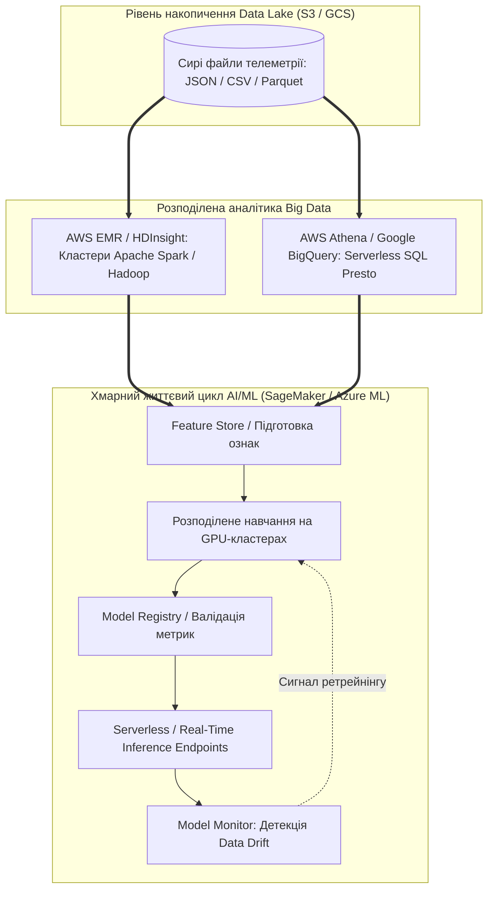

# Змістовий модуль 2. Безсерверні обчислення, Інфраструктура як код (IaC), безпека та аналітика

# Тема 7. Безпека (IAM), хмарний моніторинг, відмовостійкість та аналітика даних

---

## 7.1. Модель спільної відповідальності за безпеку (Shared Responsibility Model). Керування ідентифікацією та доступом (IAM): користувачі, групи, політики доступу (RBAC, ABAC), ролі (Roles) та тимчасові токени (STS)

### Основний зміст та теоретичний базис

Організація безпеки в хмарних середовищах базується на фундаментальній концепції розмежування повноважень, відомій як **Модель спільної відповідальності за безпеку (Shared Responsibility Model)**. Відповідно до цієї моделі, забезпечення кіберзахисту інформаційної системи є спільним процесом постачальника хмарних послуг (**Cloud Service Provider, CSP**) та споживача (**Customer**), де межа розподілу зобов'язань строго детермінується обраною сервісною моделлю (IaaS, PaaS, SaaS чи FaaS/Serverless). 

Хмарний провайдер несе виключну відповідальність за **«безпеку самої хмари» (Security OF the Cloud)**, що охоплює фізичну охорону центрів обробки даних, безперебійне електроживлення, кліматичний контроль, технічне обслуговування серверного обладнання, апаратних систем зберігання даних, комутаційних фабрик та базового шару віртуалізації (гіпервізорів). 

Натомість споживач відповідає за **«безпеку всередині хмари» (Security IN the Cloud)**, яка передбачає конфігурування правил мережевих брандмауерів, керування обліковими записами, шифрування даних у спокої (**Encryption at Rest**) та під час передачі (**Encryption in Transit**), встановлення оновлень операційних систем у моделі IaaS, а також усунення вразливостей у власному прикладному програмному коді.

*Рисунок 7.1 — Розподіл зон відповідальності за безпеку залежно від сервісної моделі хмари*

У кіберфізичних системах, де скомпрометований польовий датчик чи виконавчий контролер може стати вектором атаки на промислову інфраструктуру, захист базується на архітектурній парадигмі **нульової довіри (Zero-Trust Architecture)**. Головними постулатами Zero-Trust є принцип явної безперервної верифікації кожного запиту (**Always Verify**), припущення про потенційну скомпрометованість периметра (**Assume Breach**) та неухильне дотримання **принципу найменших привілеїв (Principle of Least Privilege, PoLP)**, згідно з яким суб'єкту надається мінімально необхідний набір прав, достатній виключно для виконання поточної задачі, і лише на визначений проміжок часу.

Основним інструментом реалізації політики Zero-Trust у хмарі є служба **Керування ідентифікацією та доступом (Identity and Access Management, IAM)**. Архітектура IAM оперує чотирма базовими конструктами:

* **Користувачі (IAM Users).** Постійні облікові записи, що представляють конкретних людей або інтерактивних адміністраторів, які взаємодіють із хмарною консоллю за допомогою пароля та обов'язкової багатофакторної автентифікації (**Multi-Factor Authentication, MFA**).
* **Групи користувачів (IAM Groups).** Логічні колекції облікових записів, що спрощують масове призначення однакових адміністративних прав (наприклад, група `DevOpsEngineers` або `SecurityAuditors`).
* **Політики доступу (IAM Policies).** Формалізовані документи у форматі JSON, які строго визначають правила авторизації через специфікацію ефекту (`Effect: Allow / Deny`), дозволених дій (`Action`), цільових ресурсів (`Resource` за їхнім ARN — Amazon Resource Name) та обов'язкових умов контексту (`Condition`, таких як обмеження за IP-адресою, обов'язковість TLS версії 1.3 чи наявність специфічних тегів).
* **Ролі (IAM Roles).** Тимчасові ідентичності, які не мають постійних паролів чи статичних API-ключів і призначаються обчислювальним ресурсам (віртуальним машинам EC2, функціям Lambda, контейнерам ECS) або зовнішнім федеративним користувачам.

Керування доступом реалізується за двома комплементарними моделями: **рольового керування (Role-Based Access Control, RBAC)**, де права прив'язуються до заздалегідь визначеної посадової ролі, та **атрибутивного керування (Attribute-Based Access Control, ABAC)**, де рішення про авторизацію приймається динамічно на основі зіставлення атрибутів (тегів) суб'єкта та цільового об'єкта (наприклад, дозволити запис у топік телеметрії лише тому контролеру, чий атрибут `Env` збігається з тегом топіка `Env=Production`).

*Рисунок 7.2 — Процедура делегування прав та генерації короткоживучих токенів безпеки через службу AWS STS*

Безпека автоматизованих процесів досягається повною відмовою від довготривалих статичних секретів завдяки використанню **Служби безпеки токенів (Security Token Service, STS)**. Інстанс віртуальної машини чи мікросервіс надсилає запит до STS за методом `AssumeRole` або автоматично отримує тимчасові облікові дані через локальний сервіс метаданих інстансу (**Instance Metadata Service, IMDSv2**). 

Служба STS генерує короткоживучий набір креденшалів: тимчасовий ключ доступу (**Access Key ID**), секретний ключ (**Secret Access Key**) та токен безпеки (**Session Token**), термін дії яких обмежений інтервалом від 15 хвилин до 12 годин. Платформа автоматично оновлює ці токени до моменту їхнього закінчення, усуваючи ризик компрометації ключів у вихідному коді застосунків.

Логіка прийняття рішення механізмом авторизації IAM описується детермінованою булевою функцією оцінки політик $\mathcal{D}(\text{req})$:

$$\mathcal{D}(\text{req}) = \left( \bigvee_{p \in \mathcal{P}_{\text{allow}}} \text{Eval}(p, \text{req}) \right) \bigwedge \neg \left( \bigvee_{q \in \mathcal{P}_{\text{deny}}} \text{Eval}(q, \text{req}) \right)$$

де $\text{req}$ — контекст вхідного запиту, що містить ідентифікатор суб'єкта (Principal), викликану дію (Action), цільовий ресурс (Resource) та змінні середовища, $\mathcal{P}_{\text{allow}}$ — множина застосовних політик, які містять інструкцію дозволу `Effect: Allow`, $\mathcal{P}_{\text{deny}}$ — множина політик з інструкцією явної заборони `Effect: Deny`, $\text{Eval}(p, \text{req})$ — предикатна функція зіставлення умов політики $p$ параметрам запиту $\text{req}$.

Відповідно до правила обробки політик IAM діє сувора аксіома: **явна заборона (Explicit Deny) має абсолютний пріоритет над будь-яким дозволом (Explicit Allow)**, а за відсутності явного дозволу діє неявна заборона за замовчуванням (**Default Deny**).

*Таблиця 7.1 — Порівняльна характеристика моделей контролю доступу в розподілених системах*

| Критерій порівняння | Рольовий контроль (RBAC) | Атрибутивний контроль (ABAC) | Списки контролю (ACL) | Федеративна ідентифікація (SAML/OIDC) |
| :--- | :--- | :--- | :--- | :--- |
| **Основа прийняття рішень** | Статично призначена роль або членство в групі | Динамічні теги та атрибути суб'єкта/об'єкта | Прямий список дозволів, прикріплений до файлу | Зовнішні твердження (Claims) від IdP |
| **Гнучкість масштабування** | Низька (вимагає створення нових ролей під комбінації) | Вкрай висока (масштабується додаванням нових тегів) | Мінімальна (ускладнює централізований аудит) | Висока (централізоване керування в масштабах корпорації) |
| **Рівень деталізації прав** | Грубий (Coarse-grained) | Тонкий, гранулярний (Fine-grained) | Базовий об'єктний рівень (Read/Write) | Визначається зіставленням тверджень у токені JWT |
| **Основна сфера застосування** | Типові адміністративні ролі користувачів | Автоматизація динамічних кіберфізичних систем | Об'єктні сховища S3/Blob, мережеві диски | Корпоративний вхід Single Sign-On (SSO) |

---

## 7.2. Моніторинг, аудит та спостережуваність (Observability): метрики, логи та трейси (AWS CloudWatch, CloudTrail, Azure Monitor, Application Insights). Налаштування автоматичних дій та тригерів тривоги (Alarms)

### Основний зміст та теоретичний базис

Підтримання стабільності та діагностика складних розподілених хмарних систем вимагає впровадження концепції **спостережуваності (Observability)**. На відміну від класичного пасивного моніторингу, спостережуваність дозволяє за зовнішніми вихідними сигналами системи робити висновки про її внутрішній стан, виявляти аномалії на ранніх стадіях та локалізувати першопричини збоїв (**Root Cause Analysis**).

Фундаментом спостережуваності є так звана **тріада даних телеметрії (The Three Pillars of Observability)**:

1. **Метрики (Metrics).** Числові часові ряди агрегованих показників, оптимізовані для швидкої оцінки працездатності інфраструктури в реальному часі (утилізація центрального процесора, споживання пам'яті, кількість IOPS, глибина черг SQS, мережевий трафік). Метрики збираються через фіксовані інтервали часу (від 1 секунди до 1 хвилини) спеціалізованими службами (**AWS CloudWatch Metrics**, **Azure Monitor Metrics**).
2. **Журнали подій (Logs).** Структуровані або неструктуровані текстові записи із часовими мітками, що фіксують дискретні системні події, виключення та повідомлення налагодження. Хмарні платформи агрегують журнали за допомогою централізованих сховищ (**AWS CloudWatch Logs**, **Azure Log Analytics Workspace**), де підтримується повнотекстовий індексований пошук та аналітичні вибірки за допомогою спеціалізованих мов запитів (CloudWatch Logs Insights, Kusto Query Language — KQL).
3. **Розподілені трасування (Traces).** Механізм відстеження наскрізного шляху проходження транзакції крізь десятки мікросервісів, черг та баз даних. Кожен вхідний запит маркується унікальним ідентифікатором кореляції (**Trace ID**), який передається в HTTP-заголовках між сервісами, дозволяючи візуалізувати граф залежностей та розрахувати латентність кожного окремого компонента за допомогою інструментів **AWS X-Ray** та **Azure Application Insights** на базі відкритого стандарту **OpenTelemetry**.

Окремим критично важливим класом журналювання є **аудит дій в інфраструктурі**, який реалізується сервісами **AWS CloudTrail** та **Azure Activity Log**. Ці служби фіксують кожен виклик API хмари (хто здійснив запит, з якої IP-адреси, через які облікові дані IAM, до якого ресурсу та з яким статусом), забезпечуючи юридичну невідмовність дій та відповідність міжнародним стандартам безпеки (ISO/IEC 27001, SOC 2, PCI DSS).

*Рисунок 7.3 — Архітектура замкненого контуру спостережуваності та автоматизованого відновлення системи*

Ключовим механізмом реакції на збої є **тригери тривоги (Alarms)**. Системи моніторингу підтримують два типи алертів:
* **Статичні порогові алерти (Static Threshold Alarms).** Спрацьовують при виході значення метрики за фіксовану абсолютну межу протягом $M$ послідовних інтервалів вимірювання (наприклад, середня утилізація CPU перевищує 80% упродовж трьох 5-хвилинних періодів).
* **Алерти виявлення аномалій (Anomaly Detection Alarms).** Базуються на алгоритмах машинного навчання, які динамічно будують коридор очікуваних значень метрики з урахуванням добової та тижневої сезонності, фіксуючи вихід за межі стандартного відхилення.

Ступінь статистичного відхилення метрики від базового рівня формалізується за допомогою Z-оцінки (**Z-score**):

$$Z(t) = \frac{x(t) - \mu_{\text{baseline}}(t)}{\sigma_{\text{baseline}}(t)}$$

де $x(t)$ — поточне виміряне значення метрики в момент часу $t$, $\mu_{\text{baseline}}(t)$ — розраховане математичне сподівання нормального стану системи для відповідної години та дня тижня, $\sigma_{\text{baseline}}(t)$ — середньоквадратичне відхилення базової лінії. Спрацювання тригера аномалії відбувається за умови $|Z(t)| > \gamma_{\text{threshold}}$ (де зазвичай поріг чутливості встановлюється в діапазоні $2 \le \gamma \le 3$).

Сукупний коефіцієнт готовності системи $A_{\text{total}}$ із урахуванням оперативності системи моніторингу математично пов'язаний із середнім часом між відмовами (**MTBF — Mean Time Between Failures**), середнім часом виявлення аномалії (**MTTD — Mean Time to Detect**) та середнім часом відновлення працездатності (**MTTR — Mean Time to Repair**):

$$A_{\text{total}} = \frac{\text{MTBF}}{\text{MTBF} + \text{MTTD} + \text{MTTR}}$$

Впровадження автоматичних дій відновлення (**Auto-remediation**, наприклад, автоматичний перезапуск завислої віртуальної машини через CloudWatch Alarm Actions або активація правил Auto Scaling) дозволяє зменшити значення MTTR з годин до десятків секунд, підтримуючи доступність на рівні чотирьох і п'яти дев'яток ($99{,}99\% \dots 99{,}999\%$).

*Таблиця 7.2 — Порівняльна матриця інструментів моніторингу та аудиту в AWS та Azure*

| Категорія спостережуваності | Amazon Web Services | Microsoft Azure |
| :--- | :--- | :--- |
| **Збирання та візуалізація метрик** | Amazon CloudWatch Metrics / Dashboards | Azure Monitor Metrics / Workbooks |
| **Централізоване логування** | CloudWatch Logs Insights | Azure Log Analytics (Kusto / KQL) |
| **Аудит викликів API та безпеки** | AWS CloudTrail | Azure Activity Log / Microsoft Sentinel |
| **Розподілене трасування мікросервісів** | AWS X-Ray (з підтримкою OpenTelemetry) | Azure Application Insights |
| **Виявлення аномалій та прогнозування** | CloudWatch Anomaly Detection | Azure Monitor Smart Detection |

---

## 7.3. Висока доступність та аварійне відновлення (Disaster Recovery): поняття RTO (Recovery Time Objective) та RPO (Recovery Point Objective). Стратегії DR (Backup & Restore, Pilot Light, Warm Standby, Multi-region Active-Active). Azure Site Recovery

### Основний зміст та теоретичний базис

Безперервність функціонування критично важливих кіберфізичних систем і виробничих процесів регламентується корпоративною стратегією **забезпечення безперервності бізнесу та аварійного відновлення (Business Continuity and Disaster Recovery, BCDR)**. Головна мета BCDR полягає у мінімізації впливу масштабних катастроф (техногенних аварій, знеструмлення регіонів, руйнівних стихійних лих або цілеспрямованих кібератак) на доступність сервісів та збереження даних.

Основними метриками планування аварійного відновлення є два взаємопов'язані часові критерії:

* **Цільова точка відновлення (Recovery Point Objective, RPO).** Максимально допустимий обсяг втрати даних, виміряний у часі, який організація здатна толерувати в разі катастрофи. RPO визначає необхідну періодичність створення резервних копій або максимальну допустиму затримку асинхронної реплікації даних між регіонами (різниця між часом останньої успішної фіксації транзакції на резервному майданчику та моментом аварії).
* **Цільовий час відновлення (Recovery Time Objective, RTO).** Максимально допустима тривалість простою сервісу, необхідна для повного розгортання, ініціалізації інфраструктури, перемикання мережевих маршрутів та повернення системи до штатного робочого стану після оголошення аварійної ситуації.

*Рисунок 7.4 — Спектр стратегій аварійного відновлення: зіставлення вартості впровадження та показників RTO/RPO*

У хмарній інженерії виділяють чотири класичні стратегії **аварійного відновлення (Disaster Recovery, DR)**, що утворюють баланс між фінансовими витратами та показниками RTO/RPO:

1. **Резервне копіювання та відновлення (Backup and Restore).** Найбільш економічна стратегія з найвищими значеннями RTO та RPO. Дані, знімки дисків (Snapshots) та конфігураційні файли періодично вивантажуються у гео-репліковане об'єктне сховище (AWS S3 GRS / Azure Blob). У разі повної відмови основного регіону за допомогою скриптів автоматизації (IaC) створюється нова інфраструктура з нуля, на яку відновлюються дані з бекапів. Процес займає від кількох годин до діб.
2. **Світло чергового пальника (Pilot Light).** У вторинному регіоні підтримується постійно активне ядро системи — сервери баз даних, на які здійснюється безперервна асинхронна реплікація даних з основного регіону (забезпечуючи мінімальний RPO в кілька секунд). Обчислювальні вузли застосунків перебувають у вимкненому стані у вигляді збережених золотих образів (AMIs/VHD) або шаблонів авто-масштабування. При катастрофі оркестратор ініціалізує запуск віртуальних машин і підключає їх до готової реплікованої бази даних, забезпечуючи RTO в межах 10–30 хвилин.
3. **Гарячий резерв (Warm Standby).** У вторинному регіоні постійно функціонує зменшена, масштабована копія повної виробничої системи (наприклад, 20% від потужності основного кластера). При аварії глобальний балансувальник трафіку перенаправляє потоки запитів на резервний майданчик, а група Auto Scaling розширює кількість інстансів до 100% номінальної потужності, скорочуючи RTO до лічених хвилин.
4. **Багаторегіональний активний розподіл (Multi-Region Active-Active).** Повноцінна виробнича інфраструктура розгорнута одночасно у двох або більше географічних регіонах. Клієнтський трафік балансується між регіонами за допомогою систем глобальної маршрутизації DNS (**AWS Route 53** із політиками маршрутизації за латентністю чи геолокацією, **Azure Front Door**). Дані синхронізуються між регіонами за допомогою багаторегіональних розподілених баз даних (Amazon Aurora Global Database, Azure Cosmos DB Multi-Region Write). У разі відмови цілого регіону трафік миттєво перерозподіляється на вцілілі регіони з RTO $\approx 0$ та RPO $\approx 0$.

Для автоматизації міграції та захисту гібридних середовищ корпорація Microsoft розробила спеціалізований сервіс **Azure Site Recovery (ASR)**. ASR здійснює оркестрацію реплікації локальних фізичних серверів, віртуальних машин VMware vSphere та Hyper-V у хмару Azure. 

Архітектура ASR включає сервер конфігурації та сервер обробки (**Process Server**), який виконує перехоплення змін дисків у реальному часі, їхнє стиснення, шифрування та передачу до кеш-сховища Azure Storage. У разі аварії ASR автоматично виконує сценарій аварійного перемикання (**Failover**), створюючи віртуальні машини Azure IaaS із реплікованих дисків, а після ліквідації наслідків аварії на локальному майданчику забезпечує зворотну синхронізацію та повернення (**Failback**).

Сукупна оптимізаційна функція витрат на забезпечення відмовостійкості $C_{\text{BCDR\_total}}$ залежно від цільових параметрів RTO та RPO формалізується як:

$$C_{\text{BCDR\_total}}(RTO, RPO) = C_{\text{infra\_cost}}(RTO, RPO) + \mathbb{E}[N_{\text{disaster}}] \cdot \left( RTO \cdot L_{\text{downtime\_rate}} + RPO \cdot L_{\text{data\_loss\_rate}} \right)$$

де $C_{\text{infra\_cost}}(RTO, RPO)$ — щорічні витрати на підтримку надлишкової хмарної інфраструктури, резервних каналів зв'язку та реплікації сховищ (функція, монотонно зростаюча при $RTO \to 0$ та $RPO \to 0$), $\mathbb{E}[N_{\text{disaster}}]$ — математичне сподівання кількості катастрофічних збоїв за рік, $L_{\text{downtime\_rate}}$ — фінансові збитки підприємства за одиницю часу простою сервісу (у доларах за годину), $L_{\text{data\_loss\_rate}}$ — вартість безповоротно втрачених транзакційних даних за одиницю часу недоотриманої інформації.

*Таблиця 7.3 — Систематизація характеристик стратегій Disaster Recovery*

| Стратегія DR | Цільовий RPO | Цільовий RTO | Відносні витрати на інфраструктуру | Складність експлуатації |
| :--- | :--- | :--- | :--- | :--- |
| **Backup & Restore** | Години (до 24 год) | Доби (12–48 год) | Мінімальні ($\approx 1\times$) | Низька (базові бекапи) |
| **Pilot Light** | Секунди / Хвилини | Десятки хвилин (10–30 хв) | Низькі/Помірні ($\approx 1{,}2\times$) | Середня (скрипти підняття ВМ) |
| **Warm Standby** | Секунди | Одиниці хвилин (1–5 хв) | Помірні/Високі ($\approx 1{,}6\times$) | Висока (синхронізація версій) |
| **Active-Active Multi-Region** | Субсекундний ($\approx 0$) | Субсекундний ($\approx 0$) | Максимальні ($\ge 2{,}2\times$) | Вкрай висока (розподілені конфлікти) |

---

## 7.4. Вступ до хмарної аналітики та AI/ML: огляд сервісів обробки великих даних (AWS EMR, Athena, BigQuery) та інструментів розгортання моделей машинного навчання (AWS SageMaker, Azure Machine Learning)

### Основний зміст та теоретичний базис

Експоненційне зростання обсягів сенсорних даних, які генеруються кіберфізичними комплексами, зумовило необхідність інтеграції інструментів **аналітики великих даних (Big Data Analytics)** та технологій **штучного інтелекту і машинного навчання (AI/ML)** безпосередньо в хмарні платформи. Хмарна аналітика усуває потребу в будівництві дорогих локальних суперкомп'ютерних кластерів, надаючи еластичні розподілені обчислювальні потужності за моделлю PaaS та Serverless.

*Рисунок 7.5 — Наскрізний конвеєр збирання, обробки великих даних та життєвого циклу MLOps у хмарі*

У сфері обробки великих даних провідні хмарні платформи реалізують три ключові архітектурні підходи:

1. **Керовані кластери розподілених обчислень (AWS Elastic MapReduce — EMR, Azure HDInsight).** Сервіси надають повністю налаштовані, динамічно масштабовані кластери на базі фреймворків із відкритим кодом: **Apache Spark** (високошвидкісна обробка в оперативній пам'яті за допомогою абстракцій RDD та DataFrames), **Apache Hadoop MapReduce** та **Apache Flink** (низьколатентна обробка неперервних потоків телеметрії). Обчислювальні вузли кластера відокремлені від сховища даних і використовують об'єктні сховища S3/Blob через оптимізовані файлові конектори (EFS/S3A), що дозволяє динамічно змінювати кількість робочих вузлів (Task Nodes) під час виконання обчислень.
2. **Безсерверні аналітичні інтерактивні SQL-рушії (AWS Athena).** Інструмент виконання інтерактивних аналітичних запитів до даних, що зберігаються безпосередньо в об'єктному сховищі AWS S3, без необхідності попереднього завантаження даних у СУБД. Рушій Athena побудований на базі розподіленого рушія **Trino (Presto)** та каталогу метаданих **AWS Glue Data Catalog**. Тарифікація здійснюється виключно за обсяг просканованих даних під час виконання запиту ($5 за кожен терабайт). Використання стовпчикових бінарних форматів зберігання даних (**Apache Parquet**, **Apache ORC**) та компресії (Snappy, ZSTD) дозволяє скоротити обсяг зчитування та вартість виконання запиту на 80–90% у порівнянні з текстовими форматами JSON/CSV.
3. **Корпоративні хмарні сховища даних (Google BigQuery).** Повністю безсерверне масштабоване сховище даних (Data Warehouse), що базується на архітектурі розділення обчислювальних ресурсів (**Dremel Engine**) та стовпчикового сховища (**Capacitor**), об'єднаних надшвидкісною внутрішньою мережею Jupiter. BigQuery здатний паралельно сканувати петабайти інформації за секунди та містить вбудовані алгоритми машинного навчання (**BigQuery ML**), що дозволяють тренувати моделі класифікації та регресії безпосередньо за допомогою стандартних SQL-інструкцій.

Для організації повного життєвого циклу штучного інтелекту (**MLOps — Machine Learning Operations**) застосовуються спеціалізовані хмарні платформи: **Amazon SageMaker** та **Azure Machine Learning**. 

Ці комплекси охоплюють усі етапи розробки та промислової експлуатації моделей:
* **Підготовка даних та реєстр ознак (Feature Store).** Централізоване версіонування та збереження інженерних ознак для навчання моделей та інференсу в реальному часі.
* **Розподілене тренування (Distributed Training).** Автоматизоване розгортання тимчасових кластерів із потужними графічними прискорювачами (NVIDIA A100/H100, AWS Trainium) із підтримкою паралелізму даних (**Data Parallelism**) та паралелізму моделей (**Model Parallelism**).
* **Розгортання та хостинг моделей (Inference Endpoints).** Надання високодоступних кінцевих точок із підтримкою автоматичного масштабування кількості інстансів залежно від черги запитів та інтеграцією канареечних розгортань (**Canary Deployments / A/B Testing**).
* **Моніторинг зсуву даних (Data Drift & Concept Drift Monitoring).** Безперервний аналіз вхідних потоків телеметрії на предмет статистичної розбіжності з навчальною вибіркою.

Ступінь зсуву розподілу даних (Data Drift) для конкретного сенсорного параметра часто оцінюється за допомогою **індексу стабільності популяції (Population Stability Index, PSI)**:

$$PSI = \sum_{b=1}^{B} \left( P_{\text{actual}}(b) - P_{\text{expected}}(b) \right) \cdot \ln \left( \frac{P_{\text{actual}}(b)}{P_{\text{expected}}(b)} \right)$$

де $B$ — кількість інтервалів квантування (бінів) значень параметра телеметрії, $P_{\text{actual}}(b)$ — частка спостережень у біні $b$ для поточного продакшн-потоку даних, $P_{\text{expected}}(b)$ — частка спостережень у біні $b$ для вихідної навчальної вибірки. Якщо $PSI < 0{,}1$, зміна розподілу вважається незначною; значення $0{,}1 \le PSI \le 0{,}25$ свідчить про помірний зсув, а $PSI > 0{,}25$ сигналізує про критичну деградацію точності моделі, автоматично активуючи конвеєр повторного перенавчання (**Automated Retraining Pipeline**).

*Таблиця 7.4 — Порівняльна характеристика хмарних аналітичних сервісів та платформ машинного навчання*

| Сервіс / Платформа | Архітектурний тип | Цільовий клас задач | Механізм масштабування | Формат оплати |
| :--- | :--- | :--- | :--- | :--- |
| **AWS EMR** | Керований кластер (Hadoop/Spark) | Важка пакетна обробка Big Data, ETL, Flink | Автомасштабування вузлів EC2 / EMR Serverless | Посекундна оплата за інстанси + плата EMR |
| **AWS Athena** | Безсерверний інтерактивний SQL | Ad-hoc запити над Data Lake (S3 Parquet) | Повністю абстраговане сервером Trino | Плата за обсяг просканованих даних ($5/ТБ) |
| **Google BigQuery** | Безсерверний аналітичний Data Warehouse | Корпоративні сховища даних, BI, BigQuery ML | Автоматичний розподіл обчислювальних слотів | За обсяг запитів або зарезервовані слоти |
| **AWS SageMaker** | Повнофункціональна MLOps платформа | Повний життєвий цикл ML (Data -> Train -> Deploy) | Еластичні кластери навчання та ендпоінти | Оплата за час роботи інстансів навчання/інференсу |
| **Azure Machine Learning** | Корпоративна платформа AI/ML | Створення та моніторинг ML-моделей, AutoML | Керовані обчислювальні кластери Azure Compute | Оплата за використані обчислювальні ресурси |

---

### Питання для самоперевірки та аналітичного осмислення

1. Розкрийте зміст Моделі спільної відповідальності за безпеку (Shared Responsibility Model). Які компоненти системи перехідні за своєю відповідальністю від споживача до провайдера при міграції кіберфізичного комплексу з віртуальних машин IaaS на безсерверні функції FaaS?
2. Поясніть принципи побудови архітектури нульової довіри (Zero-Trust) та реалізацію принципу найменших привілеїв (PoLP) в інфраструктурі IAM. Як структура IAM Policy (Effect, Action, Resource, Condition) запобігає несанкціонованому доступу скомпрометованого IoT-контролера?
3. Опишіть механізм функціонування служби AWS STS та процедуру делегування прав через IAM Roles. Чому використання тимчасових креденшалів з динамічною ротацією є надійнішим за генерацію статичних ключів доступу?
4. Проаналізуйте складові тріади спостережуваності (Observability): метрики, логи та розподілені трейси. Як налаштування кореляційних ідентифікаторів (Trace ID) в інструментах AWS X-Ray дозволяє локалізувати вузькі місця у мікросервісній мережі?
5. Зіставте метрики аварійного відновлення RTO та RPO. Які архітектурні зміни необхідно внести до системи, щоб перевести її зі стратегії «Pilot Light» у стан «Multi-Region Active-Active», і як це вплине на сукупну вартість володіння інфраструктурою?
6. Розкрийте механізм реплікації та аварійного перемикання (Failover) у сервісі Azure Site Recovery (ASR). Яку роль відіграє Process Server під час синхронізації дискових масивів між локальним дата-центром та хмарою?
7. Поясніть переваги використання безсерверних аналітичних SQL-рушіїв (AWS Athena, Google BigQuery) над традиційними реляційними СУБД при обробці петабайтних архівів телеметрії. Як використання стовпчикового формату Apache Parquet оптимізує фінансові витрати на виконання аналітичних запитів?