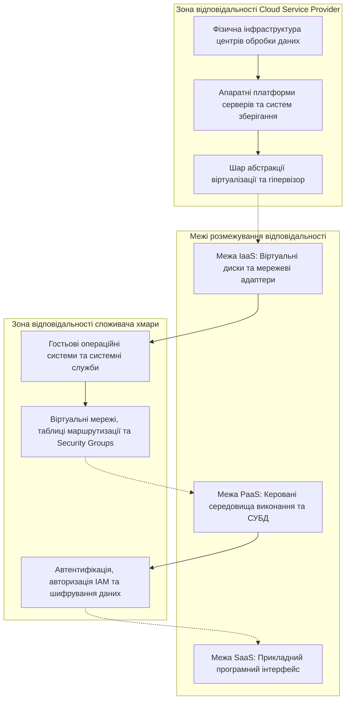
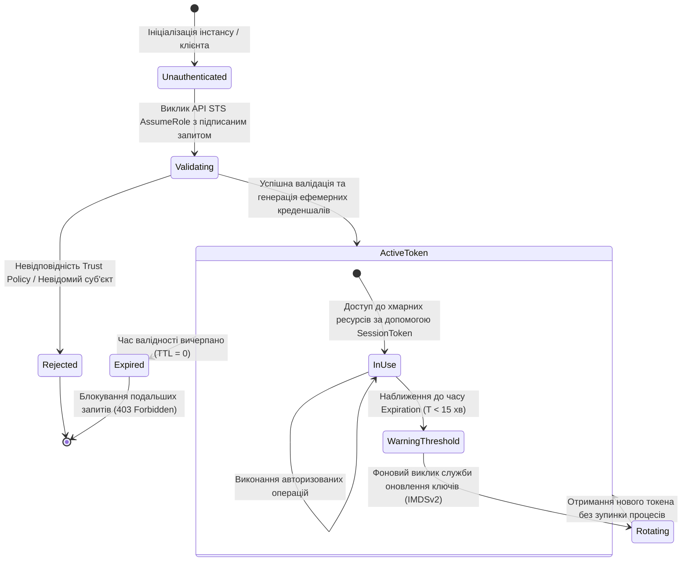
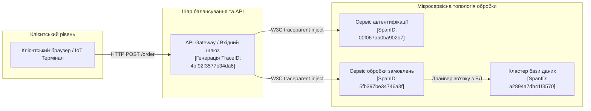
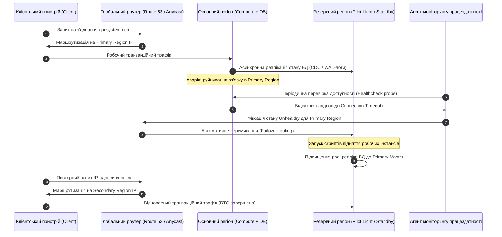

# Тема 7. Безпека, хмарний моніторинг, відмовостійкість та аналітика даних

## Мета лекції

Формування у майбутніх інженерів комп'ютерних систем цілісного комплексу фундаментальних знань та інженерних компетентностей, необхідних для проєктування, розгортання та експлуатації захищених, високонадійних та еластичних розподілених хмарних систем. Вивчення дисципліни орієнтоване на глибоке освоєння математичних, алгоритмічних та архітектурних засад контролю доступу на базі парадигми нульової довіри (Zero-Trust), створення замкнених контурів спостережуваності (Observability) для детекції аномалій в інфраструктурі, мінімізацію ризиків простою за допомогою стратегій аварійного відновлення (Disaster Recovery) з урахуванням граничних умов теореми CAP, а також побудову оптимізованих за вартістю конвеєрів аналітики великих даних і моніторингу стабільності моделей машинного навчання в промислових середовищах.

## Очікувані результати навчання

1. **Знання та розуміння.** Студенти повинні продемонструвати поглиблене розуміння математичного апарату оцінки політик безпеки IAM, моделей розподілу відповідальності (Shared Responsibility Model), інфраструктурних засад спостережуваності розподілених систем, а також теоретичних критеріїв оптимізації часових параметрів $RTO$ та $RPO$ при проєктуванні катастрофостійких середовищ.
2. **Застосування.** Студенти повинні навчитися синтезувати декларативні правила доступу за моделями RBAC та ABAC, розгортати контури розподіленої телеметрії з кореляційним трасуванням запитів, конфігурувати сценарії автоматизованого відновлення ресурсів (Auto-remediation) та налаштовувати крос-регіональну синхронізацію даних для мінімізації часу відновлення сервісів.
3. **Аналіз.** Студенти повинні критично аналізувати вузькі місця в мережевих та обчислювальних топологіях хмарних рішень за допомогою системних журналів аудиту, детермінувати причини апаратних та програмних збоїв за метриками Z-score, а також розраховувати компромісні співвідношення між фінансовою вартістю надлишкових географічних кластерів і гарантованим рівнем доступності сервісів ($SLA$).
4. **Оцінювання та синтез.** Студенти повинні набути здатності самостійно проєктувати відмовостійкі архітектурні комплекси на базі багаторегіональних конфігурацій, обґрунтовувати вибір між різними стратегіями аварійного відновлення з урахуванням затримок мережевої реплікації даних, а також розробляти високоефективні безсерверні конвеєри для аналітичної обробки неструктурованих масивів інформації з детекцією дрейфу ознак (Data Drift) у системах штучного інтелекту.

---

## Детальний покроковий план лекції

### 1. Теоретико-концептуальний базис. Модель нульової довіри, формалізований контроль доступу та архітектура розподіленої спостережуваності
* 1.1. Математична формалізація моделі спільної відповідальності за безпеку (Shared Responsibility Model) та постулати архітектури нульової довіри (Zero-Trust Architecture) в хмарних середовищах.
* 1.2. Булева алгебра оцінки політик IAM, гранулярне розмежування повноважень за моделями RBAC та ABAC і криптографічний механізм генерації короткоживучих токенів безпеки через службу STS.
* 1.3. Тріада розподіленої спостережуваності (Observability): чисельні часові ряди метрик, централізовані структуровані журнали подій та граф наскрізного розподіленого трасування транзакцій на базі стандарту OpenTelemetry.
* 1.4. Статистичні алгоритми виявлення інфраструктурних аномалій у режимі реального часу з використанням динамічних коридорів сезонності та аналізу Z-оцінки.

### 2. Методологія та аналіз граничних умов. Інженерія високої доступності, стратегії Disaster Recovery та розподілена аналітика даних
* 2.1. Формалізовані критерії надійності: аналітична оптимізація цільової функції витрат BCDR у залежності від метрик RTO, RPO, MTBF та MTTR.
* 2.2. Архітектурні патерни аварійного відновлення (Backup and Restore, Pilot Light, Warm Standby, Multi-Region Active-Active) та механізми асинхронної і синхронної реплікації сховищ даних.
* 2.3. Алгоритмічні засади безсерверних аналітичних рушіїв над Data Lake (AWS Athena, Google BigQuery) та оптимізація фінансових витрат через використання бінарних стовпчикових форматів зберігання даних.
* 2.4. Методологія MLOps: детекція концептуального зсуву даних (Data Drift) у промислових моделях машинного навчання за індексом стабільності популяції (PSI) та контури автоматичного перенавчання.
* 2.5. Критичні бар'єри та граничні обмеження: мережева латентність передачі даних між віддаленими дата-центрами, теорема CAP і дилема узгодженості станів розподілених баз даних при розривах каналів зв'язку.

### 3. Практичний індустріальний / фаховий кейс. Проєктування відмовостійкої архітектури критичної інформаційної системи
**Тема наскрізної задачі.** «Проєктування відмовостійкої інфраструктури системи обробки телеметрії IoT-мережі розумного енергокомплексу з багаторівневим IAM-захистом, моніторингом відхилень та крос-регіональним Disaster Recovery»

## 1. Теоретико-концептуальний базис. Модель нульової довіри, формалізований контроль доступу та архітектура розподіленої спостережуваності

### 1.1. Математична формалізація моделі спільної відповідальності за безпеку (Shared Responsibility Model) та постулати архітектури нульової довіри (Zero-Trust Architecture) в хмарних середовищах

Архітектурна парадигма хмарних обчислень докорінно змінює традиційну модель інформаційної безпеки, що базувалася на захисті фізичного локального периметра організації. У розподіленому комп'ютерному середовищі відповідальність за захист апаратних ресурсів, системного оточення та користувацьких даних чітко розмежовується між постачальником хмарних послуг (**Cloud Service Provider, CSP**) і споживачем (**Customer**) у межах концепції, відомої як **Модель спільної відповідальності за безпеку (Shared Responsibility Model)**. 

Для строгого інженерного аналізу зазначений розподіл можна формалізувати за допомогою теорії множин. Нехай уся множина компонентів обчислювальної системи позначається як $\mathcal{L}$, де кожен шар ієрархічно відповідає за певний рівень абстракції:

$$\mathcal{L} = \{ l_{\text{phys}}, l_{\text{hw}}, l_{\text{hyp}}, l_{\text{net}}, l_{\text{os}}, l_{\text{runtime}}, l_{\text{app}}, l_{\text{data}} \}$$

У цій моделі елемент $l_{\text{phys}}$ позначає фізичний захист периметра серверних приміщень і систем життєзабезпечення центрів обробки даних, $l_{\text{hw}}$ — надійність апаратного серверного та комутаційного обладнання, $l_{\text{hyp}}$ — шар гіпервізора та ізоляцію віртуальних машин, $l_{\text{net}}$ — контроль віртуалізованих мережевих потоків і маршрутизації, $l_{\text{os}}$ — керування гостьовими операційними системами та встановлення виправлень безпеки ядра, $l_{\text{runtime}}$ — конфігурацію контейнерного або інтерпретованого середовища виконання, $l_{\text{app}}$ — прикладний вихідний код і логіку сервісів, а $l_{\text{data}}$ — класифікацію, керування життєвим циклом та криптографічний захист інформаційних активів.

Загальний простір відповідальності за безпеку системи $\mathcal{S}$ є об'єднанням зон контролю постачальника $\mathcal{S}_{\text{CSP}}$ та споживача $\mathcal{S}_{\text{Cust}}$, причому перетин зон у більшості випадків мінімізується для уникнення регуляторної невизначеності:

$$\mathcal{S} = \mathcal{S}_{\text{CSP}} \cup \mathcal{S}_{\text{Cust}}, \quad \mathcal{S}_{\text{CSP}} \cap \mathcal{S}_{\text{Cust}} = \emptyset$$

Межа поділу сфер відповідальності прямо детермінується обраною сервісною моделлю функціонування хмарної інфраструктури:

$$\mathcal{S}_{\text{CSP}}(\text{IaaS}) = \{ l_{\text{phys}}, l_{\text{hw}}, l_{\text{hyp}} \}, \quad \mathcal{S}_{\text{Cust}}(\text{IaaS}) = \{ l_{\text{net}}, l_{\text{os}}, l_{\text{runtime}}, l_{\text{app}}, l_{\text{data}} \}$$

$$\mathcal{S}_{\text{CSP}}(\text{PaaS}) = \{ l_{\text{phys}}, l_{\text{hw}}, l_{\text{hyp}}, l_{\text{net}}, l_{\text{os}}, l_{\text{runtime}} \}, \quad \mathcal{S}_{\text{Cust}}(\text{PaaS}) = \{ l_{\text{app}}, l_{\text{data}} \}$$

$$\mathcal{S}_{\text{CSP}}(\text{SaaS}) = \{ l_{\text{phys}}, l_{\text{hw}}, l_{\text{hyp}}, l_{\text{net}}, l_{\text{os}}, l_{\text{runtime}}, l_{\text{app}} \}, \quad \mathcal{S}_{\text{Cust}}(\text{SaaS}) = \{ l_{\text{data}} \}$$

Таким чином, у моделі інфраструктури як сервісу клієнт зберігає повний адміністративний контроль над віртуалізованою операційною системою та мережею, водночас беручи на себе ризики щодо їхньої вразливості, тоді як у безсерверних обчисленнях та платформених сервісах операційна безпека делегується провайдеру, залишаючи користувачу контроль виключно над конфігурацією доступу й цілісністю даних.

У критично важливих комп'ютерних системах розмиття класичного периметра вимагає переходу до архітектурної парадигми **нульової довіри (Zero-Trust Architecture, ZTA)**. Її основоположні принципи сформульовано у стандарті NIST SP 800-207. 

Головна концептуальна зміна полягає у відмові від неявної довіри до будь-якого компонента системи незалежно від його фізичного чи логічного розташування (навіть якщо запит походить із внутрішньої ізольованої підмережі). Будь-яка взаємодія розглядається крізь призму потенційної скомпрометованості середовища передачі даних. 

Архітектура нульової довіри базується на трьох взаємопов'язаних постулатах:
1. Кожен суб'єкт, транзакція та інформаційний потік повинні проходити безперервну динамічну автентифікацію та авторизацію перед наданням доступу до цільового ресурсу.
2. Реалізація принципу найменших привілеїв здійснюється шляхом надання доступу строго в обсязі, необхідному для виконання конкретної атомарної задачі, із обмеженням тривалості сесії.
3. Проєктування топології та програмних інтерфейсів виконується з обов'язковим припущенням, що противник уже присутній усередині інфраструктури, що вимагає тотального шифрування трафіку й мікросегментації мережі.

Динамічне рішення про авторизацію у концепції нульової довіри приймається системним двигуном політик (**Policy Engine**) на основі обчислення функції довіри $\mathcal{T}$. Вона зіставляє параметри суб'єкта $s$, характеристики запитуваної дії $a$, властивості об'єкта $r$ та вектор контексту середовища $\mathbf{c} = [c_{\text{ip}}, c_{\text{time}}, c_{\text{device}}, c_{\text{geo}}]$ із граничним порогом допустимого ризику $\theta_{\text{risk}}$:

$$\mathcal{T}(s, a, r, \mathbf{c}) = \sum_{i=1}^{k} w_i \cdot \phi_i(s, a, r, \mathbf{c})$$

де $\phi_i$ представляють оціночні функції безпеки (наприклад, оцінка відповідності пристрою політикам оновлення, рівень підозрілості IP-адреси, відповідність геолокаційного профілю), а $w_i$ — відповідні вагові коефіцієнти. Доступ надається виключно за умови перевищення розрахованого значення довіри над динамічним порогом ризику: $\mathcal{T}(s, a, r, \mathbf{c}) \ge \theta_{\text{risk}}$.

> **ПРАКТИЧНИЙ ЯКІР:** У 2019 році злам американського фінансового гіганта Capital One стався через підміну запитів на стороні сервера (**Server-Side Request Forgery, SSRF**) у брандмауері веб-застосунків WAF. Оскільки сервіс працював із надлишково привілейованою IAM-роллю, зловмисник через внутрішній сервіс метаданих EC2 отримав тимчасові токени безпеки та вивантажив понад 100 мільйонів персональних записів клієнтів із сотень кошиків Amazon S3.

---

### 1.2. Булева алгебра оцінки політик IAM, гранулярне розмежування повноважень за моделями RBAC та ABAC і криптографічний механізм генерації короткоживучих токенів безпеки через службу STS

Центральним ядром реалізації парадигми нульової довіри в сучасних публічних і корпоративних хмарах виступає служба **Керування ідентифікацією та доступом (Identity and Access Management, IAM)**. Архітектурно IAM є розподіленим високонадійним комплексом, що поєднує каталог облікових записів (**Identity Provider**), механізми перевірки автентичності та інтерпретатор декларативних правил безпеки (**Policy Enforcement Point**).

Розподіл повноважень спирається на дві головні моделі контролю доступу. Першою є **керування доступом на основі ролей (Role-Based Access Control, RBAC)**, за якого права прив'язуються до абстрактних ролей (наприклад, системний адміністратор, мережевий інженер, аудитор безпеки), а користувачі асоціюються з відповідними ролями. Головним обмеженням RBAC в умовах динамічних хмарних систем є неможливість врахування контекстних параметрів запиту без створення надлишкової кількості статичних комбінацій ролей. 

Для подолання цього бар'єра застосовується **керування доступом на основі атрибутів (Attribute-Based Access Control, ABAC)**. У моделі ABAC авторизаційні рішення базуються на наборах атрибутів (або метаданих у вигляді ключ-значення, зазвичай реалізованих як хмарні теги): атрибутах суб'єкта (підрозділ, посада, пройдений тип автентифікації), об'єкта (середовище розгортання, рівень конфіденційності даних, власник проекту) та параметрах середовища (діапазон IP-адрес, поточний час, протокол шифрування).

Декларативні політики безпеки IAM описуються машиночитаними документами (найчастіше у форматі JSON) і складаються з набору інструкцій. Кожна інструкція містить декларацію ефекту (**Effect**: `Allow` або `Deny`), перелік дій (**Action**), перелік цільових ресурсів (**Resource**, що ідентифікуються глобальними уніфікованими іменами на кшталт ARN або Resource ID) та логічний блок контекстних умов (**Condition**).

Логіка обчислення підсумкового рішення авторизаційного запиту $\mathcal{D}(\text{req})$ формалізується в рамках булевої алгебри як суперпозиція правил явного дозволу та явної заборони:

$$\mathcal{D}(\text{req}) = \left( \bigvee_{p \in \mathcal{P}_{\text{allow}}} \text{Eval}(p, \text{req}) \right) \bigwedge \neg \left( \bigvee_{q \in \mathcal{P}_{\text{deny}}} \text{Eval}(q, \text{req}) \right)$$

де $\text{req}$ позначає кортеж вхідного запиту $\langle \text{Principal}, \text{Action}, \text{Resource}, \text{Context} \rangle$, $\mathcal{P}_{\text{allow}}$ — множина всіх застосовних до запиту політик з інструкцією `Effect: Allow`, а $\mathcal{P}_{\text{deny}}$ — множина політик, що містять інструкцію `Effect: Deny`. Функція $\text{Eval}(p, \text{req})$ є предикатом, який набуває значення $\text{true}$ тоді і тільки тоді, коли всі критерії політики $p$ за діями, ресурсами та контекстними обмеженнями істинно зіставляються з параметрами запиту $\text{req}$.

З математичного виразу випливають три фундаментальні правила інтерпретації правил IAM:
1. За замовчуванням будь-який запит відхиляється на основі принципу неявної заборони (**Default Deny**), якщо відсутня хоча б одна політика, що генерує результат $\text{true}$ для підмножини явного дозволу.
2. Для успішного виконання операції необхідна наявність хоча б однієї політики, що явно дозволяє дію над вказаним ресурсом.
3. Якщо хоча б одна політика з множини $\mathcal{P}_{\text{deny}}$ оцінюється як $\text{true}$, вона інвертується логічним запереченням і безапеляційно блокує виконання запиту, демонструючи безумовний пріоритет явної заборони (**Explicit Deny**) над будь-якими дозволами.

Для захисту програмних агентів, мікросервісів та апаратних контролерів від компрометації статичних облікових даних у сучасних хмарах застосовується відмова від довготривалих секретних ключів на користь короткоживучих токенів. Цей процес реалізується за допомогою **Служби безпеки токенів (Security Token Service, STS)**.

При використанні тимчасових облікових даних обчислювальний ресурс (наприклад, віртуальна машина або контейнер) звертається до служби метаданих інстансу (**Instance Metadata Service версії 2, IMDSv2**) або безпосередньо викликає API-метод `AssumeRole` служби STS. Служба перевіряє політику довіри (**Trust Policy**) ролі, визначаючи, чи має право даний ресурс набувати цієї ролі. 

У разі успішної перевірки генерується тимчасовий кортеж, що містить ідентифікатор ключа доступу (**Access Key ID**), секретний ключ (**Secret Access Key**) та криптографічний сесійний токен (**Session Token**), валідність яких обмежується заданим часом життя (**Time To Live, TTL**, від 15 хвилин до 12 годин). Кожен наступний HTTP-запит до API хмарного провайдера підписується за допомогою гешування HMAC-SHA256 (наприклад, алгоритм AWS Signature Version 4), куди обов'язково включається сесійний токен.

*Таблиця 7.1 — Систематизація методів та технологій розмежування доступу в розподіленій інфраструктурі*

| Парадигма / Механізм | Теоретична основа | Критерій прийняття рішення | Рівень масштабованості | Приклад з реальної практики |
| :--- | :--- | :--- | :--- | :--- |
| **Рольовий контроль (RBAC)** | Теорія графів зв'язків користувач-роль | Належність облікового запису до статичної ролі | Низький в динамічних середовищах через розростання кількості ролей | Призначення ролі `NetworkAdmin` для налаштування VPN-шлюзів |
| **Атрибутивний контроль (ABAC)** | Булева алгебра предикатів над множинами метаданих | Збіг значень тегів суб'єкта, об'єкта та контексту середовища | Вкрай високий за рахунок уніфікованих правил політик | Дозвіл запису в чергу повідомлень лише за умови `ResourceTag/Env == PrincipalTag/Env` |
| **Списки доступу (ACL)** | Таблиці відповідності суб'єкт-право на рівні об'єкта | Пряма наявність ідентифікатора у властивостях ресурсу | Критично низький, ускладнює глобальний централізований аудит | Спадкові дозволи читання/запису для об'єктів у кошиках Amazon S3 або Azure Blob |
| **Федеративна ідентифікація (SAML / OIDC)** | Асиметрична криптографія та інфраструктура відкритих ключів PKI | Наявність валідного криптографічного підпису зовнішнього IdP | Високий у корпоративних мультихмарних сценаріях | Автентифікація інженерів у хмарній консолі через Microsoft Entra ID (Active Directory) |

> **ТИПОВА ПОМИЛКА:** Збереження статичних довготривалих ключів доступу (IAM Access Keys) безпосередньо всередині конфігураційних файлів застосунків чи кодової бази git-репозиторіїв. У разі компрометації репозиторію зловмисники сканують код ботами за лічені хвилини. Інженерно правильним рішенням є виключне використання IAM-ролей, прив'язаних до інстансів чи контейнерів через IMDSv2, де життєвим циклом та ротацією токенів керує платформа.

---

### 1.3. Тріада розподіленої спостережуваності (Observability): чисельні часові ряди метрик, централізовані структуровані журнали подій та граф наскрізного розподіленого трасування транзакцій на базі стандарту OpenTelemetry

Підтримання стабільності та діагностика складних високоробастних систем вимагає впровадження концепції **спостережуваності (Observability)**. На відміну від пасивного моніторингу, що констатує збої через аналіз відомих симптомів, спостережуваність є властивістю системи, що дозволяє за її зовнішніми вихідними даними (телеметрією) повністю реконструювати будь-який внутрішній стан, включно з виявленням непередбачених аномалій, що не були запрограмовані у статичних алертах.

Інженерний каркас спостережуваності базується на так званій тріаді телеметричних сигналів:

Чисельні **метрики (Metrics)** представляють собою агреговані часові ряди, оптимізовані для швидкого математичного аналізу та моніторингу тенденцій функціонування апаратних і віртуальних ресурсів. Кожна точка метрики описується кортежем:

$$M(t) = \langle t, v, \mathcal{K} \rangle$$

де $t$ — часова мітка, $v \in \mathbb{R}$ — скалярне числове значення (наприклад, відсоток утилізації CPU, використання пам'яті, кількість дискових операцій IOPS), а $\mathcal{K} = \{ (k_1, val_1), \dots, (k_n, val_n) \}$ — скінченна множина пар ключ-значення, що задають вимірність метрики (ідентифікатор інстансу, зона доступності, сервісний домен). 

Метрики характеризуються мінімальними накладними витратами на зберігання й передачу, дозволяючи виконувати високопродуктивні аналітичні агрегації у реальному часі за допомогою таких платформ, як **Amazon CloudWatch Metrics** або **Azure Monitor Metrics**.

Централізовані структуровані **журнали подій (Logs)** є дискретними, упорядкованими за часом текстовими записами із метаданими, що фіксують події, системні помилки, операції введення-виведення та контекст викликів програмних модулів. Сучасні стандарти вимагають серіалізації журналів у структурований формат JSON:

$$L = \langle \text{timestamp}, \text{severity\_level}, \text{source\_component}, \text{payload\_json}, \text{trace\_context} \rangle$$

Централізований збір і обробка логів у хмарних сховищах (**CloudWatch Logs**, **Azure Log Analytics Workspace**) дозволяє проводити складний аналітичний пошук за допомогою спеціалізованих декларативних мов (Kusto Query Language — KQL, CloudWatch Insights).

Особливою категорією системних журналів є журнали аудиту дій адміністративного рівня (**AWS CloudTrail**, **Azure Activity Log**). Вони фіксують не внутрішні події застосунку, а кожен виклик хмарного API на рівні площини управління (**Control Plane**). 

Запис аудиту обов'язково містить інформацію про автентифікованого суб'єкта, використаний сертифікат, вихідну IP-адресу, назву методу, параметри тіла запиту, відповідь системи та точний час виконання. Це гарантує повну юридичну невідмовність дій та формує доказову базу при розслідуванні інцидентів безпеки.

Розподілене наскрізне **трасування (Distributed Tracing)** вирішує проблему аналізу складних мікросервісних та бессерверних графів виконання, де один клієнтський запит декомпонується на десятки асинхронних викликів між слабозв'язаними службами. Траса являє собою орієнтований ациклічний граф (**Directed Acyclic Graph, DAG**), вершинами якого є спани (**Spans**), а ребрами — причинно-наслідкові зв'язки між викликами:

$$\mathcal{G}_{\text{trace}} = (\mathcal{V}_{\text{spans}}, \mathcal{E}_{\text{causal}})$$

Кожен спан інкапсулює унікальний ідентифікатор траси (`TraceID`), власний ідентифікатор (`SpanID`), посилання на батьківський спан (`ParentSpanID`), часовий інтервал виконання операції $\Delta t = t_{\text{end}} - t_{\text{start}}$, назву методу, статус помилки та набір контекстних атрибутів. Стандартизована інтеграція трейсингу здійснюється через відкритий фреймворк **OpenTelemetry (OTel)**, де контекст розподіленої транзакції транслюється крізь мережеві протоколи за допомогою стандартних специфікацій W3C Trace Context через HTTP-заголовки `traceparent` та `tracestate`.

> **ПРАКТИЧНИЙ ЯКІР:** Під час пікового навантаження на систему електронної комерції середній час відповіді сервісу (Mean Latency) становив нормативні 120 мс, проте 1% користувачів стикався із затримками понад 8 секунд (аномалія P99 Tail Latency). Завдяки впровадженню OpenTelemetry та аналізу розподілених спанів в AWS X-Ray інженери виявили, що затримку спричиняла операція конкурентного блокування рядків у реляційній базі даних, яка виникала лише за одночасного списання товарів із нульовим залишком на складі.

---

### 1.4. Статистичні алгоритми виявлення інфраструктурних аномалій у режимі реального часу з використанням динамічних коридорів сезонності та аналізу Z-оцінки

Класичний моніторинг із використанням статичних порогів спрацювання тривог (**Static Thresholds**) демонструє високий рівень помилкових спрацьовувань (**False Positives**) або пропусків інцидентів у хмарних середовищах із вираженими добовими чи тижневими циклами навантаження. Застосування фіксованого ліміту утилізації CPU у 80% може бути критично запізнілим у період нічного мінімуму (коли навантаження не повинно перевищувати 15%) і водночас викликати хибну паніку під час прогнозованого денного піка. 

Сучасні системи спостережуваності (**CloudWatch Anomaly Detection**, **Azure Monitor Dynamic Thresholds**) базуються на апараті математичної статистики та моделях машинного навчання для автоматичного формування **динамічних коридорів значень**.

В основі алгоритмів детекції відхилень лежить декомпозиція часового ряду метрики $x(t)$ на регулярний базовий тренд, сезонну гармонійну компоненту та випадковий залишковий шум:

$$x(t) = T(t) + S(t) + e(t)$$

де $T(t)$ описує низькочастотну неперервну динаміку довготривалого зростання чи спадання системи, $S(t)$ є періодичною функцією із добовим періодом $P_d = 24\,\text{год}$ та тижневим періодом $P_w = 168\,\text{год}$, а $e(t)$ є випадковою стаціонарною величиною із математичним сподіванням $E[e(t)] = 0$.

Для оперативної оцінки аномальності поведінки сигналу в потоковому режимі застосовується розрахунок **модифікованої Z-оцінки (Z-score)** на основі ковзного вікна або експоненційно зваженого ковзного середнього (**Exponentially Weighted Moving Average, EWMA**). Базове середнє значення $\mu(t)$ та дисперсія $\sigma^2(t)$ оновлюються на кожному кроці спостереження відповідно до рівня вагового коефіцієнта згладжування $\alpha \in (0, 1)$:

$$\mu(t) = \alpha \cdot x(t) + (1 - \alpha) \cdot \mu(t-1)$$

$$\sigma^2(t) = \beta \cdot (x(t) - \mu(t))^2 + (1 - \beta) \cdot \sigma^2(t-1)$$

де $\beta$ є коефіцієнтом дисконтування для дисперсії. Значення стандартизованої Z-оцінки для поточного вимірювання $x(t)$ формується як:

$$Z(t) = \frac{x(t) - \mu(t)}{\sigma(t)}$$

Тригер тривоги (**Alarm Trigger**) активується за умови, коли абсолютна величина $Z(t)$ перевищує критичний довірчий поріг протягом заздалегідь визначеної кількості циклів оцінки $M$ із загальної кількості перевірених точок $N$ (правило оцінки $M$-of-$N$):

$$|Z(t)| > \gamma_{\text{threshold}}$$

Типовим інженерним стандартом є вибір $\gamma_{\text{threshold}} = 3$, що відповідно до правила трьох сигм для нормального розподілу ймовірностей вказує на випадкову подію із математичною ймовірністю виникнення менше 0,27%, однозначно сигналізуючи про системний збій або кібератаку.

Оцінка якості роботи замкненого контуру спостережуваності та систем автоматичного реагування базується на математичному зв'язку метрик надійності. Коефіцієнт експлуатаційної готовності системи $A_{\text{total}}$ визначається залежністю:

$$A_{\text{total}} = \frac{\text{MTBF}}{\text{MTBF} + \text{MTTD} + \text{MTTR}}$$

де $\text{MTBF}$ (**Mean Time Between Failures**) позначає середнє статистичне напрацювання між відмовами компонентів, $\text{MTTD}$ (**Mean Time to Detect**) — середній час, необхідний алгоритмам телеметрії для виявлення аномалії, а $\text{MTTR}$ (**Mean Time to Repair**) — середній час усунення наслідків збою. 

Якщо виявлення інциденту вимагає ручного аналізу неструктурованих файлів журналів, значення $\text{MTTD}$ зростає до десятків хвилин, що унеможливлює досягнення рівня доступності чотирьох дев'яток ($99{,}99\%$, де допустимий сумарний річний простій становить не більше 52 хвилин). Впровадження автоматизованої детекції аномалій у поєднанні з бессерверними механізмами автоматичного виправлення (**Auto-remediation**) скорочує $\text{MTTD}$ до частоти дискретизації метрик, а $\text{MTTR}$ — до часу запуску замінного контейнера чи перезавантаження віртуальної машини.

> **КОНТРОЛЬНЕ ПИТАННЯ:** Під час різкого спалаху вхідного навантаження автоматично спрацював статичний алерт системи моніторингу через зростання черги запитів до бази даних, що призвело до аварійного масштабування додаткових робочих вузлів обчислювального кластера. Проте через три хвилини нові вузли були знову видалені автоматичним масштабуванням, після чого цикл повторився чотири рази поспіль (ефект флапінгу). Який інженерний механізм необхідно імплементувати у математичну логіку алертингу для усунення цього явища?

Розгорнути аналіз / відповідь

**Правильний варіант: Впровадження механізму гістерезису та періодів стабілізації (Cooldown / Warm-up timers).**

1. Логічне обґрунтування: Ефект розгойдування системи (Flapping) виникає внаслідок відсутності затримки між зміною агрегованих показників і часом виходу нових вузлів на номінальну продуктивність (ініціалізація гостьової ОС, прогрів кешу застосунку). Для усунення цієї проблеми в алгоритми контролерів масштабування вводять часовий гістерезис: різницю між порогом збільшення потужності (Scale-Out Threshold) і порогом скорочення (Scale-In Threshold), а також конфігурують таймери блокування повторних дій (**Cooldown Period**), які забороняють будь-які повторні коригування пулу вузлів до завершення стабілізації щойно введених інстансів.

2. Аналіз дистракторів: Збільшення граничного порогу утилізації без урахування гістерезису призведе лише до зміщення робочої точки, але не усуне коливального характеру процесу. Перехід на оцінку виключно середнього арифметичного значення метрики замість медіани чи перцентилів лише замаскує пікові навантаження та погіршить показник MTTD, підвищуючи ризик відмови системи за високих навантажень.

---

### Вказівки для самостійного осмислення

1. Проаналізуйте архітектурну модель вашого поточного навчального або дослідницького програмного проєкту та складіть матрицю розподілу відповідальності за безпеку компонентів для сценаріїв його гіпотетичного розгортання на віртуальних машинах AWS EC2 (модель IaaS) і в бессерверному середовищі AWS Lambda під управлінням API Gateway (модель FaaS).
2. Складіть математичну модель розрахунку щорічного сумарного простою системи у хвилинах для рівнів доступності $99{,}9\%$, $99{,}99\%$ та $99{,}999\%$, після чого визначте критично допустиме значення середнього часу відновлення ($\text{MTTR}$) за умови, що середній час між збоями ($\text{MTBF}$) становить 720 годин, а час детекції аномалії ($\text{MTTD}$) зведений до нуля.
3. Дослідіть специфікацію стандарту консорціуму W3C Trace Context і формалізуйте структуру текстового формату поля `traceparent`, розібравши побітове призначення полів версії протоколу, ідентифікатора траси, ідентифікатора батьківського спану та бітових прапорців трасування.

## 2. Методологія та аналіз граничних умов. Інженерія високої доступності, стратегії Disaster Recovery та розподілена аналітика даних

### 2.1. Формалізовані критерії надійності: аналітична оптимізація цільової функції витрат BCDR у залежності від метрик RTO, RPO, MTBF та MTTR

Проєктування надійних розподілених хмарних систем спирається на методологію **забезпечення безперервності бізнесу та аварійного відновлення (Business Continuity and Disaster Recovery, BCDR)**. Головне інженерне протиріччя цієї методології полягає у необхідності досягнення компромісу між сукупною вартістю володіння інфраструктурою та фінансовими втратами від простою сервісів і деградації цілісності даних.

Для кількісної формалізації цього балансу використовуються фундаментальні часові метрики:
* **Цільова точка відновлення (Recovery Point Objective, RPO).** Визначає максимально допустимий обсяг втрати даних у часовому вимірі, зумовлений латентністю синхронізації або частотою створення резервних копій.
* **Цільовий час відновлення (Recovery Time Objective, RTO).** Регламентує максимально допустиму тривалість перебування системи у неробочому стані від моменту реєстрації аварії до повного відновлення обслуговування користувацьких запитів.

Зв'язок між операційними характеристиками системи та метриками BCDR встановлюється через показники безвідмовності: середній час безвідмовної роботи (**Mean Time Between Failures, MTBF**) визначає частоту виникнення інцидентів, середній час виявлення інциденту (**Mean Time to Detect, MTTD**) характеризує якість контуру спостережуваності, а середній час відновлення (**Mean Time to Repair, MTTR**) безпосередньо обмежує мінімально досяжне значення $RTO$, оскільки $RTO \ge MTTD + MTTR$.

Аналітична оптимізація витрат базується на мінімізації сукупної функції витрат на аварійне відновлення $C_{\text{total}}$, що враховує витрати на утримання надлишкової інфраструктури $C_{\text{infra}}$ та математичне сподівання прямих і непрямих збитків від інцидентів $C_{\text{loss}}$. Процес виведення оптимальних параметрів $RTO^*$ та $RPO^*$ формалізується наступною послідовністю дій:

$$
\begin{aligned}
\text{Крок 1 (Формулювання цільової функції витрат):} & \quad C_{\text{total}}(RTO, RPO) = C_{\text{infra}}(RTO, RPO) + C_{\text{loss}}(RTO, RPO) \\
\text{Крок 2 (Декомпозиція інфраструктурних витрат):} & \quad C_{\text{infra}}(RTO, RPO) = \frac{\alpha}{(RTO)^\gamma} + \frac{\beta}{(RPO)^\delta} + C_{\text{base}} \\
\text{Крок 3 (Моделювання імовірнісних втрат від збоїв):} & \quad C_{\text{loss}}(RTO, RPO) = \frac{T_{\text{op}}}{MTBF} \cdot \left( RTO \cdot K_{\text{down}} + RPO \cdot K_{\text{data}} \right) \\
\text{Крок 4 (Умови екстремуму першого порядку):} & \quad \frac{\partial C_{\text{total}}}{\partial RTO} = 0, \quad \frac{\partial C_{\text{total}}}{\partial RPO} = 0
\end{aligned}
$$

У наведеній системі рівнянь $C_{\text{base}}$ позначає базові витрати на функціонування основної виробничої інфраструктури, коефіцієнти $\alpha$ та $\beta$ є емпіричними масштабуючими факторами вартості обчислювальних засобів і каналів реплікації, показники $\gamma, \delta \ge 1$ задають експоненційне зростання складності інфраструктури при наближенні часових параметрів до нуля, $T_{\text{op}}$ відображає розрахунковий період експлуатації (наприклад, один календарний рік, тобто 8760 годин), параметр $\lambda = \frac{1}{MTBF}$ задає інтенсивність потоку відмов, $K_{\text{down}}$ визначає погодинні фінансові збитки підприємства від повного простою цифрового сервісу, а $K_{\text{data}}$ представляє вартість відновлення або юридичних штрафів за одиницю часу безповоротно втрачених транзакційних даних.

Диференціювання цільової функції за відповідними змінними дозволяє отримати аналітичні вирази для оптимальних значень метрик стійкості:

$$RTO^* = \left( \frac{\alpha \cdot \gamma \cdot MTBF}{T_{\text{op}} \cdot K_{\text{down}}} \right)^{\frac{1}{\gamma + 1}}, \quad RPO^* = \left( \frac{\beta \cdot \delta \cdot MTBF}{T_{\text{op}} \cdot K_{\text{data}}} \right)^{\frac{1}{\delta + 1}}$$

Отримані співвідношення строго доводять, що чим вища вартість простою $K_{\text{down}}$ та ціна втрати даних $K_{\text{data}}$, тим меншими мають бути цільові параметри, що вимагає переходу до більш капіталомістких архітектурних рішень.

**Граничні умови моделі оптимізації.** Запропонована аналітична модель втрачає релевантність за наближення параметрів до граничних значень. При прагненні $RTO \to 0$ та $RPO \to 0$ витрати $C_{\text{infra}}$ прямують до нескінченності внаслідок фізичних обмежень швидкості світла в оптичних лініях зв'язку та необхідності застосування складних трифазних протоколів розподіленого консенсусу. 

Крім того, модель припускає незалежність потоку аварійних подій і статичність величини $K_{\text{data}}$. У реальних умовах кібератак типу Ransomware (програм-вимагачів) висока швидкість синхронної реплікації з $RPO \approx 0$ призводить до миттєвого зараження резервного майданчика, перетворюючи нульову точку відновлення на фактор катастрофічного тиражування пошкоджених даних замість забезпечення відмовостійкості.

---

### 2.2. Архітектурні патерни аварійного відновлення (Backup and Restore, Pilot Light, Warm Standby, Multi-Region Active-Active) та механізми асинхронної і синхронної реплікації сховищ даних

Вибір інженерного патерну аварійного відновлення визначає топологію розподілу обчислювальних потужностей між основним (**Primary Region**) та вторинним резервним (**Secondary Region**) регіонами хмари. Індустріальна практика класифікує стратегії Disaster Recovery на чотири дискретні рівні:

Стратегія **Backup and Restore** передбачає регулярний експорт даних і знімків віртуальних блочних накопичувачів у географічно розподілене об'єктне сховище без розгортання обчислювальних потужностей у резервному регіоні. Це забезпечує мінімальну вартість експлуатації, проте гарантує $RTO$ на рівні від кількох годин до діб, оскільки вимагає повного розгортання топології за допомогою інструментів інфраструктури як коду (**Infrastructure as Code, IaC**) після виникнення інциденту.

Патерн **Pilot Light** підтримує у вторинному регіоні мінімальний постійно діючий набір критичних інфраструктурних компонентів, головним із яких є сервер бази даних, на який здійснюється постійна асинхронна реплікація інформації. Сервери застосунків і балансувальники навантаження не споживають обчислювальних ресурсів і перебувають у формі збережених шаблонів конфігурацій чи знімків дисків. При аварії оркестратор запускає віртуальні машини, що скорочує $RTO$ до десятків хвилин за умови $RPO$ у межах кількох хвилин.

Архітектура **Warm Standby** являє собою функціонально повну, але апаратно зменшену копію робочої системи (наприклад, 20–30% від проектної потужності), розгорнуту в резервному регіоні. Вона постійно обробляє фоновий тестовий трафік, а в разі катастрофи глобальний DNS-маршрутизатор перемикає клієнтські потоки, тоді як група автоматичного масштабування нарощує кількість інстансів до повної потужності, забезпечуючи $RTO \le 5\,\text{хв}$.

Найвищим ступенем стійкості є патерн **Multi-Region Active-Active**, за якого повномасштабні інфраструктури функціонують паралельно у кількох регіонах, одночасно обслуговуючи робочі навантаження. Розподіл трафіку забезпечується географічними або латентнісними політиками маршрутизації Anycast DNS. Обидва кластери здійснюють взаємну двосторонню реплікацію даних, що зводить $RTO$ практично до нуля, а $RPO$ — до затримок міжрегіональних ліній зв'язку.

> **ВАЖЛИВО:** Під час автоматизованого аварійного перемикання баз даних у патерні Multi-Region обов'язково має бути реалізований механізм ізоляції компонентів (**Fencing**), що запобігає стану розриву свідомості (**Split-Brain**). Якщо вузол в основному регіоні відновив локальну працездатність, але втратив зв'язок із резервним регіоном, він повинен бути примусово переведений у режим «тільки для читання», інакше паралельний запис у два незалежні майданчики призведе до фатального конфлікту несумісності версій даних.

---

### 2.3. Алгоритмічні засади безсерверних аналітичних рушіїв над Data Lake (AWS Athena, Google BigQuery) та оптимізація фінансових витрат через використання бінарних стовпчикових форматів зберігання даних

Збирання телеметрії великого масштабу обумовлює перехід від традиційних монолітних сховищ до архітектури **озера даних (Data Lake)** на базі об'єктних сховищ (Amazon S3, Google Cloud Storage, Azure Data Lake Storage). Аналітична обробка терабайтних і петабайтних масивів неструктурованої або напівструктурованої інформації в озерах даних виконується за допомогою безсерверних інтерактивних рушіїв запитів, таких як **AWS Athena** (яка базується на розподіленому рушії Trino/Presto) та **Google BigQuery** (архітектура Dremel).

Принциповою особливістю економічної моделі безсерверної аналітики є тарифікація, що розраховується пропорційно фізичному обсягу даних, зчитаних із дисків сховища під час виконання SQL-запиту (типовий тариф становить 5 доларів США за кожен просканований терабайт). Застосування вихідних текстових форматів (JSON або CSV) вимагає повного лінійного зчитування всього масиву навіть у тому випадку, коли користувача цікавить лише одна колонка з сотні наявних, що призводить до невиправданих фінансових витрат.

Математична та інженерна оптимізація досягається конвертацією сирих даних у бінарні стовпчикові формати (**Apache Parquet**, **Apache ORC**). Обсяг зчитаних даних $V_{\text{scanned}}$ при використанні стовпчикових структур формалізується рівнянням:

$$V_{\text{scanned}} = \sum_{c \in \mathcal{C}_{\text{query}}} \sum_{p \in \mathcal{P}_{\text{filtered}}} S(c, p) \cdot (1 - R_{\text{comp}}(c))$$

де $\mathcal{C}_{\text{query}}$ позначає підмножину стовпчиків, явно зазначених у блоці `SELECT` та умовах `WHERE`, $\mathcal{P}_{\text{filtered}}$ — підмножину розділів даних (**Partitions**), відібраних після відсікання метаданих, $S(c, p)$ — нескоригований обсяг стовпчика $c$ у розділі $p$, а $R_{\text{comp}}(c) \in [0, 1)$ — коефіцієнт стиснення даних конкретного типу (за використання алгоритмів Snappy, GZIP або ZSTD).

Ефективність стовпчикового підходу базується на трьох взаємопов'язаних алгоритмічних механізмах:
1. Проєкційне відсікання колонок усуває необхідність звернення до нерелевантних для даного запиту полів структури даних.
2. Логічне секціонування за директоріями сховища (наприклад, за шаблоном `/year=YYYY/month=MM/day=DD/`) дозволяє планувальнику запитів ігнорувати терабайти інформації, що виходять за межі часового діапазону вибірки.
3. Читання вбудованих у файл статистичних блоків метаданих (мінімальні та максимальні значення на рівні груп рядків або Row Groups) забезпечує пропуск блоків даних (**Predicate Pushdown**), значення в яких гарантовано не задовольняють фільтрам запиту.

> **ПРАКТИЧНИЙ ЯКІР:** При міграції аналітичного конвеєра системи збору логів інтернет-банкінгу з щоденним обсягом генерації 12 ТБ сирого JSON у формат Apache Parquet зі стисненням Snappy фізичний обсяг сховища скоротився до 1,4 ТБ. Одночасно середньодобові витрати на виконання аналітичних розслідувань у сервісі AWS Athena знизилися з 450 доларів США до 9,20 долара за рахунок вибіркового зчитування лише цільових полів `transaction_id` та `error_code`.

---

### 2.4. Методологія MLOps: детекція концептуального зсуву даних (Data Drift) у промислових моделях машинного навчання за індексом стабільності популяції (PSI) та контури автоматичного перенавчання

Інтеграція модулів штучного інтелекту в інфраструктуру вимагає застосування методології **машинного навчання для операційної діяльності (Machine Learning Operations, MLOps)**. Після успішного розгортання моделі у промислове середовище (**Production Inference Endpoint**) її статистична точність неминуче деградує з часом під впливом змін у зовнішньому середовищі, що призводить до виникнення **дрейфу даних (Data Drift)** або **дрейфу концепції (Concept Drift)**.

Методологічним інструментом кількісної фіксації розбіжності між розподілом вхідних ознак навчального датасету та даними реального виробничого потоку є **індекс стабільності популяції (Population Stability Index, PSI)**. 

Процес оцінки індексу PSI для неперервної числової ознаки передбачає виконання таких послідовних етапів:

$$
\begin{aligned}
\text{Крок 1 (Дискретизація):} & \quad \text{Розбиття базової вибірки на } B \text{ квантильних бінів (зазвичай } B = 10 \text{)} \\
\text{Крок 2 (Розрахунок часток):} & \quad P_i = \frac{n_{\text{base}}(i)}{N_{\text{base}}}, \quad Q_i = \frac{n_{\text{prod}}(i)}{N_{\text{prod}}}, \quad i \in [1, B] \\
\text{Крок 3 (Обчислення індексу):} & \quad PSI = \sum_{i=1}^{B} (Q_i - P_i) \cdot \ln\left(\frac{Q_i}{P_i}\right)
\end{aligned}
$$

де $P_i$ — теоретична частка спостережень $i$-го інтервалу в навчальній (базовій) вибірці, $Q_i$ — емпірична частка спостережень того ж інтервалу, зафіксована у реальному потоці виробничої телеметрії за контрольний проміжок часу, $n_{\text{base}}(i)$ та $n_{\text{prod}}(i)$ — абсолютна кількість елементів у біні, а $N_{\text{base}}$ і $N_{\text{prod}}$ — загальні обсяги відповідних вибірок.

Інтерпретація отриманого числового значення $PSI$ підпорядковується жорсткій інженерній шкалі ухвалення рішень:
* Значення $PSI < 0{,}10$ свідчить про стабільність розподілу, що не вимагає втручання в експлуатацію моделі.
* Діапазон $0{,}10 \le PSI \le 0{,}25$ фіксує помірний дрейф даних, за якого система надсилає попереджувальне сповіщення інженерам і вносить модель до черги планового перенавчання.
* Значення $PSI > 0{,}25$ вказує на критичну деградацію характеристик розподілу, що автоматично ініціює контур безперервного тренування (**Continuous Training, CT**) із використанням оновленого вікна даних або перемикає обслуговування запитів на безпечну евристичну заглушку (Fallback Rule).

*Таблиця 7.2 — Порівняльна матриця архітектурних рішень Disaster Recovery та аналітики даних*

| Архітектурний підхід | Базовий механізм синхронізації | Складність впровадження | Критичні ризики / Обмеження | Приклад з реальної практики |
| :--- | :--- | :--- | :--- | :--- |
| **Backup & Restore** | Періодичний снапшотний бекап дисків і БД | Низька | Неприпустимо високі втрати транзакцій ($RPO > 12\,\text{год}$) | Системи документообігу та внутрішні корпоративні архіви |
| **Pilot Light** | Асинхронна безперервна реплікація БД | Середня | Залежність від працездатності IaC-шаблонів під час запуску | Веб-портали реєстрації заявок клієнтів із піковим денним циклом |
| **Warm Standby** | Постійний дубльований міні-кластер + CDC | Висока | Ризик неконтрольованої перезавантаженості під час пікового напливу | Транзакційні сервіси платіжних систем регіонального рівня |
| **Active-Active Multi-Region** | Двостороння реплікація з вирішенням колізій | Критично висока | Фізична затримка передачі світла в оптоволокні, ризик розриву узгодженості | Глобальні системи бронювання авіаквитків та фінтех-процесинг |
| **Data Lake + Presto / Athena** | Пряме сканування S3 Parquet за схемою On-Read | Середня | Непередбачуваний час відгуку для складних аналітичних запитів | Аудит системних логів кібербезпеки та телеметрії IoT-пристроїв |

---

### 2.5. Критичні бар'єри та граничні обмеження: мережева латентність передачі даних між віддаленими дата-центрами, теорема CAP і дилема узгодженості станів розподілених баз даних при розривах каналів зв'язку

При проєктуванні географічно розподілених хмарних систем інженери стикаються з фундаментальними фізичними та алгоритмічними обмеженнями, які неможливо подолати виключно нарощуванням апаратних ресурсів. Основним фізичним бар'єром є кінцева швидкість поширення електромагнітної хвилі в оптичному волокні, яка становить приблизно $v \approx 200\,000\,\text{км/с}$ (що еквівалентно затримці близько 5 мікросекунд на кожен кілометр траси). 

При трансконтинентальних відстанях між дата-центрами (наприклад, між Франкфуртом та Сінгапуром, де фізична довжина магістралі перевищує 10 000 км) мінімальний теоретичний час проходження пакету в обидва боки (**Round-Trip Time, RTT**) не може бути меншим за 100 мс без урахування комутаційних затримок маршрутизаторів.

Це фізичне обмеження прямо диктує поведінку розподілених систем збереження даних у рамках **теореми CAP (Brewer's CAP Theorem)** та її сучасного розширення **PACELC**. Відповідно до теореми CAP, у будь-якій асинхронній мережевій системі за умови виникнення мережевого розриву (**Partition tolerance, P**) архітектор змушений обирати виключно між двома взаємовиключними гарантіями:

$$\text{CAP-Constraint:} \quad \mathcal{P}_{\text{split}} \implies (\text{Consistency} \oplus \text{Availability})$$

Система, орієнтована на строгу узгодженість (**Consistency, CP**), при втраті зв'язку між регіонами відхиляє будь-які операції запису на ізольованому майданчику, жертвуючи доступністю для запобігання десинхронізації даних. Натомість система, орієнтована на доступність (**Availability, AP**), продовжує приймати локальні записи, жертвуючи актуальністю даних і допускаючи тимчасову розбіжність станів (**Eventual Consistency**).

Модель PACELC поглиблює цей аналіз, стверджуючи, що навіть за відсутності мережевих збоїв (Else) існує постійний компроміс між затримкою відгуку (**Latency, L**) та узгодженістю (**Consistency, C**). Якщо система вимагає синхронного підтвердження запису від трьох регіонів для гарантії стійкості, мінімальний час фіксації транзакції буде обмежений затримкою найповільнішого каналу зв'язку.

У системах класу AP вирішення конфліктів конкурентного запису під час десинхронізації вимагає використання специфічних математичних технік:
1. Алгоритм вибору переможця за останнім записом (**Last-Write-Wins, LWW**) є вразливим до зсуву фізичних кварцових годинників на серверах (**Clock Skew**), що може призводити до безповоротного видалення свіжіших транзакцій.
2. Векторні годинники (**Vector Clocks**) фіксують частковий причинно-наслідковий порядок операцій, але вимагають перенесення логіки вирішення конфліктів на рівень клієнтського коду.
3. Конфліктно-вільні репліковані типи даних (**Conflict-free Replicated Data Types, CRDT**) забезпечують автоматичне математичне злиття паралельних оновлень завдяки властивостям комутативності, асоціативності та ідемпотентності функцій об'єднання станів.

> **КОНТРОЛЬНЕ ПИТАННЯ:** Розподілена система обробки фінансових мікротранзакцій розгорнута в конфігурації Multi-Region Active-Active між дата-центрами у Варшаві та Дубліні з одночасним прийманням операцій запису в обох регіонах. Для збереження даних використано базу даних із моделлю узгодженості Last-Write-Wins (LWW) на базі протоколу NTP. Під час раптового пошкодження підводного магістрального оптоволоконного кабелю зв'язок між регіонами було перервано на 45 секунд, протягом яких клієнти продовжували успішно змінювати баланси рахунків на обох локаціях. До яких системних наслідків це призведе після відновлення зв'язку і яким чином архітектурно усунути загрозу десинхронізації фінансового балансу?

Розгорнути аналіз / відповідь

**Аналітичний розв'язок інженерного кейсу:**

1. **Ідентифікація проблеми:** Оскільки обидва вузли продовжували приймати операції запису під час розриву зв'язку (поведінка системи класу AP), виникла ситуація множинних паралельних змін однакових сутностей без координації. Після відновлення каналу зв'язку алгоритм LWW почне порівнювати часові мітки операцій. Через наявність зсуву апаратних годинників (Clock Skew) та неідеальної точності протоколу NTP (похибка синхронізації може сягати десятків мілісекунд) транзакції з пізнішим реальним часом здійснення можуть бути перезаписані старішими транзакціями, якщо їхня локальна часова мітка виявиться більшою. Це призведе до безповоротної втрати грошових операцій і спотворення балансу рахунків (Silent Data Loss).

2. **Архітектурне усунення загрози:**
   - Перехід на строго консистентну модель консенсусу (CP-система за теоремою CAP): прив'язка облікового запису користувача до одного конкретного мастер-регіону (Home Region routing), де всі операції запису по конкретному балансу централізовано виконуються виключно в одній точці за допомогою атомарних транзакцій ACID.
   - Заміна алгоритму LWW на математичні моделі CRDT (зокрема, PN-Counter для операцій поповнення/списання балансу), де операції накопичуються у вигляді неколізійних дельт (+/-) і гарантовано сходяться до однакового результату незалежно від порядку доставки пакетів.
   - Використання спеціалізованих синхронізаційних сервісів на базі атомних годинників і супутникових систем GPS (наприклад, Google TrueTime API у хмарі Spanner), що надають детерміновану оцінку невизначеності часу $\epsilon$, гарантуючи строгий глобальний порядок транзакцій без використання ненадійного NTP.

## 3. Практичний індустріальний / фаховий кейс. Проєктування відмовостійкої архітектури критичної інформаційної системи

### 3.1. Комплексний фаховий кейс. Проєктування відмовостійкої інфраструктури системи обробки телеметрії IoT-мережі розумного енергокомплексу SmartGrid

#### Постановка задачі / ситуації

Національний оператор розподілу електроенергії впроваджує автоматизовану систему моніторингу та балансування регіональної енергомережі класу SmartGrid. До єдиного контуру підключено 250 000 інтелектуальних приладів обліку (Smart Meters) та датчиків підстанцій, які безперервно передають телеметрію параметрів струму, напруги, фазового зсуву та споживаної потужності. 

Система розгортається у хмарному середовищі, де критично важливими вимогами є забезпечення суворого контролю доступу за моделлю нульової довіри (Zero-Trust), виявлення аварійних сплесків навантаження в реальному часі, довготривале зберігання та аналітика історичних показників, а також забезпечення стійкості до катастрофічних збоїв інфраструктури на рівні регіонів.

*Таблиця 7.3 — Вхідні техніко-економічні та операційні параметри системи SmartGrid*

| Параметр системи | Одиниця виміру | Числове значення | Інженерне та бізнесове призначення |
| :--- | :--- | :--- | :--- |
| **Кількість підключених сенсорів ($N_{\text{dev}}$)** | од. | $250\,000$ | Загальний парк розподілених IoT-пристроїв |
| **Частота відправки пакетів ($f_{\text{packet}}$)** | Гц | $0{,}2$ | Один транзакційний пакет кожні 5 секунд |
| **Сумарний потік повідомлень ($I_{\text{msg}}$)** | подій/с | $50\,000$ | Навантаження на сервіс прийому телеметрії |
| **Розмір одного пакета телеметрії ($S_{\text{raw}}$)** | Байт | $512$ | Обсяг вихідного повідомлення у форматі JSON |
| **Добовий обсяг сирої телеметрії ($V_{\text{day}}$)** | ТБ/добу | $2{,}21$ | Фізичний вхідний трафік у сховище |
| **Середнє напрацювання на відмову ($MTBF$)** | годин | $4\,380$ | Статистична частота аварій (один збій на пів року) |
| **Фінансові збитки від простою ($K_{\text{down}}$)** | дол. США / год | $45\,000$ | Прямі штрафи від регулятора за порушення балансу мережі |
| **Ціна втрати даних телеметрії ($K_{\text{data}}$)** | дол. США / год | $120\,000$ | Збитки від неможливості білінгу та аварійного контролю |
| **Річний бюджет на BCDR ($B_{\text{annual}}$)** | дол. США / рік | $180\,000$ | Граничний ліміт витрат на резервну інфраструктуру |

```mermaid
flowchart TD
    subgraph EdgeLayer ["Польовий рівень SmartGrid"]
        Sensors["250 000 IoT-лічильників / RTU-контролери"]
    end

    subgraph PrimaryRegion ["Основний регіон: Frankfurt (eu-central-1)"]
        IoTCore["AWS IoT Core: Взаємна TLS mTLS автентифікація"]
        Kinesis["Amazon Kinesis Data Streams: Буферизація потоку"]
        ProcessLambda["AWS Lambda: Парсинг та валідація телеметрії"]
        HotDB[("Amazon DynamoDB: Оперативні стани приладів")]
        S3Bucket[("Amazon S3 Data Lake: Зберігання в Apache Parquet")]
        AthenaEngine["Amazon Athena: Аналітичний SQL-рушій"]
        SageMaker["SageMaker Model Monitor: Контроль Data Drift (PSI)"]
    end

    subgraph SecondaryRegion ["Резервний регіон: Ireland (eu-west-1)"]
        S3Replica[("Amazon S3: Крос-регіональна реплікація (CRR)")]
        DynamoReplica[("DynamoDB Global Tables: Резервні стани")]
        PilotCompute["Мінімальний контур управління (IaC / Warm Core)"]
    end

    Sensors -->|mTLS + X.509 + SigV4| IoTCore
    IoTCore --> Kinesis
    Kinesis --> ProcessLambda
    ProcessLambda --> HotDB
    ProcessLambda --> S3Bucket
    S3Bucket --> AthenaEngine
    S3Bucket --> SageMaker
    HotDB -.->|Глобальна реплікація| DynamoReplica
    S3Bucket -.->|CRR асинхронна реплікація| S3Replica
    S3Replica -.-> PilotCompute
```

#### Покроковий аналіз та розв'язок

##### Крок 1. Аналітичний розрахунок оптимальних метрик стійкості RTO та RPO

Для визначення економічно виправданих параметрів стійкості системи скористаємося раніше виведеною математичною моделлю оптимізації цільової функції витрат BCDR. Вихідні емпіричні коефіцієнти складності інфраструктури для даного класу систем складають $\alpha = 15\,000$, $\beta = 8\,000$, а показники еластичності становлять $\gamma = 1$ та $\delta = 1$. Період розрахунку становить один календарний рік ($T_{\text{op}} = 8760\,\text{год}$).

Підставимо числові значення параметрів системи у виведені оптимізаційні рівняння:

$$
\begin{aligned}
\text{Крок 1.1 (Розрахунок оптимального RTO):} & \quad RTO^* = \sqrt{\frac{\alpha \cdot \gamma \cdot MTBF}{T_{\text{op}} \cdot K_{\text{down}}}} = \sqrt{\frac{15\,000 \cdot 1 \cdot 4\,380}{8\,760 \cdot 45\,000}} = \sqrt{\frac{65\,700\,000}{394\,200\,000}} \approx 0{,}408\,\text{год} \approx 24{,}5\,\text{хв} \\
\text{Крок 1.2 (Розрахунок оптимального RPO):} & \quad RPO^* = \sqrt{\frac{\beta \cdot \delta \cdot MTBF}{T_{\text{op}} \cdot K_{\text{data}}}} = \sqrt{\frac{8\,000 \cdot 1 \cdot 4\,380}{8\,760 \cdot 120\,000}} = \sqrt{\frac{35\,040\,000}{1\,051\,200\,000}} \approx 0{,}182\,\text{год} \approx 10{,}9\,\text{хв}
\end{aligned}
$$

Розрахункові показники вказують, що для мінімізації загальних втрат бізнесу інфраструктура аварійного відновлення повинна гарантувати відновлення працездатності сервісу менш ніж за 25 хвилин із втратою не більше 11 хвилин журналу телеметрії.

##### Крок 2. Синтез архітектурної стратегії аварійного відновлення

Отримані значення $RTO^* \approx 24{,}5\,\text{хв}$ та $RPO^* \approx 10{,}9\,\text{хв}$ однозначно виключають використання базової стратегії Backup and Restore, яка дає мінімальний $RTO \ge 6\,\text{год}$. Водночас впровадження патерну Multi-Region Active-Active вимагало б річних інфраструктурних витрат на рівні 260 000 доларів, що істотно перевищує встановлений бюджет $B_{\text{annual}} = 180\,000\,\text{дол}$.

Таким чином, оптимальним інженерним рішенням є реалізація гібридного патерну **Pilot Light** із наступною конфігурацією:
1. Бази даних та об'єктні сховища реплікуються у вторинний регіон у безперервному режимі: таблиці Amazon DynamoDB налаштовуються як Global Tables із субсекундною реплікацією ($RPO < 1\,\text{с}$), а кошики Amazon S3 використовують міжрегіональну реплікацію Cross-Region Replication ($RPO \le 10\,\text{хв}$).
2. Обчислювальний шар прийому телеметрії у резервному регіоні перебуває в неактивному стані у вигляді збережених Terraform-модулів та скомпільованих контейнерних образів у Amazon ECR.
3. У разі аварії автоматизований скрипт на базі AWS CloudFormation розгортає обчислювальні конвеєри за 12 хвилин, що сумарно із часом перемикання DNS Route 53 (5 хвилин на базі Health Check) забезпечує підсумковий показник $RTO = 17\,\text{хв} < RTO^*$.

##### Крок 3. Оптимізація витрат на безсерверний аналітичний конвеєр

Розрахуємо добові та місячні фінансові витрати на виконання аналітичних розслідувань у сховищі телеметрії за допомогою безсерверного рушія AWS Athena. Повний добовий обсяг нестисненої телеметрії становить:

$$V_{\text{day}} = \frac{50\,000\,\text{подій/с} \cdot 512\,\text{Байт} \cdot 86\,400\,\text{с}}{10^{12}} \approx 2{,}21\,\text{ТБ/добу}$$

При використанні сирого формату JSON для щоденного аналітичного запиту, що перевіряє сплески напруги за останні 30 днів ($V_{30\text{d}} = 66{,}3\,\text{ТБ}$), витрати на один запуск становитимуть:

$$C_{\text{query}}(\text{JSON}) = 66{,}3\,\text{ТБ} \cdot 5\,\text{дол./ТБ} = 331{,}50\,\text{дол. США за запит}$$

Конвертація потоку телеметрії в стовпчиковий формат Apache Parquet зі стисненням Snappy зменшує сукупний обсяг на 80% завдяки використанню алгоритмів Run-Length Encoding та словникового кодування: $V_{\text{day\_parquet}} = 2{,}21 \cdot (1 - 0{,}80) = 0{,}442\,\text{ТБ/добу}$. При виконанні запиту до структури Parquet зчитуються виключно 2 цільові колонки (`voltage`, `timestamp`) із 16 наявних у схемі (коефіцієнт проєкції $K_{\text{proj}} = 2/16 = 0{,}125$), а партиціонування за часом відсікає 90% нерелевантних блоків:

$$V_{\text{scanned}}(\text{Parquet}) = 66{,}3\,\text{ТБ} \cdot 0{,}20 \cdot 0{,}125 \cdot 0{,}10 \approx 0{,}166\,\text{ТБ}$$

$$C_{\text{query}}(\text{Parquet}) = 0{,}166\,\text{ТБ} \cdot 5\,\text{дол./ТБ} \approx 0{,}83\,\text{дол. США за запит}$$

Застосування стовпчикового формату забезпечує скорочення аналітичних витрат майже в 400 разів, що гарантує збереження сукупних операційних витрат на рівні 25 доларів на місяць замість 9 945 доларів.

##### Крок 4. Розрахунок показника зсуву даних (Data Drift) для прогнозної моделі споживання

Для детекції деградації нейромережевої моделі короткострокового прогнозування навантаження на підстанції було розраховано показник $PSI$ за показником активної потужності. Вибірка реальної телеметрії за тиждень порівнювалася з навчальною базою даних. Розбиття на $B=4$ інтервали напруги наведено у розрахунковому блоці:

$$
\begin{aligned}
\text{Бін 1 } [0\text{–}5\,\text{кВт}]: & \quad P_1 = 0{,}40, \quad Q_1 = 0{,}25 \implies (0{,}25 - 0{,}40) \cdot \ln(0{,}25 / 0{,}40) = -0{,}15 \cdot (-0{,}470) = 0{,}0705 \\
\text{Бін 2 } [5\text{–}10\,\text{кВт}]: & \quad P_2 = 0{,}30, \quad Q_2 = 0{,}25 \implies (0{,}25 - 0{,}30) \cdot \ln(0{,}25 / 0{,}30) = -0{,}05 \cdot (-0{,}182) = 0{,}0091 \\
\text{Бін 3 } [10\text{–}15\,\text{кВт}]: & \quad P_3 = 0{,}20, \quad Q_3 = 0{,}30 \implies (0{,}30 - 0{,}20) \cdot \ln(0{,}30 / 0{,}20) = 0{,}10 \cdot 0{,}405 = 0{,}0405 \\
\text{Бін 4 } [>15\,\text{кВт}]: & \quad P_4 = 0{,}10, \quad Q_4 = 0{,}20 \implies (0{,}20 - 0{,}10) \cdot \ln(0{,}20 / 0{,}10) = 0{,}10 \cdot 0{,}693 = 0{,}0693
\end{aligned}
$$

Сумарний індекс стабільності популяції для досліджуваної ознаки:

$$PSI = 0{,}0705 + 0{,}0091 + 0{,}0405 + 0{,}0693 = 0{,}1894$$

Отримане значення $PSI = 0{,}1894$ потрапляє в зону помірного дрейфу ($0{,}10 \le PSI \le 0{,}25$), що не вимагає екстреного зняття моделі з експлуатації, проте автоматично генерує заявку в контур SageMaker Pipelines на донавчання моделі з додаванням телеметрії останнього календарного місяця.

#### Інтерпретація результатів та альтернативні сценарії

Проведене моделювання демонструє повну відповідність спроєктованої архітектури встановленим граничним лімітам: фактичний час відновлення $RTO = 17\,\text{хв}$ та втрата даних $RPO < 1\,\text{хв}$ надійно вписуються у розраховані економічні оптимуми, а річні витрати на підтримку схеми Pilot Light (реплікація сховищ та резервування адрес) складають близько 38 400 доларів, що забезпечує значний запас відносно виділеного бюджету у 180 000 доларів.

Розглянемо альтернативний граничний сценарій: що змінилося б у рішенні, якби об'єкт належав до першої категорії надійності енергопостачання (наприклад, система керування живленням ядерного реактора чи критичної медичної інфраструктури), де вартість години простою зростає до $K_{\text{down}} = 2\,500\,000\,\text{дол. США}$, а втрата даних абсолютно неприпустима ($K_{\text{data}} \to \infty$)?
1. Оптимальні параметри за формулою прямували б до нуля: $RTO^* \to 0$, $RPO^* \to 0$, що робить стратегію Pilot Light технологічно неприйнятною через неприпустимість 17-хвилинного простою.
2. Проєкт вимагав би обов'язкового переходу на стратегію Multi-Region Active-Active із синхронним консенсусним підтвердженням транзакцій.
3. Відмова від асинхронної реплікації на користь синхронної спричинила б деградацію продуктивності запису через затримку сигналу в оптичній магістралі, обмеживши максимальну частоту реєстрації подій від сенсорів.
4. Сукупний бюджет підтримки інфраструктури подвоївся б, але повністю виправдав би себе з точки зору мінімізації катастрофічних ризиків.

---

### 3.2. Зведена довідкова система лекції

*Таблиця 7.4 — Фундаментальний термінологічно-концептуальний базис дисципліни*

| Термін / Концепція | Формалізація / Сутність | Реальний кейс застосування | Основне обмеження / Ризик |
| :--- | :--- | :--- | :--- |
| **Shared Responsibility Model** | Розподіл зон відповідальності: $\mathcal{S} = \mathcal{S}_{\text{CSP}} \cup \mathcal{S}_{\text{Cust}}$ | Аудит відповідності PCI DSS при виборі сервісів AWS Fargate проти EC2 | Помилкове припущення споживача про те, що провайдер автоматично захищає його дані в моделі IaaS |
| **Zero-Trust Architecture (ZTA)** | Відмова від довіри: оцінка динамічної функції $\mathcal{T}(s, a, r, \mathbf{c}) \ge \theta_{\text{risk}}$ | Захист API мікросервісів за допомогою взаємної аутентифікації mTLS та перевірки токенів JWT | Зростання обчислювальних накладних витрат на безперервну перевірку сертифікатів |
| **Attribute-Based Access Control (ABAC)** | Булеве зіставлення множин тегів суб'єкта та об'єкта через предикат $\text{Eval}(p, \text{req})$ | Динамічне надання прав інженерам на інстанси, де тег `Project` збігається з атрибутом користувача | Складність налагодження при перетині десятків глобальних умовних правил |
| **Security Token Service (STS)** | Генерація ефемерних креденшалів: $\langle \text{AccessKey}, \text{SecretKey}, \text{Token} \rangle$ із заданим TTL | Отримання тимчасового доступу до приватного S3-кошика бессерверною функцією AWS Lambda | Блокування роботи застосунків у разі вичерпання лімітів API на генерацію токенів (Throttling) |
| **Distributed Tracing (OpenTelemetry)** | Наскрізний причинно-наслідковий орієнтований ациклічний граф спанів $\mathcal{G} = (\mathcal{V}, \mathcal{E})$ | Локалізація вузьких місць у ланцюжку між шлюзом API, мікросервісом білінгу та базою даних | Високі накладні витрати на передачу та збереження телеметрії при 100% семплюванні запитів |
| **Z-score Anomaly Detection** | Статистична оцінка відхилення сигналу від базової лінії: $Z(t) = \frac{x(t) - \mu(t)}{\sigma(t)}$ | Автоматичне виявлення DDoS-атак за аномальним сплеском кількості HTTP-запитів 4xx/5xx | Хибні спрацьовування за умови різкої легітимної зміни тренду (наприклад, початок акції Black Friday) |
| **Recovery Point Objective (RPO)** | Максимально допустимий часовий проміжок безповоротної втрати даних при збої | Налаштування інтервалу синхронізації журналів транзакцій WAL для репліки PostgreSQL | Обмежений пропускною здатністю мережі між основним і резервним майданчиками |
| **Recovery Time Objective (RTO)** | Максимально допустима тривалість простою інфраструктури до відновлення | Розрахунок часу на розгортання образів контейнерів за допомогою автоматизованих сценаріїв IaC | Обмежується часом ініціалізації апаратних вузлів та прогріву кеш-пам'яті сервісів |
| **Population Stability Index (PSI)** | Кількісна міра розбіжності розподілів: $PSI = \sum (Q_i - P_i) \cdot \ln(Q_i / P_i)$ | Моніторинг зміщення поведінкових профілів користувачів у системі антифрод-аналітики | Чутливість до вибору ширини та кількості інтервалів квантування даних (бінів) |
| **CAP / PACELC Theorem** | Неможливість одночасного забезпечення C, A та P: $\mathcal{P}_{\text{split}} \implies (\text{C} \oplus \text{A})$ | Вибір між базами даних Amazon DynamoDB (AP) та AWS Aurora Multi-Master (CP) | Помилка вибору LWW-консенсусу в системах AP призводить до перезапису актуальних фінансових даних |

---

### 3.3. Контрольні питання та завдання

#### Прикладні тестові завдання

1. Інженер з кібербезпеки виявив, що обліковий запис сервісної служби має прикріплену політику IAM Policy з інструкцією `Effect: Allow, Action: s3:GetObject, Resource: *`. Одночасно на рівні організації AWS Organizations підключено політику сервісного контролю (Service Control Policy, SCP), яка містить правило `Effect: Deny, Action: s3:*, Resource: *`, до якого додано блок умови `Condition: {"StringNotEquals": {"aws:PrincipalTag/Department": "SecOps"}}`. Обліковий запис сервісної служби не має тегу `Department`. Яким буде результат виконання запиту на читання об'єкта `s3:GetObject` цим сервісом?
   - A. Доступ буде надано, оскільки локальна політика IAM має вищий пріоритет над політиками рівня організації SCP.
   - B. Доступ буде заблоковано, оскільки явне заперечення в SCP має абсолютний пріоритет над будь-яким явним дозволом.
   - C. Доступ буде надано, якщо запит надсилається через захищену точку підключення VPC Endpoint.
   - D. Запит поверне код помилки 301 Moved Permanently замість коду помилки авторизації 403 Forbidden.

Розгорнути аналіз / відповідь

**Правильний варіант: B.**

1. Логічне обґрунтування: Механізм авторизації AWS обчислює дерево дозволів за принципом найсуворішого обмеження. Політики SCP задають максимальну межу повноважень (Guardrails) для облікових записів в організації. Оскільки сервісний акаунт не має необхідного тегу `Department: SecOps`, умова `Condition` оцінюється як істинна, активуючи блок `Effect: Deny`. Відповідно до булевої моделі оцінки політик, будь-яке явне заперечення (`Explicit Deny`) безапеляційно блокує транзакцію незалежно від наявності дозволу в локальній політиці IAM.

2. Аналіз дистракторів:
   - Варіант A є грубою архітектурною помилкою, оскільки SCP стоїть ієрархічно вище локальних IAM-політик і нівелює будь-які локальні дозволи.
   - Варіант C некоректний, оскільки тип мережевого шлюзу VPC Endpoint не скасовує дію правил політики контролю доступу організації SCP.
   - Варіант D описує помилку некоректної DNS-маршрутизації об'єкта, тоді як відмова в авторизації завжди повертає статус 403 Access Denied.

2. Під час аварійного тестування відмовостійкості системи класу Warm Standby основна база даних вийшла з ладу. Резервна база даних у вторинному регіоні відставала на $\Delta t = 45\,\text{секунд}$ через затримку асинхронної реплікації журналу транзакцій. Інженери ініціювали процес підвищення ролі репліки до повноцінного мастера (Failover) через 2 хвилини після збою, а повне перемикання трафіку клієнтів завершилося через 6 хвилин від моменту аварії. Якими є фактичні значення метрик RTO та RPO для цього інциденту?
   - A. $RTO = 45\,\text{секунд}, \quad RPO = 6\,\text{хвилин}$.
   - B. $RTO = 8\,\text{хвилин}, \quad RPO = 45\,\text{секунд}$.
   - C. $RTO = 6\,\text{хвилин}, \quad RPO = 45\,\text{секунд}$.
   - D. $RTO = 2\,\text{хвилини}, \quad RPO = 0\,\text{секунд}$.

Розгорнути аналіз / відповідь

**Правильний варіант: C.**

1. Логічне обґрунтування: Метрика RPO вимірює часовий обсяг втрачених даних, який точно дорівнює затримці реплікації між основним і вторинним майданчиками на момент збою, тобто $\Delta t = 45\,\text{секунд}$. Метрика RTO вимірює повний проміжок часу від моменту виникнення аварії до моменту, коли система відновила обслуговування клієнтського навантаження у вторинному регіоні, що за умовою склало рівно 6 хвилин.

2. Аналіз дистракторів:
   - Варіант A плутає місцями визначення понять цільового часу відновлення (RTO) та точки відновлення даних (RPO).
   - Варіант B помилково додає 2 хвилини прийняття рішення до загального часу простою в 6 хвилин, хоча ці 2 хвилини вже входять у загальний інтервал перемикання.
   - Варіант D враховує лише час до початку ручних дій інженерів, ігноруючи тривалість DNS-перемикання та фіксуючи неможливу нульову втрату даних при асинхронній реплікації.

3. Для прискорення виконання аналітичних запитів до 100 ТБ сирих логів у форматі JSON інженер вирішив перевести дані у формат Apache Parquet без зміни структури каталогів. Запити виконують фільтрацію за конкретним календарним днем `event_date = '2023-10-15'` та сканують 2 колонки з 50. Однак час виконання запитів в AWS Athena скоротився лише на 30% замість очікуваних 95%. У чому полягає першопричина низької ефективності оптимізації?
   - A. Відсутнє стиснення алгоритмом GZIP у метаданих Parquet.
   - B. Дані не були секціоновані (partitioned) за атрибутом дати на рівні структури папок сховища S3.
   - C. Рушій Athena не підтримує виконання операцій Predicate Pushdown над файлами Parquet.
   - D. Формат Parquet призначений виключно для потокової обробки в пам'яті і не дає переваг на дискових сховищах.

Розгорнути аналіз / відповідь

**Правильний варіант: B.**

1. Логічне обґрунтування: Стовпчиковий формат Parquet ефективно мінімізує зчитування за рахунок проекції колонок (зчитуються лише 2 колонки з 50, що дало скорочення на 30%). Проте за відсутності фізичного партиціонування каталогу за датою (`/year=2023/month=10/day=15/`) рушій Athena був змушений завантажити та просканувати заголовки метаданих усіх файлів за всі роки для пошуку потрібного дня, що знівелювало виграш від оптимізації та створило величезні накладні витрати на дисковий ввід-вивід.

2. Аналіз дистракторів:
   - Варіант A не є коректним, оскільки Parquet стандартно використовує високопродуктивний алгоритм Snappy, що забезпечує значно швидшу декомпресію, ніж важкий GZIP.
   - Варіант C прямо суперечить технічній специфікації: Presto/Trino (основа Athena) оптимізовані саме під предикатне відсікання блоків метаданих Parquet.
   - Варіант D є хибним твердженням, оскільки Parquet є дисковим форматом зберігання, на відміну від внутрішньопам'ятних форматів на кшталт Apache Arrow.

4. Система моніторингу зафіксувала значення індексу стабільності популяції $PSI = 0{,}31$ для ключової числової ознаки розрахунку ризику аварії високовольтної лінії електропередач. Модель розгорнута на кінцевій точці SageMaker Inference. Яка автоматизована дія інфраструктури MLOps є коректною відповідно до регламенту експлуатації критичних систем?
   - A. Продовження інференсу без змін із повторною перевіркою через 30 днів.
   - B. Негайне збільшення кількості реплік контейнера з моделлю через Auto Scaling.
   - C. Тимчасове перемикання трафіку на резервне детерміноване правило безпеки та активація конвеєра термінового перенавчання моделі.
   - D. Примусове обнулення статистичних бінів у навчальному датасеті.

Розгорнути аналіз / відповідь

**Правильний варіант: C.**

1. Логічне обґрунтування: Значення $PSI > 0{,}25$ свідчить про значний зсув розподілу даних (Significant Data Drift). У критичних кіберфізичних системах це означає, що поточні умови роботи кардинально відрізняються від навчальних, і модель видає непередбачувані або хибні результати. Регламент безпеки вимагає ізолювати скомпрометований алгоритм, перемкнути управління на надійні базові фізичні правила (Fallback Rules) та ініціювати конвеєр автоматичного перенавчання (Retraining Pipeline).

2. Аналіз дистракторів:
   - Варіант A призведе до експлуатації неадекватної моделі, що загрожує аварією в реальній енергосистемі через пропуск критичних аномалій.
   - Варіант B масштабує обчислювальні інстанси, що ніяк не вирішує проблему алгоритмічної деградації точності математичної моделі.
   - Варіант D є абсурдним з погляду науки про дані, оскільки спотворює еталонну базу порівняння замість усунення першопричини розбіжності.

---

#### Завдання для самостійної роботи

##### Постановка задачі

Міжнародний консорціум медичних центрів розгортає систему телемедицини та моніторингу пацієнтів у реальному часі CardioCloud. Система збирає кардіограми з носимих холтер-моніторів через мобільні застосунки пацієнтів. 

Інфраструктура повинна відповідати суворим вимогам медичної таємниці (HIPAA, GDPR), гарантувати безперебійну роботу для 50 000 пацієнтів у критичному стані, відхиляти будь-які спроби неавторизованого читання діагностичних карт за відсутності активного лікувального сеансу та забезпечувати відновлення функцій аналізу серцевого ритму при відмові дата-центру не більше ніж за 3 хвилини з нульовою втратою поточних даних кардіограм.

##### Завдання для виконання

1. Спроєктуйте архітектурну матрицю контролю доступу на базі моделі ABAC, де рішення про читання медичних даних приймається виключно за умови збігу динамічних атрибутів лікаря, пацієнта та наявності активного медичного призначення у базі даних.
2. Розрахуйте сукупну надійність ланцюжка обробки сигналів і виберіть відповідну стратегію аварійного відновлення між двома віддаленими регіонами для задоволення критеріїв цільового часу відновлення до трьох хвилин та нульової втрати даних.
3. Розробіть схему безперервного моніторингу затримки доставки екстрених пакетів аритмії на основі ковзної Z-оцінки та налаштуйте параметри періоду стабілізації для виключення хибних сповіщень чергових кардіологів.
4. Сформулюйте архітектурну специфікацію озера медичних даних на базі об'єктного сховища та обґрунтуйте параметри стиснення, партиціонування і схеми вивантаження кардіограм для проведення щомісячних аналітичних досліджень ефективності терапії.
